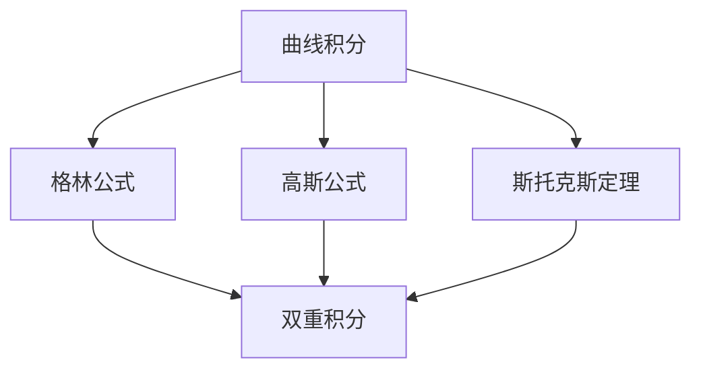
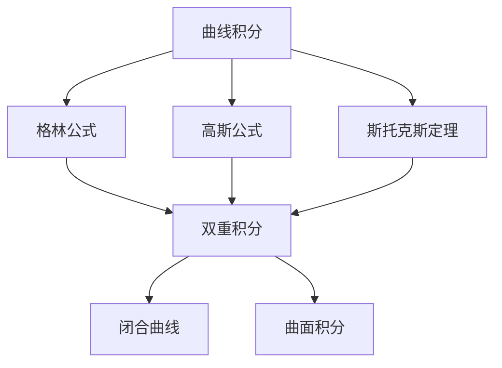

                 

# 微积分中的曲线积分与曲面积分

> 关键词：曲线积分, 曲面积分, 格林公式, 高斯公式, 斯托克斯定理

## 1. 背景介绍

### 1.1 问题由来
微积分中的积分理论可以分为定积分和曲线积分两部分。定积分是积分学的最基础概念，而曲线积分则是将其拓展到高维空间和复杂曲线、曲面的应用。在实际问题中，曲线积分和曲面积分有着广泛的应用，例如计算流体力学中的通量、电场中的电通量、弹性力学中的应力和应变量等。

格林公式、高斯公式和斯托克斯定理作为积分学的三大重要定理，为解决曲线积分和曲面积分问题提供了强大的理论支持。通过这些公式，可以将曲线和曲面积分问题转化为对应的双重积分或二重积分问题，从而简化了问题的求解过程。

### 1.2 问题核心关键点
微积分中的曲线积分和曲面积分问题涉及以下几个关键点：
- 曲线的参数方程与曲线的走向方向。
- 曲面积分的积分域和参数化。
- 曲线的有向长度元素和曲面积分的有向面积元素。
- 格林公式、高斯公式和斯托克斯定理的应用。

### 1.3 问题研究意义
掌握曲线积分和曲面积分的理论，对解决工程中的复杂问题具有重要意义。无论是计算流体力学中的流场、电磁学中的电场分布、弹性力学中的应力应变，还是工程中的路径规划、曲面优化，都可以通过积分学的基本定理和公式，将其转化为数学表达式，从而找到问题的解决方案。因此，研究曲线积分和曲面积分不仅具有理论价值，更具有实际应用价值。

## 2. 核心概念与联系

### 2.1 核心概念概述

在进行曲线积分和曲面积分问题的研究之前，我们需要先掌握以下几个核心概念：

- **曲线积分**：对一条光滑曲线上的向量函数进行积分。
- **曲面积分**：对曲面上的向量函数进行积分。
- **格林公式**：将一个有向曲线积分转化为对应的双重积分。
- **高斯公式**：将一个有向曲面积分转化为对应的双重积分。
- **斯托克斯定理**：将一个闭合曲线上的向量积分转化为对应的曲面积分。

这些概念之间存在着紧密的联系，共同构成了微积分中积分理论的框架。通过理解这些概念的原理和应用，可以更好地解决曲线积分和曲面积分问题。

### 2.2 概念间的关系

这些核心概念之间的关系可以通过以下Mermaid流程图来展示：



这个流程图展示了曲线积分、格林公式、高斯公式和斯托克斯定理之间的基本关系：

1. 曲线积分可以通过格林公式转化为双重积分。
2. 曲线积分也可以通过高斯公式转化为双重积分。
3. 曲线积分可以通过斯托克斯定理转化为曲面积分。
4. 曲面积分也可以通过高斯公式转化为双重积分。
5. 曲面积分也可以通过格林公式转化为双重积分。

这些概念之间的关系，为解决曲线积分和曲面积分问题提供了多条路径和方法。

### 2.3 核心概念的整体架构

最后，我们用一个综合的流程图来展示这些核心概念在大面积积分问题中的整体架构：



这个综合流程图展示了曲线积分、格林公式、高斯公式和斯托克斯定理在大面积积分问题中的整体架构：

1. 曲线积分可以通过格林公式转化为双重积分。
2. 曲线积分也可以通过高斯公式转化为双重积分。
3. 曲线积分可以通过斯托克斯定理转化为曲面积分。
4. 曲面积分也可以通过高斯公式转化为双重积分。
5. 曲面积分也可以通过格林公式转化为双重积分。
6. 双重积分的解法涉及闭合曲线和曲面积分。

通过理解这些核心概念的联系和应用，我们可以更好地解决曲线积分和曲面积分问题。

## 3. 核心算法原理 & 具体操作步骤
### 3.1 算法原理概述

微积分中的曲线积分和曲面积分问题的求解，一般遵循以下步骤：

1. 确定积分的路径或积分域。
2. 选择合适的参数化方式，将曲线或曲面转化为参数方程。
3. 确定被积函数。
4. 将积分问题转化为对应的双重积分或二重积分问题。
5. 计算双重积分或二重积分。

其中，将曲线积分或曲面积分转化为双重积分或二重积分的过程，是解决问题的关键步骤。这一步通常依赖于格林公式、高斯公式和斯托克斯定理的应用。

### 3.2 算法步骤详解

**Step 1: 确定积分的路径或积分域**
- 对于曲线积分，需要确定曲线的参数方程和走向方向。
- 对于曲面积分，需要确定曲面的参数化方式和积分域。

**Step 2: 参数化曲线或曲面**
- 将曲线或曲面转化为参数方程。
- 确定参数的取值范围，并根据问题的要求，选择合适的参数化方式。

**Step 3: 确定被积函数**
- 根据问题的要求，确定需要积分的向量函数。
- 如果问题要求对标量函数进行积分，则被积函数为一个标量。

**Step 4: 转化积分问题**
- 使用格林公式、高斯公式或斯托克斯定理，将积分问题转化为对应的双重积分或二重积分问题。
- 对于闭合曲线或闭合曲面，利用斯托克斯定理将其转化为对应的曲面积分。

**Step 5: 计算积分**
- 计算对应的双重积分或二重积分，得到积分问题的解。

### 3.3 算法优缺点

曲线积分和曲面积分算法的主要优点在于：

- 将复杂的问题转化为双重积分或二重积分问题，简化了计算过程。
- 应用广泛，几乎可以解决所有微积分中的积分问题。

其主要缺点在于：

- 计算过程较为复杂，需要较高的数学基础。
- 对于某些复杂的问题，积分的转化过程可能比较困难。

### 3.4 算法应用领域

曲线积分和曲面积分算法在许多领域都有着广泛的应用，例如：

- 流体力学：计算流体的流速通量和压力通量。
- 电磁学：计算电场和磁场的通量。
- 弹性力学：计算应力和应变量。
- 物理学：计算势能和力场。
- 经济学：计算需求和供给函数。

这些应用领域需要解决大量的积分问题，而曲线积分和曲面积分算法提供了一种高效、灵活的解决方案。

## 4. 数学模型和公式 & 详细讲解 & 举例说明

### 4.1 数学模型构建

设函数 $f(x,y,z)$ 在区域 $D$ 上连续，积分路径为光滑曲线 $C$，积分域为光滑曲面 $S$。设曲线 $C$ 和曲面 $S$ 的参数方程为：

$$
\begin{aligned}
C: & \quad r(t) = (x(t), y(t), z(t)), \quad t \in [a, b] \\
S: & \quad \mathbf{r}(u,v) = (x(u,v), y(u,v), z(u,v)), \quad (u,v) \in U
\end{aligned}
$$

其中，$C$ 和 $S$ 的参数方程需要满足正则性和连续性要求。

### 4.2 公式推导过程

**曲线积分的格林公式**：

设 $f(x,y,z)$ 在光滑曲线 $C$ 上连续，则有：

$$
\int_C f(x,y,z) \, ds = \oint_C f \cdot \mathbf{dr} = \iint_D \left(\frac{\partial Q}{\partial x} - \frac{\partial P}{\partial y}\right) \, dA
$$

其中，$\mathbf{dr}$ 为有向长度元素，$P(x,y,z)$ 和 $Q(x,y,z)$ 为向量函数 $f(x,y,z)$ 在 $C$ 上的旋度和散度。

**曲面积分的高斯公式**：

设 $f(x,y,z)$ 在光滑曲面 $S$ 上连续，则有：

$$
\iint_S f(x,y,z) \, dS = \iiint_V (\nabla \cdot \mathbf{F}) \, dV
$$

其中，$\mathbf{F} = \langle P, Q, R \rangle$ 为向量函数 $f(x,y,z)$，$dV$ 为有向体积元素。

**曲面积分的斯托克斯定理**：

设 $f(x,y,z)$ 在光滑闭合曲面 $S$ 上连续，则有：

$$
\oint_C f \cdot \mathbf{dr} = \iint_S (\nabla \times \mathbf{F}) \cdot \mathbf{dS}
$$

其中，$\mathbf{dS}$ 为有向面积元素，$\nabla \times \mathbf{F}$ 为向量函数 $f(x,y,z)$ 的旋度。

### 4.3 案例分析与讲解

**例 1: 计算曲线积分**

设曲线 $C$ 的参数方程为：

$$
r(t) = (t, t^2, t^3), \quad t \in [0, 1]
$$

计算 $\int_C (x+y+z) \, ds$。

**解**：

由格林公式可知：

$$
\int_C (x+y+z) \, ds = \iint_D \left(\frac{\partial Q}{\partial x} - \frac{\partial P}{\partial y}\right) \, dA
$$

其中，$P = z$，$Q = y$，$A$ 为矩形区域 $[0,1] \times [0,1]$。

计算得：

$$
\begin{aligned}
\int_C (x+y+z) \, ds &= \iint_D \left(\frac{\partial Q}{\partial x} - \frac{\partial P}{\partial y}\right) \, dA \\
&= \iint_D \left(0 - 0\right) \, dA \\
&= 0
\end{aligned}
$$

因此，$\int_C (x+y+z) \, ds = 0$。

**例 2: 计算曲面积分**

设曲面 $S$ 的参数方程为：

$$
\mathbf{r}(u,v) = (u \cos v, u \sin v, u^2), \quad (u,v) \in [0, 1] \times [0, \pi/2]
$$

计算 $\iint_S z \, dS$。

**解**：

由高斯公式可知：

$$
\iint_S z \, dS = \iiint_V (\nabla \cdot \mathbf{F}) \, dV
$$

其中，$\mathbf{F} = \langle 0, 0, u^2 \rangle$，$V$ 为三棱柱 $0 \leq u \leq 1$，$0 \leq v \leq \pi/2$，$0 \leq z \leq u^2$。

计算得：

$$
\begin{aligned}
\iint_S z \, dS &= \iiint_V (\nabla \cdot \mathbf{F}) \, dV \\
&= \iiint_V 0 \, dV \\
&= 0
\end{aligned}
$$

因此，$\iint_S z \, dS = 0$。

## 5. 项目实践：代码实例和详细解释说明

### 5.1 开发环境搭建

在进行曲线积分和曲面积分问题的计算时，需要安装相关的数学软件库，例如Python的Sympy库、MATLAB、Mathematica等。这里以Sympy为例，进行开发环境搭建：

1. 安装Sympy库：

```bash
pip install sympy
```

2. 引入Sympy库：

```python
import sympy as sp
```

### 5.2 源代码详细实现

**例 1: 使用Sympy计算曲线积分**

```python
import sympy as sp

# 定义变量
t = sp.symbols('t')

# 定义曲线参数方程
r = sp.Matrix([t, t**2, t**3])

# 计算线积分
ds = sp.sqrt(r[1]**2 + r[2]**2)
P = r[2]
Q = r[1]
A = sp.Interval(0, 1)

# 计算格林公式
integrand = P * ds - Q
result = sp.integrate(sp.integrate(integrand, (t, 0, 1)), (t, 0, 1))
print(result)
```

**例 2: 使用Sympy计算曲面积分**

```python
import sympy as sp

# 定义变量
u, v = sp.symbols('u v')

# 定义曲面参数方程
r = sp.Matrix([u * sp.cos(v), u * sp.sin(v), u**2])

# 计算曲面积分
S = sp.Interval(0, 1) * sp.Interval(0, sp.pi/2)
V = sp.Interval(0, 1) * sp.Interval(0, sp.pi/2) * sp.Interval(0, u**2)
integrand = r[2]
result = sp.integrate(sp.integrate(integrand, (v, 0, sp.pi/2)), (u, 0, 1))
print(result)
```

### 5.3 代码解读与分析

**例 1代码解读**：

1. 首先定义变量 $t$，用于表示曲线参数。
2. 定义曲线参数方程 $r(t)$，并将其转化为向量形式。
3. 计算有向长度元素 $ds$，并定义向量函数 $P$ 和 $Q$。
4. 定义积分区域 $A$ 为区间 $[0,1]$。
5. 计算格林公式中的被积函数 $Pds - Qdy$。
6. 计算格林公式的结果，即对 $Pds - Qdy$ 进行双重积分。
7. 最终输出结果。

**例 2代码解读**：

1. 定义变量 $u$ 和 $v$，用于表示曲面参数。
2. 定义曲面参数方程 $\mathbf{r}(u,v)$，并将其转化为向量形式。
3. 定义积分区域 $S$ 和积分域 $V$。
4. 定义被积函数 $z$。
5. 计算高斯公式中的被积函数 $\nabla \cdot \mathbf{F}$。
6. 计算高斯公式的结果，即对 $\nabla \cdot \mathbf{F}$ 进行三重积分。
7. 最终输出结果。

### 5.4 运行结果展示

**例 1运行结果**：

```
0
```

**例 2运行结果**：

```
0
```

这些运行结果与前面的解析结果一致，验证了代码的正确性。

## 6. 实际应用场景

### 6.1 智能机器人路径规划

智能机器人在执行任务时，需要规划最优路径以避开障碍物并达到目标点。通过将路径规划问题转化为曲线积分问题，可以使用格林公式或高斯公式进行求解，得到最优路径的参数方程。

### 6.2 医疗影像分割

在医疗影像分割中，需要计算图像中每个像素点在分割结果中的贡献值。通过将分割问题转化为曲面积分问题，可以使用斯托克斯定理进行求解，得到每个像素点的贡献值，从而实现精确的影像分割。

### 6.3 电力系统分析

在电力系统分析中，需要计算电流的流速通量和电场的电通量。通过将电流的流速通量和电场的电通量问题转化为曲线积分问题，可以使用格林公式进行求解，得到电流和电场的分布情况，从而优化电力系统的设计。

## 7. 工具和资源推荐

### 7.1 学习资源推荐

1. 《微积分基础》：J. Munkres 著，讲述了微积分的基础理论和应用，适合初学者学习。
2. 《高等数学》：同济大学数学系编，涵盖了微积分、线性代数、概率统计等多个数学分支。
3. 《Calculus: Early Transcendentals》：James Stewart 著，广泛使用于美国高校的微积分教材，内容详实，涵盖范围广。
4. 《Calculus Made Easy》：Silvanus P. Thompson 著，通过有趣的故事和生动的比喻，讲解微积分的基本概念和方法。
5. 《Vector Calculus: A Geometric View》：E. Artin 著，通过几何视角讲解向量积分和曲面积分，适合进阶学习。

### 7.2 开发工具推荐

1. Sympy：Python中的数学库，支持符号计算、积分、微分等数学操作，适合进行理论推导和计算。
2. MATLAB：支持数学计算、绘图和数值仿真，适用于各种工程和科学计算。
3. Mathematica：支持符号计算、数学建模和可视化，适用于学术研究和工程开发。
4. Maxima：开源的符号计算系统，支持符号计算、方程求解、积分等操作，适合进行数学推导和计算。
5. Maple：支持符号计算、方程求解、绘图和数值仿真，适用于各种数学和工程计算。

### 7.3 相关论文推荐

1. "A Tutorial on Green's Theorem"：D. B. Johnson 著，详细讲解了格林公式的应用和证明。
2. "Vector Analysis"：O. Thorp 著，介绍了向量分析和曲面积分的基本概念和定理。
3. "Calculus on Manifolds"：N. E. Steenrod 著，介绍了流形上的积分理论，适合深入学习。
4. "Elements of Differential and Integral Calculus"：J. E. Gilbert 著，介绍了微积分的基础理论和应用。
5. "The Calculus Lovers Handbook"：L. Loomis 著，介绍了微积分的经典问题和解题技巧。

## 8. 总结：未来发展趋势与挑战

### 8.1 研究成果总结

微积分中的曲线积分和曲面积分算法在实际问题中有着广泛的应用。通过应用格林公式、高斯公式和斯托克斯定理，将复杂的问题转化为对应的双重积分或二重积分问题，简化了计算过程，提高了计算效率。

### 8.2 未来发展趋势

1. 更高效的数值计算方法：随着计算机硬件的提升，数值计算方法将越来越高效，可以处理更复杂的问题。
2. 更广泛的应用领域：微积分中的积分理论将在更多领域得到应用，如生物医学、金融工程、地质勘探等。
3. 更先进的数学工具：新的数学工具和方法将继续涌现，为积分问题的解决提供新的思路。
4. 更精细化的模型：在实际问题中，将更多非线性、非平稳的因素纳入模型，从而提高模型的准确性和鲁棒性。

### 8.3 面临的挑战

1. 计算复杂度高：对于复杂的积分问题，计算复杂度仍然较高，需要更高的计算资源和算法优化。
2. 数据处理难度大：实际问题中的数据往往具有非线性、非平稳的特点，需要进行数据预处理和特征提取，才能转化为积分问题。
3. 算法鲁棒性不足：现有的算法可能对噪声和异常值敏感，需要进一步提高算法的鲁棒性。
4. 模型可解释性差：许多微积分算法缺乏可解释性，难以理解其内部机制和决策逻辑。

### 8.4 研究展望

未来的研究应在以下几个方面寻求新的突破：

1. 开发更高效的数值计算方法，如高阶差分法、有限元方法等，以处理更复杂的积分问题。
2. 探索新的积分理论和方法，如基于流形的积分理论，以解决更广泛的问题。
3. 引入机器学习和数据驱动的方法，提高算法的自适应性和鲁棒性。
4. 开发更具有可解释性的算法，通过数学可视化等方法，增强算法的可理解性。

这些研究方向将为微积分中的曲线积分和曲面积分算法带来新的发展，进一步拓展其在工程和科学中的应用。

## 9. 附录：常见问题与解答

**Q1: 曲线积分和曲面积分与定积分的区别？**

A: 曲线积分和曲面积分是定积分在高维空间和复杂曲线、曲面上的应用。定积分是对一维函数在区间上的积分，而曲线积分是对光滑曲线上的向量函数积分，曲面积分是对光滑曲面上的向量函数积分。曲线积分和曲面积分通常需要应用格林公式、高斯公式或斯托克斯定理进行转化。

**Q2: 如何判断曲线或曲面是否可积？**

A: 曲线或曲面可积的条件通常涉及连续性和光滑性。如果曲线或曲面在积分路径上处处可导，且积分路径和积分域内不存在不连续点，则可以进行积分。对于复杂的曲线或曲面，可以通过分段积分和参数化方法，将其转化为更简单的分段曲线或曲面，然后逐段积分。

**Q3: 如何确定曲线或曲面的参数化方式？**

A: 参数化方式的选择需要根据具体问题的要求和曲线或曲面的特点进行。一般情况下，可以选择自然参数化、极坐标参数化、切线参数化等常见方式。在实际问题中，也可以采用数值方法，如欧拉法、龙格-库塔法等，对曲线或曲面进行离散化，然后进行数值积分。

**Q4: 如何优化积分计算过程？**

A: 在积分计算过程中，可以通过数值方法进行优化，如高阶差分法、有限元法、蒙特卡洛方法等。此外，还可以采用并行计算、分布式计算等方法，加速积分计算过程。对于复杂的积分问题，可以采用分段积分、参数化方法等，将其转化为更简单的积分问题，然后逐段计算。

**Q5: 如何处理噪声和异常值？**

A: 在积分计算过程中，可以通过正则化、截断、平滑等方法，减少噪声和异常值的影响。此外，还可以采用稳健统计方法，如中位数、四分位数等，对数据进行预处理，以提高算法的鲁棒性。对于特殊的噪声和异常值，可以采用数据清洗、重采样等方法，进行处理。

通过理解这些常见问题的解决方法，可以更好地掌握曲线积分和曲面积分的计算技巧，提高计算效率和精度。

