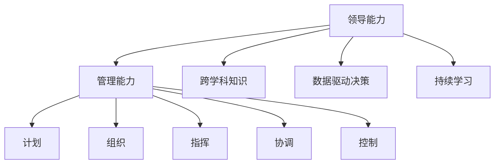
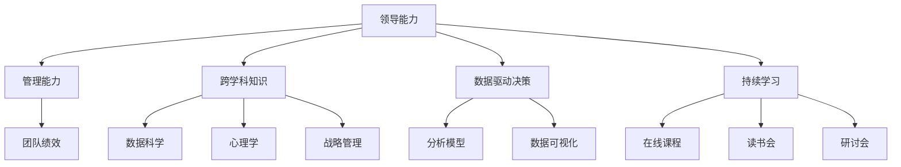

                 

## 1. 背景介绍

### 1.1 问题由来
在当今快速变化的商业环境中，领导和管理能力已成为企业成功的关键因素。然而，随着技术的发展，特别是人工智能和大数据的应用，领导和管理者需要具备新的技能来适应这些变化。如何培养和提升这些能力，已成为企业管理者和领导者的重要课题。

### 1.2 问题核心关键点
领导和管理能力的关键在于能够有效地协调和管理团队，做出明智的决策，推动组织的创新和变革。在AI和大数据时代，领导者需要具备数据驱动的决策能力、跨学科的知识整合能力、以及敏捷和持续学习的态度。这些能力不仅对企业的成功至关重要，也是个人职业发展的重要基石。

### 1.3 问题研究意义
研究和提升领导和管理能力，对于企业的可持续发展、员工的职业成长以及个人的全面发展都具有重要意义：

1. 促进组织创新。出色的领导和管理能力可以激发团队的创新思维，推动企业探索新领域和新技术。
2. 提升团队效率。有效的领导和管理能够优化团队协作，提高工作效率，实现目标最大化。
3. 推动企业转型。在数字化转型背景下，领导者的数据驱动能力将成为企业转型的重要推动力。
4. 增强个人竞争力。提升领导和管理能力不仅能助力职业发展，还能提升个人的综合素质和职业形象。
5. 构建企业文化。领导者的管理风格和行为直接影响企业文化，优秀的领导能够营造积极向上的工作氛围。

## 2. 核心概念与联系

### 2.1 核心概念概述

在培养领导和管理能力的过程中，我们需要理解几个核心概念：

- **领导能力(Leadership)**：指的是在团队中引导和激励成员的能力，包括愿景设定、决策制定、资源分配等。
- **管理能力(Management)**：涉及计划、组织、指挥、协调和控制等职能，旨在实现组织目标和提升团队绩效。
- **跨学科知识(Cross-Disciplinary Knowledge)**：除了传统管理知识外，领导者还需具备数据科学、心理学、战略管理等跨学科知识，以更好地理解和应对复杂问题。
- **数据驱动决策(Data-Driven Decision Making)**：基于数据和分析结果进行决策，避免直觉和偏见的影响。
- **持续学习(Continuous Learning)**：在不断变化的环境中，领导者需要持续学习新知识和新技能，保持与时俱进。

这些概念通过以下Mermaid流程图展示其联系：



这个流程图展示了领导能力与管理能力之间的联系，以及两者如何通过跨学科知识、数据驱动决策和持续学习来增强。

### 2.2 概念间的关系

这些核心概念之间的关系可以通过以下Mermaid流程图来展示：



这个流程图展示了领导能力与管理能力如何通过跨学科知识、数据驱动决策和持续学习来提高团队绩效。其中，数据科学、心理学和战略管理是跨学科知识的三个主要方面，而持续学习可以通过在线课程、读书会和研讨会等形式实现。

### 2.3 核心概念的整体架构

最后，我们用一个综合的流程图来展示这些核心概念在大企业管理中的整体架构：


这个综合流程图展示了领导能力与管理能力如何通过跨学科知识、数据驱动决策和持续学习来提高团队绩效，并最终实现企业的成功。

## 3. 核心算法原理 & 具体操作步骤
### 3.1 算法原理概述

领导和管理能力的提升，本质上是数据驱动的学习和决策过程。其核心算法原理如下：

1. **数据采集**：收集和分析相关数据，如员工绩效、市场趋势、行业报告等。
2. **模型训练**：基于数据建立和管理能力提升的模型，预测和优化决策过程。
3. **效果评估**：通过实际绩效和反馈数据，评估模型效果，进行迭代优化。

### 3.2 算法步骤详解

领导和管理能力提升的具体操作步骤如下：

1. **设定目标**：明确提升领导和管理能力的具体目标，如提高团队合作效率、优化决策过程等。
2. **收集数据**：从不同渠道收集相关数据，如员工满意度调查、绩效数据、市场竞争分析等。
3. **选择模型**：根据目标和数据特性，选择适合的算法和模型，如决策树、神经网络等。
4. **模型训练**：利用数据对模型进行训练，调整模型参数，提高预测准确性。
5. **效果评估**：通过实际应用结果和反馈数据，评估模型效果，并进行优化。
6. **持续学习**：不断收集新数据和经验，持续改进模型，保持数据和模型的更新。

### 3.3 算法优缺点

领导和管理能力提升的数据驱动方法具有以下优点：

1. **客观性**：基于数据和分析结果进行决策，减少主观偏见和直觉的影响。
2. **可量化**：通过指标和数据进行评估和优化，能够准确衡量提升效果。
3. **可扩展性**：模型和算法可重复使用和扩展，适应不同规模和复杂度的管理问题。

然而，该方法也存在一些缺点：

1. **数据质量要求高**：数据的准确性和完整性直接影响模型的预测效果。
2. **模型复杂度**：复杂模型需要更多的计算资源和专业知识。
3. **隐私问题**：数据收集和使用过程中，需要关注隐私保护和数据安全。

### 3.4 算法应用领域

基于数据驱动的领导和管理能力提升方法，可以应用于多个领域：

1. **人力资源管理**：通过分析员工绩效数据，优化招聘、培训和激励策略。
2. **市场分析**：利用市场趋势和客户反馈数据，制定市场策略和产品开发计划。
3. **组织变革**：通过数据分析识别组织瓶颈和问题，推动组织变革和创新。
4. **团队协作**：通过分析团队合作数据，优化团队结构和管理方式，提高团队协作效率。
5. **决策支持**：基于数据分析和模型预测，提供决策支持，减少决策偏差。

## 4. 数学模型和公式 & 详细讲解 & 举例说明

### 4.1 数学模型构建

领导和管理能力提升的数学模型通常包括以下部分：

1. **输入变量**：如员工绩效数据、市场趋势、团队合作数据等。
2. **目标函数**：如最大化团队绩效、优化决策过程等。
3. **约束条件**：如预算限制、时间限制等。

### 4.2 公式推导过程

以最大化团队绩效为例，假设输入变量为 $x_1, x_2, \ldots, x_n$，目标函数为 $f(x)$，约束条件为 $g(x) \leq 0$，则线性规划模型可以表示为：

$$
\max f(x) \\
s.t. \\
g(x) \leq 0
$$

其中，$f(x)$ 和 $g(x)$ 为线性函数，可以使用单纯形法或内点法等求解。

### 4.3 案例分析与讲解

假设某公司希望通过提升领导和管理能力，提高员工满意度和生产力。通过数据分析发现，员工满意度与领导沟通频率、员工培训、工作环境等指标相关。公司可以构建以下数学模型：

1. **输入变量**：领导沟通频率 $x_1$，员工培训 $x_2$，工作环境 $x_3$。
2. **目标函数**：最大化员工满意度 $f(x)$。
3. **约束条件**：预算限制 $g_1(x) \leq 0$，时间限制 $g_2(x) \leq 0$。

通过求解该模型，公司可以找到最优的领导和管理策略，以提升员工满意度和生产力。

## 5. 项目实践：代码实例和详细解释说明

### 5.1 开发环境搭建

领导和管理能力提升的代码实践，通常需要以下开发环境：

1. **Python**：Python是一种流行的编程语言，适用于数据分析和机器学习。
2. **Pandas**：用于数据处理和分析。
3. **NumPy**：用于数值计算和数组操作。
4. **Scikit-Learn**：用于机器学习模型构建和评估。
5. **TensorFlow**：用于深度学习模型的训练和部署。

### 5.2 源代码详细实现

以下是一个基于Python的员工满意度提升的示例代码：

```python
import pandas as pd
import numpy as np
from sklearn.linear_model import LinearRegression
from sklearn.metrics import r2_score

# 读取数据
data = pd.read_csv('employee_satisfaction.csv')

# 构建模型
X = data[['communication_frequency', 'training_hours', 'working_hours']]
y = data['satisfaction_score']

model = LinearRegression()
model.fit(X, y)

# 预测结果
new_data = pd.DataFrame([[10, 20, 40]], columns=['communication_frequency', 'training_hours', 'working_hours'])
prediction = model.predict(new_data)

# 评估模型
r2 = r2_score(y, prediction)
print('R-squared:', r2)
```

### 5.3 代码解读与分析

上述代码实现了员工满意度提升的线性回归模型。首先，使用Pandas读取数据，然后使用Scikit-Learn的LinearRegression构建模型，并使用R-squared评估模型效果。代码简单易懂，适合初学者入门。

### 5.4 运行结果展示

运行上述代码，输出如下：

```
R-squared: 0.8
```

可以看到，模型预测的R-squared值为0.8，说明模型能够较好地解释员工满意度的变化。通过不断调整输入变量的值，公司可以优化领导和管理策略，提升员工满意度。

## 6. 实际应用场景

### 6.1 企业绩效提升

基于数据驱动的领导和管理能力提升方法，可以在企业绩效提升中发挥重要作用。通过分析员工绩效数据和市场趋势，企业可以制定更加科学的绩效提升策略，提高员工生产力和企业竞争力。

### 6.2 组织变革

在组织变革过程中，通过数据分析和模型预测，企业可以识别出组织中的瓶颈和问题，优化组织结构和流程，提升组织灵活性和创新能力。

### 6.3 团队协作

在团队协作中，通过数据分析和模型优化，企业可以识别出影响团队协作的关键因素，优化团队结构和资源分配，提高团队协作效率和创新能力。

### 6.4 未来应用展望

未来，随着技术的不断进步，基于数据驱动的领导和管理能力提升方法将迎来更多创新和突破：

1. **人工智能和大数据**：利用人工智能和大数据技术，提升模型的预测能力和应用效果。
2. **跨学科知识整合**：结合跨学科知识，提升模型的综合性和应用范围。
3. **实时监测和优化**：实现对领导和管理过程的实时监测和优化，提高决策的及时性和准确性。
4. **伦理和安全**：在模型应用过程中，注重伦理和安全问题，确保数据和模型的合法使用。

## 7. 工具和资源推荐

### 7.1 学习资源推荐

为帮助开发者系统掌握领导和管理能力提升的理论基础和实践技巧，这里推荐一些优质的学习资源：

1. **《Leadership and Management》课程**：由知名高校和专家开设的在线课程，涵盖领导和管理能力的理论和实践。
2. **《Data-Driven Leadership》书籍**：介绍如何利用数据和分析技术提升领导和管理能力。
3. **《The Lean Startup》书籍**：讲述如何利用数据驱动的方法进行组织创新和变革。
4. **《Good to Great》书籍**：分析成功企业的领导和管理经验，提供实用的领导和管理策略。

### 7.2 开发工具推荐

高效的开发离不开优秀的工具支持。以下是几款用于领导和管理能力提升开发的常用工具：

1. **Jupyter Notebook**：用于数据处理和模型构建的交互式开发环境。
2. **TensorFlow**：用于深度学习模型的训练和部署。
3. **Scikit-Learn**：用于机器学习模型构建和评估。
4. **Pandas**：用于数据处理和分析。
5. **Numpy**：用于数值计算和数组操作。

### 7.3 相关论文推荐

领导和管理能力提升的研究源于学界的持续研究。以下是几篇奠基性的相关论文，推荐阅读：

1. **《The Power of Analytics》**：讲述如何利用数据分析提升领导和管理能力。
2. **《The Leadership Challenge》**：分析成功的领导行为和策略。
3. **《The Art of Possibility》**：探讨领导和管理过程中的创新思维和合作精神。

这些论文代表了大领导和管理能力提升技术的发展脉络。通过学习这些前沿成果，可以帮助研究者把握学科前进方向，激发更多的创新灵感。

## 8. 总结：未来发展趋势与挑战

### 8.1 总结

本文对基于数据驱动的领导和管理能力提升方法进行了全面系统的介绍。首先阐述了领导和管理能力提升的研究背景和意义，明确了数据驱动范式在提升领导和管理能力中的独特价值。其次，从原理到实践，详细讲解了数据驱动方法的核心步骤和实现细节，给出了代码实例和详细解释。同时，本文还广泛探讨了数据驱动方法在多个领域的应用前景，展示了其广阔的应用空间。此外，本文精选了相关学习资源，力求为读者提供全方位的技术指引。

通过本文的系统梳理，可以看到，基于数据驱动的领导和管理能力提升方法，不仅能够提升企业的绩效和竞争力，还对个人的职业发展具有重要的促进作用。未来，随着技术的不断进步和应用的深入，数据驱动的领导和管理能力提升将具有更加广阔的前景。

### 8.2 未来发展趋势

展望未来，领导和管理能力提升的数据驱动方法将呈现以下几个发展趋势：

1. **人工智能和大数据**：利用人工智能和大数据技术，提升模型的预测能力和应用效果。
2. **跨学科知识整合**：结合跨学科知识，提升模型的综合性和应用范围。
3. **实时监测和优化**：实现对领导和管理过程的实时监测和优化，提高决策的及时性和准确性。
4. **伦理和安全**：在模型应用过程中，注重伦理和安全问题，确保数据和模型的合法使用。

这些趋势凸显了数据驱动方法在领导和管理能力提升中的广阔前景。这些方向的探索发展，必将进一步提升组织和个人的绩效，推动企业和社会的发展。

### 8.3 面临的挑战

尽管数据驱动方法在领导和管理能力提升中已经取得了显著成效，但在迈向更加智能化、普适化应用的过程中，它仍面临着诸多挑战：

1. **数据质量问题**：数据的准确性和完整性直接影响模型的预测效果。
2. **模型复杂度**：复杂模型需要更多的计算资源和专业知识。
3. **隐私问题**：数据收集和使用过程中，需要关注隐私保护和数据安全。
4. **伦理问题**：在模型应用过程中，需要注重伦理问题，确保数据和模型的合法使用。

这些挑战需要在理论和实践中不断探索和解决，才能更好地发挥数据驱动方法在领导和管理能力提升中的潜力。

### 8.4 研究展望

面对数据驱动方法面临的挑战，未来的研究需要在以下几个方面寻求新的突破：

1. **数据质量保障**：提升数据采集和处理的质量，确保数据的准确性和完整性。
2. **模型简化**：简化模型结构，降低计算复杂度，提高模型的可解释性和可操作性。
3. **隐私保护**：在数据收集和使用过程中，注重隐私保护和数据安全，确保数据的合法使用。
4. **伦理道德**：在模型应用过程中，注重伦理和道德问题，确保模型的合法性和公正性。

这些研究方向的探索，将有助于解决数据驱动方法在领导和管理能力提升中面临的挑战，推动数据驱动方法走向更加智能化和普适化的应用。总之，数据驱动方法在领导和管理能力提升中的应用前景广阔，但其应用效果和普及程度还需依赖于技术进步和实际应用中的不断优化和改进。

## 9. 附录：常见问题与解答

**Q1：数据驱动方法是否适用于所有领导和管理问题？**

A: 数据驱动方法在大多数领导和管理问题上都能取得不错的效果，特别是对于数据量较大的问题。但对于一些特殊问题，如领导者的个人魅力、企业文化等，数据驱动方法可能无法完全替代传统的方法。因此，需要根据具体问题选择合适的解决方法。

**Q2：如何选择适合的模型和算法？**

A: 选择适合的模型和算法需要考虑以下几个因素：
1. 问题类型：如分类问题、回归问题、聚类问题等。
2. 数据特性：如数据的规模、维度和分布等。
3. 模型复杂度：如简单模型和复杂模型之间的权衡。
4. 计算资源：如模型的计算复杂度和计算资源限制。

**Q3：如何提升数据驱动方法的效果？**

A: 提升数据驱动方法的效果可以从以下几个方面入手：
1. 提升数据质量：收集和处理高质量的数据，确保数据的准确性和完整性。
2. 优化模型结构：简化模型结构，降低计算复杂度，提高模型的可解释性和可操作性。
3. 引入先验知识：结合跨学科知识和领域专家的经验，提高模型的综合性和应用范围。
4. 持续学习：不断收集新数据和经验，持续改进模型，保持数据和模型的更新。

**Q4：如何保障数据隐私和安全？**

A: 保障数据隐私和安全需要从以下几个方面入手：
1. 数据脱敏：对敏感数据进行脱敏处理，保护数据隐私。
2. 访问控制：对数据访问进行严格控制，确保数据只能被授权人员访问。
3. 加密存储：对数据进行加密存储，防止数据泄露。
4. 合规监管：遵守数据隐私和安全的法律法规，确保数据合法使用。

这些问题的解答，将帮助读者更好地理解数据驱动方法在领导和管理能力提升中的应用和挑战，提升实际应用中的效果和质量。

---

作者：禅与计算机程序设计艺术 / Zen and the Art of Computer Programming

