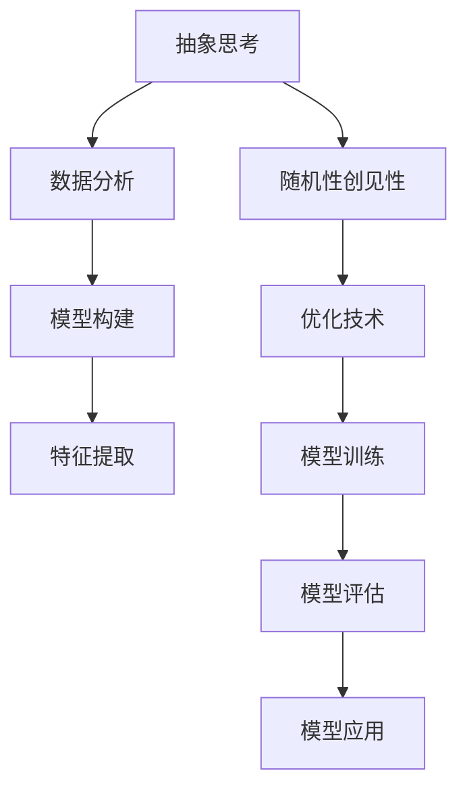

                 

# 抽象思考与随机性创见性

## 1. 背景介绍

在信息技术迅猛发展的今天，抽象思考和随机性创见性在推动技术进步中扮演着至关重要的角色。在人工智能领域，这两个概念不仅影响着模型的设计和优化，也深刻地塑造了数据挖掘、机器学习、自然语言处理等前沿方向的研究方法和应用策略。本文将探讨抽象思考和随机性创见性在大数据、深度学习及人工智能研究中的重要性，并分析其对未来发展的潜在影响。

## 2. 核心概念与联系

### 2.1 核心概念概述

要深入理解抽象思考和随机性创见性，首先需要界定这两个概念的含义和关系：

- **抽象思考**：这是一种思维方式，通过将具体事物抽象为更抽象的概念或模型，来理解和处理复杂问题。在人工智能中，抽象思考通常涉及对数据的分析、模型的构建和特征的提取，是实现数据驱动决策和智能化自动化流程的基础。

- **随机性创见性**：这是指通过随机事件和过程，在未知或不确定的情境下发现新的可能性、模式或解决方案。在人工智能中，随机性创见性通过随机梯度下降（SGD）、遗传算法等优化技术体现，推动模型在复杂问题上的泛化能力和创新性。

两者的联系在于：抽象思考为随机性创见性提供了理论基础和设计框架，而随机性创见性则使抽象思考的结果在实际应用中具备了更高的灵活性和适应性。

### 2.2 概念间的关系

为了更清晰地理解这两个概念的联系，以下是一个Mermaid流程图：



这个流程图展示了抽象思考和随机性创见性在人工智能研究中的整体流程。抽象思考帮助理解数据和问题，而随机性创见性则通过优化算法实现模型训练，两者共同驱动模型在实际应用中的性能提升。

## 3. 核心算法原理 & 具体操作步骤

### 3.1 算法原理概述

基于抽象思考和随机性创见性的人工智能研究，主要集中在以下几个关键算法：

- **深度学习**：通过多层神经网络对数据进行抽象提取，然后通过随机梯度下降等优化算法进行训练。
- **遗传算法**：模拟生物进化过程，通过随机选择和交叉操作来寻找最优解。
- **强化学习**：通过奖励和惩罚机制，使模型在与环境互动的过程中学习决策策略。

这些算法都依赖于对数据和问题的抽象思考，以及对随机性创见性的利用。

### 3.2 算法步骤详解

下面以深度学习为例，详细讲解深度学习的算法步骤：

1. **数据预处理**：将原始数据转换为模型可以处理的格式，如图像数据转换为张量，文本数据转换为词向量。

2. **模型构建**：选择合适的神经网络结构和参数，如卷积神经网络（CNN）、循环神经网络（RNN）等，设定隐藏层数和节点数。

3. **损失函数设计**：根据任务需求设计损失函数，如均方误差（MSE）、交叉熵（CE）等，衡量模型预测与真实值之间的差距。

4. **模型训练**：使用随机梯度下降（SGD）等优化算法，通过迭代调整模型参数来最小化损失函数。

5. **模型评估**：在验证集或测试集上评估模型性能，如准确率、精确率、召回率等指标。

6. **模型应用**：将训练好的模型应用于实际问题中，如图像分类、文本生成等任务。

### 3.3 算法优缺点

深度学习算法在处理复杂数据和任务时表现出色，但也存在以下缺点：

- **模型复杂性高**：深层网络参数量巨大，需要大量计算资源和数据支持。
- **过拟合风险**：在训练集上过拟合现象严重，可能导致模型泛化性能差。
- **可解释性差**：模型黑盒性质明显，难以解释模型内部决策过程。

随机性创见性算法通过引入随机性，可以在一定程度上缓解过拟合问题，并增强模型的泛化能力。然而，它们通常需要更多的计算资源和时间，且难以保证每次运行结果的一致性。

### 3.4 算法应用领域

深度学习和随机性创见性算法在多个领域得到了广泛应用：

- **计算机视觉**：如图像分类、目标检测、图像生成等任务。
- **自然语言处理**：如文本分类、机器翻译、情感分析等任务。
- **语音识别**：如自动语音识别、语音合成等任务。
- **强化学习**：如自动驾驶、游戏AI、机器人控制等任务。

## 4. 数学模型和公式 & 详细讲解

### 4.1 数学模型构建

深度学习模型的数学模型通常可以表示为：

$$
y = f(x; \theta)
$$

其中 $y$ 表示模型的输出，$x$ 表示输入数据，$\theta$ 表示模型的参数。

### 4.2 公式推导过程

以线性回归为例，假设模型为 $y = \theta_0 + \theta_1 x_1 + \theta_2 x_2 + \cdots + \theta_n x_n$，损失函数为均方误差（MSE）：

$$
L(\theta) = \frac{1}{2N} \sum_{i=1}^{N} (y_i - f(x_i; \theta))^2
$$

其中 $N$ 表示样本数量，$x_i$ 和 $y_i$ 分别表示样本的输入和输出。梯度下降算法的更新公式为：

$$
\theta_k = \theta_k - \alpha \frac{\partial L(\theta)}{\partial \theta_k}
$$

其中 $\alpha$ 为学习率，$\frac{\partial L(\theta)}{\partial \theta_k}$ 为损失函数对参数 $\theta_k$ 的梯度。

### 4.3 案例分析与讲解

以手写数字识别为例，输入数据 $x$ 是一个28x28的图像像素值，输出 $y$ 是0-9之间的数字。模型通过卷积和池化操作提取图像特征，然后通过全连接层进行分类。在训练过程中，通过随机梯度下降算法调整模型参数，最小化损失函数，从而实现对手写数字的准确识别。

## 5. 项目实践：代码实例和详细解释说明

### 5.1 开发环境搭建

为了实践深度学习模型，我们需要配置以下开发环境：

1. 安装Python和相关库：如numpy、scipy、matplotlib、pandas等。
2. 安装深度学习框架：如TensorFlow、PyTorch等。
3. 安装相关数据集：如MNIST手写数字数据集。

### 5.2 源代码详细实现

以TensorFlow为例，实现一个简单的线性回归模型：

```python
import tensorflow as tf
import numpy as np

# 准备数据
x_train = np.random.randn(100, 1)
y_train = 0.1 * x_train + np.random.randn(100, 1)

# 定义模型
model = tf.keras.Sequential([
    tf.keras.layers.Dense(1, input_shape=[1])
])

# 定义损失函数和优化器
loss_fn = tf.keras.losses.MeanSquaredError()
optimizer = tf.keras.optimizers.SGD(learning_rate=0.1)

# 训练模型
for epoch in range(100):
    with tf.GradientTape() as tape:
        y_pred = model(x_train)
        loss_value = loss_fn(y_pred, y_train)
    gradients = tape.gradient(loss_value, model.trainable_variables)
    optimizer.apply_gradients(zip(gradients, model.trainable_variables))

# 评估模型
x_test = np.random.randn(10, 1)
y_test = 0.1 * x_test + np.random.randn(10, 1)
y_pred = model(x_test)
print(tf.keras.metrics.mean_squared_error(y_test, y_pred).numpy())
```

### 5.3 代码解读与分析

在上述代码中，我们首先准备了一个简单的训练集，然后使用TensorFlow构建了一个包含一个全连接层的线性回归模型。接着，定义了损失函数和优化器，并通过梯度下降算法训练模型。最后，在测试集上评估了模型的性能。

## 6. 实际应用场景

### 6.1 计算机视觉

在计算机视觉领域，抽象思考和随机性创见性主要应用于图像分类、目标检测、图像生成等任务。通过抽象思考，将图像数据转换为网络可以处理的特征表示，然后通过随机性创见性算法优化模型，实现高效准确的图像处理。

### 6.2 自然语言处理

在自然语言处理领域，抽象思考和随机性创见性主要应用于文本分类、机器翻译、情感分析等任务。通过抽象思考，将文本数据转换为向量表示，然后通过随机性创见性算法优化模型，实现高效的文本处理。

### 6.3 强化学习

在强化学习领域，抽象思考和随机性创见性主要应用于自动驾驶、游戏AI、机器人控制等任务。通过抽象思考，将环境数据转换为模型可以处理的格式，然后通过随机性创见性算法优化模型，实现智能决策。

## 7. 工具和资源推荐

### 7.1 学习资源推荐

- **Deep Learning Specialization**（吴恩达教授）：斯坦福大学开设的深度学习课程，涵盖了深度学习的基础和进阶内容，是入门学习的好资源。
- **Pattern Recognition and Machine Learning**（Christopher Bishop）：经典教材，详细介绍了机器学习的基本原理和算法。
- **Neural Networks and Deep Learning**（Michael Nielsen）：在线书籍，深入浅出地介绍了神经网络的基本概念和应用。

### 7.2 开发工具推荐

- **TensorFlow**：Google开发的深度学习框架，支持分布式训练和高效的模型部署。
- **PyTorch**：Facebook开发的深度学习框架，支持动态图和高效的模型训练。
- **JAX**：谷歌开发的自动微分库，支持高效的模型训练和优化。

### 7.3 相关论文推荐

- **Deep Learning**（Ian Goodfellow、Yoshua Bengio、Aaron Courville）：深度学习领域的经典教材，详细介绍了深度学习的理论和应用。
- **ImageNet Classification with Deep Convolutional Neural Networks**（Alex Krizhevsky、Ilya Sutskever、Geoffrey Hinton）：介绍卷积神经网络的经典论文，开创了深度学习在图像分类任务中的应用。
- **Attention Is All You Need**（Ashish Vaswani等）：介绍Transformer结构的经典论文，开启了深度学习在自然语言处理任务中的应用。

## 8. 总结：未来发展趋势与挑战

### 8.1 研究成果总结

本文系统地介绍了抽象思考和随机性创见性在人工智能中的应用，探讨了其在深度学习、自然语言处理和强化学习等方向的研究进展。通过具体案例和公式推导，分析了算法原理和操作步骤。

### 8.2 未来发展趋势

未来，抽象思考和随机性创见性将继续推动人工智能技术的进步：

- **跨领域融合**：随着不同领域的融合，抽象思考和随机性创见性将更加广泛地应用于各行业。
- **智能自动化**：通过抽象思考和随机性创见性，实现更多复杂任务的自动化和智能化。
- **人机协作**：人机协作将成为新的趋势，机器将发挥越来越重要的作用。

### 8.3 面临的挑战

尽管抽象思考和随机性创见性在推动技术进步中发挥了重要作用，但也面临一些挑战：

- **数据和计算资源**：深度学习模型需要大量的数据和计算资源，这可能会限制其在一些场景的应用。
- **模型可解释性**：深度学习模型的黑盒性质使得其难以解释内部决策过程。
- **模型泛化能力**：模型在训练集上过拟合现象严重，泛化能力差。

### 8.4 研究展望

未来的研究将集中在以下几个方向：

- **模型压缩和优化**：通过模型压缩和优化，减小模型尺寸，提高模型效率。
- **可解释性研究**：开发可解释性更强的模型，便于用户理解和调试。
- **跨领域应用**：推动抽象思考和随机性创见性在更多领域的应用，如医疗、金融等。

总之，抽象思考和随机性创见性在推动人工智能技术进步中具有重要意义。未来的研究需要不断探索新的方法，克服现有挑战，推动技术的进一步发展。

## 9. 附录：常见问题与解答

**Q1: 什么是抽象思考？**

A: 抽象思考是一种思维方式，通过将具体事物抽象为更抽象的概念或模型，来理解和处理复杂问题。在人工智能中，抽象思考通常涉及对数据的分析、模型的构建和特征的提取，是实现数据驱动决策和智能化自动化流程的基础。

**Q2: 什么是随机性创见性？**

A: 随机性创见性是指通过随机事件和过程，在未知或不确定的情境下发现新的可能性、模式或解决方案。在人工智能中，随机性创见性通过随机梯度下降（SGD）、遗传算法等优化技术体现，推动模型在复杂问题上的泛化能力和创新性。

**Q3: 深度学习算法有哪些缺点？**

A: 深度学习算法在处理复杂数据和任务时表现出色，但也存在以下缺点：
- 模型复杂性高：深层网络参数量巨大，需要大量计算资源和数据支持。
- 过拟合风险：在训练集上过拟合现象严重，可能导致模型泛化性能差。
- 可解释性差：模型黑盒性质明显，难以解释模型内部决策过程。

**Q4: 如何缓解深度学习模型的过拟合问题？**

A: 缓解深度学习模型过拟合问题的方法包括：
- 数据增强：通过回译、近义替换等方式扩充训练集。
- 正则化：使用L2正则、Dropout、Early Stopping等避免过拟合。
- 对抗训练：引入对抗样本，提高模型鲁棒性。

**Q5: 如何提升深度学习模型的泛化能力？**

A: 提升深度学习模型泛化能力的方法包括：
- 模型压缩和优化：通过模型压缩和优化，减小模型尺寸，提高模型效率。
- 可解释性研究：开发可解释性更强的模型，便于用户理解和调试。
- 跨领域应用：推动深度学习模型在更多领域的应用。

作者：禅与计算机程序设计艺术 / Zen and the Art of Computer Programming

