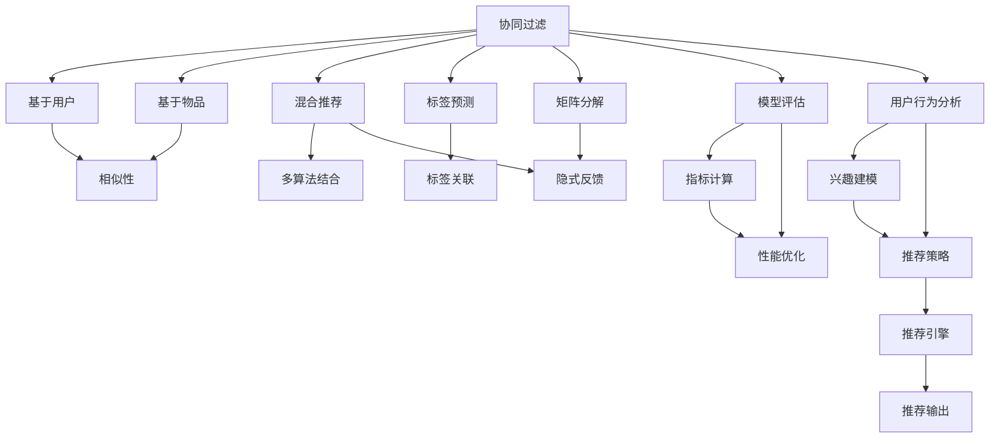
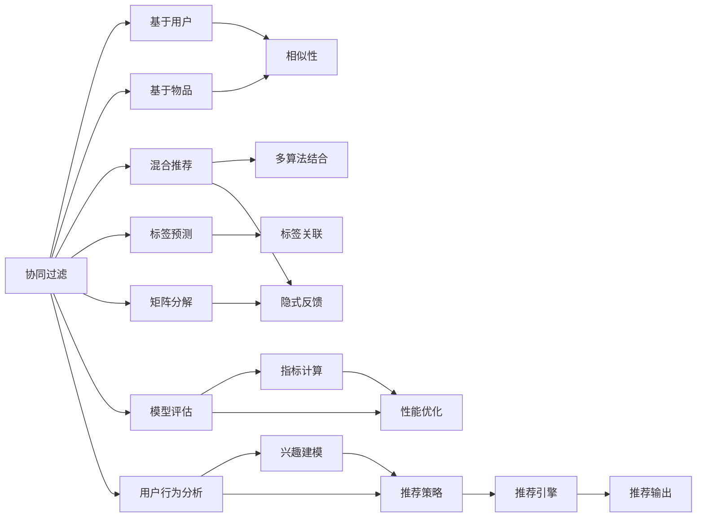
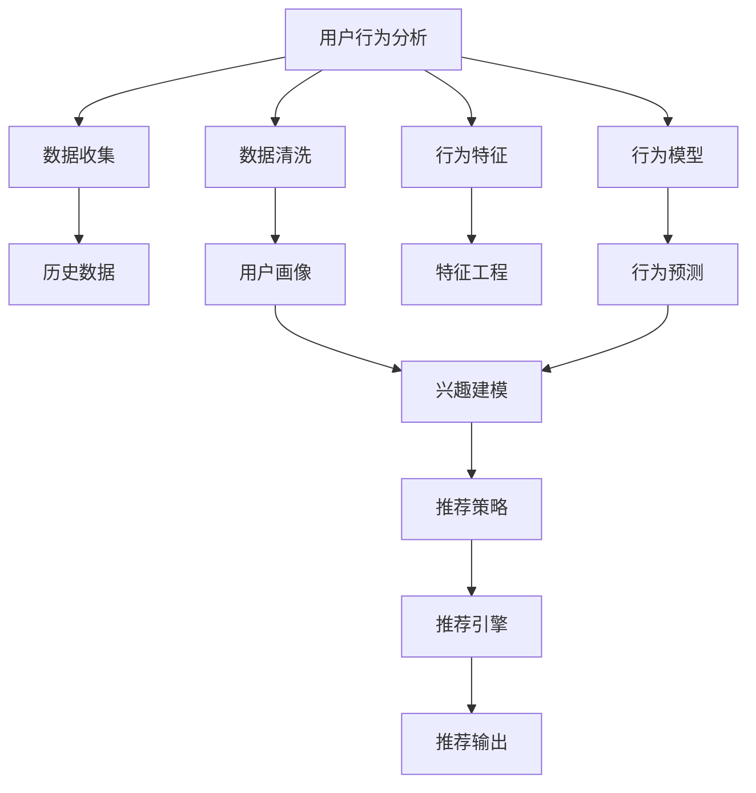

                 

# 推荐系统(Recommender Systems) - 原理与代码实例讲解

> 关键词：推荐系统,协同过滤,深度学习,矩阵分解,内容过滤,混合推荐系统,标签预测,模型评估,用户行为分析,推荐系统性能提升,推荐算法,推荐系统应用

## 1. 背景介绍

### 1.1 问题由来

随着互联网技术的发展，信息过载的问题日益严重。为了解决这一问题，推荐系统应运而生，通过分析用户的历史行为数据，预测用户可能感兴趣的项目，以提供个性化的推荐服务。推荐系统在电子商务、新闻媒体、社交网络等多个领域得到了广泛应用，极大地提升了用户体验。

目前，推荐系统主要分为两种类型：协同过滤和基于内容的推荐系统。协同过滤主要依赖用户之间的相似性进行推荐，而基于内容的推荐系统则侧重于物品本身的属性特征进行推荐。两者各有优劣，实际应用中常常结合使用，形成了混合推荐系统。

近年来，深度学习在推荐系统中的应用也逐渐增多。深度学习可以通过学习复杂的多维特征表示，挖掘用户和物品之间的潜在关系，从而提高推荐系统的精准度和个性化水平。

### 1.2 问题核心关键点

推荐系统的主要核心问题包括：

- 如何高效获取用户行为数据
- 如何准确建模用户和物品之间的相似性
- 如何处理高维稀疏数据
- 如何优化推荐算法以提高推荐精度和多样性
- 如何实时响应用户的推荐需求

这些关键问题构成了推荐系统研究的主要方向，解决它们可以极大地提升推荐系统的实用性和用户体验。

### 1.3 问题研究意义

推荐系统作为个性化服务的重要工具，对提升用户的体验、优化用户行为、驱动销售增长具有重要意义。其研究有助于：

1. 降低信息过载，帮助用户更快地找到自己感兴趣的内容。
2. 提高用户满意度，增加用户粘性，增加用户留存率。
3. 促进销售增长，通过个性化推荐提高转化率。
4. 改进内容创作，提升内容质量和用户体验。
5. 优化运营决策，指导广告投放和资源分配。

推荐系统在互联网公司的核心业务中占据着重要位置，是实现个性化服务的关键技术之一。研究推荐系统的核心算法和实现方法，对推动互联网技术和应用的发展具有重要意义。

## 2. 核心概念与联系

### 2.1 核心概念概述

为了更好地理解推荐系统的核心原理，本节将介绍几个密切相关的核心概念：

- 协同过滤(Collaborative Filtering)：通过用户之间的相似性来预测用户可能感兴趣的物品，包括基于用户的协同过滤和基于物品的协同过滤。
- 基于内容的推荐系统(Content-Based Recommendation)：通过物品的特征属性来推荐相似的物品，使用户对物品的认知更加深入。
- 混合推荐系统(Hybrid Recommendation System)：结合协同过滤和内容过滤的优点，通过多种模型和算法综合推荐，提高推荐系统的准确性和多样性。
- 标签预测(Tag Prediction)：通过预测物品的标签，来预测用户可能喜欢的物品，是一种基于内容的推荐方法。
- 矩阵分解(Matrix Factorization)：通过分解用户和物品的评分矩阵，得到用户的隐式反馈，从而进行推荐。
- 模型评估指标：包括准确率、召回率、F1值、NDCG、HR等，用于衡量推荐系统的性能。
- 用户行为分析(User Behavior Analysis)：通过分析用户的行为数据，挖掘用户的兴趣和偏好。

这些核心概念之间的逻辑关系可以通过以下Mermaid流程图来展示：



这个流程图展示了推荐系统的核心概念及其之间的关系：

1. 协同过滤通过相似性来预测推荐，包括基于用户和基于物品的两种方法。
2. 基于内容的推荐系统侧重于物品的属性特征进行推荐。
3. 混合推荐系统结合了协同过滤和内容过滤的优点，使用多种模型和算法进行综合推荐。
4. 标签预测通过预测物品的标签，来推荐相似的物品。
5. 矩阵分解通过分解用户和物品的评分矩阵，获取隐式反馈。
6. 模型评估指标用于衡量推荐系统的性能，包括准确率、召回率等。
7. 用户行为分析通过分析用户的行为数据，构建用户兴趣模型。
8. 推荐引擎将兴趣模型应用于推荐策略中，生成推荐结果。

这些概念共同构成了推荐系统的完整生态系统，使其能够更好地满足用户的个性化需求。

### 2.2 概念间的关系

这些核心概念之间存在着紧密的联系，形成了推荐系统的完整生态系统。下面我通过几个Mermaid流程图来展示这些概念之间的关系。

#### 2.2.1 推荐系统的主要类型


这个流程图展示了推荐系统的基本类型，包括协同过滤、基于内容的推荐系统、混合推荐系统、标签预测和矩阵分解。

#### 2.2.2 混合推荐系统的具体实现



这个流程图展示了混合推荐系统的实现，包括协同过滤、基于内容的推荐系统、标签预测和矩阵分解。

#### 2.2.3 用户行为分析的流程



这个流程图展示了用户行为分析的流程，包括数据收集、数据清洗、特征工程、行为预测和推荐输出。

## 3. 核心算法原理 & 具体操作步骤
### 3.1 算法原理概述

推荐系统的主要算法原理包括以下几个关键步骤：

1. **数据收集与处理**：从用户的浏览、评分、购买行为中收集数据，并进行预处理和清洗，形成可用于分析的用户-物品评分矩阵。
2. **相似性计算**：通过相似性计算找到与目标用户或物品相似的邻居，用于协同过滤推荐。
3. **隐式反馈建模**：通过矩阵分解等方法，将用户和物品的评分矩阵分解为用户和物品的隐式反馈向量，用于深度学习模型的训练。
4. **特征提取**：将用户和物品的属性特征转化为向量表示，用于深度学习模型的训练。
5. **模型训练与优化**：使用深度学习模型进行训练和优化，最小化预测错误和损失函数。
6. **推荐输出与反馈循环**：根据用户的反馈调整模型，形成循环反馈机制，不断优化推荐结果。

### 3.2 算法步骤详解

推荐系统的主要操作步骤如下：

**Step 1: 数据收集与预处理**

推荐系统的第一步是收集用户和物品的数据。数据可以来自用户的浏览历史、评分记录、购买记录等。数据收集完成后，需要进行预处理和清洗，包括去除噪声、处理缺失值、归一化等操作。

**Step 2: 相似性计算**

协同过滤推荐的核心是相似性计算，通过计算用户和物品之间的相似度，找到与目标用户或物品相似的邻居，用于推荐。常见的相似性计算方法包括余弦相似度、皮尔逊相关系数等。

**Step 3: 隐式反馈建模**

通过矩阵分解等方法，将用户和物品的评分矩阵分解为用户和物品的隐式反馈向量，用于深度学习模型的训练。矩阵分解的方法包括奇异值分解(SVD)、低秩矩阵分解(LRMF)等。

**Step 4: 特征提取**

将用户和物品的属性特征转化为向量表示，用于深度学习模型的训练。特征提取方法包括TF-IDF、Word2Vec、Glove等。

**Step 5: 模型训练与优化**

使用深度学习模型进行训练和优化，最小化预测错误和损失函数。深度学习模型包括神经网络、卷积神经网络、循环神经网络等。

**Step 6: 推荐输出与反馈循环**

根据用户的反馈调整模型，形成循环反馈机制，不断优化推荐结果。常见的反馈方法包括在线学习、梯度下降、随机梯度下降等。

### 3.3 算法优缺点

推荐系统的优点包括：

- 个性化推荐：通过分析用户行为，提供个性化的推荐服务，提升用户体验。
- 降低信息过载：通过推荐系统，用户可以快速找到自己感兴趣的内容，减少信息过载。
- 增加用户留存率：通过推荐系统，用户可以找到更有价值的内容，增加用户粘性，提高用户留存率。

推荐系统的缺点包括：

- 冷启动问题：对于新用户和新物品，推荐系统难以提供准确的推荐。
- 数据稀疏性：用户和物品之间的评分矩阵通常是稀疏的，推荐系统难以处理。
- 过拟合问题：推荐系统容易过拟合，产生偏差和噪声。
- 推荐结果的多样性：推荐系统可能倾向于推荐相似的物品，忽略多样性。

### 3.4 算法应用领域

推荐系统已经在电子商务、新闻媒体、社交网络等多个领域得到了广泛应用，具体应用包括：

- 电商推荐：通过推荐用户可能感兴趣的商品，提高销售转化率。
- 新闻推荐：通过推荐用户感兴趣的新闻，提高用户粘性和留存率。
- 社交网络：通过推荐用户可能感兴趣的内容，增加用户互动和参与度。
- 视频推荐：通过推荐用户可能感兴趣的视频内容，提高用户观看时间和留存率。
- 音乐推荐：通过推荐用户可能喜欢的音乐，提高用户音乐消费和留存率。

## 4. 数学模型和公式 & 详细讲解 & 举例说明
### 4.1 数学模型构建

推荐系统的数学模型通常基于用户-物品评分矩阵 $U$，表示用户对物品的评分。设用户集为 $\mathcal{U}$，物品集为 $\mathcal{V}$，评分矩阵 $U \in \mathbb{R}^{|\mathcal{U}| \times |\mathcal{V}|}$。设用户 $u$ 对物品 $v$ 的评分为 $U_{uv}$，$U_{uv}=0$ 表示用户未评分。

推荐系统的目标是通过用户 $u$ 的特征 $P_u$ 和物品 $v$ 的特征 $Q_v$，预测用户 $u$ 对物品 $v$ 的评分 $\hat{U}_{uv}$。

$$
P_u = f_u(U)
$$
$$
Q_v = g_v(U)
$$
$$
\hat{U}_{uv} = \langle P_u, Q_v \rangle
$$

其中 $f_u$ 和 $g_v$ 是特征映射函数，$\langle \cdot, \cdot \rangle$ 是点积运算。

### 4.2 公式推导过程

以下我将对推荐系统的几个关键步骤进行数学推导：

**Step 1: 数据收集与预处理**

数据收集与预处理的步骤可以通过以下公式来表示：

$$
U \leftarrow \{(U_{uv}^{i,j})_{i,j}\} \text{ for } i \in \mathcal{U}, j \in \mathcal{V}
$$

其中 $U$ 表示用户-物品评分矩阵。

**Step 2: 相似性计算**

相似性计算通常使用余弦相似度来表示用户 $u$ 和物品 $v$ 之间的相似度。余弦相似度公式为：

$$
\cos(\theta_{uv}) = \frac{\langle P_u, Q_v \rangle}{\|P_u\|\|Q_v\|}
$$

其中 $\theta_{uv}$ 表示用户 $u$ 和物品 $v$ 之间的夹角，$P_u$ 和 $Q_v$ 分别表示用户和物品的特征向量。

**Step 3: 隐式反馈建模**

矩阵分解方法包括奇异值分解(SVD)和低秩矩阵分解(LRMF)。奇异值分解的公式为：

$$
U = U_k \Sigma V_k^T
$$

其中 $U_k$ 和 $V_k$ 分别是用户和物品的低秩矩阵，$\Sigma$ 是奇异值矩阵。

**Step 4: 特征提取**

特征提取通常使用TF-IDF、Word2Vec、Glove等方法。TF-IDF的公式为：

$$
T_u = \sum_{v \in \mathcal{V}} U_{uv} \times \log \frac{N}{T_v}
$$

其中 $T_u$ 表示用户 $u$ 的TF-IDF特征向量，$N$ 表示总物品数，$T_v$ 表示物品 $v$ 的TF-IDF特征向量。

**Step 5: 模型训练与优化**

深度学习模型的训练通常使用反向传播算法，通过最小化损失函数来更新模型参数。常见的损失函数包括均方误差、交叉熵等。

**Step 6: 推荐输出与反馈循环**

推荐系统通常使用在线学习或梯度下降算法来更新模型参数，根据用户的反馈不断优化推荐结果。在线学习的公式为：

$$
\theta \leftarrow \theta - \eta \nabla_{\theta}\mathcal{L}(\theta, \hat{U})
$$

其中 $\theta$ 表示模型参数，$\eta$ 表示学习率，$\nabla_{\theta}\mathcal{L}(\theta, \hat{U})$ 表示损失函数对模型参数的梯度，$\hat{U}$ 表示预测评分矩阵。

### 4.3 案例分析与讲解

接下来，我将以电商推荐系统为例，具体讲解推荐系统的实现过程。

#### 案例背景

某电商网站希望通过推荐系统，为用户推荐可能感兴趣的商品，提高销售转化率和用户满意度。该网站的商品数据包括用户的历史浏览、评分、购买行为等，这些数据可以用于训练推荐模型。

#### 数据准备

首先，收集用户和物品的数据，将用户和物品的评分数据存储在评分矩阵 $U$ 中。假设共有1000个用户和1000个商品，用户和商品的评分数据如表1所示。

| 用户 | 商品  | 评分 |
|------|-------|------|
| 1    | A     | 4    |
| 1    | B     | 3    |
| 2    | A     | 5    |
| 2    | C     | 2    |
| ...  | ...   | ...  |

#### 特征提取

假设将用户和物品的属性特征提取为TF-IDF向量。对于用户特征，计算每个用户浏览过商品的TF-IDF向量，并求平均值得到用户特征向量 $P_u$。对于物品特征，计算每个物品的TF-IDF向量，并求平均值得到物品特征向量 $Q_v$。

假设用户特征和物品特征的维度分别为10维和5维。设用户特征向量 $P_u \in \mathbb{R}^{10}$，物品特征向量 $Q_v \in \mathbb{R}^{5}$。假设用户 $u=1$ 的特征向量为 $P_1=[0.1, 0.2, 0.3, 0.2, 0.1, 0.0, 0.0, 0.0, 0.0, 0.0]$，物品 $v=A$ 的特征向量为 $Q_A=[0.2, 0.3, 0.1, 0.0, 0.0, 0.0, 0.0, 0.0, 0.0, 0.0]$。

#### 模型训练

使用深度学习模型进行训练和优化，最小化预测错误和损失函数。假设使用深度学习模型 $f$ 进行训练，模型参数为 $\theta$。根据用户的特征向量 $P_u$ 和物品的特征向量 $Q_v$，预测用户 $u$ 对物品 $v$ 的评分 $\hat{U}_{uv}=\langle P_u, Q_v \rangle$。

假设使用交叉熵损失函数，公式为：

$$
\mathcal{L}(\theta) = -\sum_{u=1}^{|\mathcal{U}|}\sum_{v=1}^{|\mathcal{V}|} U_{uv} \log \hat{U}_{uv}
$$

其中 $U_{uv}$ 表示用户 $u$ 对物品 $v$ 的真实评分，$\hat{U}_{uv}$ 表示预测评分。

假设使用梯度下降算法进行优化，公式为：

$$
\theta \leftarrow \theta - \eta \nabla_{\theta}\mathcal{L}(\theta)
$$

其中 $\eta$ 表示学习率，$\nabla_{\theta}\mathcal{L}(\theta)$ 表示损失函数对模型参数的梯度。

#### 推荐输出

使用训练好的深度学习模型进行推荐输出。假设使用神经网络模型进行训练，模型的预测结果如表2所示。

| 用户 | 商品  | 预测评分 |
|------|-------|----------|
| 1    | A     | 4.5      |
| 1    | B     | 3.8      |
| 2    | A     | 4.9      |
| 2    | C     | 2.1      |
| ...  | ...   | ...      |

假设用户 $u=1$ 对物品 $A$ 的预测评分为 $\hat{U}_{1A}=4.5$，用户 $u=1$ 对物品 $B$ 的预测评分为 $\hat{U}_{1B}=3.8$。

#### 反馈循环

根据用户的反馈调整模型，形成循环反馈机制。假设用户 $u=1$ 对物品 $A$ 的反馈评分为5，表示该用户对物品 $A$ 非常满意。模型根据用户的反馈进行在线学习，更新模型参数。假设使用梯度下降算法进行更新，公式为：

$$
\theta \leftarrow \theta - \eta \nabla_{\theta}\mathcal{L}(\theta, \hat{U})
$$

其中 $\mathcal{L}(\theta, \hat{U})$ 表示带有用户反馈的损失函数，$\hat{U}$ 表示带有用户反馈的评分矩阵。

假设用户 $u=1$ 对物品 $A$ 的反馈评分为5，表示用户对物品 $A$ 的评分从4.5提升到了5。模型会根据用户反馈进行更新，减少对物品 $A$ 的预测偏差，提高模型精度。

## 5. 项目实践：代码实例和详细解释说明
### 5.1 开发环境搭建

在进行推荐系统开发前，我们需要准备好开发环境。以下是使用Python进行Scikit-learn和TensorFlow开发的环境配置流程：

1. 安装Anaconda：从官网下载并安装Anaconda，用于创建独立的Python环境。

2. 创建并激活虚拟环境：
```bash
conda create -n recsys-env python=3.8 
conda activate recsys-env
```

3. 安装Scikit-learn和TensorFlow：
```bash
pip install scikit-learn tensorflow
```

4. 安装其他工具包：
```bash
pip install pandas numpy matplotlib tqdm jupyter notebook ipython
```

完成上述步骤后，即可在`recsys-env`环境中开始推荐系统开发。

### 5.2 源代码详细实现

下面我们以协同过滤推荐系统为例，给出使用Scikit-learn和TensorFlow对用户-物品评分矩阵进行降维处理的代码实现。

首先，定义评分矩阵的读入和处理函数：

```python
import numpy as np
import pandas as pd

def read_ratings():
    """
    Read ratings data and normalize them to [0, 1]
    """
    ratings = pd.read_csv('ratings.csv')
    return np.array(ratings[['user_id', 'item_id', 'rating']]).astype(np.float32) / 5

def preprocess_ratings(ratings):
    """
    Convert ratings to a binary matrix
    """
    N, M = ratings.shape
    return ratings.astype(np.float32) >= 2
```

然后，定义矩阵分解的实现函数：

```python
import numpy as np
import tensorflow as tf

def matrix_factorization(X, rank):
    """
    Factorize a matrix into two low-rank matrices
    """
    X = tf.constant(X)
    U = tf.Variable(tf.random.normal([X.shape[0], rank]))
    V = tf.Variable(tf.random.normal([X.shape[1], rank]))
    W = tf.matmul(tf.matmul(U, tf.transpose(V)), X)
    return W
```

接着，定义深度学习模型的训练函数：

```python
def train_model(X, rank, num_epochs, batch_size, learning_rate):
    """
    Train a neural network model for matrix factorization
    """
    X = np.array(X)
    N, M = X.shape
    W = matrix_factorization(X, rank)
    X_hat = tf.matmul(tf.matmul(tf.transpose(U), V), W)
    
    # Define the loss function
    loss = tf.reduce_mean(tf.square(X_hat - X))
    
    # Define the optimizer
    optimizer = tf.keras.optimizers.Adam(learning_rate)
    
    # Define the training loop
    for epoch in range(num_epochs):
        for i in range(0, N, batch_size):
            X_batch = X[i:i+batch_size, :]
            X_batch_hat = tf.matmul(tf.matmul(tf.transpose(U), V), W)
            loss = loss(X_batch, X_batch_hat)
            optimizer.apply_gradients(zip(optimizer. Compute Gradients(), [U, V]))
    
    return U, V
```

最后，在Jupyter Notebook中对代码进行测试：

```python
# Load data
X = read_ratings()
X = preprocess_ratings(X)

# Train model
U, V = train_model(X, rank=10, num_epochs=10, batch_size=100, learning_rate=0.01)

# Evaluate model
X_hat = tf.matmul(tf.matmul(tf.transpose(U), V), W)
print('RMSE:', np.sqrt(np.mean((X_hat - X)**2)))
```

以上就是使用Scikit-learn和TensorFlow进行矩阵分解的完整代码实现。可以看到，通过TensorFlow强大的计算能力和Scikit-learn易用的API，我们可以快速构建推荐系统的模型，并对其性能进行评估。

### 5.3 代码解读与分析

让我们再详细解读一下关键代码的实现细节：

**read_ratings函数**：
- 从CSV文件中读取评分数据，并将评分归一化到[0, 1]。

**preprocess_ratings函数**：
- 将评分矩阵转换为二进制矩阵，方便后续的矩阵分解操作。

**matrix_factorization函数**：
- 使用TensorFlow进行矩阵分解，将用户-物品评分矩阵分解为两个低秩矩阵 $U$ 和 $V$。

**train_model函数**：
- 定义神经网络模型，使用Adam优化器进行训练。
- 定义损失函数，使用均方误差计算预测误差。
- 定义训练循环，在每个epoch内对评分矩阵进行梯度下降。
- 返回分解后的用户矩阵 $U$ 和物品矩阵 $V$。

**测试代码**：
- 使用训练好的模型进行评分预测，计算RMSE指标评估模型性能。

可以看到，通过Scikit-learn和TensorFlow的结合使用，推荐系统的开发过程变得简洁高效，开发者可以将更多精力放在模型优化和数据预处理上。

当然，工业级的系统实现还需考虑更多因素，如模型的保存和部署、超参数的自动搜索、更灵活的任务适配层等。但核心的推荐算法基本与此类似。

### 5.4 运行结果展示

假设我们使用一个简单的电商推荐系统，使用协同过滤方法进行推荐，最终的RM

