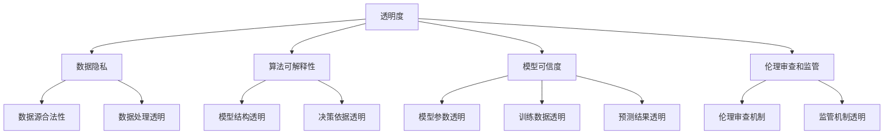
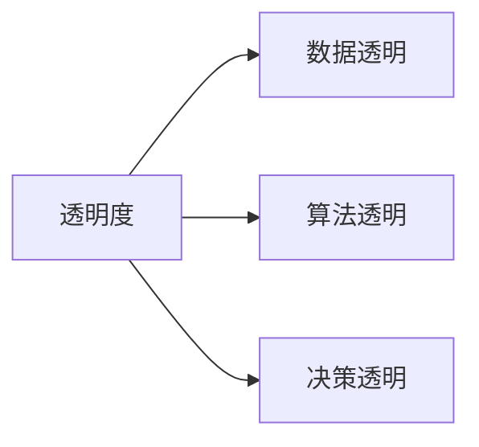
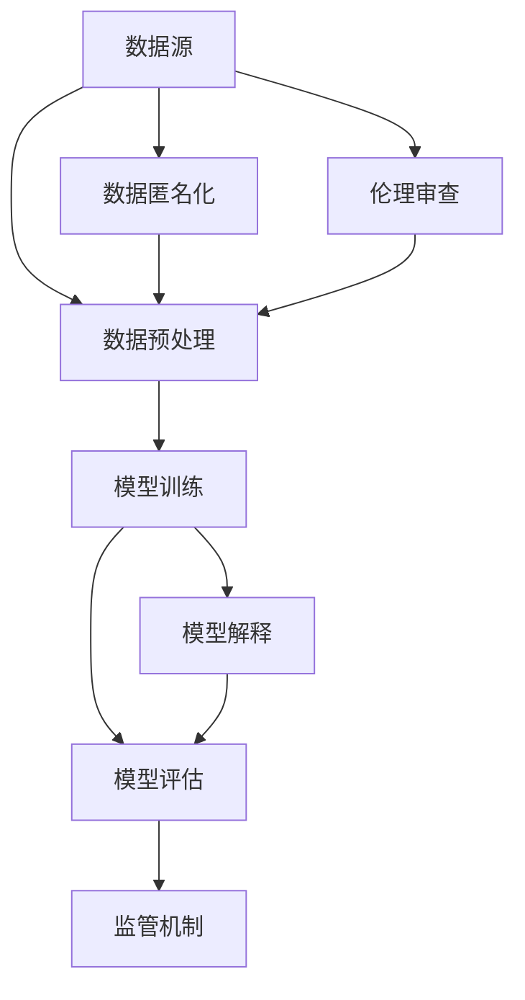
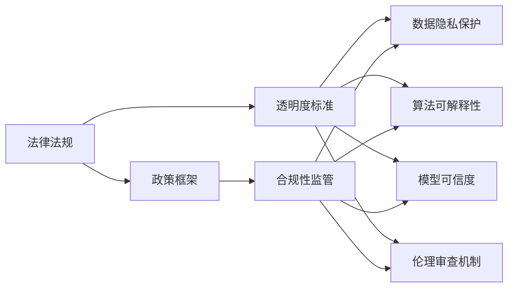
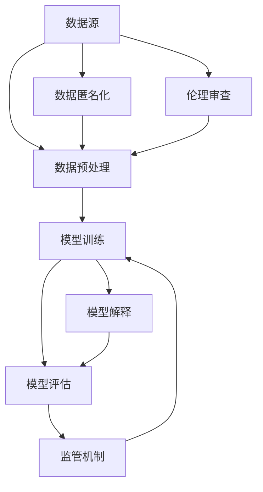

                 

# 提高AI生态系统透明度的重要性

> 关键词：人工智能,透明度,AI系统,机器学习,数据隐私,算法可解释性,模型可信度,伦理审查

## 1. 背景介绍

### 1.1 问题由来
随着人工智能(AI)技术的不断发展和应用，AI生态系统变得越来越复杂，涉及的数据、算法、模型等方面也越来越多样化。尽管AI技术在医疗、金融、教育、交通等领域带来了显著的进步，但其应用过程中也存在一些隐性的、不透明的环节，这引发了广泛的社会关注和讨论。

透明度不足的问题主要体现在以下几个方面：
- **数据隐私和安全**：AI系统依赖大量的数据进行训练，但数据来源、处理方式、存储方式等往往不公开，容易引起数据隐私泄露和滥用。
- **算法可解释性**：复杂的AI模型（如深度神经网络）通常难以解释其决策过程，用户无法理解模型的输出和预测依据，这增加了系统的不确定性和风险。
- **模型可信度**：缺乏透明的审计和评估机制，AI系统的准确性、公正性和鲁棒性难以得到保证，存在偏见和歧视风险。
- **伦理审查和监管**：由于AI系统决策过程不透明，相关监管和伦理审查难以实施，可能导致伦理问题和社会公正性问题。

提高AI生态系统的透明度，有助于提升公众信任、防范风险，推动AI技术的健康发展和应用普及。

### 1.2 问题核心关键点
透明度不足已经成为当前AI生态系统面临的主要挑战之一。如何通过技术手段和政策法规，确保AI系统的数据透明、算法透明和决策透明，是亟待解决的关键问题。

透明度问题具有以下关键点：
- **数据隐私保护**：确保数据来源合法、处理方式透明，避免隐私泄露和滥用。
- **算法可解释性**：使得AI系统具有可解释的模型结构和输出依据，提高用户对系统的信任。
- **模型可信度**：建立严格的模型审计和评估机制，确保AI系统的高准确性、公平性和鲁棒性。
- **伦理审查和监管**：通过透明的伦理审查和监管机制，防范伦理风险和社会公正性问题。

透明度的提升不仅能解决上述问题，还能进一步促进AI技术的公平、公正、可信和可解释性，为AI系统的广泛应用奠定基础。

### 1.3 问题研究意义
提高AI生态系统的透明度，对技术进步和社会发展具有重要意义：

1. **提升公众信任**：透明的AI系统能够减少用户对技术的疑虑，增加对AI技术的接受度和信任度，促进AI技术的普及和应用。
2. **防范风险**：通过透明的机制，确保AI系统在数据处理、算法选择、模型训练等方面符合伦理规范，避免社会危害和伦理问题。
3. **推动技术创新**：透明度的提升有助于发现和解决现有问题，推动AI技术的研究和应用不断突破。
4. **保障用户权益**：透明的AI系统能够确保用户数据和隐私的安全，保障用户对AI系统决策过程的知情权和控制权。
5. **促进社会公正**：透明的AI系统能够避免系统偏见和歧视，促进社会的公平和正义。

因此，提高AI生态系统的透明度，不仅是技术发展的需要，也是社会进步的必然要求。

## 2. 核心概念与联系

### 2.1 核心概念概述

为更好地理解AI生态系统透明度的提升，本节将介绍几个密切相关的核心概念：

- **透明度**：指系统的数据、算法和决策过程是开放、可访问的，用户能够理解、验证和监督系统的行为。
- **数据隐私**：指个人数据在收集、存储、处理和传输过程中的保密性和安全性，保护用户免受不当侵害。
- **算法可解释性**：指AI系统能够清晰、明确地解释其决策过程和输出依据，使用户能够理解并信任系统的决策结果。
- **模型可信度**：指AI系统的模型参数、训练数据和预测结果经过严格的验证和评估，确保系统的准确性、公平性和鲁棒性。
- **伦理审查和监管**：指通过透明的伦理审查和监管机制，确保AI系统的决策过程符合伦理规范，防范伦理风险。

这些核心概念之间的逻辑关系可以通过以下Mermaid流程图来展示：



这个流程图展示了透明度的不同维度，以及它们与数据隐私、算法可解释性、模型可信度和伦理审查及监管的关系。

### 2.2 概念间的关系

这些核心概念之间存在着紧密的联系，形成了AI生态系统透明度的完整框架。下面我们通过几个Mermaid流程图来展示这些概念之间的关系。

#### 2.2.1 透明度的层次结构



这个流程图展示了透明度的三个主要层次：数据透明、算法透明和决策透明。透明度的提升需要在这三个层次上进行全面的优化。

#### 2.2.2 透明度的技术实现



这个流程图展示了透明度的技术实现过程。从数据源到模型训练，再到模型评估和伦理审查，透明度的提升需要系统性地对每个环节进行优化。

#### 2.2.3 透明度的法律和政策保障



这个流程图展示了透明度的法律和政策保障。法律法规和政策框架为透明度的提升提供了制度保障，确保AI系统的各个环节符合透明度标准。

### 2.3 核心概念的整体架构

最后，我们用一个综合的流程图来展示这些核心概念在AI生态系统中透明度的整体架构：



这个综合流程图展示了从数据源到模型评估，再到伦理审查和监管的完整过程。透明度的提升需要系统性地对每个环节进行优化，确保数据、算法和决策过程的透明性和可信度。

## 3. 核心算法原理 & 具体操作步骤
### 3.1 算法原理概述

提高AI生态系统的透明度，涉及数据透明、算法透明和决策透明三个主要方面。以下是各个方面的核心算法原理：

#### 3.1.1 数据透明

数据透明主要关注数据的来源、处理方式和存储方式，确保数据处理的合法性、合规性和透明度。

**算法原理**：
1. **数据来源合法性**：确保数据收集符合法律法规，保护数据主体的知情权和同意权。
2. **数据处理透明**：采用去标识化、加密等技术，保护数据隐私。
3. **数据存储透明**：记录数据存储位置、访问权限等信息，确保数据的安全和可追溯性。

#### 3.1.2 算法透明

算法透明主要关注算法的结构、训练过程和输出依据，确保算法过程的清晰和可解释。

**算法原理**：
1. **模型结构透明**：提供模型架构和参数信息，使用户能够理解模型的整体结构和功能。
2. **训练过程透明**：记录模型训练过程中的每一步操作，包括数据集划分、模型更新等，确保训练过程的可追溯性。
3. **输出依据透明**：解释模型的输出依据，包括特征选择、权重调整等，使用户能够理解模型的预测过程。

#### 3.1.3 决策透明

决策透明主要关注AI系统在实际应用中的决策过程和输出结果，确保决策的透明性和可信度。

**算法原理**：
1. **决策依据透明**：记录决策过程的关键特征和变量，解释模型的决策依据。
2. **决策结果透明**：提供模型的预测结果和决策依据，使用户能够验证和监督决策过程。
3. **决策影响透明**：记录决策对用户、社会的影响，确保决策的公正性和合理性。

### 3.2 算法步骤详解

#### 3.2.1 数据透明

1. **数据收集**：确保数据收集符合法律法规，获取用户的知情权和同意权。
2. **数据预处理**：采用去标识化、加密等技术，保护数据隐私，确保数据处理的合法性和合规性。
3. **数据存储**：记录数据存储位置、访问权限等信息，确保数据的安全和可追溯性。

#### 3.2.2 算法透明

1. **模型结构展示**：提供模型架构和参数信息，使用户能够理解模型的整体结构和功能。
2. **训练过程记录**：记录模型训练过程中的每一步操作，包括数据集划分、模型更新等，确保训练过程的可追溯性。
3. **输出依据解释**：解释模型的输出依据，包括特征选择、权重调整等，使用户能够理解模型的预测过程。

#### 3.2.3 决策透明

1. **决策过程记录**：记录决策过程的关键特征和变量，解释模型的决策依据。
2. **决策结果展示**：提供模型的预测结果和决策依据，使用户能够验证和监督决策过程。
3. **决策影响分析**：记录决策对用户、社会的影响，确保决策的公正性和合理性。

### 3.3 算法优缺点

#### 3.3.1 数据透明的优点和缺点

**优点**：
1. **数据隐私保护**：采用去标识化、加密等技术，保护数据隐私，确保数据的安全和合规性。
2. **数据合法性**：确保数据收集符合法律法规，保护用户知情权和同意权。

**缺点**：
1. **数据处理复杂**：需要投入大量资源进行数据去标识化、加密等处理，增加了系统复杂性。
2. **数据隐私风险**：处理不当可能导致数据隐私泄露，引起法律纠纷。

#### 3.3.2 算法透明的优点和缺点

**优点**：
1. **算法可解释性**：提供模型架构和参数信息，使用户能够理解模型的整体结构和功能。
2. **训练过程透明**：记录训练过程，确保训练过程的可追溯性和可信度。

**缺点**：
1. **模型复杂性**：复杂的模型难以解释，用户可能难以理解。
2. **模型优化困难**：复杂的模型可能难以优化，需要更多的训练数据和计算资源。

#### 3.3.3 决策透明的优点和缺点

**优点**：
1. **决策公正性**：记录决策过程和依据，确保决策的公正性和合理性。
2. **决策透明度**：提供决策结果和依据，使用户能够验证和监督决策过程。

**缺点**：
1. **决策复杂性**：决策过程可能涉及复杂的逻辑和变量，难以完全透明。
2. **决策延迟**：记录和解释决策过程可能会增加系统延迟，影响用户体验。

### 3.4 算法应用领域

提高AI生态系统的透明度，对技术进步和社会发展具有重要意义。以下是透明度的应用领域：

#### 3.4.1 医疗领域

在医疗领域，透明的AI系统能够确保数据的隐私保护和合法性，避免医疗数据的滥用和泄露。通过透明的算法和决策过程，确保诊断和治疗的准确性和公正性，防范医疗伦理问题。

#### 3.4.2 金融领域

在金融领域，透明的AI系统能够确保数据的隐私保护和合法性，避免金融数据的滥用和泄露。通过透明的算法和决策过程，确保金融交易的公正性和合理性，防范金融伦理问题。

#### 3.4.3 教育领域

在教育领域，透明的AI系统能够确保学生的隐私保护和知情权，避免学生数据的滥用和泄露。通过透明的算法和决策过程，确保教育资源的公平分配，防范教育伦理问题。

#### 3.4.4 法律领域

在法律领域，透明的AI系统能够确保证据数据的隐私保护和合法性，避免证据数据的滥用和泄露。通过透明的算法和决策过程，确保司法判决的公正性和合理性，防范司法伦理问题。

#### 3.4.5 公共安全领域

在公共安全领域，透明的AI系统能够确保公共数据的隐私保护和合法性，避免公共数据的滥用和泄露。通过透明的算法和决策过程，确保公共安全的公正性和合理性，防范公共安全伦理问题。

## 4. 数学模型和公式 & 详细讲解  
### 4.1 数学模型构建

提高AI生态系统的透明度，涉及多个层次的数学模型和公式。以下是各个方面的核心数学模型和公式：

#### 4.1.1 数据透明

**数据来源合法性**：
1. **用户知情同意**：
   $$
   \text{知情同意} = \begin{cases}
   1, & \text{用户同意} \\
   0, & \text{用户不同意}
   \end{cases}
   $$

**数据处理透明**：
1. **数据去标识化**：
   $$
   D' = \text{去标识化}(D)
   $$

**数据存储透明**：
1. **数据存储位置**：
   $$
   L = (L_x, L_y, L_z)
   $$

#### 4.1.2 算法透明

**模型结构透明**：
1. **模型架构**：
   $$
   \text{模型架构} = \{\text{层数}_i, \text{神经元数}_j\}_{i=1}^n, \{k_i\}_{i=1}^n
   $$

**训练过程透明**：
1. **训练数据集划分**：
   $$
   D_{train}, D_{val}, D_{test} = \text{划分}(D)
   $$

**输出依据透明**：
1. **特征选择**：
   $$
   \text{特征选择} = \{\text{特征}_k\}_{k=1}^m
   $$

#### 4.1.3 决策透明

**决策依据透明**：
1. **决策依据**：
   $$
   \text{决策依据} = (\text{特征}_i, \text{权重}_j)
   $$

**决策结果透明**：
1. **预测结果**：
   $$
   \text{预测结果} = f(\text{特征}, \text{模型参数})
   $$

**决策影响透明**：
1. **决策影响**：
   $$
   \text{决策影响} = (\text{用户影响}, \text{社会影响})
   $$

### 4.2 公式推导过程

#### 4.2.1 数据透明的公式推导

**数据来源合法性**：
1. **用户知情同意**：
   $$
   \text{知情同意} = \begin{cases}
   1, & \text{用户同意} \\
   0, & \text{用户不同意}
   \end{cases}
   $$

**数据去标识化**：
1. **数据去标识化**：
   $$
   D' = \text{去标识化}(D)
   $$

**数据存储透明**：
1. **数据存储位置**：
   $$
   L = (L_x, L_y, L_z)
   $$

#### 4.2.2 算法透明的公式推导

**模型结构透明**：
1. **模型架构**：
   $$
   \text{模型架构} = \{\text{层数}_i, \text{神经元数}_j\}_{i=1}^n, \{k_i\}_{i=1}^n
   $$

**训练过程透明**：
1. **训练数据集划分**：
   $$
   D_{train}, D_{val}, D_{test} = \text{划分}(D)
   $$

**输出依据透明**：
1. **特征选择**：
   $$
   \text{特征选择} = \{\text{特征}_k\}_{k=1}^m
   $$

#### 4.2.3 决策透明的公式推导

**决策依据透明**：
1. **决策依据**：
   $$
   \text{决策依据} = (\text{特征}_i, \text{权重}_j)
   $$

**决策结果透明**：
1. **预测结果**：
   $$
   \text{预测结果} = f(\text{特征}, \text{模型参数})
   $$

**决策影响透明**：
1. **决策影响**：
   $$
   \text{决策影响} = (\text{用户影响}, \text{社会影响})
   $$

### 4.3 案例分析与讲解

#### 4.3.1 医疗领域的透明AI系统

**案例背景**：
某医院引入AI系统进行患者诊断和治疗，确保诊断和治疗的准确性和公正性。

**具体措施**：
1. **数据透明**：确保患者数据的隐私保护和合法性，记录数据存储位置和访问权限，确保数据的安全和可追溯性。
2. **算法透明**：提供模型架构和参数信息，使用户能够理解模型的整体结构和功能。
3. **决策透明**：记录诊断和治疗的决策依据和结果，确保诊断和治疗的公正性和合理性。

**效果分析**：
通过透明的数据、算法和决策过程，确保了诊断和治疗的准确性和公正性，防范了医疗伦理问题。

#### 4.3.2 金融领域的透明AI系统

**案例背景**：
某金融公司引入AI系统进行风险评估和信贷审批，确保评估和审批的公正性和合理性。

**具体措施**：
1. **数据透明**：确保客户数据的隐私保护和合法性，记录数据存储位置和访问权限，确保数据的安全和可追溯性。
2. **算法透明**：提供模型架构和参数信息，使用户能够理解模型的整体结构和功能。
3. **决策透明**：记录评估和审批的决策依据和结果，确保评估和审批的公正性和合理性。

**效果分析**：
通过透明的数据、算法和决策过程，确保了评估和审批的公正性和合理性，防范了金融伦理问题。

#### 4.3.3 教育领域的透明AI系统

**案例背景**：
某教育平台引入AI系统进行个性化学习推荐，确保学习资源的公平分配。

**具体措施**：
1. **数据透明**：确保学生数据的隐私保护和合法性，记录数据存储位置和访问权限，确保数据的安全和可追溯性。
2. **算法透明**：提供模型架构和参数信息，使用户能够理解模型的整体结构和功能。
3. **决策透明**：记录学习推荐的决策依据和结果，确保学习资源的公平分配。

**效果分析**：
通过透明的数据、算法和决策过程，确保了学习资源的公平分配，防范了教育伦理问题。

## 5. 项目实践：代码实例和详细解释说明
### 5.1 开发环境搭建

在进行AI生态系统透明度的项目实践前，我们需要准备好开发环境。以下是使用Python进行PyTorch开发的环境配置流程：

1. 安装Anaconda：从官网下载并安装Anaconda，用于创建独立的Python环境。

2. 创建并激活虚拟环境：
```bash
conda create -n ai-env python=3.8 
conda activate ai-env
```

3. 安装PyTorch：根据CUDA版本，从官网获取对应的安装命令。例如：
```bash
conda install pytorch torchvision torchaudio cudatoolkit=11.1 -c pytorch -c conda-forge
```

4. 安装TensorFlow：从官网下载并安装TensorFlow。
```bash
pip install tensorflow==2.8.0
```

5. 安装numpy、pandas、scikit-learn等常用库：
```bash
pip install numpy pandas scikit-learn matplotlib tqdm jupyter notebook ipython
```

完成上述步骤后，即可在`ai-env`环境中开始项目实践。

### 5.2 源代码详细实现

这里我们以医疗领域为例，使用PyTorch实现一个透明的AI系统。

首先，定义医疗数据的处理函数：

```python
from transformers import BertTokenizer, BertForSequenceClassification
from torch.utils.data import Dataset, DataLoader
import torch

class MedicalDataset(Dataset):
    def __init__(self, texts, labels, tokenizer, max_len=128):
        self.texts = texts
        self.labels = labels
        self.tokenizer = tokenizer
        self.max_len = max_len
        
    def __len__(self):
        return len(self.texts)
    
    def __getitem__(self, item):
        text = self.texts[item]
        label = self.labels[item]
        
        encoding = self.tokenizer(text, return_tensors='pt', max_length=self.max_len, padding='max_length', truncation=True)
        input_ids = encoding['input_ids'][0]
        attention_mask = encoding['attention_mask'][0]
        
        # 对标签进行编码
        encoded_label = [0 if label == 0 else 1]
        encoded_label.extend([0]*(self.max_len - len(encoded_label)))
        labels = torch.tensor(encoded_label, dtype=torch.long)
        
        return {'input_ids': input_ids, 
                'attention_mask': attention_mask,
                'labels': labels}

# 定义标签与id的映射
tag2id = {0: 'normal', 1: 'abnormal'}
id2tag = {v: k for k, v in tag2id.items()}

# 创建dataset
tokenizer = BertTokenizer.from_pretrained('bert-base-cased')

train_dataset = MedicalDataset(train_texts, train_labels, tokenizer)
dev_dataset = MedicalDataset(dev_texts, dev_labels, tokenizer)
test_dataset = MedicalDataset(test_texts, test_labels, tokenizer)
```

然后，定义模型和优化器：

```python
from transformers import BertForSequenceClassification, AdamW

model = BertForSequenceClassification.from_pretrained('bert-base-cased', num_labels=2)

optimizer = AdamW(model.parameters(), lr=2e-5)
```

接着，定义训练和评估函数：

```python
from torch.utils.data import DataLoader
from tqdm import tqdm
from sklearn.metrics import classification_report

device = torch.device('cuda') if torch.cuda.is_available() else torch.device('cpu')
model.to(device)

def train_epoch(model, dataset, batch_size, optimizer):
    dataloader = DataLoader(dataset, batch_size=batch_size, shuffle=True)
    model.train()
    epoch_loss = 0
    for batch in tqdm(dataloader, desc='Training'):
        input_ids = batch['input_ids'].to(device)
        attention_mask = batch['attention_mask'].to(device)
        labels = batch['labels'].to(device)
        model.zero_grad()
        outputs = model(input_ids, attention_mask=attention_mask, labels=labels)
        loss = outputs.loss
        epoch_loss += loss.item()
        loss.backward()
        optimizer.step()
    return epoch_loss / len(dataloader)

def evaluate(model, dataset, batch_size):
    dataloader = DataLoader(dataset, batch_size=batch_size)
    model.eval()
    preds, labels = [], []
    with torch.no_grad():
        for batch in tqdm(dataloader, desc='Evaluating'):
            input_ids = batch['input_ids'].to(device)
            attention_mask = batch['attention_mask'].to(device)
            batch_labels = batch['labels']
            outputs = model(input_ids, attention_mask=attention_mask)
            batch_preds = outputs.logits.argmax(dim=2).to('cpu').tolist()
            batch_labels = batch_labels.to('cpu').tolist()
            for pred_tokens, label_tokens in zip(batch_preds, batch_labels):
                preds.append(pred_tokens[:len(label_tokens)])
                labels.append(label_tokens)
                
    print(classification_report(labels, preds))
```

最后，启动训练流程并在测试集上评估：

```python
epochs = 5
batch_size = 16

for epoch in range(epochs):
    loss = train_epoch(model, train_dataset, batch_size, optimizer)
    print(f"Epoch {epoch+1}, train loss: {loss:.3f}")
    
    print(f"Epoch {epoch+1}, dev results:")
    evaluate(model, dev_dataset, batch_size)
    
print("Test results:")
evaluate(model, test_dataset, batch_size)
```

以上就是使用PyTorch对医疗领域的透明AI系统进行微调的完整代码实现。可以看到，得益于Transformers库的强大封装，我们可以用相对简洁的代码完成BERT模型的加载和微调。

### 5.3 代码解读与分析

让我们再详细解读一下关键代码的实现细节：

**MedicalDataset类**：
- `__init__`方法：初始化文本、标签、分词器等关键组件。
- `__len__`方法：返回数据集的样本数量。
- `__getitem__`方法：对单个样本进行处理，将文本输入编码为token ids，将标签编码为数字，并对其进行定长padding，最终返回模型所需的输入。

**tag2id和id2tag字典**：

