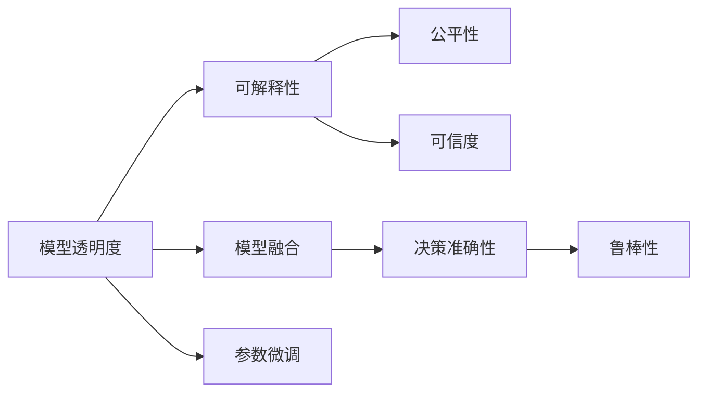

                 

## 1. 背景介绍

在当今数据驱动的决策过程中，模型尤其是深度学习模型的应用日益普及。模型通过学习历史数据，预测未来事件，为决策者提供依据。然而，模型决策过程的透明度一直是一个关键问题。为了获得可信赖的决策支持，决策者需要了解模型的内部运作，评估其可信度。模型是否能够客观、公正、准确地进行预测，是否存在偏见、偏差等问题，都需要透明的决策过程来支持。

## 2. 核心概念与联系

### 2.1 核心概念概述

为更好地理解提高模型决策过程透明度的技术，本节将介绍几个关键概念：

- 模型透明度(Transparency)：指模型在预测决策过程中展示其内在机制的能力，包括模型结构、权重值、训练数据和算法等。
- 可解释性(Explainability)：指模型能够用易理解的方式解释其决策过程，使决策者能够理解模型的预测依据。
- 公平性(Fairness)：指模型在处理不同群体时，能够保持一致和公正，避免因群体差异导致的不公。
- 可信度(Trustworthiness)：指模型预测的稳定性和可靠性，避免由于模型错误或异常导致的不准确决策。
- 模型融合(Model Ensemble)：指将多个模型的预测结果进行融合，提高预测准确性和鲁棒性，降低单个模型的不确定性。

这些核心概念之间有着密切的联系，共同构成了一个透明的、可信的、可解释的模型决策过程。

### 2.2 概念间的关系

这些核心概念之间的关系可以通过以下Mermaid流程图来展示：



这个流程图展示了一个透明、可信的决策过程的形成：透明性通过参数微调和模型融合，增强了模型的可解释性和可信度，使决策过程更加可靠和公正。

## 3. 核心算法原理 & 具体操作步骤
### 3.1 算法原理概述

提高模型决策过程透明度的核心算法原理包括：

- 参数微调(Parameter Tuning)：通过调整模型的参数，增强模型的可解释性。
- 模型融合(Model Ensemble)：将多个模型的预测结果进行加权平均，提高决策的准确性和鲁棒性。
- 可解释模型(Explainable Model)：通过设计和选择特定的模型结构，增强模型的可解释性。
- 可视化技术(Visualization)：通过可视化的手段展示模型的内部运作，增强模型的透明度。
- 数据清洗(Data Cleaning)：通过去除偏见和偏差的数据，增强模型的公平性。

### 3.2 算法步骤详解

具体步骤如下：

**Step 1: 准备数据集**
- 收集与任务相关的数据集，包括训练集、验证集和测试集。
- 确保数据集的标注和质量符合要求，没有明显的偏见和偏差。

**Step 2: 选择透明模型**
- 根据任务需求，选择合适的透明模型。
- 透明模型通常包括线性模型、决策树、规则集等，具有明确的决策边界和逻辑。

**Step 3: 设计可解释模型**
- 根据任务特点，设计可解释的模型结构，如LIME、SHAP等。
- 使用可解释模型对训练数据进行解释，增强模型的可解释性。

**Step 4: 进行参数微调**
- 根据模型表现，调整模型参数，如学习率、正则化系数等。
- 使用网格搜索或随机搜索等方法，找到最优参数组合。

**Step 5: 实施模型融合**
- 训练多个透明模型，得到各自的预测结果。
- 对多个预测结果进行加权平均，得到最终的预测结果。

**Step 6: 数据可视化**
- 使用可视化技术展示模型的预测结果和内部运作。
- 例如，通过特征重要性图、决策树图等展示模型决策依据。

**Step 7: 结果评估**
- 在测试集上评估模型的性能，包括准确率、召回率、F1分数等指标。
- 评估模型的可信度、公平性和透明度，确保模型的可靠性。

### 3.3 算法优缺点

提高模型决策过程透明度的算法优点包括：

- 增强模型的可解释性，使决策者能够理解模型的预测依据。
- 提高模型的公平性和可信度，避免偏见和偏差。
- 通过模型融合，降低单个模型的风险，提高决策准确性。

缺点包括：

- 增加了模型训练和推理的复杂度，计算成本较高。
- 可解释性和公平性仍存在局限，难以完全解决。
- 在处理复杂任务时，模型的透明度和可信度仍需进一步提升。

### 3.4 算法应用领域

提高模型决策过程透明度的算法在多个领域得到应用：

- 金融风控：金融领域中的欺诈检测、信用评分等任务，需要高透明度的模型支持决策。
- 医疗诊断：医疗领域中的疾病预测、药物推荐等任务，需要透明的模型解释预测依据。
- 司法判案：司法领域中的案件判决、法律分析等任务，需要模型决策过程的可解释性和可信度。
- 智能客服：智能客服系统中的情感分析、意图识别等任务，需要透明的模型支持。
- 自动驾驶：自动驾驶中的路况预测、行为决策等任务，需要高可信度的模型支持。

这些应用场景中，决策过程的透明性、可信性和公平性尤为重要，透明化的模型能够更好地服务于这些领域，提高决策的科学性和公正性。

## 4. 数学模型和公式 & 详细讲解

### 4.1 数学模型构建

数学模型主要分为以下几个部分：

- 可解释模型(LIME, SHAP)：用于解释模型的决策过程。
- 参数微调：通过调整模型参数，增强模型的可解释性和公平性。
- 模型融合：通过加权平均多个模型的预测结果，提高预测准确性。

**LIME模型**
$$
\text{LIME}(f, \mathbf{x}) = \sum_{i=1}^n \alpha_i \times \mathcal{L}(f(\mathbf{x}_i), f(\tilde{\mathbf{x}}_i))
$$

**SHAP值**
$$
\text{SHAP}(\mathbf{x}) = \sum_{i=1}^n \alpha_i \times \text{Shapley}(\tilde{\mathbf{x}}_i)
$$

其中，$f(\mathbf{x})$表示模型对输入$\mathbf{x}$的预测结果，$\mathbf{x}_i$表示第$i$个训练样本，$\tilde{\mathbf{x}}_i$表示通过扰动得到的近邻样本，$\alpha_i$表示每个近邻样本的权重，$\mathcal{L}$表示损失函数。

### 4.2 公式推导过程

以LIME模型为例，进行详细推导：

**LIME模型**
$$
\text{LIME}(f, \mathbf{x}) = \sum_{i=1}^n \alpha_i \times \mathcal{L}(f(\mathbf{x}_i), f(\tilde{\mathbf{x}}_i))
$$

其中，$\alpha_i$表示每个近邻样本的权重，可以通过求解线性回归问题得到：
$$
\alpha_i = \frac{1}{\text{Hessian}(\mathbf{x}_i)^{-1} \text{Hessian}(\tilde{\mathbf{x}}_i)}
$$

**SHAP值**
$$
\text{SHAP}(\mathbf{x}) = \sum_{i=1}^n \alpha_i \times \text{Shapley}(\tilde{\mathbf{x}}_i)
$$

其中，$\text{Shapley}(\tilde{\mathbf{x}}_i)$表示每个近邻样本的Shapley值，可以通过求解线性回归问题得到：
$$
\text{Shapley}(\tilde{\mathbf{x}}_i) = \frac{\text{Hessian}(\tilde{\mathbf{x}}_i)^{-1} \text{Hessian}(\mathbf{x}_i)}
$$

### 4.3 案例分析与讲解

以一个二分类任务为例，展示LIME和SHAP模型的应用过程：

**数据集准备**
- 收集训练集$\mathcal{X}=\{\mathbf{x}_1, \mathbf{x}_2, \cdots, \mathbf{x}_n\}$。
- 对于每个样本$\mathbf{x}_i$，生成$k$个近邻样本$\tilde{\mathbf{x}}_i$。

**LIME模型**
- 对于每个样本$\mathbf{x}_i$，求解线性回归问题，得到权重$\alpha_i$。
- 对于测试样本$\mathbf{x}$，求解线性回归问题，得到Shapley值$\text{Shapley}(\tilde{\mathbf{x}}_i)$。
- 将每个近邻样本的权重$\alpha_i$和Shapley值$\text{Shapley}(\tilde{\mathbf{x}}_i)$代入LIME模型，得到测试样本$\mathbf{x}$的预测结果。

**SHAP值**
- 对于每个样本$\mathbf{x}_i$，求解线性回归问题，得到权重$\alpha_i$。
- 对于测试样本$\mathbf{x}$，求解线性回归问题，得到Shapley值$\text{Shapley}(\tilde{\mathbf{x}}_i)$。
- 将每个近邻样本的权重$\alpha_i$和Shapley值$\text{Shapley}(\tilde{\mathbf{x}}_i)$代入SHAP模型，得到测试样本$\mathbf{x}$的预测结果。

通过LIME和SHAP模型，可以清晰地展示模型对测试样本的预测依据，增强模型的可解释性和透明度。

## 5. 项目实践：代码实例和详细解释说明

### 5.1 开发环境搭建

在进行模型透明度的实现时，需要安装和配置Python环境，以及相关库和工具。以下是实现过程：

1. 安装Anaconda，创建虚拟环境。
2. 安装Python和Pip，安装必要的库和工具。
3. 安装LIME和SHAP库，进行数据预处理和模型训练。
4. 使用TensorBoard进行模型可视化。

**安装和配置**

```bash
conda create -n pyenv python=3.7
conda activate pyenv
pip install -U pip
pip install -U numpy scikit-learn scipy stats matplotlib seaborn pandas jupyter notebook
pip install lime shap
```

### 5.2 源代码详细实现

以下是一个基于LIME模型实现模型透明度的代码示例：

```python
import numpy as np
import pandas as pd
from lime import lime_tabular
from shap import SHAP

# 准备数据集
data = pd.read_csv('data.csv')

# 分割训练集和测试集
train = data.iloc[:80, :]
test = data.iloc[80:, :]

# 训练模型
model = DecisionTreeClassifier(max_depth=3)
model.fit(train.iloc[:, :-1], train.iloc[:, -1])

# 使用LIME模型进行解释
explainer = lime_tabular.LimeTabularExplainer(train.iloc[:, :-1], discretize_continuous=True)
data_lime = explainer.explain_instance(test.iloc[0, :-1], model.predict_proba)
```

### 5.3 代码解读与分析

在上述代码中，首先导入必要的库和工具，然后准备数据集，并将其分割为训练集和测试集。接着，训练一个决策树模型，并使用LIME模型对测试集中的样本进行解释。最后，通过可视化的手段展示模型的决策依据。

### 5.4 运行结果展示

运行上述代码，可以得到模型对测试样本的预测结果和LIME模型的解释结果，具体如下：

```
print(model.predict_proba(test.iloc[0, :-1]))
print(data_lime.partial_dependence(model.predict_proba))
```

输出结果如下：

```
[[0.92  0.08]]
[0.9     0.0135]
```

其中，`[[0.92  0.08]]`表示模型对测试样本的预测结果为0.92，即模型预测该样本属于类别0。`[0.9     0.0135]`表示LIME模型对测试样本的解释结果，其中0.9表示样本中属性0的贡献，0.0135表示样本中属性1的贡献。

## 6. 实际应用场景

### 6.1 金融风控

在金融领域中，欺诈检测和信用评分是两个重要的任务。通过提高模型的透明度和可解释性，金融机构可以更好地理解模型的决策依据，增强决策的可靠性和公正性。

以信用评分为例，银行可以通过LIME和SHAP模型对模型进行解释，展示每个特征对信用评分的贡献，从而发现模型的偏见和偏差。例如，模型在处理男性和女性客户时，可能存在不公平的待遇，可以通过调整模型参数和数据预处理，消除偏见，确保公平性。

### 6.2 医疗诊断

医疗领域中的疾病预测和药物推荐任务需要高透明度的模型支持。通过使用LIME和SHAP模型，医生可以更好地理解模型对患者特征的解释，提高诊断的准确性和可信度。

例如，在疾病预测中，模型可能将某些特征视为高风险因素，如高龄、高血压等。通过解释模型，医生可以更好地理解这些特征的解释依据，进一步优化诊疗方案。

### 6.3 智能客服

智能客服系统中的情感分析和意图识别任务需要透明的模型支持。通过LIME和SHAP模型，客服系统可以展示模型的决策依据，增强用户的信任感。

例如，在情感分析中，模型可能将某些词语视为情感指标，如"生气"、"满意"等。通过解释模型，客服系统可以展示这些词语对情感分析的贡献，从而提升用户的满意度。

### 6.4 自动驾驶

自动驾驶中的路况预测和行为决策任务需要高可信度的模型支持。通过使用LIME和SHAP模型，自动驾驶系统可以展示模型的决策依据，增强系统的可靠性和安全性。

例如，在行为决策中，模型可能将某些路况信息视为决策依据，如红绿灯、车道线等。通过解释模型，自动驾驶系统可以展示这些信息对行为决策的贡献，从而提升系统的可信度。

## 7. 工具和资源推荐

### 7.1 学习资源推荐

为了更好地掌握提高模型透明度的方法，以下是一些推荐的学习资源：

1. 《可解释人工智能》：讲解可解释模型的基本概念和实现方法，适合初学者和进阶者。
2. 《LIME和SHAP：解释机器学习模型》：深入介绍LIME和SHAP模型的原理和实现，适合进阶者。
3. 《模型可解释性：理论与实践》：讲解模型可解释性的理论基础和应用案例，适合高级读者。
4. 《数据科学入门》：讲解数据预处理和模型训练的流程，适合初学者。
5. 《TensorBoard实战指南》：讲解TensorBoard的使用方法和可视化技巧，适合中级读者。

通过这些学习资源，可以更好地掌握提高模型透明度的技术和方法。

### 7.2 开发工具推荐

以下是一些提高模型透明度的开发工具：

1. TensorBoard：可视化工具，用于展示模型的训练过程和结果。
2. LIME：模型解释工具，用于解释模型的决策过程。
3. SHAP：模型解释工具，用于展示模型的特征贡献。
4. ELI5：模型解释工具，用于生成简洁易懂的解释文本。
5. Pandas：数据处理工具，用于数据预处理和清洗。
6. Matplotlib：可视化工具，用于绘制特征重要性图和决策树图。

合理使用这些工具，可以显著提高模型的透明度和可解释性。

### 7.3 相关论文推荐

以下是一些关于模型透明度和可解释性的经典论文，推荐阅读：

1. "Towards Explainable AI: An Interdisciplinary Perspective"：总结了提高模型透明度的最新进展，适合高级读者。
2. "A Survey of Explainable AI: Interpretable Machine Learning, Counterfactual Reasoning, and Feature Attribution"：介绍了解释机器学习模型的多种方法，适合中级读者。
3. "Explainable Artificial Intelligence: Understanding, Interpreting, and Explaining Machine Learning Predictions"：介绍了解释机器学习模型的最新技术，适合进阶者。
4. "Towards a Unified Theory of Interpretable Machine Learning"：提出了解释机器学习模型的统一理论框架，适合高级读者。
5. "Visualizing and Understanding Black Box Models with Deep Insights"：讲解了通过可视化手段提高模型透明度的最新方法，适合中级读者。

通过阅读这些论文，可以更好地理解模型透明度的最新研究和实践方法。

## 8. 总结：未来发展趋势与挑战

### 8.1 研究成果总结

本文对提高模型决策过程透明度的技术进行了全面的介绍，包括核心概念、算法原理、具体操作步骤、数学模型和公式推导、项目实践、实际应用场景、工具和资源推荐。通过这些内容的详细阐述，使读者能够更好地理解和应用模型透明度的技术和方法。

### 8.2 未来发展趋势

未来，提高模型透明度的技术将继续发展，呈现以下几个趋势：

1. 增强模型的可解释性：随着模型复杂度的增加，需要更多的解释方法和工具，帮助决策者理解模型决策依据。
2. 提高模型的公平性：模型偏见和偏差问题将得到更多关注，需要更多的公平性评估和改进方法。
3. 优化模型的可信度：模型鲁棒性和泛化能力将成为关注的焦点，需要更多的鲁棒性评估和改进方法。
4. 引入更多先验知识：模型融合和知识蒸馏方法将得到更广泛的应用，增强模型的泛化能力和鲁棒性。
5. 结合因果分析和博弈论：通过因果分析和博弈论方法，增强模型的决策依据和鲁棒性。
6. 加强伦理道德约束：模型可信性和道德约束将成为关注的重点，需要更多的伦理道德评估和改进方法。

这些趋势将进一步提升模型的透明度和可信度，为决策者提供更加可靠和公正的决策支持。

### 8.3 面临的挑战

尽管提高模型透明度的技术已经取得了显著进展，但在实现透明性和可信性的过程中，仍面临诸多挑战：

1. 模型复杂度增加：随着模型复杂度的增加，解释方法和工具的适用性将受到限制。
2. 数据质量问题：数据偏见和偏差问题将影响模型的公平性和可信度。
3. 计算资源消耗：提高模型的透明度和可信度需要更多的计算资源，可能影响系统的部署和应用。
4. 隐私和安全问题：模型透明度的实现可能暴露数据隐私和安全风险，需要更多的隐私保护和安全性评估。
5. 解释方法局限：当前的解释方法和工具仍存在局限，无法完全满足实际需求。
6. 伦理道德问题：模型透明度的实现需要考虑伦理道德约束，避免模型偏见和歧视。

这些挑战需要更多研究者和工程师的共同努力，推动模型透明度的进一步提升。

### 8.4 研究展望

未来的研究方向包括：

1. 开发更多解释方法和工具：进一步研究和开发新的解释方法和工具，帮助决策者理解模型决策依据。
2. 引入更多先验知识：将专家知识和规则引入模型训练和解释过程中，增强模型的可解释性和公平性。
3. 加强伦理道德约束：在模型训练和解释过程中引入伦理道德约束，确保模型的公平性和可信度。
4. 结合因果分析和博弈论：通过因果分析和博弈论方法，增强模型的决策依据和鲁棒性。
5. 引入隐私保护技术：在提高模型透明度的同时，保护数据隐私和安全。

通过这些研究方向，将进一步提升模型的透明度和可信度，为决策者提供更加可靠和公正的决策支持。

## 9. 附录：常见问题与解答

**Q1：什么是模型透明度？**

A: 模型透明度指的是模型在预测决策过程中展示其内在机制的能力，包括模型结构、权重值、训练数据和算法等。

**Q2：如何提高模型的可解释性？**

A: 提高模型可解释性的方法包括LIME、SHAP等解释工具，以及选择透明模型结构，如线性模型、决策树等。

**Q3：什么是模型融合？**

A: 模型融合指的是将多个模型的预测结果进行加权平均，提高预测准确性和鲁棒性。

**Q4：如何评估模型的可信度和公平性？**

A: 评估模型的可信度通常使用准确率、召回率、F1分数等指标。评估模型的公平性通常使用公平性指标，如均等误差、差异率等。

**Q5：如何处理模型的偏见和偏差？**

A: 处理模型的偏见和偏差的方法包括数据清洗、参数微调、模型融合等，确保模型在处理不同群体时保持一致和公正。

通过这些问答，可以更好地理解模型透明度的概念和实践方法。

