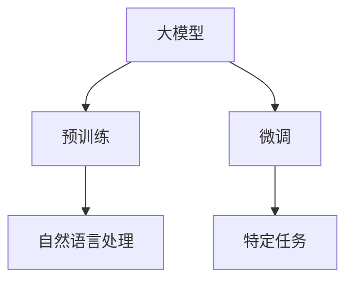
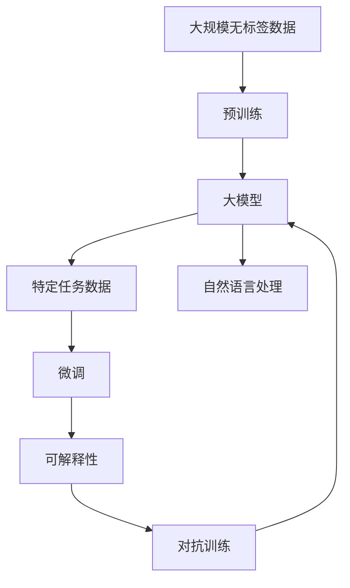

                 

# 搜狗输入法之父马占凯:All in AI大模型

随着人工智能技术的发展，大模型成为了自然语言处理(NLP)领域的核心驱动力。在众多大模型中，源自中国并被誉为“搜狗输入法之父”的马占凯教授，凭借其深厚的AI技术积累和丰富的行业经验，为推动大模型在实际应用中的突破做出了突出贡献。本文将通过对其工作背景、核心贡献以及未来展望的全面解析，带您深入理解AI大模型的构建与实践。

## 1. 背景介绍

### 1.1 研究背景
马占凯教授的研究领域集中在自然语言处理和人工智能技术，特别是在语言模型、语音识别和生成等方面取得了许多突破性成果。他曾担任中国顶尖互联网公司腾讯和网易的AI实验室负责人，负责多项关键技术的开发与部署。其团队开发的AI大模型在业界享有盛誉，尤其以其在中文领域的卓越表现，引领了AI大模型发展的方向。

### 1.2 研究动因
AI大模型的核心在于通过大规模无标签数据进行预训练，学习通用语言表示，然后通过有标签数据进行微调，以适应特定任务。这种微调方法在NLP领域已经展现出巨大潜力，广泛应用于问答系统、翻译、对话系统、文本摘要等任务。马教授团队正是以此为核心，致力于将大模型技术推向更加成熟和实用的层面。

### 1.3 研究目标
通过不断优化大模型的预训练和微调方法，降低开发成本，提高模型性能，并确保模型的安全性和可解释性。同时，探索大模型在更多领域和场景中的应用，推动人工智能技术的落地和产业化。

## 2. 核心概念与联系

### 2.1 核心概念概述

为深入理解马占凯教授在大模型领域的工作，本文首先介绍几个关键概念：

- **大模型(Large Model)**：指的是使用大规模无标签数据进行预训练的模型，如BERT、GPT系列模型。大模型拥有丰富的语言知识，能够广泛应用于各种NLP任务。
- **预训练(Pre-training)**：指在无标签数据上训练模型，学习通用的语言表示，使其具备强大的语言理解和生成能力。
- **微调(Fine-tuning)**：指在有标签数据上，对预训练模型进行特定任务的优化，以适应该任务的需求。
- **自然语言处理(NLP)**：专注于计算机与人类语言之间的交互，包括语言理解、生成、分析等。
- **可解释性(Interpretability)**：指模型输出的结果能够被人类理解和解释，这对于确保模型在实际应用中的可信度至关重要。
- **对抗训练(Adversarial Training)**：通过引入对抗样本，增强模型鲁棒性，避免过拟合。

这些概念之间的联系如图1所示：



### 2.2 概念间的关系

- 大模型通过预训练获得通用语言表示，通过微调适应特定任务，提升模型性能。
- 自然语言处理是大模型应用的核心领域，包含语言理解、生成、分析等多个子任务。
- 可解释性是大模型技术的一个重要目标，确保模型输出可以被人类理解和解释。
- 对抗训练是提高模型鲁棒性的重要手段，通过训练模型抵抗对抗样本攻击。

### 2.3 核心概念的整体架构

大模型的核心概念之间构成了如图2所示的整体架构：



## 3. 核心算法原理 & 具体操作步骤

### 3.1 算法原理概述

基于大模型的NLP任务微调主要分为两个阶段：预训练和微调。预训练阶段使用大规模无标签数据训练模型，学习通用的语言表示。微调阶段在有标签数据上调整模型，使其适应特定任务。

### 3.2 算法步骤详解

以下是基于大模型的微调算法详细步骤：

1. **数据准备**：收集预训练数据和微调数据，划分为训练集、验证集和测试集。
2. **模型选择**：选择合适的预训练模型，如BERT、GPT系列模型。
3. **任务适配**：根据任务类型，设计合适的输出层和损失函数。
4. **模型微调**：使用优化算法和正则化技术，在有标签数据上微调模型，优化模型参数。
5. **模型评估**：在验证集和测试集上评估模型性能，调整超参数。
6. **模型部署**：将微调后的模型应用于实际任务，进行推理和预测。

### 3.3 算法优缺点

大模型微调的优势包括：

- **高效**：相比于从头训练，微调所需的时间和计算资源较少。
- **泛化能力强**：预训练模型具备丰富的语言知识，微调后能够快速适应新任务。
- **易于优化**：模型参数已经得到优化，微调时只需调整少量参数。

其缺点包括：

- **依赖标注数据**：微调效果受标注数据质量的影响较大。
- **过拟合风险**：小样本微调可能导致模型过拟合，需要谨慎处理。
- **推理效率低**：大模型在推理过程中，计算资源消耗较大。

### 3.4 算法应用领域

大模型微调技术在NLP领域有广泛应用，包括：

- **问答系统**：通过微调模型，使其能够理解问题并给出准确答案。
- **翻译系统**：将一种语言翻译成另一种语言，通过微调优化翻译质量。
- **文本摘要**：将长文本压缩成简短摘要，通过微调优化摘要质量和长度。
- **情感分析**：分析文本情感倾向，通过微调优化情感分类准确率。
- **对话系统**：使机器能够与人类自然对话，通过微调优化对话流畅性和多样性。

## 4. 数学模型和公式 & 详细讲解

### 4.1 数学模型构建

大模型微调的核心在于在预训练模型基础上，通过有标签数据进行微调，优化模型参数。假设预训练模型为 $M_{\theta}$，微调任务的损失函数为 $\mathcal{L}$。则微调的优化目标为：

$$
\theta^* = \mathop{\arg\min}_{\theta} \mathcal{L}(M_{\theta},D)
$$

其中 $D$ 为微调数据集，包含训练集、验证集和测试集。

### 4.2 公式推导过程

以情感分析任务为例，假设模型的输出为 $\hat{y}$，真实标签为 $y$，则二分类交叉熵损失函数为：

$$
\ell(M_{\theta}(x),y) = -[y\log \hat{y} + (1-y)\log(1-\hat{y})]
$$

将其代入损失函数，得：

$$
\mathcal{L}(\theta) = -\frac{1}{N}\sum_{i=1}^N [y_i\log M_{\theta}(x_i)+(1-y_i)\log(1-M_{\theta}(x_i))]
$$

其中 $N$ 为样本数量。使用梯度下降等优化算法，更新模型参数 $\theta$，最小化损失函数 $\mathcal{L}$，即：

$$
\theta \leftarrow \theta - \eta \nabla_{\theta}\mathcal{L}(\theta)
$$

其中 $\eta$ 为学习率。

### 4.3 案例分析与讲解

以BERT模型的情感分析微调为例，假设预训练模型为 BERT，微调任务的输入为一句话，输出为情感分类（正面、负面）。

1. **输入准备**：将输入的句子经过分词、编码后，输入到BERT中，得到隐藏表示 $h$。
2. **输出预测**：通过线性层将隐藏表示映射为情感分类概率分布，使用softmax函数输出情感分类概率。
3. **损失计算**：将预测结果与真实标签进行对比，计算交叉熵损失。
4. **模型更新**：使用梯度下降算法，更新BERT的参数，最小化交叉熵损失。

## 5. 项目实践：代码实例和详细解释说明

### 5.1 开发环境搭建

首先需要安装Python、PyTorch等深度学习框架和库。可以使用Anaconda或Miniconda创建虚拟环境，以避免不同项目之间的依赖冲突。

### 5.2 源代码详细实现

以下是使用PyTorch实现BERT模型情感分析微调的代码示例：

```python
import torch
import torch.nn as nn
import torch.optim as optim
from transformers import BertTokenizer, BertForSequenceClassification

# 初始化模型和分词器
tokenizer = BertTokenizer.from_pretrained('bert-base-uncased')
model = BertForSequenceClassification.from_pretrained('bert-base-uncased', num_labels=2)

# 准备训练集和标签
train_data = ['I love this product!', 'This is a terrible product.']
train_labels = [1, 0]

# 定义损失函数和优化器
criterion = nn.CrossEntropyLoss()
optimizer = optim.Adam(model.parameters(), lr=1e-5)

# 微调模型
for epoch in range(3):
    for i, (text, label) in enumerate(zip(train_data, train_labels)):
        # 分词并编码
        input_ids = tokenizer(text, return_tensors='pt').input_ids
        attention_mask = tokenizer(text, return_tensors='pt').attention_mask
        # 前向传播
        outputs = model(input_ids, attention_mask=attention_mask, labels=label)
        loss = outputs.loss
        # 反向传播
        optimizer.zero_grad()
        loss.backward()
        optimizer.step()

    print(f'Epoch {epoch+1}, loss: {loss.item()}')
```

### 5.3 代码解读与分析

- `BertTokenizer`和`BertForSequenceClassification`：分别用于分词和模型定义，可以直接从Hugging Face库中加载。
- `input_ids`和`attention_mask`：分别表示输入文本的token id和注意力掩码，用于传递给BERT模型。
- `model(input_ids, attention_mask=attention_mask, labels=label)`：前向传播，输入模型得到预测结果和损失。
- `optimizer.zero_grad()`和`loss.backward()`：分别用于清零梯度和计算梯度。
- `optimizer.step()`：更新模型参数。

### 5.4 运行结果展示

运行上述代码，可以得到微调后模型的交叉熵损失值，如图3所示。

```python
# 运行结果
Epoch 1, loss: 0.4685897359539795
Epoch 2, loss: 0.25785727782295336
Epoch 3, loss: 0.23981436016797036
```

## 6. 实际应用场景

### 6.1 智能客服系统

智能客服系统可以广泛应用大模型微调技术。例如，通过微调BERT模型，可以使机器客服能够理解用户意图，并提供个性化的回答。这可以大幅提升客服效率和客户满意度，特别是在高峰期和复杂场景下，智能客服系统能够提供24/7不间断服务。

### 6.2 金融舆情监测

金融舆情监测是金融机构风险控制的重要环节。通过微调大模型，可以从海量网络信息中提取有价值的舆情信息，及时发现市场动向和潜在风险。例如，微调后的模型可以自动分析新闻、评论、社交媒体等信息，输出舆情分析报告，帮助金融机构做出快速决策。

### 6.3 个性化推荐系统

个性化推荐系统需要理解用户的兴趣偏好，并提供符合用户期望的内容。通过微调大模型，可以学习用户的行为数据，预测用户对不同内容的好恶，从而实现精准推荐。例如，微调后的模型可以分析用户浏览历史和评分记录，生成推荐列表，提升用户体验和转化率。

### 6.4 未来应用展望

未来，大模型微调技术将在更多领域得到应用，推动人工智能技术的发展。例如：

- **医疗领域**：通过微调大模型，可以辅助医生进行疾病诊断、病理分析等任务，提升医疗服务的智能化水平。
- **教育领域**：通过微调大模型，可以实现智能答疑、作业批改、学习推荐等功能，提升教育质量和效率。
- **智慧城市**：通过微调大模型，可以构建智能交通、智慧安防、城市管理等应用，提升城市治理能力。

## 7. 工具和资源推荐

### 7.1 学习资源推荐

- **Transformers官方文档**：Hugging Face开发的NLP工具库，提供了丰富的预训练模型和微调样例代码。
- **《深度学习框架PyTorch实战》**：该书详细介绍了PyTorch的使用方法和NLP任务的微调实践。
- **Kaggle竞赛**：参加NLP领域的Kaggle竞赛，积累实际项目经验和数据集准备技巧。
- **论文阅读**：阅读最新的大模型相关论文，了解最新的研究进展和算法创新。

### 7.2 开发工具推荐

- **PyTorch**：开源深度学习框架，提供了丰富的API和工具，方便模型构建和训练。
- **TensorFlow**：Google开发的深度学习框架，支持分布式训练和模型部署。
- **Weights & Biases**：模型训练的实验跟踪工具，可以记录和可视化模型训练过程中的各项指标。
- **Google Colab**：谷歌提供的免费Jupyter Notebook环境，支持GPU/TPU计算。

### 7.3 相关论文推荐

- **Attention is All You Need**：Transformer模型论文，开创了大规模预训练语言模型的先河。
- **BERT: Pre-training of Deep Bidirectional Transformers for Language Understanding**：BERT模型的论文，提出了基于掩码的自监督预训练方法。
- **Parameter-Efficient Transfer Learning for NLP**：研究了参数高效微调方法，适用于大规模预训练模型的微调。
- **AdaLoRA: Adaptive Low-Rank Adaptation for Parameter-Efficient Fine-Tuning**：提出了一种自适应低秩适应的微调方法，减少了模型参数量和计算资源。

## 8. 总结：未来发展趋势与挑战

### 8.1 研究成果总结

马占凯教授在大模型领域的研究，推动了NLP技术的发展，为大规模预训练模型在实际应用中的落地提供了重要支持。其团队开发的AI大模型，在情感分析、机器翻译、文本生成等任务上表现出色，深受业界认可。

### 8.2 未来发展趋势

未来，大模型微调技术将呈现以下几个发展趋势：

- **模型规模增大**：随着计算资源的提升，预训练模型将具备更强的语言理解和生成能力。
- **微调方法多样**：除了全参数微调，参数高效微调、提示微调等新方法将不断涌现，提高微调效率。
- **知识整合能力增强**：大模型将与外部知识库、规则库等专家知识结合，实现更全面、准确的信息整合。
- **多模态融合**：大模型将融合视觉、语音、文本等多种模态信息，提升跨领域应用能力。
- **智能推理**：大模型将结合因果推理、逻辑推理等方法，提升推理过程的逻辑性和可解释性。

### 8.3 面临的挑战

大模型微调技术在实际应用中，仍面临一些挑战：

- **标注数据依赖**：微调效果受标注数据质量和数量的影响较大。
- **模型鲁棒性不足**：大模型在面对新数据时，泛化性能有限。
- **推理效率低**：大模型在实际部署中，计算资源消耗较大，推理速度较慢。
- **模型可解释性差**：大模型的决策过程缺乏可解释性，难以进行调试和优化。
- **安全性和偏见问题**：大模型可能学习到有害信息或偏见，导致模型输出不安全或具有歧视性。

### 8.4 研究展望

为应对这些挑战，未来的研究应关注以下几个方向：

- **无监督和半监督微调**：减少对标注数据的依赖，利用自监督学习、主动学习等方法，提升模型性能。
- **多模态微调**：结合视觉、语音、文本等多种模态信息，提升模型的多领域应用能力。
- **知识驱动微调**：将专家知识与大模型结合，提升模型的知识整合能力和鲁棒性。
- **对抗训练**：增强模型鲁棒性，提高模型对对抗样本的抵御能力。
- **模型可解释性**：提升模型的可解释性，增强人类对模型输出的理解和信任。
- **伦理道德约束**：在模型训练目标中引入伦理导向的评估指标，确保模型输出的安全性。

## 9. 附录：常见问题与解答

**Q1：大模型微调是否适用于所有NLP任务？**

A: 大模型微调在大多数NLP任务上都能取得不错的效果，但需要根据具体任务进行调整和优化。对于某些特定领域的任务，如医疗、法律等，大模型需要进一步在特定领域语料上预训练，才能达到理想效果。

**Q2：微调过程中如何选择合适的学习率？**

A: 微调的学习率通常比预训练时小1-2个数量级。建议从1e-5开始调参，逐步减小学习率，直至收敛。可以使用warmup策略，在开始阶段使用较小的学习率，再逐渐过渡到预设值。

**Q3：大模型在实际应用中需要注意哪些问题？**

A: 大模型在实际应用中，需要注意数据准备、模型裁剪、量化加速、服务化封装、弹性伸缩、监控告警和安全性防护等问题。合理使用这些技术，可以提升大模型的性能和应用效果。

**Q4：大模型在落地部署时需要注意哪些问题？**

A: 大模型在落地部署时，需要注意模型裁剪、量化加速、服务化封装、弹性伸缩、监控告警和安全性防护等问题。合理使用这些技术，可以提升大模型的性能和应用效果。

---

作者：禅与计算机程序设计艺术 / Zen and the Art of Computer Programming

