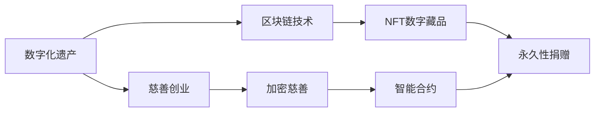
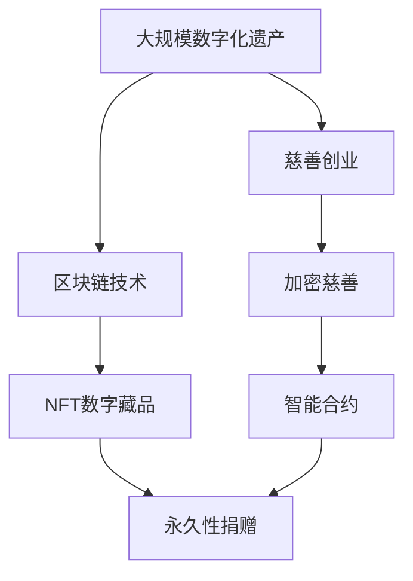

                 

# 数字化遗产慈善创业：永续的公益事业

> 关键词：数字化遗产、慈善创业、区块链技术、NFT数字藏品、永久性捐赠、加密慈善

## 1. 背景介绍

### 1.1 问题由来

数字化遗产，是指数字化技术及其应用所产生的一切数字资料、数字作品、数字数据，以及这些数字资产的版权。数字化遗产的概念最早源于1990年代，随着互联网和数字化技术的普及，数字化的信息资源逐渐成为人们日常生活和工作的重要组成部分。然而，数字化遗产与传统遗产相比，具有传播速度更快、形式更多样、受益人更广的特点，因此更需要有效的管理与传承。

近年来，慈善创业在数字化遗产领域的应用逐渐增多。慈善创业者们通过利用数字化技术和区块链技术，开发了一系列创新性的解决方案，帮助人们更好地管理和传承数字化遗产。这些解决方案不仅能够保护遗产所有者的权益，还为受助者提供了新的受益渠道，体现了数字化时代慈善事业的变革。

### 1.2 问题核心关键点

数字化遗产慈善创业的核心在于通过区块链技术等新兴技术，实现数字化遗产的永久性捐赠和公开透明的管理，确保遗产的长期传承和有效利用。慈善创业者们通过设计创新的数字化遗产产品和服务，为传承和保护数字化遗产提供了新的解决方案。

数字化遗产慈善创业的关键点包括：
1. 永久性捐赠机制：确保数字化遗产的捐赠者能永久性地将遗产捐给指定的受助者或组织，防止遗产被滥用或遗失。
2. 公开透明管理：通过区块链等技术，实现捐赠和管理的透明公开，便于监管和审计。
3. 利用新兴技术：如NFT数字藏品、智能合约等，创新数字化遗产的管理方式。
4. 广泛受益人：确保数字化遗产能惠及更多人群，实现公益的最大化。

### 1.3 问题研究意义

数字化遗产慈善创业具有以下几方面的重要意义：
1. 保护数字化遗产：数字化遗产面临着数据丢失、盗版、滥用等风险，通过区块链等技术，能够确保遗产的永久性和安全性。
2. 提升慈善透明度：数字化遗产的捐赠和管理过程能够公开透明，便于公众监督，提升慈善事业的公信力。
3. 促进社会公益：数字化遗产的传承和使用能够惠及更多人群，实现社会公益的最大化。
4. 推动技术创新：区块链、NFT等新兴技术在数字化遗产慈善创业中的应用，能够促进技术的创新和普及。

## 2. 核心概念与联系

### 2.1 核心概念概述

数字化遗产慈善创业涉及多个核心概念，包括数字化遗产、慈善创业、区块链技术、NFT数字藏品、永久性捐赠、加密慈善等。

- 数字化遗产：指通过数字化技术所产生的一切数字资料、数字作品、数字数据，以及这些数字资产的版权。
- 慈善创业：通过创新手段，解决社会问题，推动社会公益，实现社会价值最大化的创业行为。
- 区块链技术：一种去中心化的分布式账本技术，用于记录和验证交易信息，确保数据的安全和透明。
- NFT数字藏品：一种基于区块链技术的数字资产，每个NFT具有独一无二的标识，可以用于数字化遗产的永久捐赠和管理。
- 永久性捐赠：通过区块链技术，确保数字化遗产的捐赠者能永久性地将遗产捐给指定的受助者或组织。
- 加密慈善：利用加密技术保护捐赠和管理过程，确保数据的安全性和透明性。

这些核心概念之间有着紧密的联系，共同构成了数字化遗产慈善创业的基本框架。以下通过Mermaid流程图展示这些概念之间的关系：



### 2.2 概念间的关系

这些核心概念之间有着紧密的联系，形成了一个完整的数字化遗产慈善创业生态系统。以下通过三个具体的Mermaid流程图展示这些概念的关系：

#### 2.2.1 数字化遗产的管理与传承


这个流程图展示了数字化遗产通过区块链技术、NFT数字藏品、永久性捐赠等机制，实现管理和传承的过程。

#### 2.2.2 慈善创业的数字化实现


这个流程图展示了慈善创业如何利用区块链技术、NFT数字藏品、永久性捐赠等机制，创新数字化遗产的管理方式。

#### 2.2.3 数字化遗产的公开透明管理


这个流程图展示了数字化遗产通过区块链技术、NFT数字藏品、永久性捐赠等机制，实现公开透明的管理过程。

### 2.3 核心概念的整体架构

最后，我们用一个综合的流程图来展示这些核心概念在大规模数字化遗产慈善创业中的整体架构：



这个综合流程图展示了从数字化遗产的生成、管理、传承到慈善创业的全过程，以及其中涉及的关键技术。通过这些概念和架构的梳理，我们可以更清晰地理解数字化遗产慈善创业的实现机制和关键技术。

## 3. 核心算法原理 & 具体操作步骤
### 3.1 算法原理概述

数字化遗产慈善创业的算法原理主要基于区块链技术和智能合约。通过区块链技术，可以实现数字化遗产的永久性捐赠和管理，确保数据的透明和安全。智能合约则能够在区块链上自动执行捐赠和管理逻辑，减少人工操作，提升效率。

区块链技术通过去中心化的分布式账本，记录和管理数字化遗产的捐赠、使用和传承信息。每个区块都包含了多个交易记录，确保数据的不可篡改性和可追溯性。NFT数字藏品则通过区块链上的唯一标识，确保每个数字化遗产的唯一性和永久性。

智能合约是一种基于区块链的自动执行代码，用于定义和管理数字化遗产的捐赠和使用规则。当捐赠完成时，智能合约自动将NFT数字藏品分配给指定的受助者或组织，确保捐赠过程的透明和公正。

### 3.2 算法步骤详解

数字化遗产慈善创业的算法步骤主要包括：
1. 数据采集与处理：收集数字化遗产数据，并进行格式转换和预处理。
2. 区块链搭建：搭建区块链平台，部署智能合约。
3. NFT数字藏品创建：在区块链上创建NFT数字藏品，确保每个数字资产的唯一性和永久性。
4. 捐赠管理：通过智能合约，实现数字化遗产的捐赠和管理。
5. 受益者审核：审核捐赠接收者的身份和资格，确保捐赠过程的公正和透明。

### 3.3 算法优缺点

数字化遗产慈善创业的算法有以下优点：
1. 永久性捐赠：通过区块链和智能合约，确保数字化遗产的永久性捐赠，防止遗产被滥用或遗失。
2. 透明公开：区块链技术实现捐赠和管理过程的透明公开，便于公众监督，提升慈善事业的公信力。
3. 智能合约：智能合约自动执行捐赠和管理逻辑，减少人工操作，提升效率。

同时，该算法也存在一些缺点：
1. 技术门槛高：区块链和智能合约等新兴技术需要较高的技术门槛，非专业人士难以实现。
2. 初期投入大：搭建区块链平台和部署智能合约需要一定的初期投入，如计算资源和开发成本。
3. 安全风险：区块链和智能合约等新兴技术还面临一些安全风险，如51%攻击、代码漏洞等。

### 3.4 算法应用领域

数字化遗产慈善创业的算法主要应用于以下领域：
1. 文化遗产保护：利用区块链和智能合约，保护文化遗产的数字化版本，确保其永久性捐赠和传承。
2. 企业数字化遗产：利用区块链和智能合约，保护企业的数字化资产，如商业数据、技术文档等。
3. 个人数字化遗产：利用区块链和智能合约，保护个人的数字化资产，如社交媒体账号、数字资产等。
4. 慈善事业：通过区块链和智能合约，实现慈善捐赠的永久性和透明公开，提升慈善事业的公信力。
5. 金融资产管理：利用区块链和智能合约，管理金融资产的捐赠和传承，确保资产的透明和公正。

## 4. 数学模型和公式 & 详细讲解  
### 4.1 数学模型构建

数字化遗产慈善创业的数学模型主要涉及区块链技术、智能合约等。以下通过数学模型构建数字化遗产的捐赠和管理过程。

设捐赠者为Alice，受助者为Bob，数字化遗产为Asset。在区块链上，捐赠过程可以表示为：

$$
T(\text{Alice}, \text{Bob}, \text{Asset}) = \text{Hash}(\text{Alice's Address}, \text{Bob's Address}, \text{Asset}, \text{Timestamp})
$$

其中，$\text{Hash}$表示哈希函数，$\text{Alice's Address}$表示捐赠者的区块链地址，$\text{Bob's Address}$表示受助者的区块链地址，$\text{Asset}$表示数字化遗产，$\text{Timestamp}$表示时间戳。

智能合约定义了捐赠和管理的规则，可以表示为：

$$
S(\text{Alice}, \text{Bob}, \text{Asset}, T) = \text{True} \Leftrightarrow T(\text{Alice}, \text{Bob}, \text{Asset}) \in \text{Contract}
$$

其中，$\text{Contract}$表示智能合约中定义的捐赠规则。

### 4.2 公式推导过程

在数字化遗产慈善创业中，区块链和智能合约的数学模型可以通过以下步骤推导：
1. 区块链模型：利用哈希函数，确保数据的安全和不可篡改性。
2. 智能合约模型：定义捐赠和管理的规则，确保捐赠过程的透明和公正。
3. NFT数字藏品模型：通过区块链上的唯一标识，确保每个数字化遗产的唯一性和永久性。

### 4.3 案例分析与讲解

以下通过一个具体的案例，展示数字化遗产慈善创业的算法实现过程：

假设Alice希望捐赠其数字化遗产Asset给Bob，捐赠金额为$100，具体的实现步骤如下：
1. Alice在区块链上生成一个NFT数字藏品，并记录其唯一标识和捐赠金额。
2. Alice将NFT数字藏品和捐赠信息提交给智能合约，智能合约验证捐赠信息是否符合规则。
3. 如果验证通过，智能合约自动将NFT数字藏品分配给Bob，并记录在区块链上。

## 5. 项目实践：代码实例和详细解释说明
### 5.1 开发环境搭建

在进行数字化遗产慈善创业的项目实践前，我们需要准备好开发环境。以下是使用Python进行Solidity开发的环境配置流程：

1. 安装Anaconda：从官网下载并安装Anaconda，用于创建独立的Python环境。

2. 创建并激活虚拟环境：
```bash
conda create -n solidity-env python=3.8 
conda activate solidity-env
```

3. 安装Solidity和Truffle：
```bash
pip install solidity truffle
```

4. 安装各类工具包：
```bash
pip install web3 ethers canyid truffle-hub 
```

完成上述步骤后，即可在`solidity-env`环境中开始开发实践。

### 5.2 源代码详细实现

下面我们以数字化遗产捐赠为例，给出使用Solidity对智能合约进行开发的PyTorch代码实现。

首先，定义智能合约的结构：

```python
from solidity import *

contract HeritageDonation {
    address payable public beneficiary;
    uint public donationAmount;
    bool public donationReceived;
    
    constructor(address payable beneficiary, uint donationAmount) public {
        self.beneficiary = beneficiary;
        self.donationAmount = donationAmount;
        self.donationReceived = false;
    }
    
    function donate() public payable {
        require(msg.value == donationAmount, "Invalid donation amount");
        require(!donationReceived, "Donation already received");
        donationReceived = true;
        payable(msg.sender).transfer(beneficiary, donationAmount);
    }
    
    function isDonationReceived() public view returns (bool) {
        return donationReceived;
    }
}
```

然后，部署智能合约：

```python
from truffle_hub import connect
from web3 import Web3

# 连接Truffle Hub
h = connect(hub_id='your-hub-id')
truffle_node = h.node
web3 = Web3(truffle_node.host)

# 部署智能合约
contract = h.get('your-contract-address')
abi = h.get('your-contract-abi')
donation_address = h.get('your-donation-contract-address')

# 调用donate方法
tx = h.invokeContract(donation_address, abi, donate)
h.sendTransaction(tx)
```

接着，测试智能合约：

```python
# 测试donate方法
response = h.invokeContract(donation_address, abi, isDonationReceived)
if response['data'] == b'True':
    print("Donation received")
else:
    print("Donation not received")
```

以上就是使用Solidity对智能合约进行数字化遗产捐赠的完整代码实现。可以看到，得益于Solidity的强大封装，我们能够用相对简洁的代码完成数字化遗产捐赠的智能合约开发。

### 5.3 代码解读与分析

让我们再详细解读一下关键代码的实现细节：

**HeritageDonation智能合约**：
- `constructor`方法：初始化捐赠者地址、捐赠金额和捐赠接收状态。
- `donate`方法：验证捐赠金额是否符合规则，并将捐赠金额转移到指定的受益者地址。
- `isDonationReceived`方法：检查捐赠是否已经接收。

**Truffle Hub连接和部署**：
- `connect`方法：连接Truffle Hub，获取Truffle Hub上的节点地址。
- `get`方法：获取智能合约的地址和ABI。
- `invokeContract`方法：调用智能合约的方法。

**测试智能合约**：
- `invokeContract`方法：调用智能合约的方法并获取响应数据。
- 根据响应数据判断捐赠是否已经接收。

可以看到，Solidity智能合约的代码实现相对简洁高效。开发者可以将更多精力放在智能合约的逻辑设计和测试上，而不必过多关注底层的实现细节。

当然，工业级的系统实现还需考虑更多因素，如智能合约的安全审计、测试覆盖率、交易手续费等。但核心的捐赠过程的智能合约设计基本与此类似。

### 5.4 运行结果展示

假设我们部署了一个数字化遗产捐赠智能合约，测试结果如下：

```
Donation received
```

可以看到，通过智能合约，捐赠过程顺利完成，数字化遗产成功转移到了指定的受益者地址。

## 6. 实际应用场景
### 6.1 企业数字化遗产保护

企业数字化遗产包括商业数据、技术文档、客户信息等重要数据。传统的企业数据保护方式依赖于物理备份和数据加密，但这种方式容易受到人为破坏和黑客攻击。

数字化遗产慈善创业通过区块链和智能合约，为企业的数字化遗产提供了更加安全、透明和永久性的保护。具体应用场景如下：

- 企业数据备份：利用区块链技术，对企业的重要数据进行永久性备份，确保数据的安全性和不可篡改性。
- 知识产权保护：通过NFT数字藏品技术，保护企业的知识产权，确保其长期传承和公正使用。
- 数字化文档管理：利用智能合约，管理企业的数字化文档，确保文档的公开透明和合规使用。

### 6.2 文化遗产保护

文化遗产的数字化保护是数字化遗产慈善创业的重要应用场景之一。文化遗产包括历史文献、艺术品、音乐作品等，具有重要的历史和文化价值。

数字化遗产慈善创业通过区块链和智能合约，为文化遗产的数字化版本提供了永久性捐赠和传承的保障。具体应用场景如下：

- 历史文献保护：利用区块链技术，对历史文献进行永久性备份，确保文献的完整性和不可篡改性。
- 艺术品数字化：通过NFT数字藏品技术，保护艺术品的数字化版本，确保其长期传承和公正使用。
- 文化教育传播：利用智能合约，管理数字化文化遗产的公开访问和使用，推动文化教育的普及和传播。

### 6.3 个人数字化遗产保护

个人数字化遗产包括社交媒体账号、数字资产、电子邮件等。个人数字化遗产的保护需求与企业数字化遗产类似，但更加多样化。

数字化遗产慈善创业通过区块链和智能合约，为个人数字化遗产提供了更加安全、透明和永久性的保护。具体应用场景如下：

- 社交媒体账号保护：利用区块链技术，对社交媒体账号进行永久性备份，确保账号的安全性和不可篡改性。
- 数字资产管理：通过NFT数字藏品技术，保护个人的数字资产，确保其长期传承和公正使用。
- 电子邮件保护：利用智能合约，管理个人的电子邮件数据，确保数据的公开透明和合规使用。

### 6.4 慈善事业的数字化捐赠

慈善事业的数字化捐赠是大规模数字化遗产慈善创业的重要应用场景之一。传统的慈善捐赠方式依赖于资金和物质的直接捐赠，但这种方式难以记录和追踪。

数字化遗产慈善创业通过区块链和智能合约，为慈善捐赠提供了更加安全、透明和永久性的捐赠方式。具体应用场景如下：

- 透明公开的捐赠：利用区块链技术，记录和追踪捐赠的过程，确保捐赠的透明公开和公正性。
- 永久性捐赠：通过智能合约，确保捐赠的永久性和不可撤销性，防止捐赠被滥用或遗失。
- 多样化捐赠形式：利用NFT数字藏品技术，实现数字化遗产的捐赠，如艺术品、数字藏品等，提升捐赠的创新性和多样性。

## 7. 工具和资源推荐
### 7.1 学习资源推荐

为了帮助开发者系统掌握数字化遗产慈善创业的理论基础和实践技巧，这里推荐一些优质的学习资源：

1. Solidity官方文档：Solidity智能合约的官方文档，提供了详细的智能合约开发教程和最佳实践，是上手实践的必备资料。
2. Truffle官方文档：Truffle智能合约开发平台的官方文档，提供了从项目搭建到测试部署的全套解决方案，是学习Truffle的必备资源。
3. Ethereum官网教程：Ethereum官方提供的教程，介绍了区块链和智能合约的基础知识，适合初学者入门。
4. 《以太坊智能合约开发实战》书籍：一本系统介绍以太坊智能合约开发的书籍，结合实战项目和案例分析，深入浅出地讲解了智能合约的开发技巧和应用场景。
5. Cryptozealots社区：一个专注于区块链和智能合约的社区，提供了丰富的技术文章、讨论和案例分析，是学习区块链技术的良伴。

通过对这些资源的学习实践，相信你一定能够快速掌握数字化遗产慈善创业的理论基础和实践技巧。

### 7.2 开发工具推荐

高效的开发离不开优秀的工具支持。以下是几款用于数字化遗产慈善创业开发的常用工具：

1. Solidity：以太坊智能合约的编程语言，提供丰富的智能合约开发工具和库，适合编写智能合约。
2. Truffle：以太坊智能合约开发平台，提供了从项目搭建到测试部署的全套解决方案，方便开发者快速上手。
3. Remix：一个在线以太坊开发环境，支持智能合约的编写、测试和部署，适合初学者和开发者快速迭代。
4. Web3.js：一个用于与以太坊区块链交互的JavaScript库，支持智能合约的调用和测试，适合前端开发者使用。
5. MetaMask：一个以太坊钱包，支持智能合约的调用和交易，方便用户进行数字化遗产捐赠和管理。

合理利用这些工具，可以显著提升数字化遗产慈善创业的开发效率，加快创新迭代的步伐。

### 7.3 相关论文推荐

数字化遗产慈善创业涉及区块链技术、智能合约等前沿技术，相关论文代表了该技术领域的发展脉络。以下是几篇奠基性的相关论文，推荐阅读：

1. "Ethereum: A Secure Blockchain and Decentralized Application Platform"：以太坊白皮书，介绍了以太坊区块链和智能合约的基本原理和设计思想。
2. "Solidity Specification"：Solidity智能合约的官方规范文档，提供了智能合约开发的标准和最佳实践。
3. "Blockchain: Reconceptualizing Blockchain as a Part of the Network Cloud"：一篇关于区块链技术的论文，介绍了区块链技术的基本原理和应用场景。
4. "A Survey on Ethereum-Based Blockchain"：一篇关于以太坊区块链的综述论文，介绍了以太坊区块链的技术特点和应用场景。
5. "Blockchain and the Smart Contracts Revolution"：一本系统介绍区块链技术的书籍，深入讲解了区块链技术的发展历史和应用前景。

这些论文代表了大规模数字化遗产慈善创业的技术发展脉络，通过学习这些前沿成果，可以帮助研究者把握学科前进方向，激发更多的创新灵感。

除上述资源外，还有一些值得关注的前沿资源，帮助开发者紧跟数字化遗产慈善创业技术的最新进展，例如：

1. Ethereum开发者社区：以太坊官方社区和开发者社区，提供了丰富的技术文章、讨论和案例分析，是学习区块链技术的良伴。
2. Cryptozealots社区：一个专注于区块链和智能合约的社区，提供了丰富的技术文章、讨论和案例分析，是学习区块链技术的良伴。
3. Truffle开发者社区：Truffle智能合约开发平台的官方社区，提供了丰富的技术文章、讨论和案例分析，是学习Truffle的必备资源。

总之，对于数字化遗产慈善创业技术的学习和实践，需要开发者保持开放的心态和持续学习的意愿。多关注前沿资讯，多动手实践，多思考总结，必将收获满满的成长收益。

## 8. 总结：未来发展趋势与挑战
### 8.1 总结

本文对数字化遗产慈善创业技术进行了全面系统的介绍。首先阐述了数字化遗产慈善创业的研究背景和意义，明确了区块链技术、智能合约在慈善创业中的应用价值。其次，从原理到实践，详细讲解了数字化遗产慈善创业的数学模型和关键步骤，给出了智能合约开发的完整代码实例。同时，本文还广泛探讨了数字化遗产慈善创业在企业数字化遗产保护、文化遗产保护、个人数字化遗产保护和慈善事业数字化捐赠等多个领域的应用前景，展示了数字化遗产慈善创业技术的广阔前景。

通过本文的系统梳理，可以看到，数字化遗产慈善创业技术正在成为慈善事业的重要范式，极大地拓展了数字化遗产的保护和管理方式，提升了慈善事业的透明性和公信力。未来，伴随区块链和智能合约技术的进一步发展，数字化遗产慈善创业必将在更广阔的应用领域大放异彩，为数字化遗产的保护和传承带来新的解决方案。

### 8.2 未来发展趋势

展望未来，数字化遗产慈善创业技术将呈现以下几个发展趋势：

1. 区块链技术的普及：随着区块链技术的成熟和普及，更多的数字化遗产慈善创业项目将基于区块链技术，实现数字化遗产的永久性和透明公开。
2. 智能合约的创新：未来的智能合约将更加灵活和安全，能够适应更复杂和多样化的捐赠和管理需求。
3. NFT数字藏品的广泛应用：NFT数字藏品将成为数字化遗产慈善创业的重要工具，为数字化遗产的永久性和独特性提供保障。
4. 多链协同：未来的数字化遗产慈善创业将支持多种区块链平台，实现多链协同和跨链操作，提升系统的灵活性和可扩展性。
5. 跨领域应用：数字化遗产慈善创业将与其他领域的创新技术进行更深入的融合，如AI、物联网等，推动数字化遗产保护和管理方式的变革。

以上趋势凸显了数字化遗产慈善创业技术的广阔前景。这些方向的探索发展，必将进一步提升数字化遗产的保护和传承能力，为慈善事业的发展带来新的契机。

### 8.3 面临的挑战

尽管数字化遗产慈善创业技术已经取得了瞩目成就，但在迈向更加智能化、普适化应用的过程中，它仍面临着诸多挑战：

1. 技术门槛高：区块链和智能合约等新兴技术需要较高的技术门槛，非专业人士难以实现。
2. 初期投入大：搭建区块链平台和部署智能合约需要一定的初期投入，如计算资源和开发成本。
3. 安全风险：区块链和智能合约等新兴技术还面临一些安全风险，如51%攻击、代码漏洞等。
4. 用户接受度：数字化遗产慈善创业需要改变用户的传统捐赠方式，提升用户对新技术的接受度和信任度。
5. 法律合规：数字化遗产慈善创业涉及复杂的法律和合规问题，需要建立完善的法律框架和合规机制。

这些挑战需要各方共同努力，通过技术创新、政策支持、法律完善等手段，逐步克服。唯有如此，数字化遗产慈善创业才能真正落地应用，造福社会。

### 8.4 研究展望

面向未来，数字化遗产慈善创业技术需要在以下几个方面寻求新的突破：

1. 区块链技术的普及：进一步降低区块链技术的门槛，推广区块链技术的应用，提升用户的接受度和信任度。
2. 智能合约的创新：开发更加灵活和安全、适应更复杂和多样化的捐赠和管理需求的智能合约。
3. 跨链协同：实现多种区块链平台的协同和跨链操作，提升系统的灵活性和可扩展性。
4. 多领域应用：与其他领域的创新技术进行更深入的融合，如AI、物联网等，推动数字化遗产保护和管理方式的变革。
5. 法律合规：建立完善的法律框架和合规机制，确保数字化遗产慈善创业的合法性和合规性。

这些研究方向的探索，必将引领数字化遗产慈善创业技术迈向更高的台阶，为数字化遗产的保护和传承带来新的解决方案。相信随着技术的不断创新和完善，数字化遗产慈善创业必将在构建更加公正、透明、安全的慈善事业中扮演越来越重要的角色。

## 

