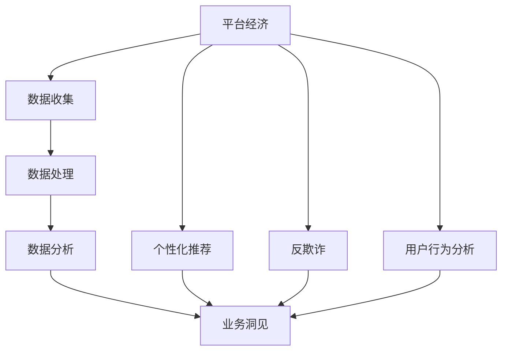
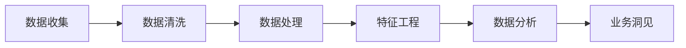
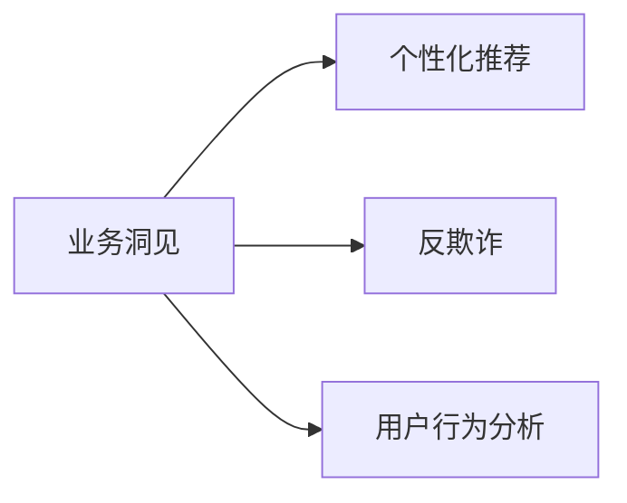
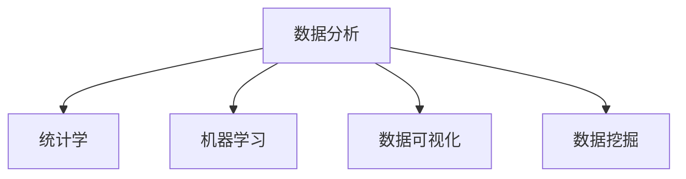
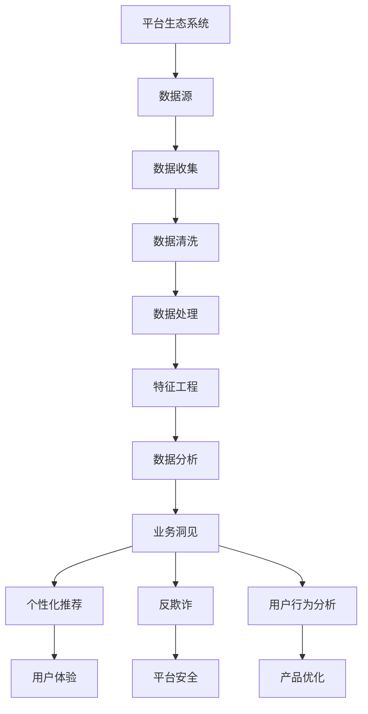

                 

# 数据分析在平台经济中的应用案例：如何借鉴成功经验？

> 关键词：平台经济,数据分析,业务洞见,个性化推荐,反欺诈,用户行为分析

## 1. 背景介绍

### 1.1 问题由来
随着互联网技术的快速发展，平台经济模式逐渐成为各行各业的重要趋势。平台经济通过连接供需双方，最大化资源利用效率，优化市场结构，提升用户体验。数据分析作为平台经济的核心驱动力，通过挖掘数据价值，驱动业务决策，实现运营优化和增长。

当前，各行各业的平台经济都在积极探索如何通过数据分析来优化业务，提升竞争力。例如，电子商务、金融科技、社交媒体等领域，数据分析已经深入应用到产品推荐、风险控制、用户留存等多个环节。

### 1.2 问题核心关键点
数据分析在平台经济中的应用，关键在于如何从海量数据中提取有价值的信息，驱动业务决策。具体来说，包括以下几个核心点：

1. **数据收集**：从平台生态系统中的各种数据源（如用户行为数据、交易数据、社交数据等）中采集数据。
2. **数据处理**：对数据进行清洗、归一化、特征工程等预处理，构建数据分析模型。
3. **数据分析**：利用统计学、机器学习等方法对数据进行分析，生成业务洞见。
4. **业务应用**：将数据分析结果应用于业务决策，如个性化推荐、反欺诈、用户行为分析等。

### 1.3 问题研究意义
数据分析在平台经济中的应用，对于提升平台生态系统的运营效率、优化用户体验、降低风险、提高盈利能力具有重要意义。具体来说：

1. **业务决策优化**：通过数据分析驱动的决策，可以提高平台的运营效率和用户体验。
2. **风险管理**：利用数据分析进行欺诈检测、信用评估等，降低平台风险。
3. **用户洞察**：通过分析用户行为数据，了解用户需求和行为模式，优化产品和服务。
4. **增长驱动**：利用数据分析挖掘用户潜在需求，实现精准营销和用户增长。
5. **竞争力提升**：通过优化平台算法和策略，提升平台的市场竞争力。

## 2. 核心概念与联系

### 2.1 核心概念概述

为了更好地理解数据分析在平台经济中的应用，本节将介绍几个密切相关的核心概念：

- **平台经济(Platform Economy)**：通过连接供需双方，最大化资源利用效率，优化市场结构，提升用户体验的商业模式。
- **数据分析(Data Analysis)**：通过数据收集、处理和分析，从海量数据中提取有价值信息的过程。
- **业务洞见(Business Insights)**：通过数据分析生成的对业务决策有指导意义的结论和建议。
- **个性化推荐(Personalized Recommendation)**：根据用户行为和偏好，生成个性化的推荐结果。
- **反欺诈(Anti-Fraud)**：利用数据分析进行欺诈检测和预防。
- **用户行为分析(User Behavior Analysis)**：通过对用户行为数据的分析，了解用户需求和行为模式，优化产品和服务。

这些核心概念之间存在着紧密的联系，形成了平台经济中数据分析应用的完整生态系统。下面通过一个Mermaid流程图来展示这些概念之间的联系：



这个流程图展示了数据分析在平台经济中的应用过程：

1. 平台经济首先通过数据收集获取各种数据源。
2. 对数据进行清洗和预处理，构建数据集。
3. 利用数据分析方法对数据进行分析，生成业务洞见。
4. 将业务洞见应用于个性化推荐、反欺诈和用户行为分析等业务场景。

### 2.2 概念间的关系

这些核心概念之间存在着紧密的联系，形成了平台经济中数据分析应用的完整生态系统。下面通过几个Mermaid流程图来展示这些概念之间的关系。

#### 2.2.1 数据分析的流程



这个流程图展示了数据分析的基本流程：

1. 数据收集：从平台生态系统中的各种数据源中采集数据。
2. 数据清洗：对数据进行清洗和预处理，去除噪声和异常值。
3. 特征工程：对数据进行特征提取和构建，生成模型需要的输入特征。
4. 数据分析：利用统计学、机器学习等方法对数据进行分析，生成业务洞见。

#### 2.2.2 业务洞见的应用场景



这个流程图展示了业务洞见在平台经济中的应用场景：

1. 业务洞见可以驱动个性化推荐，提升用户体验和留存率。
2. 业务洞见可以用于反欺诈，降低平台风险。
3. 业务洞见可以用于用户行为分析，优化产品和服务。

#### 2.2.3 数据分析的工具和技术



这个流程图展示了数据分析所需的技术工具：

1. 统计学：用于描述和分析数据的基本统计方法。
2. 机器学习：用于构建和训练各种预测模型，提取数据中的规律和趋势。
3. 数据可视化：用于展示和分析数据，提供直观的业务洞见。
4. 数据挖掘：用于挖掘数据中的隐含模式和关联，发现新的业务机会。

### 2.3 核心概念的整体架构

最后，我们用一个综合的流程图来展示这些核心概念在大数据分析过程中的整体架构：



这个综合流程图展示了从数据收集到业务洞见的完整过程，以及业务洞见在个性化推荐、反欺诈和用户行为分析中的应用。通过这些流程图，我们可以更清晰地理解数据分析在平台经济中的应用过程和关键环节。

## 3. 核心算法原理 & 具体操作步骤
### 3.1 算法原理概述

数据分析在平台经济中的应用，主要依赖于各种统计学和机器学习算法。其核心思想是从海量数据中提取有价值的信息，通过分析和建模，驱动业务决策。

以个性化推荐为例，个性化推荐系统通过分析用户行为数据，生成个性化的推荐结果，从而提升用户体验和留存率。其算法原理主要包括以下几个步骤：

1. **用户行为建模**：通过分析用户的历史行为数据，构建用户行为模型。
2. **物品特征提取**：对推荐系统中的物品（如商品、内容、服务）进行特征提取，构建物品特征向量。
3. **相似度计算**：计算用户与物品之间的相似度，构建用户-物品关联矩阵。
4. **推荐算法优化**：利用推荐算法（如协同过滤、基于内容的推荐、深度学习等）对相似度矩阵进行优化，生成推荐结果。

### 3.2 算法步骤详解

下面以电商平台的个性化推荐系统为例，详细介绍个性化推荐的核心算法步骤：

**Step 1: 用户行为数据收集**

首先，收集用户的浏览、点击、购买等行为数据。这些数据可以从平台的用户行为日志中提取，包括用户ID、时间戳、点击次数、浏览时长、购买记录等。

**Step 2: 用户行为数据预处理**

对收集到的用户行为数据进行清洗和预处理，去除噪声和异常值。例如，去除不完整的日志记录、处理缺失值、归一化数据等。

**Step 3: 构建用户行为模型**

利用机器学习算法（如协同过滤、深度学习等）构建用户行为模型。例如，可以使用协同过滤算法，基于用户历史行为数据，推荐相似物品；或者使用深度学习模型（如RNN、CNN等），从用户行为数据中提取隐含模式和趋势。

**Step 4: 物品特征提取**

对推荐系统中的物品进行特征提取，生成物品特征向量。这些特征可以是物品的属性（如商品类别、价格、描述等），也可以是通过用户行为数据计算得到的隐含特征（如用户评分、标签等）。

**Step 5: 相似度计算**

计算用户与物品之间的相似度，构建用户-物品关联矩阵。相似度计算方法包括余弦相似度、皮尔逊相关系数、欧几里得距离等。

**Step 6: 推荐算法优化**

利用推荐算法（如协同过滤、基于内容的推荐、深度学习等）对相似度矩阵进行优化，生成推荐结果。例如，可以使用协同过滤算法，基于用户历史行为数据，推荐相似物品；或者使用深度学习模型（如RNN、CNN等），从用户行为数据中提取隐含模式和趋势，生成推荐结果。

### 3.3 算法优缺点

个性化推荐系统在电商平台中的应用，具有以下优点：

1. **提升用户体验**：通过个性化推荐，用户可以更快找到感兴趣的商品，提升购物体验。
2. **增加用户留存率**：个性化推荐可以为用户提供更多有价值的内容，增加用户黏性和留存率。
3. **提高转化率**：个性化推荐可以精准匹配用户需求，提升商品转化率，增加平台收入。

但同时，个性化推荐系统也存在以下缺点：

1. **数据隐私问题**：个性化推荐需要收集大量用户行为数据，可能涉及用户隐私和数据安全问题。
2. **冷启动问题**：对于新用户或新商品，由于缺乏历史数据，个性化推荐效果不佳。
3. **模型复杂性**：个性化推荐模型需要处理大量数据和特征，可能面临模型复杂度高、训练时间长的问题。
4. **推荐多样性**：个性化推荐可能过度关注用户兴趣，导致推荐结果多样性不足，影响用户体验。

### 3.4 算法应用领域

个性化推荐系统在电商平台中的应用非常广泛，主要包括以下几个领域：

1. **商品推荐**：根据用户历史行为数据，推荐相似商品，增加购买机会。
2. **内容推荐**：根据用户历史阅读、观看等行为数据，推荐相关内容，增加用户黏性。
3. **广告推荐**：根据用户兴趣和行为数据，推荐相关广告，提升广告效果。
4. **金融推荐**：根据用户行为数据，推荐理财产品和金融服务，提升金融产品销售。
5. **教育推荐**：根据用户学习行为数据，推荐相关课程和学习资源，提升学习效果。

## 4. 数学模型和公式 & 详细讲解 & 举例说明

### 4.1 数学模型构建

以电商平台的个性化推荐系统为例，构建用户行为模型。假设平台收集到的用户行为数据为 $\{(x_i, y_i)\}_{i=1}^N$，其中 $x_i$ 表示用户行为，$y_i$ 表示用户标签。

首先，通过统计学方法（如频率统计、平均数、方差等）对用户行为数据进行描述性分析，了解用户行为的基本特征。然后，利用机器学习算法（如协同过滤、深度学习等）构建用户行为模型，生成用户行为标签 $\hat{y_i}$。

### 4.2 公式推导过程

以协同过滤算法为例，推导个性化推荐系统的推荐公式。

假设用户 $u$ 对物品 $i$ 的评分（如购买次数、点击次数等）为 $R_{ui}$，物品 $i$ 的特征向量为 $X_i$，用户 $u$ 的特征向量为 $X_u$。则协同过滤算法的推荐公式为：

$$
\hat{y_u} = \frac{\sum_{i=1}^{N} \alpha_i R_{ui} \phi_i(X_i)}{\sum_{i=1}^{N} \alpha_i \phi_i(X_i)}
$$

其中 $\alpha_i$ 表示物品 $i$ 的权重，$\phi_i(X_i)$ 表示物品 $i$ 的特征函数。

在实际应用中，为了提高推荐效果，往往需要对协同过滤算法进行优化，如使用改进的协同过滤算法（如基于SVD的协同过滤），引入用户行为标签，构建用户-物品关联矩阵，生成推荐结果。

### 4.3 案例分析与讲解

以京东平台的个性化推荐系统为例，介绍个性化推荐系统的应用效果。

京东平台的个性化推荐系统通过分析用户的历史购买、浏览等行为数据，构建用户行为模型，生成个性化推荐结果。具体步骤如下：

1. **数据收集**：从用户的浏览日志、购买记录中收集数据，包括用户ID、商品ID、点击次数、购买次数等。
2. **数据预处理**：对收集到的数据进行清洗和归一化处理，去除噪声和异常值，生成干净的训练集。
3. **用户行为建模**：利用协同过滤算法，构建用户行为模型，生成用户行为标签。
4. **物品特征提取**：对平台中的商品进行特征提取，生成商品特征向量。
5. **相似度计算**：计算用户与商品之间的相似度，构建用户-商品关联矩阵。
6. **推荐算法优化**：利用协同过滤算法，对相似度矩阵进行优化，生成个性化推荐结果。
7. **推荐结果展示**：将推荐结果展示给用户，增加用户购买和浏览机会。

通过个性化推荐系统，京东平台实现了商品推荐、广告推荐、内容推荐等多种应用，提升了用户体验和平台收入。例如，通过个性化推荐系统，京东平台可以将相关商品推荐给用户，增加用户购买机会；将相关广告推荐给用户，提升广告效果；将相关内容推荐给用户，增加用户黏性。

## 5. 项目实践：代码实例和详细解释说明
### 5.1 开发环境搭建

在进行数据分析项目开发前，需要准备好开发环境。以下是使用Python进行项目开发的环境配置流程：

1. 安装Anaconda：从官网下载并安装Anaconda，用于创建独立的Python环境。

2. 创建并激活虚拟环境：
```bash
conda create -n pydata-env python=3.8 
conda activate pydata-env
```

3. 安装必要的库：
```bash
pip install pandas numpy matplotlib seaborn scikit-learn tensorflow tflearn nltk
```

4. 安装Jupyter Notebook：
```bash
pip install jupyter notebook
```

完成上述步骤后，即可在`pydata-env`环境中开始项目开发。

### 5.2 源代码详细实现

以下是一个基于Python的个性化推荐系统的实现代码，详细解释每一步的具体实现。

```python
import pandas as pd
from sklearn.model_selection import train_test_split
from sklearn.metrics.pairwise import cosine_similarity
from sklearn.decomposition import TruncatedSVD

# 读取数据集
data = pd.read_csv('data.csv')

# 数据预处理
# 去除缺失值
data = data.dropna()

# 特征工程
# 提取用户行为特征
user_features = data[['clicks', 'browses', 'purchases']]

# 提取商品特征
item_features = data[['category', 'price', 'rating']]

# 构建用户行为模型
# 使用协同过滤算法
svd = TruncatedSVD(n_components=50)
user_model = svd.fit_transform(user_features)

# 构建物品特征模型
# 使用TF-IDF算法
from sklearn.feature_extraction.text import TfidfVectorizer
item_model = TfidfVectorizer().fit_transform(item_features['description'])

# 构建用户-物品关联矩阵
# 计算相似度
similarity = cosine_similarity(user_model, item_model)

# 推荐算法优化
# 使用协同过滤算法
def recommendation(user_id, similarity_matrix):
    user_vector = similarity_matrix[user_id]
    scores = user_vector.dot(similarity_matrix)
    return scores

# 应用推荐算法
user_id = 12345
scores = recommendation(user_id, similarity_matrix)

# 生成推荐结果
# 选择高分商品
top_items = scores.argsort()[::-1][:10]
top_items = list(top_items)
print(top_items)
```

### 5.3 代码解读与分析

让我们再详细解读一下关键代码的实现细节：

**数据预处理**：
- `data.dropna()`：去除缺失值，保证数据质量。

**特征工程**：
- `user_features[['clicks', 'browses', 'purchases']]`：提取用户行为特征，包括点击次数、浏览次数、购买次数等。
- `item_features['description']`：提取商品描述特征。

**构建用户行为模型**：
- `TruncatedSVD(n_components=50)`：使用SVD算法，降维为50维，构建用户行为模型。

**构建物品特征模型**：
- `TfidfVectorizer()`：使用TF-IDF算法，构建物品特征模型。

**构建用户-物品关联矩阵**：
- `cosine_similarity(user_model, item_model)`：计算用户与物品之间的余弦相似度，构建用户-物品关联矩阵。

**推荐算法优化**：
- `recommendation(user_id, similarity_matrix)`：根据用户ID和相似度矩阵，生成推荐结果。

**生成推荐结果**：
- `top_items = scores.argsort()[::-1][:10]`：选择相似度最高的前10个商品，作为推荐结果。

通过这个代码实现，我们可以看到，基于协同过滤算法的个性化推荐系统可以很好地应用于电商平台，提升用户体验和平台收入。

## 6. 实际应用场景
### 6.1 电商平台

在电商平台上，个性化推荐系统已经广泛应用于商品推荐、内容推荐、广告推荐等多个环节。通过个性化推荐系统，电商平台能够提升用户购物体验，增加用户购买机会，提高平台收入。

以亚马逊平台为例，亚马逊的个性化推荐系统通过分析用户的浏览、购买等行为数据，构建用户行为模型，生成个性化推荐结果。具体步骤如下：

1. **数据收集**：从用户的浏览日志、购买记录中收集数据，包括用户ID、商品ID、点击次数、购买次数等。
2. **数据预处理**：对收集到的数据进行清洗和归一化处理，去除噪声和异常值，生成干净的训练集。
3. **用户行为建模**：利用协同过滤算法，构建用户行为模型，生成用户行为标签。
4. **物品特征提取**：对平台中的商品进行特征提取，生成商品特征向量。
5. **相似度计算**：计算用户与商品之间的相似度，构建用户-商品关联矩阵。
6. **推荐算法优化**：利用协同过滤算法，对相似度矩阵进行优化，生成个性化推荐结果。
7. **推荐结果展示**：将推荐结果展示给用户，增加用户购买和浏览机会。

通过个性化推荐系统，亚马逊平台实现了商品推荐、广告推荐、内容推荐等多种应用，提升了用户体验和平台收入。例如，通过个性化推荐系统，亚马逊平台可以将相关商品推荐给用户，增加用户购买机会；将相关广告推荐给用户，提升广告效果；将相关内容推荐给用户，增加用户黏性。

### 6.2 金融科技

金融科技领域也广泛应用个性化推荐系统，通过分析用户的行为数据，生成个性化的理财产品和金融服务推荐结果，提升金融产品销售和用户留存率。

以支付宝平台为例，支付宝的个性化推荐系统通过分析用户的消费行为、理财产品购买记录等数据，构建用户行为模型，生成个性化推荐结果。具体步骤如下：

1. **数据收集**：从用户的消费记录、理财产品购买记录中收集数据，包括用户ID、交易金额、购买次数等。
2. **数据预处理**：对收集到的数据进行清洗和归一化处理，去除噪声和异常值，生成干净的训练集。
3. **用户行为建模**：利用协同过滤算法，构建用户行为模型，生成用户行为标签。
4. **理财产品特征提取**：对平台中的理财产品进行特征提取，生成理财产品特征向量。
5. **相似度计算**：计算用户与理财产品之间的相似度，构建用户-理财产品关联矩阵。
6. **推荐算法优化**：利用协同过滤算法，对相似度矩阵进行优化，生成个性化推荐结果。
7. **推荐结果展示**：将推荐结果展示给用户，增加用户购买和投资机会。

通过个性化推荐系统，支付宝平台实现了理财产品推荐、金融服务推荐等多种应用，提升了用户体验和平台收入。例如，通过个性化推荐系统，支付宝平台可以将相关理财产品推荐给用户，增加用户购买机会；将相关金融服务推荐给用户，提升金融服务使用率。

### 6.3 社交媒体

社交媒体平台也应用了个性化推荐系统，通过分析用户的行为数据，生成个性化的内容推荐结果，提升用户黏性和平台留存率。

以Facebook平台为例，Facebook的个性化推荐系统通过分析用户的点赞、评论、分享等行为数据，构建用户行为模型，生成个性化内容推荐结果。具体步骤如下：

1. **数据收集**：从用户的点赞、评论、分享等行为记录中收集数据，包括用户ID、内容ID、点赞次数、评论次数等。
2. **数据预处理**：对收集到的数据进行清洗和归一化处理，去除噪声和异常值，生成干净的训练集。
3. **用户行为建模**：利用协同过滤算法，构建用户行为模型，生成用户行为标签。
4. **内容特征提取**：对平台中的内容进行特征提取，生成内容特征向量。
5. **相似度计算**：计算用户与内容之间的相似度，构建用户-内容关联矩阵。
6. **推荐算法优化**：利用协同过滤算法，对相似度矩阵进行优化，生成个性化内容推荐结果。
7. **推荐结果展示**：将推荐结果展示给用户，增加用户互动机会。

通过个性化推荐系统，Facebook平台实现了内容推荐、广告推荐等多种应用，提升了用户体验和平台收入。例如，通过个性化推荐系统，Facebook平台可以将相关内容推荐给用户，增加用户互动机会；将相关广告推荐给用户，提升广告效果。

## 6.4 未来应用展望

随着数据分析技术的不断进步，未来平台经济中的应用场景将更加广泛和深入。以下展望几个未来应用趋势：

1. **多模态数据分析**：结合文本、图像、视频等多模态数据，进行综合分析和推荐，提升用户体验和平台收入。
2. **深度学习技术应用**：利用深度学习模型，提升数据分析的精度和效果，如使用深度学习模型进行用户行为建模和推荐算法优化。
3. **实时数据分析**：利用实时数据分析技术，进行实时决策和推荐，提升用户体验和平台竞争力。
4. **自动化数据分析**：利用自动化数据分析工具，进行自动化数据处理和分析，提升分析效率和效果。
5. **联邦学习技术应用**：利用联邦学习技术，保护用户隐私和数据安全，进行跨平台数据分析和推荐。

通过以上技术应用，未来平台经济中的应用场景将更加丰富和多样化，平台生态系统的运营效率和用户体验将得到进一步提升。

## 7. 工具和资源推荐
### 7.1 学习资源推荐

为了帮助开发者系统掌握数据分析在平台经济中的应用，这里推荐一些优质的学习资源：

1. 《Python数据分析基础》系列博文：从数据清洗、数据可视化、特征工程等方面，详细介绍数据分析的基本流程和常用技术。

2. 《机器学习实战》书籍：介绍各种机器学习算法的基本原理和实际应用，适合初学者和进阶者学习。

3. 《Python数据科学手册》书籍：系统介绍Python数据科学生态系统，涵盖数据清洗、数据处理、数据可视化、机器学习等方面，适合全面学习。

4. Kaggle平台：提供大量数据集和机器学习竞赛，适合实践和检验数据分析能力。

5. Coursera和Udacity平台：提供多种数据分析相关的在线课程，涵盖数据科学、机器学习、深度学习等方面，适合系统学习。

通过对这些资源的学习实践，相信你一定能够快速掌握数据分析在平台经济中的应用技巧，并用于解决实际的业务问题。
### 7.2 开发工具推荐

高效的数据分析开发离不开优秀的工具支持。以下是几款用于数据分析开发的常用工具：

1. Jupyter Notebook：交互式编程环境，支持Python、R等多种编程语言，适合数据探索和分析。

2. Pandas：开源数据处理库，提供高效的数据清洗、数据处理和数据分析功能，适合处理结构化数据。

3. NumPy：开源科学计算库，提供高效的数学运算和科学计算功能，适合处理数值数据。

4. Scikit-learn：开源机器学习库，提供各种机器学习算法和工具，适合构建机器学习模型。

5. TensorFlow：开源深度学习框架，提供高效的深度学习算法和模型，适合构建深度学习模型。

6. Weights & Biases：模型训练的实验跟踪工具，可以记录和可视化模型训练过程中的各项指标，方便对比和调优。

7. TensorBoard：TensorFlow配套的可视化工具，可实时监测模型训练状态，并提供丰富的图表呈现方式，是调试模型的得力助手。

合理利用这些工具，可以显著提升数据分析任务的开发效率，加快创新迭代的步伐。

### 7.3 相关论文推荐

数据分析在平台经济中的应用，依赖于大量的理论和实践研究成果。以下是几篇奠基性的相关论文，推荐阅读：

1. "Collaborative Filtering for Implicit Feedback Datasets"（隐式反馈数据集上的协同过滤）：提出协同过滤算法的基本原理和实现方法，奠定了协同过滤算法的基础。

2. "Latent Feature Extraction via Matrix Factorization"（通过矩阵分解提取隐含特征）：介绍矩阵分解方法的基本原理和实现方法，

