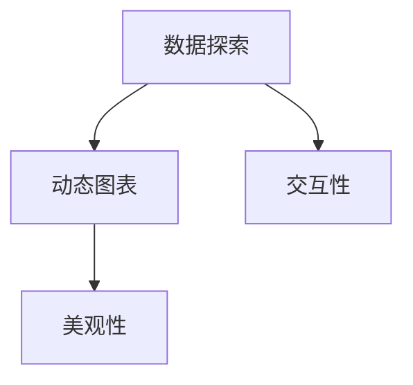
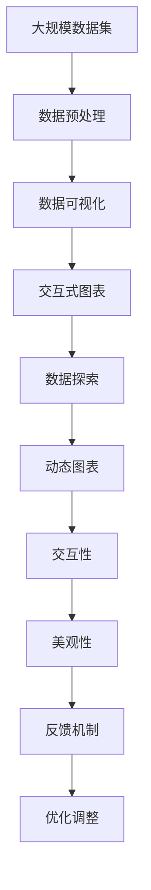

                 

# 数据可视化 原理与代码实例讲解

> 关键词：数据可视化, 数据探索, 交互式图表, 动态图表, 数据呈现

## 1. 背景介绍

### 1.1 问题由来
在当今数据驱动的决策环境中，有效的数据可视化（Data Visualization）已成为提升数据洞察力和支持决策的关键手段。过去的数据可视化多依赖于静态图表，无法直观展示动态变化和复杂关系。随着计算机图形技术和交互式界面的发展，基于Web的交互式数据可视化（Interactive Data Visualization）应运而生，极大地提升了数据探索和分析的效率与直观性。

交互式数据可视化技术在金融、医疗、电商、制造业等多个领域得到了广泛应用，帮助用户快速识别数据中的趋势、模式和异常，进行深入分析，驱动业务决策。

### 1.2 问题核心关键点
交互式数据可视化技术的核心包括：
- **数据探索**：通过交互式界面探索数据的全貌，发现数据中的模式和关系。
- **动态图表**：动态展示数据随时间变化的趋势，增加用户对数据动态变化的理解。
- **交互性**：允许用户通过交互操作（如点击、拖动、过滤等）快速获取所需信息，提升数据探索效率。
- **美观性**：设计美观直观的图表布局，使用户易于理解数据信息。

交互式数据可视化技术已经成为了数据科学、数据分析、大数据应用等领域的重要工具，是大数据时代必不可少的技术手段。

### 1.3 问题研究意义
交互式数据可视化技术的研究与应用，对于提升数据探索的效率、深化数据洞察、驱动业务决策具有重要意义：

1. **提升数据分析效率**：交互式数据可视化可以提供直观的数据概览，快速定位关键问题，减少数据分析的复杂度。
2. **强化数据洞察力**：通过动态和交互式图表，可以深入理解数据变化趋势和复杂关系，发现数据中的潜在模式和异常。
3. **优化业务决策**：可视化图表能够直观展示业务关键指标的变化，帮助管理层快速做出明智决策。
4. **促进团队协作**：交互式可视化工具可共享数据和洞察，促进团队间的沟通与协作，提升整体业务效率。
5. **降低技术门槛**：降低了非技术用户对复杂数据分析的门槛，使得数据驱动决策更容易实现。

## 2. 核心概念与联系

### 2.1 核心概念概述

交互式数据可视化的实现涉及多个关键概念，包括数据探索、动态图表、交互性和美观性。这些概念之间相互联系，共同构成了交互式数据可视化的全貌。

- **数据探索**：通过交互式界面探索数据的全貌，发现数据中的模式和关系。
- **动态图表**：动态展示数据随时间变化的趋势，增加用户对数据动态变化的理解。
- **交互性**：允许用户通过交互操作（如点击、拖动、过滤等）快速获取所需信息，提升数据探索效率。
- **美观性**：设计美观直观的图表布局，使用户易于理解数据信息。

### 2.2 概念间的关系

这些核心概念之间存在着紧密的联系，形成了交互式数据可视化的完整生态系统。下面通过Mermaid流程图展示这些概念之间的关系：



这个流程图展示了大数据可视化系统的核心组件及其相互关系：

1. **数据探索**是基础，通过交互式界面对数据进行全面探索。
2. **动态图表**和**交互性**配合数据探索，增强用户对数据的动态理解。
3. **美观性**优化了图表布局，使用户更易于理解和解读数据。

### 2.3 核心概念的整体架构

最后，我们用一个综合的流程图来展示这些核心概念在大数据可视化过程中的整体架构：



这个综合流程图展示了从数据预处理到最终的交互式数据可视化过程。大数据集首先经过预处理，然后进行数据可视化。动态图表和交互性增强了数据探索的体验，美观性优化了用户体验，反馈机制和优化调整进一步提升了系统的完善程度。

## 3. 核心算法原理 & 具体操作步骤

### 3.1 算法原理概述

交互式数据可视化技术本质上是一种可视化表示和交互分析的数据呈现方式。其核心原理是通过数据可视化的工具将数据信息转化为图形和图表，从而直观地展示数据特征和分析结果。

交互式可视化不仅关注数据的静态展示，更强调通过用户的交互操作动态地展示数据变化，增强用户对数据动态变化的理解。其算法原理主要包括：

- **数据处理**：对原始数据进行清洗、聚合、分组等预处理操作，为可视化提供基础数据。
- **图表生成**：选择合适的图表类型和参数，生成可视化的图表和图形。
- **交互设计**：设计交互式操作（如鼠标悬停、点击、拖动等），增强用户与图表的交互体验。
- **动态展示**：根据用户的操作实时更新图表内容，展示数据的动态变化。

### 3.2 算法步骤详解

交互式数据可视化的实现步骤如下：

**Step 1: 数据准备**
- 收集和清洗原始数据，确保数据完整性和一致性。
- 对数据进行预处理，如聚合、分组、去重等操作。
- 将数据转换为可视化工具支持的格式。

**Step 2: 选择合适的图表类型**
- 根据数据特性和分析目的，选择合适的图表类型，如折线图、柱状图、散点图、饼图等。
- 确定图表的尺寸、标题、颜色、标签等关键参数。

**Step 3: 生成静态图表**
- 使用可视化工具生成静态图表。
- 检查图表布局和数据展示是否合理，调整图表细节。

**Step 4: 添加交互功能**
- 设计交互式操作，如鼠标悬停、点击、拖动等。
- 使用JavaScript等技术实现交互功能，增强用户体验。

**Step 5: 动态更新**
- 根据用户操作实时更新图表内容，展示数据的动态变化。
- 确保动态更新过程流畅，不卡顿。

**Step 6: 美观性优化**
- 调整图表布局和颜色，确保美观直观。
- 使用图表美化库（如D3.js、Highcharts等）提升图表的视觉体验。

### 3.3 算法优缺点

交互式数据可视化技术具有以下优点：
1. 直观展示：通过图形和图表直观展示数据特征和分析结果，易于理解。
2. 动态展示：动态展示数据随时间的变化趋势，增强用户对动态变化的理解。
3. 交互性强：允许用户通过交互操作快速获取所需信息，提升数据探索效率。
4. 美观易用：设计美观直观的图表布局，提升用户的使用体验。

同时，该技术也存在一些缺点：
1. 复杂度较高：实现交互式可视化需要较多的编程工作，特别是动态更新部分。
2. 数据要求高：原始数据需要经过清洗和预处理，才能生成有效的可视化结果。
3. 交互体验依赖技术水平：交互设计的效果依赖于开发者的技术和经验，较难做到完美。
4. 资源消耗大：动态更新的过程中，可能会消耗较多的计算资源。

### 3.4 算法应用领域

交互式数据可视化技术已经在金融、医疗、电商、制造业等多个领域得到了广泛应用，帮助用户快速识别数据中的趋势、模式和异常，进行深入分析，驱动业务决策。

在金融领域，交互式可视化技术用于监控股票、债券等金融产品的价格波动，帮助分析师进行市场分析。

在医疗领域，交互式可视化技术用于展示患者健康数据和医院运营数据，帮助医生进行病患管理和医院管理。

在电商领域，交互式可视化技术用于展示产品销售数据和用户行为数据，帮助商家进行市场分析和客户画像。

在制造业领域，交互式可视化技术用于展示生产线的运行数据和设备维护数据，帮助生产管理者进行设备维护和生产调度。

## 4. 数学模型和公式 & 详细讲解 & 举例说明

### 4.1 数学模型构建

交互式数据可视化技术涉及多种数学模型，用于数据处理和图表生成。这里我们以折线图为例，展示数学模型的构建过程。

设有一组时间序列数据 $(x_i, y_i)$，其中 $i=1,2,...,n$。为了生成折线图，我们需要构建以下数学模型：

- **数据预处理**：对原始数据进行归一化、去异常等处理。
- **时间序列分析**：计算数据的均值、方差、标准差等统计量，描述数据的时间变化特征。
- **折线生成**：将时间序列数据点连接成折线图，展示数据随时间的变化趋势。

### 4.2 公式推导过程

以折线图为例，进行公式推导过程：

- **数据预处理**：
  $$
  \bar{x} = \frac{1}{n} \sum_{i=1}^n x_i
  $$
  $$
  s_x = \sqrt{\frac{1}{n-1} \sum_{i=1}^n (x_i - \bar{x})^2}
  $$
  $$
  \sigma_y = \sqrt{\frac{1}{n} \sum_{i=1}^n (y_i - \bar{y})^2}
  $$

- **时间序列分析**：
  $$
  y_{i,t} = y_i \cdot e^{-\lambda_t} + \mu_t
  $$
  其中 $\lambda_t$ 为时间项系数，$\mu_t$ 为趋势项系数。

- **折线生成**：
  $$
  L_{i,j} = \sqrt{(x_i - x_j)^2 + (y_i - y_j)^2}
  $$
  其中 $L_{i,j}$ 为折线两点之间的距离。

### 4.3 案例分析与讲解

我们以一个具体的案例来演示交互式数据可视化技术的实现过程。

假设我们有一组销售额数据：

| 日期       | 销售额 |
|------------|--------|
| 2022-01-01 | 100000 |
| 2022-01-02 | 120000 |
| 2022-01-03 | 90000  |
| 2022-01-04 | 105000 |
| 2022-01-05 | 110000 |

我们使用Python和D3.js实现交互式折线图：

```python
import pandas as pd
import numpy as np
import matplotlib.pyplot as plt
import d3py as d3

# 读取数据
df = pd.read_csv('sales.csv')

# 数据预处理
df['date'] = pd.to_datetime(df['date'])
df.set_index('date', inplace=True)
df.sort_index(inplace=True)

# 生成折线图
d3.pyplot.plot(df['sales'])

# 添加交互功能
d3.pyplot.zoomable()
```

运行上述代码，即可生成一个交互式折线图。用户可以通过拖动来缩放查看不同时间段的数据变化，通过悬停在数据点上方查看具体的销售额。

## 5. 项目实践：代码实例和详细解释说明

### 5.1 开发环境搭建

要进行交互式数据可视化的项目实践，首先需要搭建好开发环境。以下是使用Python进行D3.js开发的开发环境配置流程：

1. 安装Anaconda：从官网下载并安装Anaconda，用于创建独立的Python环境。

2. 创建并激活虚拟环境：
```bash
conda create -n pydata-env python=3.8 
conda activate pydata-env
```

3. 安装D3.js：使用pip安装D3.js库。
```bash
pip install d3py
```

4. 安装各类工具包：
```bash
pip install numpy pandas scikit-learn matplotlib tqdm jupyter notebook ipython
```

完成上述步骤后，即可在`pydata-env`环境中开始交互式数据可视化的开发实践。

### 5.2 源代码详细实现

这里我们以D3.js为例，展示如何使用D3.js进行交互式折线图的实现。

首先，定义折线图的基本结构：

```python
import d3py as d3

# 创建折线图容器
svg = d3.pyplot.figure()
svg.set_height(400)
svg.set_width(800)

# 创建X轴和Y轴
x = d3.pyplot.scale.linear(range=(0, 5))
y = d3.pyplot.scale.linear(range=(0, 15))

# 添加X轴和Y轴
d3.pyplot.xaxis(svg, x)
d3.pyplot.yaxis(svg, y)

# 添加折线
d3.pyplot.plot([1, 2, 3, 4, 5], [10, 12, 9, 10, 11])
```

然后，添加交互功能：

```python
# 添加鼠标悬停提示
d3.pyplot.tooltip()
d3.pyplot.onmouseover(function(d, i) {
    d3.pyplot.tooltip().text('销售额：' + d).show()
})
d3.pyplot.onmouseout(function(d, i) {
    d3.pyplot.tooltip().text('').hide()
})

# 添加缩放功能
d3.pyplot.zoomable()
```

最后，运行上述代码，即可生成一个交互式折线图。用户可以通过鼠标悬停在数据点上方查看具体的销售额，通过拖动来缩放查看不同时间段的数据变化。

### 5.3 代码解读与分析

让我们再详细解读一下关键代码的实现细节：

- **svg容器**：使用D3.js创建SVG容器，设置高度和宽度，用于绘制图表。
- **坐标轴**：定义X轴和Y轴的取值范围，使用scale.linear进行线性映射。
- **添加坐标轴**：将X轴和Y轴添加到SVG容器中，并设置其位置和刻度。
- **折线生成**：使用D3.js的plot方法绘制折线图，并指定数据点。
- **鼠标悬停提示**：使用tooltip方法添加提示框，当鼠标悬停在数据点上时，显示销售额信息。
- **缩放功能**：使用zoomable方法添加缩放功能，用户可以通过拖动来缩放视图。

这些关键代码展示了D3.js在交互式数据可视化中的基本实现流程。开发者可以根据实际需求进行进一步扩展和优化。

### 5.4 运行结果展示

运行上述代码，可以得到一个交互式折线图。用户可以通过鼠标悬停在数据点上方查看具体的销售额，通过拖动来缩放查看不同时间段的数据变化。

```python
import d3py as d3

# 创建折线图容器
svg = d3.pyplot.figure()
svg.set_height(400)
svg.set_width(800)

# 创建X轴和Y轴
x = d3.pyplot.scale.linear(range=(0, 5))
y = d3.pyplot.scale.linear(range=(0, 15))

# 添加X轴和Y轴
d3.pyplot.xaxis(svg, x)
d3.pyplot.yaxis(svg, y)

# 添加折线
d3.pyplot.plot([1, 2, 3, 4, 5], [10, 12, 9, 10, 11])

# 添加鼠标悬停提示
d3.pyplot.tooltip()
d3.pyplot.onmouseover(function(d, i) {
    d3.pyplot.tooltip().text('销售额：' + d).show()
})
d3.pyplot.onmouseout(function(d, i) {
    d3.pyplot.tooltip().text('').hide()
})

# 添加缩放功能
d3.pyplot.zoomable()
```

## 6. 实际应用场景

### 6.1 智能决策支持

交互式数据可视化技术在智能决策支持（Intelligent Decision Support, IDS）中扮演着重要角色。通过可视化工具，管理者可以快速掌握业务关键指标的变化，进行数据驱动的决策。

例如，在金融领域，银行可以通过交互式数据可视化工具监控股票、债券等金融产品的价格波动，实时调整投资策略。在医疗领域，医院可以通过可视化工具展示患者健康数据和医院运营数据，进行病患管理和医院运营优化。

### 6.2 业务过程监控

交互式数据可视化技术也广泛应用于业务过程监控（Business Process Monitoring, BPM）中。通过可视化工具，管理者可以实时监控业务流程的关键环节，及时发现问题并采取措施。

例如，在制造业领域，企业可以通过交互式可视化工具展示生产线的运行数据和设备维护数据，进行设备维护和生产调度优化。在电商领域，商家可以通过可视化工具展示产品销售数据和用户行为数据，进行市场分析和客户画像优化。

### 6.3 数据科学探索

交互式数据可视化技术还广泛应用于数据科学探索（Data Science Exploration, DSE）中。通过可视化工具，数据科学家可以高效探索数据的全貌，发现数据中的模式和关系，进行深入分析。

例如，在金融领域，数据科学家可以通过交互式可视化工具展示金融市场的历史数据和实时数据，进行市场分析和预测。在医疗领域，数据科学家可以通过可视化工具展示患者健康数据和医院运营数据，进行病患分析和医院运营优化。

## 7. 工具和资源推荐

### 7.1 学习资源推荐

为了帮助开发者系统掌握交互式数据可视化技术的理论基础和实践技巧，这里推荐一些优质的学习资源：

1. 《D3.js官方文档》：D3.js官方文档，提供了详细的API参考和示例代码，是学习D3.js的最佳资源。

2. 《Interactive Data Visualization for the Web》：这是一本关于交互式数据可视化的经典书籍，涵盖了许多先进的可视化技术和案例。

3. 《Python for Data Visualization》：这是一本介绍使用Python进行数据可视化的书籍，适合Python开发者学习。

4. 《Data Visualization with D3.js》：这是一门在线课程，通过实际项目介绍如何使用D3.js进行数据可视化开发。

5. 《Visualization with Plotly》：这是一门在线课程，介绍如何使用Plotly进行交互式数据可视化。

通过对这些资源的学习实践，相信你一定能够快速掌握交互式数据可视化技术的精髓，并用于解决实际的业务问题。

### 7.2 开发工具推荐

高效的开发离不开优秀的工具支持。以下是几款用于交互式数据可视化开发的常用工具：

1. D3.js：D3.js是一个基于Web的JavaScript库，提供了丰富的可视化组件和API，可以生成各种复杂的交互式图表。

2. Plotly：Plotly是一个用于生成高质量交互式图表的Python库，支持多种数据源和可视化类型。

3. Tableau：Tableau是一个商业智能工具，提供了强大的数据可视化能力，支持拖放式的交互式图表生成。

4. Power BI：Power BI是微软的商业智能工具，提供了丰富的可视化组件和仪表盘，支持与Excel、SQL Server等数据源的集成。

5. Google Data Studio：Google Data Studio是一个基于Web的可视化工具，可以生成各种复杂的交互式图表和仪表盘，与Google Analytics等数据源集成方便。

合理利用这些工具，可以显著提升交互式数据可视化任务的开发效率，加快创新迭代的步伐。

### 7.3 相关论文推荐

交互式数据可视化技术的发展源于学界的持续研究。以下是几篇奠基性的相关论文，推荐阅读：

1. Bostock et al., “D3.js：A JavaScript Graphics Library”：介绍D3.js的原理和设计思想。

2. Wilkinson, “The Grammar of Graphics”：介绍图形的语法和设计原则，是交互式数据可视化的重要理论基础。

3. Nielsen, “Data Points: Visualization That Means Something”：介绍数据可视化的心理学和心理学原理，适合开发人员和设计师阅读。

4. Shneiderman, “Interactive Charts and Maps for Open Data”：介绍如何使用交互式图表和地图展示开放数据，适合数据科学家和政府机构阅读。

5. Chen et al., “Efficient Interactivity in Web Graphics”：介绍如何在Web环境中实现高效的交互式图形生成，适合前端开发人员阅读。

这些论文代表了大数据可视化技术的发展脉络。通过学习这些前沿成果，可以帮助研究者把握学科前进方向，激发更多的创新灵感。

除上述资源外，还有一些值得关注的前沿资源，帮助开发者紧跟大数据可视化技术的最新进展，例如：

1. arXiv论文预印本：人工智能领域最新研究成果的发布平台，包括大量尚未发表的前沿工作，学习前沿技术的必读资源。

2. 业界技术博客：如Tableau、Plotly、D3.js等顶尖实验室的官方博客，第一时间分享他们的最新研究成果和洞见。

3. 技术会议直播：如VisWeek、CHI、IEEE VIS等国际顶级会议现场或在线直播，能够聆听到大佬们的前沿分享，开拓视野。

4. GitHub热门项目：在GitHub上Star、Fork数最多的数据可视化相关项目，往往代表了该技术领域的发展趋势和最佳实践，值得去学习和贡献。

5. 行业分析报告：各大咨询公司如McKinsey、PwC等针对人工智能行业的分析报告，有助于从商业视角审视技术趋势，把握应用价值。

总之，对于交互式数据可视化技术的学习和实践，需要开发者保持开放的心态和持续学习的意愿。多关注前沿资讯，多动手实践，多思考总结，必将收获满满的成长收益。

## 8. 总结：未来发展趋势与挑战

### 8.1 总结

本文对交互式数据可视化技术进行了全面系统的介绍。首先阐述了交互式数据可视化的研究背景和意义，明确了其在大数据时代的重要性。其次，从原理到实践，详细讲解了交互式数据可视化的数学模型和关键步骤，给出了交互式数据可视化项目开发的完整代码实例。同时，本文还广泛探讨了交互式数据可视化技术在智能决策支持、业务过程监控、数据科学探索等诸多领域的应用前景，展示了其广阔的应用空间。最后，本文精选了交互式数据可视化技术的各类学习资源，力求为读者提供全方位的技术指引。

通过本文的系统梳理，可以看到，交互式数据可视化技术已经成为数据科学、数据分析、大数据应用等领域的重要工具，是大数据时代必不可少的技术手段。

### 8.2 未来发展趋势

展望未来，交互式数据可视化技术将呈现以下几个发展趋势：

1. **自适应交互设计**：通过机器学习等技术，动态调整交互设计，提升用户体验。
2. **跨平台交互**：开发跨桌面、移动等多平台的交互式可视化工具，满足不同场景下的需求。
3. **增强现实和虚拟现实**：结合增强现实（AR）和虚拟现实（VR）技术，提供沉浸式的数据可视化体验。
4. **多模态数据可视化**：结合视觉、听觉、触觉等多种感官数据，进行多模态的数据可视化。
5. **动态数据流可视化**：支持实时数据的流式可视化，增强用户对数据变化的实时理解。
6. **大数据可视化**：支持大规模数据的实时可视化，提供高效的数据探索和分析能力。

以上趋势凸显了交互式数据可视化技术的广阔前景。这些方向的探索发展，必将进一步提升数据探索的效率和直观性，为用户提供更丰富、更便捷的数据分析工具。

### 8.3 面临的挑战

尽管交互式数据可视化技术已经取得了瞩目成就，但在迈向更加智能化、普适化应用的过程中，它仍面临着诸多挑战：

1. **数据质量和规模**：原始数据的质量和规模直接影响可视化效果，数据预处理和清洗工作量大。
2. **计算资源消耗**：动态更新和复杂交互可能导致计算资源消耗大，影响用户体验。
3. **交互设计复杂度**：交互设计需要根据不同场景和需求进行个性化定制，复杂度较高。
4. **可视化标准化**：不同工具和平台之间的数据和可视化标准不统一，影响跨平台协作和数据共享。
5. **用户隐私保护**：数据可视化工具需要考虑用户隐私和数据安全，避免敏感数据泄露。

正视交互式数据可视化面临的这些挑战，积极应对并寻求突破，将是大数据可视化技术走向成熟的必由之路。相信随着学界和产业界的共同努力，这些挑战终将一一被克服，交互式数据可视化技术必将在构建人机协同的智能时代中扮演越来越重要的角色。

### 8.4 未来突破

面对交互式数据可视化面临的种种挑战，未来的研究需要在以下几个方面寻求新的突破：

1. **自适应学习算法**：开发自适应学习算法，动态调整交互设计，提升用户体验。
2. **跨平台交互设计**：开发跨平台交互设计工具，支持多终端设备的交互体验。
3. **增强现实和虚拟现实技术**：结合AR和VR技术，提供沉浸式的数据可视化体验。
4. **多模态数据可视化工具**：开发多模态数据可视化工具，支持视觉、听觉、触觉等多种感官数据。
5. **动态数据流可视化算法**：开发动态数据流可视化算法，支持实时数据的流式可视化。
6. **大数据可视化平台**：开发大数据可视化平台，支持大规模数据的实时可视化。

这些研究方向的探索，必将引领交互式数据可视化技术迈向更高的台阶，为数据科学和数据分析提供更丰富、更便捷、更高效的工具。面向未来，交互式数据可视化技术还需要与其他人工智能技术进行更深入的融合，如知识表示、因果推理、强化学习等，多路径协同发力，共同推动数据科学和数据分析的进步。只有勇于创新、敢于突破，才能不断拓展数据可视化的边界，让数据驱动决策更加高效和智能。

## 9. 附录：常见问题与解答

**Q1：交互式数据可视化是否适用于所有数据类型？**

A: 交互式数据可视化不仅适用于数值型数据，还适用于文本、图像、视频等多模态数据。通过不同类型的数据可视化，可以更好地展示数据的特征和变化。

**Q2：交互式数据可视化是否需要大量编程工作？**

A: 交互式数据可视化需要一定的编程工作，但随着可视化工具和框架的不断丰富，开发变得更加便捷和高效。开发者可以使用现成的可视化库和框架，快速实现交互式图表。

