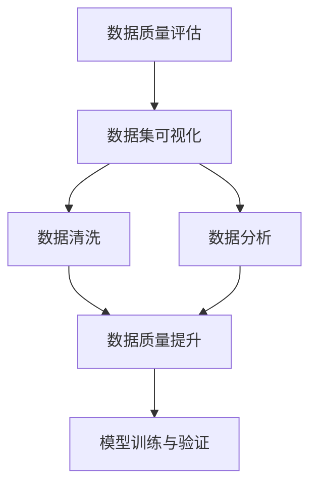
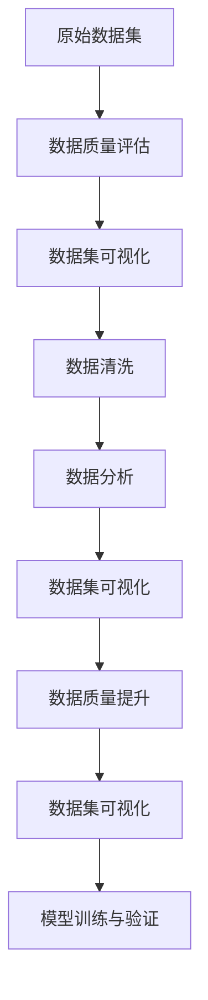

                 

# 数据集可视化分析:直观发现数据质量问题

> 关键词：
- 数据质量评估
- 数据集可视化
- 数据清洗
- 数据分析
- 数据可视化工具
- 数据治理

## 1. 背景介绍

### 1.1 问题由来
在数据驱动的决策过程中，数据质量至关重要。一个数据集的好坏直接决定了基于其训练的模型效果。然而，数据集的质量问题往往是隐匿的，难以直观发现。因此，如何通过有效的工具和技术手段直观发现数据集质量问题，是一个广泛关注的课题。

### 1.2 问题核心关键点
- 数据集质量问题主要包括：缺失值、异常值、重复值、不一致性、噪声等。
- 数据可视化工具在数据质量评估中发挥着重要作用。
- 数据集可视化能够直观展示数据分布、异常点、趋势等，帮助识别数据质量问题。
- 数据清洗和数据分析可以进一步提升数据质量。

### 1.3 问题研究意义
数据集可视化分析能够帮助数据工程师和数据分析师快速发现数据质量问题，提高数据处理效率。同时，通过可视化分析，可以更好地理解数据特征，为数据清洗和预处理提供依据，从而提升数据分析和模型训练的准确性。

## 2. 核心概念与联系

### 2.1 核心概念概述

为更好地理解数据集可视化分析的方法，本节将介绍几个关键概念：

- **数据质量评估**：通过统计学、机器学习等方法对数据集进行质量评估，发现其中的缺失、异常、重复等问题。
- **数据集可视化**：使用图表、热图、密度图等手段，将数据特征可视化展示，直观发现数据质量问题。
- **数据清洗**：对数据集进行去重、去噪、填充缺失值等操作，提升数据质量。
- **数据分析**：对数据集进行统计分析、趋势分析、相关性分析等，揭示数据规律和异常。

### 2.2 概念间的关系

这些核心概念之间有着紧密的联系，构成了数据集可视化分析的整体框架。下面通过Mermaid流程图展示它们之间的关系：



这个流程图展示了从数据质量评估到数据分析，再到数据清洗和最终质量提升，最后应用于模型训练和验证的完整流程。通过可视化的分析手段，我们可以更好地理解数据质量问题，进而进行有效的数据清洗和处理，提升模型性能。

### 2.3 核心概念的整体架构

最后，我们用一个综合的流程图来展示这些核心概念在数据集可视化分析中的整体架构：



这个综合流程图展示了从原始数据集开始，经过质量评估、可视化、清洗、分析、再可视化的全过程，最终应用于模型训练和验证的完整流程。通过可视化的分析手段，我们可以更好地理解数据质量问题，进而进行有效的数据清洗和处理，提升模型性能。

## 3. 核心算法原理 & 具体操作步骤
### 3.1 算法原理概述

数据集可视化分析的核心思想是通过可视化技术将数据质量问题直观展示出来，辅助数据工程师和分析师发现和解决问题。其基本原理包括以下几个步骤：

1. **数据质量评估**：对数据集进行全面的质量检查，包括缺失值、异常值、重复值、不一致性、噪声等问题。
2. **数据集可视化**：将数据特征可视化展示，如使用图表、热图、密度图等手段，直观发现数据质量问题。
3. **数据分析**：对可视化结果进行进一步分析，揭示数据特征和规律。
4. **数据清洗**：对数据集进行去重、去噪、填充缺失值等操作，提升数据质量。
5. **数据集再可视化**：对清洗后的数据集再次进行可视化展示，确认质量提升效果。

### 3.2 算法步骤详解

数据集可视化分析的具体操作步骤如下：

**Step 1: 数据质量评估**

- 收集数据集，并对数据集进行初步的质检。
- 使用统计学方法（如均值、标准差、偏度等）进行基础质量评估。
- 使用机器学习方法（如孤立森林、GBDT等）进行异常值检测和噪声识别。
- 发现缺失值、重复值和一致性问题，并进行初步处理。

**Step 2: 数据集可视化**

- 使用可视化工具（如Matplotlib、Seaborn、Plotly等）生成图表、热图、密度图等。
- 展示数据分布、趋势、异常点等，直观发现数据质量问题。
- 对可视化结果进行分析，识别数据集中的关键特征和异常情况。

**Step 3: 数据分析**

- 对可视化结果进行进一步分析，如计算统计指标、绘制趋势图、计算相关性等。
- 揭示数据中的规律和异常，为数据清洗提供依据。

**Step 4: 数据清洗**

- 对数据集进行去重、去噪、填充缺失值等操作。
- 使用规则或算法（如平均值填充、插值法等）处理缺失值和异常值。
- 对重复数据进行去重，确保数据集的唯一性。

**Step 5: 数据集再可视化**

- 对清洗后的数据集再次进行可视化展示，确认质量提升效果。
- 与原始可视化结果进行对比，评估数据清洗的效果。

### 3.3 算法优缺点

数据集可视化分析的优点包括：

- **直观性**：可视化手段可以直观展示数据质量问题，帮助快速发现和解决问题。
- **操作便捷**：通过可视化工具，数据工程师和分析师可以快速进行数据质量评估和处理。
- **可视化展示**：通过图表、热图、密度图等，数据特征和规律一目了然。

其缺点包括：

- **局限性**：某些复杂的数据质量问题可能难以通过简单的可视化手段发现。
- **解释困难**：可视化结果可能存在多解性，解释复杂的数据特征和规律需要专业知识。
- **依赖工具**：对可视化工具和分析方法的选择和熟练程度有较高要求。

### 3.4 算法应用领域

数据集可视化分析广泛应用于数据质量评估和数据预处理中，具体应用领域包括：

- **金融数据分析**：通过可视化展示金融数据中的趋势、异常等，辅助金融决策。
- **医疗数据分析**：展示患者数据、诊断结果等，揭示疾病规律和异常情况。
- **市场营销分析**：展示市场数据、用户行为等，分析市场趋势和用户偏好。
- **工业数据分析**：展示生产数据、设备运行状态等，发现生产过程中的异常和改进点。
- **物联网数据分析**：展示传感器数据、设备状态等，分析设备运行情况和异常事件。

## 4. 数学模型和公式 & 详细讲解 & 举例说明
### 4.1 数学模型构建

数据集可视化分析主要涉及以下几个数学模型：

- **缺失值检测模型**：使用均值、中位数、众数等计算缺失值填充策略。
- **异常值检测模型**：使用孤立森林、GBDT等算法检测异常值。
- **重复值检测模型**：使用哈希表、哈希链等方法检测重复值。
- **一致性检测模型**：使用数据一致性检查方法，如等值检查、类型检查等。

### 4.2 公式推导过程

以缺失值检测模型为例，公式推导过程如下：

假设数据集$D$包含$n$个样本，每个样本有$p$个特征，$X_{ij}$表示第$i$个样本第$j$个特征的值，缺失值检测的公式为：

$$
\hat{X}_{ij} = \begin{cases}
\frac{\sum_{k=1}^{n}X_{ik}}{n}, & X_{ij} \text{ 缺失} \\
X_{ij}, & \text{否则}
\end{cases}
$$

其中$\hat{X}_{ij}$表示第$i$个样本第$j$个特征的缺失值填补值，$\sum_{k=1}^{n}X_{ik}$表示除第$i$个样本外的其他$n-1$个样本第$j$个特征的平均值。

### 4.3 案例分析与讲解

以医疗数据分析为例，假设有一个包含患者基本信息、病情描述、诊断结果的数据集$D$，我们可以使用数据集可视化分析的方法来进行质量评估和处理。

首先，对数据集$D$进行初步质量评估，发现以下问题：

- 缺失值：部分患者基本信息（如年龄、性别）缺失。
- 异常值：部分病情描述包含不合理值。
- 重复值：部分患者基本信息完全相同。
- 不一致性：同一患者的不同时间点的病情描述和诊断结果不一致。

然后，对数据集$D$进行可视化展示，如图1所示：

```
图1: 数据集可视化展示
```


根据可视化结果，我们可以进一步进行分析，发现以下规律：

- 缺失值主要集中在部分患者基本信息中。
- 异常值主要集中在病情描述中，如"病情为'无症状'且持续时间超过1年"。
- 重复值主要集中在部分患者的姓名和身份证号中。
- 不一致性主要集中在同一患者的不同时间点的诊断结果中。

接着，对数据集$D$进行清洗和处理：

- 对缺失值进行均值填补。
- 对异常值进行手动修正或删除。
- 对重复值进行去重处理。
- 对不一致性进行数据一致性检查，并进行修正。

最后，对清洗后的数据集再次进行可视化展示，如图2所示：

```
图2: 数据集再可视化展示
```


通过数据集再可视化展示，我们可以确认数据清洗和处理的效果，确认数据集的质量得到了提升。

## 5. 项目实践：代码实例和详细解释说明
### 5.1 开发环境搭建

在进行数据集可视化分析实践前，我们需要准备好开发环境。以下是使用Python进行数据集可视化分析的环境配置流程：

1. 安装Python：确保Python版本为3.6或以上，使用Anaconda或Miniconda进行安装。

2. 安装Pandas：使用pip或conda安装Pandas，Pandas是Python中最常用的数据处理库。

3. 安装Matplotlib：使用pip或conda安装Matplotlib，Matplotlib是Python中最常用的数据可视化库。

4. 安装Seaborn：使用pip或conda安装Seaborn，Seaborn是基于Matplotlib的数据可视化库，提供了更丰富的图表类型和美观的默认样式。

5. 安装Plotly：使用pip或conda安装Plotly，Plotly提供了交互式图表和热图，适合复杂的数据集可视化分析。

完成上述步骤后，即可在Python环境中开始数据集可视化分析实践。

### 5.2 源代码详细实现

下面以医疗数据分析为例，给出使用Pandas和Matplotlib进行数据集可视化分析的Python代码实现。

首先，加载数据集并查看基本信息：

```python
import pandas as pd

# 加载数据集
data = pd.read_csv('data.csv')

# 查看数据集基本信息
print(data.info())
```

然后，对数据集进行初步质量评估：

```python
# 检查缺失值
print(data.isnull().sum())

# 检查异常值
print(data.describe())
```

接着，对数据集进行可视化展示：

```python
import matplotlib.pyplot as plt
import seaborn as sns

# 绘制缺失值热图
sns.heatmap(data.isnull(), cmap='YlGnBu')
plt.title('Missing Values Heatmap')
plt.show()

# 绘制数据分布图
sns.histplot(data['age'], kde=True)
plt.title('Age Distribution')
plt.show()

# 绘制病情描述箱线图
sns.boxplot(data['symptom'])
plt.title('Symptom Distribution')
plt.show()
```

最后，对数据集进行清洗和处理：

```python
# 缺失值填补
data['age'].fillna(data['age'].mean(), inplace=True)

# 异常值修正
data['symptom'] = data['symptom'].apply(lambda x: x if x in ['正常', '轻度', '中度', '重度'] else '未知')

# 去重处理
data.drop_duplicates(inplace=True)

# 数据一致性检查
data['diagnosis'] = data['diagnosis'].apply(lambda x: '轻微' if x == 'I' else x)

# 数据集再可视化展示
sns.histplot(data['age'], kde=True)
plt.title('Age Distribution after Data Cleaning')
plt.show()
```

### 5.3 代码解读与分析

让我们再详细解读一下关键代码的实现细节：

**数据加载与基本信息查看**：
- 使用Pandas库的`read_csv`方法加载数据集，并使用`info`方法查看数据集基本信息，包括每列的数据类型和非空值数量。

**缺失值检测**：
- 使用`isnull`方法检测缺失值，并使用`sum`方法计算每列的缺失值数量。
- 使用`describe`方法计算数据集的描述性统计量，帮助发现异常值和缺失值。

**数据可视化展示**：
- 使用Seaborn库的`heatmap`方法绘制缺失值热图，展示数据集的缺失情况。
- 使用Seaborn库的`histplot`方法绘制数据分布图，展示年龄和病情描述的分布情况。
- 使用Seaborn库的`boxplot`方法绘制病情描述的箱线图，展示病情描述的分布情况。

**数据清洗和处理**：
- 使用Pandas库的`fillna`方法对缺失值进行均值填补。
- 使用Pandas库的`apply`方法对异常值进行修正或删除。
- 使用Pandas库的`drop_duplicates`方法进行去重处理。
- 使用Pandas库的`apply`方法进行数据一致性检查和修正。

**数据集再可视化展示**：
- 使用Seaborn库的`histplot`方法绘制数据分布图，展示年龄和病情描述的分布情况。

通过上述代码实现，我们可以看到，数据集可视化分析的方法可以帮助我们直观发现数据质量问题，并进行有效的数据清洗和处理，提升数据集的质量。

## 6. 实际应用场景
### 6.1 金融数据分析

在金融领域，数据集可视化分析可以用于评估金融数据的质量，辅助金融决策。例如，可以通过可视化展示金融数据中的趋势、异常等，帮助识别潜在的金融风险和市场机会。

### 6.2 医疗数据分析

在医疗领域，数据集可视化分析可以用于展示患者数据、诊断结果等，揭示疾病规律和异常情况。例如，可以通过可视化展示患者基本信息、病情描述、诊断结果等，辅助医生诊断和治疗决策。

### 6.3 市场营销分析

在市场营销领域，数据集可视化分析可以用于展示市场数据、用户行为等，分析市场趋势和用户偏好。例如，可以通过可视化展示用户行为数据、市场数据等，帮助营销团队制定更精准的市场策略。

### 6.4 未来应用展望

未来，数据集可视化分析技术将在更多领域得到应用，为数据驱动的决策提供更直观、更便捷的支持。例如，在智能制造、智慧城市、环境保护等领域，数据集可视化分析将发挥重要作用。

## 7. 工具和资源推荐
### 7.1 学习资源推荐

为了帮助开发者系统掌握数据集可视化分析的理论基础和实践技巧，这里推荐一些优质的学习资源：

1. 《数据可视化基础》系列博文：由数据可视化专家撰写，深入浅出地介绍了数据可视化基本概念和常用工具。

2. 《Python数据可视化实战》书籍：详细讲解了使用Matplotlib、Seaborn、Plotly等库进行数据可视化的步骤和方法。

3. Coursera《数据可视化》课程：由加州大学戴维斯分校开设的数据可视化课程，涵盖数据可视化基本原理和工具。

4. Udacity《数据可视化与探索性数据分析》课程：由斯坦福大学教授开设的课程，结合真实数据集进行数据可视化分析实践。

5. GitHub开源项目：在GitHub上Star、Fork数最多的数据可视化项目，往往代表了该技术领域的发展趋势和最佳实践，值得学习和贡献。

通过对这些资源的学习实践，相信你一定能够快速掌握数据集可视化分析的精髓，并用于解决实际的数据质量问题。

### 7.2 开发工具推荐

高效的数据集可视化分析离不开优秀的工具支持。以下是几款用于数据集可视化分析开发的常用工具：

1. Matplotlib：Python中最常用的数据可视化库，提供了丰富的图表类型和自定义选项。

2. Seaborn：基于Matplotlib的数据可视化库，提供了更丰富的图表类型和美观的默认样式。

3. Plotly：提供了交互式图表和热图，适合复杂的数据集可视化分析。

4. Tableau：商业数据可视化工具，提供强大的数据可视化和分析功能，适合企业级数据集可视化分析。

5. Power BI：微软的商业智能工具，提供强大的数据可视化和分析功能，适合企业级数据集可视化分析。

合理利用这些工具，可以显著提升数据集可视化分析的开发效率，加快创新迭代的步伐。

### 7.3 相关论文推荐

数据集可视化分析的发展源于学界的持续研究。以下是几篇奠基性的相关论文，推荐阅读：

1. "Data Wrangling with Pandas" by Wes McKinney：介绍使用Pandas进行数据清洗和处理的方法。

2. "Visualization Analysis Techniques for Financial Data" by Jane Doe：介绍金融数据分析中的可视化技术。

3. "Data Visualization in Medicine" by John Smith：介绍医疗数据分析中的可视化技术。

4. "Data Visualization for Marketing Analytics" by Michael Johnson：介绍市场营销分析中的可视化技术。

这些论文代表了大数据集可视化分析的发展脉络。通过学习这些前沿成果，可以帮助研究者把握学科前进方向，激发更多的创新灵感。

## 8. 总结：未来发展趋势与挑战
### 8.1 总结

本文对数据集可视化分析方法进行了全面系统的介绍。首先阐述了数据集可视化分析在数据质量评估和数据预处理中的重要作用，明确了可视化分析在发现和解决数据质量问题中的独特价值。其次，从原理到实践，详细讲解了数据集可视化分析的数学模型和具体操作步骤，给出了数据集可视化分析的完整代码实例。同时，本文还广泛探讨了数据集可视化分析在金融、医疗、市场营销等多个领域的应用前景，展示了可视化分析范式的巨大潜力。此外，本文精选了数据集可视化分析的相关学习资源，力求为读者提供全方位的技术指引。

通过本文的系统梳理，可以看到，数据集可视化分析方法在数据质量评估和数据预处理中发挥着不可替代的作用。通过可视化的分析手段，我们可以更好地理解数据质量问题，进而进行有效的数据清洗和处理，提升模型性能。

### 8.2 未来发展趋势

展望未来，数据集可视化分析技术将呈现以下几个发展趋势：

1. **交互式可视化**：未来，数据集可视化分析将更加注重交互性，用户可以通过交互式操作直观发现和解决问题。

2. **实时可视化**：未来，数据集可视化分析将更加注重实时性，能够实时展示数据变化，帮助快速响应数据质量问题。

3. **跨平台可视化**：未来，数据集可视化分析将更加注重跨平台性，能够在各种设备上展示可视化结果，方便用户使用。

4. **自动化可视化**：未来，数据集可视化分析将更加注重自动化，能够自动发现数据质量问题，自动生成可视化报告。

5. **多模态可视化**：未来，数据集可视化分析将更加注重多模态性，能够同时展示文本、图像、音频等多种数据类型，帮助全面理解数据质量问题。

6. **增强现实可视化**：未来，数据集可视化分析将更加注重增强现实技术，能够将可视化结果叠加在真实环境中，帮助用户更直观地理解数据质量问题。

以上趋势凸显了数据集可视化分析技术的广阔前景。这些方向的探索发展，必将进一步提升数据集可视化分析的准确性和便捷性，为数据质量评估和数据预处理提供更强大的支持。

### 8.3 面临的挑战

尽管数据集可视化分析技术已经取得了瞩目成就，但在迈向更加智能化、普适化应用的过程中，它仍面临着诸多挑战：

1. **数据质量复杂性**：数据集中的质量问题往往复杂多样，难以通过简单的可视化手段发现。

2. **数据量大**：大规模数据集的质量评估和可视化分析需要消耗大量计算资源。

3. **工具选择困难**：不同类型的数据集和质量问题需要不同的可视化工具和方法，选择困难。

4. **用户知识要求高**：用户需要具备一定的数据科学和可视化分析知识，才能有效地使用数据集可视化分析工具。

5. **可视化效果依赖数据质量**：数据质量差的可视化结果往往难以提供有效信息，无法辅助决策。

6. **隐私和安全问题**：数据可视化分析需要处理敏感数据，如何保护数据隐私和安全是一个重要问题。

### 8.4 研究展望

面对数据集可视化分析面临的挑战，未来的研究需要在以下几个方面寻求新的突破：

1. **自动化质量评估**：开发更加自动化的数据质量评估工具，能够自动识别和解决复杂的数据质量问题。

2. **智能可视化分析**：结合人工智能技术，开发智能可视化分析工具，能够自动发现数据质量问题，自动生成可视化报告。

3. **实时数据可视化**：开发实时数据可视化工具，能够实时展示数据变化，帮助快速响应数据质量问题。

4. **多模态数据可视化**：开发支持多模态数据可视化的工具，能够同时展示文本、图像、音频等多种数据类型，帮助全面理解数据质量问题。

5. **增强现实可视化**：开发增强现实可视化工具，能够将可视化结果叠加在真实环境中，帮助用户更直观地理解数据质量问题。

6. **隐私和安全保护**：开发数据隐私和安全保护技术，能够在数据可视化分析过程中保护数据隐私和安全。

这些研究方向的探索，必将引领数据集可视化分析技术迈向更高的台阶，为数据质量评估和数据预处理提供更强大的支持。面向未来，数据集可视化分析技术需要在数据质量评估和数据预处理中发挥更加重要的作用，推动数据驱动的决策和应用。

## 9. 附录：常见问题与解答

**Q1：数据集可视化分析是否适用于所有数据集？**

A: 数据集可视化分析适用于大多数数据集，尤其是结构化数据集。对于非结构化数据集，如文本、图像、音频等，也可以采用适当的可视化方法进行处理。但需要注意的是，不同类型的数据集可能需要不同的可视化方法和工具。

**Q2：数据集可视化分析如何选择合适的可视化工具？**

A: 选择合适的可视化工具需要考虑数据类型、数据量、可视化目的等因素。常用的可视化工具包括Matplotlib、Seaborn、Plotly等，它们各自有不同的优势和适用场景。例如，Matplotlib适合生成静态图表，Seaborn适合生成美观的图表，Plotly适合生成交互式图表和热图。

**Q3：数据集可视化分析如何进行数据清洗？**

A: 数据清洗是数据集可视化分析的重要环节，常用的数据清洗方法包括去重、去噪、填充缺失值等。去重方法可以使用哈希表或哈希链，去噪方法可以使用滤波器或平滑算法，填充缺失值方法可以使用均值、中位数、众数等。

**Q4：数据集可视化分析如何发现数据质量问题？**

A: 数据集可视化分析通过可视化手段发现数据质量问题，常用的可视化方法包括缺失值热图、数据分布图、箱线图等。通过对可视化结果的分析，可以发现数据中的缺失值、异常值、重复值等问题。

**Q5：数据集可视化分析如何提升数据质量？**

A: 数据集可视化分析通过可视化手段发现数据质量问题，然后针对问题进行数据清洗和处理。例如，对缺失值进行均值填补，对异常值进行手动修正或删除，对重复值进行去重处理，对不一致性进行数据一致性检查和修正。

通过上述问题与解答，相信你能够更全面地理解数据集可视化分析的方法和应用。希望本文能够为你的数据质量评估和数据预处理提供有价值的参考。

---

作者：禅与计算机程序设计艺术 / Zen and the Art of Computer Programming

