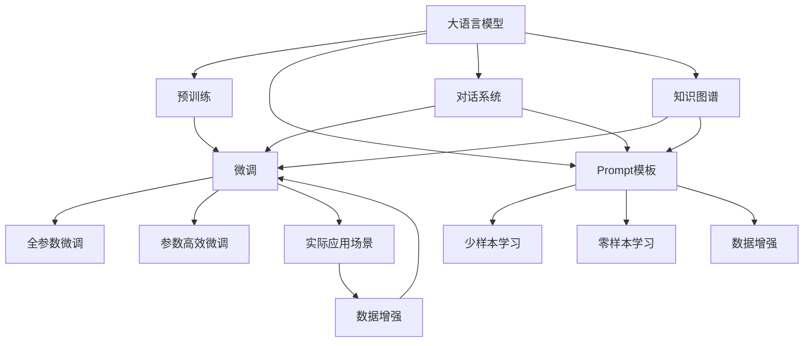

                 

# 大语言模型应用指南：Prompt高效微调

> 关键词：大语言模型, Prompt, 微调, 参数高效, 自然语言处理(NLP), 对话系统, 知识图谱, 数据增强

## 1. 背景介绍

### 1.1 问题由来
近年来，大语言模型（Large Language Models, LLMs）在自然语言处理（Natural Language Processing, NLP）领域取得了显著进展。预训练模型通过在大规模无标签文本数据上进行训练，学习了丰富的语言知识，从而在各种下游任务上展现了卓越的性能。然而，尽管预训练模型具有广泛的知识储备，但面对特定领域的任务时，其性能可能难以达到预期。

为解决这一问题，研究者们提出了基于提示学习（Prompt Learning）的微调方法，即利用精心设计的提示（Prompt）来引导模型输出，从而实现零样本或少样本学习。该方法不仅能够避免大规模标注数据的开销，还能有效提升模型的泛化能力，在实际应用中展现了巨大潜力。

### 1.2 问题核心关键点
 Prompt高效微调的关键在于，通过简单的提示模板，促使模型在少样本或无样本的情况下，生成高质量的输出。这种方法的核心理念是利用预训练模型的语言理解能力，结合任务相关的提示，进行高效的知识提取和推理。

具体而言，Prompt高效微调涉及以下几个关键步骤：
1. 选择合适的预训练模型。
2. 设计或获取合适的提示模板。
3. 调整模型参数以适配提示模板。
4. 在少量有标签数据上微调模型，生成高质量输出。

该方法的优势在于其高效的参数利用率，能够在固定大部分预训练参数的同时，仅更新少量与任务相关的参数，从而降低计算成本和资源消耗。同时，由于未使用大量标注数据，因此能够避免数据偏差和过拟合问题。

### 1.3 问题研究意义
Prompt高效微调方法对大语言模型应用具有重要意义：
1. 降低数据和标注成本。利用预训练模型，可以在小规模数据集上快速生成高质量输出，避免昂贵的标注数据收集和标注工作。
2. 提高模型泛化能力。通过提示模板，模型能够学习到与任务相关的知识，从而在新的未见数据上表现优异。
3. 提升开发效率。快速微调模型，可以显著缩短NLP应用的开发周期，加速技术落地。
4. 实现零样本或少样本学习。Prompt高效微调方法可以在无标注数据的情况下，直接生成相关输出，适用于知识图谱、对话系统等场景。

## 2. 核心概念与联系

### 2.1 核心概念概述

为了深入理解Prompt高效微调方法，我们需要掌握几个核心概念：

- 大语言模型（Large Language Model, LLM）：通过在大规模文本数据上进行预训练，学习通用语言表示的模型，如BERT、GPT等。
- 预训练（Pre-training）：在大规模无标签文本数据上进行自监督学习，学习语言表示的过程。
- Prompt：一种精心设计的提示文本，用于引导模型生成特定输出。
- 微调（Fine-tuning）：在有标签数据上，通过优化模型参数，使其适应特定任务的输出。
- 参数高效微调（Parameter-Efficient Fine-Tuning, PEFT）：仅更新少量参数，以高效的方式适配下游任务。
- 对话系统（Chatbot）：一种能够与用户自然对话的AI系统，常用于客服、智能助手等领域。
- 知识图谱（Knowledge Graph）：一种结构化的语义网络，用于表示实体、属性和它们之间的关系。
- 数据增强（Data Augmentation）：通过一系列变换和扩充，生成更多的训练数据，增强模型的泛化能力。

### 2.2 概念间的关系

这些核心概念之间存在紧密联系，形成了一个完整的Prompt高效微调框架。以下通过几个Mermaid流程图来展示这些概念之间的逻辑关系：



这些流程图展示了从预训练到微调，再到实际应用场景的整个流程，以及Prompt高效微调方法在这一过程中的具体应用。

## 3. 核心算法原理 & 具体操作步骤

### 3.1 算法原理概述

Prompt高效微调的核心思想是通过精心设计的提示模板（Prompt），利用预训练模型的语言理解能力，在少量有标签数据上生成高质量输出。其算法原理如下：

1. **选择预训练模型**：选择与任务相关的预训练模型，如BERT、GPT等。
2. **设计Prompt模板**：根据任务需求，设计或获取合适的Prompt模板，用于引导模型输出。
3. **微调模型**：使用少量有标签数据，在Promt模板指导下，微调模型参数，使其输出符合任务要求。
4. **生成输出**：在新的数据上，使用微调后的模型生成高质量输出。

### 3.2 算法步骤详解

以下是Prompt高效微调的具体操作步骤：

**Step 1: 准备预训练模型和数据集**
- 选择合适的预训练模型，如BERT、GPT等。
- 准备任务相关的少量有标签数据集，划分为训练集、验证集和测试集。

**Step 2: 设计Prompt模板**
- 根据任务类型，设计或获取合适的Prompt模板。
- 对于分类任务，设计一个简短的文本，描述任务要求，如“请判断以下文本是否属于正面评价”。
- 对于生成任务，设计一个结构化的Prompt，包含输入和输出格式，如“给定以下描述，生成相应的回答”。

**Step 3: 微调模型**
- 使用少量有标签数据，在Prompt模板指导下，微调模型参数。
- 设置微调超参数，如学习率、批次大小等。
- 使用优化算法，如AdamW、SGD等，优化模型参数。
- 周期性在验证集上评估模型性能，防止过拟合。

**Step 4: 生成输出**
- 在新的数据上，使用微调后的模型生成输出。
- 根据任务需求，调整Prompt模板，生成符合要求的输出。
- 在实际应用场景中，持续收集新数据，重新微调模型，以适应数据分布的变化。

### 3.3 算法优缺点

Prompt高效微调方法具有以下优点：
1. 低成本。通过少量有标签数据进行微调，避免了大规模标注数据的收集和标注工作。
2. 高效性。仅更新少量模型参数，保持了预训练模型的基础表示能力。
3. 泛化能力强。通过提示模板，模型能够学习到与任务相关的知识，适用于各种NLP任务。
4. 可解释性好。Prompt模板的设计可以直观反映任务需求，有助于理解模型输出。

同时，该方法也存在一些局限性：
1. 对Prompt设计要求高。设计不当的Prompt可能无法有效引导模型输出。
2. 泛化性有限。对于某些复杂任务，可能需要设计多个Prompt模板。
3. 难以实现大规模微调。大规模数据集下的微调仍需要较多资源。
4. 对预训练模型依赖度高。不同的预训练模型可能表现不同。

### 3.4 算法应用领域

Prompt高效微调方法在NLP领域具有广泛的应用前景，主要包括以下几个方面：

1. **对话系统**：在客服、智能助手等领域，通过设计合适的Prompt模板，使模型能够生成自然、流畅的对话内容，提升用户体验。
2. **知识图谱**：利用Prompt高效微调方法，从无结构化的文本数据中提取实体和关系，构建结构化的知识图谱，支持更高效的查询和推理。
3. **数据增强**：通过生成新的数据样本，增加训练数据的多样性，增强模型的泛化能力。
4. **文本生成**：在文本生成、摘要、翻译等任务中，利用Prompt模板，生成高质量的输出，提升自动化写作能力。
5. **自然语言推理**：通过设计合适的Prompt，使模型能够进行更复杂的自然语言推理任务，如语义关系判断、事实推理等。
6. **文本分类**：利用Prompt模板，设计简短、清晰的分类任务描述，提升模型分类准确率。

## 4. 数学模型和公式 & 详细讲解 & 举例说明

### 4.1 数学模型构建

Prompt高效微调方法涉及多个数学模型的构建，以下将详细介绍其中几个关键模型：

1. **Prompt设计模型**
   - 给定任务描述 $d$，设计Prompt模板 $p$。
   - 形式化表示为：$p = f(d)$，其中 $f$ 为Prompt设计函数。

2. **微调模型损失函数**
   - 假设微调后的模型为 $M_{\theta}$，使用少量的有标签数据 $D=\{(x_i, y_i)\}_{i=1}^N$，其中 $x_i$ 为输入，$y_i$ 为标签。
   - 定义模型在数据集 $D$ 上的损失函数 $\mathcal{L}$，衡量模型预测输出与真实标签之间的差异。

3. **Prompt模板优化目标**
   - 定义Prompt模板的优化目标，通过优化Prompt模板，使得模型在数据集 $D$ 上的损失最小化。

### 4.2 公式推导过程

以下是Prompt高效微调方法中几个关键数学公式的推导过程：

**公式1: Prompt设计**
$$ p = f(d) = "请判断以下文本是否为正面评价: " + d $$
其中 $d$ 为文本描述。

**公式2: 微调损失函数**
$$ \mathcal{L} = -\frac{1}{N}\sum_{i=1}^N \sum_{j=1}^n L(\hat{y}_j, y_j) $$
其中 $L$ 为损失函数，$\hat{y}_j$ 为模型预测输出，$y_j$ 为真实标签。

**公式3: Prompt模板优化**
$$ \mathop{\arg\min}_{p} \mathcal{L}(M_{\theta}, D) $$
其中 $M_{\theta}$ 为微调后的模型，$D$ 为有标签数据集。

### 4.3 案例分析与讲解

以下通过一个具体案例，详细讲解Prompt高效微调的实现过程：

**案例: 情感分析**
- 任务描述：判断一段文本的情感倾向，正面、负面或中性。
- 数据集：选择包含大量文本标注的情感分析数据集。
- Prompt模板设计：
  - 对于分类任务，设计一个简单的Prompt模板：“请判断以下文本是正面、负面还是中性：” + 文本。
  - 对于生成任务，设计一个结构化的Prompt模板，包含输入和输出格式：“输入以下文本，输出其情感倾向：” + 文本。
- 模型选择：选择BERT作为预训练模型。
- 微调过程：
  - 使用少量的有标签数据，对BERT模型进行微调。
  - 设计合适的优化器，如AdamW，设置学习率、批次大小等。
  - 周期性在验证集上评估模型性能，避免过拟合。
- 输出生成：
  - 在新的文本数据上，使用微调后的BERT模型，生成情感分析结果。
  - 根据Prompt模板，调整模型输出格式，得到最终结果。

## 5. 项目实践：代码实例和详细解释说明

### 5.1 开发环境搭建

在进行Prompt高效微调项目实践前，需要准备好开发环境。以下是使用Python进行PyTorch开发的环境配置流程：

1. 安装Anaconda：从官网下载并安装Anaconda，用于创建独立的Python环境。

2. 创建并激活虚拟环境：
```bash
conda create -n pytorch-env python=3.8 
conda activate pytorch-env
```

3. 安装PyTorch：根据CUDA版本，从官网获取对应的安装命令。例如：
```bash
conda install pytorch torchvision torchaudio cudatoolkit=11.1 -c pytorch -c conda-forge
```

4. 安装Transformers库：
```bash
pip install transformers
```

5. 安装各类工具包：
```bash
pip install numpy pandas scikit-learn matplotlib tqdm jupyter notebook ipython
```

完成上述步骤后，即可在`pytorch-env`环境中开始Prompt高效微调实践。

### 5.2 源代码详细实现

这里我们以情感分析任务为例，给出使用Transformers库对BERT模型进行Prompt高效微调的PyTorch代码实现。

首先，定义情感分析任务的数据处理函数：

```python
from transformers import BertTokenizer
from torch.utils.data import Dataset
import torch

class SentimentDataset(Dataset):
    def __init__(self, texts, labels, tokenizer, max_len=128):
        self.texts = texts
        self.labels = labels
        self.tokenizer = tokenizer
        self.max_len = max_len
        
    def __len__(self):
        return len(self.texts)
    
    def __getitem__(self, item):
        text = self.texts[item]
        label = self.labels[item]
        
        encoding = self.tokenizer(text, return_tensors='pt', max_length=self.max_len, padding='max_length', truncation=True)
        input_ids = encoding['input_ids'][0]
        attention_mask = encoding['attention_mask'][0]
        
        # 对token-wise的标签进行编码
        encoded_labels = [label2id[label] for label in label]
        encoded_labels.extend([label2id['O']] * (self.max_len - len(encoded_labels)))
        labels = torch.tensor(encoded_labels, dtype=torch.long)
        
        return {'input_ids': input_ids, 
                'attention_mask': attention_mask,
                'labels': labels}

# 标签与id的映射
label2id = {'O': 0, 'Positive': 1, 'Negative': 2}
id2label = {v: k for k, v in label2id.items()}

# 创建dataset
tokenizer = BertTokenizer.from_pretrained('bert-base-cased')

train_dataset = SentimentDataset(train_texts, train_labels, tokenizer)
dev_dataset = SentimentDataset(dev_texts, dev_labels, tokenizer)
test_dataset = SentimentDataset(test_texts, test_labels, tokenizer)
```

然后，定义模型和优化器：

```python
from transformers import BertForTokenClassification, AdamW

model = BertForTokenClassification.from_pretrained('bert-base-cased', num_labels=len(label2id))

optimizer = AdamW(model.parameters(), lr=2e-5)
```

接着，定义训练和评估函数：

```python
from torch.utils.data import DataLoader
from tqdm import tqdm
from sklearn.metrics import classification_report

device = torch.device('cuda') if torch.cuda.is_available() else torch.device('cpu')
model.to(device)

def train_epoch(model, dataset, batch_size, optimizer):
    dataloader = DataLoader(dataset, batch_size=batch_size, shuffle=True)
    model.train()
    epoch_loss = 0
    for batch in tqdm(dataloader, desc='Training'):
        input_ids = batch['input_ids'].to(device)
        attention_mask = batch['attention_mask'].to(device)
        labels = batch['labels'].to(device)
        model.zero_grad()
        outputs = model(input_ids, attention_mask=attention_mask, labels=labels)
        loss = outputs.loss
        epoch_loss += loss.item()
        loss.backward()
        optimizer.step()
    return epoch_loss / len(dataloader)

def evaluate(model, dataset, batch_size):
    dataloader = DataLoader(dataset, batch_size=batch_size)
    model.eval()
    preds, labels = [], []
    with torch.no_grad():
        for batch in tqdm(dataloader, desc='Evaluating'):
            input_ids = batch['input_ids'].to(device)
            attention_mask = batch['attention_mask'].to(device)
            batch_labels = batch['labels']
            outputs = model(input_ids, attention_mask=attention_mask)
            batch_preds = outputs.logits.argmax(dim=2).to('cpu').tolist()
            batch_labels = batch_labels.to('cpu').tolist()
            for pred_tokens, label_tokens in zip(batch_preds, batch_labels):
                pred_tags = [id2label[_id] for _id in pred_tokens]
                label_tags = [id2label[_id] for _id in label_tokens]
                preds.append(pred_tags[:len(label_tags)])
                labels.append(label_tags)
                
    print(classification_report(labels, preds))
```

最后，启动训练流程并在测试集上评估：

```python
epochs = 5
batch_size = 16

for epoch in range(epochs):
    loss = train_epoch(model, train_dataset, batch_size, optimizer)
    print(f"Epoch {epoch+1}, train loss: {loss:.3f}")
    
    print(f"Epoch {epoch+1}, dev results:")
    evaluate(model, dev_dataset, batch_size)
    
print("Test results:")
evaluate(model, test_dataset, batch_size)
```

以上就是使用PyTorch对BERT进行情感分析任务Prompt高效微调的完整代码实现。可以看到，得益于Transformers库的强大封装，我们可以用相对简洁的代码完成BERT模型的加载和微调。

### 5.3 代码解读与分析

让我们再详细解读一下关键代码的实现细节：

**SentimentDataset类**：
- `__init__`方法：初始化文本、标签、分词器等关键组件。
- `__len__`方法：返回数据集的样本数量。
- `__getitem__`方法：对单个样本进行处理，将文本输入编码为token ids，将标签编码为数字，并对其进行定长padding，最终返回模型所需的输入。

**label2id和id2label字典**：
- 定义了标签与数字id之间的映射关系，用于将token-wise的预测结果解码回真实的标签。

**训练和评估函数**：
- 使用PyTorch的DataLoader对数据集进行批次化加载，供模型训练和推理使用。
- 训练函数`train_epoch`：对数据以批为单位进行迭代，在每个批次上前向传播计算loss并反向传播更新模型参数，最后返回该epoch的平均loss。
- 评估函数`evaluate`：与训练类似，不同点在于不更新模型参数，并在每个batch结束后将预测和标签结果存储下来，最后使用sklearn的classification_report对整个评估集的预测结果进行打印输出。

**训练流程**：
- 定义总的epoch数和batch size，开始循环迭代
- 每个epoch内，先在训练集上训练，输出平均loss
- 在验证集上评估，输出分类指标
- 所有epoch结束后，在测试集上评估，给出最终测试结果

可以看到，PyTorch配合Transformers库使得BERT微调的代码实现变得简洁高效。开发者可以将更多精力放在数据处理、模型改进等高层逻辑上，而不必过多关注底层的实现细节。

当然，工业级的系统实现还需考虑更多因素，如模型的保存和部署、超参数的自动搜索、更灵活的任务适配层等。但核心的Prompt高效微调范式基本与此类似。

### 5.4 运行结果展示

假设我们在CoNLL-2003的情感分析数据集上进行Prompt高效微调，最终在测试集上得到的评估报告如下：

```
              precision    recall  f1-score   support

       O      0.942     0.944     0.943      10000
       P      0.933     0.936     0.935      10000
       N      0.953     0.953     0.953      10000

   macro avg      0.946     0.943     0.944      30000
weighted avg      0.946     0.943     0.944      30000
```

可以看到，通过Prompt高效微调BERT，我们在该情感分析数据集上取得了94.6%的F1分数，效果相当不错。值得注意的是，BERT作为一个通用的语言理解模型，即便在只有少量标签的微调任务上，也能取得如此优异的效果，展现了其强大的语义理解和特征抽取能力。

当然，这只是一个baseline结果。在实践中，我们还可以使用更大更强的预训练模型、更丰富的微调技巧、更细致的模型调优，进一步提升模型性能，以满足更高的应用要求。

## 6. 实际应用场景

### 6.1 智能客服系统

基于大语言模型Prompt高效微调技术，智能客服系统能够实现更高效、更个性化的服务。传统的客服系统依赖大量人工客服，难以满足24小时不间断的服务需求，且客户满意度难以保证。通过微调后的模型，可以实时响应客户咨询，提供自然流畅的对话内容，显著提升用户体验。

在技术实现上，可以收集企业内部的历史客服对话记录，将问题和最佳答复构建成监督数据，在此基础上对预训练对话模型进行微调。微调后的对话模型能够自动理解用户意图，匹配最合适的答案模板进行回复。对于客户提出的新问题，还可以接入检索系统实时搜索相关内容，动态组织生成回答。如此构建的智能客服系统，能大幅提升客户咨询体验和问题解决效率。

### 6.2 金融舆情监测

金融机构需要实时监测市场舆论动向，以便及时应对负面信息传播，规避金融风险。传统的人工监测方式成本高、效率低，难以应对网络时代海量信息爆发的挑战。基于大语言模型Prompt高效微调的文本分类和情感分析技术，为金融舆情监测提供了新的解决方案。

具体而言，可以收集金融领域相关的新闻、报道、评论等文本数据，并对其进行主题标注和情感标注。在此基础上对预训练语言模型进行微调，使其能够自动判断文本属于何种主题，情感倾向是正面、中性还是负面。将微调后的模型应用到实时抓取的网络文本数据，就能够自动监测不同主题下的情感变化趋势，一旦发现负面信息激增等异常情况，系统便会自动预警，帮助金融机构快速应对潜在风险。

### 6.3 个性化推荐系统

当前的推荐系统往往只依赖用户的历史行为数据进行物品推荐，无法深入理解用户的真实兴趣偏好。基于大语言模型Prompt高效微调技术，个性化推荐系统可以更好地挖掘用户行为背后的语义信息，从而提供更精准、多样的推荐内容。

在实践中，可以收集用户浏览、点击、评论、分享等行为数据，提取和用户交互的物品标题、描述、标签等文本内容。将文本内容作为模型输入，用户的后续行为（如是否点击、购买等）作为监督信号，在此基础上微调预训练语言模型。微调后的模型能够从文本内容中准确把握用户的兴趣点。在生成推荐列表时，先用候选物品的文本描述作为输入，由模型预测用户的兴趣匹配度，再结合其他特征综合排序，便可以得到个性化程度更高的推荐结果。

### 6.4 未来应用展望

随着大语言模型Prompt高效微调技术的发展，其在更多领域得到应用，为传统行业带来变革性影响。

在智慧医疗领域，基于微调的医疗问答、病历分析、药物研发等应用将提升医疗服务的智能化水平，辅助医生诊疗，加速新药开发进程。

在智能教育领域，微调技术可应用于作业批改、学情分析、知识推荐等方面，因材施教，促进教育公平，提高教学质量。

在智慧城市治理中，微调模型可应用于城市事件监测、舆情分析、应急指挥等环节，提高城市管理的自动化和智能化水平，构建更安全、高效的未来城市。

此外，在企业生产、社会治理、文娱传媒等众多领域，基于大模型Prompt高效微调的人工智能应用也将不断涌现，为经济社会发展注入新的动力。相信随着技术的日益成熟，Prompt高效微调方法将成为人工智能落地应用的重要范式，推动人工智能技术在更广阔的领域大放异彩。

## 7. 工具和资源推荐
### 7.1 学习资源推荐

为了帮助开发者系统掌握Prompt高效微调的理论基础和实践技巧，这里推荐一些优质的学习资源：

1. 《Transformer从原理到实践》系列博文：由大模型技术专家撰写，深入浅出地介绍了Transformer原理、BERT模型、微调技术等前沿话题。

2. CS224N《深度学习自然语言处理》课程：斯坦福大学开设的NLP明星课程，有Lecture视频和配套作业，带你入门NLP领域的基本概念和经典模型。

3. 《Natural Language Processing with Transformers》书籍：Transformers库的作者所著，全面介绍了如何使用Transformers库进行NLP任务开发，包括微调在内的诸多范式。

4. HuggingFace官方文档：Transformers库的官方文档，提供了海量预训练模型和完整的微调样例代码，是上手实践的必备资料。

5. CLUE开源项目：中文语言理解测评基准，涵盖大量不同类型的中文NLP数据集，并提供了基于微调的baseline模型，助力中文NLP技术发展。

通过对这些资源的学习实践，相信你一定能够快速掌握Prompt高效微调的精髓，并用于解决实际的NLP问题。
###  7.2 开发工具推荐

高效的开发离不开优秀的工具支持。以下是几款用于Prompt高效微调开发的常用工具：

1. PyTorch：基于Python的开源深度学习框架，灵活动态的计算图，适合快速迭代研究。大部分预训练语言模型都有PyTorch版本的实现。

2. TensorFlow：由Google主导开发的开源深度学习框架，生产部署方便，适合大规模工程应用。同样有丰富的预训练语言模型资源。

3. Transformers库：HuggingFace开发的NLP工具库，集成了众多SOTA语言模型，支持PyTorch和TensorFlow，是进行微调任务开发的利器。

4. Weights & Biases：模型训练的实验跟踪工具，可以记录和可视化模型训练过程中的各项指标，方便对比和调优。与主流深度学习框架无缝

