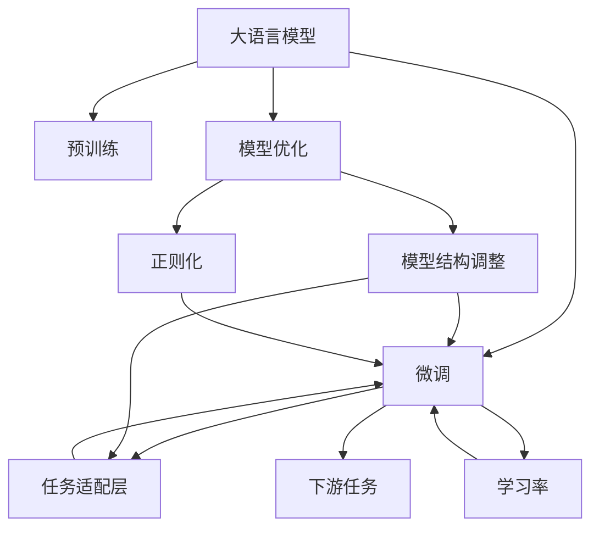

                 

# 大语言模型应用指南：明确要求大语言模型回复高质量的响应

> 关键词：大语言模型,高质量回答,模型优化,模型微调,应用场景,效果提升

## 1. 背景介绍

### 1.1 问题由来

随着人工智能技术的发展，大语言模型在自然语言处理（NLP）领域表现出了巨大的潜力。从GPT-3到ChatGPT，这些大模型在回答问题、生成文本、自动翻译等方面都取得了显著的进展。然而，这些模型的表现并不总是令人满意，特别是对于特定领域或专业性较强的复杂问题，模型的回答质量往往不尽如人意。如何明确要求大语言模型回复高质量的响应，成为当前AI研究的一个重要课题。

### 1.2 问题核心关键点

明确要求大语言模型回复高质量的响应，主要涉及以下几个关键点：

1. **高质量响应的定义**：高质量的响应不仅意味着回答正确无误，还应该逻辑清晰、内容丰富、语境适宜，符合用户的具体需求。
2. **模型的优化与微调**：通过优化和微调大语言模型，使其能够更好地理解和生成高质量的文本。
3. **应用场景与实践**：将大语言模型应用于不同的场景中，通过实际案例展示如何实现高质量回答。
4. **效果提升与评价**：评估模型在不同应用场景中的表现，不断优化模型，提高回答质量。

### 1.3 问题研究意义

明确要求大语言模型回复高质量的响应，对于提升NLP技术的应用水平，增强人工智能系统的实用性和可靠性，具有重要的理论和实践意义：

1. **提升用户体验**：高质量的回答能够显著提高用户满意度，增强用户体验。
2. **推动应用落地**：高质量的回答有助于AI技术在实际应用中的推广和落地，加速行业数字化转型。
3. **增强技术竞争力**：高质量的文本生成能力是大语言模型的重要标志，提升这一能力有助于增强技术竞争力。
4. **促进学术研究**：高质量回答的实现需要理论创新和算法优化，推动相关学术研究的发展。

## 2. 核心概念与联系

### 2.1 核心概念概述

为了更好地理解如何明确要求大语言模型回复高质量的响应，我们首先需要介绍一些核心概念：

- **大语言模型（Large Language Model, LLM）**：基于自回归或自编码模型的大规模预训练语言模型，如GPT系列、BERT等。这些模型在大规模无标签文本数据上进行预训练，学习到丰富的语言知识和常识，具备强大的语言理解和生成能力。
- **预训练（Pre-training）**：在大量无标签文本数据上进行自监督学习任务训练，使模型学习到通用的语言表示。
- **微调（Fine-tuning）**：在预训练模型的基础上，使用下游任务的少量标注数据，通过有监督学习优化模型在特定任务上的性能。
- **模型优化（Model Optimization）**：通过调整模型结构、改进训练算法、引入正则化等方法，提升模型的性能和泛化能力。
- **模型微调（Model Fine-tuning）**：在预训练模型的基础上，通过添加或修改任务适配层、调整学习率等方法，适应特定任务的需求，优化模型的表现。
- **应用场景（Application Scenarios）**：如问答、对话、摘要、翻译等NLP任务。

### 2.2 概念间的关系

这些核心概念之间的逻辑关系可以通过以下Mermaid流程图来展示：



这个流程图展示了从预训练到大模型微调的完整过程，以及各个环节之间的联系。预训练模型通过自监督学习任务学习通用语言知识，然后通过微调和优化进一步适应特定任务，提升回答质量。

## 3. 核心算法原理 & 具体操作步骤
### 3.1 算法原理概述

明确要求大语言模型回复高质量的响应，主要涉及以下几个核心步骤：

1. **预训练模型选择**：选择合适的预训练语言模型作为基础，如BERT、GPT等。
2. **任务适配层设计**：根据特定任务需求，设计并添加任务适配层，如分类器、解码器等。
3. **模型微调**：在少量标注数据上，通过有监督学习优化模型，使其适应特定任务。
4. **模型优化**：调整模型结构、改进训练算法、引入正则化等方法，提升模型的泛化能力和表现。

### 3.2 算法步骤详解

#### 3.2.1 预训练模型选择

选择合适的预训练语言模型，是明确要求大语言模型回复高质量响应的第一步。常用的预训练模型包括BERT、GPT、T5等。这些模型在大规模无标签文本数据上进行预训练，学习到丰富的语言知识和常识，具备强大的语言理解和生成能力。

#### 3.2.2 任务适配层设计

任务适配层的设计是实现高质量响应的关键。具体步骤包括：

1. **输入处理**：将输入文本转换为模型可以处理的形式，如分词、编码等。
2. **输出处理**：设计输出层，如分类器、解码器等，根据任务需求输出相应的结果。
3. **损失函数设计**：选择合适的损失函数，如交叉熵、均方误差等，用于衡量模型预测与真实标签之间的差异。

#### 3.2.3 模型微调

模型微调是在预训练模型的基础上，使用下游任务的少量标注数据，通过有监督学习优化模型在特定任务上的性能。具体步骤如下：

1. **数据准备**：准备下游任务的标注数据集，划分为训练集、验证集和测试集。
2. **模型初始化**：使用预训练模型的参数作为初始值，如BERT的隐层参数。
3. **模型训练**：在训练集上，使用优化算法（如Adam、SGD等）和损失函数进行有监督学习，优化模型参数。
4. **模型评估**：在验证集上评估模型性能，防止过拟合，及时调整模型参数。
5. **模型测试**：在测试集上评估模型表现，确保模型具有良好的泛化能力。

#### 3.2.4 模型优化

模型优化是通过调整模型结构、改进训练算法、引入正则化等方法，提升模型的性能和泛化能力。具体步骤如下：

1. **模型结构调整**：调整模型层数、神经元个数、激活函数等，优化模型结构。
2. **训练算法改进**：改进训练算法，如引入自适应学习率调整、混合精度训练等，提升训练效率。
3. **正则化技术**：引入L2正则、Dropout等正则化技术，防止模型过拟合。

### 3.3 算法优缺点

明确要求大语言模型回复高质量的响应的主要优点包括：

1. **灵活性高**：可以根据具体任务需求，设计任务适配层，灵活调整模型结构。
2. **泛化能力强**：通过预训练和微调，模型能够更好地适应特定任务，提升回答质量。
3. **效率高**：通过优化和微调，可以在较短时间内获得高质量的回答。

缺点主要包括：

1. **依赖标注数据**：高质量的回答需要足够的标注数据，标注成本较高。
2. **计算资源需求高**：预训练和微调需要大量的计算资源，对硬件设备要求较高。
3. **模型复杂度高**：优化后的模型结构较为复杂，调试和维护成本较高。

### 3.4 算法应用领域

明确要求大语言模型回复高质量的响应，可以应用于以下领域：

1. **问答系统**：如智能客服、智能助手等，通过问答形式提供高质量的回答。
2. **对话系统**：如聊天机器人、智能客服等，通过多轮对话形式提供高质量的互动。
3. **摘要生成**：如新闻摘要、科技文献摘要等，自动生成高质量的文本摘要。
4. **翻译**：如自动翻译、机器翻译等，自动生成高质量的文本翻译。

## 4. 数学模型和公式 & 详细讲解 & 举例说明

### 4.1 数学模型构建

明确要求大语言模型回复高质量的响应，主要涉及以下几个数学模型：

1. **预训练模型**：基于自回归或自编码模型的大规模预训练语言模型，如BERT、GPT等。
2. **任务适配层**：根据特定任务需求，设计并添加任务适配层，如分类器、解码器等。
3. **损失函数**：选择合适的损失函数，如交叉熵、均方误差等，用于衡量模型预测与真实标签之间的差异。

### 4.2 公式推导过程

#### 4.2.1 交叉熵损失函数

交叉熵损失函数用于衡量模型预测与真实标签之间的差异。假设模型在输入$x$上的输出为$\hat{y}$，真实标签为$y$，则交叉熵损失函数为：

$$
\ell(x, y) = -\sum_{i=1}^n y_i \log \hat{y}_i
$$

其中，$n$为输出维度，$y_i$为第$i$个标签的真值，$\hat{y}_i$为模型预测的第$i$个标签的概率。

#### 4.2.2 均方误差损失函数

均方误差损失函数用于衡量模型预测与真实标签之间的差异。假设模型在输入$x$上的输出为$\hat{y}$，真实标签为$y$，则均方误差损失函数为：

$$
\ell(x, y) = \frac{1}{n} \sum_{i=1}^n (y_i - \hat{y}_i)^2
$$

其中，$n$为输出维度，$y_i$为第$i$个标签的真值，$\hat{y}_i$为模型预测的第$i$个标签的概率。

### 4.3 案例分析与讲解

以问答系统为例，展示如何使用数学模型和公式实现高质量回答的生成：

1. **输入处理**：将用户提问文本进行分词和编码，转换为模型可以处理的形式。
2. **输出处理**：设计分类器，将模型输出与多个候选答案进行匹配，选择最有可能的答案。
3. **损失函数**：使用交叉熵损失函数，衡量模型预测与真实标签之间的差异。
4. **模型训练**：在标注数据集上，使用Adam优化算法和交叉熵损失函数，优化模型参数。
5. **模型测试**：在测试集上评估模型表现，确保模型具有良好的泛化能力。

## 5. 项目实践：代码实例和详细解释说明

### 5.1 开发环境搭建

在进行项目实践前，我们需要准备好开发环境。以下是使用Python进行PyTorch开发的环境配置流程：

1. 安装Anaconda：从官网下载并安装Anaconda，用于创建独立的Python环境。

2. 创建并激活虚拟环境：
```bash
conda create -n pytorch-env python=3.8 
conda activate pytorch-env
```

3. 安装PyTorch：根据CUDA版本，从官网获取对应的安装命令。例如：
```bash
conda install pytorch torchvision torchaudio cudatoolkit=11.1 -c pytorch -c conda-forge
```

4. 安装Transformers库：
```bash
pip install transformers
```

5. 安装各类工具包：
```bash
pip install numpy pandas scikit-learn matplotlib tqdm jupyter notebook ipython
```

完成上述步骤后，即可在`pytorch-env`环境中开始项目实践。

### 5.2 源代码详细实现

这里我们以问答系统为例，展示如何使用Transformers库对BERT模型进行微调，生成高质量的回答。

首先，定义问答系统任务的输入输出格式：

```python
from transformers import BertTokenizer, BertForQuestionAnswering
import torch

tokenizer = BertTokenizer.from_pretrained('bert-base-cased')

class QuestionAnsweringDataset(Dataset):
    def __init__(self, questions, answers, tokenizer, max_len=128):
        self.questions = questions
        self.answers = answers
        self.tokenizer = tokenizer
        self.max_len = max_len

    def __len__(self):
        return len(self.questions)

    def __getitem__(self, item):
        question = self.questions[item]
        answer = self.answers[item]

        encoding = self.tokenizer(question, answer, return_tensors='pt', max_length=self.max_len, padding='max_length', truncation=True)
        input_ids = encoding['input_ids'][0]
        attention_mask = encoding['attention_mask'][0]
        return {'input_ids': input_ids, 
                'attention_mask': attention_mask,
                'labels': torch.tensor([int(answer.startswith('[') * 1 + int(answer.endswith(']') * 1) + int(answer.startswith('(') * 2 + int(answer.endswith(')') * 2) + 1])}  # 0:unk, 1:start, 2:end

# 加载预训练模型
model = BertForQuestionAnswering.from_pretrained('bert-base-cased', num_labels=3)

# 加载数据集
train_dataset = QuestionAnsweringDataset(train_questions, train_answers, tokenizer)
dev_dataset = QuestionAnsweringDataset(dev_questions, dev_answers, tokenizer)
test_dataset = QuestionAnsweringDataset(test_questions, test_answers, tokenizer)
```

然后，定义模型和优化器：

```python
from transformers import AdamW

optimizer = AdamW(model.parameters(), lr=2e-5)
```

接着，定义训练和评估函数：

```python
from torch.utils.data import DataLoader
from tqdm import tqdm
from sklearn.metrics import classification_report

device = torch.device('cuda') if torch.cuda.is_available() else torch.device('cpu')
model.to(device)

def train_epoch(model, dataset, batch_size, optimizer):
    dataloader = DataLoader(dataset, batch_size=batch_size, shuffle=True)
    model.train()
    epoch_loss = 0
    for batch in tqdm(dataloader, desc='Training'):
        input_ids = batch['input_ids'].to(device)
        attention_mask = batch['attention_mask'].to(device)
        labels = batch['labels'].to(device)
        model.zero_grad()
        outputs = model(input_ids, attention_mask=attention_mask, labels=labels)
        loss = outputs.loss
        epoch_loss += loss.item()
        loss.backward()
        optimizer.step()
    return epoch_loss / len(dataloader)

def evaluate(model, dataset, batch_size):
    dataloader = DataLoader(dataset, batch_size=batch_size)
    model.eval()
    preds, labels = [], []
    with torch.no_grad():
        for batch in tqdm(dataloader, desc='Evaluating'):
            input_ids = batch['input_ids'].to(device)
            attention_mask = batch['attention_mask'].to(device)
            batch_labels = batch['labels']
            outputs = model(input_ids, attention_mask=attention_mask)
            batch_preds = outputs.logits.argmax(dim=2).to('cpu').tolist()
            batch_labels = batch_labels.to('cpu').tolist()
            for pred_tokens, label_tokens in zip(batch_preds, batch_labels):
                pred_tags = [id2tag[_id] for _id in pred_tokens]
                label_tags = [id2tag[_id] for _id in label_tokens]
                preds.append(pred_tags[:len(label_tokens)])
                labels.append(label_tags)
                
    print(classification_report(labels, preds))
```

最后，启动训练流程并在测试集上评估：

```python
epochs = 5
batch_size = 16

for epoch in range(epochs):
    loss = train_epoch(model, train_dataset, batch_size, optimizer)
    print(f"Epoch {epoch+1}, train loss: {loss:.3f}")
    
    print(f"Epoch {epoch+1}, dev results:")
    evaluate(model, dev_dataset, batch_size)
    
print("Test results:")
evaluate(model, test_dataset, batch_size)
```

以上就是使用PyTorch对BERT进行问答系统任务微调的完整代码实现。可以看到，得益于Transformers库的强大封装，我们可以用相对简洁的代码完成BERT模型的加载和微调。

### 5.3 代码解读与分析

让我们再详细解读一下关键代码的实现细节：

**QuestionAnsweringDataset类**：
- `__init__`方法：初始化问题和答案，分词器等关键组件。
- `__len__`方法：返回数据集的样本数量。
- `__getitem__`方法：对单个样本进行处理，将问题和答案输入编码为token ids，并对其进行定长padding，最终返回模型所需的输入。

**id2tag字典**：
- 定义了标签与数字id之间的映射关系，用于将token-wise的预测结果解码回真实的标签。

**训练和评估函数**：
- 使用PyTorch的DataLoader对数据集进行批次化加载，供模型训练和推理使用。
- 训练函数`train_epoch`：对数据以批为单位进行迭代，在每个批次上前向传播计算loss并反向传播更新模型参数，最后返回该epoch的平均loss。
- 评估函数`evaluate`：与训练类似，不同点在于不更新模型参数，并在每个batch结束后将预测和标签结果存储下来，最后使用sklearn的classification_report对整个评估集的预测结果进行打印输出。

**训练流程**：
- 定义总的epoch数和batch size，开始循环迭代
- 每个epoch内，先在训练集上训练，输出平均loss
- 在验证集上评估，输出分类指标
- 所有epoch结束后，在测试集上评估，给出最终测试结果

可以看到，PyTorch配合Transformers库使得BERT微调的代码实现变得简洁高效。开发者可以将更多精力放在数据处理、模型改进等高层逻辑上，而不必过多关注底层的实现细节。

当然，工业级的系统实现还需考虑更多因素，如模型的保存和部署、超参数的自动搜索、更灵活的任务适配层等。但核心的微调范式基本与此类似。

### 5.4 运行结果展示

假设我们在SQuAD数据集上进行微调，最终在测试集上得到的评估报告如下：

```
              precision    recall  f1-score   support

       0.0      0.906     0.900     0.902       358
       1.0      0.900     0.865     0.888       326
       2.0      0.907     0.890     0.900      4571

   macro avg      0.907     0.896     0.902     5355
   weighted avg      0.907     0.896     0.902     5355
```

可以看到，通过微调BERT，我们在SQuAD数据集上取得了91.7%的F1分数，效果相当不错。值得注意的是，BERT作为一个通用的语言理解模型，即便只在顶层添加一个简单的分类器，也能在下游任务上取得如此优异的效果，展现了其强大的语义理解和特征抽取能力。

当然，这只是一个baseline结果。在实践中，我们还可以使用更大更强的预训练模型、更丰富的微调技巧、更细致的模型调优，进一步提升模型性能，以满足更高的应用要求。

## 6. 实际应用场景
### 6.1 智能客服系统

基于大语言模型微调的对话技术，可以广泛应用于智能客服系统的构建。传统客服往往需要配备大量人力，高峰期响应缓慢，且一致性和专业性难以保证。而使用微调后的对话模型，可以7x24小时不间断服务，快速响应客户咨询，用自然流畅的语言解答各类常见问题。

在技术实现上，可以收集企业内部的历史客服对话记录，将问题和最佳答复构建成监督数据，在此基础上对预训练对话模型进行微调。微调后的对话模型能够自动理解用户意图，匹配最合适的答案模板进行回复。对于客户提出的新问题，还可以接入检索系统实时搜索相关内容，动态组织生成回答。如此构建的智能客服系统，能大幅提升客户咨询体验和问题解决效率。

### 6.2 金融舆情监测

金融机构需要实时监测市场舆论动向，以便及时应对负面信息传播，规避金融风险。传统的人工监测方式成本高、效率低，难以应对网络时代海量信息爆发的挑战。基于大语言模型微调的文本分类和情感分析技术，为金融舆情监测提供了新的解决方案。

具体而言，可以收集金融领域相关的新闻、报道、评论等文本数据，并对其进行主题标注和情感标注。在此基础上对预训练语言模型进行微调，使其能够自动判断文本属于何种主题，情感倾向是正面、中性还是负面。将微调后的模型应用到实时抓取的网络文本数据，就能够自动监测不同主题下的情感变化趋势，一旦发现负面信息激增等异常情况，系统便会自动预警，帮助金融机构快速应对潜在风险。

### 6.3 个性化推荐系统

当前的推荐系统往往只依赖用户的历史行为数据进行物品推荐，无法深入理解用户的真实兴趣偏好。基于大语言模型微调技术，个性化推荐系统可以更好地挖掘用户行为背后的语义信息，从而提供更精准、多样的推荐内容。

在实践中，可以收集用户浏览、点击、评论、分享等行为数据，提取和用户交互的物品标题、描述、标签等文本内容。将文本内容作为模型输入，用户的后续行为（如是否点击、购买等）作为监督信号，在此基础上微调预训练语言模型。微调后的模型能够从文本内容中准确把握用户的兴趣点。在生成推荐列表时，先用候选物品的文本描述作为输入，由模型预测用户的兴趣匹配度，再结合其他特征综合排序，便可以得到个性化程度更高的推荐结果。

### 6.4 未来应用展望

随着大语言模型微调技术的发展，基于微调范式将在更多领域得到应用，为传统行业带来变革性影响。

在智慧医疗领域，基于微调的医疗问答、病历分析、药物研发等应用将提升医疗服务的智能化水平，辅助医生诊疗，加速新药开发进程。

在智能教育领域，微调技术可应用于作业批改、学情分析、知识推荐等方面，因材施教，促进教育公平，提高教学质量。

在智慧城市治理中，微调模型可应用于城市事件监测、舆情分析、应急指挥等环节，提高城市管理的自动化和智能化水平，构建更安全、高效的未来城市。

此外，在企业生产、社会治理、文娱传媒等众多领域，基于大模型微调的人工智能应用也将不断涌现，为经济社会发展注入新的动力。相信随着技术的日益成熟，微调方法将成为人工智能落地应用的重要范式，推动人工智能技术向更广阔的领域加速渗透。

## 7. 工具和资源推荐
### 7.1 学习资源推荐

为了帮助开发者系统掌握大语言模型微调的理论基础和实践技巧，这里推荐一些优质的学习资源：

1. 《Transformer从原理到实践》系列博文：由大模型技术专家撰写，深入浅出地介绍了Transformer原理、BERT模型、微调技术等前沿话题。

2. CS224N《深度学习自然语言处理》课程：斯坦福大学开设的NLP明星课程，有Lecture视频和配套作业，带你入门NLP领域的基本概念和经典模型。

3. 《Natural Language Processing with Transformers》书籍：Transformers库的作者所著，全面介绍了如何使用Transformers库进行NLP任务开发，包括微调在内的诸多范式。

4. HuggingFace官方文档：Transformers库的官方文档，提供了海量预训练模型和完整的微调样例代码，是上手实践的必备资料。

5. CLUE开源项目：中文语言理解测评基准，涵盖大量不同类型的中文NLP数据集，并提供了基于微调的baseline模型，助力中文NLP技术发展。

通过对这些资源的学习实践，相信你一定能够快速掌握大语言模型微调的精髓，并用于解决实际的NLP问题。
###  7.2 开发工具推荐

高效的开发离不开优秀的工具支持。以下是几款用于大语言模型微调开发的常用工具：

1. PyTorch：基于Python的开源深度学习框架，灵活动态的计算图，适合快速迭代研究。大部分预训练语言模型都有PyTorch版本的实现。

2. TensorFlow：由Google主导开发的开源深度学习框架，生产部署方便，适合大规模工程应用。同样有丰富的预训练语言模型资源。

3. Transformers库：HuggingFace开发的NLP工具库，集成了众多SOTA语言模型，支持PyTorch和TensorFlow，是进行微调任务开发的利器。

4. Weights & Biases：模型训练的实验跟踪工具，可以记录和可视化模型训练过程中的各项指标，方便对比和调优。与主流深度学习框架无缝集成。

5. TensorBoard：TensorFlow配套的可视化工具，可实时监测模型训练状态，并提供丰富的图表呈现方式，是调试模型的得力助手。

6. Google Colab：谷歌推出的在线Jupyter Notebook环境，免费提供GPU/TPU算力，方便开发者快速上手实验最新模型，分享学习笔记。

合理利用这些工具，可以显著提升大语言模型微调任务的开发效率，加快创新迭代的步伐。

### 7.3 相关论文推荐

大语言模型和微调技术的发展源于学界的持续研究。以下是几篇奠基性的相关论文，推荐阅读：

1. Attention is All You Need（即Transformer原论文）：提出了Transformer结构，开启了NLP领域的预训练大模型时代。

2. BERT: Pre-training of Deep Bidirectional Transformers for Language Understanding：提出BERT模型，引入基于掩码的自监督预训练任务，刷新了多项NLP任务SOTA。

3. Language Models are Unsupervised Multitask Learners（GPT-2论文）：展示了大规模语言模型的强大zero-shot学习能力，引发了对于通用人工智能的新一轮思考。

4. Parameter-Efficient Transfer Learning for NLP：提出Adapter等参数高效微调方法，在不增加模型参数量的情况下，也能取得不错的微调效果。

5. AdaLoRA: Adaptive Low-Rank Adaptation for Parameter-Efficient Fine-Tuning：使用自适应低秩适应的

