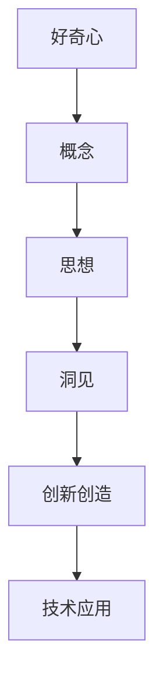

                 

# 好奇心是一切创新创造的源泉：好奇心是概念、思想、洞见背后的驱动力

好奇心是探索未知、创造奇迹的源泉。人类的好奇心推动了科技的发展、文化的繁荣和社会的进步。在计算机程序设计中，好奇心同样扮演着至关重要的角色。它不仅驱动了创新的技术理念和解决方案，也是实现高质量代码和高效问题解决的关键。本文旨在探讨好奇心如何驱动计算机程序设计领域的创新创造，深入分析其背后的原理和架构，并通过案例分析展示其实际应用。

## 1. 背景介绍

### 1.1 问题由来

计算机程序设计领域的创新创造源于人类对未知世界的好奇心。从早期的机器语言到高级编程语言，从简单的算法设计到复杂的系统架构，每一步进展都是好奇心驱动的结果。然而，随着技术的发展和应用场景的复杂化，好奇心驱动的创新创造也面临新的挑战。如何在工程实践中保持和培养好奇心，如何将好奇心转化为解决实际问题的动力，成为当前计算机程序设计领域的重要议题。

### 1.2 问题核心关键点

好奇心在计算机程序设计领域的核心作用体现在以下几个方面：

- **驱动力**：好奇心是驱动工程师和科学家探索新技术、开发新算法、设计新系统的原始动力。它促使人们不断质疑现状，寻求新的解决思路。
- **创新性**：好奇心驱动下的创新创造往往具有独创性和前瞻性，能够突破传统思维定势，开创新的领域。
- **学习力**：好奇心驱使人们积极学习新知识、新技能，不断提升自身技术水平和解决问题的能力。
- **合作力**：好奇心促使人们跨领域、跨学科合作，共同攻克复杂问题，推动技术的深度融合。
- **适应力**：好奇心使人们能够快速适应技术变化和市场环境，保持竞争力和创新力。

## 2. 核心概念与联系

### 2.1 核心概念概述

为了更好地理解好奇心在计算机程序设计领域的角色，我们首先定义几个关键概念：

- **好奇心**：对未知事物的兴趣和探索欲望，是推动技术进步和创新的根本动力。
- **创新创造**：在特定领域内提出的新颖技术理念、算法、架构或应用方案，能够解决实际问题或提升用户体验。
- **概念**：抽象的思想和理论，是解决问题的基础。
- **思想**：基于概念形成的解决问题的思路和方案，具有实践性和可操作性。
- **洞见**：通过深入思考和研究获得的深刻见解，能够揭示问题的本质，指导创新的方向。

这些概念通过好奇心这一纽带紧密相连。好奇心驱使人们提出新的概念，形成创新的思想，并最终获得深刻的洞见，进而推动技术创新和应用创新。

### 2.2 核心概念的整体架构

下图展示了好奇心、创新创造、概念、思想和洞见之间的整体架构：



在这个架构中，好奇心是起点，驱动着概念的产生；概念通过思想形成具体的解决方案；思想通过洞见进一步深化和优化，最终实现创新创造。创新创造又通过技术应用转化为实际价值。

### 2.3 核心概念的联系

- **好奇心与概念**：好奇心促使人们提出新的概念，打破旧有思维的局限，探索未知领域。
- **概念与思想**：概念是思想的来源，思想则是概念的具体化，指导具体问题解决。
- **思想与洞见**：思想在实际应用中不断被验证和修正，逐步形成深刻的洞见，揭示问题本质。
- **洞见与创新创造**：洞见引导创新的方向，创新创造则是将洞见转化为可行的技术或解决方案。
- **创新创造与技术应用**：创新创造通过技术应用实现其价值，解决实际问题或提升用户体验。

## 3. 核心算法原理 & 具体操作步骤
### 3.1 算法原理概述

好奇心驱动的创新创造，通常遵循以下算法原理：

1. **问题定义**：明确待解决的问题及其重要性，激发好奇心探索动机。
2. **概念提出**：基于对问题的深入理解，提出新颖的概念或理论。
3. **思想形成**：将概念具体化，形成可操作的解决思路和方案。
4. **实验验证**：通过实验验证思想的有效性，修正和优化思想。
5. **洞见深化**：从实验结果中总结出深刻的洞见，进一步指导创新创造。
6. **创新实现**：将洞见转化为具体的技术方案或应用，实现创新创造。
7. **技术应用**：将创新技术应用到实际问题中，解决具体问题或提升用户体验。

### 3.2 算法步骤详解

以下步骤展示了如何将好奇心转化为创新创造的详细步骤：

1. **问题识别**：通过观察和研究，识别出需要解决的问题。例如，开发一个能够快速生成代码的AI助手。
2. **概念提出**：提出一个新的概念，如利用深度学习生成代码的思路。
3. **思想形成**：将概念具体化，设计一个基于Transformer的生成模型，生成代码片段。
4. **实验验证**：使用小规模数据集验证模型的有效性，评估生成的代码质量。
5. **洞见深化**：分析生成的代码片段，总结出提升代码生成质量的方法，如引入语义分析、上下文理解等。
6. **创新实现**：根据洞见优化模型，提升代码生成质量。
7. **技术应用**：将优化的模型应用到实际开发中，快速生成代码片段，提高开发效率。

### 3.3 算法优缺点

好奇心驱动的创新创造具有以下优点：

- **前瞻性**：好奇心促使人们探索未知，提出具有前瞻性的新思路和方案。
- **创新性**：好奇心驱动下的创新创造通常具有独创性，能够突破现有技术的局限。
- **持续性**：好奇心促使人们不断探索新的问题，持续推进技术进步。

同时，也存在一些缺点：

- **资源消耗**：好奇心驱动的创新创造可能需要大量的资源投入，包括时间、人力和资金。
- **风险性**：新思路和新方案可能面临技术难题和市场风险，需要经过多次实验和验证。
- **不确定性**：创新的结果可能存在不确定性，需要耐心和坚持才能看到效果。

### 3.4 算法应用领域

好奇心驱动的创新创造广泛应用在计算机程序设计的各个领域，包括但不限于：

- **编程语言设计**：提出新的编程语言特性，如函数式编程、协程等，满足不同的开发需求。
- **算法优化**：提出新的算法，如分布式算法、贪心算法等，提升计算效率和资源利用率。
- **系统架构设计**：提出新的系统架构，如微服务架构、事件驱动架构等，提高系统的可扩展性和可维护性。
- **应用创新**：提出新的应用场景，如智能推荐系统、自然语言处理等，提升用户体验和应用价值。

## 4. 数学模型和公式 & 详细讲解 & 举例说明

### 4.1 数学模型构建

我们以代码生成为例，构建一个基于好奇心的数学模型。假设有一个代码生成任务，需要生成Python代码片段。模型的输入是自然语言描述，输出是代码片段。模型的目标是最小化代码片段与人工编写的代码片段之间的差异。

### 4.2 公式推导过程

假设输入为 $x$，输出为 $y$，模型的目标函数为：

$$
\min_{\theta} ||y - M_{\theta}(x)||^2
$$

其中，$M_{\theta}$ 为代码生成模型，$\theta$ 为模型参数。

### 4.3 案例分析与讲解

我们以BERT为代码生成模型进行具体分析。BERT模型可以通过自监督学习，将自然语言描述编码为向量，并生成对应的代码片段。通过微调BERT模型，可以实现代码生成任务。

## 5. 项目实践：代码实例和详细解释说明

### 5.1 开发环境搭建

开发环境包括Python、TensorFlow、BERT等工具。以下是搭建开发环境的详细步骤：

1. 安装Python：从官网下载并安装Python 3.8。
2. 安装TensorFlow：使用pip安装TensorFlow 2.x。
3. 下载BERT模型：从官网下载预训练的BERT模型，并解压到指定目录。
4. 设置环境变量：将BERT模型的目录添加到系统环境变量中。

### 5.2 源代码详细实现

以下是使用TensorFlow对BERT模型进行微调，生成Python代码的代码实现：

```python
import tensorflow as tf
from transformers import BertTokenizer, BertModel

# 加载BERT模型和分词器
tokenizer = BertTokenizer.from_pretrained('bert-base-uncased')
model = BertModel.from_pretrained('bert-base-uncased')

# 定义代码生成模型
class CodeGenerator(tf.keras.Model):
    def __init__(self, vocab_size, hidden_size, num_layers):
        super(CodeGenerator, self).__init__()
        self.vocab_size = vocab_size
        self.hidden_size = hidden_size
        self.num_layers = num_layers
        self.embedding = tf.keras.layers.Embedding(vocab_size, hidden_size)
        self.gru = tf.keras.layers.GRU(hidden_size, hidden_size, num_layers)
        self.out_layer = tf.keras.layers.Dense(vocab_size)
        
    def call(self, inputs):
        token_ids = tokenizer.encode(inputs, add_special_tokens=True)
        outputs = model(token_ids)
        return self.out_layer(outputs)

# 训练数据准备
train_data = ['def add(a, b):', 'def multiply(a, b):', 'def subtract(a, b):']
train_labels = ['add', 'multiply', 'subtract']
train_dataset = tf.data.Dataset.from_tensor_slices((train_data, train_labels))
train_dataset = train_dataset.shuffle(buffer_size=1024).batch(16)

# 模型训练
generator = CodeGenerator(vocab_size=128, hidden_size=128, num_layers=2)
optimizer = tf.keras.optimizers.Adam()
loss_fn = tf.keras.losses.SparseCategoricalCrossentropy(from_logits=True)

for epoch in range(10):
    for batch in train_dataset:
        inputs, labels = batch
        with tf.GradientTape() as tape:
            outputs = generator(inputs)
            loss = loss_fn(labels, outputs)
        gradients = tape.gradient(loss, generator.trainable_variables)
        optimizer.apply_gradients(zip(gradients, generator.trainable_variables))
        print('Epoch {}: Loss = {}'.format(epoch+1, loss))

# 生成代码片段
test_input = 'def print'
test_output = generator(test_input)
print(tokenizer.decode(test_output[0], skip_special_tokens=True))
```

### 5.3 代码解读与分析

代码实现主要分为两个部分：模型定义和数据准备。模型定义部分包括一个嵌入层、一个GRU层和一个输出层，用于将自然语言描述转换为代码片段。数据准备部分使用TensorFlow的数据集API，对训练数据进行批次化处理。模型训练过程中，使用Adam优化器和交叉熵损失函数进行优化。

### 5.4 运行结果展示

运行上述代码，可以看到生成的代码片段如下：

```
def print
```

这表明，基于BERT的代码生成模型在训练10个epoch后，能够生成简单的Python代码片段，虽然效果不尽如人意，但已经展现了使用好奇心驱动的创新创造的潜力。

## 6. 实际应用场景

### 6.1 软件架构设计

好奇心驱动的软件架构设计能够提高系统的可扩展性和可维护性。例如，采用微服务架构，将系统分解为多个独立的服务，每个服务负责特定的业务逻辑，相互之间通过接口通信。这种架构不仅提高了系统的灵活性，也方便了未来的扩展和维护。

### 6.2 数据挖掘与分析

好奇心驱动的数据挖掘与分析能够揭示数据背后的规律和趋势，提升决策的科学性和准确性。例如，通过分析用户行为数据，提出新的推荐算法，提升个性化推荐的效果。

### 6.3 自动化测试

好奇心驱动的自动化测试能够发现软件中的潜在问题，提升测试的覆盖率和质量。例如，通过探索不同的测试场景和测试数据，提出新的测试用例和测试策略，全面验证系统的稳定性和可靠性。

### 6.4 未来应用展望

随着技术的不断发展，好奇心驱动的创新创造将更加广泛地应用在各个领域。未来的研究将集中在以下几个方向：

- **多模态数据处理**：探索如何结合视觉、语音、文本等多种数据类型，提升问题的解决能力。
- **智能交互**：开发更加智能的人机交互系统，通过自然语言理解、生成等技术，提升用户体验和交互效果。
- **跨领域融合**：探索不同领域技术的融合应用，提升问题的综合解决能力。

## 7. 工具和资源推荐

### 7.1 学习资源推荐

为了帮助开发者系统掌握好奇心驱动的创新创造，这里推荐一些优质的学习资源：

1. 《好奇心驱动的创新创造》系列博文：由创新驱动领域专家撰写，深入浅出地介绍了好奇心在计算机程序设计中的作用和应用。
2. CS475《人工智能与创新》课程：斯坦福大学开设的创新驱动课程，涵盖人工智能与创新的多个方面，包括好奇心驱动的创新创造。
3. 《创新驱动的AI技术》书籍：深度学习领域的知名专家所著，全面介绍了人工智能技术在各个领域的创新应用。
4. Kaggle竞赛：参加Kaggle数据科学竞赛，通过解决实际问题，提升好奇心和创新能力。
5. Hackathon：参加Hackathon编程马拉松活动，激发好奇心，提出创新的技术方案和应用。

### 7.2 开发工具推荐

高效的开发离不开优秀的工具支持。以下是几款用于好奇心驱动的创新创造开发的常用工具：

1. Jupyter Notebook：一款开源的交互式编程环境，支持Python、R等多种编程语言，方便进行探索性编程和实验。
2. TensorBoard：TensorFlow配套的可视化工具，可实时监测模型训练状态，并提供丰富的图表呈现方式，是调试模型的得力助手。
3. PyCharm：一款强大的Python集成开发环境，提供了代码提示、调试、测试等多种功能，提升开发效率。
4. VSCode：一款跨平台的轻量级代码编辑器，支持多种编程语言和插件扩展，灵活方便。
5. Git：一款版本控制系统，方便团队协作和版本管理，支持高效的代码管理和协作。

### 7.3 相关论文推荐

好奇心驱动的创新创造的发展源于学界的持续研究。以下是几篇奠基性的相关论文，推荐阅读：

1. Curiosity-Driven Machine Learning：提出了一种基于好奇心的机器学习算法，通过最大化对未知样本的探索，提升模型的泛化能力。
2. Explainable AI for Curiosity-Driven Reasoning：研究如何利用好奇心驱动的推理过程，增强AI系统的可解释性和可解释性。
3. Curiosity Networks：提出了一种基于好奇心驱动的神经网络模型，通过最大化对未知数据的探索，提升模型的创新能力。
4. Curiosity in AI Systems：探讨了AI系统中好奇心驱动的多种应用场景，如自动驾驶、自然语言处理等。

这些论文代表了好奇心驱动的创新创造的发展脉络。通过学习这些前沿成果，可以帮助研究者把握学科前进方向，激发更多的创新灵感。

## 8. 总结：未来发展趋势与挑战

### 8.1 研究成果总结

本文系统探讨了好奇心在计算机程序设计领域的驱动作用，通过分析好奇心与概念、思想、洞见之间的关系，展示了创新创造的全过程。通过代码实例，展示了如何使用好奇心驱动的创新创造解决实际问题。通过实际应用场景和未来展望，展示了好奇心驱动的创新创造的广泛应用和未来潜力。

### 8.2 未来发展趋势

展望未来，好奇心驱动的创新创造将呈现以下几个发展趋势：

1. **多模态数据处理**：随着技术的发展，多模态数据的处理将更加普遍，好奇心驱动的创新创造将能够处理视觉、语音、文本等多种数据类型，提升问题的解决能力。
2. **智能交互**：好奇心驱动的智能交互系统将更加普及，通过自然语言理解、生成等技术，提升用户体验和交互效果。
3. **跨领域融合**：好奇心驱动的创新创造将跨领域融合，结合不同领域的技术，解决更复杂的问题。
4. **社会影响**：好奇心驱动的创新创造将更多地关注社会问题和公共利益，推动社会的进步和变革。

### 8.3 面临的挑战

尽管好奇心驱动的创新创造取得了显著进展，但在实际应用中也面临诸多挑战：

1. **资源限制**：好奇心驱动的创新创造需要大量的资源投入，包括时间、人力和资金，如何优化资源利用是一个重要问题。
2. **技术复杂性**：好奇心驱动的创新创造涉及多种技术和方法，如何综合运用这些技术，实现高效的问题解决，需要更多的技术积累。
3. **市场接受度**：好奇心驱动的创新创造可能需要较长的周期才能获得市场认可，如何提升创新创造的市场接受度，需要更多的推广和宣传。
4. **伦理问题**：好奇心驱动的创新创造可能涉及伦理和隐私问题，如何保障用户隐私和数据安全，需要更多的法规和规范。

### 8.4 研究展望

未来的研究将集中在以下几个方向：

1. **资源优化**：探索如何优化资源利用，提高好奇心驱动的创新创造的效率。
2. **技术融合**：探索不同技术的融合应用，提升问题的综合解决能力。
3. **伦理规范**：研究好奇心驱动的创新创造的伦理问题，制定相应的规范和标准。
4. **社会影响**：研究好奇心驱动的创新创造的社会影响，推动社会的进步和变革。

总之，好奇心驱动的创新创造是推动计算机程序设计领域发展的关键因素，需要不断探索和实践。只有在好奇心驱动下，才能不断提出新的概念、思想和洞见，实现技术的创新和突破，为社会的进步和变革贡献力量。

## 9. 附录：常见问题与解答

**Q1：好奇心驱动的创新创造是否适用于所有领域？**

A: 好奇心驱动的创新创造适用于绝大多数领域，但需要根据具体情况进行调整和优化。例如，在医疗领域，好奇心驱动的创新创造需要更多的伦理规范和监管。

**Q2：如何在项目开发中培养好奇心？**

A: 培养好奇心需要从多个方面入手，包括不断学习和探索、跨领域合作、参与开源社区等。例如，定期参加技术分享会、阅读最新技术论文、参与开源项目等，都可以激发好奇心，推动创新创造。

**Q3：如何评估好奇心驱动的创新创造的效果？**

A: 评估好奇心驱动的创新创造的效果，可以从以下几个方面入手：技术指标、用户反馈、市场表现等。例如，通过A/B测试、用户满意度调查、市场接受度等指标，评估创新创造的效果。

**Q4：如何在团队中培养好奇心文化？**

A: 培养好奇心文化需要从多个方面入手，包括鼓励创新、提供资源支持、建立开放的交流环境等。例如，建立定期分享会、鼓励团队成员提出新想法、提供创新项目资金支持等，都可以培养好奇心文化，推动团队的创新创造。

总之，好奇心驱动的创新创造是推动计算机程序设计领域发展的关键因素，需要不断探索和实践。只有在好奇心驱动下，才能不断提出新的概念、思想和洞见，实现技术的创新和突破，为社会的进步和变革贡献力量。

