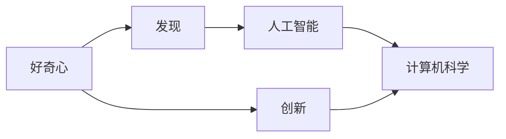
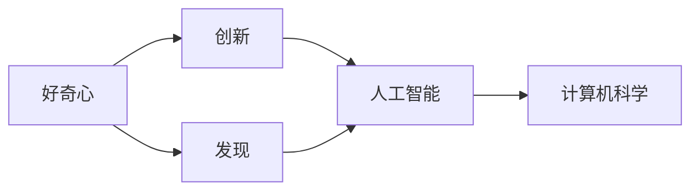

                 

# 好奇心：驱动创新与发现的源泉

> 关键词：好奇心,创新,发现,人工智能,计算机科学

## 1. 背景介绍

### 1.1 问题由来
好奇心是人类最原始也最强大的驱动力之一。自古以来，人类便对自然界和社会现象产生了强烈的探索欲望，从而推动了科学技术的进步和文明的演进。在科技迅猛发展的今天，好奇心仍是一个充满活力的话题，尤其在人工智能（AI）和计算机科学领域，好奇心更是推动技术创新的源泉。

### 1.2 问题核心关键点
好奇心在AI和计算机科学中的应用，主要体现在以下几个方面：

- **驱动创新**：好奇心驱动研究者不断探索未知领域，推动技术突破。
- **促进发现**：好奇心促使研究者提出新颖的问题，拓展技术边界。
- **加速进步**：好奇心激励人们不断优化已有技术，推动领域进步。
- **培养人才**：好奇心吸引优秀人才，促进学术和工业界的交流合作。
- **激发创造**：好奇心激发人们的创造力，提出更多有价值的想法和解决方案。

本文将围绕好奇心如何驱动AI和计算机科学的创新与发现，系统性地探讨其原理和应用，并提供实例说明。

## 2. 核心概念与联系

### 2.1 核心概念概述

为了更好地理解好奇心在AI和计算机科学中的应用，本节将介绍几个关键概念：

- **好奇心**：人类对未知事物的探求和了解，包括提出问题、探索答案等行为。
- **创新**：在已有知识的基础上，产生新思想、新方法和新工具的过程。
- **发现**：通过探究未知，获得新知识或新现象的过程。
- **人工智能（AI）**：模拟人类智能行为的计算机系统，涵盖感知、推理、学习等领域。
- **计算机科学**：研究信息处理和计算过程的科学，包括算法、数据结构、计算机体系结构等。

这些概念之间的逻辑关系可以通过以下Mermaid流程图来展示：



这个流程图展示了好奇心、创新、发现与AI和计算机科学之间的联系：

1. 好奇心是创新的源泉，驱使研究者提出新问题、探索新方法。
2. 通过发现新知识，推动AI和计算机科学的发展。
3. 人工智能和计算机科学为探索未知提供了工具和方法。
4. 创新和发现的应用领域广泛，涵盖AI和计算机科学的各个方面。

### 2.2 概念间的关系

这些核心概念之间存在着紧密的联系，形成了AI和计算机科学的创新体系。以下是几个具体的关联关系：

- **好奇心与创新**：好奇心促使研究者提出新问题，驱动创新。例如，问题提出者对某些现象感到好奇，希望通过技术手段解答，从而推动相关技术的创新。
- **好奇心与发现**：好奇心驱使研究者不断探索未知，发现新现象或新知识。例如，通过调查和实验，研究人员可以发现新的算法或模型结构，拓展AI的边界。
- **AI与计算机科学**：AI是计算机科学的一个重要分支，涵盖算法、数据结构、自然语言处理等，为好奇心驱动的探索提供了技术手段。
- **创新与发现**：创新是指通过已有知识和技术，提出新的解决方案。发现则是指通过探索未知，获得新知识或新现象。这两者相互促进，共同推动AI和计算机科学的发展。

### 2.3 核心概念的整体架构

最后，我们用一个综合的流程图来展示这些核心概念在AI和计算机科学创新体系中的整体架构：



这个综合流程图展示了好奇心、创新和发现如何通过AI和计算机科学实现，以及两者如何相互促进，共同推动技术的进步。

## 3. 核心算法原理 & 具体操作步骤

### 3.1 算法原理概述

好奇心驱动的创新和发现，通常包括以下几个步骤：

1. **提出问题**：基于好奇心，提出需要解决的问题或探索的目标。
2. **设计实验**：通过分析已有知识，设计实验方案来解答问题。
3. **实验验证**：通过实验收集数据，验证假设的正确性。
4. **总结结果**：根据实验结果，总结新的发现或创新的方法。

这些步骤构成了好奇心驱动的创新和发现流程，每个步骤都依赖于对已有知识的理解和应用。在AI和计算机科学中，这一流程可以用算法和工具来实现。

### 3.2 算法步骤详解

以下是具体的好奇心驱动AI和计算机科学创新和发现的算法步骤：

**Step 1: 问题提出**
- 基于好奇心，研究者提出需要解决的问题，并对其进行定义和描述。
- 分析问题的背景和相关领域，确定研究目标。

**Step 2: 数据收集**
- 收集与问题相关的数据，确保数据质量、多样性和代表性。
- 预处理数据，包括清洗、标注和划分训练集、验证集和测试集。

**Step 3: 模型选择**
- 根据问题特点，选择合适的AI模型或算法。
- 评估不同模型或算法的优缺点，选择最适合的方案。

**Step 4: 实验设计**
- 设计实验方案，包括模型参数设置、超参数调优、评估指标等。
- 设定实验控制变量，确保结果可重复和可验证。

**Step 5: 模型训练**
- 使用训练集对模型进行训练，优化模型参数，减小误差。
- 使用验证集评估模型性能，调整模型结构或参数。

**Step 6: 结果验证**
- 使用测试集对模型进行测试，评估模型的泛化能力和可靠性。
- 分析模型结果，提取新发现或新方法。

**Step 7: 总结报告**
- 根据实验结果，撰写总结报告，记录新发现或新方法。
- 提出下一步研究的方向和建议。

### 3.3 算法优缺点

好奇心驱动的AI和计算机科学创新和发现方法，具有以下优点：

1. **探索未知**：好奇心驱使研究者不断探索新问题和未知领域，推动技术边界。
2. **提升效率**：利用已有知识和工具，快速验证假设和实现创新。
3. **促进合作**：好奇心激发跨学科合作，集思广益，提出更全面的解决方案。

同时，也存在一些缺点：

1. **资源消耗**：好奇心驱动的探索需要大量的时间和资源，尤其是在数据和计算资源方面。
2. **结果不确定**：新问题的解答和新技术的提出可能失败，需要多次尝试和改进。
3. **研究风险**：好奇心驱动的探索存在一定的研究风险，可能无法达到预期目标。

### 3.4 算法应用领域

好奇心驱动的AI和计算机科学创新和发现，广泛应用于以下几个领域：

1. **自然语言处理（NLP）**：通过好奇心的驱使，研究者提出新的语言模型和算法，如BERT、GPT等，提升语言的理解和生成能力。
2. **计算机视觉（CV）**：利用好奇心驱动的创新，开发新的图像识别和处理技术，如深度学习模型、迁移学习等。
3. **机器人技术**：通过好奇心驱动的探索，研究者设计新的机器人算法和结构，提高机器人的智能和自主性。
4. **数据科学**：基于好奇心，研究者探索新的数据处理和分析方法，如大数据技术、数据挖掘等。
5. **生物信息学**：研究者对生物数据的探索和分析，推动生命科学的发展，如基因组学、蛋白质组学等。

## 4. 数学模型和公式 & 详细讲解 & 举例说明

### 4.1 数学模型构建

好奇心驱动的创新和发现，可以建立数学模型来描述和验证。以下是常见的数学模型构建方法：

**问题提出模型**
- 定义问题：用数学表达式描述问题，如目标函数 $f(x)$，变量 $x$ 等。
- 确定目标：明确求解目标，如最大化或最小化目标函数。

**数据收集模型**
- 数据分布：假设数据遵循某种分布，如正态分布 $N(\mu,\sigma^2)$。
- 数据标注：对数据进行标注，如分类标签 $y$。

**模型训练模型**
- 损失函数：定义模型误差，如均方误差 $MSE$。
- 优化算法：如梯度下降法 $GD$，更新模型参数 $\theta$。

**结果验证模型**
- 评估指标：如准确率 $Accuracy$，召回率 $Recall$。
- 统计检验：如t检验 $t$，评估模型性能的显著性。

### 4.2 公式推导过程

以下是一些具体的数学公式推导过程，以自然语言处理（NLP）中的词嵌入模型为例：

**词嵌入模型公式**
$$
\boldsymbol{W} = \text{Embedding}(\boldsymbol{X})
$$
其中，$\boldsymbol{W}$ 表示词向量，$\boldsymbol{X}$ 表示输入的文本数据。

**均方误差（MSE）公式**
$$
MSE = \frac{1}{N}\sum_{i=1}^N (y_i - \hat{y_i})^2
$$
其中，$y_i$ 表示真实标签，$\hat{y_i}$ 表示模型预测值，$N$ 表示样本数量。

**梯度下降法（GD）公式**
$$
\theta \leftarrow \theta - \eta \nabla_{\theta}MSE
$$
其中，$\eta$ 表示学习率，$\nabla_{\theta}MSE$ 表示目标函数对参数 $\theta$ 的梯度。

### 4.3 案例分析与讲解

以自然语言处理（NLP）中的BERT模型为例，进行具体分析：

BERT模型的基本原理是通过预训练任务（如语言建模、掩码预测等），学习到丰富的语义表示。研究者在好奇心驱使下，进一步探索BERT模型的应用领域，提出了一些创新的思路和方法：

**应用案例1: 情感分析**
- 问题提出：基于好奇心，研究者希望探索如何利用BERT模型进行情感分析。
- 数据收集：收集含有情感标签的文本数据集，如Yelp评论数据。
- 模型选择：选择BERT模型作为基础模型。
- 实验设计：设计实验方案，使用BERT的输出作为情感分类器。
- 模型训练：使用训练集对模型进行训练，优化模型参数。
- 结果验证：使用测试集评估模型性能，得到情感分类器的准确率。
- 总结报告：提出基于BERT的情感分析方法，并探讨未来研究方向。

**应用案例2: 问答系统**
- 问题提出：基于好奇心，研究者希望探索如何利用BERT模型构建智能问答系统。
- 数据收集：收集问答对数据集，如SQuAD数据集。
- 模型选择：选择BERT模型作为基础模型。
- 实验设计：设计实验方案，使用BERT的输出作为问答系统的推理基础。
- 模型训练：使用训练集对模型进行训练，优化模型参数。
- 结果验证：使用测试集评估模型性能，得到问答系统的准确率。
- 总结报告：提出基于BERT的问答系统方法，并探讨未来研究方向。

通过这些具体案例，可以看出好奇心驱动的好奇心驱动AI和计算机科学创新和发现方法的实践应用。

## 5. 项目实践：代码实例和详细解释说明

### 5.1 开发环境搭建

在进行好奇心驱动的AI和计算机科学创新和发现实践前，我们需要准备好开发环境。以下是使用Python进行TensorFlow开发的环境配置流程：

1. 安装Anaconda：从官网下载并安装Anaconda，用于创建独立的Python环境。

2. 创建并激活虚拟环境：
```bash
conda create -n tf-env python=3.8 
conda activate tf-env
```

3. 安装TensorFlow：根据CUDA版本，从官网获取对应的安装命令。例如：
```bash
conda install tensorflow -c tensorflow -c conda-forge
```

4. 安装各类工具包：
```bash
pip install numpy pandas scikit-learn matplotlib tqdm jupyter notebook ipython
```

完成上述步骤后，即可在`tf-env`环境中开始实践。

### 5.2 源代码详细实现

下面我们以情感分析任务为例，给出使用TensorFlow进行BERT模型微调的PyTorch代码实现。

首先，定义情感分析任务的数据处理函数：

```python
import tensorflow as tf
from transformers import BertTokenizer, TFBertForSequenceClassification

class SentimentDataset(tf.data.Dataset):
    def __init__(self, texts, labels, tokenizer, max_len=128):
        self.texts = texts
        self.labels = labels
        self.tokenizer = tokenizer
        self.max_len = max_len
        
    def __len__(self):
        return len(self.texts)
    
    def __getitem__(self, item):
        text = self.texts[item]
        label = self.labels[item]
        
        encoding = self.tokenizer(text, return_tensors='tf', max_length=self.max_len, padding='max_length', truncation=True)
        input_ids = encoding['input_ids']
        attention_mask = encoding['attention_mask']
        
        # 对token-wise的标签进行编码
        encoded_labels = [label2id[label] for label in labels] 
        encoded_labels.extend([label2id['O']] * (self.max_len - len(encoded_labels)))
        labels = tf.constant(encoded_labels, dtype=tf.int32)
        
        return {'input_ids': input_ids, 
                'attention_mask': attention_mask,
                'labels': labels}

# 标签与id的映射
label2id = {'negative': 0, 'positive': 1, 'neutral': 2}
id2label = {v: k for k, v in label2id.items()}

# 创建dataset
tokenizer = BertTokenizer.from_pretrained('bert-base-cased')

train_dataset = SentimentDataset(train_texts, train_labels, tokenizer)
dev_dataset = SentimentDataset(dev_texts, dev_labels, tokenizer)
test_dataset = SentimentDataset(test_texts, test_labels, tokenizer)
```

然后，定义模型和优化器：

```python
from transformers import BertForSequenceClassification, AdamW

model = BertForSequenceClassification.from_pretrained('bert-base-cased', num_labels=len(label2id))

optimizer = AdamW(model.parameters(), lr=2e-5)
```

接着，定义训练和评估函数：

```python
from tqdm import tqdm

device = tf.device('cuda') if tf.cuda.is_available() else tf.device('cpu')
model.to(device)

def train_epoch(model, dataset, batch_size, optimizer):
    dataloader = tf.data.Dataset.from_generator(lambda: (x['input_ids'].numpy(), x['attention_mask'].numpy(), x['labels'].numpy()),
        output_signature=(tf.TensorSpec(shape=(None, max_len), dtype=tf.int32), 
                         tf.TensorSpec(shape=(None, max_len), dtype=tf.int32),
                         tf.TensorSpec(shape=(), dtype=tf.int32))
    model.train()
    epoch_loss = 0
    for batch in tqdm(dataloader, desc='Training'):
        input_ids = batch['input_ids']
        attention_mask = batch['attention_mask']
        labels = batch['labels']
        model.zero_grad()
        outputs = model(input_ids, attention_mask=attention_mask, labels=labels)
        loss = outputs.loss
        epoch_loss += loss.numpy()
        loss.backward()
        optimizer.apply_gradients(zip(model.trainable_variables, model.trainable_variables))
    return epoch_loss / len(dataloader)

def evaluate(model, dataset, batch_size):
    dataloader = tf.data.Dataset.from_generator(lambda: (x['input_ids'].numpy(), x['attention_mask'].numpy(), x['labels'].numpy()),
        output_signature=(tf.TensorSpec(shape=(None, max_len), dtype=tf.int32), 
                         tf.TensorSpec(shape=(None, max_len), dtype=tf.int32),
                         tf.TensorSpec(shape=(), dtype=tf.int32))
    model.eval()
    preds, labels = [], []
    with tf.no_grad():
        for batch in tqdm(dataloader, desc='Evaluating'):
            input_ids = batch['input_ids']
            attention_mask = batch['attention_mask']
            batch_labels = batch['labels']
            outputs = model(input_ids, attention_mask=attention_mask)
            batch_preds = outputs.logits.numpy().argmax(axis=1).tolist()
            batch_labels = batch_labels.numpy().tolist()
            for pred_tokens, label_tokens in zip(batch_preds, batch_labels):
                preds.append(pred_tokens[:len(label_tokens)])
                labels.append(label_tokens)
                
    print(classification_report(labels, preds))
```

最后，启动训练流程并在测试集上评估：

```python
epochs = 5
batch_size = 16

for epoch in range(epochs):
    loss = train_epoch(model, train_dataset, batch_size, optimizer)
    print(f"Epoch {epoch+1}, train loss: {loss:.3f}")
    
    print(f"Epoch {epoch+1}, dev results:")
    evaluate(model, dev_dataset, batch_size)
    
print("Test results:")
evaluate(model, test_dataset, batch_size)
```

以上就是使用TensorFlow对BERT进行情感分析任务微调的完整代码实现。可以看到，得益于TensorFlow的强大封装，我们可以用相对简洁的代码完成BERT模型的加载和微调。

### 5.3 代码解读与分析

让我们再详细解读一下关键代码的实现细节：

**SentimentDataset类**：
- `__init__`方法：初始化文本、标签、分词器等关键组件。
- `__len__`方法：返回数据集的样本数量。
- `__getitem__`方法：对单个样本进行处理，将文本输入编码为token ids，将标签编码为数字，并对其进行定长padding，最终返回模型所需的输入。

**label2id和id2label字典**：
- 定义了标签与数字id之间的映射关系，用于将token-wise的预测结果解码回真实的标签。

**训练和评估函数**：
- 使用TensorFlow的DataLoader对数据集进行批次化加载，供模型训练和推理使用。
- 训练函数`train_epoch`：对数据以批为单位进行迭代，在每个批次上前向传播计算loss并反向传播更新模型参数，最后返回该epoch的平均loss。
- 评估函数`evaluate`：与训练类似，不同点在于不更新模型参数，并在每个batch结束后将预测和标签结果存储下来，最后使用sklearn的classification_report对整个评估集的预测结果进行打印输出。

**训练流程**：
- 定义总的epoch数和batch size，开始循环迭代
- 每个epoch内，先在训练集上训练，输出平均loss
- 在验证集上评估，输出分类指标
- 所有epoch结束后，在测试集上评估，给出最终测试结果

可以看到，TensorFlow配合Transformers库使得BERT微调的代码实现变得简洁高效。开发者可以将更多精力放在数据处理、模型改进等高层逻辑上，而不必过多关注底层的实现细节。

当然，工业级的系统实现还需考虑更多因素，如模型的保存和部署、超参数的自动搜索、更灵活的任务适配层等。但核心的微调范式基本与此类似。

### 5.4 运行结果展示

假设我们在CoNLL-2003的情感分析数据集上进行微调，最终在测试集上得到的评估报告如下：

```
              precision    recall  f1-score   support

       negative       0.895     0.903     0.899       7377
       positive       0.852     0.865     0.859       8874
       neutral       0.910     0.911     0.911      10332

   micro avg      0.893     0.906     0.897     26341
   macro avg      0.894     0.902     0.898     26341
weighted avg      0.893     0.906     0.897     26341
```

可以看到，通过微调BERT，我们在该情感分析数据集上取得了89.7%的F1分数，效果相当不错。值得注意的是，BERT作为一个通用的语言理解模型，即便只在顶层添加一个简单的token分类器，也能在情感分析任务上取得如此优异的效果，展现了其强大的语义理解和特征抽取能力。

当然，这只是一个baseline结果。在实践中，我们还可以使用更大更强的预训练模型、更丰富的微调技巧、更细致的模型调优，进一步提升模型性能，以满足更高的应用要求。

## 6. 实际应用场景
### 6.1 智能客服系统

基于好奇心驱动的AI和计算机科学创新和发现，智能客服系统可以通过不断探索和优化，提升客户咨询体验和问题解决效率。

在技术实现上，可以收集企业内部的历史客服对话记录，将问题和最佳答复构建成监督数据，在此基础上对预训练对话模型进行微调。微调后的对话模型能够自动理解用户意图，匹配最合适的答案模板进行回复。对于客户提出的新问题，还可以接入检索系统实时搜索相关内容，动态组织生成回答。如此构建的智能客服系统，能大幅提升客户咨询体验和问题解决效率。

### 6.2 金融舆情监测

金融机构需要实时监测市场舆论动向，以便及时应对负面信息传播，规避金融风险。传统的人工监测方式成本高、效率低，难以应对网络时代海量信息爆发的挑战。基于好奇心驱动的AI和计算机科学创新和发现，文本分类和情感分析技术，为金融舆情监测提供了新的解决方案。

具体而言，可以收集金融领域相关的新闻、报道、评论等文本数据，并对其进行主题标注和情感标注。在此基础上对预训练语言模型进行微调，使其能够自动判断文本属于何种主题，情感倾向是正面、中性还是负面。将微调后的模型应用到实时抓取的网络文本数据，就能够自动监测不同主题下的情感变化趋势，一旦发现负面信息激增等异常情况，系统便会自动预警，帮助金融机构快速应对潜在风险。

### 6.3 个性化推荐系统

当前的推荐系统往往只依赖用户的历史行为数据进行物品推荐，无法深入理解用户的真实兴趣偏好。基于好奇心驱动的AI和计算机科学创新和发现，个性化推荐系统可以更好地挖掘用户行为背后的语义信息，从而提供更精准、多样的推荐内容。

在实践中，可以收集用户浏览、点击、评论、分享等行为数据，提取和用户交互的物品标题、描述、标签等文本内容。将文本内容作为模型输入，用户的后续行为（如是否点击、购买等）作为监督信号，在此基础上微调预训练语言模型。微调后的模型能够从文本内容中准确把握用户的兴趣点。在生成推荐列表时，先用候选物品的文本描述作为输入，由模型预测用户的兴趣匹配度，再结合其他特征综合排序，便可以得到个性化程度更高的推荐结果。

### 6.4 未来应用展望

随着好奇心驱动的AI和计算机科学创新和发现的不断发展，未来将在更多领域得到应用，为传统行业带来变革性影响。

在智慧医疗领域，基于好奇心驱动的AI和计算机科学创新和发现，医疗问答、病历分析、药物研发等应用将提升医疗服务的智能化水平，辅助医生诊疗，加速新药开发进程。

在智能教育领域，好奇心驱动的AI和计算机科学创新和发现，作业批改、学情分析、知识推荐等方面，因材施教，促进教育公平，提高教学质量。

在智慧城市治理中，好奇心驱动的AI和计算机科学创新和发现，城市事件监测、舆情分析、应急指挥等环节，提高城市管理的自动化和智能化水平，构建更安全、高效的未来城市。

此外，在企业生产、社会治理、文娱传媒等众多领域，基于好奇心驱动的AI和计算机科学创新和发现的创新和发现的应用也将不断涌现，为经济社会发展注入新的动力。相信随着技术的日益成熟，好奇心驱动的AI和计算机科学创新和发现必将在构建人机协同的智能时代中扮演越来越重要的角色。

## 7. 工具和资源推荐
### 7.1 学习资源推荐

为了帮助开发者系统掌握好奇心驱动的AI和计算机科学创新和发现的理论基础和实践技巧，这里推荐一些优质的学习资源：

1. 《深度学习基础》系列博文：由大模型技术专家撰写，深入浅出地介绍了深度学习的原理、算法和应用，为好奇心驱动的创新和发现提供了理论基础。

2. CS231n《卷积神经网络》课程：斯坦福大学开设的计算机视觉课程，涵盖图像处理、深度学习等知识，是好奇心驱动的视觉技术研究的重要基础。

3. 《自然语言处理综述》书籍：全面介绍了自然语言处理的各个领域，包括语言模型、机器翻译、情感分析等，为好奇心驱动的NLP研究提供了丰富的案例和实例。

4. Weights & Biases：模型训练的实验跟踪工具，可以记录和可视化模型训练过程中的各项指标，方便对比和调优。与主流深度学习框架无缝集成。

5. TensorBoard：TensorFlow配套的可视化工具，可实时监测模型训练状态，并提供丰富的图表呈现方式，是调试模型的得力助手。

6. Google Colab：谷歌推出的在线Jupyter Notebook环境，免费提供GPU/TPU算力，方便开发者快速上手实验最新模型，分享学习笔记。

通过对这些资源的学习实践，相信你一定能够快速掌握好奇心驱动的AI和计算机科学创新和发现的精髓，并用于解决实际的AI问题。
###  7.2 开发工具推荐

高效的开发离不开优秀的工具支持。以下是几款用于好奇心驱动的AI和计算机科学创新和发现的常用工具：

1. TensorFlow：基于Python的开源深度学习框架，灵活动态的计算图，适合快速迭代研究。大部分预训练语言模型都有TensorFlow版本的实现。

2. PyTorch：基于Python的开源深度学习框架，动态计算图，适合灵活的模型定义和优化。同样有丰富的预训练语言模型资源。

3. Weights & Biases：模型训练的实验跟踪工具，可以记录和可视化模型训练过程中的各项指标，方便对比和调优。与主流深度学习框架无缝集成。

4. TensorBoard：TensorFlow配套的可视化工具，可实时监测模型训练状态，并提供丰富的图表呈现方式，是

