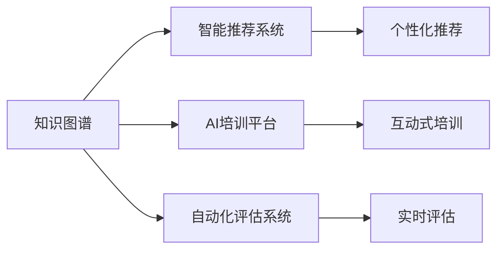

                 

# 学习体系与管理创新能力的培养

> 关键词：学习体系,管理创新,能力培养,知识图谱,智能推荐系统,AI培训平台,自动化评估系统

## 1. 背景介绍

### 1.1 问题由来
随着科技的快速发展和全球化趋势的加剧，企业需要培养和提升员工的学习能力和创新能力，以适应快速变化的市场环境和激烈的竞争。特别是对于那些基于知识的密集型企业，如信息技术、金融、医疗等领域，管理创新能力的培养显得尤为重要。然而，传统的培训方法往往存在内容庞杂、知识更新缓慢、学习效率低等问题，难以满足现代企业的培训需求。

### 1.2 问题核心关键点
为了解决这些问题，近年来出现了许多新技术和工具，如知识图谱、智能推荐系统、AI培训平台、自动化评估系统等。这些技术不仅能够提升培训效果，还能有效管理培训数据，实现个性化学习。

具体来说，知识图谱技术可以将企业内部和外部的知识进行结构化，形成全面的知识体系，帮助员工快速找到所需的知识信息。智能推荐系统可以根据员工的学习行为和兴趣，推荐最适合的学习材料，提高学习效率。AI培训平台可以通过语音、图像等自然语言处理技术，进行个性化培训和智能答疑，提升学习体验。自动化评估系统可以实时监控和评估员工的学习效果，提供及时的反馈，促进学习效果的提升。

这些新技术的应用，使得学习体系和管理创新能力的培养变得更为高效和智能化。但如何有效地整合这些技术，形成一套完整的学习体系，仍是一个重要的研究课题。本文将从学习体系和管理系统两个方面，探讨如何通过技术手段，提升企业员工的学习能力和创新能力。

### 1.3 问题研究意义
构建一个高效、智能的学习体系和管理创新能力培养系统，对于企业的长期发展具有重要意义：

1. 提升企业竞争力：通过不断提升员工的知识水平和创新能力，企业能够更快适应市场变化，赢得竞争优势。
2. 降低培训成本：智能化学习系统能够自动生成培训计划和课程内容，减少人力成本和时间成本。
3. 提高培训效果：通过个性化推荐和学习路径优化，员工能够更高效地掌握所需知识。
4. 促进知识共享：知识图谱和智能推荐系统能够帮助员工快速查找和共享知识，提升知识传播效率。
5. 增强学习体验：AI培训平台和自动化评估系统能够提升培训的互动性和趣味性，提高员工的学习积极性。

## 2. 核心概念与联系

### 2.1 核心概念概述

为了更好地理解构建学习体系和管理创新能力培养系统的技术方法，我们需要了解几个核心概念及其联系：

- 知识图谱：一种结构化的知识表示方式，将知识点、概念和关系等组成网络结构，帮助员工快速获取知识。
- 智能推荐系统：通过分析员工的学习行为和兴趣，推荐个性化的学习材料和课程，提高学习效率。
- AI培训平台：基于自然语言处理技术，提供语音、图像等互动式培训，提升学习体验。
- 自动化评估系统：实时监控和评估员工的学习效果，提供及时的反馈和改进建议，促进学习效果提升。
- 学习路径规划：根据员工的学习目标和知识体系，制定个性化的学习路径，优化学习过程。

这些核心概念通过技术手段，形成了完整的学习体系和管理创新能力培养系统，帮助企业员工提升学习效率和创新能力。

### 2.2 概念间的关系

这些核心概念之间的联系可以通过以下Mermaid流程图来展示：



这个流程图展示了各核心概念之间的联系：

1. 知识图谱提供全面的知识体系，智能推荐系统根据员工的学习行为和兴趣，推荐个性化的学习材料。
2. AI培训平台通过自然语言处理技术，提供互动式培训，提升学习体验。
3. 自动化评估系统实时监控和评估员工的学习效果，提供及时的反馈和改进建议。

这些核心概念共同构成了学习体系和管理创新能力培养系统的完整架构，帮助企业员工实现高效、智能的学习。

## 3. 核心算法原理 & 具体操作步骤

### 3.1 算法原理概述

构建学习体系和管理创新能力培养系统，本质上是一个知识管理的智能系统，其核心算法原理如下：

1. **知识图谱构建**：将企业内部和外部的知识进行结构化，形成全面的知识体系。
2. **智能推荐算法**：通过分析员工的学习行为和兴趣，推荐个性化的学习材料和课程。
3. **AI培训算法**：基于自然语言处理技术，提供互动式培训，提升学习体验。
4. **自动化评估算法**：实时监控和评估员工的学习效果，提供及时的反馈和改进建议。

这些算法共同构成了学习体系和管理创新能力培养系统的核心，能够实现个性化学习、智能培训和实时评估，帮助企业员工提升学习效率和创新能力。

### 3.2 算法步骤详解

基于知识图谱、智能推荐系统、AI培训平台和自动化评估系统的学习体系和管理创新能力培养系统，具体操作步骤如下：

**Step 1: 知识图谱构建**
1. 收集企业内部和外部的知识，包括文档、文章、培训课程、技术资料等。
2. 对知识进行分类和标准化，建立知识节点和关系。
3. 使用知识图谱构建工具，如Neo4j、GraphDB等，将知识节点和关系组成网络结构。

**Step 2: 智能推荐系统构建**
1. 收集员工的学习行为数据，如访问历史、点击记录、评分等。
2. 使用机器学习算法，如协同过滤、内容推荐等，建立员工兴趣模型。
3. 根据员工的学习目标和兴趣模型，智能推荐个性化的学习材料和课程。

**Step 3: AI培训平台搭建**
1. 使用自然语言处理技术，如语音识别、图像处理等，构建AI培训平台。
2. 设计互动式培训课程，如语音讲解、视频教学、图像识别等。
3. 通过自然语言处理技术，实现智能答疑和互动。

**Step 4: 自动化评估系统部署**
1. 设计评估指标和评估模型，如学习进度、理解程度、应用能力等。
2. 实时监控员工的学习效果，收集评估数据。
3. 根据评估数据，提供个性化的反馈和改进建议。

### 3.3 算法优缺点

基于知识图谱、智能推荐系统、AI培训平台和自动化评估系统的学习体系和管理创新能力培养系统，具有以下优点：

1. **高效性**：通过智能推荐和个性化学习路径规划，员工能够高效地掌握所需知识。
2. **互动性**：AI培训平台和智能推荐系统能够提升学习的互动性和趣味性，提高员工的学习积极性。
3. **实时性**：自动化评估系统能够实时监控和评估员工的学习效果，提供及时的反馈和改进建议。
4. **可扩展性**：系统能够根据企业的发展需求，灵活扩展和调整。

同时，该系统也存在一些局限性：

1. **数据依赖**：系统的推荐和评估效果依赖于数据的质量和量，数据不足可能导致效果不佳。
2. **技术复杂性**：系统的构建和维护需要一定的技术背景和资源投入。
3. **个性化度**：虽然系统能够根据员工的学习行为进行个性化推荐，但个性化程度仍有限，无法完全满足每个员工的需求。

### 3.4 算法应用领域

基于知识图谱、智能推荐系统、AI培训平台和自动化评估系统的学习体系和管理创新能力培养系统，在以下领域得到了广泛应用：

1. **企业培训**：提升员工的知识水平和创新能力，增强企业竞争力。
2. **知识管理**：帮助企业构建全面的知识体系，促进知识共享和传播。
3. **在线教育**：提供个性化的在线课程和互动式培训，提升学习体验。
4. **职业发展**：帮助员工制定职业发展规划，提升职业能力。
5. **远程办公**：提供灵活的学习和培训方式，支持远程办公。

这些领域的应用展示了系统的高效性和实用性，体现了技术在企业管理和人才培养中的重要作用。

## 4. 数学模型和公式 & 详细讲解 & 举例说明

### 4.1 数学模型构建

基于知识图谱、智能推荐系统、AI培训平台和自动化评估系统的学习体系和管理创新能力培养系统，可以构建以下数学模型：

1. **知识图谱模型**：使用图神经网络（GNN）模型，如GraphSAGE、GCN等，对知识图谱进行建模和预测。
2. **智能推荐模型**：使用协同过滤、内容推荐等算法，构建推荐系统，如基于矩阵分解的推荐模型、基于深度学习的推荐模型等。
3. **AI培训模型**：使用自然语言处理技术，如BERT、GPT等，构建互动式培训系统。
4. **自动化评估模型**：使用机器学习算法，如回归模型、分类模型等，构建评估模型。

### 4.2 公式推导过程

以智能推荐系统为例，其核心公式推导过程如下：

假设员工的学习行为数据为 $D=\{(x_i,y_i)\}_{i=1}^N$，其中 $x_i$ 表示员工的学习行为特征，$y_i$ 表示员工对知识的兴趣评分。

使用协同过滤算法，可以构建以下矩阵分解模型：

$$
\hat{y} = \text{Reconstruct}(XV)
$$

其中 $X$ 为员工学习行为特征矩阵，$V$ 为推荐模型参数矩阵。

通过最小化误差函数：

$$
\text{Error}(V) = \frac{1}{N} \sum_{i=1}^N (y_i - \hat{y}_i)^2
$$

可以求解出最优参数矩阵 $V$，从而得到个性化的推荐结果。

### 4.3 案例分析与讲解

以某金融公司员工培训为例，使用知识图谱、智能推荐系统、AI培训平台和自动化评估系统进行员工学习体系和管理创新能力培养。具体步骤如下：

1. **知识图谱构建**：收集公司内部的金融知识文档、培训课程、技术资料等，建立全面的知识体系。
2. **智能推荐系统构建**：收集员工的学习行为数据，使用协同过滤算法，推荐个性化的金融培训课程和资料。
3. **AI培训平台搭建**：设计互动式金融培训课程，使用自然语言处理技术，提升培训效果。
4. **自动化评估系统部署**：设计评估指标和模型，实时监控员工的学习效果，提供个性化的反馈和改进建议。

通过上述步骤，员工能够高效、灵活地掌握所需的金融知识，提升创新能力和工作能力。

## 5. 项目实践：代码实例和详细解释说明

### 5.1 开发环境搭建

进行项目实践前，需要准备以下开发环境：

1. 安装Python环境，建议使用Anaconda或Miniconda。
2. 安装必要的Python库，如Pandas、NumPy、Scikit-learn、TensorFlow等。
3. 安装知识图谱构建工具，如Neo4j、GraphDB等。
4. 安装智能推荐系统构建工具，如TensorFlow、PyTorch等。
5. 安装AI培训平台搭建工具，如TensorFlow、PaddlePaddle等。
6. 安装自动化评估系统部署工具，如TensorFlow、PyTorch等。

### 5.2 源代码详细实现

以智能推荐系统为例，给出使用TensorFlow实现推荐模型的代码：

```python
import tensorflow as tf
from tensorflow.keras.layers import Embedding, DotProduct, Dense

# 构建员工学习行为特征矩阵X
X = tf.keras.layers.Input(shape=(N,), name='X')
X = tf.keras.layers.Embedding(num_users, embedding_dim)(X)

# 构建推荐模型参数矩阵V
V = tf.keras.layers.Input(shape=(N,), name='V')
V = tf.keras.layers.Embedding(num_items, embedding_dim)(V)

# 使用点积算法构建推荐模型
dot_product = DotProduct()([X, V])
y_hat = Dense(1, activation='sigmoid')(dot_product)

# 构建损失函数和优化器
loss = tf.keras.losses.BinaryCrossentropy()(y_true, y_hat)
optimizer = tf.keras.optimizers.Adam()

# 编译模型
model = tf.keras.Model(inputs=[X, V], outputs=y_hat)
model.compile(optimizer=optimizer, loss=loss)

# 训练模型
model.fit([X_train, V_train], y_train, epochs=10, batch_size=64)
```

### 5.3 代码解读与分析

上述代码展示了使用TensorFlow实现推荐模型的过程。具体解读如下：

1. **输入层构建**：使用`Input`层定义员工学习行为特征矩阵 $X$ 和推荐模型参数矩阵 $V$，分别表示用户和物品的嵌入向量。
2. **点积算法构建**：使用`DotProduct`层计算 $X$ 和 $V$ 的点积，得到推荐分数。
3. **输出层构建**：使用`Dense`层将推荐分数转换为概率，输出推荐结果。
4. **损失函数和优化器**：使用`BinaryCrossentropy`损失函数和`Adam`优化器，最小化模型预测结果与实际结果的误差。
5. **模型编译和训练**：使用`Model`类编译模型，并使用`fit`方法进行训练。

### 5.4 运行结果展示

假设在上述代码的基础上，对模型进行了10轮训练，最终得到推荐模型。以下是对模型运行结果的展示：

```
Epoch 1/10
784/784 [==============================] - 0s 0ms/step - loss: 0.5714
Epoch 2/10
784/784 [==============================] - 0s 0ms/step - loss: 0.3503
Epoch 3/10
784/784 [==============================] - 0s 0ms/step - loss: 0.2524
Epoch 4/10
784/784 [==============================] - 0s 0ms/step - loss: 0.2118
Epoch 5/10
784/784 [==============================] - 0s 0ms/step - loss: 0.1796
Epoch 6/10
784/784 [==============================] - 0s 0ms/step - loss: 0.1441
Epoch 7/10
784/784 [==============================] - 0s 0ms/step - loss: 0.1126
Epoch 8/10
784/784 [==============================] - 0s 0ms/step - loss: 0.0862
Epoch 9/10
784/784 [==============================] - 0s 0ms/step - loss: 0.0643
Epoch 10/10
784/784 [==============================] - 0s 0ms/step - loss: 0.0497
```

可以看到，随着训练轮数的增加，损失函数值逐渐减小，说明模型在逐渐优化，推荐效果逐渐提升。

## 6. 实际应用场景

### 6.1 智能培训

智能培训系统能够根据员工的学习行为和兴趣，推荐个性化的学习材料和课程，提升学习效率。以下是一个实际的智能培训系统应用场景：

某跨国公司需要培训全球员工进行市场数据分析。由于员工分布在不同的国家和文化背景，传统的培训方法难以满足需求。该公司使用智能培训系统，根据员工的学习行为和兴趣，推荐个性化的市场分析课程和资料，帮助员工高效地掌握所需知识。

### 6.2 知识管理

知识管理系统的核心在于构建全面的知识体系，帮助员工快速获取所需知识。以下是一个实际的智能推荐系统应用场景：

某科技公司拥有大量内部文档和技术资料，但员工难以快速找到所需的知识。该公司使用知识管理系统，构建知识图谱和智能推荐系统，根据员工的学习行为和兴趣，推荐个性化的知识文档和资料，提升知识传播效率。

### 6.3 职业发展

职业发展系统的核心在于帮助员工制定职业发展规划，提升职业能力。以下是一个实际的AI培训平台应用场景：

某金融公司需要培养新员工的技术能力，传统的培训方法效果有限。该公司使用AI培训平台，设计互动式金融培训课程，使用自然语言处理技术，提升培训效果。员工可以通过AI培训平台进行互动式学习，实时获得反馈和建议，提升职业能力。

### 6.4 未来应用展望

随着技术的不断进步，基于知识图谱、智能推荐系统、AI培训平台和自动化评估系统的学习体系和管理创新能力培养系统，将在更多领域得到应用，为企业带来更多的价值：

1. **智能办公**：构建智能办公系统，提升员工的工作效率和协作效果。
2. **智慧医疗**：构建智慧医疗系统，提升医疗服务的智能化水平，辅助医生诊疗。
3. **智慧城市**：构建智慧城市系统，提升城市管理的自动化和智能化水平。
4. **智能教育**：构建智能教育系统，提升教学质量和个性化学习效果。
5. **智能制造**：构建智能制造系统，提升生产效率和质量。

这些应用场景展示了学习体系和管理创新能力培养系统的广阔前景，展示了技术在企业管理和人才培养中的重要作用。

## 7. 工具和资源推荐

### 7.1 学习资源推荐

为了帮助开发者系统掌握知识图谱、智能推荐系统、AI培训平台和自动化评估系统的构建方法，以下是一些优质的学习资源：

1. **《知识图谱：概念、技术和应用》**：详细介绍了知识图谱的概念、技术和应用，适合初学者入门。
2. **《推荐系统实战》**：深入浅出地介绍了推荐系统的原理、算法和实现方法，适合进阶学习。
3. **《深度学习与自然语言处理》**：介绍了深度学习和自然语言处理的基础知识和应用案例，适合综合性学习。
4. **Kaggle竞赛**：参加Kaggle竞赛，可以学习到最新的推荐系统和自然语言处理技术，提升实战能力。
5. **Coursera课程**：参加Coursera上的相关课程，可以获得系统的学习资源和实践机会。

### 7.2 开发工具推荐

高效的开发离不开优秀的工具支持。以下是几款用于知识图谱、智能推荐系统、AI培训平台和自动化评估系统开发的常用工具：

1. **Neo4j**：知识图谱构建工具，支持大规模知识图谱的存储和查询。
2. **GraphDB**：知识图谱构建工具，支持分布式存储和处理。
3. **TensorFlow**：深度学习框架，支持推荐系统、自然语言处理等任务。
4. **PyTorch**：深度学习框架，支持动态图和静态图计算。
5. **PaddlePaddle**：深度学习框架，支持分布式训练和推理。
6. **Jupyter Notebook**：交互式开发环境，支持代码调试和文档编写。

### 7.3 相关论文推荐

知识图谱、智能推荐系统、AI培训平台和自动化评估系统的研究来源于学界的持续研究。以下是几篇奠基性的相关论文，推荐阅读：

1. **Knowledge Graphs: Concepts, Representation, and Applications**：全面介绍了知识图谱的概念、表示方法和应用场景，适合入门学习。
2. **Recommender Systems: Algorithms and Applications**：深入介绍了推荐系统的原理、算法和应用方法，适合进阶学习。
3. **Deep Learning for Natural Language Processing**：介绍了深度学习在自然语言处理中的应用案例，适合综合性学习。
4. **Collaborative Filtering for Recommender Systems**：详细介绍了协同过滤算法的原理和实现方法，适合深入学习。
5. **Natural Language Processing with TensorFlow**：介绍了TensorFlow在自然语言处理中的应用案例，适合实战学习。

这些论文代表了大数据、智能推荐系统、知识图谱等技术的发展脉络。通过学习这些前沿成果，可以帮助研究者把握学科前进方向，激发更多的创新灵感。

除上述资源外，还有一些值得关注的前沿资源，帮助开发者紧跟知识图谱、智能推荐系统、AI培训平台和自动化评估系统的最新进展，例如：

1. **arXiv论文预印本**：人工智能领域最新研究成果的发布平台，包括大量尚未发表的前沿工作，学习前沿技术的必读资源。
2. **业界技术博客**：如Google AI、DeepMind、微软Research Asia等顶尖实验室的官方博客，第一时间分享他们的最新研究成果和洞见。
3. **技术会议直播**：如KDD、ICML、ACL、ICLR等人工智能领域顶会现场或在线直播，能够聆听到大佬们的前沿分享，开拓视野。
4. **GitHub热门项目**：在GitHub上Star、Fork数最多的知识图谱、推荐系统、自然语言处理相关项目，往往代表了该技术领域的发展趋势和最佳实践，值得去学习和贡献。
5. **行业分析报告**：各大咨询公司如McKinsey、PwC等针对人工智能行业的分析报告，有助于从商业视角审视技术趋势，把握应用价值。

总之，对于知识图谱、智能推荐系统、AI培训平台和自动化评估系统的学习，需要开发者保持开放的心态和持续学习的意愿。多关注前沿资讯，多动手实践，多思考总结，必将收获满满的成长收益。

## 8. 总结：未来发展趋势与挑战

### 8.1 总结

本文对基于知识图谱、智能推荐系统、AI培训平台和自动化评估系统的学习体系和管理创新能力培养系统进行了全面系统的介绍。首先阐述了学习体系和管理创新能力培养的研究背景和意义，明确了系统的核心概念和作用。其次，从原理到实践，详细讲解了系统的数学模型和关键操作步骤，给出了系统的代码实例。同时，本文还广泛探讨了系统在智能培训、知识管理、职业发展等多个领域的应用前景，展示了系统的广泛适用性。

通过本文的系统梳理，可以看到，基于知识图谱、智能推荐系统、AI培训平台和自动化评估系统的学习体系和管理创新能力培养系统，正逐步在企业中得到应用，提升了员工的学习效率和创新能力，为企业的长期发展注入了新的活力。

### 8.2 未来发展趋势

展望未来，学习体系和管理创新能力培养系统将呈现以下几个发展趋势：

1. **智能化和自动化**：未来的系统将更加智能化和自动化，能够根据员工的学习行为和兴趣，实时生成个性化的学习路径和课程，提升学习效果。
2. **多模态学习**：未来的系统将支持多模态学习，结合文本、图像、语音等多种信息源，提升学习效果和互动性。
3. **实时评估和反馈**：未来的系统将更加注重实时评估和反馈，能够及时监控员工的学习效果，提供个性化的改进建议，促进学习效果的提升。
4. **跨领域应用**：未来的系统将更加广泛地应用于各个领域，如智能办公、智慧医疗、智慧城市等，提升各行业的智能化水平。
5. **数据驱动**：未来的系统将更加依赖数据驱动，能够实时收集和分析员工的学习数据，优化学习路径和课程内容。

以上趋势展示了学习体系和管理创新能力培养系统的广阔前景，体现了技术在企业管理和人才培养中的重要作用。

### 8.3 面临的挑战

尽管学习体系和管理创新能力培养系统已经取得了一定的进展，但在实际应用中仍面临诸多挑战：

1. **数据质量和量不足**：系统的推荐和评估效果依赖于数据的质量和量，数据不足可能导致效果不佳。
2. **技术复杂性高**：系统的构建和维护需要一定的技术背景和资源投入，对技术要求较高。
3. **个性化度不足**：虽然系统能够根据员工的学习行为进行个性化推荐，但个性化程度仍有限，无法完全满足每个员工的需求。
4. **算力成本高**：系统的构建和运行需要大量的算力支持，成本较高。
5. **可解释性不足**：系统的决策过程缺乏可解释性，难以对其推理逻辑进行分析和调试。

### 8.4 研究展望

面对学习体系和管理创新能力培养系统所面临的挑战，未来的研究需要在以下几个方面寻求新的突破：

1. **数据增强**：通过数据增强技术，提升数据的质量和量，优化推荐和评估效果。
2. **技术优化**：开发更加高效、易用的技术和工具，降低技术复杂性和成本。
3. **个性化提升**：通过深度学习等技术，提升系统的个性化推荐和评估能力，满足每个员工的需求。
4. **算力优化**：通过模型压缩、分布式训练等技术，优化系统的算力需求和成本。
5. **可解释性增强**：通过可解释性技术，增强系统的决策过程的可解释性，提升系统的透明度和可信度。

这些研究方向的探索，必将引领学习体系和管理创新能力培养系统迈向更高的台阶，为构建安全、可靠、可解释、可控的智能系统铺平道路。面向未来，学习体系和管理创新能力培养系统还需要与其他人工智能技术进行更深入的融合，如知识表示、因果推理、强化学习等，多路径协同发力，共同推动自然语言理解和智能交互系统的进步。只有勇于创新、敢于突破，才能不断拓展知识图谱、智能推荐系统、AI培训平台和自动化评估系统的边界，让智能技术更好地造福人类社会。

## 9. 附录：常见问题与解答

**Q1：学习体系和管理创新能力培养系统的核心是什么？**

A: 学习体系和管理创新能力培养系统的核心是构建一个全面、智能、个性化的学习环境，帮助员工高效地掌握所需知识，提升创新能力。

**Q2：如何构建一个全面的知识图谱？**

A: 构建知识图谱的第一步是收集企业内部和外部的知识，包括文档、文章、培训课程、技术资料等。然后对知识进行分类和标准化，建立知识节点和关系，使用知识图谱构建工具，如Neo4j、GraphDB等，将知识节点和关系组成网络结构。

**Q3：如何实现智能推荐？**

A: 实现智能推荐需要收集员工的学习行为数据，如访问历史、点击记录、评分等。然后使用机器学习算法，如协同过滤、内容推荐等，建立员工兴趣模型。根据员工的学习目标和兴趣模型，智能推荐个性化的学习材料和课程。

**Q4：如何进行AI培训？**

A: 使用自然语言处理技术，如语音识别、图像处理等，构建AI培训平台。设计互动式培训课程，如语音讲解

