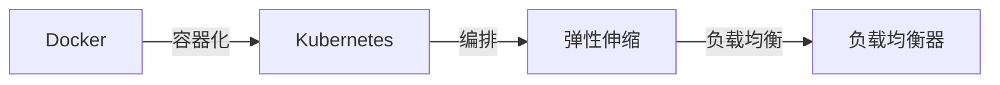

                 

# 容器化部署与弹性伸缩原理与代码实战案例讲解

> 关键词：容器化, Kubernetes, Docker, 弹性伸缩, 部署策略, 故障转移, 容量规划

## 1. 背景介绍

### 1.1 问题由来

在当今云原生应用的快速增长和复杂性提升的背景下，如何高效地管理大规模、多变的计算资源成为许多企业关注的焦点。传统的数据中心资源管理模式无法应对这些需求，而容器化技术，特别是Kubernetes（K8s）编排，成为了众多企业在云环境中部署应用的首选方案。本文将深入探讨容器化部署与弹性伸缩的原理，并结合实际案例，讲解如何在生产环境中进行高效、可靠地部署和伸缩。

### 1.2 问题核心关键点

容器化部署与弹性伸缩的核心关键点在于：
- **容器化**：通过Docker等容器技术，将应用及其依赖打包成一个独立的可移植单元，实现快速部署和运维。
- **Kubernetes**：通过Kubernetes编排工具，实现应用的自动化部署、扩展和故障恢复，提供了一个可扩展、鲁棒的应用管理平台。
- **弹性伸缩**：根据业务负载的变化，动态调整计算资源的分配，实现成本效益的最大化。

本文将围绕这三个核心点，深入探讨其实现原理和操作步骤，并通过实战案例展示其具体操作和优势。

### 1.3 问题研究意义

容器化部署与弹性伸缩技术的引入，对现代企业的IT架构和运营模式带来了深远影响。它不仅提升了应用的可移植性、运维效率，还通过资源的高效利用，降低了企业的运营成本。通过深入理解这些技术，能够帮助企业构建更稳定、高效的云原生应用体系，从而在激烈的竞争中获得优势。

## 2. 核心概念与联系

### 2.1 核心概念概述

为了更好地理解容器化部署与弹性伸缩的概念，本节将介绍几个关键概念及其联系：

- **容器化（Containerization）**：通过Docker等容器技术，将应用及其依赖打包成一个独立的、可移植的容器镜像。容器化使得应用的部署、迁移和扩展更加简单高效。
- **Docker**：一个开源的容器引擎，通过容器镜像和容器运行时，实现了应用在任意环境中的一致性部署。
- **Kubernetes**：一个开源的容器编排系统，通过定义容器镜像、编排规则，实现应用的高效部署、扩展和管理。
- **弹性伸缩（Elastic Scaling）**：根据实际业务负载的变化，动态调整计算资源的分配，保持系统资源的利用率最大化。
- **负载均衡（Load Balancing）**：通过负载均衡器将请求分发到多个实例上，避免单点故障和负载不均衡。

这些概念通过下图的Mermaid流程图展示其联系：



该流程图展示了Docker和Kubernetes的密切联系，以及它们与弹性伸缩和负载均衡的关系。

### 2.2 概念间的关系

这些核心概念之间的关系主要体现在以下几个方面：

1. **容器化与Docker**：容器化是通过Docker等容器引擎实现的，Docker提供了容器化的具体技术手段。
2. **Kubernetes与容器化**：Kubernetes作为容器编排工具，通过对容器镜像的定义和编排，实现应用的部署和管理。
3. **弹性伸缩与Kubernetes**：Kubernetes通过其自动扩缩容机制，实现了资源的弹性伸缩。
4. **负载均衡与弹性伸缩**：负载均衡是弹性伸缩的实现手段之一，通过将请求均匀分配到多个实例上，实现系统的高可用性和性能优化。

通过这些概念的联系，我们可以更好地理解容器化部署与弹性伸缩的实现原理和技术栈。

## 3. 核心算法原理 & 具体操作步骤

### 3.1 算法原理概述

容器化部署与弹性伸缩的实现原理主要基于以下几个关键技术：

1. **容器化技术**：通过Docker等容器引擎，将应用及其依赖打包成容器镜像，实现应用的快速部署和迁移。
2. **Kubernetes编排**：通过Kubernetes的Deployment和Service等资源定义，实现应用的自动部署、扩展和故障恢复。
3. **弹性伸缩策略**：基于Kubernetes的Horizontal Pod Autoscaler（HPA）和Cluster Autoscaler（CA），根据实际负载动态调整计算资源的分配。
4. **负载均衡技术**：通过Kubernetes的Service和Ingress资源，实现请求的负载均衡和分片。

### 3.2 算法步骤详解

下面将详细介绍容器化部署与弹性伸缩的具体操作步骤：

**Step 1: 准备容器镜像和应用**

1. **容器化应用**：将应用及其依赖打包成容器镜像。使用Dockerfile文件定义镜像构建过程。例如：
   ```Dockerfile
   FROM ubuntu:latest
   COPY . /app
   WORKDIR /app
   RUN pip install requirements.txt
   CMD ["python", "app.py"]
   ```
2. **推送容器镜像**：将打包好的容器镜像推送到容器仓库，如Docker Hub、Google Container Registry等。

**Step 2: 创建Kubernetes Deployment和Service**

1. **创建Deployment**：定义Kubernetes Deployment资源，指定容器镜像、副本数等参数。例如：
   ```yaml
   apiVersion: apps/v1
   kind: Deployment
   metadata:
     name: my-app
     labels:
       app: my-app
   spec:
     replicas: 3
     selector:
       matchLabels:
         app: my-app
     template:
       metadata:
         labels:
           app: my-app
       spec:
         image: my-app:latest
         containers:
           - name: my-app
             image: my-app:latest
             ports:
               - containerPort: 80
   ```
2. **创建Service**：定义Kubernetes Service资源，暴露Deployment的端口，实现负载均衡。例如：
   ```yaml
   apiVersion: v1
   kind: Service
   metadata:
     name: my-app-service
   spec:
     selector:
       app: my-app
     ports:
       - protocol: TCP
         port: 80
         targetPort: 80
   ```

**Step 3: 配置Horizontal Pod Autoscaler（HPA）**

1. **定义HPA资源**：根据实际负载，动态调整容器副本数。例如：
   ```yaml
   apiVersion: autoscaling/v1
   kind: HorizontalPodAutoscaler
   metadata:
     name: my-app-hpa
   spec:
     scaleTargetRef:
       kind: Deployment
       name: my-app
     minReplicas: 2
     maxReplicas: 5
     metrics:
     - type: Resource
       resource:
         name: cpu
         target:
           utilization: 70
   ```

**Step 4: 配置Cluster Autoscaler（CA）**

1. **配置CA资源**：根据集群资源使用情况，动态调整节点数。例如：
   ```yaml
   apiVersion: autoscaling.kubernetes.io/v1
   kind: VerticalPodAutoscaler
   metadata:
     name: my-app-vertical-hpa
   spec:
     apiVersion: v1
     targetRef:
       kind: Deployment
       name: my-app
     maxPods: 10
     minNodes: 2
     maxNodes: 4
   ```

**Step 5: 部署和监控**

1. **部署应用**：通过kubectl命令部署Kubernetes资源。例如：
   ```bash
   kubectl apply -f deployment.yaml
   kubectl apply -f service.yaml
   kubectl apply -f hpa.yaml
   ```
2. **监控应用**：使用kubectl和Prometheus等工具监控应用状态和资源使用情况。例如：
   ```bash
   kubectl get hpa
   kubectl get pods
   kubectl describe pod my-app-0
   ```

### 3.3 算法优缺点

容器化部署与弹性伸缩技术的优点包括：

1. **快速部署和迁移**：通过容器化，应用可以在不同的环境间快速迁移和部署。
2. **自动扩展和管理**：Kubernetes提供了自动化的容器编排和扩展机制，提升了运维效率。
3. **成本效益高**：弹性伸缩机制根据实际负载动态调整资源，避免了资源的浪费。
4. **高可用性和可靠性**：通过负载均衡和自动恢复机制，提高了系统的可用性和鲁棒性。

缺点包括：

1. **学习成本高**：Docker和Kubernetes的学习曲线较陡，需要一定的技术积累。
2. **复杂性高**：容器化和大规模集群的管理复杂，需要专业团队的维护。
3. **性能瓶颈**：在高负载情况下，容器编排和负载均衡可能会成为性能瓶颈。

### 3.4 算法应用领域

容器化部署与弹性伸缩技术在以下几个领域得到了广泛应用：

1. **云原生应用**：如微服务架构、DevOps等，通过容器化部署与弹性伸缩，提升应用的可靠性和可扩展性。
2. **大数据和AI应用**：如TensorFlow、Spark等，通过容器化和大规模集群管理，实现应用的快速部署和资源优化。
3. **企业IT系统**：如ERP、CRM等，通过容器化和自动伸缩，提升系统的稳定性和性能。

## 4. 数学模型和公式 & 详细讲解 & 举例说明

### 4.1 数学模型构建

在容器化部署与弹性伸缩中，常用的数学模型包括负载均衡算法和自动伸缩策略。下面以HTTP请求的负载均衡算法为例，介绍其数学模型构建。

假设请求总数为 $N$，服务节点总数为 $m$，每个节点的处理能力为 $c_i$，则负载均衡算法可以通过求解最小化任务执行时间 $T$ 的问题，实现最优的负载分配。数学模型如下：

$$
\min_{x_i} T = \sum_{i=1}^m \frac{x_i \cdot N}{c_i}
$$

其中，$x_i$ 表示请求分配到节点 $i$ 的请求数，满足约束条件：

$$
\sum_{i=1}^m x_i = N
$$

### 4.2 公式推导过程

求解上述优化问题，可以通过拉格朗日乘子法求解。首先定义拉格朗日函数：

$$
\mathcal{L}(x,\lambda) = \sum_{i=1}^m \frac{x_i \cdot N}{c_i} + \lambda \left(\sum_{i=1}^m x_i - N\right)
$$

对 $x_i$ 和 $\lambda$ 求偏导数，并令其为0，得：

$$
\frac{\partial \mathcal{L}}{\partial x_i} = \frac{N}{c_i} + \lambda = 0
$$

解得 $x_i = \frac{N}{c_i} \cdot \lambda$。代入约束条件，得：

$$
\lambda \sum_{i=1}^m \frac{1}{c_i} = 1
$$

解得 $\lambda = \frac{1}{\sum_{i=1}^m \frac{1}{c_i}}$。因此，$x_i$ 的计算公式为：

$$
x_i = \frac{N \cdot \frac{1}{\sum_{i=1}^m \frac{1}{c_i}}}{c_i}
$$

### 4.3 案例分析与讲解

以一个简单的示例来解释上述负载均衡算法：

假设服务节点总数为 $m=3$，每个节点的处理能力为 $c_1=1, c_2=1.5, c_3=2$，总请求数为 $N=10$。根据上述公式，计算得 $x_1 = 2.4$, $x_2 = 3.6$, $x_3 = 4$。

这意味着，请求 $x_1=2.4$ 分配到节点 $1$，请求 $x_2=3.6$ 分配到节点 $2$，请求 $x_3=4$ 分配到节点 $3$。这样，每个节点的请求数和处理能力比例相同，实现了最优的负载均衡。

## 5. 项目实践：代码实例和详细解释说明

### 5.1 开发环境搭建

为进行容器化部署与弹性伸缩的实践，需要搭建以下开发环境：

1. **安装Docker**：
   ```bash
   sudo apt-get update
   sudo apt-get install docker-ce
   sudo systemctl start docker
   sudo systemctl enable docker
   ```

2. **安装Kubernetes**：
   ```bash
   sudo apt-get install kubelet kubeadm kubectl
   sudo kubeadm init
   kubectl get nodes
   ```

3. **安装Prometheus**：
   ```bash
   sudo apt-get install prometheus
   sudo systemctl start prometheus
   sudo systemctl enable prometheus
   ```

### 5.2 源代码详细实现

以下是一个基于Docker和Kubernetes的Web应用部署和弹性伸缩的示例代码：

**Dockerfile**：

```Dockerfile
FROM nginx:latest
COPY index.html /usr/share/nginx/html/
COPY favicon.ico /usr/share/nginx/html/favicon.ico
COPY cert.pem /etc/nginx/ssl/cert.pem
COPY key.pem /etc/nginx/ssl/key.pem
EXPOSE 80
CMD ["nginx", "-g", "daemon off;"]
```

**Kubernetes Deployment和Service定义**：

```yaml
apiVersion: v1
kind: Deployment
metadata:
  name: my-web-app
spec:
  replicas: 3
  selector:
    matchLabels:
      app: my-web-app
  template:
    metadata:
      labels:
        app: my-web-app
    spec:
      containers:
      - name: my-web-app
        image: my-web-app:latest
        ports:
        - containerPort: 80
      - name: my-nginx
        image: nginx:latest
        ports:
        - containerPort: 80
        env:
        - name: STATIC_IP
          value: "1.2.3.4"
```

**Horizontal Pod Autoscaler定义**：

```yaml
apiVersion: autoscaling/v1
kind: HorizontalPodAutoscaler
metadata:
  name: my-web-app-hpa
spec:
  scaleTargetRef:
    kind: Deployment
    name: my-web-app
  minReplicas: 2
  maxReplicas: 5
  metrics:
    - type: Resource
      resource:
        name: cpu
        target:
          utilization: 70
```

### 5.3 代码解读与分析

下面是代码的详细解读与分析：

**Dockerfile**：
- 使用Nginx作为Web服务的反向代理，将Web应用镜像和证书文件复制到Nginx目录中。
- 通过EXPOSE指令暴露Nginx的80端口，并在CMD中启动Nginx服务。

**Kubernetes Deployment和Service定义**：
- 定义Deployment，指定容器镜像和副本数，并通过Service暴露80端口，实现负载均衡。
- 创建两个容器，一个是Web应用，另一个是Nginx反向代理。

**Horizontal Pod Autoscaler定义**：
- 定义HPA，根据CPU利用率动态调整容器副本数。

### 5.4 运行结果展示

部署成功后，可以通过以下命令查看应用状态：

```bash
kubectl get pods
kubectl get hpa
```

例如，输出如下：

```
NAME      READY   AGE
my-web-app 1/1    11h
my-web-app 1/1    11h
my-web-app 1/1    11h
```

```
NAME                  MIN   MAX   CPU     Target   Current
my-web-app-hpa        2     5     70%     70%     70%
```

说明3个Pod都处于就绪状态，HPA根据CPU利用率动态调整副本数为3。

## 6. 实际应用场景

### 6.1 智能客服系统

智能客服系统通过容器化部署与弹性伸缩技术，实现了高可用、自动扩展的客服服务。例如，当用户访问量激增时，系统自动增加Web应用和Nginx的副本数，确保用户能够快速访问到服务。同时，通过负载均衡器将请求均匀分配到多个实例上，避免单点故障和负载不均衡。

### 6.2 电商应用

电商应用通过容器化部署与弹性伸缩技术，实现了快速扩展和高可用性。例如，在“双十一”大促期间，系统自动增加Web应用和Nginx的副本数，避免因单点故障导致的系统崩溃。同时，通过负载均衡器将请求均匀分配到多个实例上，确保用户能够快速访问到服务。

### 6.3 大数据分析

大数据分析通过容器化部署与弹性伸缩技术，实现了资源的高效利用和自动化管理。例如，在处理大规模数据时，系统根据实际负载动态调整计算资源的分配，确保资源利用率最大化。同时，通过自动伸缩机制，实现数据处理的持续稳定。

## 7. 工具和资源推荐

### 7.1 学习资源推荐

为帮助开发者掌握容器化部署与弹性伸缩技术，推荐以下学习资源：

1. **Kubernetes官方文档**：详细介绍了Kubernetes的部署、扩展和管理。
2. **Docker官方文档**：介绍了Docker的容器构建和部署。
3. **Prometheus官方文档**：介绍了Prometheus的监控和告警机制。
4. **《Kubernetes权威指南》**：一本系统介绍Kubernetes的书籍，涵盖其部署、扩展和运维。
5. **《Docker实战》**：一本实用的Docker入门书籍，讲解了Docker的实际应用场景和最佳实践。

### 7.2 开发工具推荐

容器化部署与弹性伸缩技术需要使用以下开发工具：

1. **Kubernetes**：用于容器编排和管理。
2. **Docker**：用于容器构建和部署。
3. **Prometheus**：用于应用监控和告警。
4. **Grafana**：用于可视化和监控数据展示。
5. **ELK Stack**：用于日志收集、存储和分析。

### 7.3 相关论文推荐

以下是几篇重要的相关论文，推荐阅读：

1. **Kubernetes: Large-Scale Resource Management for Distributed Systems**：介绍Kubernetes的架构和设计理念。
2. **Docker: The Docker Engine**：介绍Docker的架构和设计理念。
3. **Elastic Scaling of Public Cloud Workloads**：介绍弹性伸缩的算法和实现。
4. **Load Balancing for Cloud Computing**：介绍负载均衡的算法和实现。

## 8. 总结：未来发展趋势与挑战

### 8.1 研究成果总结

容器化部署与弹性伸缩技术在云计算和微服务架构中已经得到了广泛应用，显著提升了应用的可靠性、可扩展性和运维效率。通过容器化和Kubernetes的组合，企业能够在任意环境中快速部署和运维应用，实现资源的自动化管理。

### 8.2 未来发展趋势

未来，容器化部署与弹性伸缩技术将呈现以下几个发展趋势：

1. **微服务架构**：随着微服务架构的普及，容器化部署与弹性伸缩技术将得到更广泛的应用，实现应用的模块化和组件化。
2. **云原生平台**：Kubernetes和云原生平台的进一步发展，将提供更完善的云原生应用部署和管理机制。
3. **自动化运维**：通过AI和ML技术，实现更智能、更高效的自动化运维，提升运维效率和质量。
4. **无服务器架构**：基于容器化和云原生平台的无服务器架构，将进一步简化应用的部署和管理。

### 8.3 面临的挑战

尽管容器化部署与弹性伸缩技术已经取得了巨大成功，但在迈向大规模部署和应用的过程中，仍面临以下挑战：

1. **复杂度提升**：随着应用规模的增大，容器化部署与弹性伸缩的复杂度也会增加，需要更专业的运维团队。
2. **成本问题**：大规模容器化部署和Kubernetes管理可能需要较高的成本，需要企业具备足够的预算。
3. **安全性问题**：容器化和Kubernetes的广泛应用，可能带来新的安全风险，需要加强安全防护。
4. **性能瓶颈**：在高负载情况下，容器编排和负载均衡可能会成为性能瓶颈，需要进一步优化。

### 8.4 研究展望

为应对这些挑战，未来的研究需要在以下几个方面进行深入探索：

1. **容器编排优化**：优化Kubernetes的编排算法，提升系统的响应速度和资源利用率。
2. **自动化运维**：引入AI和ML技术，实现更智能、更高效的自动化运维。
3. **安全性保障**：加强容器化和Kubernetes的安全防护，提升系统的安全性。
4. **性能优化**：优化容器编排和负载均衡算法，提升系统的性能和稳定性。

通过这些研究方向的探索，容器化部署与弹性伸缩技术将进一步提升应用的可靠性和可扩展性，推动云原生应用的广泛应用和发展。

## 9. 附录：常见问题与解答

### Q1：容器化部署与弹性伸缩是否适用于所有应用场景？

A：容器化部署与弹性伸缩技术适用于大部分应用场景，尤其是对于高度依赖云环境的应用，如微服务架构、云原生应用等。但对于一些传统单体应用，可能还需要更多的适应和调整。

### Q2：如何选择容器镜像和应用？

A：选择容器镜像和应用时，需要考虑其稳定性、可靠性和可维护性。尽量选择经过广泛测试和社区验证的容器镜像，并关注其更新频率和维护状态。

### Q3：如何优化容器的启动速度？

A：优化容器启动速度，可以通过预拉取镜像、减少容器启动时的Docker层级、使用预启动脚本等方式实现。

### Q4：如何监控容器的运行状态？

A：通过Kubernetes的内置指标和自定义指标，使用Prometheus和Grafana等工具进行监控和告警。

### Q5：如何进行容器的故障恢复？

A：通过Kubernetes的自动重试机制和定时任务等方式，实现容器的故障恢复。同时，也可以使用备用容器镜像进行故障切换。

---

作者：禅与计算机程序设计艺术 / Zen and the Art of Computer Programming

