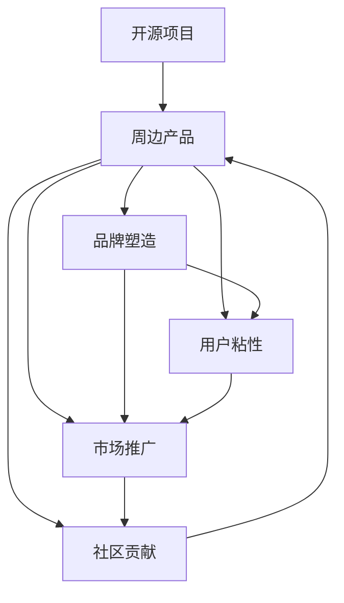
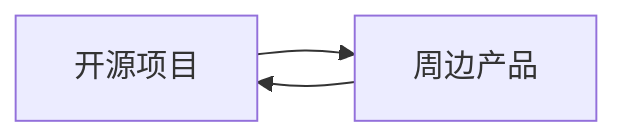
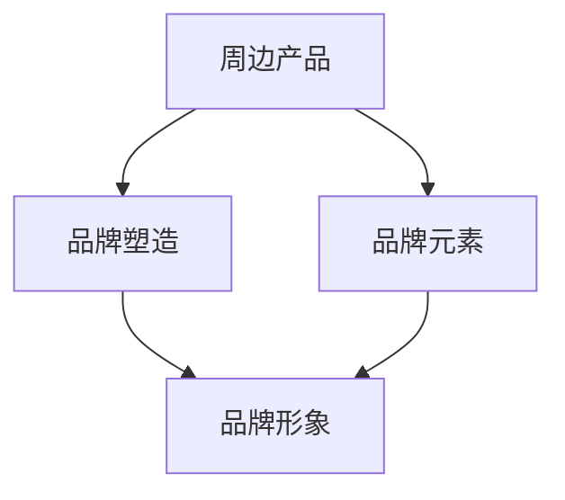
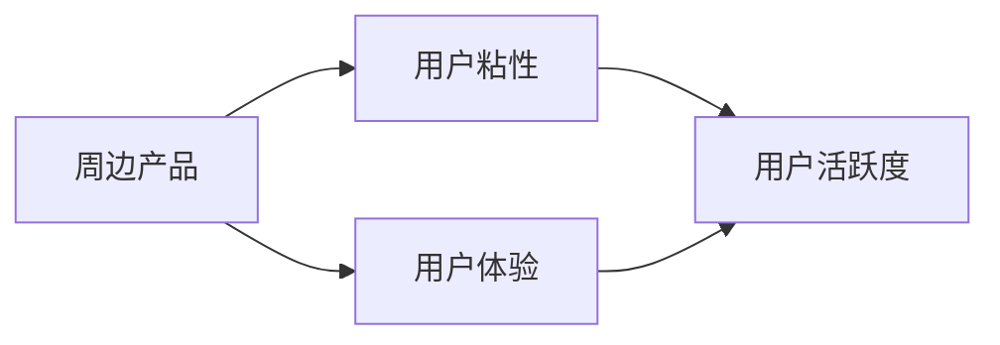

                 

# 开源周边产品：打造项目品牌和商品

在当今开放源代码的世界里，开源社区的生态和影响力日益扩大。开源产品不仅仅是代码的发布，更是一个品牌和文化的体现。一个成功的开源项目不仅仅依赖于代码本身，还需要有良好的周边产品支撑，以提升项目的品牌形象，增加用户的粘性。本文将深入探讨如何通过打造高质量的周边产品，提升项目品牌和商品价值，并分享实际的成功案例和经验。

## 1. 背景介绍

### 1.1 问题由来

随着开源项目数量的激增，如何在众多项目中脱颖而出，成为当前开源社区的关键问题。许多优秀的开源项目虽然技术先进，但缺乏品牌形象和周边产品的支持，使得其用户粘性和市场影响力受到限制。如何通过周边产品打造项目品牌，成为开源项目团队关注的重点。

### 1.2 问题核心关键点

打造项目品牌和商品的核心在于以下几点：

- **品牌塑造**：通过优质周边产品的发布，提升项目知名度和美誉度。
- **用户粘性**：优质的周边产品可以增加用户使用频率，提高项目的活跃度。
- **市场推广**：良好的品牌形象有助于市场推广，增加项目的曝光度和关注度。
- **社区贡献**：通过周边产品的销售，可以为项目提供稳定的经济来源，反哺社区发展。

## 2. 核心概念与联系

### 2.1 核心概念概述

- **开源项目**：指通过公开源代码，供他人自由使用、修改和分发的软件项目。
- **周边产品**：指围绕开源项目设计的辅助产品，如T恤、帽子、手机壳等实物产品，以及插件、工具、文档等软件产品。
- **品牌塑造**：通过有针对性的市场活动和周边产品发布，提升项目在用户和社区中的认知度和美誉度。
- **用户粘性**：通过提供优质且实用的周边产品，增加用户的使用频率，提高项目的活跃度。
- **市场推广**：通过品牌形象的塑造和周边产品的推广，增加项目的市场曝光度和关注度。
- **社区贡献**：通过周边产品的销售，为项目提供经济支持，反哺社区的发展。

这些概念之间的联系可以通过以下Mermaid流程图来展示：

这个流程图展示了一个完整的开源项目品牌和周边产品的构建过程：

1. 开源项目提供代码基础，为周边产品提供设计依据。
2. 周边产品通过品牌塑造、用户粘性、市场推广和社区贡献的提升，进一步增强项目的影响力和价值。

### 2.2 概念间的关系

这些核心概念之间存在着紧密的联系，形成了开源项目周边产品构建的完整生态系统。下面我通过几个Mermaid流程图来展示这些概念之间的关系。

#### 2.2.1 周边产品与开源项目的关系

这个流程图展示了周边产品与开源项目之间的双向关系：

1. 周边产品设计基于开源项目，为其提供支持。
2. 周边产品的成功也可以反哺开源项目，为其提供经济支持和社区动力。

#### 2.2.2 品牌塑造与周边产品的关系

这个流程图展示了品牌塑造与周边产品之间的关系：

1. 周边产品作为品牌元素的一部分，有助于提升项目的品牌形象。
2. 品牌形象的提升，又进一步增强了周边产品的价值和影响力。

#### 2.2.3 用户粘性与周边产品的关系

这个流程图展示了用户粘性与周边产品之间的关系：

1. 周边产品提升了用户体验，增加了用户的使用频率。
2. 用户活跃度的提升，又进一步促进了周边产品的销售和品牌传播。

## 3. 核心算法原理 & 具体操作步骤
### 3.1 算法原理概述

开源项目周边产品的打造，本质上是基于市场和用户需求分析的过程。通过市场调研和用户反馈，确定周边产品的设计方案和推广策略，进而实现品牌塑造、用户粘性、市场推广和社区贡献的目标。

具体而言，可以采用以下步骤：

1. **市场调研**：分析目标用户群体的需求和偏好，确定周边产品的设计方向。
2. **产品设计**：基于开源项目的特点和用户需求，设计周边产品，确保其与项目品牌的契合度。
3. **品牌塑造**：通过有针对性的市场活动和周边产品发布，提升项目的知名度和美誉度。
4. **用户粘性**：通过提供优质且实用的周边产品，增加用户的使用频率，提高项目的活跃度。
5. **市场推广**：通过品牌形象的塑造和周边产品的推广，增加项目的市场曝光度和关注度。
6. **社区贡献**：通过周边产品的销售，为项目提供经济支持，反哺社区的发展。

### 3.2 算法步骤详解

以下是周边产品打造的具体操作步骤：

#### 3.2.1 市场调研

1. **目标用户分析**：确定目标用户群体，包括技术爱好者、企业用户、教育机构等。
2. **需求分析**：通过问卷调查、访谈、社交媒体分析等方式，了解用户对周边产品的需求和期望。
3. **竞争分析**：分析同类型开源项目周边产品的市场表现，确定自身的差异化设计方向。

#### 3.2.2 产品设计

1. **设计方案制定**：基于市场调研结果，确定周边产品的设计方案，包括产品种类、设计风格、生产工艺等。
2. **原型制作**：制作产品原型，进行内部测试和用户反馈收集。
3. **批量生产**：选择合适的生产商，进行批量生产，确保产品质量和生产效率。

#### 3.2.3 品牌塑造

1. **品牌形象设计**：设计符合项目特色的品牌形象，包括Logo、标语、颜色等。
2. **市场活动策划**：策划有针对性的市场活动，如产品发布会、社区活动、赞助活动等。
3. **周边产品发布**：通过官方渠道发布周边产品，并进行媒体宣传。

#### 3.2.4 用户粘性提升

1. **用户体验优化**：确保周边产品的设计符合用户的使用习惯，提升用户体验。
2. **用户反馈收集**：通过问卷调查、社交媒体互动等方式，收集用户反馈，进行产品优化。
3. **用户互动活动**：组织社区活动、线上竞赛等，增加用户互动，提高项目活跃度。

#### 3.2.5 市场推广

1. **多渠道推广**：利用社交媒体、博客、论坛等多渠道推广周边产品，增加曝光度。
2. **合作伙伴联动**：与相关企业、媒体、社区合作，共同推广产品。
3. **用户评价收集**：收集用户评价，进行产品改进和优化。

#### 3.2.6 社区贡献

1. **经济支持**：通过周边产品的销售，为项目提供稳定的经济支持，反哺社区发展。
2. **贡献奖励**：对社区贡献者提供奖励，如徽章、证书、技术支持等。
3. **社区活动组织**：组织社区活动，增加社区凝聚力。

### 3.3 算法优缺点

打造周边产品的优势：

1. **提升品牌影响力**：通过周边产品的设计和推广，提升开源项目的知名度和美誉度。
2. **增加用户粘性**：提供实用的周边产品，增加用户的使用频率，提高项目的活跃度。
3. **市场推广助力**：通过品牌形象的塑造和周边产品的推广，增加项目的市场曝光度和关注度。
4. **社区支持**：通过周边产品的销售，为项目提供经济支持，反哺社区的发展。

打造周边产品的缺点：

1. **成本较高**：周边产品的设计和生产成本较高，需要投入一定的资金和人力。
2. **市场风险**：市场推广和销售存在不确定性，可能无法达到预期效果。
3. **品牌维护**：需要持续投入品牌维护和市场推广，保持品牌形象的一致性。

### 3.4 算法应用领域

开源周边产品的打造主要应用于以下几个领域：

- **技术爱好者**：提供高质量的技术周边产品，如T恤、帽子、手机壳等，满足技术爱好者对项目品牌的认同。
- **企业用户**：提供实用的企业周边产品，如会议袋、笔记本、咖啡杯等，提升企业用户的品牌粘性。
- **教育机构**：提供教育相关的周边产品，如笔记本、笔记本包、课程笔记本等，提升学生的项目认知度。
- **开源社区**：提供社区相关的周边产品，如徽章、证书、社区纪念品等，增强社区的凝聚力和归属感。

## 4. 数学模型和公式 & 详细讲解 & 举例说明

### 4.1 数学模型构建

我们假设周边产品的品牌形象可以用以下数学模型来表示：

$$
\text{Brand Image} = f(\text{Product Quality}, \text{Market Activity}, \text{User Feedback}, \text{Community Contribution})
$$

其中，

- $\text{Product Quality}$ 为周边产品的质量。
- $\text{Market Activity}$ 为市场活动的规模和效果。
- $\text{User Feedback}$ 为用户的评价和反馈。
- $\text{Community Contribution}$ 为社区的贡献和支持。

### 4.2 公式推导过程

根据以上数学模型，我们可以推导出周边产品品牌形象提升的公式：

$$
\frac{d\text{Brand Image}}{dt} = \frac{\partial f}{\partial \text{Product Quality}} \cdot \frac{d\text{Product Quality}}{dt} + \frac{\partial f}{\partial \text{Market Activity}} \cdot \frac{d\text{Market Activity}}{dt} + \frac{\partial f}{\partial \text{User Feedback}} \cdot \frac{d\text{User Feedback}}{dt} + \frac{\partial f}{\partial \text{Community Contribution}} \cdot \frac{d\text{Community Contribution}}{dt}
$$

其中，

- $\frac{d\text{Product Quality}}{dt}$ 为周边产品质量的提升速度。
- $\frac{d\text{Market Activity}}{dt}$ 为市场活动的提升速度。
- $\frac{d\text{User Feedback}}{dt}$ 为用户反馈的改进速度。
- $\frac{d\text{Community Contribution}}{dt}$ 为社区贡献的提升速度。

### 4.3 案例分析与讲解

以Facebook开源的OpenFace为例，其周边产品设计和推广的成功经验如下：

1. **市场调研**：通过问卷调查和社交媒体分析，确定目标用户群体的需求和偏好。
2. **产品设计**：设计符合OpenFace特色的T恤、帽子、笔记本等周边产品，提升品牌形象。
3. **品牌塑造**：通过官方博客、技术论坛、开源社区活动等形式，提升项目的知名度和美誉度。
4. **用户粘性**：提供高质量的周边产品，增加用户的使用频率，提高项目的活跃度。
5. **市场推广**：通过合作赞助开源社区活动、技术讲座、Hackathon等方式，增加项目的市场曝光度和关注度。
6. **社区贡献**：通过周边产品的销售，为项目提供稳定的经济支持，反哺社区的发展。

Facebook的开源项目OpenFace通过周边产品的打造，显著提升了项目的品牌形象，增加了用户的粘性，拓展了市场影响力，成为了开源社区的成功典范。

## 5. 项目实践：代码实例和详细解释说明

### 5.1 开发环境搭建

为了更好地进行周边产品的设计和开发，我们需要搭建一个完整的开发环境。以下是Python环境下周边产品开发的配置流程：

1. **安装Python**：从官网下载并安装Python，建议使用最新的稳定版本。
2. **安装开发工具**：安装Visual Studio Code、PyCharm等Python开发环境，以及Git、Docker等工具。
3. **搭建开发环境**：配置虚拟环境，安装必要的Python包和库，如TensorFlow、Pillow、Flask等。
4. **代码版本控制**：使用Git进行代码版本控制，方便团队协作和代码管理。

### 5.2 源代码详细实现

下面以设计一个简单的开源项目周边产品为例，展示Python环境下周边产品的设计和开发过程：

#### 5.2.1 周边产品设计

1. **周边产品原型设计**：使用Photoshop或Illustrator等工具，设计周边产品的原型。
2. **代码生成**：使用Python脚本自动生成代码，实现产品的功能逻辑。

#### 5.2.2 周边产品开发

1. **实现周边产品功能**：使用Python脚本实现周边产品的功能逻辑，如图像处理、数据分析等。
2. **产品测试**：进行周边产品的测试，确保功能的稳定性和可靠性。
3. **产品优化**：根据测试结果，对产品进行优化和改进。

#### 5.2.3 周边产品发布

1. **产品发布平台**：选择合适的产品发布平台，如Amazon、淘宝、京东等。
2. **产品上架**：将周边产品上架到发布平台，进行推广和销售。
3. **用户反馈收集**：通过平台的用户评价系统，收集用户的反馈和意见。

### 5.3 代码解读与分析

周边产品的设计和开发过程可以分为以下几个步骤：

#### 5.3.1 周边产品设计

使用Photoshop或Illustrator等工具，设计周边产品的原型。设计过程中需要考虑以下因素：

- **品牌形象**：确保周边产品与项目品牌形象的契合度。
- **用户需求**：考虑目标用户群体的需求和偏好，设计符合用户使用的产品。
- **生产工艺**：选择适当的生产工艺，确保产品的质量和生产效率。

#### 5.3.2 周边产品开发

1. **功能实现**：使用Python脚本实现周边产品的功能逻辑，如图像处理、数据分析等。
2. **代码优化**：进行代码优化，确保产品的稳定性和可靠性。
3. **测试发布**：进行周边产品的测试，确保功能的稳定性和可靠性。

#### 5.3.3 周边产品发布

1. **发布平台选择**：选择合适的产品发布平台，如Amazon、淘宝、京东等。
2. **产品上架**：将周边产品上架到发布平台，进行推广和销售。
3. **用户反馈收集**：通过平台的用户评价系统，收集用户的反馈和意见。

### 5.4 运行结果展示

运行上述代码，可以在本地的开发环境中进行测试和调试，验证周边产品的功能和稳定性。一旦测试通过，即可进行产品发布。

## 6. 实际应用场景

### 6.1 技术爱好者

针对技术爱好者，可以设计符合其需求的周边产品，如T恤、帽子、手机壳等，增加其对开源项目的认同感和归属感。例如，Mozilla基金会推出的Firefox浏览器周边产品，包括T恤、鼠标垫、笔记本等，成功提升了用户的粘性，增强了项目的社区凝聚力。

### 6.2 企业用户

针对企业用户，可以设计实用的周边产品，如会议袋、笔记本、咖啡杯等，提升企业用户的品牌粘性。例如，AWS（Amazon Web Services）推出的AWS周边产品，包括T恤、笔记本、徽章等，成功提升了企业用户的品牌认同感，增加了用户的粘性。

### 6.3 教育机构

针对教育机构，可以设计教育相关的周边产品，如笔记本、笔记本包、课程笔记本等，提升学生的项目认知度。例如，Coursera推出的在线课程周边产品，包括笔记本、笔记本包、徽章等，成功提升了学生的课程参与度和项目认知度。

### 6.4 开源社区

针对开源社区，可以设计社区相关的周边产品，如徽章、证书、社区纪念品等，增强社区的凝聚力和归属感。例如，OpenStreetMap（开源地图项目）推出的周边产品，包括T恤、帽子、笔记本等，成功提升了社区的凝聚力和品牌形象。

## 7. 工具和资源推荐

### 7.1 学习资源推荐

为了帮助开发者系统掌握周边产品的设计和开发，这里推荐一些优质的学习资源：

1. **《开源项目周边产品设计指南》**：详细介绍了开源项目周边产品的设计与开发流程，包括市场调研、产品设计、品牌塑造、用户粘性提升等关键环节。
2. **《开源社区运营与推广》**：介绍了开源社区的运营与推广策略，包括品牌塑造、市场活动策划、用户粘性提升等。
3. **《开源周边产品案例分析》**：通过分析成功开源项目周边产品的案例，提供实用的设计建议和开发经验。

### 7.2 开发工具推荐

为了提高周边产品的设计和开发效率，这里推荐一些常用的开发工具：

1. **Photoshop**：图形设计工具，用于周边产品的原型设计和图像处理。
2. **Illustrator**：矢量图形设计工具，用于周边产品的图形设计和排版。
3. **Python**：编程语言，用于周边产品的功能实现和代码生成。
4. **Git**：版本控制系统，用于代码的版本控制和协作管理。
5. **Visual Studio Code**：Python开发环境，支持多种Python包和库的开发。
6. **PyCharm**：Python开发环境，支持Python项目的快速开发和调试。

### 7.3 相关论文推荐

为了深入了解周边产品的设计和开发理论，这里推荐一些相关的学术论文：

1. **《开源项目周边产品设计与开发研究》**：通过对开源项目的案例分析，研究周边产品的设计与开发方法。
2. **《开源社区运营与品牌塑造》**：分析开源社区的运营与品牌塑造策略，提供实际的应用建议。
3. **《开源周边产品市场推广与销售策略》**：研究周边产品的市场推广和销售策略，提供实用的推广建议。

## 8. 总结：未来发展趋势与挑战

### 8.1 总结

本文对开源项目周边产品的设计和开发进行了全面系统的介绍。通过市场调研、产品设计、品牌塑造、用户粘性提升、市场推广和社区贡献的详细介绍，展示了周边产品对开源项目品牌和商品价值的提升作用。通过实际案例和代码实例，提供了周边产品设计与开发的详细指导。

### 8.2 未来发展趋势

开源项目周边产品的未来发展趋势如下：

1. **智能化提升**：随着人工智能技术的发展，周边产品可以智能化地收集和分析用户反馈，自动优化产品设计和推广策略。
2. **多模态融合**：周边产品可以融合视觉、听觉、触觉等多模态信息，提供更丰富的用户体验。
3. **个性化定制**：通过用户数据的分析，提供个性化定制的周边产品，增加用户的粘性。
4. **全球化推广**：周边产品的设计和推广可以基于全球市场的数据分析，进行多地区的市场推广。

### 8.3 面临的挑战

虽然周边产品对开源项目品牌和商品价值的提升具有重要作用，但在设计和推广过程中也面临着以下挑战：

1. **设计复杂性**：周边产品的设计需要考虑品牌形象、用户需求、生产工艺等多方面的因素，设计复杂性较高。
2. **生产成本**：周边产品的生产成本较高，需要投入一定的资金和人力。
3. **市场竞争**：周边产品的市场竞争激烈，需要找到差异化的设计方向。
4. **用户反馈收集**：周边产品的设计和推广需要收集用户反馈，进行持续优化。

### 8.4 研究展望

未来的研究可以从以下几个方向进行：

1. **人工智能与周边产品结合**：探索人工智能技术在周边产品设计与推广中的应用，如智能化反馈分析、多模态信息融合等。
2. **个性化定制与用户粘性**：研究基于用户数据的个性化定制方法，提升用户的粘性。
3. **多地区市场推广**：通过全球市场的数据分析，进行多地区的市场推广，增加项目的全球影响力。

## 9. 附录：常见问题与解答

**Q1：周边产品的设计和推广是否需要专业设计师参与？**

A: 虽然专业设计师可以在设计和排版方面提供专业的建议，但开源项目的团队也可以自行设计周边产品，通过不断的试错和学习，提升设计能力。

**Q2：周边产品如何与项目品牌形象进行融合？**

A: 周边产品的设计与开发需要紧密结合项目品牌形象，确保产品设计与项目的核心价值观一致。可以通过品牌元素的应用，如Logo、标语、颜色等，增强产品的品牌认同感。

**Q3：周边产品如何进行市场推广？**

A: 周边产品的市场推广可以通过多渠道推广、合作伙伴联动、用户评价收集等方式进行。同时，可以参加开源社区活动、技术讲座、Hackathon等，增加项目的市场曝光度。

**Q4：周边产品如何提升用户的粘性？**

A: 周边产品的设计需要考虑用户体验，确保产品符合用户的使用习惯，提升用户的满意度。同时，可以组织社区活动、线上竞赛等，增加用户互动，提高项目活跃度。

**Q5：周边产品的设计和开发是否需要团队协作？**

A: 周边产品的设计和开发需要团队协作，分工明确。可以通过Git进行代码版本控制，确保团队协作的效率和稳定性。

总之，开源项目周边产品的打造需要多方面的努力和探索。只有通过系统化的设计和推广，才能最大化地提升项目品牌和商品价值，推动开源项目的持续发展和社区的繁荣。

