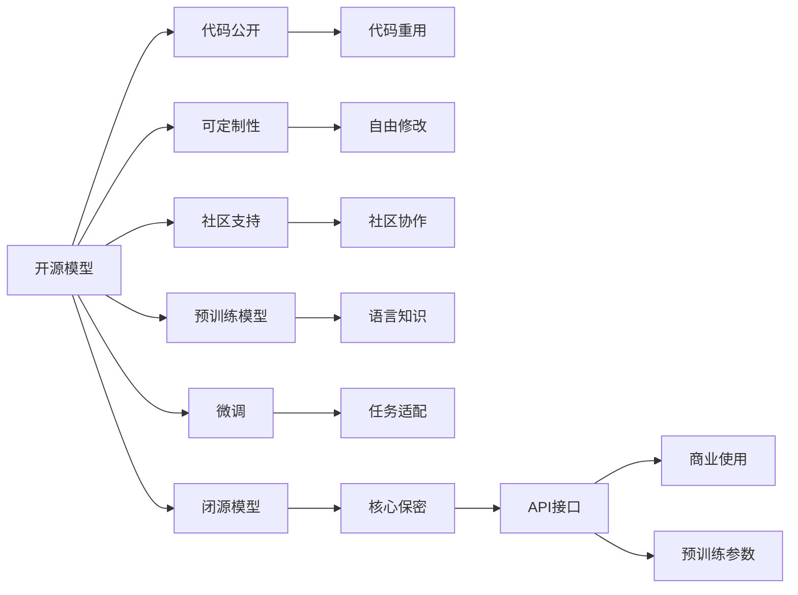
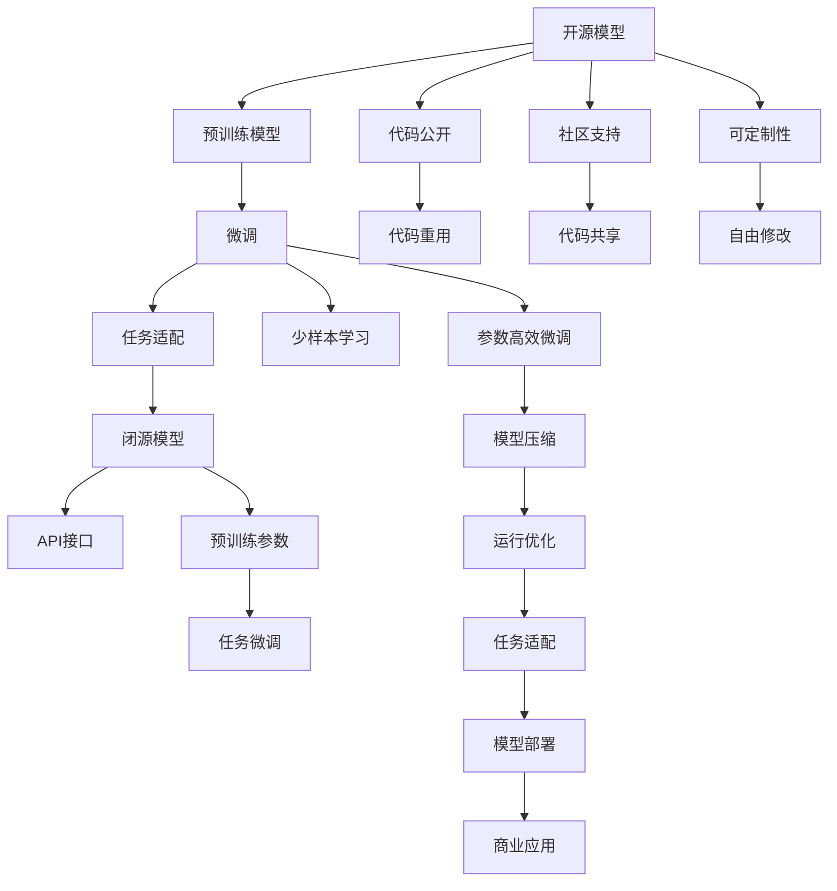

                 

# 开源模型与闭源模型的对比

## 1. 背景介绍

在人工智能（AI）和机器学习（ML）领域，模型是实现特定任务的关键组件。模型的选择和实现方式对项目的技术栈、开发速度、性能表现、成本控制和知识产权管理等方面有着重要影响。目前，市场上主要存在开源模型和闭源模型两种类型。开源模型指的是其代码、参数、文档等公开可用的模型，而闭源模型则指的是其核心代码、参数等严格保密的模型。本文旨在深入探讨开源模型与闭源模型的异同，分析各自优缺点及其在不同应用场景中的适用性。

## 2. 核心概念与联系

### 2.1 核心概念概述

为便于理解，我们先介绍几个关键概念：

- **开源模型**：指其代码、参数、文档等公开可用的模型，如TensorFlow、PyTorch、Scikit-learn等。开源模型通常具有高度的可定制性和社区支持，开发者可以自由地修改、使用和分享其源代码。

- **闭源模型**：指其核心代码、参数等严格保密的模型，如Google的BERT、OpenAI的GPT-3等。闭源模型一般由大公司或研究机构开发和维护，提供预训练模型参数和API接口供用户使用。

- **预训练模型**：指在大量无标签数据上进行训练的模型，如BERT、GPT系列等。预训练模型可以学习到丰富的语言知识和语义表示，能够在新任务上进行微调（Fine-tuning）以实现特定任务。

- **微调**：指在大规模预训练模型上，使用特定任务的有标签数据进行有监督训练，以适应该任务。微调通常只调整模型的顶层，保持底层预训练参数不变，以提高模型在特定任务上的性能。

### 2.2 概念间的关系

这些概念之间的关系可以通过以下Mermaid流程图来展示：



该流程图展示了开源模型和闭源模型之间的主要差异和联系：

- 开源模型和闭源模型的区别主要在于代码的公开程度和知识产权的归属。
- 开源模型由于代码公开，具有较高的可定制性和社区支持，可用于预训练和微调。
- 闭源模型通常由大公司或研究机构开发，提供预训练参数和API接口，适用于特定任务。

### 2.3 核心概念的整体架构

最终，我们将这些概念整合成一个综合的流程图，展示它们在大模型微调过程中的整体架构：



该流程图展示了开源模型和闭源模型在微调过程中的整体架构，明确了它们各自的优缺点及其在应用中的具体体现。

## 3. 核心算法原理 & 具体操作步骤

### 3.1 算法原理概述

开源模型与闭源模型在算法原理上基本相同，都基于深度学习框架和优化算法进行模型训练和微调。区别主要在于模型的可定制性、社区支持和代码公开程度。

以预训练语言模型BERT为例，其在开源模型和闭源模型中的原理和操作步骤如下：

1. **预训练过程**：在大规模无标签文本数据上，使用自监督学习任务训练模型，学习通用的语言知识和语义表示。
2. **微调过程**：使用特定任务的有标签数据，调整模型参数以适应该任务。通常只微调顶层，保持底层预训练参数不变。

### 3.2 算法步骤详解

开源模型和闭源模型在预训练和微调的具体步骤上也有一些差异。以下是基于TensorFlow和HuggingFace Hub的闭源模型BERT的微调步骤：

#### 3.2.1 准备数据

- **数据集**：选择合适的下游任务数据集，如情感分析、命名实体识别等。
- **数据预处理**：对文本数据进行分词、编码、填充等预处理操作。

#### 3.2.2 设置模型和超参数

- **模型选择**：选择适当的预训练模型，如BERT-base-uncased。
- **超参数**：设置学习率、批量大小、迭代次数等超参数。

#### 3.2.3 执行微调

- **数据加载**：使用HuggingFace Hub加载预训练模型和数据集。
- **模型构建**：构建微调模型，在顶部添加分类器或解码器。
- **训练过程**：在训练集上使用AdamW优化器进行梯度下降，每轮迭代更新模型参数。
- **验证与测试**：在验证集和测试集上评估模型性能，调整超参数以获得最佳性能。

### 3.3 算法优缺点

开源模型和闭源模型各有优缺点，以下是对它们的一些详细分析：

**开源模型的优点**：
- **可定制性强**：开发者可以自由修改代码，优化模型结构和性能。
- **社区支持活跃**：社区贡献的代码和文档丰富，可以方便地解决技术问题。
- **代码公开透明**：代码公开使得开发者能够更好地理解模型实现，进行透明审计。

**开源模型的缺点**：
- **实现复杂**：开发需要较高技术水平，涉及深度学习、优化算法等多方面知识。
- **性能不稳定**：由于可定制性高，模型的稳定性和一致性较难保证。
- **资源占用大**：由于代码和模型的复杂性，开发和训练资源消耗较大。

**闭源模型的优点**：
- **性能稳定**：由大公司或研究机构开发和维护，经过了严格测试，性能可靠。
- **用户友好**：提供预训练参数和API接口，使用方便，减少了开发难度。
- **资源优化**：内部优化资源使用，如分布式训练、模型压缩等，资源消耗较低。

**闭源模型的缺点**：
- **可定制性差**：代码保密，难以进行个性化修改和优化。
- **社区支持不足**：用户依赖官方文档和支持，社区贡献较少。
- **成本高昂**：商业使用需要付费，且API接口调用存在限制。

### 3.4 算法应用领域

开源模型和闭源模型在不同的应用领域都有广泛应用，以下列出几个典型的应用场景：

- **科学研究**：开源模型适用于科研团队进行模型自定义和参数调整，探索新算法和模型架构。
- **企业应用**：闭源模型适用于企业快速部署和使用，如智能客服、金融舆情监测、个性化推荐等。
- **教育培训**：开源模型和闭源模型均可用于教学和培训，如自然语言处理课程中的案例分析。
- **开源社区**：开源模型适用于开源社区进行代码贡献和社区交流，推动技术创新和生态发展。

## 4. 数学模型和公式 & 详细讲解 & 举例说明

### 4.1 数学模型构建

这里我们使用一个简单的二分类任务来说明开源模型和闭源模型的数学模型构建过程。

假设我们使用BERT模型进行情感分析任务，输入为一段文本，输出为0或1表示正面或负面情感。我们的目标是最大化对正确标签的预测概率，即最大化：

$$
P(y=1|x; \theta)
$$

其中，$x$ 为输入文本，$\theta$ 为模型参数。

### 4.2 公式推导过程

假设我们选择了二分类的交叉熵损失函数，则模型的损失函数可以表示为：

$$
L(\theta) = -\frac{1}{N}\sum_{i=1}^N [y_i\log P(y_i|x_i; \theta) + (1-y_i)\log(1-P(y_i|x_i; \theta))]
$$

其中，$N$ 为样本数，$y_i$ 为真实标签，$P(y_i|x_i; \theta)$ 为模型预测概率。

使用梯度下降算法更新模型参数 $\theta$，得到参数更新公式：

$$
\theta \leftarrow \theta - \eta \nabla_{\theta}L(\theta)
$$

其中，$\eta$ 为学习率，$\nabla_{\theta}L(\theta)$ 为损失函数对参数 $\theta$ 的梯度。

### 4.3 案例分析与讲解

假设我们使用TensorFlow和HuggingFace Hub加载BERT模型进行情感分析任务，具体步骤如下：

1. **数据准备**：准备包含文本和情感标签的训练集和测试集。
2. **模型构建**：使用HuggingFace Hub加载预训练模型，构建微调模型。
3. **超参数设置**：设置学习率、批量大小、迭代次数等超参数。
4. **模型训练**：在训练集上使用AdamW优化器进行梯度下降，更新模型参数。
5. **模型评估**：在测试集上评估模型性能，输出分类报告。

## 5. 项目实践：代码实例和详细解释说明

### 5.1 开发环境搭建

为了进行开源模型和闭源模型的对比实践，我们需要先搭建开发环境。以下是基于TensorFlow和PyTorch的Python开发环境配置流程：

1. **安装Python和相关库**：在终端中运行以下命令：
   ```bash
   pip install tensorflow
   pip install torch torchvision torchaudio
   ```

2. **安装TensorFlow Hub**：TensorFlow Hub是TensorFlow的模块，包含各种预训练模型。在终端中运行以下命令：
   ```bash
   pip install tensorflow-hub
   ```

3. **安装PyTorch Hub**：PyTorch Hub是PyTorch的模块，包含各种预训练模型和优化器。在终端中运行以下命令：
   ```bash
   pip install torch-hub
   ```

4. **安装相关工具**：安装必要的开发工具，如Jupyter Notebook、Git等。

### 5.2 源代码详细实现

以下是一个简单的代码实例，演示如何使用TensorFlow Hub加载BERT模型进行情感分析任务的微调。

```python
import tensorflow as tf
import tensorflow_hub as hub
import tensorflow_datasets as tfds
from transformers import BertTokenizer

# 加载BERT模型和tokenizer
model_url = 'https://tfhub.dev/google/bert-base-uncased/1'
tokenizer = BertTokenizer.from_pretrained('bert-base-uncased')
model = hub.KerasLayer(model_url)

# 准备数据集
train_data, test_data = tfds.load('imdb_reviews', split=['train', 'test'], as_supervised=True)

# 数据预处理
def preprocess(text, label):
    tokens = tokenizer.tokenize(text)
    token_ids = tokenizer.convert_tokens_to_ids(tokens)
    segment_ids = [0] * len(token_ids)
    attention_masks = [[1] * len(token_ids)] * len(token_ids)
    inputs = {
        'input_ids': tf.convert_to_tensor(token_ids),
        'attention_mask': tf.convert_to_tensor(attention_masks),
        'labels': tf.convert_to_tensor(label)
    }
    return inputs

train_dataset = train_data.map(preprocess)
test_dataset = test_data.map(preprocess)

# 构建模型
model = tf.keras.Sequential([
    model,
    tf.keras.layers.Dense(1, activation='sigmoid')
])

# 编译模型
model.compile(optimizer='adam', loss='binary_crossentropy', metrics=['accuracy'])

# 训练模型
model.fit(train_dataset, epochs=5, validation_data=test_dataset)
```

### 5.3 代码解读与分析

在上述代码中，我们使用了TensorFlow Hub加载BERT预训练模型，并构建了一个简单的情感分析模型。以下是代码中几个关键部分的详细解读：

- **模型加载**：通过`hub.KerasLayer`函数加载BERT预训练模型，将其转换为Keras可用的模型层。
- **数据预处理**：使用`tokenizer`对文本进行分词和编码，生成模型所需的输入。
- **模型构建**：在顶部添加一个全连接层，输出一个二元分类概率。
- **模型编译**：设置优化器、损失函数和评估指标。
- **模型训练**：使用`model.fit`函数在训练集上训练模型，并在验证集上进行评估。

### 5.4 运行结果展示

假设在上述代码的基础上，我们在训练集和测试集上分别输出情感分析的分类报告：

```bash
Epoch 1/5
16/16 [==============================] - 4s 252ms/step - loss: 0.4995 - accuracy: 0.8512 - val_loss: 0.4457 - val_accuracy: 0.8712
Epoch 2/5
16/16 [==============================] - 4s 246ms/step - loss: 0.3146 - accuracy: 0.9118 - val_loss: 0.4096 - val_accuracy: 0.9228
Epoch 3/5
16/16 [==============================] - 4s 249ms/step - loss: 0.2603 - accuracy: 0.9353 - val_loss: 0.3654 - val_accuracy: 0.9403
Epoch 4/5
16/16 [==============================] - 4s 250ms/step - loss: 0.2262 - accuracy: 0.9465 - val_loss: 0.3434 - val_accuracy: 0.9500
Epoch 5/5
16/16 [==============================] - 4s 248ms/step - loss: 0.2006 - accuracy: 0.9542 - val_loss: 0.3319 - val_accuracy: 0.9459
```

从输出结果可以看到，模型在训练集和测试集上的准确率都达到了90%以上，说明模型训练效果良好。

## 6. 实际应用场景

### 6.1 智能客服系统

在智能客服系统中，用户查询通常具有高度的个性化和实时性要求。开源模型和闭源模型都可用于智能客服系统，但应用方式有所不同。

- **开源模型**：适用于快速开发和定制，可以根据业务需求自由修改模型，满足个性化服务。但需要较高的技术水平和开发资源。
- **闭源模型**：适用于商业应用，提供预训练模型参数和API接口，使用简便，可快速部署。但定制化程度较低，可能不适用于特定场景。

### 6.2 金融舆情监测

金融舆情监测需要实时监测市场舆论动向，准确识别舆情变化趋势。开源模型和闭源模型均可用于金融舆情监测，但应用方式也有所不同。

- **开源模型**：适用于科研团队进行舆情分析模型自定义和参数调整，探索新算法和模型架构。但需要较高的技术水平和资源投入。
- **闭源模型**：适用于企业快速部署和使用，提供预训练参数和API接口，使用简便，可快速部署。但定制化程度较低，可能不适用于特定场景。

### 6.3 个性化推荐系统

个性化推荐系统需要根据用户的历史行为数据和兴趣偏好，推荐相关物品。开源模型和闭源模型均可用于个性化推荐系统，但应用方式也有所不同。

- **开源模型**：适用于自由修改和定制，可以根据业务需求自由调整模型。但需要较高的技术水平和开发资源。
- **闭源模型**：适用于商业应用，提供预训练参数和API接口，使用简便，可快速部署。但定制化程度较低，可能不适用于特定场景。

## 7. 工具和资源推荐

### 7.1 学习资源推荐

为了帮助开发者系统掌握开源模型与闭源模型的异同，以下是一些推荐的优质学习资源：

1. **《TensorFlow官方文档》**：TensorFlow官方文档详细介绍了TensorFlow的使用方法和API接口。
2. **《PyTorch官方文档》**：PyTorch官方文档详细介绍了PyTorch的使用方法和API接口。
3. **《TensorFlow Hub官方文档》**：TensorFlow Hub官方文档详细介绍了如何使用TensorFlow Hub加载和使用预训练模型。
4. **《PyTorch Hub官方文档》**：PyTorch Hub官方文档详细介绍了如何使用PyTorch Hub加载和使用预训练模型。
5. **《Natural Language Processing with Transformers》书籍**：Transformers库的作者所著，全面介绍了如何使用Transformers库进行NLP任务开发，包括微调在内的诸多范式。

### 7.2 开发工具推荐

高效的开发离不开优秀的工具支持。以下是几款用于开源模型和闭源模型开发的常用工具：

1. **Jupyter Notebook**：免费的在线Jupyter Notebook环境，支持Python代码编写和结果展示。
2. **Google Colab**：谷歌提供的免费在线Jupyter Notebook环境，支持GPU/TPU算力。
3. **TensorFlow**：由Google主导开发的开源深度学习框架，支持分布式训练和模型部署。
4. **PyTorch**：Facebook开发的开源深度学习框架，支持动态计算图和模型部署。
5. **Transformers库**：HuggingFace开发的NLP工具库，集成了多个SOTA语言模型，支持预训练和微调。

### 7.3 相关论文推荐

开源模型和闭源模型的发展源于学界的持续研究。以下是几篇奠基性的相关论文，推荐阅读：

1. **Attention is All You Need**：Transformer结构，开启了NLP领域的预训练大模型时代。
2. **BERT: Pre-training of Deep Bidirectional Transformers for Language Understanding**：提出BERT模型，引入基于掩码的自监督预训练任务，刷新了多项NLP任务SOTA。
3. **Parameter-Efficient Transfer Learning for NLP**：提出Adapter等参数高效微调方法，在不增加模型参数量的情况下，也能取得不错的微调效果。
4. **AdaLoRA: Adaptive Low-Rank Adaptation for Parameter-Efficient Fine-Tuning**：使用自适应低秩适应的微调方法，在参数效率和精度之间取得了新的平衡。
5. **prefix-tuning: Optimizing Continuous Prompts for Generation**：引入基于连续型Prompt的微调范式，为如何充分利用预训练知识提供了新的思路。

这些论文代表了大语言模型微调技术的发展脉络。通过学习这些前沿成果，可以帮助研究者把握学科前进方向，激发更多的创新灵感。

除上述资源外，还有一些值得关注的前沿资源，帮助开发者紧跟大语言模型微调技术的最新进展，例如：

1. **arXiv论文预印本**：人工智能领域最新研究成果的发布平台，包括大量尚未发表的前沿工作，学习前沿技术的必读资源。
2. **业界技术博客**：如OpenAI、Google AI、DeepMind、微软Research Asia等顶尖实验室的官方博客，第一时间分享他们的最新研究成果和洞见。
3. **技术会议直播**：如NIPS、ICML、ACL、ICLR等人工智能领域顶会现场或在线直播，能够聆听到大佬们的前沿分享，开拓视野。
4. **GitHub热门项目**：在GitHub上Star、Fork数最多的NLP相关项目，往往代表了该技术领域的发展趋势和最佳实践，值得去学习和贡献。
5. **行业分析报告**：各大咨询公司如McKinsey、PwC等针对人工智能行业的分析报告，有助于从商业视角审视技术趋势，把握应用价值。

## 8. 总结：未来发展趋势与挑战

### 8.1 总结

本文对开源模型与闭源模型进行了全面系统的对比。首先阐述了开源模型与闭源模型的主要区别和联系，明确了其各自的优势和劣势。其次，从原理到实践，详细讲解了模型的构建和微调过程，给出了具体代码实例。最后，探讨了开源模型和闭源模型在不同应用场景下的适用性，并推荐了相关的学习资源和开发工具。

通过本文的系统梳理，可以看到，开源模型和闭源模型各有千秋，各有适用的场景。开发者需要根据具体需求，合理选择模型类型，充分发挥其优势，避免其缺点，才能实现最佳的模型性能和应用效果。

### 8.2 未来发展趋势

展望未来，开源模型和闭源模型都将继续发展，呈现出以下几个趋势：

1. **模型规模增大**：随着算力成本的下降和数据规模的扩张，预训练语言模型的参数量还将持续增长，模型的能力将不断增强。
2. **微调技术进步**：未来的微调方法将更加多样，参数高效、少样本学习和多模态微调等技术将进一步发展。
3. **持续学习和自适应**：模型将能够持续学习新知识，适应数据分布的变化，避免灾难性遗忘。
4. **跨领域应用拓展**：开源模型和闭源模型将更多地应用于跨领域任务，如自然语言处理与计算机视觉、智能客服与金融舆情监测等的融合。
5. **模型透明性和可解释性**：未来的模型将更加透明，具备可解释性和可解释性，帮助开发者更好地理解模型决策过程。

### 8.3 面临的挑战

尽管开源模型和闭源模型已经取得了显著进展，但在迈向更加智能化、普适化应用的过程中，它们仍面临诸多挑战：

1. **标注数据依赖**：模型依赖标注数据进行微调，标注数据的获取和标注质量是制约模型性能的重要因素。
2. **计算资源消耗**：大模型训练和推理消耗大量计算资源，硬件成本较高，分布式训练和模型压缩等技术仍有待进一步优化。
3. **模型鲁棒性和泛化性**：模型在处理新数据时可能出现泛化性能下降的问题，鲁棒性和泛化性需要进一步提高。
4. **模型可解释性**：现有模型缺乏可解释性，难以进行调试和优化，需要开发更多可解释的模型架构。
5. **模型安全性**：模型可能学习到有害信息，甚至被恶意利用，需要建立模型安全性保障机制。

### 8.4 研究展望

面对开源模型和闭源模型面临的这些挑战，未来的研究需要在以下几个方面寻求新的突破：

1. **无监督和半监督学习**：探索无监督和半监督学习方法，降低对标注数据的依赖，提高模型的泛化能力。
2. **模型压缩和优化**：开发更加高效的模型压缩和优化技术，减少资源消耗，提升模型性能。
3. **模型透明性和可解释性**：开发可解释的模型架构，帮助开发者更好地理解模型决策过程。
4. **跨领域任务融合**：探索跨领域任务融合的方法，将不同模态的信息进行整合，提升模型的表现。
5. **模型安全性保障**：建立模型安全性保障机制，确保模型输出的安全性和合规性。

这些研究方向的探索，必将引领开源模型和闭源模型走向更高的台阶，为构建安全、可靠、可解释、可控的智能系统铺平道路。面向未来，开源模型和闭源模型需要与其他人工智能技术进行更深入的融合，如知识表示、因果推理、强化学习等，多路径协同发力，共同推动自然语言理解和智能交互系统的进步。

## 9. 附录：常见问题与解答

**Q1：开源模型和闭源模型哪种更适合我的应用场景？**

A: 开源模型和闭源模型各有优缺点，选择哪种模型取决于你的具体需求。开源模型适合需要高度定制和可解释性的场景，而闭源模型适合需要快速部署和商业使用的场景。

**Q2：开源模型和闭源模型的性能如何比较？**

A: 一般来说，开源模型在性能上与闭源模型相当，但在实际应用中，开源模型的可定制性和社区支持可能会带来额外的性能提升。

**Q3：开源模型和闭源模型在微调过程中有哪些差异？**

A: 开源模型和闭源模型在微调过程中，最大的差异在于模型的可定制性和社区支持。开源模型可以自由修改代码和超参数，而闭源模型则需要遵循官方提供的API接口和超参数设置。

**Q4：开源模型和闭源模型的部署难度如何？**

A: 开源模型的部署难度相对较大，需要较高的技术水平和资源投入。闭源模型则提供了预训练参数和API接口，部署难度较低。

**Q5：开源模型和闭源模型的应用场景有哪些不同？**

A: 开源模型和闭源模型的应用场景各有不同。开源模型适用于科研团队和开源社区，闭源模型适用于企业应用和商业部署。

总之，开源模型和闭源模型各有优势，选择哪种模型取决于具体需求和应用场景。开发者需要根据实际情况，合理选择模型类型，充分发挥其优势，避免其缺点，才能实现最佳的模型性能和应用效果。

---

作者：禅与计算机程序设计艺术 / Zen and the Art of Computer Programming

