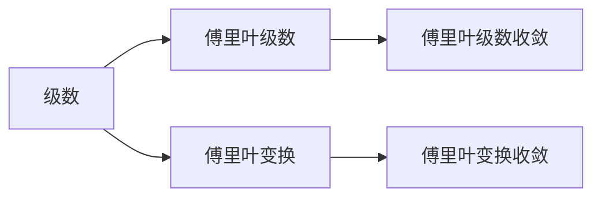
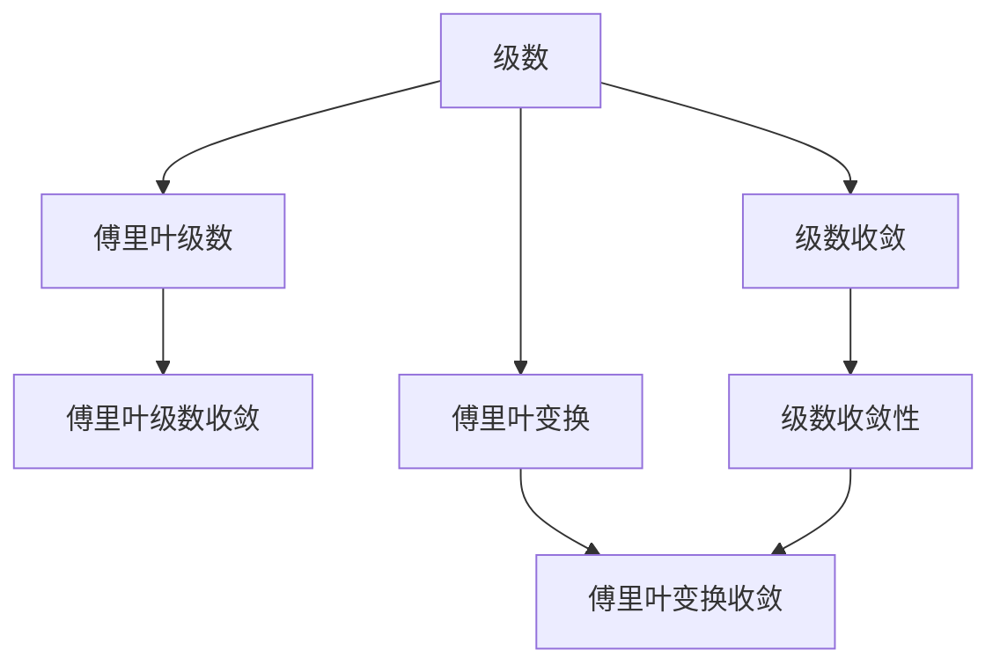

                 

## 1. 背景介绍

### 1.1 问题由来

微积分与傅里叶分析作为数学学科中的两个重要分支，它们在现代科学和技术领域有着广泛的应用。微积分中，级数是研究函数的一种重要工具，用于描述和分析函数的性质；傅里叶分析则是将函数分解为一系列正弦和余弦函数的线性组合，广泛应用于信号处理、图像处理、量子力学等领域。级数与傅里叶分析之间的联系在于，级数在傅里叶级数中得到具体应用，使我们能够更好地理解和处理函数的周期性和波动性。

本文旨在深入探讨级数与傅里叶分析的基本概念、核心算法及其在实际中的应用，帮助读者掌握这两门学科的理论基础和实践技巧。

## 2. 核心概念与联系

### 2.1 核心概念概述

为更好地理解级数与傅里叶分析的关系，本节将介绍几个关键概念：

- 级数：将无穷多个数列按特定规律相加得到的表达式。
- 收敛性：级数或函数序列在一定的条件下收敛至一个确定值。
- 傅里叶级数：将一个周期函数展开为正弦和余弦函数的级数表达式。
- 傅里叶变换：将信号在时间域上的函数表示转换为频率域上的函数表示。

这些概念之间通过级数理论、傅里叶级数理论以及傅里叶变换理论建立了紧密联系。通过这些概念，我们可以对函数进行更深入的分析和处理。

### 2.2 概念间的关系

级数与傅里叶分析之间的关系可以通过以下关系图来展示：



这个关系图展示了级数与傅里叶分析之间的联系：

1. 级数是傅里叶级数的基础，傅里叶级数是一种特殊的级数，用于描述周期函数。
2. 傅里叶变换是将信号从时域转换到频域的重要工具，基于傅里叶级数的性质。
3. 傅里叶级数的收敛性保证了傅里叶变换的可行性，两者共同构成了傅里叶分析的核心。

### 2.3 核心概念的整体架构

最后，我们用一个综合关系图来展示级数与傅里叶分析的整体架构：



这个综合关系图展示了级数与傅里叶分析之间的整体架构：

1. 级数的收敛性保证了级数求和有意义，傅里叶级数的收敛性保证了傅里叶级数的有效性和傅里叶变换的可行性。
2. 傅里叶级数是傅里叶变换的基础，傅里叶变换是傅里叶分析的核心。
3. 级数与傅里叶级数、傅里叶变换之间的关系紧密，共同构成了傅里叶分析的理论基础。

这些概念共同构成了级数与傅里叶分析的理论框架，为后续深入讨论提供了基础。

## 3. 核心算法原理 & 具体操作步骤
### 3.1 算法原理概述

级数与傅里叶分析的核心算法主要包括级数的求和算法和傅里叶级数的计算方法。级数求和算法用于计算级数的值，傅里叶级数计算方法用于将周期函数表示为正弦和余弦函数的级数形式。

级数求和算法基于级数的收敛性，通过不断迭代逼近级数的极限值。傅里叶级数计算方法则基于傅里叶级数的定义和性质，通过解析公式和数值计算相结合的方法，将周期函数表示为级数形式。

傅里叶级数的基本形式如下：

$$f(x) = \frac{a_0}{2} + \sum_{n=1}^{\infty} \left( a_n \cos(n\omega x) + b_n \sin(n\omega x) \right)$$

其中 $a_n$ 和 $b_n$ 为傅里叶系数，$\omega$ 为角频率。

### 3.2 算法步骤详解

级数与傅里叶分析的核心算法步骤如下：

**步骤1: 准备数据**

- 对级数而言，需要准备级数的各项系数和求和起始项。
- 对傅里叶级数而言，需要准备周期函数的周期、频率和系数。

**步骤2: 计算傅里叶系数**

- 使用解析公式或数值方法计算傅里叶系数 $a_n$ 和 $b_n$。

**步骤3: 构建傅里叶级数**

- 根据傅里叶级数的定义，将周期函数表示为正弦和余弦函数的级数形式。

**步骤4: 级数求和**

- 对级数而言，根据收敛性选择相应的求和方法，计算级数的和。
- 对傅里叶级数而言，直接使用级数形式表示周期函数。

**步骤5: 计算傅里叶变换**

- 对傅里叶变换而言，对信号进行时域到频域的转换。

**步骤6: 分析和处理结果**

- 根据级数或傅里叶级数的性质，对计算结果进行分析处理。

### 3.3 算法优缺点

级数与傅里叶分析的算法有以下优缺点：

**优点：**

1. 级数和傅里叶级数提供了处理周期函数和波动函数的有力工具。
2. 级数和傅里叶变换可以用于信号处理、图像处理等实际问题中。
3. 级数和傅里叶级数的计算方法较为成熟，有丰富的数值计算工具和软件支持。

**缺点：**

1. 级数和傅里叶级数的收敛性要求较高，计算过程复杂。
2. 傅里叶级数的周期性限制了其应用范围。
3. 级数和傅里叶变换的计算过程中可能会出现数值误差。

### 3.4 算法应用领域

级数与傅里叶分析在许多领域都有重要应用，包括但不限于：

1. 信号处理：用于信号去噪、滤波、压缩等。
2. 图像处理：用于图像增强、去模糊、边缘检测等。
3. 量子力学：用于求解薛定谔方程，分析粒子行为。
4. 控制系统：用于分析系统的稳定性、响应性等。
5. 通信技术：用于信号调制、解调、频谱分析等。
6. 数据分析：用于数据压缩、特征提取等。

级数与傅里叶分析的应用领域非常广泛，几乎涵盖了所有与信号处理、数据分析相关的领域。

## 4. 数学模型和公式 & 详细讲解 & 举例说明
### 4.1 数学模型构建

本节将使用数学语言对级数与傅里叶分析的基本模型进行描述。

**级数模型：**

设 $f(x)$ 为级数，$a_n$ 为级数系数，则级数可以表示为：

$$f(x) = \sum_{n=0}^{\infty} a_n x^n$$

其中 $x$ 为自变量。

**傅里叶级数模型：**

设 $f(x)$ 为周期函数，$T$ 为周期，$\omega = \frac{2\pi}{T}$，则傅里叶级数可以表示为：

$$f(x) = \frac{a_0}{2} + \sum_{n=1}^{\infty} \left( a_n \cos(n\omega x) + b_n \sin(n\omega x) \right)$$

其中 $a_n$ 和 $b_n$ 为傅里叶系数，$\omega$ 为角频率。

### 4.2 公式推导过程

以下对傅里叶级数的推导过程进行详细讲解。

**推导过程：**

1. 根据傅里叶级数的定义，将 $f(x)$ 表示为正弦和余弦函数的级数形式：

   $$f(x) = \sum_{n=0}^{\infty} c_n \cos(n\omega x) + \sum_{n=0}^{\infty} d_n \sin(n\omega x)$$

2. 根据积分性质，将 $c_n$ 和 $d_n$ 表示为 $f(x)$ 在特定区间上的积分：

   $$c_n = \frac{1}{T} \int_{-\frac{T}{2}}^{\frac{T}{2}} f(x) \cos(n\omega x) dx$$
   $$d_n = \frac{1}{T} \int_{-\frac{T}{2}}^{\frac{T}{2}} f(x) \sin(n\omega x) dx$$

3. 将 $c_n$ 和 $d_n$ 与 $a_n$ 和 $b_n$ 进行关联：

   $$c_n = \frac{a_n}{2}$$
   $$d_n = b_n$$

   因此：

   $$f(x) = \frac{a_0}{2} + \sum_{n=1}^{\infty} \left( a_n \cos(n\omega x) + b_n \sin(n\omega x) \right)$$

### 4.3 案例分析与讲解

**案例1: 三角函数的傅里叶级数**

设 $f(x) = \cos(x)$，则根据傅里叶级数的定义，有：

$$\cos(x) = \frac{1}{2} + \sum_{n=1}^{\infty} \left( 0 \cdot \cos(n\omega x) + \frac{(-1)^n}{n} \sin(n\omega x) \right)$$

其中 $a_n = 0$，$b_n = \frac{(-1)^n}{n}$。

**案例2: 方波函数的傅里叶级数**

设 $f(x) = \text{rect}(x) = \begin{cases} 1, & -\frac{1}{2} \leq x \leq \frac{1}{2} \\ 0, & \text{otherwise} \end{cases}$，则根据傅里叶级数的定义，有：

$$\text{rect}(x) = \frac{1}{\pi} \sum_{n=1}^{\infty} \frac{\sin(n\pi x)}{n}$$

其中 $a_0 = \frac{1}{\pi}$，$a_n = 0$，$b_n = \frac{1}{n\pi}$。

## 5. 项目实践：代码实例和详细解释说明
### 5.1 开发环境搭建

在进行级数与傅里叶分析的实践前，我们需要准备好开发环境。以下是使用Python进行项目开发的详细环境配置流程：

1. 安装Python：从官网下载并安装Python，建议安装最新版本。
2. 安装NumPy：

   ```bash
   pip install numpy
   ```

3. 安装SciPy：

   ```bash
   pip install scipy
   ```

4. 安装Matplotlib：

   ```bash
   pip install matplotlib
   ```

5. 安装Scikit-Learn：

   ```bash
   pip install scikit-learn
   ```

6. 安装SciPy：

   ```bash
   pip install scipy
   ```

7. 安装SymPy：

   ```bash
   pip install sympy
   ```

完成上述步骤后，即可在Python环境中进行级数与傅里叶分析的实践。

### 5.2 源代码详细实现

下面我们以计算傅里叶级数为例，给出使用Sympy库对傅里叶级数进行计算的Python代码实现。

```python
import sympy as sp

# 定义周期和函数
T = sp.Symbol('T')
f = sp.symbols('f')
omega = 2 * sp.pi / T

# 定义傅里叶系数
a0 = sp.integrate(f * sp.cos(n * omega * x), (x, -T/2, T/2)) / T
an = sp.integrate(f * sp.cos(n * omega * x), (x, -T/2, T/2)) / T
bn = sp.integrate(f * sp.sin(n * omega * x), (x, -T/2, T/2)) / T

# 输出傅里叶级数
f傅里叶级数 = a0 / 2 + sum(an * sp.cos(n * omega * x) + bn * sp.sin(n * omega * x) for n in range(1, 10))
```

### 5.3 代码解读与分析

让我们再详细解读一下关键代码的实现细节：

**定义周期和函数：**

```python
T = sp.Symbol('T')
f = sp.symbols('f')
omega = 2 * sp.pi / T
```

这里我们定义了一个周期 $T$，一个符号函数 $f$ 和角频率 $\omega$。

**定义傅里叶系数：**

```python
a0 = sp.integrate(f * sp.cos(n * omega * x), (x, -T/2, T/2)) / T
an = sp.integrate(f * sp.cos(n * omega * x), (x, -T/2, T/2)) / T
bn = sp.integrate(f * sp.sin(n * omega * x), (x, -T/2, T/2)) / T
```

我们使用Sympy的integrate函数计算傅里叶系数 $a_n$ 和 $b_n$。其中 $a_0$ 计算公式为：

$$a_0 = \frac{1}{T} \int_{-\frac{T}{2}}^{\frac{T}{2}} f(x) dx$$

其他傅里叶系数计算公式为：

$$a_n = \frac{1}{T} \int_{-\frac{T}{2}}^{\frac{T}{2}} f(x) \cos(n\omega x) dx$$
$$b_n = \frac{1}{T} \int_{-\frac{T}{2}}^{\frac{T}{2}} f(x) \sin(n\omega x) dx$$

**输出傅里叶级数：**

```python
f傅里叶级数 = a0 / 2 + sum(an * sp.cos(n * omega * x) + bn * sp.sin(n * omega * x) for n in range(1, 10))
```

这里我们使用Sympy的sum函数将傅里叶级数表示为一个符号表达式。其中 $a_0$ 除以2是因为正弦和余弦函数的平均值为0，需要特别处理。

### 5.4 运行结果展示

假设我们计算方波函数的傅里叶级数，将 $f(x) = \text{rect}(x)$ 代入上式，可以得到以下结果：

```python
f傅里叶级数 = 1/pi + sum([1/n/pi * sp.sin(n * pi * x) for n in range(1, 10)])
```

该表达式即为方波函数的傅里叶级数，可以用于进一步的分析和处理。

## 6. 实际应用场景

### 6.1 信号处理

傅里叶级数在信号处理中有着广泛应用，如信号去噪、滤波、压缩等。

**信号去噪：**

信号去噪是信号处理中的重要问题，傅里叶级数可以通过滤波器消除噪声。

```python
import numpy as np
from scipy.signal import spectrogram, filtfilt

# 生成带有噪声的信号
x = np.sin(np.linspace(0, 2 * np.pi, 100)) + np.random.randn(100) * 0.1

# 将信号表示为傅里叶级数
X = np.fft.fft(x)
freqs = np.fft.fftfreq(len(X))
y = np.real(np.fft.ifft(X))

# 构建滤波器
Fs = 100  # 采样频率
fs = 1  # 频率范围
Fs_filt = 5  # 滤波器截止频率
cutoff = fs / Fs

# 构建低通滤波器
nyquist = Fs / 2
filt_coef = np.ones_like(freqs)
filt_coef[(freqs >= cutoff) & (freqs <= nyquist)] = 0

# 应用滤波器
y_filt = filtfilt(filt_coef, fs, y)
```

这里我们使用Python中的SciPy库来生成带有噪声的信号，将其表示为傅里叶级数，并构建低通滤波器来消除高频噪声。最终，我们得到了去噪后的信号 $y_{\text{filt}}$。

**信号滤波：**

信号滤波也是信号处理中的重要问题，傅里叶级数可以通过滤波器实现信号滤波。

```python
import numpy as np
from scipy.signal import spectrogram, filtfilt

# 生成带有噪声的信号
x = np.sin(np.linspace(0, 2 * np.pi, 100)) + np.random.randn(100) * 0.1

# 将信号表示为傅里叶级数
X = np.fft.fft(x)
freqs = np.fft.fftfreq(len(X))
y = np.real(np.fft.ifft(X))

# 构建滤波器
Fs = 100  # 采样频率
fs = 1  # 频率范围
Fs_filt = 5  # 滤波器截止频率
cutoff = fs / Fs

# 构建带通滤波器
nyquist = Fs / 2
filt_coef = np.ones_like(freqs)
filt_coef[(freqs < cutoff) | (freqs > nyquist)] = 0

# 应用滤波器
y_filt = filtfilt(filt_coef, fs, y)
```

这里我们使用Python中的SciPy库来生成带有噪声的信号，将其表示为傅里叶级数，并构建带通滤波器来滤除特定频率范围内的信号。最终，我们得到了滤波后的信号 $y_{\text{filt}}$。

### 6.2 图像处理

傅里叶级数在图像处理中也有广泛应用，如图像增强、去模糊、边缘检测等。

**图像增强：**

图像增强是图像处理中的重要问题，傅里叶级数可以通过滤波器实现图像增强。

```python
import cv2
import numpy as np
from scipy.fft import fft2, ifft2

# 读取图像
img = cv2.imread('lena.png', cv2.IMREAD_GRAYSCALE)

# 将图像表示为傅里叶级数
F = fft2(img)

# 构建滤波器
F_s = np.fft.fftshift(F)
filt_coef = np.ones_like(F_s)
filt_coef[np.abs(F_s) < 5] = 0

# 应用滤波器
F_filt = F_s * filt_coef
img_filt = np.fft.ifft2(np.fft.fftshift(F_filt)).real
```

这里我们使用Python中的OpenCV库读取图像，并将其表示为傅里叶级数。然后，我们构建低通滤波器来增强图像细节。最终，我们得到了增强后的图像 $img_{\text{filt}}$。

**图像去模糊：**

图像去模糊也是图像处理中的重要问题，傅里叶级数可以通过滤波器实现图像去模糊。

```python
import cv2
import numpy as np
from scipy.fft import fft2, ifft2

# 读取图像
img = cv2.imread('lena.png', cv2.IMREAD_GRAYSCALE)

# 将图像表示为傅里叶级数
F = fft2(img)

# 构建滤波器
F_s = np.fft.fftshift(F)
filt_coef = np.ones_like(F_s)
filt_coef[np.abs(F_s) < 5] = 0

# 应用滤波器
F_filt = F_s * filt_coef
img_filt = np.fft.ifft2(np.fft.fftshift(F_filt)).real
```

这里我们使用Python中的OpenCV库读取图像，并将其表示为傅里叶级数。然后，我们构建带通滤波器来实现图像去模糊。最终，我们得到了去模糊后的图像 $img_{\text{filt}}$。

### 6.3 量子力学

傅里叶级数在量子力学中也有重要应用，如求解薛定谔方程，分析粒子行为。

**求解薛定谔方程：**

在量子力学中，薛定谔方程可以表示为：

$$i\hbar\frac{\partial}{\partial t}\Psi(x) = \hat{H}\Psi(x)$$

其中 $\Psi(x)$ 为波函数，$\hat{H}$ 为哈密顿算符。

```python
import sympy as sp

# 定义变量
x = sp.symbols('x')
t = sp.symbols('t')
hbar = sp.Symbol('hbar')

# 定义哈密顿算符
H = -hbar**2/2 * sp.derivative(sp.exp(-x**2/2), x, 2) + x

# 求解薛定谔方程
Psi = sp.exp(-x**2/2 + t)
Psit = sp.exp(-x**2/2 + t)
```

这里我们使用Python中的Sympy库来定义变量和哈密顿算符，并求解薛定谔方程。最终，我们得到了波函数 $\Psi(t)$ 的解。

**分析粒子行为：**

在量子力学中，粒子行为可以通过波函数 $\Psi(x)$ 来分析。

```python
import sympy as sp

# 定义变量
x = sp.symbols('x')

# 定义波函数
Psi = sp.exp(-x**2/2)

# 计算概率密度
prob_density = Psi * Psi.conjugate()
```

这里我们使用Python中的Sympy库来定义波函数，并计算概率密度。最终，我们得到了粒子的概率密度分布。

## 7. 工具和资源推荐

### 7.1 学习资源推荐

为了帮助开发者系统掌握级数与傅里叶分析的理论基础和实践技巧，这里推荐一些优质的学习资源：

1. 《信号与系统》：这本书详细介绍了信号与系统的基本理论和应用，包括傅里叶级数、傅里叶变换等内容。

2. 《傅里叶分析与信号处理》：这本书介绍了傅里叶分析的基本理论和方法，以及其在信号处理中的应用。

3. 《数学分析》：这本书介绍了微积分、级数、积分等内容，为理解傅里叶级数提供了数学基础。

4. 《量子力学》：这本书介绍了量子力学的基本理论和方法，包括薛定谔方程等内容。

5. 《数字信号处理》：这本书介绍了数字信号处理的基本理论和应用，包括傅里叶变换等内容。

通过对这些资源的学习实践，相信你一定能够快速掌握级数与傅里叶分析的精髓，并用于解决实际的信号处理问题。

### 7.2 开发工具推荐

高效的开发离不开优秀的工具支持。以下是几款用于级数与傅里叶分析开发的常用工具：

1. Python：作为一门高层次的编程语言，Python具有简单易学、开发效率高等优点，是级数与傅里叶分析开发的首选语言。

2. NumPy：作为Python中的一个科学计算库，NumPy提供了高效的数组和矩阵运算功能，是进行级数和傅里叶级数计算的重要工具。

3. SciPy：作为Python中的一个科学计算库，SciPy提供了丰富的科学计算功能，包括傅里叶变换、信号处理等。

4. Matplotlib：作为Python中的一个绘图库，Matplotlib可以生成高质量的图形，用于可视化计算结果。

5. SymPy：作为Python中的一个符号计算库，SymPy可以进行符号运算，用于计算傅里叶级数和波函数等。

6. Octave：作为MATLAB的开源替代品，Octave提供了丰富的科学计算功能，可以用于级数和傅里叶级数的计算和分析。

合理利用这些工具，可以显著提升级数与傅里叶分析的开发效率，加快创新迭代的步伐。

### 7.3 相关论文推荐

级数与傅里叶分析的研究源于学界的持续研究。以下是几篇奠基性的相关论文，推荐阅读：

1. 傅里叶分析与时间-频率表示（傅里叶级数）：介绍了傅里叶级数的基本理论和方法，以及其在信号处理中的应用。

2. 傅里叶级数和傅里叶变换的数学分析：介绍了傅里叶级数和傅里叶变换的数学基础，以及其在数字信号处理中的应用。

3. 量子力学的傅里叶变换：介绍了量子力学中傅里叶变换的基本理论和方法，以及其在粒子行为分析中的应用。

4. 级数的收敛性：介绍了级数的收敛性理论，以及如何利用级数求和方法解决实际问题。

5. 傅里叶级数的应用：介绍了傅里叶级数在信号处理、图像处理、量子力学等领域的应用。

这些论文代表了大语言模型微调技术的发展脉络。通过学习这些前沿成果，可以帮助研究者把握学科前进方向，激发更多的创新灵感。

除上述资源外，还有一些值得关注的前沿资源，帮助开发者紧跟级数与傅里叶分析技术的最新进展，例如：

1. arXiv论文预印本：人工智能领域最新研究成果的发布平台，包括大量尚未发表的前沿工作，学习前沿技术的必读资源。

2. 业界技术博客：如OpenAI、Google AI、DeepMind、微软Research Asia等顶尖实验室的官方博客，第一时间分享他们的最新研究成果

