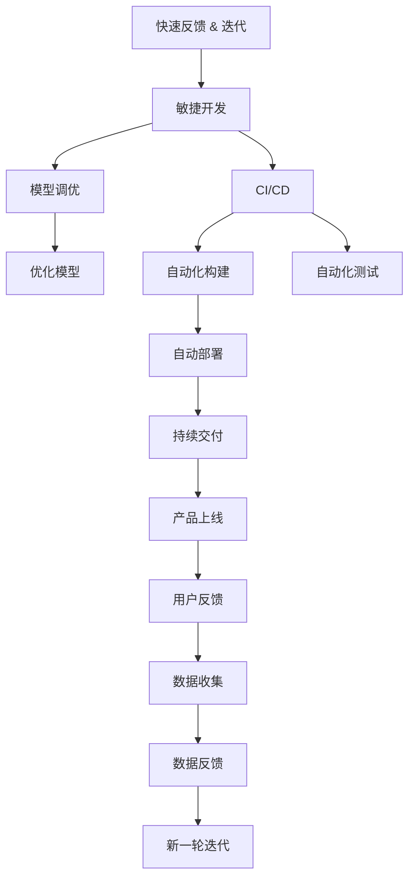
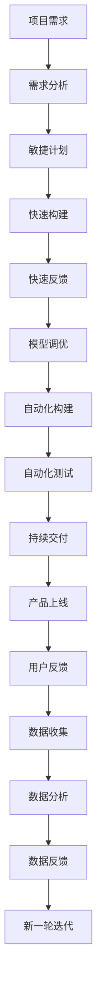

                 

# 快速试错与迭代在AI创业中的重要性

在快速发展的AI领域，创新与变革是永恒的主题。创业公司如何在这场激烈的竞争中脱颖而出，成为许多创业者关注的焦点。本文将深入探讨快速试错与迭代在AI创业中的重要性，结合实例分析，提供实用的方法论与策略，帮助创业公司提升产品开发效率和市场竞争力。

## 1. 背景介绍

### 1.1 问题由来

AI创业项目面临的挑战复杂多样，包括但不限于数据获取与处理、模型训练与优化、产品设计与市场推广等。这些挑战使得创业公司在研发过程中往往需要不断调整策略，快速试错与迭代成为了一个不可或缺的工具。快速试错能够帮助创业者及时发现问题并及时纠正，而迭代则使产品能够持续改进，适应市场变化。

### 1.2 问题核心关键点

在AI创业中，快速试错与迭代的重要性体现在以下几个方面：
1. 提升产品开发效率：通过快速试错，可以快速验证假设，及时调整方向，从而缩短产品开发周期。
2. 优化模型性能：快速试错有助于识别模型中的问题，通过迭代优化模型结构、超参数等，提升模型效果。
3. 适应市场变化：快速试错与迭代使产品能够及时响应市场变化，保持竞争力。
4. 降低风险与成本：快速试错可以避免大规模投入后的失败，迭代优化可减少不必要的资源浪费。
5. 增强用户满意度：快速响应用户反馈，持续改进产品，提升用户体验。

### 1.3 问题研究意义

快速试错与迭代不仅是大规模技术创新的重要手段，也是AI创业成功的关键因素。通过深入分析这些方法的应用，创业公司可以更好地理解AI项目开发与推广的全过程，从而制定有效的战略和策略。

## 2. 核心概念与联系

### 2.1 核心概念概述

为了更好地理解快速试错与迭代在AI创业中的重要性，本节将介绍几个密切相关的核心概念：

- **快速试错(Fast Feedback & Iteration)**：快速反馈是通过即时反馈来验证假设，并根据反馈结果进行调整的过程。迭代是指在验证假设后，基于反馈结果进行模型的改进和优化。
- **敏捷开发(Agile Development)**：敏捷开发是一种基于迭代和增量的软件开发方法，强调快速响应市场变化和客户需求，提升产品开发效率。
- **连续集成与持续交付(Continuous Integration and Continuous Delivery, CI/CD)**：CI/CD是一种软件开发实践，通过自动化的构建、测试和部署过程，实现快速迭代和持续交付。
- **模型调优(Model Tuning)**：模型调优是通过调整模型的超参数、网络结构等，提升模型性能和泛化能力。
- **版本控制(Version Control)**：版本控制通过记录和跟踪代码的变化历史，确保团队协作过程中的数据安全和管理有序。

这些概念之间的联系紧密，共同构成了AI创业中快速试错与迭代的重要框架。

### 2.2 概念间的关系

这些核心概念之间的关系可以用以下Mermaid流程图来展示：



这个流程图展示了快速试错与迭代在AI创业中的关键步骤和相关概念：

1. 快速反馈：通过敏捷开发方式，快速构建并验证假设。
2. 迭代优化：基于反馈结果，进行模型调优和持续交付。
3. 模型调优：通过调整超参数、网络结构等，提升模型性能。
4. CI/CD：自动化构建、测试和部署，实现快速迭代。
5. 用户反馈：通过产品上线收集用户反馈，进行数据分析和验证。
6. 数据反馈：将用户反馈转化为数据，进行新一轮迭代。

这些步骤形成一个闭环，确保AI创业项目能够高效、持续地发展。

### 2.3 核心概念的整体架构

最后，我们用一个综合的流程图来展示这些核心概念在大规模AI项目开发中的整体架构：



这个综合流程图展示了AI创业项目从需求分析到持续交付的全过程，强调了快速试错与迭代的重要性。

## 3. 核心算法原理 & 具体操作步骤

### 3.1 算法原理概述

快速试错与迭代的原理基于循环优化和即时反馈，通过不断验证假设，调整策略，优化模型和产品，最终达到最佳性能和用户满意度。其核心思想是：

1. **快速构建与验证**：在敏捷开发过程中，快速构建并验证假设，根据结果进行调整，确保产品开发效率和质量。
2. **模型调优**：通过调整超参数、网络结构等，优化模型性能，提升泛化能力。
3. **持续交付**：通过CI/CD实践，实现自动化构建、测试和部署，确保快速迭代和交付。
4. **用户反馈与数据分析**：收集用户反馈和数据，进行分析和验证，指导新一轮迭代。

### 3.2 算法步骤详解

以下是快速试错与迭代在大规模AI项目中的具体操作步骤：

**Step 1: 需求分析与规划**
- 明确项目需求，制定详细的敏捷计划，确定迭代周期和任务优先级。

**Step 2: 快速构建与验证**
- 采用敏捷开发方法，快速构建原型或最小可行产品(MVP)，进行快速反馈和用户测试。
- 根据测试结果和用户反馈，调整产品功能和设计，进行下一轮迭代。

**Step 3: 模型调优**
- 基于模型性能指标，调整超参数、网络结构等，优化模型性能。
- 使用自动化工具和平台，如TensorFlow、PyTorch等，进行模型训练和调优。

**Step 4: 自动化构建与测试**
- 采用CI/CD实践，实现自动化构建和测试，确保代码质量和产品稳定性。
- 集成自动化测试工具，如JUnit、Selenium等，进行单元测试、集成测试和系统测试。

**Step 5: 持续交付与上线**
- 使用CI/CD工具，如Jenkins、GitLab CI等，实现自动化部署和持续交付。
- 将优化后的模型和产品发布到生产环境，进行用户验证和数据分析。

**Step 6: 数据收集与分析**
- 收集用户反馈和数据，进行数据分析和验证，指导新一轮迭代。
- 使用数据分析工具，如Tableau、Power BI等，进行数据可视化，进行深入分析。

**Step 7: 新一轮迭代**
- 根据数据分析结果和用户反馈，进行新一轮迭代，调整产品和模型。
- 重复以上步骤，实现持续改进和优化。

### 3.3 算法优缺点

快速试错与迭代在大规模AI项目中具有以下优点：
1. 提高产品开发效率：通过快速试错，及时发现问题并快速调整，缩短产品开发周期。
2. 优化模型性能：快速试错与迭代有助于识别模型中的问题，通过调优提升模型效果。
3. 适应市场变化：快速试错与迭代使产品能够及时响应市场变化，保持竞争力。
4. 降低风险与成本：快速试错可以避免大规模投入后的失败，迭代优化可减少不必要的资源浪费。

同时，快速试错与迭代也存在以下缺点：
1. 开发成本高：快速试错与迭代需要频繁调整和测试，开发成本较高。
2. 技术复杂度高：需要掌握敏捷开发、自动化测试、持续交付等技术，复杂度较高。
3. 数据需求高：快速试错与迭代需要大量数据进行测试和分析，数据获取和处理成本较高。

### 3.4 算法应用领域

快速试错与迭代在大规模AI项目中广泛应用，尤其在以下几个领域：

- **NLP项目**：如自然语言处理、机器翻译、情感分析等，通过快速试错与迭代，提升模型性能和应用效果。
- **计算机视觉项目**：如图像分类、目标检测、图像生成等，通过快速试错与迭代，优化模型结构和性能。
- **推荐系统**：如电商推荐、社交网络推荐等，通过快速试错与迭代，提升推荐算法的效果和用户满意度。
- **智能客服系统**：如对话系统、问答系统等，通过快速试错与迭代，提升系统的交互能力和用户体验。

## 4. 数学模型和公式 & 详细讲解 & 举例说明

### 4.1 数学模型构建

在AI创业中，快速试错与迭代主要通过数学模型和公式来描述和优化。这里以模型调优为例，构建一个简单的数学模型。

假设我们要调优一个二分类模型的超参数，目标是最小化损失函数：

$$
L(\theta) = \frac{1}{N}\sum_{i=1}^N L(f(x_i, \theta), y_i)
$$

其中，$f(x_i, \theta)$ 表示模型对输入 $x_i$ 的预测，$y_i$ 表示真实标签，$L$ 表示损失函数。目标是最小化平均损失 $L$。

### 4.2 公式推导过程

通过梯度下降法，对超参数 $\theta$ 进行优化，推导如下：

$$
\theta \leftarrow \theta - \eta \nabla_{\theta} L(\theta)
$$

其中，$\eta$ 为学习率，$\nabla_{\theta} L(\theta)$ 为损失函数对超参数的梯度，可以通过反向传播算法计算。

### 4.3 案例分析与讲解

以电商推荐系统为例，展示快速试错与迭代的实际应用。

假设我们要构建一个电商推荐系统，通过用户的历史行为数据，预测其可能感兴趣的商品。基于快速试错与迭代的方法，可以按以下步骤进行：

**Step 1: 需求分析与规划**
- 确定推荐系统的功能需求，如商品分类、用户画像、推荐算法等。
- 制定详细的敏捷计划，确定迭代周期和任务优先级。

**Step 2: 快速构建与验证**
- 快速构建一个简单的推荐模型，如协同过滤模型或基于内容的推荐模型。
- 在部分用户数据上进行测试，收集用户反馈，调整模型参数和算法。

**Step 3: 模型调优**
- 基于推荐效果，调整模型超参数，如正则化系数、特征选择等。
- 使用自动化工具，如TensorFlow、PyTorch等，进行模型训练和调优。

**Step 4: 自动化构建与测试**
- 采用CI/CD实践，实现自动化构建和测试，确保代码质量和产品稳定性。
- 集成自动化测试工具，如JUnit、Selenium等，进行单元测试、集成测试和系统测试。

**Step 5: 持续交付与上线**
- 使用CI/CD工具，如Jenkins、GitLab CI等，实现自动化部署和持续交付。
- 将优化后的推荐模型发布到生产环境，进行用户验证和数据分析。

**Step 6: 数据收集与分析**
- 收集用户反馈和数据，进行数据分析和验证，指导新一轮迭代。
- 使用数据分析工具，如Tableau、Power BI等，进行数据可视化，进行深入分析。

**Step 7: 新一轮迭代**
- 根据数据分析结果和用户反馈，进行新一轮迭代，调整推荐算法和模型。
- 重复以上步骤，实现持续改进和优化。

## 5. 项目实践：代码实例和详细解释说明

### 5.1 开发环境搭建

在进行快速试错与迭代实践前，我们需要准备好开发环境。以下是使用Python进行TensorFlow开发的环境配置流程：

1. 安装Anaconda：从官网下载并安装Anaconda，用于创建独立的Python环境。

2. 创建并激活虚拟环境：
```bash
conda create -n tf-env python=3.8 
conda activate tf-env
```

3. 安装TensorFlow：根据CUDA版本，从官网获取对应的安装命令。例如：
```bash
conda install tensorflow -c conda-forge
```

4. 安装各类工具包：
```bash
pip install numpy pandas scikit-learn matplotlib tqdm jupyter notebook ipython
```

完成上述步骤后，即可在`tf-env`环境中开始快速试错与迭代实践。

### 5.2 源代码详细实现

这里我们以电商推荐系统为例，给出使用TensorFlow进行模型调优的PyTorch代码实现。

首先，定义推荐系统的数据处理函数：

```python
import pandas as pd
import numpy as np
from sklearn.model_selection import train_test_split
from tensorflow.keras.layers import Input, Dense, Embedding, Flatten
from tensorflow.keras.models import Model
from tensorflow.keras.optimizers import Adam

# 加载数据
data = pd.read_csv('user_based_recommendation.csv')

# 数据预处理
X = data[['item_id', 'user_id']]
y = data['label']

# 划分训练集和测试集
X_train, X_test, y_train, y_test = train_test_split(X, y, test_size=0.2, random_state=42)

# 定义模型结构
input1 = Input(shape=(1,), name='user')
input2 = Input(shape=(1,), name='item')
embedding = Embedding(10000, 32, input_length=1, name='embedding')
x1 = Flatten()(embedding(input1))
x2 = Flatten()(embedding(input2))
dense = Dense(64, activation='relu')([x1, x2])
output = Dense(1, activation='sigmoid')(dense)

# 定义模型
model = Model(inputs=[input1, input2], outputs=output)

# 编译模型
model.compile(optimizer=Adam(lr=0.001), loss='binary_crossentropy', metrics=['accuracy'])

# 训练模型
model.fit([X_train['item_id'], X_train['user_id']], y_train, epochs=10, batch_size=32)
```

然后，定义测试函数：

```python
from sklearn.metrics import accuracy_score

# 测试模型
X_test, y_test = X_test.drop(['item_id', 'user_id'], axis=1), y_test
y_pred = model.predict_proba(X_test)
y_pred = y_pred[:, 1]
accuracy = accuracy_score(y_test, y_pred)
print(f'Accuracy: {accuracy:.3f}')
```

最后，启动测试流程：

```python
# 运行测试
test()
```

### 5.3 代码解读与分析

让我们再详细解读一下关键代码的实现细节：

**推荐系统数据处理**：
- 加载电商推荐系统的历史数据，进行必要的预处理，包括特征选择、缺失值处理、数据分割等。
- 将用户ID和商品ID作为输入，输出为是否购买标记。

**模型结构定义**：
- 使用TensorFlow定义推荐模型，包括用户嵌入层、商品嵌入层、全连接层和输出层。
- 使用Adam优化器和二元交叉熵损失函数进行模型编译。

**模型训练与测试**：
- 使用训练数据对模型进行训练，设置迭代次数和批量大小。
- 使用测试数据对模型进行测试，计算准确率。

**测试函数实现**：
- 对测试数据进行预测，计算准确率。
- 输出准确率结果。

在代码实现中，我们使用了TensorFlow的高阶API Keras，使得模型定义和训练过程简洁高效。通过使用自动化的工具和平台，如Jupyter Notebook、TensorBoard等，可以实现快速试错与迭代。

## 6. 实际应用场景

### 6.1 智能客服系统

在智能客服系统中，快速试错与迭代方法可以显著提升系统的响应速度和准确性。传统客服系统往往需要大量人工客服，成本高且效率低。通过快速试错与迭代，可以不断优化对话模型，提升智能客服系统的智能化水平，实现7x24小时不间断服务。

在实践中，可以收集历史客服对话记录，将问题和最佳答复构建成监督数据，在此基础上对预训练对话模型进行微调。微调后的对话模型能够自动理解用户意图，匹配最合适的答案模板进行回复。对于客户提出的新问题，还可以接入检索系统实时搜索相关内容，动态组织生成回答。如此构建的智能客服系统，能大幅提升客户咨询体验和问题解决效率。

### 6.2 金融舆情监测

在金融领域，快速试错与迭代方法可以应用于舆情监测和风险预警。金融机构需要实时监测市场舆论动向，以便及时应对负面信息传播，规避金融风险。传统的人工监测方式成本高、效率低，难以应对网络时代海量信息爆发的挑战。通过快速试错与迭代，可以不断优化文本分类和情感分析模型，提高对金融舆情的监测效果和响应速度。

具体而言，可以收集金融领域相关的新闻、报道、评论等文本数据，并对其进行主题标注和情感标注。在此基础上对预训练语言模型进行微调，使其能够自动判断文本属于何种主题，情感倾向是正面、中性还是负面。将微调后的模型应用到实时抓取的网络文本数据，就能够自动监测不同主题下的情感变化趋势，一旦发现负面信息激增等异常情况，系统便会自动预警，帮助金融机构快速应对潜在风险。

### 6.3 个性化推荐系统

在个性化推荐系统中，快速试错与迭代方法可以提升推荐算法的效果和用户体验。当前的推荐系统往往只依赖用户的历史行为数据进行物品推荐，无法深入理解用户的真实兴趣偏好。通过快速试错与迭代，可以不断优化推荐模型，提升推荐算法的个性化程度和推荐效果。

在实践中，可以收集用户浏览、点击、评论、分享等行为数据，提取和用户交互的物品标题、描述、标签等文本内容。将文本内容作为模型输入，用户的后续行为（如是否点击、购买等）作为监督信号，在此基础上微调预训练语言模型。微调后的模型能够从文本内容中准确把握用户的兴趣点。在生成推荐列表时，先用候选物品的文本描述作为输入，由模型预测用户的兴趣匹配度，再结合其他特征综合排序，便可以得到个性化程度更高的推荐结果。

### 6.4 未来应用展望

随着快速试错与迭代方法的不断发展，其在更多领域将得到应用，为传统行业带来变革性影响。

在智慧医疗领域，基于快速试错与迭代的医疗问答、病历分析、药物研发等应用将提升医疗服务的智能化水平，辅助医生诊疗，加速新药开发进程。

在智能教育领域，快速试错与迭代可应用于作业批改、学情分析、知识推荐等方面，因材施教，促进教育公平，提高教学质量。

在智慧城市治理中，快速试错与迭代技术可以应用于城市事件监测、舆情分析、应急指挥等环节，提高城市管理的自动化和智能化水平，构建更安全、高效的未来城市。

此外，在企业生产、社会治理、文娱传媒等众多领域，基于快速试错与迭代的人工智能应用也将不断涌现，为经济社会发展注入新的动力。相信随着技术的日益成熟，快速试错与迭代方法将成为人工智能落地应用的重要范式，推动人工智能技术在更广阔的应用领域大放异彩。

## 7. 工具和资源推荐

### 7.1 学习资源推荐

为了帮助开发者系统掌握快速试错与迭代理论基础和实践技巧，这里推荐一些优质的学习资源：

1. 《深度学习实战》系列博文：由大模型技术专家撰写，深入浅出地介绍了深度学习模型的构建和优化，包括快速试错与迭代方法。

2. 《TensorFlow实战指南》书籍：TensorFlow的官方文档，详细介绍了TensorFlow的各个组件和API，包括快速试错与迭代的实践方法。

3. 《机器学习实战》课程：由著名机器学习专家Andrew Ng开设，系统介绍了机器学习的基本概念和常用算法，包括快速试错与迭代的应用案例。

4. 《Python数据分析与科学计算》书籍：Python数据科学的核心教材，详细介绍了Python的数据处理、分析、可视化等工具，包括快速试错与迭代的数据处理技巧。

5. Kaggle竞赛平台：全球最大的数据科学竞赛平台，提供了丰富的数据集和实践案例，可以帮助开发者在实战中掌握快速试错与迭代方法。

通过对这些资源的学习实践，相信你一定能够快速掌握快速试错与迭代方法的精髓，并用于解决实际的AI问题。

### 7.2 开发工具推荐

高效的开发离不开优秀的工具支持。以下是几款用于快速试错与迭代开发的常用工具：

1. Jupyter Notebook：Python的交互式开发环境，支持代码执行、数据可视化、版本控制等，是快速试错与迭代开发的利器。

2. TensorFlow：Google开发的深度学习框架，支持分布式训练和优化，适合大规模工程应用。

3. PyTorch：Facebook开发的深度学习框架，灵活性高，适合快速迭代和实验。

4. Git：版本控制工具，帮助开发者记录代码变化历史，方便团队协作和代码管理。

5. Jenkins：开源自动化工具，支持CI/CD实践，实现自动化构建、测试和部署。

6. Tableau：数据可视化工具，帮助开发者进行数据探索和分析，指导快速试错与迭代。

合理利用这些工具，可以显著提升快速试错与迭代任务的开发效率，加快创新迭代的步伐。

### 7.3 相关论文推荐

快速试错与迭代技术的发展源于学界的持续研究。以下是几篇奠基性的相关论文，推荐阅读：

1. "A Framework for Lifelong Machine Learning"（终身学习框架）：提出基于快速试错与迭代的终身学习范式，探讨了模型持续学习和适应新任务的方法。

2. "A Survey of Continuous Learning"（连续学习综述）：综述了连续学习的研究进展，包括数据驱动、元学习、自适应等方法，提供了丰富的理论基础。

3. "Deep Learning for Recommendation Systems"（深度学习推荐系统）：探讨了深度学习在推荐系统中的应用，包括快速试错与迭代方法。

4. "Fast and Efficient Reinforcement Learning"（快速且高效的强化学习）：提出快速试错与迭代的强化学习算法，提升模型优化效率和效果。

5. "A Survey on Incremental and Continual Learning"（增量与连续学习综述）：综述了增量与连续学习的研究进展，提供了丰富的实际案例和理论分析。

这些论文代表了大模型快速试错与迭代技术的发展脉络。通过学习这些前沿成果，可以帮助研究者把握学科前进方向，激发更多的创新灵感。

除上述资源外，还有一些值得关注的前沿资源，帮助开发者紧跟快速试错与迭代技术的最新进展，例如：

1. arXiv论文预印本：人工智能领域最新研究成果的发布平台，包括大量尚未发表的前沿工作，学习前沿技术的必读资源。

2. 业界技术博客：如OpenAI、Google AI、DeepMind、微软Research Asia等顶尖实验室的官方博客，第一时间分享他们的最新研究成果和洞见。

3. 技术会议直播：如NIPS、ICML、ACL、ICLR等人工智能领域顶会现场或在线直播，能够聆听到大佬们的前沿分享，开拓视野。

4. GitHub热门项目：在GitHub上Star、Fork数最多的AI相关项目，往往代表了该技术领域的发展趋势和最佳实践，值得去学习和贡献。

5. 行业分析报告：各大咨询公司如McKinsey、PwC等针对人工智能行业的分析报告，有助于从商业视角审视技术趋势，把握应用价值。

总之，对于快速试错与迭代技术的学习和实践，需要开发者保持开放的心态和持续学习的意愿。多关注前沿资讯，多动手实践，多思考总结，必将收获满满的成长收益。

## 8. 总结：未来发展趋势与挑战

### 8.1 总结

本文对快速试错与迭代在AI创业中的重要性进行了全面系统的介绍。首先阐述了快速试错与迭代在AI项目开发中的重要作用，明确了其对提高产品开发效率、优化模型性能、适应市场变化等方面的影响。其次，从原理到实践，详细讲解了快速试错与迭代的数学模型和具体操作步骤，提供了实用的代码实现和实例分析。同时，本文还探讨了快速试错与迭代方法在智能客服、金融舆情、个性化推荐等领域的实际应用，展示了其广阔的应用前景。最后，本文精选了快速试错与迭代技术的各类学习资源，力求为读者提供全方位的技术指引。

通过本文的系统梳理，可以看到，快速试错与迭代方法在大规模AI项目开发中扮演着不可或缺的角色，是提高产品开发效率和竞争力的关键手段。未来，随着技术的发展和应用的深入，快速试错与迭代方法必将进一步提升AI项目的成功率和价值。

### 8.2 未来发展趋势

展望未来，快速试错与迭代技术将呈现以下几个发展趋势：

1. **自动化程度提升**：随着自动化测试和持续交付工具的发展，快速试错与迭代将更加自动化和智能化，减少人工干预，提高开发效率。
2. **数据驱动优化**：通过大数据分析，快速试错与迭代将更加依赖数据驱动，提升模型优化效果和决策科学性。
3. **跨领域应用拓展**：快速试错与迭代技术将进一步拓展到更多的领域，如自动驾驶、医疗健康、智能制造等，推动各行业的智能化发展。
4. **模型可解释性增强**：通过引入可解释性技术，快速试错与迭代模型将更加透明和可理解，满足不同领域对模型解释性的需求。
5. **协同优化**

