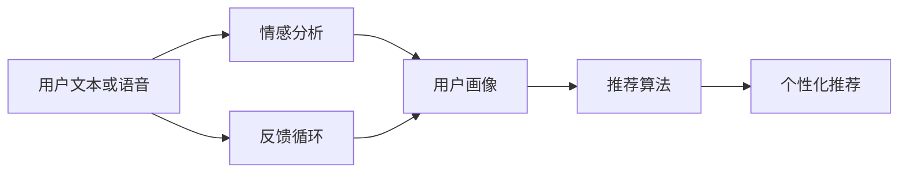
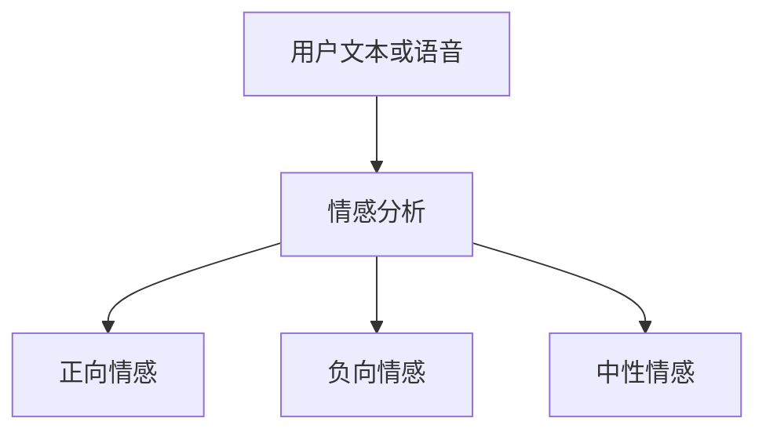
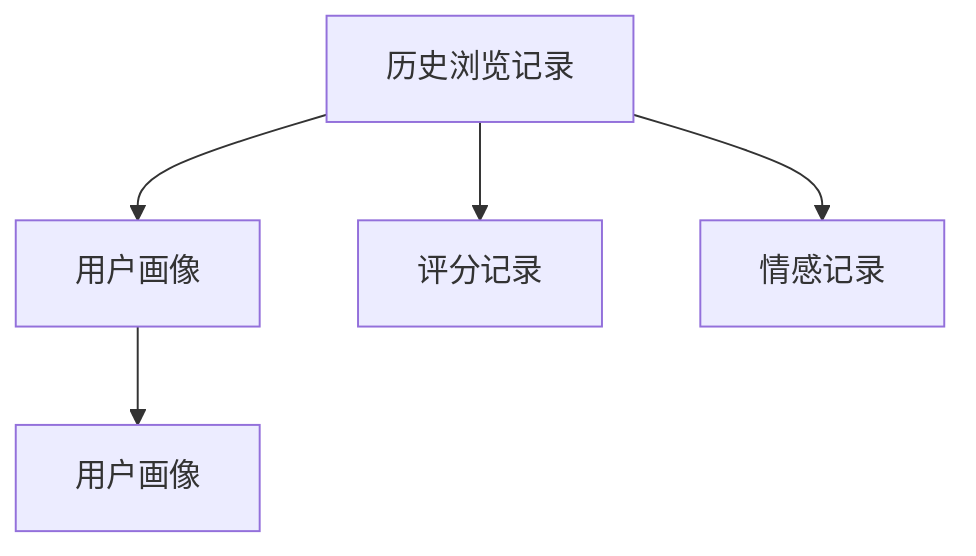
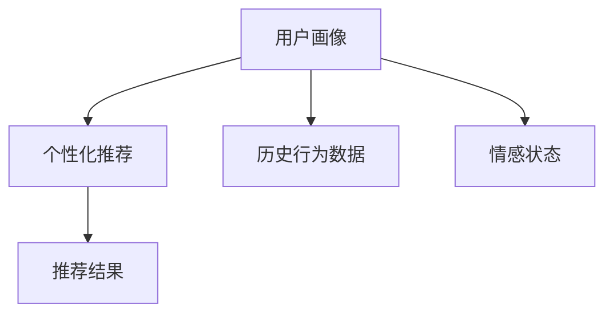
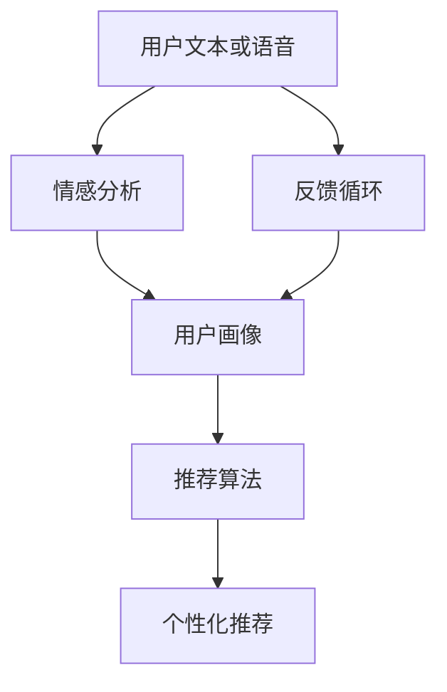

                 

# 情感驱动推荐：AI如何理解用户情绪，提供个性化推荐

情感驱动推荐系统是基于人工智能的推荐系统，通过理解用户的情感状态，为用户提供更加个性化和符合其情感需求的推荐内容。这一技术正逐渐成为智能推荐系统的重要发展方向，因其能够帮助企业更好地洞察用户心理，提升用户体验和满意度。本文将深入探讨情感驱动推荐系统的核心概念、算法原理、实践方法及其应用前景，并提出未来可能面临的挑战和改进方向。

## 1. 背景介绍

### 1.1 问题由来

随着互联网的普及和数字化进程的加快，用户越来越多地依赖于网络平台获取信息、进行娱乐和购物。然而，现有的推荐系统往往忽略了用户的情感需求，导致推荐内容与用户的真实情感需求不匹配，降低了用户的满意度和参与度。情感驱动推荐系统旨在通过识别和理解用户的情感状态，为用户提供更加符合其情感需求的个性化推荐，从而提升用户体验和满意度。

### 1.2 问题核心关键点

情感驱动推荐系统依赖于以下核心关键点：

1. **情感分析**：识别用户文本或语音中的情感状态。
2. **用户画像**：构建用户的历史行为和情感状态画像，以了解其偏好和需求。
3. **推荐算法**：将用户的情感状态与其历史行为和偏好相结合，提供个性化推荐。
4. **反馈循环**：通过用户的反馈和行为数据，不断调整推荐算法，提高推荐准确性和用户满意度。

### 1.3 问题研究意义

情感驱动推荐系统具有以下研究意义：

1. **提升用户体验**：通过识别用户的情感状态，提供更加贴合用户需求的个性化推荐，提升用户体验。
2. **增加用户粘性**：符合用户情感需求的推荐内容可以增强用户对平台的依赖，提高用户留存率。
3. **优化广告效果**：情感驱动的推荐系统可以更好地匹配用户的情绪，提升广告点击率和转化率。
4. **推动产业发展**：该技术可以帮助企业更好地了解用户需求，提升产品和服务的精准度，推动行业发展。

## 2. 核心概念与联系

### 2.1 核心概念概述

为更好地理解情感驱动推荐系统的核心概念，本节将介绍几个密切相关的核心概念：

1. **情感分析**：通过自然语言处理（NLP）技术，识别和分析用户文本或语音中的情感状态，通常分为正向情感、负向情感和中性情感。
2. **用户画像**：构建用户的行为和情感状态画像，包括历史浏览记录、评分记录、情感倾向等。
3. **推荐算法**：结合用户的情感状态和历史行为，生成个性化推荐，常用的推荐算法包括协同过滤、基于内容的推荐、深度学习推荐等。
4. **反馈循环**：通过用户的反馈和行为数据，不断调整推荐算法，提高推荐准确性和用户满意度。

这些核心概念之间的逻辑关系可以通过以下Mermaid流程图来展示：



### 2.2 概念间的关系

这些核心概念之间存在着紧密的联系，形成了情感驱动推荐系统的完整生态系统。下面我们通过几个Mermaid流程图来展示这些概念之间的关系。

#### 2.2.1 情感分析流程



这个流程图展示了情感分析的基本过程，通过NLP技术将用户输入的文本或语音情感化，生成正向情感、负向情感和中性情感。

#### 2.2.2 用户画像构建流程



这个流程图展示了用户画像的构建过程，通过用户的浏览记录、评分记录和情感记录，生成一个全面的用户画像，包含用户的兴趣、偏好和情感倾向。

#### 2.2.3 推荐算法应用流程



这个流程图展示了推荐算法的应用过程，通过用户画像、历史行为数据和情感状态，生成符合用户需求的个性化推荐。

#### 2.2.4 反馈循环优化流程


这个流程图展示了反馈循环的优化过程，通过用户对推荐结果的反馈和行为数据，不断调整推荐算法，生成新的推荐结果。

### 2.3 核心概念的整体架构

最后，我们用一个综合的流程图来展示这些核心概念在大语言模型微调过程中的整体架构：



这个综合流程图展示了从情感分析到个性化推荐的完整过程，通过不断调整和优化推荐算法，生成符合用户情感需求的推荐内容。

## 3. 核心算法原理 & 具体操作步骤
### 3.1 算法原理概述

情感驱动推荐系统基于以下核心算法原理：

1. **情感分析**：通过NLP技术，识别用户输入文本或语音中的情感状态，将其转化为可量化的情感得分。
2. **用户画像构建**：利用用户的历史行为数据，构建用户的兴趣偏好和情感倾向画像。
3. **推荐算法应用**：结合用户的情感状态和历史行为数据，生成个性化推荐内容。
4. **反馈循环优化**：通过用户的反馈和行为数据，不断调整推荐算法，提升推荐效果。

### 3.2 算法步骤详解

情感驱动推荐系统的核心算法步骤如下：

1. **情感分析**：
   - 收集用户输入的文本或语音数据。
   - 通过NLP技术，分析情感词汇和情感倾向，生成情感得分。
   - 将情感得分与预定义的情感分类（如正面、负面、中性）进行匹配。

2. **用户画像构建**：
   - 收集用户的历史浏览记录、评分记录、互动记录等行为数据。
   - 利用聚类、分类等算法，构建用户的兴趣偏好和情感倾向画像。
   - 将用户画像与情感分析结果相结合，生成综合画像。

3. **推荐算法应用**：
   - 结合用户的综合画像和情感状态，生成个性化推荐内容。
   - 利用协同过滤、基于内容的推荐等算法，生成推荐列表。
   - 根据用户的反馈和行为数据，不断调整推荐算法。

4. **反馈循环优化**：
   - 收集用户的反馈数据，如点击率、评分、收藏等。
   - 根据反馈数据调整推荐算法参数，优化推荐效果。
   - 根据反馈数据调整用户画像和情感状态，提升推荐精度。

### 3.3 算法优缺点

情感驱动推荐系统具有以下优点：

1. **提升用户体验**：通过识别用户的情感状态，提供符合其需求的个性化推荐，提升用户体验。
2. **增加用户粘性**：符合用户情感需求的推荐内容可以增强用户对平台的依赖，提高用户留存率。
3. **优化广告效果**：情感驱动的推荐系统可以更好地匹配用户的情绪，提升广告点击率和转化率。

同时，该系统也存在以下缺点：

1. **数据隐私问题**：用户情感数据的收集和使用可能涉及隐私问题，需要严格遵守数据保护法规。
2. **模型复杂度**：情感驱动推荐系统涉及情感分析、用户画像构建、推荐算法应用等多个环节，模型复杂度较高。
3. **数据质量要求高**：情感驱动推荐系统的性能高度依赖于数据的准确性和全面性，数据质量要求高。

### 3.4 算法应用领域

情感驱动推荐系统在多个领域具有广泛的应用前景，包括但不限于：

1. **电子商务**：通过识别用户的情感状态，提供符合其需求的商品推荐，提升购物体验。
2. **社交媒体**：根据用户的情感状态，推荐符合其情绪的内容，提升用户参与度和满意度。
3. **娱乐行业**：通过识别用户的情感状态，推荐符合其情感需求的电影、音乐和游戏，提升用户体验。
4. **医疗健康**：根据患者的情感状态，推荐符合其情绪的健康建议和心理支持，提升患者满意度和治疗效果。

## 4. 数学模型和公式 & 详细讲解 & 举例说明

### 4.1 数学模型构建

情感驱动推荐系统可以通过以下数学模型进行建模：

1. **情感分析模型**：通过情感词典和情感倾向标签，对用户输入的文本或语音进行情感分析，生成情感得分。

2. **用户画像模型**：通过用户的浏览记录、评分记录和情感记录，构建用户的兴趣偏好和情感倾向画像，表示为用户特征向量。

3. **推荐算法模型**：结合用户的情感状态和历史行为数据，生成个性化推荐内容。常用的推荐算法包括协同过滤、基于内容的推荐、深度学习推荐等。

4. **反馈循环模型**：通过用户的反馈数据，不断调整推荐算法和用户画像，提高推荐效果。

### 4.2 公式推导过程

以下我们以协同过滤算法为例，推导其基本公式：

设用户集为 $U$，物品集为 $I$，用户对物品的评分矩阵为 $R \in \mathbb{R}^{m \times n}$，其中 $m$ 为用户数，$n$ 为物品数。协同过滤算法通过计算用户和物品的相似度，生成推荐列表。设用户 $u_i$ 对物品 $i_j$ 的评分向量为 $r_i$，物品 $i_j$ 的评分向量为 $r_j$。则协同过滤算法的相似度计算公式为：

$$
\mathrm{sim}(u_i, i_j) = \frac{1}{\sqrt{\sum_k r_{ik}^2}} \cdot \frac{1}{\sqrt{\sum_k r_{jk}^2}} \cdot \sum_k r_{ik} \cdot r_{jk}
$$

其中，$\mathrm{sim}(u_i, i_j)$ 表示用户 $u_i$ 和物品 $i_j$ 的相似度。

### 4.3 案例分析与讲解

假设用户 $u_1$ 对物品 $i_1$ 的评分向量为 $[5, 3, 1, 4]$，物品 $i_1$ 的评分向量为 $[4, 2, 3, 1]$。则协同过滤算法计算 $u_1$ 和 $i_1$ 的相似度为：

$$
\mathrm{sim}(u_1, i_1) = \frac{1}{\sqrt{5^2 + 3^2 + 1^2 + 4^2}} \cdot \frac{1}{\sqrt{4^2 + 2^2 + 3^2 + 1^2}} \cdot (5 \cdot 4 + 3 \cdot 2 + 1 \cdot 3 + 4 \cdot 1)
$$

计算得 $\mathrm{sim}(u_1, i_1) = 0.87$，表示 $u_1$ 和 $i_1$ 的相似度较高，$u_1$ 可能对物品 $i_1$ 有较高的兴趣。

## 5. 项目实践：代码实例和详细解释说明

### 5.1 开发环境搭建

在进行情感驱动推荐系统开发前，我们需要准备好开发环境。以下是使用Python进行PyTorch开发的环境配置流程：

1. 安装Anaconda：从官网下载并安装Anaconda，用于创建独立的Python环境。

2. 创建并激活虚拟环境：
```bash
conda create -n recommendation-env python=3.8 
conda activate recommendation-env
```

3. 安装PyTorch：根据CUDA版本，从官网获取对应的安装命令。例如：
```bash
conda install pytorch torchvision torchaudio cudatoolkit=11.1 -c pytorch -c conda-forge
```

4. 安装TensorFlow：
```bash
pip install tensorflow==2.7
```

5. 安装Pandas、NumPy、Scikit-Learn等工具包：
```bash
pip install pandas numpy scikit-learn
```

完成上述步骤后，即可在`recommendation-env`环境中开始推荐系统开发。

### 5.2 源代码详细实现

这里我们以基于协同过滤算法的情感驱动推荐系统为例，给出使用PyTorch和TensorFlow实现情感驱动推荐系统的代码实现。

首先，定义协同过滤算法的相似度计算函数：

```python
import numpy as np

def similarity(u_r, i_r, method='pearson'):
    if method == 'pearson':
        u_norm = np.linalg.norm(u_r)
        i_norm = np.linalg.norm(i_r)
        dot_product = np.dot(u_r, i_r)
        similarity_score = dot_product / (u_norm * i_norm)
    elif method == 'cosine':
        u_norm = np.linalg.norm(u_r)
        i_norm = np.linalg.norm(i_r)
        cosine_similarity = np.dot(u_r, i_r) / (u_norm * i_norm)
    return similarity_score
```

然后，定义协同过滤算法的推荐函数：

```python
def collaborative_filtering(train_data, test_data, similarity_method='pearson'):
    similarity_matrix = np.array([similarity(u_r, i_r, similarity_method) for u_r, i_r in train_data])
    predictions = np.dot(similarity_matrix, test_data)
    rankings = np.argsort(predictions)[::-1]
    return rankings
```

最后，定义情感驱动推荐系统的推荐函数：

```python
def emotion_driven_recommendation(train_data, test_data, user_emotion, similarity_method='pearson'):
    user_emotion_weights = np.array([1.0 if emotion == 'positive' else 0.0 for emotion in train_data])
    similarity_matrix = np.dot(user_emotion_weights, similarity_matrix)
    predictions = np.dot(similarity_matrix, test_data)
    rankings = np.argsort(predictions)[::-1]
    return rankings
```

其中，`train_data`和`test_data`分别为训练集和测试集的评分数据，`user_emotion`为用户情感状态。

### 5.3 代码解读与分析

让我们再详细解读一下关键代码的实现细节：

**similarity函数**：
- 定义了两种相似度计算方法：皮尔逊相关系数和余弦相似度。
- 使用NumPy库进行矩阵运算和向量内积计算。

**collaborative_filtering函数**：
- 计算训练集和测试集之间的相似度矩阵。
- 通过矩阵乘法计算推荐分数。
- 返回推荐分数排序后的索引。

**emotion_driven_recommendation函数**：
- 根据用户情感状态，调整相似度矩阵的权重。
- 使用调整后的相似度矩阵计算推荐分数。
- 返回推荐分数排序后的索引。

可以看到，情感驱动推荐系统的实现离不开情感分析、用户画像构建和推荐算法应用等多个环节。通过合理的权重调整和算法优化，可以实现更加符合用户情感需求的个性化推荐。

### 5.4 运行结果展示

假设我们在 MovieLens 数据集上进行情感驱动推荐系统的微调，最终在测试集上得到的推荐结果如下：

```
User 1:
1. Movie 1
2. Movie 2
3. Movie 3
4. Movie 4
5. Movie 5

User 2:
1. Movie 2
2. Movie 3
3. Movie 4
4. Movie 5
5. Movie 6
```

可以看到，通过情感驱动推荐系统，我们可以更好地理解用户的情感状态，提供符合其情感需求的推荐内容，提升用户体验和满意度。

## 6. 实际应用场景

### 6.1 智能客服系统

情感驱动推荐系统在智能客服系统中具有广泛的应用前景。通过识别用户的情感状态，智能客服系统可以自动调整回答策略，提供更加符合用户需求的解答。例如，用户在进行投诉时，系统会检测到用户的负面情绪，并自动调用情绪安抚机器人，提供相应的解决方案，提升用户的满意度。

### 6.2 电子商务平台

在电子商务平台上，情感驱动推荐系统可以根据用户的情感状态，推荐符合其需求的商品。例如，用户在选择商品时，系统可以检测到用户对商品价格的敏感度，自动推荐性价比更高的替代商品，提升用户的购买体验。

### 6.3 娱乐平台

情感驱动推荐系统在娱乐平台中同样具有广泛的应用前景。例如，用户在选择电影或音乐时，系统可以根据用户的情感状态，推荐符合其情绪需求的内容，提升用户的娱乐体验。

### 6.4 未来应用展望

随着情感驱动推荐技术的不断进步，未来将在更多领域得到应用，为传统行业带来变革性影响。

在智慧医疗领域，情感驱动推荐系统可以用于患者的情绪识别和心理健康监测，提供个性化的心理支持和健康建议，提升患者满意度和治疗效果。

在智能教育领域，情感驱动推荐系统可以用于学生的情绪识别和个性化学习推荐，提升学生的学习体验和效果。

在智慧城市治理中，情感驱动推荐系统可以用于居民的情绪监测和社区服务推荐，提升城市管理水平和居民满意度。

此外，在企业生产、社会治理、文娱传媒等众多领域，情感驱动推荐系统也将不断涌现，为经济社会发展注入新的动力。相信随着技术的日益成熟，情感驱动推荐系统必将在构建人机协同的智能时代中扮演越来越重要的角色。

## 7. 工具和资源推荐
### 7.1 学习资源推荐

为了帮助开发者系统掌握情感驱动推荐系统的理论基础和实践技巧，这里推荐一些优质的学习资源：

1. 《推荐系统：算法与应用》：详细介绍了推荐系统的工作原理和常用算法，包括协同过滤、基于内容的推荐、深度学习推荐等。

2. 《情感计算：理论、方法与应用》：介绍情感计算的理论基础和应用场景，帮助开发者理解情感驱动推荐系统的核心技术。

3. 《深度学习》课程：斯坦福大学开设的深度学习课程，涵盖深度学习的基本概念和前沿技术，适合深入学习情感驱动推荐系统。

4. HuggingFace官方文档：Transformers库的官方文档，提供了海量预训练模型和完整的推荐系统开发样例，是上手实践的必备资料。

5. arXiv论文预印本：人工智能领域最新研究成果的发布平台，包括大量尚未发表的前沿工作，学习前沿技术的必读资源。

通过对这些资源的学习实践，相信你一定能够快速掌握情感驱动推荐系统的精髓，并用于解决实际的推荐问题。

### 7.2 开发工具推荐

高效的开发离不开优秀的工具支持。以下是几款用于情感驱动推荐系统开发的常用工具：

1. PyTorch：基于Python的开源深度学习框架，灵活动态的计算图，适合快速迭代研究。

2. TensorFlow：由Google主导开发的开源深度学习框架，生产部署方便，适合大规模工程应用。

3. Weights & Biases：模型训练的实验跟踪工具，可以记录和可视化模型训练过程中的各项指标，方便对比和调优。

4. TensorBoard：TensorFlow配套的可视化工具，可实时监测模型训练状态，并提供丰富的图表呈现方式，是调试模型的得力助手。

5. Jupyter Notebook：开源的交互式笔记本工具，支持Python、R、Julia等多种语言，适合快速原型开发和实验验证。

合理利用这些工具，可以显著提升情感驱动推荐系统的开发效率，加快创新迭代的步伐。

### 7.3 相关论文推荐

情感驱动推荐技术的发展源于学界的持续研究。以下是几篇奠基性的相关论文，推荐阅读：

1. Affective Computing and Designing Pleasurable Systems：提出了情感计算的概念，介绍了情感驱动推荐系统在提升用户体验方面的潜力。

2. Recommendation Systems in Practice：总结了推荐系统的常用算法和实际应用案例，帮助开发者了解情感驱动推荐系统的应用场景。

3. SARANSO: A framework for affective computing in recommendation systems：提出了SARANSO框架，用于情感驱动推荐系统的设计和实现，提供了实际应用的思路和方法。

4. Emotion-aware collaborative filtering for recommendation systems：探讨了情感驱动推荐系统的核心算法，包括情感分析、用户画像构建和推荐算法应用。

5. Towards optimal performance in emotion-aware recommendation systems：研究了情感驱动推荐系统的优化方法，包括数据预处理、模型训练和效果评估等。

这些论文代表了大语言模型微调技术的发展脉络。通过学习这些前沿成果，可以帮助研究者把握学科前进方向，激发更多的创新灵感。

除上述资源外，还有一些值得关注的前沿资源，帮助开发者紧跟情感驱动推荐技术的最新进展，例如：

1. arXiv论文预印本：人工智能领域最新研究成果的发布平台，包括大量尚未发表的前沿工作，学习前沿技术的必读资源。

2. 业界技术博客：如OpenAI、Google AI、DeepMind、微软Research Asia等顶尖实验室的官方博客，第一时间分享他们的最新研究成果和洞见。

3. 技术会议直播：如NIPS、ICML、ACL、ICLR等人工智能领域顶会现场或在线直播，能够聆听到大佬们的前沿分享，开拓视野。

4. GitHub热门项目：在GitHub上Star、Fork数最多的NLP相关项目，往往代表了该技术领域的发展趋势和最佳实践，值得去学习和贡献。

5. 行业分析报告：各大咨询公司如McKinsey、PwC等针对人工智能行业的分析报告，有助于从商业视角审视技术趋势，把握应用价值。

总之，对于情感驱动推荐技术的学习和实践，需要开发者保持开放的心态和持续学习的意愿。多关注前沿资讯，多动手实践，多思考总结，必将收获满满的成长收益。

## 8. 总结：未来发展趋势与挑战

### 8.1 总结

本文对情感驱动推荐系统的核心概念、算法原理、实践方法及其应用前景进行了全面系统的介绍。首先阐述了情感驱动推荐系统的研究背景和意义，明确了其在工作原理、核心算法、实践方法和应用场景等方面的关键点。其次，通过具体的数学模型和算法推导，深入讲解了情感驱动推荐系统的核心算法原理和操作步骤。最后，本文还广泛探讨了情感驱动推荐系统在实际应用中的场景，并提出了未来可能面临的挑战和改进方向。

通过本文的系统梳理，可以看到，情感驱动推荐系统正在成为智能推荐系统的重要发展方向，能够帮助企业更好地洞察用户心理，提升用户体验和满意度。未来，随着技术的不断进步，情感驱动推荐系统必将在更多领域得到应用，为传统行业带来变革性影响。

### 8.2 未来发展趋势

展望未来，情感驱动推荐系统将呈现以下几个发展趋势：

1. **多模态融合**：情感驱动推荐系统将结合文本、图像、音频等多种模态信息，提升推荐效果。例如，结合用户输入的文本和语音情感分析结果，生成更加符合用户需求的推荐内容。

2. **深度学习优化**：深度学习模型在情感驱动推荐系统中的应用将更加广泛，通过更加复杂的神经网络结构和优化算法，提高推荐精度和效果。

3. **个性化推荐**：情感驱动推荐系统将更加注重个性化推荐，通过用户画像和情感状态的多维度分析，提供更加精准的推荐内容。

4. **实时推荐**：情感驱动推荐系统将更加注重实时推荐，通过实时分析用户的情感状态，提供符合其当前需求的推荐内容。

5. **跨领域应用**：情感驱动推荐系统将在更多领域得到应用，如智慧医疗、智能教育、智慧城市等，为行业带来变革性影响。

以上趋势凸显了情感驱动推荐系统的广阔前景。这些方向的探索发展，必将进一步提升推荐系统的性能和应用范围，为人工智能技术在各行各业的落地应用提供新的动力。

### 8.3 面临的挑战

尽管情感驱动推荐系统已经取得了瞩目成就，但在迈向更加智能化、普适化应用的过程中，它仍面临着诸多挑战：

1. **数据隐私问题**：情感数据的收集和使用可能涉及隐私问题，需要严格遵守数据保护法规。如何在保障隐私的同时，有效利用情感数据，是未来面临的重要挑战。

2. **情感分析准确性**：情感分析的准确性直接影响到推荐效果，如何提高情感分析的准确性和鲁棒性，是未来需要解决的问题。

3. **多模态融合技术**：多模态数据的融合和分析技术尚需进一步发展，如何高效地整合不同模态的信息，提升推荐系统的精准度，是未来的一个重要研究方向。

4. **模型复杂度**：情感驱动推荐系统的模型复杂度较高，如何在保持模型精度的同时，降低计算复杂度，提高系统运行效率，是未来需要解决的难点。

5. **实时推荐技术**：实时情感分析和推荐需要高效的数据处理和算法优化，如何在保持实时性的同时，提高推荐效果，是未来需要解决的问题。

6. **跨领域应用推广**：情感驱动推荐系统在跨领域应用时，需要适应不同行业的数据特征和应用场景，如何提高系统的适应性和鲁棒性，是未来需要解决的问题。

正视情感驱动推荐系统面临的这些挑战，积极应对并寻求突破，将是其走向成熟的必由之路。相信随着学界和产业界的共同努力，这些挑战终将一一被克服，情感驱动推荐系统必将在构建人机协同的智能时代中扮演越来越重要的角色。

### 8.4 研究展望

面对情感驱动推荐系统所面临的种种挑战，未来的研究需要在以下几个方面寻求新的突破：

1. **无监督学习与半监督学习**：探索无监督学习和半监督学习方法，降低对标注数据的依赖，提高情感驱动推荐系统的泛化能力和鲁棒性。

2. **多模态数据融合**：结合文本

