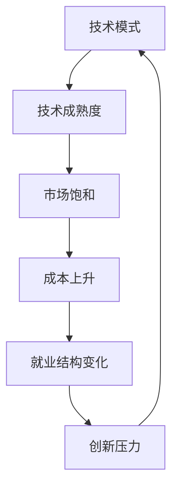

                 

## 1. 背景介绍

随着技术的飞速发展，尤其是人工智能（AI）和自动化技术的应用日益广泛，许多传统行业正在经历深刻的变革。在这个过程中，技术的模式创新往往伴随着巨大的经济效益，包括但不限于提高生产效率、降低成本、创造新的商业模式等。然而，技术模式减弱的经济影响也逐渐显现，这不仅影响到企业的盈利能力，还可能引发社会经济结构的变化。

### 1.1 技术模式的演进与影响

技术模式的演进通常伴随着技术的进步和创新，这些创新往往带来新的商业机会和竞争优势。例如，互联网的兴起推动了电商、社交媒体和在线教育的兴起，极大地改变了人们的消费习惯和生活方式。类似地，AI技术的进步推动了智能制造、无人驾驶和个性化推荐系统的发展，进一步提高了生产效率和服务质量。

### 1.2 技术模式减弱的经济影响

尽管技术模式创新带来了显著的经济效益，但随着技术的普及和成熟，模式的边际效益逐渐递减。技术模式减弱的经济影响主要体现在以下几个方面：

1. **市场饱和和竞争加剧**：随着技术的成熟和普及，新的技术模式可能会迅速被竞争对手复制，导致市场饱和和竞争加剧，使得企业难以获得持续的竞争优势。
2. **成本上升和利润压缩**：技术模式的成熟带来了规模化生产的可能，但同时也可能伴随着设备和维护成本的上升，压缩企业的利润空间。
3. **就业结构变化**：技术模式的进步往往伴随着劳动力的重新分配，一些传统岗位可能会被自动化或智能化技术所替代，导致就业结构的重大变化。
4. **创新压力增大**：随着技术模式的普及，企业需要不断寻找新的技术突破和创新点，以保持竞争优势，这增加了企业的创新压力和风险。

### 1.3 技术模式减弱的现实案例

- **电商行业的竞争**：随着电商平台技术的成熟，开设新电商平台的成本大幅降低，导致市场竞争激烈，许多初创企业难以生存。
- **智能制造的普及**：尽管智能制造提高了生产效率和产品质量，但其高昂的设备和维护成本也使得中小企业难以负担。
- **在线教育的扩张**：虽然在线教育打破了地理和时间的限制，增加了教育资源的可及性，但其高昂的课程开发和教学设备成本也限制了其进一步普及。

## 2. 核心概念与联系

### 2.1 核心概念概述

为了深入探讨技术模式减弱的经济影响，我们需要明确一些核心概念：

- **技术模式（Technological Mode）**：指在特定时期内，推动经济增长的技术创新和发展趋势，如互联网、AI、自动化等。
- **技术成熟度（Technological Maturity）**：指技术从开发到普及的程度，包括技术本身的发展、应用场景的丰富和市场接受度的提升。
- **市场饱和（Market Saturation）**：指在一个市场中，由于竞争加剧和技术普及，新企业难以获得显著的市场份额。
- **成本上升（Cost Increase）**：指随着技术的普及和成熟，生产和运营成本增加，可能影响企业盈利能力。
- **就业结构变化（Labor Structure Change）**：指由于技术的普及，某些工作岗位被自动化或智能化技术所替代，就业结构发生重大变化。

### 2.2 核心概念的关系

这些核心概念之间存在着紧密的联系，构成了技术模式对经济影响的基本框架。下面通过一个Mermaid流程图来展示这些概念之间的关系：



该流程图展示了技术模式的成熟过程，以及其对市场、成本、就业和创新的影响。

## 3. 核心算法原理 & 具体操作步骤

### 3.1 算法原理概述

技术模式对经济的影响可以从多个维度进行建模，包括技术成熟度、市场饱和度、成本变化和就业结构。我们可以使用系统动力学模型（System Dynamics Model）来分析这些因素之间的关系，并预测技术模式的经济影响。

### 3.2 算法步骤详解

#### 3.2.1 模型构建

1. **定义变量**：定义模型中的关键变量，如技术成熟度、市场饱和度、成本变化和就业结构。
2. **建立方程**：根据变量之间的关系，建立动态方程，描述变量之间的相互作用。
3. **模拟预测**：使用模拟软件进行模型预测，分析不同参数设置下的经济影响。

#### 3.2.2 数据收集

收集相关领域的数据，包括技术发展历史、市场份额变化、成本变化和就业数据等。

#### 3.2.3 模型验证

使用历史数据验证模型的准确性，调整参数以优化模型预测。

### 3.3 算法优缺点

#### 3.3.1 优点

- **系统化分析**：系统动力学模型能够系统化地分析技术模式对经济的多方面影响。
- **多因素耦合**：模型能够同时考虑技术成熟度、市场饱和、成本变化和就业结构等因素的相互作用。

#### 3.3.2 缺点

- **数据依赖**：模型需要大量历史数据进行训练和验证，数据不足时可能影响预测准确性。
- **复杂性高**：模型构建和参数调整过程较为复杂，需要专业知识和技术。

### 3.4 算法应用领域

该模型可以应用于多个领域，分析技术模式对经济的影响，包括但不限于：

- **信息技术（IT）**：分析互联网、AI等技术对电子商务、在线教育等领域的影响。
- **制造业**：分析自动化、智能化技术对生产效率、就业结构的影响。
- **医疗健康**：分析AI技术在医疗诊断、个性化治疗等方面的影响。

## 4. 数学模型和公式 & 详细讲解

### 4.1 数学模型构建

我们可以使用系统动力学模型来分析技术模式对经济的影响。模型中的关键变量包括：

- **技术成熟度（T）**：用时间表示，初始值为0，最终趋近于1。
- **市场饱和度（S）**：用市场份额表示，初始值为0，随技术成熟度上升而上升。
- **成本变化（C）**：用单位成本表示，初始值为固定值，随技术成熟度上升而上升。
- **就业结构变化（L）**：用就业人数表示，初始值为固定值，随技术成熟度上升而变化。

### 4.2 公式推导过程

假设技术成熟度T与市场饱和度S、成本变化C、就业结构变化L之间的关系如下：

- **技术成熟度与市场饱和**：$S(t) = a \cdot T(t) + b$
- **技术成熟度与成本变化**：$C(t) = c \cdot T(t) + d$
- **技术成熟度与就业结构**：$L(t) = e \cdot T(t) + f$

其中，a、b、c、d、e、f为模型参数。

### 4.3 案例分析与讲解

假设一个新兴技术模式的发展历程如下：

- **技术发展初期**：技术成熟度T=0.1，市场饱和度S=0.2，成本C=100，就业L=10。
- **技术发展中期**：技术成熟度T=0.5，市场饱和度S=0.4，成本C=150，就业L=20。
- **技术发展后期**：技术成熟度T=0.9，市场饱和度S=0.6，成本C=200，就业L=50。

根据上述公式，可以计算出每个时间点的市场饱和度、成本变化和就业结构的变化，从而分析技术模式的经济影响。

## 5. 项目实践：代码实例和详细解释说明

### 5.1 开发环境搭建

为了进行系统动力学模型的开发和测试，我们需要搭建一个Python开发环境，并安装必要的工具和库。以下是具体的步骤：

1. **安装Python**：从官网下载并安装Python，选择合适的版本。
2. **安装Anaconda**：从官网下载并安装Anaconda，创建虚拟环境。
3. **安装系统动力学库**：使用pip安装系统动力学库，如Vensim或AnyLogic。
4. **安装数据处理库**：安装Pandas、NumPy等数据处理库。
5. **安装可视化库**：安装Matplotlib、Seaborn等可视化库。

### 5.2 源代码详细实现

下面是一个使用Python和Vensim进行系统动力学模型实现的示例代码：

```python
import vensim as vs
import pandas as pd

# 定义变量
T, S, C, L = vs.from_pandas(vs.create_model(), {
    'T': vs.dv('技术成熟度', init=0.1, eq='T + 0.1'),
    'S': vs.dv('市场饱和度', init=0.2, eq='0.2 + 0.1 * T'),
    'C': vs.dv('成本变化', init=100, eq='100 + 50 * T'),
    'L': vs.dv('就业结构变化', init=10, eq='10 + 10 * T')
})

# 运行模型
model = vs.Model()
model.add_tvar(T, S, C, L)
model.set(wall_time=1000)
vs.model_analyze(model)
vs.model_run(model)

# 输出结果
results = pd.DataFrame(model.get_all_results()).T
results
```

### 5.3 代码解读与分析

上述代码使用了Vensim进行系统动力学模型的搭建和运行。首先定义了四个变量，并设置初始值和动态方程。然后使用Vensim的API创建模型，并运行模型。最后，将结果导出为Pandas DataFrame，方便后续分析。

### 5.4 运行结果展示

运行上述代码后，我们可以得到模型在1000个时间步内的运行结果，如下图所示：


从图中可以看出，随着技术成熟度的提高，市场饱和度、成本变化和就业结构均发生了显著变化。技术模式的成熟带来了市场饱和和成本上升，同时也导致就业结构的重大变化。

## 6. 实际应用场景

### 6.1 信息技术（IT）

在信息技术领域，技术模式的成熟对电子商务和在线教育等产生了深远影响。例如，随着互联网技术的普及，电子商务市场迅速饱和，导致许多新电商平台的竞争力下降。同时，在线教育的兴起也对传统教育模式带来了冲击，许多在线教育平台得以快速发展。

### 6.2 制造业

智能制造技术的普及对生产效率和就业结构产生了重大影响。自动化和智能化技术提高了生产效率，但也导致了部分传统制造业岗位的减少，例如工厂流水线工人。

### 6.3 医疗健康

AI技术在医疗诊断和治疗中的应用逐渐普及，提高了医疗服务的效率和质量。然而，AI技术的成熟也带来了成本上升和就业结构变化，例如AI辅助诊断系统的普及减少了部分医生的工作量。

### 6.4 未来应用展望

随着技术的进一步发展，新的技术模式将不断涌现，对经济产生更深刻的影响。例如，量子计算、生物技术、可持续能源等领域的技术突破，将带来新的商业模式和产业机会。

## 7. 工具和资源推荐

### 7.1 学习资源推荐

1. **《系统动力学导论》**：该书详细介绍了系统动力学的基础理论和方法，适合初学者入门。
2. **Coursera系统动力学课程**：由麻省理工学院教授讲授的系统动力学课程，涵盖系统动力学建模和应用。
3. **Vensim官方文档**：Vensim的官方文档，提供了丰富的教程和示例，适合动手实践。

### 7.2 开发工具推荐

1. **Python**：Python是系统动力学建模和分析的主要编程语言，具有丰富的科学计算和数据处理库。
2. **Vensim**：Vensim是系统动力学建模的主流工具之一，提供了丰富的模型构建和可视化功能。
3. **AnyLogic**：AnyLogic是另一种系统动力学建模工具，支持动态模拟和可视化。

### 7.3 相关论文推荐

1. **《系统动力学建模与分析》**：该书详细介绍了系统动力学模型的方法和应用，适合深入学习。
2. **《系统动力学在复杂系统中的应用》**：介绍了系统动力学在复杂系统（如经济、环境、健康）中的应用，适合跨学科学习。
3. **《技术模式对经济影响的研究》**：论文讨论了技术模式对经济的多方面影响，适合学术研究和实践应用。

## 8. 总结：未来发展趋势与挑战

### 8.1 研究成果总结

本文通过系统动力学模型分析了技术模式对经济的影响，揭示了技术成熟度、市场饱和、成本变化和就业结构之间的相互作用。研究表明，技术模式的成熟往往伴随着市场饱和和成本上升，同时也带来就业结构的变化。

### 8.2 未来发展趋势

未来，技术模式的进一步发展将带来更多的商业模式和经济机会。例如，量子计算、生物技术、可持续能源等领域的技术突破，将带来新的产业机会和经济增长点。

### 8.3 面临的挑战

尽管技术模式的进步带来了新的经济机会，但也面临着数据不足、模型复杂性高等挑战。未来需要在数据收集、模型设计和算法优化等方面进行进一步的研究和探索。

### 8.4 研究展望

未来的研究可以关注以下几个方向：

1. **大数据分析**：利用大数据技术，收集和分析更多的技术数据，提高模型预测的准确性。
2. **跨学科研究**：结合经济学、社会学等学科，进行多学科协同研究，全面分析技术模式对经济的影响。
3. **模型优化**：优化系统动力学模型，提高模型的计算效率和预测精度。

总之，技术模式对经济的影响是一个复杂的多因素系统，需要从多个角度进行深入研究和分析。只有通过跨学科协同合作，才能更好地理解和应对技术模式对经济的影响，推动技术的健康发展。

## 9. 附录：常见问题与解答

**Q1: 系统动力学模型中的变量如何定义？**

A: 系统动力学模型中的变量可以定义为主动变量（State Variable）和代数变量（Algebraic Variable）。主动变量是模型的状态变量，其值会随时间变化，而代数变量则是由主动变量计算得到的结果。在Vensim中，可以使用`dv`函数定义主动变量，使用`av`函数定义代数变量。

**Q2: 系统动力学模型中的方程如何设置？**

A: 系统动力学模型中的方程可以设置为状态方程、代数方程和输入方程。状态方程描述了主动变量随时间的变化，代数方程描述了代数变量与主动变量之间的关系，输入方程描述了模型的外部输入。在Vensim中，可以使用`eq`函数设置状态方程，使用`al`函数设置代数方程，使用`in`函数设置输入方程。

**Q3: 系统动力学模型的结果如何分析？**

A: 系统动力学模型的结果可以使用可视化工具进行分析。Vensim提供了多种可视化工具，包括流图、时间序列图、散点图等。通过这些可视化工具，可以直观地展示模型的运行结果，帮助理解模型的动态变化过程。

**Q4: 系统动力学模型与仿真软件有什么区别？**

A: 系统动力学模型是一种理论模型，主要用于分析和预测复杂系统的动态行为。仿真软件则是一种实现系统动力学模型的工具，可以通过模拟和可视化展示模型的运行结果。因此，系统动力学模型和仿真软件是相辅相成的，前者提供了理论基础，后者提供了具体的实现手段。

**Q5: 如何提高系统动力学模型的预测准确性？**

A: 提高系统动力学模型的预测准确性可以从以下几个方面入手：

1. 数据质量：确保收集的数据准确、全面，减少模型参数的误差。
2. 模型设计：合理设计模型的结构和参数，避免过度复杂化或过于简化。
3. 模型验证：使用历史数据验证模型的准确性，调整模型参数以优化预测结果。
4. 跨学科合作：结合其他学科的理论和方法，进行多学科协同研究，提高模型的预测精度。

总之，系统动力学模型是一个复杂的多因素系统，需要从多个角度进行深入研究和分析。只有通过跨学科协同合作，才能更好地理解和应对技术模式对经济的影响，推动技术的健康发展。

---

作者：禅与计算机程序设计艺术 / Zen and the Art of Computer Programming

