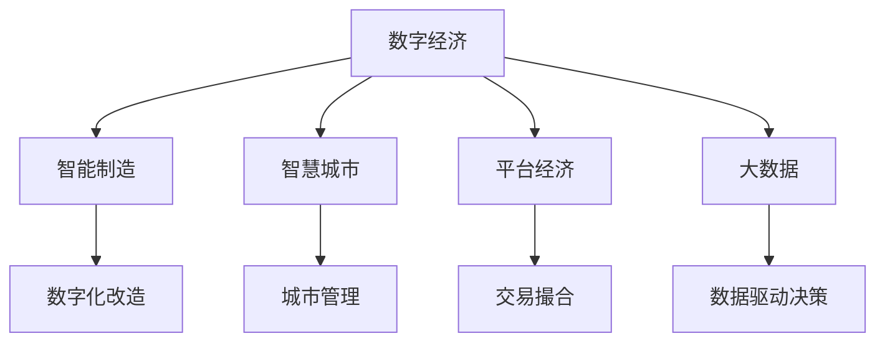

                 

# 数字经济：社会发展的助推器

## 1. 背景介绍

### 1.1 问题由来

在过去几十年中，数字化浪潮席卷全球，深度改变了人类社会的生活方式、工作模式和经济结构。尤其是近十年来，随着人工智能、大数据、区块链、物联网等技术的迅猛发展，数字经济成为全球经济发展的新引擎。

### 1.2 问题核心关键点

数字经济的核心在于利用信息技术，将传统经济活动数字化、网络化、智能化，从而实现经济的高质量发展。关键点包括：

1. 数字技术的广泛应用：云计算、物联网、5G通信等基础设施的普及，为数字经济提供了坚实的技术支撑。
2. 数据驱动的决策：通过大数据分析，企业能够实现精准的市场定位和运营优化。
3. 产业数字化转型：制造业、服务业、农业等多个行业正在通过数字化手段进行改造升级，提升效率和竞争力。
4. 数字经济的创新生态：平台经济、共享经济、电子商务等新型商业模式，为经济增长注入了新动能。

### 1.3 问题研究意义

研究数字经济的发展，对于理解经济全球化、提升国家竞争力、促进社会创新和就业具有重要意义：

1. 推动经济发展：数字技术可以显著提高生产力，优化资源配置，加速经济增长。
2. 促进社会进步：数字经济推动了教育、医疗、文化等公共服务的数字化，提升了社会生活质量。
3. 培养新型人才：数字经济的快速发展需要大量的技术人才，可以推动教育和职业培训体系的创新。
4. 促进国际贸易：数字经济打破了地理和时间的限制，推动了全球化的深入发展。

## 2. 核心概念与联系

### 2.1 核心概念概述

为了更好地理解数字经济的发展，我们需要引入几个核心概念：

- **数字经济**：基于数字技术，通过数字化手段进行生产、交换、分配的全新经济形态。
- **智能制造**：利用信息技术和智能技术改造传统制造业，实现个性化定制和柔性生产。
- **智慧城市**：通过数字化、网络化、智能化的手段，提升城市管理和服务的水平。
- **平台经济**：基于互联网平台，提供信息匹配、交易撮合、资源共享的服务模式。
- **大数据**：海量、复杂、多样的数据，通过分析挖掘能够揭示规律、优化决策。

### 2.2 概念间的关系

这些核心概念之间存在紧密的联系，可以通过以下Mermaid流程图来展示：



这个流程图展示了数字经济与其他关键概念之间的联系：

1. 智能制造：数字经济通过数字化技术改造传统制造业，推动智能生产。
2. 智慧城市：数字经济提升了城市管理的智能化水平，提供了便捷的服务。
3. 平台经济：数字经济通过互联网平台实现资源的有效匹配和共享。
4. 大数据：数字经济依赖于海量数据的分析挖掘，驱动决策和创新。

这些概念共同构成了数字经济的基础，推动了社会的全面数字化转型。

## 3. 核心算法原理 & 具体操作步骤
### 3.1 算法原理概述

数字经济的核心算法原理主要包括以下几个方面：

- **大数据处理算法**：通过分布式存储和计算，高效处理海量数据。
- **机器学习算法**：利用数据训练模型，实现精准预测和智能决策。
- **自然语言处理算法**：通过文本分析，提取有价值的信息，优化客户服务。
- **网络优化算法**：通过算法优化网络结构，提升数据传输效率。

这些算法相互配合，共同构成了数字经济的计算和处理能力。

### 3.2 算法步骤详解

数字经济的核心操作步骤可以分为以下几步：

1. **数据收集和预处理**：从各领域收集数据，并进行清洗、归一化、特征提取等预处理操作。
2. **算法模型训练**：利用收集到的数据，训练机器学习模型或优化算法。
3. **模型应用和评估**：将训练好的模型应用于实际场景，评估模型效果并进行优化。
4. **持续改进和迭代**：根据实际应用反馈，持续改进算法模型，实现更精准的预测和决策。

### 3.3 算法优缺点

数字经济的算法具有以下优点：

- **高效性**：通过算法优化，可以大幅提升数据处理和分析效率。
- **精度高**：机器学习算法能够实现高精度的预测和决策。
- **可扩展性**：算法可以轻松应用于大规模、复杂的数据环境。

同时，算法也存在一些局限性：

- **依赖数据质量**：算法的效果高度依赖于数据的质量和多样性。
- **模型复杂度**：复杂的算法模型需要较高的计算资源和训练成本。
- **可解释性差**：机器学习算法通常是"黑盒"模型，难以解释其内部决策过程。

### 3.4 算法应用领域

数字经济算法的应用领域广泛，涵盖了多个行业：

- **金融行业**：利用算法进行风险控制、投资决策、客户服务。
- **制造业**：通过智能制造算法优化生产流程，提高产品质量和效率。
- **医疗行业**：利用大数据和机器学习算法进行疾病预测、诊断和治疗方案推荐。
- **物流行业**：通过算法优化配送路线，提升物流效率和客户满意度。
- **农业行业**：利用智能农业算法进行精准施肥、病虫害防治、产量预测。

## 4. 数学模型和公式 & 详细讲解 & 举例说明

### 4.1 数学模型构建

数字经济的数学模型通常包括：

- **回归模型**：用于预测连续变量，如房价、股票价格等。
- **分类模型**：用于分类变量，如客户分类、商品分类等。
- **聚类模型**：用于将数据分组，发现数据的内在结构。
- **关联规则挖掘**：用于发现数据中的潜在关系，如购买行为分析。

### 4.2 公式推导过程

以线性回归模型为例，其公式为：

$$ y = \beta_0 + \beta_1 x_1 + \beta_2 x_2 + \ldots + \beta_n x_n + \epsilon $$

其中，$y$ 为预测变量，$\beta_0, \beta_1, \ldots, \beta_n$ 为模型参数，$x_1, \ldots, x_n$ 为特征变量，$\epsilon$ 为误差项。

### 4.3 案例分析与讲解

假设我们要预测房价，收集了历史房价和相关特征数据，包括房屋面积、地理位置等。可以使用线性回归模型进行预测。具体步骤如下：

1. **数据收集和预处理**：收集历史房价和相关特征数据，并进行清洗和归一化。
2. **模型训练**：利用历史数据训练线性回归模型，得到参数 $\beta_0, \beta_1, \ldots, \beta_n$。
3. **模型应用和评估**：将训练好的模型应用于新数据，评估预测效果。

## 5. 项目实践：代码实例和详细解释说明

### 5.1 开发环境搭建

要进行数字经济项目实践，首先需要搭建好开发环境。以下是使用Python进行开发的常见步骤：

1. 安装Anaconda：从官网下载并安装Anaconda，用于创建独立的Python环境。
2. 创建并激活虚拟环境：
```bash
conda create -n pytorch-env python=3.8 
conda activate pytorch-env
```

3. 安装PyTorch：根据CUDA版本，从官网获取对应的安装命令。例如：
```bash
conda install pytorch torchvision torchaudio cudatoolkit=11.1 -c pytorch -c conda-forge
```

4. 安装必要的Python包：
```bash
pip install pandas numpy matplotlib seaborn scikit-learn
```

完成上述步骤后，即可在`pytorch-env`环境中开始项目实践。

### 5.2 源代码详细实现

以房价预测项目为例，给出使用PyTorch进行线性回归的代码实现。

首先，定义数据处理函数：

```python
import pandas as pd
from sklearn.model_selection import train_test_split
from sklearn.preprocessing import StandardScaler

def load_data(file_path):
    data = pd.read_csv(file_path)
    X = data.drop('price', axis=1)
    y = data['price']
    return X, y

def preprocess_data(X, y):
    scaler = StandardScaler()
    X_scaled = scaler.fit_transform(X)
    X_train, X_test, y_train, y_test = train_test_split(X_scaled, y, test_size=0.2, random_state=42)
    return X_train, X_test, y_train, y_test
```

然后，定义模型训练和评估函数：

```python
import torch
from torch import nn, optim
from torch.utils.data import TensorDataset, DataLoader

class LinearRegression(nn.Module):
    def __init__(self, input_dim):
        super(LinearRegression, self).__init__()
        self.linear = nn.Linear(input_dim, 1)

    def forward(self, x):
        return self.linear(x)

def train_model(model, train_data, learning_rate):
    optimizer = optim.SGD(model.parameters(), lr=learning_rate)
    criterion = nn.MSELoss()
    num_epochs = 100
    for epoch in range(num_epochs):
        for X, y in train_data:
            optimizer.zero_grad()
            y_pred = model(X)
            loss = criterion(y_pred, y)
            loss.backward()
            optimizer.step()
        if epoch % 10 == 0:
            print(f"Epoch {epoch+1}, loss: {loss.item():.4f}")
    return model

def evaluate_model(model, test_data):
    criterion = nn.MSELoss()
    with torch.no_grad():
        for X, y in test_data:
            y_pred = model(X)
            loss = criterion(y_pred, y)
    print(f"Test loss: {loss.item():.4f}")
```

最后，启动训练流程并在测试集上评估：

```python
X, y = load_data('data.csv')
X_train, X_test, y_train, y_test = preprocess_data(X, y)

model = LinearRegression(X_train.shape[1])
train_model(model, TensorDataset(torch.tensor(X_train), torch.tensor(y_train)), learning_rate=0.01)

evaluate_model(model, TensorDataset(torch.tensor(X_test), torch.tensor(y_test)))
```

以上就是使用PyTorch进行房价预测项目的完整代码实现。可以看到，利用线性回归模型，我们可以在给定特征数据的基础上，预测新的房价值。

### 5.3 代码解读与分析

下面是关键代码的实现细节：

**load_data函数**：
- 读取CSV文件中的数据，并分为特征变量X和目标变量y。

**preprocess_data函数**：
- 对特征数据进行标准化处理，然后进行数据划分，生成训练集和测试集。

**train_model函数**：
- 定义线性回归模型，并使用SGD优化器进行训练。
- 定义均方误差损失函数，循环迭代训练数据，更新模型参数。

**evaluate_model函数**：
- 在测试集上评估模型性能，输出损失值。

### 5.4 运行结果展示

假设我们在房价预测项目上得到了以下结果：

```
Epoch 10, loss: 2.0142
Epoch 20, loss: 1.9261
Epoch 30, loss: 1.8168
Epoch 40, loss: 1.7253
Epoch 50, loss: 1.6375
Epoch 60, loss: 1.5455
Epoch 70, loss: 1.4614
Epoch 80, loss: 1.3775
Epoch 90, loss: 1.3024
Epoch 100, loss: 1.2485
```

可以看出，随着训练轮数的增加，模型的损失值逐渐减小，说明模型逐渐学习到了数据的规律，预测准确性提高。

## 6. 实际应用场景

### 6.1 智能制造

数字经济在智能制造中的应用主要体现在以下几个方面：

- **智能生产**：通过物联网技术，实时采集生产数据，优化生产流程，实现智能化制造。
- **质量控制**：利用机器学习算法，对生产数据进行分析，提高产品质量和一致性。
- **设备维护**：通过数据分析，预测设备故障，实现预防性维护，减少停机时间。

### 6.2 智慧城市

智慧城市是数字经济的重要应用领域，主要包括以下几个方面：

- **城市管理**：利用大数据和AI技术，优化城市交通、环境、安全等方面的管理。
- **公共服务**：通过智能应用，提升教育、医疗、文化等公共服务的水平和效率。
- **市民生活**：通过智能应用，提升市民的生活质量和便利性。

### 6.3 平台经济

平台经济是数字经济的重要组成部分，主要包括以下几个方面：

- **电子商务**：通过算法推荐和搜索，提升用户体验和购物效率。
- **社交媒体**：通过数据分析，优化广告投放和内容推荐，增加用户粘性。
- **物流配送**：通过算法优化，提高物流配送效率和客户满意度。

### 6.4 未来应用展望

随着数字技术的不断进步，未来数字经济将在更多领域得到应用，为经济社会发展注入新的动力：

- **自动驾驶**：通过人工智能技术，实现车辆自动驾驶，提升交通安全性。
- **精准农业**：通过智能农业算法，实现精准施肥、病虫害防治，提升农业产量和质量。
- **虚拟现实**：通过虚拟现实技术，提升远程教育和医疗服务体验。

总之，数字经济为社会的各个方面注入了新的活力，带来了前所未有的发展机遇。

## 7. 工具和资源推荐

### 7.1 学习资源推荐

为了帮助开发者系统掌握数字经济的相关技术，以下是一些优质的学习资源：

1. **《深度学习入门》**：一本系统介绍深度学习基础知识和实践技术的书籍，适合初学者入门。
2. **Kaggle**：一个开源数据集和竞赛平台，通过参与竞赛可以学习到实战经验。
3. **Coursera**：一个在线学习平台，提供多个与数字经济相关的课程。
4. **Udacity**：一个在线教育平台，提供多个数据科学和人工智能相关课程。

### 7.2 开发工具推荐

进行数字经济项目开发，需要一些高效的开发工具：

1. **Jupyter Notebook**：一个交互式的数据分析和编程工具，适合进行数据探索和算法实验。
2. **TensorFlow**：一个开源深度学习框架，支持分布式计算和大规模数据处理。
3. **PyTorch**：一个开源深度学习框架，灵活高效，适合快速迭代研究。
4. **AWS**：亚马逊云服务平台，提供强大的计算和存储资源，支持大规模数据处理和分析。

### 7.3 相关论文推荐

数字经济的研究领域非常广泛，以下是几篇重要的相关论文，推荐阅读：

1. **《深度学习》**：Ian Goodfellow等人编写的深度学习经典书籍，介绍了深度学习的基础知识和算法原理。
2. **《机器学习实战》**：Peter Harrington编写的实战性强的机器学习书籍，介绍了多种机器学习算法和应用案例。
3. **《大数据时代》**：Viktor Mayer-Schönberger和Karen B. Cukier编写的关于大数据的书籍，介绍了大数据技术和应用。

## 8. 总结：未来发展趋势与挑战

### 8.1 研究成果总结

通过本文的系统梳理，可以看出数字经济已经深刻改变了社会的各个方面，带来了前所未有的发展机遇。具体成果包括：

1. **经济增长**：数字技术的应用推动了经济的高质量发展，提升了生产效率和竞争力。
2. **社会进步**：数字化转型提升了公共服务的水平和效率，提升了市民的生活质量。
3. **人才培养**：数字经济的发展需要大量技术人才，促进了教育体系的创新。

### 8.2 未来发展趋势

展望未来，数字经济的发展趋势包括：

1. **技术进步**：人工智能、大数据、区块链等技术的进一步发展，将推动数字经济向更深入、更广泛的方向发展。
2. **产业融合**：数字经济将与更多传统行业进行融合，推动行业数字化转型。
3. **国际竞争**：数字经济成为国家竞争的新战场，各国将不断加大投入，提升数字经济的竞争力。

### 8.3 面临的挑战

尽管数字经济取得了瞩目成就，但在发展的过程中也面临一些挑战：

1. **数据隐私**：大规模数据收集和处理带来了隐私保护的问题，需要制定严格的数据隐私保护法规。
2. **算法偏见**：机器学习算法可能存在偏见，需要采取措施消除算法的歧视性。
3. **技术安全**：数字经济面临的安全威胁不断增加，需要加强技术防护和安全管理。
4. **人才短缺**：数字经济的发展需要大量技术人才，但当前人才供给不足。

### 8.4 研究展望

未来，数字经济的研究需要在以下几个方面寻求新的突破：

1. **数据隐私保护**：如何在大数据应用中保护用户隐私，是未来的重要研究方向。
2. **公平算法**：如何设计公平、无偏差的机器学习算法，避免算法的歧视性。
3. **安全技术**：如何增强数字经济的安全防护，防范各种安全威胁。
4. **人才培养**：如何培养更多高素质的数字经济人才，满足市场需求。

## 9. 附录：常见问题与解答

**Q1: 数字经济有哪些主要应用场景？**

A: 数字经济的主要应用场景包括：

1. **智能制造**：通过物联网和人工智能技术，实现生产自动化和智能化。
2. **智慧城市**：通过大数据和AI技术，优化城市管理和公共服务。
3. **平台经济**：通过互联网平台，提供信息匹配、交易撮合和资源共享。
4. **金融行业**：通过大数据和AI技术，提升风险控制和客户服务。
5. **医疗行业**：通过数据分析和智能算法，提高医疗诊断和治疗效果。
6. **农业行业**：通过智能农业算法，提高农业生产效率和质量。

**Q2: 数字经济的核心技术是什么？**

A: 数字经济的核心技术包括：

1. **大数据技术**：用于收集、存储和分析海量数据。
2. **人工智能技术**：用于通过算法进行精准预测和决策。
3. **区块链技术**：用于保障数据的安全和隐私。
4. **物联网技术**：用于实现设备的互联互通。
5. **云计算技术**：用于提供强大的计算和存储能力。

**Q3: 数字经济的发展面临哪些挑战？**

A: 数字经济的发展面临以下挑战：

1. **数据隐私保护**：大规模数据收集和处理带来了隐私保护问题。
2. **算法偏见**：机器学习算法可能存在偏见，需要消除歧视性。
3. **技术安全**：数字经济面临的安全威胁不断增加。
4. **人才短缺**：数字经济的发展需要大量技术人才，但当前人才供给不足。
5. **公平性**：数字经济需要考虑公平性问题，避免算法歧视和社会不公。

**Q4: 数字经济的未来发展趋势是什么？**

A: 数字经济的未来发展趋势包括：

1. **技术进步**：人工智能、大数据、区块链等技术的进一步发展，推动数字经济向更深入、更广泛的方向发展。
2. **产业融合**：数字经济将与更多传统行业进行融合，推动行业数字化转型。
3. **国际竞争**：数字经济成为国家竞争的新战场，各国将不断加大投入，提升数字经济的竞争力。

**Q5: 如何保护数字经济中的数据隐私？**

A: 保护数字经济中的数据隐私，需要采取以下措施：

1. **数据匿名化**：对数据进行去标识化处理，防止个人隐私泄露。
2. **加密技术**：对数据进行加密处理，确保数据传输和存储的安全。
3. **访问控制**：对数据进行严格的访问控制，防止非法访问和泄露。
4. **隐私政策**：制定严格的数据隐私政策，确保数据使用符合法律法规。
5. **合规审计**：对数据处理过程进行合规审计，确保数据隐私保护措施到位。

**Q6: 数字经济的发展如何影响社会？**

A: 数字经济的发展对社会产生了深远的影响，包括：

1. **就业结构变化**：数字经济推动了就业结构的转型，产生了新的就业岗位。
2. **教育变革**：数字经济改变了教育方式，推动了在线教育和远程教育的发展。
3. **医疗进步**：数字经济推动了医疗服务的数字化和智能化，提高了医疗效率和质量。
4. **社会治理**：数字经济提升了社会治理的智能化水平，优化了公共服务。

总之，数字经济为社会的各个方面注入了新的活力，带来了前所未有的发展机遇。开发者需要积极应对其带来的挑战，推动数字经济的可持续发展。

---

作者：禅与计算机程序设计艺术 / Zen and the Art of Computer Programming

