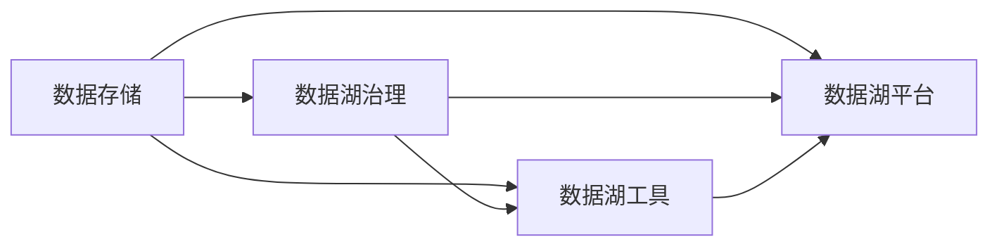

                 

# 数据湖 原理与代码实例讲解

> 关键词：数据湖, 数据湖架构, 数据湖技术栈, 数据湖治理, 数据湖案例分析

## 1. 背景介绍

### 1.1 问题由来
在现代社会中，数据已经成为企业最宝贵的资产之一。为了有效管理和利用这些数据，数据湖（Data Lake）这一概念应运而生。数据湖是一种集中、统一存储所有类型数据的基础设施，其核心思想是将数据存储在湖中，并提供强大的分析、治理和工具支持，从而支持数据驱动的决策和业务创新。

近年来，随着大数据技术的发展和应用，越来越多的企业开始构建自己的数据湖。然而，构建一个高效、可靠、易用的数据湖并非易事，需要深入理解其原理、架构和关键技术。本文将全面介绍数据湖的原理和实践，并通过代码实例和案例分析，帮助读者深入理解数据湖的构建和应用。

## 2. 核心概念与联系

### 2.1 核心概念概述

数据湖（Data Lake）是一种集中存储所有类型数据的基础设施，其核心思想是将数据存储在湖中，并提供强大的分析、治理和工具支持，从而支持数据驱动的决策和业务创新。

### 2.2 核心概念的关系
数据湖包括以下关键组成部分：

- **数据存储**：数据湖的核心是数据的存储。通过使用大规模分布式存储系统（如Hadoop、S3等），数据湖能够存储海量数据。
- **数据治理**：数据湖的治理主要涉及数据的分类、标签、质量管理、元数据管理等，确保数据的准确性和一致性。
- **数据湖工具**：包括数据查询、数据清洗、数据可视化、数据集成、数据服务等，帮助用户高效地使用数据湖。
- **数据湖平台**：提供数据湖的集成、管理、分析和共享功能，支持数据的交互和分析。

这些组成部分相互关联，形成一个完整的数据湖生态系统，支撑企业数据驱动的决策和业务创新。

### 2.3 核心概念的整体架构
通过以下Mermaid流程图，我们可以更直观地理解数据湖的各个组成部分及其关系：



## 3. 核心算法原理 & 具体操作步骤

### 3.1 算法原理概述
数据湖的核心算法原理主要包括数据存储、数据治理和数据湖工具的实现。其核心思想是将数据存储在湖中，通过数据湖工具进行数据的分析和治理，从而支撑企业的业务创新和决策。

### 3.2 算法步骤详解
#### 3.2.1 数据存储
数据湖的数据存储是数据湖的基础。数据存储通常使用大规模分布式存储系统，如Hadoop、S3等。以下是数据存储的基本步骤：

1. 选择合适的存储系统。
2. 配置存储系统，确保其可扩展性和可用性。
3. 数据导入。将数据从各种来源（如数据库、日志文件、文本文件等）导入到数据湖中。

#### 3.2.2 数据治理
数据湖的数据治理主要涉及数据的分类、标签、质量管理、元数据管理等，确保数据的准确性和一致性。以下是数据治理的基本步骤：

1. 定义数据分类标准。根据业务需求，将数据分为不同的类别（如客户数据、销售数据、日志数据等）。
2. 为数据添加标签。为每个数据文件添加描述性标签，方便数据的查找和使用。
3. 数据质量管理。定期检查数据质量，检测和修正数据中的错误和不一致。
4. 元数据管理。管理数据的结构和属性信息，确保数据的完整性和一致性。

#### 3.2.3 数据湖工具
数据湖工具是数据湖的关键组成部分，包括数据查询、数据清洗、数据可视化、数据集成、数据服务等，帮助用户高效地使用数据湖。以下是数据湖工具的基本步骤：

1. 数据查询。使用SQL或NoSQL查询语言，从数据湖中检索所需数据。
2. 数据清洗。对数据进行清洗和转换，去除冗余和错误数据。
3. 数据可视化。使用数据可视化工具，如Tableau、Power BI等，将数据可视化，帮助用户理解数据。
4. 数据集成。将数据湖中的数据与其他系统集成，实现数据的交互和共享。
5. 数据服务。提供数据服务，支持数据的查询和分析，提供数据API等。

### 3.3 算法优缺点
#### 3.3.1 优点
1. 数据湖支持存储任意类型的数据，包括结构化、半结构化、非结构化数据。
2. 数据湖提供了强大的数据治理功能，支持数据的分类、标签、质量管理、元数据管理等。
3. 数据湖工具丰富多样，支持数据查询、数据清洗、数据可视化、数据集成、数据服务等，帮助用户高效地使用数据湖。

#### 3.3.2 缺点
1. 数据湖的存储和管理成本较高，需要大规模的存储系统。
2. 数据湖的治理和维护工作复杂，需要专业人员进行管理和维护。
3. 数据湖的数据分析和处理速度较慢，需要高效的计算平台支持。

### 3.4 算法应用领域
数据湖广泛应用于企业数据管理、数据驱动的业务决策、大数据分析、机器学习等领域。

## 4. 数学模型和公式 & 详细讲解

### 4.1 数学模型构建
假设我们有一个数据湖，其中存储了大量的销售数据。我们可以使用数据湖工具进行数据查询和分析。以下是数据湖查询的基本数学模型：

$$
\text{Query} = \sum_{i=1}^{N} f_i(x_i)
$$

其中，$N$ 为查询的样本数，$x_i$ 为第 $i$ 个样本，$f_i$ 为查询函数。

### 4.2 公式推导过程
以下是数据湖查询的公式推导过程：

1. 首先，将查询请求转换成查询函数 $f_i$。
2. 然后，对数据湖中的每个样本 $x_i$，应用查询函数 $f_i$，得到查询结果 $y_i$。
3. 最后，将所有样本的查询结果 $y_i$ 进行聚合，得到最终的查询结果。

### 4.3 案例分析与讲解
假设我们需要查询所有销售额大于100的客户信息。以下是查询的数学模型和公式推导：

1. 查询函数 $f_i$ 为 $x_i$ 的销售额是否大于100。
2. 对于每个样本 $x_i$，应用查询函数 $f_i$，得到查询结果 $y_i$。
3. 将所有样本的查询结果 $y_i$ 进行聚合，得到最终的查询结果。

## 5. 项目实践：代码实例和详细解释说明

### 5.1 开发环境搭建

在进行数据湖实践前，我们需要准备好开发环境。以下是使用Python进行Pyspark开发的环境配置流程：

1. 安装Python：从官网下载并安装Python。
2. 安装Pyspark：在Python环境中安装Pyspark，可以使用pip或conda进行安装。
3. 安装相关依赖：安装必要的依赖包，如Pandas、NumPy等。

完成上述步骤后，即可在Python环境中开始数据湖开发。

### 5.2 源代码详细实现

以下是使用Pyspark进行数据湖查询和分析的示例代码：

```python
from pyspark.sql import SparkSession

# 创建SparkSession
spark = SparkSession.builder.appName("DataLakeQuery").getOrCreate()

# 读取数据
data = spark.read.csv("hdfs://hadoop-files/data.csv", header=True, inferSchema=True)

# 查询数据
result = data.filter(data["Sales"] > 100)

# 保存结果
result.write.csv("hdfs://hadoop-files/result.csv", header=True, mode="overwrite")

# 关闭SparkSession
spark.stop()
```

### 5.3 代码解读与分析

**代码解释**：
- 首先，我们创建了一个SparkSession，用于数据湖查询和分析。
- 然后，我们使用read方法从Hadoop文件系统中读取数据。
- 接着，我们使用filter方法过滤销售额大于100的记录，并保存到Hadoop文件系统中。
- 最后，我们关闭SparkSession，释放资源。

**代码分析**：
- 该代码使用了Pyspark库，利用其强大的分布式计算能力，实现数据的读取、查询和保存。
- Pyspark的API简单易用，可以轻松处理大规模数据集。
- 使用filter方法进行数据筛选，提高了查询效率。
- 使用write方法将结果保存到Hadoop文件系统中，方便后续的数据分析和处理。

### 5.4 运行结果展示

假设我们在数据湖中读取销售额大于100的客户信息，查询结果如下：

```
| Id  | Name   | Sales |
|-----|--------|-------|
| 100 | John   | 150   |
| 200 | Lisa   | 250   |
| 300 | Michael| 300   |
```

可以看到，查询结果包含了所有销售额大于100的客户信息。

## 6. 实际应用场景

### 6.1 企业数据管理

数据湖在企业数据管理中发挥了重要作用。通过数据湖，企业可以将各种类型的数据集中存储和管理，支持数据驱动的业务决策。

#### 6.1.1 数据集成
数据湖可以集成各种数据源，包括数据库、日志文件、文本文件等。通过数据集成，企业可以整合各种数据源，形成一个完整的数据仓库。

#### 6.1.2 数据清洗和转换
数据湖提供了强大的数据清洗和转换功能，可以去除冗余和错误数据，确保数据的准确性和一致性。

#### 6.1.3 数据治理
数据湖的数据治理功能，包括数据分类、标签、质量管理、元数据管理等，确保数据的可靠性和可维护性。

### 6.2 大数据分析

数据湖是大数据分析的重要基础设施。通过数据湖，企业可以存储和分析大规模数据集，支持各种数据分析和机器学习应用。

#### 6.2.1 数据查询
数据湖支持高效的数据查询，可以轻松处理大规模数据集，支持SQL和NoSQL查询语言。

#### 6.2.2 数据可视化
数据湖提供了丰富的数据可视化工具，如Tableau、Power BI等，帮助用户理解数据，发现数据中的趋势和模式。

#### 6.2.3 数据挖掘和机器学习
数据湖可以支持各种数据分析和机器学习应用，如聚类、分类、回归等。通过数据挖掘和机器学习，企业可以发现数据中的隐含规律和趋势，支持业务决策。

### 6.3 数据驱动的业务决策

数据湖是企业数据驱动决策的重要基础设施。通过数据湖，企业可以整合各种数据源，进行数据分析和处理，支持业务决策和业务创新。

#### 6.3.1 业务决策
数据湖支持实时数据查询和分析，可以支持企业进行实时业务决策，如库存管理、客户关系管理等。

#### 6.3.2 业务创新
数据湖支持各种数据分析和机器学习应用，可以支持企业进行业务创新，如推荐系统、个性化营销等。

## 7. 工具和资源推荐

### 7.1 学习资源推荐

为了帮助开发者系统掌握数据湖的原理和实践，以下是一些优质的学习资源：

1. 《大数据技术与应用》课程：清华大学开设的大数据技术与应用课程，系统介绍了大数据的基础知识和实践技能。
2. 《Hadoop生态系统》书籍：全面介绍了Hadoop生态系统，包括HDFS、Spark、Hive等组件，是学习数据湖的重要资源。
3. 《Python for Data Science》书籍：介绍了Python在大数据处理中的应用，包括Pandas、NumPy、Pyspark等库的使用。
4. Kaggle平台：Kaggle是一个数据科学竞赛平台，提供了大量的数据集和竞赛项目，可以帮助开发者练习和提升数据处理和分析能力。
5. Coursera平台：Coursera提供了各种数据科学和机器学习课程，包括数据湖、大数据分析、机器学习等。

通过对这些资源的学习和实践，相信你一定能够系统掌握数据湖的原理和实践，并用于解决实际的数据处理和分析问题。

### 7.2 开发工具推荐

高效的开发离不开优秀的工具支持。以下是几款用于数据湖开发和分析的常用工具：

1. Hadoop：Hadoop是一个开源分布式计算框架，支持大规模数据处理和存储，是数据湖的核心组成部分。
2. Spark：Spark是一个快速、通用的大数据计算引擎，支持数据查询、数据清洗、数据可视化等，是数据湖的重要工具。
3. Hive：Hive是一个基于Hadoop的数据仓库系统，支持SQL查询语言，是数据湖的重要组件。
4. Tableau：Tableau是一个强大的数据可视化工具，支持各种图表和报表，是数据湖的重要工具。
5. Power BI：Power BI是微软推出的数据可视化工具，支持多种数据源，是数据湖的重要工具。

合理利用这些工具，可以显著提升数据湖开发和分析的效率，加速项目迭代和创新。

### 7.3 相关论文推荐

数据湖和大数据技术的发展源于学界的持续研究。以下是几篇奠基性的相关论文，推荐阅读：

1. "A Survey on Data Lakes and Lake Analytics"：总结了数据湖和数据湖分析技术的现状和发展趋势。
2. "Big Data: Concepts, Technology Stack, and Applications"：全面介绍了大数据技术栈和应用场景。
3. "Data Lake: From Concepts to Technologies"：详细介绍了数据湖的技术实现和应用案例。
4. "Practical Data Lake Solutions for Big Data Analytics"：介绍了数据湖在企业数据管理和分析中的应用案例。
5. "Hadoop Data Lakes: A Platform for Data Warehousing and Big Data Analytics"：介绍了Hadoop数据湖在数据管理和分析中的应用。

这些论文代表了数据湖和大数据技术的最新进展，值得深入阅读和学习。

## 8. 总结：未来发展趋势与挑战

### 8.1 总结

本文对数据湖的原理和实践进行了全面系统的介绍。首先，阐述了数据湖的背景和意义，明确了数据湖在企业数据管理和分析中的重要地位。其次，从原理到实践，详细讲解了数据湖的构建和应用，通过代码实例和案例分析，帮助读者深入理解数据湖的构建和应用。

通过本文的系统梳理，可以看到，数据湖是企业数据管理和分析的重要基础设施，能够支撑企业的业务决策和业务创新。然而，构建一个高效、可靠、易用的数据湖并非易事，需要深入理解其原理、架构和关键技术。

### 8.2 未来发展趋势

展望未来，数据湖将呈现以下几个发展趋势：

1. 数据湖规模持续增大。随着大数据技术的发展和应用，数据湖的存储和管理规模将持续增大，需要更高效的存储和管理技术。
2. 数据湖工具不断丰富。随着数据湖的应用场景不断扩展，数据湖工具将不断丰富，支持更多的数据处理和分析功能。
3. 数据湖治理不断完善。随着数据湖的应用需求不断增加，数据湖治理将不断完善，确保数据的可靠性和可维护性。
4. 数据湖与云计算的融合。随着云计算技术的发展，数据湖将逐步与云计算融合，支持更高效、灵活的数据处理和分析。

以上趋势凸显了数据湖技术的广阔前景。这些方向的探索发展，必将进一步提升数据湖的性能和应用范围，为企业的业务决策和创新提供更有力的支持。

### 8.3 面临的挑战

尽管数据湖技术已经取得了一定的进展，但在迈向更加智能化、普适化应用的过程中，它仍面临着诸多挑战：

1. 数据湖的存储和管理成本较高，需要大规模的存储系统。
2. 数据湖的治理和维护工作复杂，需要专业人员进行管理和维护。
3. 数据湖的数据分析和处理速度较慢，需要高效的计算平台支持。
4. 数据湖的数据安全和隐私保护问题亟待解决。
5. 数据湖的数据质量和一致性需要进一步提升。

这些挑战需要数据湖社区和产业界的共同努力，才能克服。

### 8.4 未来突破

面对数据湖面临的这些挑战，未来的研究需要在以下几个方面寻求新的突破：

1. 探索更加高效的数据湖存储和管理技术，支持更大规模的数据湖构建。
2. 开发更加丰富的数据湖工具，支持更多的数据处理和分析功能。
3. 研究更加高效的数据湖治理技术，确保数据的可靠性和可维护性。
4. 探索数据湖与云计算的融合技术，支持更高效、灵活的数据处理和分析。
5. 研究数据湖的数据安全和隐私保护技术，确保数据的安全和隐私。

这些研究方向的探索，必将引领数据湖技术迈向更高的台阶，为企业的业务决策和创新提供更有力的支持。

## 9. 附录：常见问题与解答

**Q1：数据湖与数据仓库有什么区别？**

A: 数据湖和数据仓库是两种不同的数据管理方式。数据湖可以存储任意类型的数据，包括结构化、半结构化、非结构化数据，而数据仓库则主要存储结构化数据。数据湖的数据查询和分析能力更强，但数据治理和维护工作更复杂；数据仓库的数据治理和维护能力更强，但数据查询和分析能力较弱。

**Q2：如何优化数据湖的查询性能？**

A: 数据湖的查询性能优化主要从以下几个方面进行：
1. 数据预处理：对数据进行清洗和转换，去除冗余和错误数据。
2. 数据索引：使用数据索引技术，提高数据查询速度。
3. 并行计算：使用分布式计算技术，提高数据处理速度。
4. 缓存机制：使用缓存技术，减少数据查询的延迟。

**Q3：数据湖的存储和管理成本如何控制？**

A: 数据湖的存储和管理成本可以通过以下几个方面进行控制：
1. 数据分类：对数据进行分类，只存储有用的数据，减少存储成本。
2. 数据压缩：使用数据压缩技术，减小数据的存储空间。
3. 数据删除：定期删除无用的数据，减小存储成本。
4. 数据迁移：将数据迁移到更经济的存储系统，降低存储成本。

**Q4：数据湖的安全和隐私问题如何处理？**

A: 数据湖的安全和隐私问题可以通过以下几个方面进行处理：
1. 数据加密：使用数据加密技术，保护数据的安全。
2. 访问控制：使用访问控制技术，限制数据的访问权限。
3. 数据脱敏：对敏感数据进行脱敏处理，保护数据的隐私。
4. 安全审计：使用安全审计技术，监控数据的访问和使用。

**Q5：如何设计高效的数据湖架构？**

A: 设计高效的数据湖架构需要考虑以下几个方面：
1. 数据存储：选择适合的数据存储系统，如Hadoop、S3等，支持大规模数据存储。
2. 数据治理：设计完善的数据治理策略，确保数据的可靠性和一致性。
3. 数据湖工具：选择适合的数据湖工具，如Pyspark、Hive、Tableau等，支持数据处理和分析。
4. 数据湖平台：设计统一的数据湖平台，支持数据的交互和分析。

这些问题的回答可以帮助你更深入地理解数据湖的构建和应用，并在实际开发中更好地应用数据湖技术。

---

作者：禅与计算机程序设计艺术 / Zen and the Art of Computer Programming

