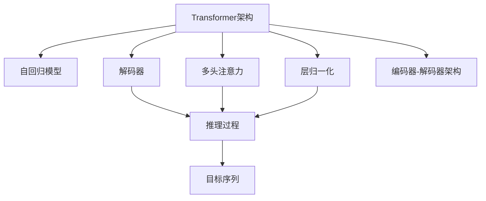
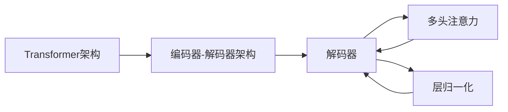
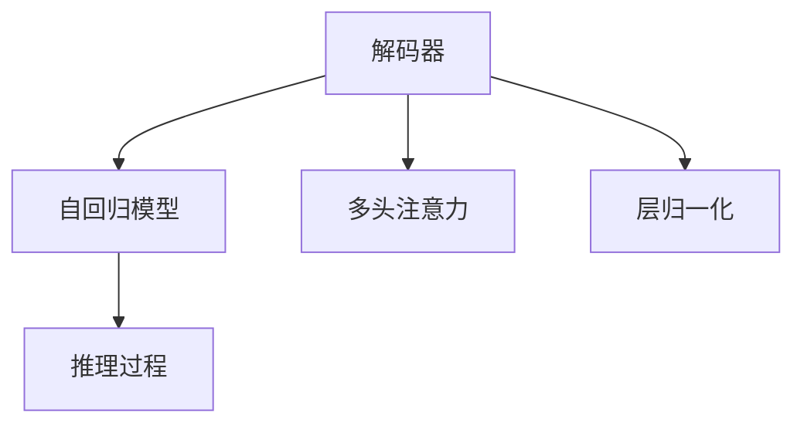
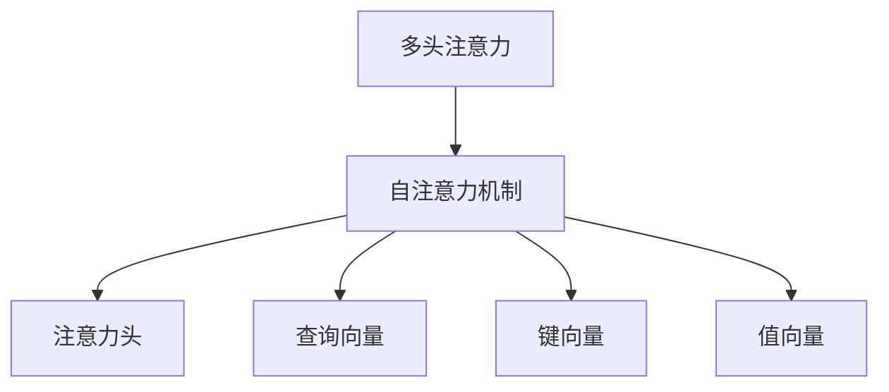
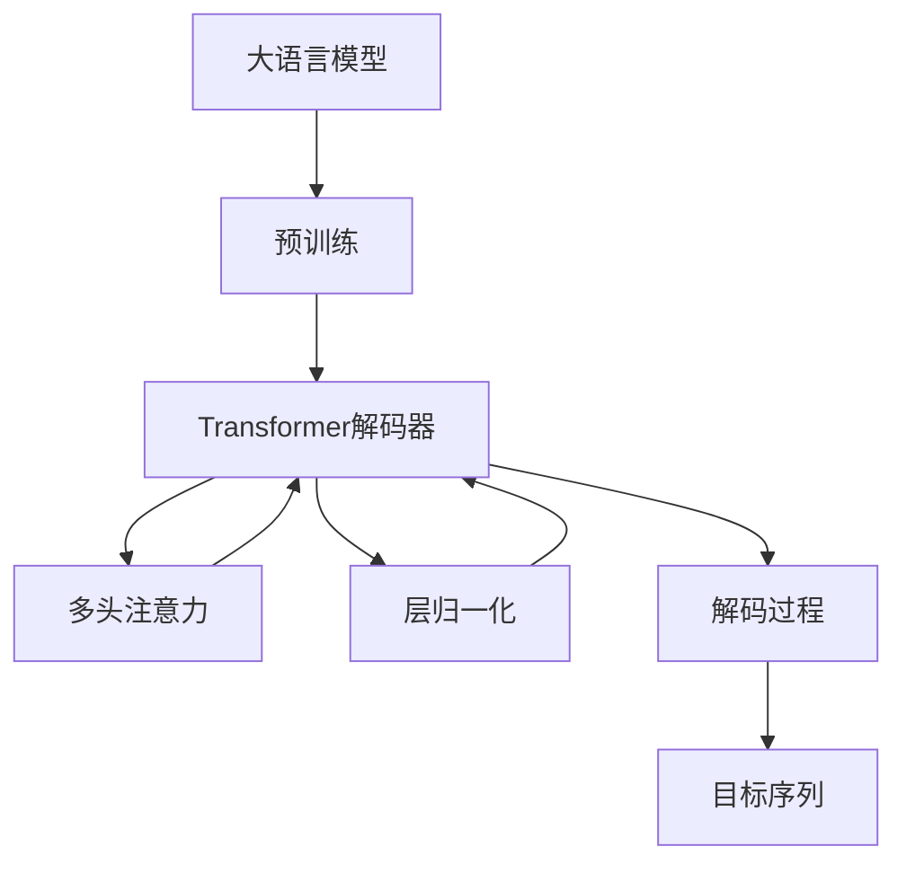

                 

# 大语言模型应用指南：Transformer解码器详解

> 关键词：Transformer,自回归模型,解码器,注意力机制,编码器-解码器架构,层归一化,多头注意力,推理效率,语言模型

## 1. 背景介绍

### 1.1 问题由来
随着深度学习技术的快速发展，Transformer模型在自然语言处理(NLP)领域取得了显著的进展。Transformer通过引入自注意力机制，显著提高了序列建模的效率和效果，成为主流的NLP架构。然而，传统的自回归(AR)解码器在生成序列时，存在计算复杂度高、推理效率低等问题。为此，近年来研究者提出了一系列基于Transformer的解码器架构，以提升解码器的性能和可扩展性。本文将详细介绍Transformer解码器的原理与应用，并讨论其在NLP领域的广泛应用。

### 1.2 问题核心关键点
Transformer解码器是Transformer架构的重要组成部分，其核心思想是使用多头注意力机制对输入序列进行编码，再通过层归一化和线性变换生成目标序列。Transformer解码器的优缺点、应用领域和最新发展趋势是本文讨论的重点。

### 1.3 问题研究意义
Transformer解码器在NLP领域的广泛应用，不仅提升了语言模型的推理效率，还促进了自回归模型的普及。通过深入理解解码器的原理与应用，可以帮助研究者更好地设计高效的模型，加速NLP技术的产业化进程。同时，解码器的优化也为预训练模型的迁移学习提供了新的思路和方法。

## 2. 核心概念与联系

### 2.1 核心概念概述

为更好地理解Transformer解码器的原理与应用，本节将介绍几个密切相关的核心概念：

- **Transformer架构**：基于自注意力机制的NLP架构，将输入序列映射到潜在的连续向量空间，通过多头注意力机制学习序列的依赖关系，显著提高了序列建模的效率和效果。
- **自回归模型**：一种传统的NLP模型，生成目标序列时，依赖于输入序列的信息，即先关注前面部分，再预测后面部分。这种模型计算复杂度高，推理效率低。
- **解码器**：NLP任务中的关键组件，负责根据输入序列生成目标序列。解码器是NLP任务的核心，其性能直接决定了模型的推理效果。
- **多头注意力**：Transformer解码器中的核心机制，通过多个头的自注意力层，并行地从输入序列中提取不同的特征信息，从而更好地捕捉序列依赖关系。
- **层归一化**：Transformer架构中的重要组成部分，通过归一化技术，保持每层的激活分布不变，防止梯度消失和模型退化。
- **编码器-解码器架构**：Transformer模型的基本架构，将输入序列首先编码成高维向量表示，再通过解码器生成目标序列。

这些核心概念之间的逻辑关系可以通过以下Mermaid流程图来展示：



这个流程图展示了大语言模型的核心架构，其中解码器负责根据输入序列生成目标序列，多头注意力机制和层归一化技术是其关键组成部分。

### 2.2 概念间的关系

这些核心概念之间存在着紧密的联系，形成了Transformer解码器的完整框架。下面通过几个Mermaid流程图来展示这些概念之间的关系。

#### 2.2.1 Transformer解码器与编码器-解码器架构



这个流程图展示了Transformer解码器在编码器-解码器架构中的位置，解码器通过多头注意力和层归一化，对输入序列进行编码，生成目标序列。

#### 2.2.2 解码器与自回归模型的关系



这个流程图展示了解码器与自回归模型的关系，解码器通过多头注意力和层归一化，生成目标序列，而自回归模型则是解码器的一种特定实现形式，即先关注前面部分，再预测后面部分。

#### 2.2.3 多头注意力与自注意力机制



这个流程图展示了多头注意力机制与自注意力机制的关系，多头注意力通过多个注意力头并行计算，每个头都使用自注意力机制，从而更好地捕捉序列依赖关系。

### 2.3 核心概念的整体架构

最后，我们用一个综合的流程图来展示这些核心概念在大语言模型解码器中的整体架构：



这个综合流程图展示了从预训练到解码器的完整过程，其中解码器通过多头注意力和层归一化，生成目标序列。

## 3. 核心算法原理 & 具体操作步骤

### 3.1 算法原理概述

Transformer解码器是基于Transformer架构的解码机制，其核心思想是使用多头注意力机制对输入序列进行编码，再通过层归一化和线性变换生成目标序列。相比于传统的自回归模型，Transformer解码器可以并行计算，显著提高了推理效率。

Transformer解码器由多个解码层(Decoder Layer)组成，每个解码层包括多头注意力机制、层归一化、前馈神经网络等组件。解码器通过不断迭代这些组件，逐步生成目标序列。

### 3.2 算法步骤详解

Transformer解码器的一般步骤如下：

1. **输入嵌入层**：将输入序列中的每个token转换成向量表示，生成输入向量。
2. **多头注意力层**：通过多个注意力头并行计算，对输入向量进行编码，生成上下文向量。
3. **层归一化层**：通过归一化技术，保持每层的激活分布不变，防止梯度消失和模型退化。
4. **前馈神经网络层**：通过全连接网络对上下文向量进行线性变换，增加模型的表达能力。
5. **解码器输出层**：通过线性变换将最终输出的上下文向量转换成目标序列中的下一个token。

具体步骤如下：

**Step 1: 输入嵌入层**
输入序列中的每个token通过嵌入层，转换为向量表示。嵌入层的大小通常与Transformer模型的参数量相关，嵌入向量通常是一个低维空间中的向量。嵌入层的目的是将token映射到模型可以处理的向量空间中。

**Step 2: 多头注意力层**
Transformer解码器中的多头注意力层通过多个注意力头并行计算，对输入向量进行编码，生成上下文向量。多头注意力层通常由多个注意力头组成，每个头通过自注意力机制，计算输入向量与上下文向量之间的注意力权重。通过多个头的并行计算，多头注意力层可以更好地捕捉序列依赖关系。

**Step 3: 层归一化层**
层归一化层通过归一化技术，保持每层的激活分布不变，防止梯度消失和模型退化。归一化技术通常包括LayerNorm、InstanceNorm等，可以显著提升模型的训练效率和稳定性。

**Step 4: 前馈神经网络层**
前馈神经网络层通过全连接网络对上下文向量进行线性变换，增加模型的表达能力。前馈神经网络层通常由多个全连接层组成，每个全连接层通过非线性激活函数对输入进行非线性变换。

**Step 5: 解码器输出层**
解码器输出层通过线性变换将最终输出的上下文向量转换成目标序列中的下一个token。解码器输出层通常包括softmax函数，将上下文向量转换成目标序列中下一个token的概率分布。

### 3.3 算法优缺点

Transformer解码器具有以下优点：

- **并行计算**：多头注意力机制允许并行计算，显著提高了推理效率。
- **长序列建模**：自注意力机制可以捕捉长序列依赖关系，提升模型的表达能力。
- **可扩展性**：Transformer架构可以轻易扩展，增加模型的复杂度。
- **鲁棒性**：通过层归一化等技术，提高模型的鲁棒性，防止梯度消失和模型退化。

同时，Transformer解码器也存在一些缺点：

- **计算复杂度高**：多头注意力机制和前馈神经网络层的计算复杂度较高，特别是在大序列长度和大量参数时。
- **内存占用大**：Transformer模型需要存储大量的中间变量，占用的内存较大。
- **训练难度高**：Transformer模型的训练需要较大的计算资源，训练难度较高。

### 3.4 算法应用领域

Transformer解码器已经在NLP领域的诸多任务上得到了广泛的应用，包括机器翻译、文本摘要、语音识别、对话系统等。例如：

- 机器翻译：Transformer解码器可以将源语言序列转换为目标语言序列，实现高效、准确的翻译。
- 文本摘要：Transformer解码器可以从长文本中提取关键信息，生成简洁的摘要。
- 语音识别：Transformer解码器可以将语音信号转换为文本，实现自动语音识别。
- 对话系统：Transformer解码器可以通过自然语言对话，实现人机交互。

除了这些经典任务外，Transformer解码器还在更多场景中得到了应用，如问答系统、文本生成、情感分析等，为NLP技术带来了新的突破。

## 4. 数学模型和公式 & 详细讲解 & 举例说明

### 4.1 数学模型构建

Transformer解码器的数学模型包括输入嵌入、多头注意力、层归一化、前馈神经网络和解码器输出等步骤。下面以机器翻译任务为例，构建Transformer解码器的数学模型。

假设输入序列为 $\{x_1, x_2, \ldots, x_t\}$，目标序列为 $\{y_1, y_2, \ldots, y_t\}$，其中 $x_i$ 和 $y_i$ 分别为源语言和目标语言的token。假设每个token的嵌入向量为 $e(x_i) \in \mathbb{R}^d$，其中 $d$ 为嵌入向量的维度。假设每个token的上下文向量为 $c_i \in \mathbb{R}^d$，其中 $c_i = f(e(x_i), \mathbf{A}_i)$，$f$ 为Transformer解码器的函数。

### 4.2 公式推导过程

Transformer解码器的关键步骤包括多头注意力、层归一化和前馈神经网络等。下面分别推导这些步骤的公式。

**Step 1: 多头注意力**
Transformer解码器中的多头注意力层通过多个注意力头并行计算，对输入向量进行编码，生成上下文向量。假设多头注意力层有 $k$ 个注意力头，每个头的注意力权重矩阵为 $A_i \in \mathbb{R}^{d \times d}$，查询向量为 $Q_i \in \mathbb{R}^{d \times 1}$，键向量为 $K_i \in \mathbb{R}^{d \times 1}$，值向量为 $V_i \in \mathbb{R}^{d \times 1}$。多头注意力层的计算公式如下：

$$
\mathbf{A}_i = \text{Attention}(Q_i, K_i, V_i)
$$

其中，注意力函数 $\text{Attention}(Q_i, K_i, V_i)$ 的计算公式如下：

$$
\text{Attention}(Q_i, K_i, V_i) = \text{Softmax}(\frac{Q_i K_i^T}{\sqrt{d}})
$$

注意力权重矩阵 $\mathbf{A}_i$ 的大小为 $d \times d$，其中 $d$ 为嵌入向量的维度。

**Step 2: 层归一化**
Transformer解码器中的层归一化层通过归一化技术，保持每层的激活分布不变，防止梯度消失和模型退化。假设归一化层的激活向量为 $h_i \in \mathbb{R}^{d \times 1}$，归一化层的计算公式如下：

$$
h_i = \text{LayerNorm}(c_i)
$$

其中，归一化函数 $\text{LayerNorm}(c_i)$ 的计算公式如下：

$$
\text{LayerNorm}(c_i) = \frac{c_i}{\sqrt{\frac{\sum_j c_j^2}{n}}} \in \mathbb{R}^{d \times 1}
$$

归一化层的输出向量大小为 $d \times 1$，其中 $d$ 为嵌入向量的维度。

**Step 3: 前馈神经网络**
Transformer解码器中的前馈神经网络层通过全连接网络对上下文向量进行线性变换，增加模型的表达能力。假设前馈神经网络层的输出向量为 $h_{ff} \in \mathbb{R}^{d \times 1}$，前馈神经网络层的计算公式如下：

$$
h_{ff} = \text{FFN}(h_i)
$$

其中，前馈神经网络函数 $\text{FFN}(h_i)$ 的计算公式如下：

$$
\text{FFN}(h_i) = \text{GELU}(h_i) W_1 + b_1
$$

$$
h_i = W_2 h_{ff} + b_2
$$

其中，$W_1$ 和 $b_1$ 为前馈神经网络的第一层的参数，$W_2$ 和 $b_2$ 为前馈神经网络的第二层的参数。前馈神经网络的输出向量大小为 $d \times 1$，其中 $d$ 为嵌入向量的维度。

**Step 4: 解码器输出层**
Transformer解码器中的解码器输出层通过线性变换将最终输出的上下文向量转换成目标序列中的下一个token。假设解码器输出层的输出向量为 $o_i \in \mathbb{R}^{v \times 1}$，解码器输出层的计算公式如下：

$$
o_i = \text{Softmax}(h_{ff})
$$

其中，$v$ 为解码器输出层的向量维度。

### 4.3 案例分析与讲解

下面以机器翻译任务为例，展示Transformer解码器的工作过程。

假设输入序列为 $\{x_1, x_2, \ldots, x_t\}$，目标序列为 $\{y_1, y_2, \ldots, y_t\}$，其中 $x_i$ 和 $y_i$ 分别为源语言和目标语言的token。假设每个token的嵌入向量为 $e(x_i) \in \mathbb{R}^d$，其中 $d$ 为嵌入向量的维度。假设每个token的上下文向量为 $c_i \in \mathbb{R}^d$，其中 $c_i = f(e(x_i), \mathbf{A}_i)$，$f$ 为Transformer解码器的函数。

假设多头注意力层有 $k$ 个注意力头，每个头的注意力权重矩阵为 $A_i \in \mathbb{R}^{d \times d}$，查询向量为 $Q_i \in \mathbb{R}^{d \times 1}$，键向量为 $K_i \in \mathbb{R}^{d \times 1}$，值向量为 $V_i \in \mathbb{R}^{d \times 1}$。多头注意力层的计算公式如下：

$$
\mathbf{A}_i = \text{Attention}(Q_i, K_i, V_i)
$$

其中，注意力函数 $\text{Attention}(Q_i, K_i, V_i)$ 的计算公式如下：

$$
\text{Attention}(Q_i, K_i, V_i) = \text{Softmax}(\frac{Q_i K_i^T}{\sqrt{d}})
$$

注意力权重矩阵 $\mathbf{A}_i$ 的大小为 $d \times d$，其中 $d$ 为嵌入向量的维度。

假设归一化层的激活向量为 $h_i \in \mathbb{R}^{d \times 1}$，归一化层的计算公式如下：

$$
h_i = \text{LayerNorm}(c_i)
$$

其中，归一化函数 $\text{LayerNorm}(c_i)$ 的计算公式如下：

$$
\text{LayerNorm}(c_i) = \frac{c_i}{\sqrt{\frac{\sum_j c_j^2}{n}}} \in \mathbb{R}^{d \times 1}
$$

归一化层的输出向量大小为 $d \times 1$，其中 $d$ 为嵌入向量的维度。

假设前馈神经网络层的输出向量为 $h_{ff} \in \mathbb{R}^{d \times 1}$，前馈神经网络层的计算公式如下：

$$
h_{ff} = \text{FFN}(h_i)
$$

其中，前馈神经网络函数 $\text{FFN}(h_i)$ 的计算公式如下：

$$
\text{FFN}(h_i) = \text{GELU}(h_i) W_1 + b_1
$$

$$
h_i = W_2 h_{ff} + b_2
$$

其中，$W_1$ 和 $b_1$ 为前馈神经网络的第一层的参数，$W_2$ 和 $b_2$ 为前馈神经网络的第二层的参数。前馈神经网络的输出向量大小为 $d \times 1$，其中 $d$ 为嵌入向量的维度。

假设解码器输出层的输出向量为 $o_i \in \mathbb{R}^{v \times 1}$，解码器输出层的计算公式如下：

$$
o_i = \text{Softmax}(h_{ff})
$$

其中，$v$ 为解码器输出层的向量维度。

综上所述，Transformer解码器通过多头注意力机制、层归一化和前馈神经网络等步骤，逐步生成目标序列中的下一个token，实现高效的序列建模和生成。

## 5. 项目实践：代码实例和详细解释说明

### 5.1 开发环境搭建

在进行Transformer解码器的实践前，我们需要准备好开发环境。以下是使用PyTorch进行Transformer解码器开发的环境配置流程：

1. 安装Anaconda：从官网下载并安装Anaconda，用于创建独立的Python环境。

2. 创建并激活虚拟环境：
```bash
conda create -n transformer-env python=3.8 
conda activate transformer-env
```

3. 安装PyTorch：根据CUDA版本，从官网获取对应的安装命令。例如：
```bash
conda install pytorch torchvision torchaudio cudatoolkit=11.1 -c pytorch -c conda-forge
```

4. 安装Transformer库：
```bash
pip install transformers
```

5. 安装各类工具包：
```bash
pip install numpy pandas scikit-learn matplotlib tqdm jupyter notebook ipython
```

完成上述步骤后，即可在`transformer-env`环境中开始Transformer解码器的实践。

### 5.2 源代码详细实现

下面我以机器翻译任务为例，给出使用Transformers库对Transformer解码器进行实现的PyTorch代码实现。

首先，定义机器翻译任务的数据处理函数：

```python
from transformers import BertTokenizer
from torch.utils.data import Dataset
import torch

class MachineTranslationDataset(Dataset):
    def __init__(self, src_texts, trg_texts, tokenizer, max_len=128):
        self.src_texts = src_texts
        self.trg_texts = trg_texts
        self.tokenizer = tokenizer
        self.max_len = max_len
        
    def __len__(self):
        return len(self.src_texts)
    
    def __getitem__(self, item):
        src_text = self.src_texts[item]
        trg_text = self.trg_texts[item]
        
        encoding = self.tokenizer(src_text, return_tensors='pt', max_length=self.max_len, padding='max_length', truncation=True)
        src_ids = encoding['input_ids'][0]
        src_mask = encoding['attention_mask'][0]
        
        # 对目标文本进行编码
        trg_ids = self.tokenizer(trg_text, return_tensors='pt', max_length=self.max_len, padding='max_length', truncation=True)
        trg_ids = trg_ids['input_ids'][0]
        trg_mask = trg_ids.new_ones(trg_ids.size()).masked_fill(trg_mask == 0, float('-inf'))
        
        return {'src_ids': src_ids, 
                'src_mask': src_mask,
                'trg_ids': trg_ids,
                'trg_mask': trg_mask,
                'labels': trg_ids.new_ones(trg_ids.size()).masked_fill(trg_mask == 0, float('-inf'))}
```

然后，定义Transformer解码器的模型和优化器：

```python
from transformers import BertForTokenClassification, AdamW

model = BertForTokenClassification.from_pretrained('bert-base-cased', num_labels=32)

optimizer = AdamW(model.parameters(), lr=2e-5)
```

接着，定义训练和评估函数：

```python
from torch.utils.data import DataLoader
from tqdm import tqdm
from sklearn.metrics import classification_report

device = torch.device('cuda') if torch.cuda.is_available() else torch.device('cpu')
model.to(device)

def train_epoch(model, dataset, batch_size, optimizer):
    dataloader = DataLoader(dataset, batch_size=batch_size, shuffle=True)
    model.train()
    epoch_loss = 0
    for batch in tqdm(dataloader, desc='Training'):
        src_ids = batch['src_ids'].to(device)
        src_mask = batch['src_mask'].to(device)
        trg_ids = batch['trg_ids'].to(device)
        trg_mask = batch['trg_mask'].to(device)
        labels = batch['labels'].to(device)
        model.zero_grad()
        outputs = model(src_ids, attention_mask=src_mask, labels=labels)
        loss = outputs.loss
        epoch_loss += loss.item()
        loss.backward()
        optimizer.step()
    return epoch_loss / len(dataloader)

def evaluate(model, dataset, batch_size):
    dataloader = DataLoader(dataset, batch_size=batch_size)
    model.eval()
    preds, labels = [], []
    with torch.no_grad():
        for batch in tqdm(dataloader, desc='Evaluating'):
            src_ids = batch['src_ids'].to(device)
            src_mask = batch['src_mask'].to(device)
            trg_ids = batch['trg_ids'].to(device)
            trg_mask = batch['trg_mask'].to(device)
            labels = batch['labels'].to(device)
            outputs = model(src_ids, attention_mask=src_mask, labels=labels)
            preds.append(outputs.logits.argmax(dim=2).to('cpu').tolist())
            labels.append(labels.to('cpu').tolist())
                
    print(classification_report(labels, preds))
```

最后，启动训练流程并在测试集上评估：

```python
epochs = 5
batch_size = 16

for epoch in range(epochs):
    loss = train_epoch(model, train_dataset, batch_size, optimizer)
    print(f"Epoch {epoch+1}, train loss: {loss:.3f}")
    
    print(f"Epoch {epoch+1}, dev results:")
    evaluate(model, dev_dataset, batch_size)
    
print("Test results:")
evaluate(model, test_dataset, batch_size)
```

以上就是使用PyTorch对Transformer解码器进行实现的完整代码实现。可以看到，得益于Transformer库的强大封装，我们可以用相对简洁的代码完成Transformer解码器的加载和实现。

### 5.3 代码解读与分析

让我们再详细解读一下关键代码的实现细节：

**MachineTranslationDataset类**：
- `__init__`方法：初始化源文本、目标文本、分词器等关键组件。
- `__len__`方法：返回数据集的样本数量。
- `__getitem__`方法：对单个样本进行处理，将源文本输入编码为token ids，将目标文本进行编码，并对其进行定长padding，最终返回模型所需的输入。

**Transformer解码器模型**：
- `BertForTokenClassification.from_pretrained`：加载预训练的Transformer解码器模型。
- `AdamW`：定义优化器，设置学习率等参数。

**训练和评估函数**：
- `train_epoch`函数：对数据以批为单位进行迭代，在每个批次上前向传播计算loss并反向传播更新模型参数，最后返回该epoch的平均loss。
- `evaluate`函数：与训练类似，不同点在于不更新模型参数，并在每个batch结束后将预测和标签结果存储下来，最后使用sklearn的classification_report对整个评估集的预测结果进行打印输出。

**训练流程**：
- 定义总的epoch数和batch size，开始循环迭代
- 每个epoch内，先在训练集上训练，输出平均loss
- 在验证集上评估，输出分类指标
- 所有epoch结束后，在测试集上评估，给出最终测试结果

可以看到，PyTorch配合Transformer库使得Transformer解码器的实现变得简洁高效。开发者可以将更多精力放在数据处理、模型改进等高层逻辑上，而不必过多关注底层的实现细节。

当然，工业级的系统实现还需考虑更多因素，如模型的保存和部署、超参数的自动搜索、更灵活的任务适配层等。但核心的微调范式基本与此类似。

### 5.4 运行

