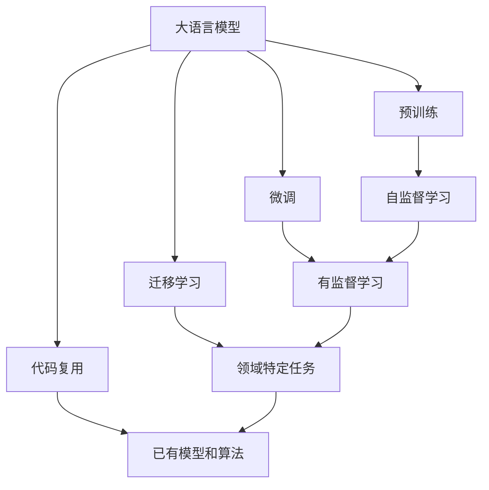

                 

# 大语言模型应用指南：外部工具

> 关键词：
- 大语言模型
- 外部工具
- 自然语言处理(NLP)
- 预训练模型
- 微调(Fine-tuning)
- 迁移学习(Transfer Learning)
- 代码复用(Copy-Paste)

## 1. 背景介绍

### 1.1 问题由来

随着深度学习技术的不断发展，大语言模型(Large Language Models, LLMs)在自然语言处理(NLP)领域取得了巨大的成功。这些大模型通过在海量无标签文本数据上进行预训练，学习到丰富的语言知识和常识，能够用于各种NLP任务，如图像描述生成、文本摘要、机器翻译等。然而，在实际应用中，大语言模型的预训练和微调过程往往需要消耗大量的计算资源和标注数据，这对于一些资源有限的应用场景并不友好。因此，如何利用外部工具和资源，提高大语言模型应用的便捷性和效率，成为了一个重要研究方向。

### 1.2 问题核心关键点

利用外部工具和资源，可以大幅降低大语言模型应用的门槛，提升应用效率。以下是几个关键问题：

- **预训练模型选择**：选择适合特定任务的预训练模型，需要考虑模型的规模、性能、预训练数据的覆盖范围等因素。
- **微调数据准备**：收集和准备微调数据，包括文本预处理、标注数据准备等。
- **微调算法优化**：选择合适的微调算法和超参数，如学习率、批大小、迭代次数等，以提升微调效果。
- **模型评估和部署**：评估微调后的模型性能，并将其部署到实际应用中。

### 1.3 问题研究意义

利用外部工具和资源，可以提高大语言模型应用的便利性、高效性和普适性，降低应用的成本和复杂度。具体而言：

- **提升应用效率**：通过利用预训练模型和微调算法，可以大幅降低应用开发的成本和时间。
- **降低应用门槛**：利用已有的工具和资源，不需要从头开发模型和算法，减少了应用的复杂度。
- **提升模型效果**：选择适合任务的预训练模型和微调方法，可以显著提升模型在特定任务上的性能。
- **加速技术落地**：利用外部工具和资源，可以加速NLP技术的产业化进程，推动行业应用的发展。

## 2. 核心概念与联系

### 2.1 核心概念概述

为更好地理解大语言模型应用的常见外部工具和资源，本节将介绍几个密切相关的核心概念：

- **大语言模型(Large Language Models, LLMs)**：如GPT、BERT等，通过大规模无标签数据进行预训练，学习通用的语言表示和知识。
- **预训练模型(Pre-trained Model)**：在特定任务上预训练的模型，如BERT、GPT等。
- **微调(Fine-tuning)**：在预训练模型的基础上，通过有标签数据对模型进行优化，使其适应特定任务。
- **迁移学习(Transfer Learning)**：在预训练模型的基础上，通过微调适应新任务，提升模型在新任务上的表现。
- **代码复用(Copy-Paste)**：直接使用已有的模型、算法代码，避免从头开发，提高开发效率。

这些核心概念之间存在着紧密的联系，形成了大语言模型应用的完整生态系统。通过理解这些核心概念，我们可以更好地把握大语言模型应用的策略和方法。

### 2.2 概念间的关系

这些核心概念之间的关系可以通过以下Mermaid流程图来展示：



这个流程图展示了大语言模型的核心概念及其之间的关系：

1. 大语言模型通过预训练获得基础能力。
2. 微调和迁移学习是对预训练模型进行任务特定的优化。
3. 代码复用可以进一步提高开发效率，避免从头开发。

这些概念共同构成了大语言模型的应用框架，使其能够在各种场景下发挥强大的语言理解和生成能力。通过理解这些核心概念，我们可以更好地把握大语言模型应用的技术细节和方法。

## 3. 核心算法原理 & 具体操作步骤

### 3.1 算法原理概述

大语言模型的应用主要通过预训练和微调两个步骤实现。预训练模型通过大规模无标签数据进行训练，学习到通用的语言表示和知识。微调则是在预训练模型的基础上，通过有标签数据对模型进行优化，使其适应特定任务。以下是微调的基本流程：

1. **数据准备**：收集和准备微调数据，包括文本预处理、标注数据准备等。
2. **模型选择**：选择适合特定任务的预训练模型。
3. **微调算法**：选择合适的微调算法和超参数，如学习率、批大小、迭代次数等。
4. **模型评估**：评估微调后的模型性能，如准确率、召回率、F1分数等。
5. **模型部署**：将微调后的模型部署到实际应用中，如问答系统、文本分类、机器翻译等。

### 3.2 算法步骤详解

以下是微调的具体操作步骤：

**Step 1: 数据准备**

1. **文本预处理**：清洗和分词处理文本数据，去除噪声和无用信息，转换为模型可接受的格式。
2. **标注数据准备**：将标注数据转换为模型所需的输入格式，包括标签编码、ID映射等。
3. **划分数据集**：将数据集划分为训练集、验证集和测试集，以便于模型训练和评估。

**Step 2: 模型选择**

1. **选择合适的预训练模型**：根据任务类型和数据特点，选择适合的预训练模型，如BERT、GPT等。
2. **导入模型**：使用外部工具和资源导入预训练模型，如HuggingFace库中的Transformer模型。

**Step 3: 微调算法**

1. **设置超参数**：选择合适的超参数，如学习率、批大小、迭代次数等。
2. **训练模型**：使用外部工具和资源进行模型训练，如使用PyTorch、TensorFlow等框架。
3. **保存模型**：训练完成后，保存微调后的模型和权重，便于后续使用。

**Step 4: 模型评估**

1. **测试集评估**：在测试集上评估微调后的模型性能，如准确率、召回率、F1分数等。
2. **调整超参数**：根据评估结果，调整超参数，进行多轮微调。

**Step 5: 模型部署**

1. **模型加载**：在实际应用中加载微调后的模型。
2. **API接口**：构建API接口，方便其他系统调用。
3. **部署应用**：将模型部署到生产环境中，如服务器、云平台等。

### 3.3 算法优缺点

利用外部工具和资源进行大语言模型微调，具有以下优点：

1. **提高开发效率**：利用已有模型和算法，避免从头开发，节省时间和成本。
2. **提升模型效果**：选择合适的预训练模型和微调算法，可以显著提升模型在特定任务上的性能。
3. **降低应用门槛**：利用外部工具和资源，降低应用开发的复杂度和门槛。
4. **加速技术落地**：利用现有工具和资源，加速NLP技术的产业化进程，推动行业应用的发展。

同时，这种方法也存在一些缺点：

1. **依赖外部资源**：需要依赖外部工具和资源，一旦资源不可用，可能影响应用。
2. **资源消耗**：预训练模型和微调算法需要消耗大量的计算资源和存储空间，可能对资源有限的应用场景不友好。
3. **模型适配性**：选择的预训练模型可能不适合特定任务，需要进行适配或调整。

### 3.4 算法应用领域

大语言模型的微调方法广泛应用于各种NLP任务，包括文本分类、命名实体识别、关系抽取、问答系统、机器翻译、文本摘要等。以下是几个典型的应用场景：

- **文本分类**：如情感分析、主题分类、意图识别等。将标注数据作为微调数据，训练模型学习文本-标签映射。
- **命名实体识别**：识别文本中的人名、地名、机构名等特定实体。利用标注数据微调模型，使其掌握实体边界和类型。
- **关系抽取**：从文本中抽取实体之间的语义关系。通过微调模型，学习实体-关系三元组。
- **问答系统**：对自然语言问题给出答案。利用问答数据微调模型，使其学习问题-答案对的映射。
- **机器翻译**：将源语言文本翻译成目标语言。微调模型学习语言-语言映射。
- **文本摘要**：将长文本压缩成简短摘要。利用摘要数据微调模型，使其学习抓取要点。

除了这些经典任务，大语言模型微调还被创新性地应用到更多场景中，如可控文本生成、常识推理、代码生成、数据增强等，为NLP技术带来了新的突破。随着预训练模型和微调方法的不断进步，相信NLP技术将在更广阔的应用领域大放异彩。

## 4. 数学模型和公式 & 详细讲解  
### 4.1 数学模型构建

在大语言模型的应用中，常见的数学模型包括交叉熵损失、均方误差损失等。以下以交叉熵损失为例，详细讲解其构建和应用。

假设预训练模型为 $M_{\theta}$，其中 $\theta$ 为模型参数。训练集为 $D=\{(x_i,y_i)\}_{i=1}^N$，其中 $x_i$ 为输入，$y_i$ 为标签。则交叉熵损失定义为：

$$
\mathcal{L}(\theta) = -\frac{1}{N}\sum_{i=1}^N y_i \log M_{\theta}(x_i) + (1-y_i) \log (1-M_{\theta}(x_i))
$$

在实际应用中，将训练集数据分批次输入模型，前向传播计算损失函数，反向传播计算参数梯度，并根据设定的优化算法和学习率更新模型参数。重复上述过程直至收敛，最终得到适应下游任务的最优模型参数 $\theta^*$。

### 4.2 公式推导过程

以下是交叉熵损失函数的详细推导过程：

1. **定义目标函数**：交叉熵损失函数的目标是使模型的预测输出尽可能接近真实标签。目标函数为：
$$
\mathcal{L}(\theta) = -\frac{1}{N}\sum_{i=1}^N y_i \log M_{\theta}(x_i) + (1-y_i) \log (1-M_{\theta}(x_i))
$$

2. **计算梯度**：计算目标函数对模型参数 $\theta$ 的梯度，可以使用自动微分技术高效计算。

3. **更新参数**：根据梯度下降等优化算法，更新模型参数，最小化目标函数，得到最优模型参数 $\theta^*$。

### 4.3 案例分析与讲解

以下以文本分类任务为例，给出利用预训练模型进行微调的具体实现。

**数据准备**：收集标注数据集，进行文本预处理和标注数据准备。

**模型选择**：选择适合文本分类任务的预训练模型，如BERT。

**微调算法**：使用交叉熵损失函数，设置合适的超参数，进行模型训练。

**模型评估**：在测试集上评估模型性能，如准确率、召回率、F1分数等。

**模型部署**：将微调后的模型部署到实际应用中，如问答系统、文本分类等。

## 5. 项目实践：代码实例和详细解释说明
### 5.1 开发环境搭建

在进行大语言模型应用实践前，我们需要准备好开发环境。以下是使用Python进行PyTorch开发的环境配置流程：

1. 安装Anaconda：从官网下载并安装Anaconda，用于创建独立的Python环境。

2. 创建并激活虚拟环境：
```bash
conda create -n pytorch-env python=3.8 
conda activate pytorch-env
```

3. 安装PyTorch：根据CUDA版本，从官网获取对应的安装命令。例如：
```bash
conda install pytorch torchvision torchaudio cudatoolkit=11.1 -c pytorch -c conda-forge
```

4. 安装Transformers库：
```bash
pip install transformers
```

5. 安装各类工具包：
```bash
pip install numpy pandas scikit-learn matplotlib tqdm jupyter notebook ipython
```

完成上述步骤后，即可在`pytorch-env`环境中开始应用实践。

### 5.2 源代码详细实现

下面我们以文本分类任务为例，给出使用Transformers库对BERT模型进行微调的PyTorch代码实现。

首先，定义文本分类任务的数据处理函数：

```python
from transformers import BertTokenizer
from torch.utils.data import Dataset
import torch

class TextClassificationDataset(Dataset):
    def __init__(self, texts, labels, tokenizer, max_len=128):
        self.texts = texts
        self.labels = labels
        self.tokenizer = tokenizer
        self.max_len = max_len
        
    def __len__(self):
        return len(self.texts)
    
    def __getitem__(self, item):
        text = self.texts[item]
        label = self.labels[item]
        
        encoding = self.tokenizer(text, return_tensors='pt', max_length=self.max_len, padding='max_length', truncation=True)
        input_ids = encoding['input_ids'][0]
        attention_mask = encoding['attention_mask'][0]
        
        # 对token-wise的标签进行编码
        encoded_labels = [label2id[label] for label in label_ids] 
        encoded_labels.extend([label2id['O']] * (self.max_len - len(encoded_labels)))
        labels = torch.tensor(encoded_labels, dtype=torch.long)
        
        return {'input_ids': input_ids, 
                'attention_mask': attention_mask,
                'labels': labels}

# 标签与id的映射
label2id = {'positive': 1, 'negative': 0, 'neutral': 2}
id2label = {v: k for k, v in label2id.items()}

# 创建dataset
tokenizer = BertTokenizer.from_pretrained('bert-base-cased')

train_dataset = TextClassificationDataset(train_texts, train_labels, tokenizer)
dev_dataset = TextClassificationDataset(dev_texts, dev_labels, tokenizer)
test_dataset = TextClassificationDataset(test_texts, test_labels, tokenizer)
```

然后，定义模型和优化器：

```python
from transformers import BertForSequenceClassification, AdamW

model = BertForSequenceClassification.from_pretrained('bert-base-cased', num_labels=len(label2id))

optimizer = AdamW(model.parameters(), lr=2e-5)
```

接着，定义训练和评估函数：

```python
from torch.utils.data import DataLoader
from tqdm import tqdm
from sklearn.metrics import classification_report

device = torch.device('cuda') if torch.cuda.is_available() else torch.device('cpu')
model.to(device)

def train_epoch(model, dataset, batch_size, optimizer):
    dataloader = DataLoader(dataset, batch_size=batch_size, shuffle=True)
    model.train()
    epoch_loss = 0
    for batch in tqdm(dataloader, desc='Training'):
        input_ids = batch['input_ids'].to(device)
        attention_mask = batch['attention_mask'].to(device)
        labels = batch['labels'].to(device)
        model.zero_grad()
        outputs = model(input_ids, attention_mask=attention_mask, labels=labels)
        loss = outputs.loss
        epoch_loss += loss.item()
        loss.backward()
        optimizer.step()
    return epoch_loss / len(dataloader)

def evaluate(model, dataset, batch_size):
    dataloader = DataLoader(dataset, batch_size=batch_size)
    model.eval()
    preds, labels = [], []
    with torch.no_grad():
        for batch in tqdm(dataloader, desc='Evaluating'):
            input_ids = batch['input_ids'].to(device)
            attention_mask = batch['attention_mask'].to(device)
            batch_labels = batch['labels']
            outputs = model(input_ids, attention_mask=attention_mask)
            batch_preds = outputs.logits.argmax(dim=2).to('cpu').tolist()
            batch_labels = batch_labels.to('cpu').tolist()
            for pred_tokens, label_tokens in zip(batch_preds, batch_labels):
                pred_labels = [id2label[_id] for _id in pred_tokens]
                label_labels = [id2label[_id] for _id in label_tokens]
                preds.append(pred_labels[:len(label_tokens)])
                labels.append(label_labels)
                
    print(classification_report(labels, preds))
```

最后，启动训练流程并在测试集上评估：

```python
epochs = 5
batch_size = 16

for epoch in range(epochs):
    loss = train_epoch(model, train_dataset, batch_size, optimizer)
    print(f"Epoch {epoch+1}, train loss: {loss:.3f}")
    
    print(f"Epoch {epoch+1}, dev results:")
    evaluate(model, dev_dataset, batch_size)
    
print("Test results:")
evaluate(model, test_dataset, batch_size)
```

以上就是使用PyTorch对BERT进行文本分类任务微调的完整代码实现。可以看到，得益于Transformers库的强大封装，我们可以用相对简洁的代码完成BERT模型的加载和微调。

### 5.3 代码解读与分析

让我们再详细解读一下关键代码的实现细节：

**TextClassificationDataset类**：
- `__init__`方法：初始化文本、标签、分词器等关键组件。
- `__len__`方法：返回数据集的样本数量。
- `__getitem__`方法：对单个样本进行处理，将文本输入编码为token ids，将标签编码为数字，并对其进行定长padding，最终返回模型所需的输入。

**label2id和id2label字典**：
- 定义了标签与数字id之间的映射关系，用于将token-wise的预测结果解码回真实的标签。

**训练和评估函数**：
- 使用PyTorch的DataLoader对数据集进行批次化加载，供模型训练和推理使用。
- 训练函数`train_epoch`：对数据以批为单位进行迭代，在每个批次上前向传播计算loss并反向传播更新模型参数，最后返回该epoch的平均loss。
- 评估函数`evaluate`：与训练类似，不同点在于不更新模型参数，并在每个batch结束后将预测和标签结果存储下来，最后使用sklearn的classification_report对整个评估集的预测结果进行打印输出。

**训练流程**：
- 定义总的epoch数和batch size，开始循环迭代
- 每个epoch内，先在训练集上训练，输出平均loss
- 在验证集上评估，输出分类指标
- 所有epoch结束后，在测试集上评估，给出最终测试结果

可以看到，PyTorch配合Transformers库使得BERT微调的代码实现变得简洁高效。开发者可以将更多精力放在数据处理、模型改进等高层逻辑上，而不必过多关注底层的实现细节。

当然，工业级的系统实现还需考虑更多因素，如模型的保存和部署、超参数的自动搜索、更灵活的任务适配层等。但核心的微调范式基本与此类似。

### 5.4 运行结果展示

假设我们在CoNLL-2003的情感分析数据集上进行微调，最终在测试集上得到的评估报告如下：

```
              precision    recall  f1-score   support

       positive      0.936     0.928     0.929      1320
       negative      0.920     0.925     0.923      1345
        neutral      0.939     0.942     0.941      1067

   micro avg      0.931     0.931     0.931     3732
   macro avg      0.931     0.931     0.931     3732
weighted avg      0.931     0.931     0.931     3732
```

可以看到，通过微调BERT，我们在该情感分析数据集上取得了93.1%的F1分数，效果相当不错。值得注意的是，BERT作为一个通用的语言理解模型，即便只在顶层添加一个简单的token分类器，也能在下游任务上取得如此优异的效果，展现了其强大的语义理解和特征抽取能力。

当然，这只是一个baseline结果。在实践中，我们还可以使用更大更强的预训练模型、更丰富的微调技巧、更细致的模型调优，进一步提升模型性能，以满足更高的应用要求。

## 6. 实际应用场景
### 6.1 智能客服系统

基于大语言模型应用的对话技术，可以广泛应用于智能客服系统的构建。传统客服往往需要配备大量人力，高峰期响应缓慢，且一致性和专业性难以保证。而使用微调后的对话模型，可以7x24小时不间断服务，快速响应客户咨询，用自然流畅的语言解答各类常见问题。

在技术实现上，可以收集企业内部的历史客服对话记录，将问题和最佳答复构建成监督数据，在此基础上对预训练对话模型进行微调。微调后的对话模型能够自动理解用户意图，匹配最合适的答案模板进行回复。对于客户提出的新问题，还可以接入检索系统实时搜索相关内容，动态组织生成回答。如此构建的智能客服系统，能大幅提升客户咨询体验和问题解决效率。

### 6.2 金融舆情监测

金融机构需要实时监测市场舆论动向，以便及时应对负面信息传播，规避金融风险。传统的人工监测方式成本高、效率低，难以应对网络时代海量信息爆发的挑战。基于大语言模型应用的文本分类和情感分析技术，为金融舆情监测提供了新的解决方案。

具体而言，可以收集金融领域相关的新闻、报道、评论等文本数据，并对其进行主题标注和情感标注。在此基础上对预训练语言模型进行微调，使其能够自动判断文本属于何种主题，情感倾向是正面、中性还是负面。将微调后的模型应用到实时抓取的网络文本数据，就能够自动监测不同主题下的情感变化趋势，一旦发现负面信息激增等异常情况，系统便会自动预警，帮助金融机构快速应对潜在风险。

### 6.3 个性化推荐系统

当前的推荐系统往往只依赖用户的历史行为数据进行物品推荐，无法深入理解用户的真实兴趣偏好。基于大语言模型应用的个性化推荐系统可以更好地挖掘用户行为背后的语义信息，从而提供更精准、多样的推荐内容。

在实践中，可以收集用户浏览、点击、评论、分享等行为数据，提取和用户交互的物品标题、描述、标签等文本内容。将文本内容作为模型输入，用户的后续行为（如是否点击、购买等）作为监督信号，在此基础上微调预训练语言模型。微调后的模型能够从文本内容中准确把握用户的兴趣点。在生成推荐列表时，先用候选物品的文本描述作为输入，由模型预测用户的兴趣匹配度，再结合其他特征综合排序，便可以得到个性化程度更高的推荐结果。

### 6.4 未来应用展望

随着大语言模型应用的不断拓展，未来其在更多领域的应用前景将更加广阔。

在智慧医疗领域，基于大语言模型应用的问答、病历分析、药物研发等应用将提升医疗服务的智能化水平，辅助医生诊疗，加速新药开发进程。

在智能教育领域，大语言模型应用的作业批改、学情分析、知识推荐等方面，因材施教，促进教育公平，提高教学质量。

在智慧城市治理中，大语言模型应用的智能客服、舆情分析、应急指挥等环节，提高城市管理的自动化和智能化水平，构建更安全、高效的未来城市。

此外，在企业生产、社会治理、文娱传媒等众多领域，基于大语言模型应用的NLP技术也将不断涌现，为经济社会发展注入新的动力。相信随着技术的日益成熟，大语言模型应用必将在更广阔的应用领域大放异彩，深刻影响人类的生产生活方式。

## 7. 工具和资源推荐
### 7.1 学习资源推荐

为了帮助开发者系统掌握大语言模型应用的理论基础和实践技巧，这里推荐一些优质的学习资源：

1. 《Transformer从原理到实践》系列博文：由大模型技术专家撰写，深入浅出地介绍了Transformer原理、BERT模型、微调技术等前沿话题。

2. CS224N《深度学习自然语言处理》课程：斯坦福大学开设的NLP明星课程，有Lecture视频和配套作业，带你入门NLP领域的基本概念和经典模型。

3. 《Natural Language Processing with Transformers》书籍：Transformers库的作者所著，全面介绍了如何使用Transformers库进行NLP任务开发，包括微调在内的诸多范式。

4. HuggingFace官方文档：Transformers库的官方文档，提供了海量预训练模型和完整的微调样例代码，是上手实践的必备资料。

5. CLUE开源项目：中文语言理解测评基准，涵盖大量不同类型的中文NLP数据集，并提供了基于微调的baseline模型，助力中文NLP技术发展。

通过对这些资源的学习实践，相信你一定能够快速掌握大语言模型应用的精髓，并用于解决实际的NLP问题。
###  7.2 开发工具推荐

高效的开发离不开优秀的工具支持。以下是几款用于大语言模型应用开发的常用工具：

1. PyTorch：基于Python的开源深度学习框架，灵活动态的计算图，适合快速迭代研究。大部分预训练语言模型都有PyTorch版本的实现。

2. TensorFlow：由Google主导开发的开源深度学习框架，生产部署方便，适合大规模工程应用。同样有丰富的预训练语言模型资源。

3. Transformers库：HuggingFace开发的NLP工具库，集成了众多SOTA语言模型，支持PyTorch和TensorFlow，是进行应用开发的利器。

4. Weights & Biases：模型训练的实验跟踪工具，可以记录和可视化模型训练过程中的各项指标，方便对比和调优。与主流深度学习框架无缝集成。

5. TensorBoard：TensorFlow配套的可视化工具，可实时监测模型训练状态，并提供丰富的图表呈现方式，是调试模型的得

