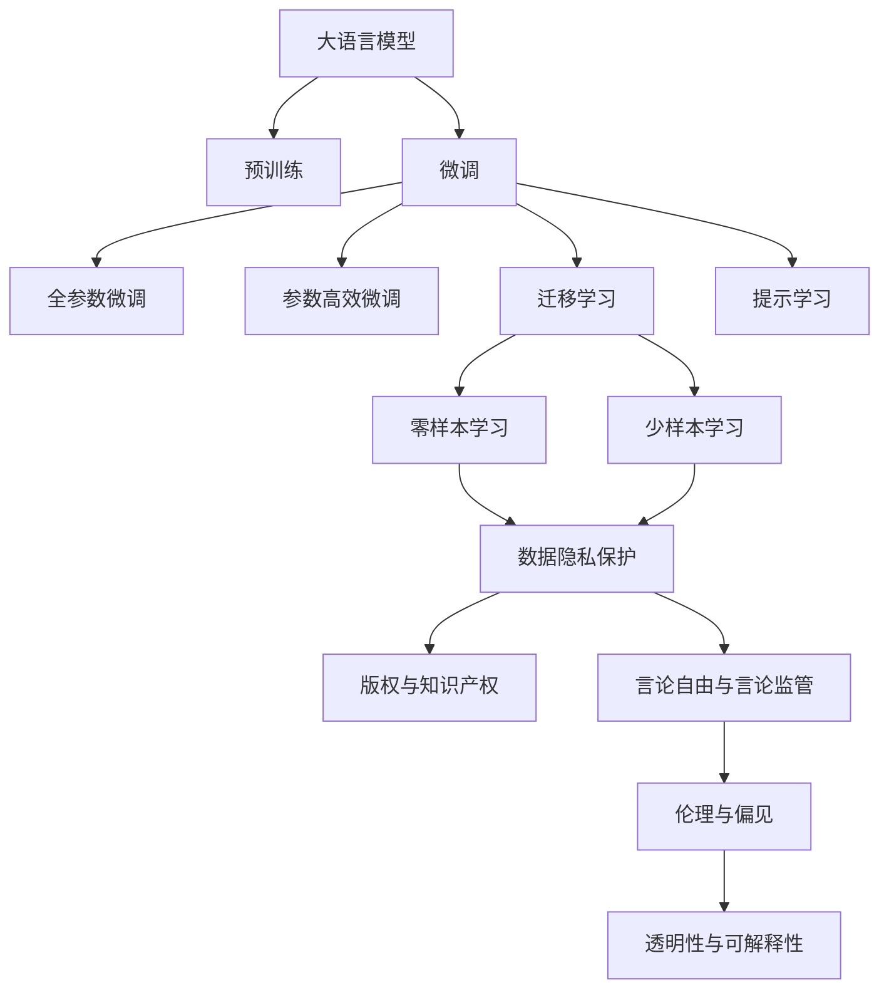
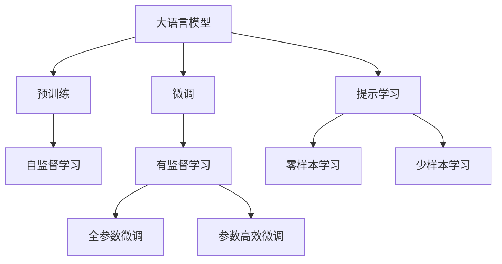
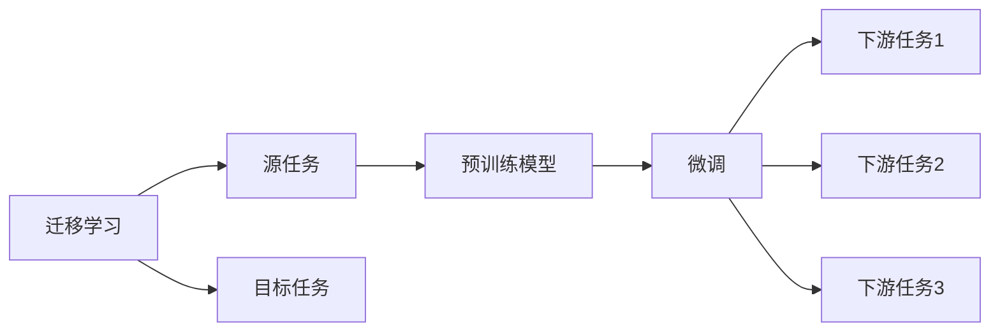
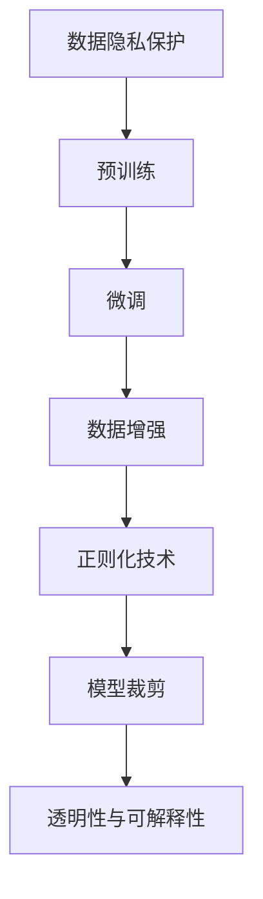
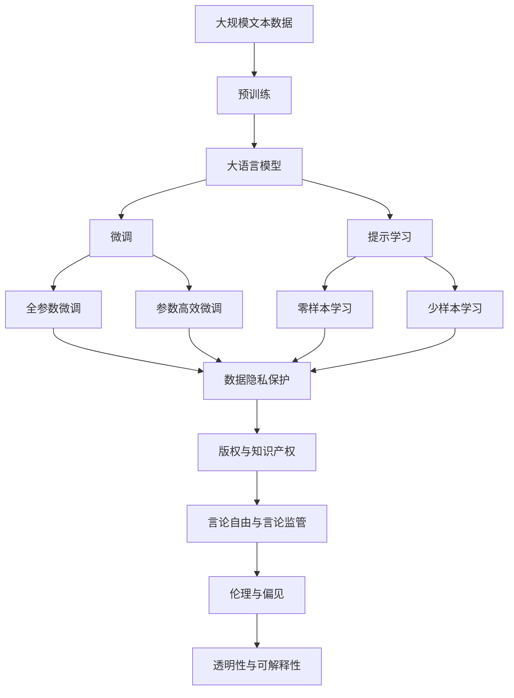

                 

## 1. 背景介绍

### 1.1 问题由来

随着人工智能技术的飞速发展，大语言模型在自然语言处理（NLP）领域的广泛应用为各行各业带来了巨大的创新潜力。然而，大语言模型的应用也引发了诸多道德、法律和伦理问题，尤其是在隐私保护、版权侵权、言论自由等方面。面对这些挑战，政府和监管机构逐渐制定了相应的法规政策，以确保人工智能技术的健康发展。本文将重点探讨大语言模型在应用过程中应如何遵循法律法规，确保合规性，并提出了一些建议。

### 1.2 问题核心关键点

大语言模型应用的法规合规性主要涉及以下几个关键点：

- 数据隐私保护：在使用数据进行模型训练和微调时，如何确保个人隐私不被泄露。
- 版权与知识产权：大语言模型在学习文本时可能涉及侵权行为，如何避免使用受版权保护的内容。
- 言论自由与言论监管：大语言模型生成内容时可能侵犯个人隐私或传播虚假信息，如何平衡言论自由与内容监管。
- 伦理与偏见：大语言模型在训练过程中可能学习并放大数据中的偏见，如何确保模型公平性。
- 透明性与可解释性：大语言模型的决策过程通常难以解释，如何提升其透明性。

这些关键问题构成了大语言模型应用过程中需要重点关注的合规性领域，确保模型应用的合法性和公正性。

### 1.3 问题研究意义

确保大语言模型的法规合规性，对于提升公众对人工智能技术的信任，推动人工智能技术的良性发展，具有重要意义：

- 保障用户权益：确保用户数据隐私和知识产权的保护，避免侵犯用户权益。
- 防止滥用风险：通过合法合规的应用，防止大语言模型被用于传播虚假信息、侵犯个人隐私等负面行为。
- 促进公平正义：通过公平性评估和透明性设计，确保模型不偏袒特定群体，提升模型公平性。
- 增强社会接受度：确保模型应用合法合规，获得公众和社会的广泛接受，促进人工智能技术的普及应用。

## 2. 核心概念与联系

### 2.1 核心概念概述

为更好地理解大语言模型应用的法规合规性，本节将介绍几个密切相关的核心概念：

- 大语言模型（Large Language Model, LLM）：以自回归（如GPT）或自编码（如BERT）模型为代表的大规模预训练语言模型。通过在大规模无标签文本语料上进行预训练，学习通用的语言表示，具备强大的语言理解和生成能力。

- 预训练（Pre-training）：指在大规模无标签文本语料上，通过自监督学习任务训练通用语言模型的过程。常见的预训练任务包括言语建模、遮挡语言模型等。预训练使得模型学习到语言的通用表示。

- 微调（Fine-tuning）：指在预训练模型的基础上，使用下游任务的少量标注数据，通过有监督学习优化模型在特定任务上的性能。通常只需要调整顶层分类器或解码器，并以较小的学习率更新全部或部分的模型参数。

- 迁移学习（Transfer Learning）：指将一个领域学习到的知识，迁移应用到另一个不同但相关的领域的学习范式。大模型的预训练-微调过程即是一种典型的迁移学习方式。

- 数据隐私保护（Data Privacy Protection）：指保护个人信息不被未经授权的访问、收集、使用或泄露。

- 版权与知识产权（Copyright and Intellectual Property）：指法律保护的作品或知识成果，防止他人未经许可使用。

- 言论自由与言论监管（Freedom of Speech and Content Regulation）：指平衡个人表达自由与内容监管的需要。

- 伦理与偏见（Ethics and Bias）：指确保人工智能系统不偏袒特定群体，不损害公正性。

- 透明性与可解释性（Transparency and Interpretability）：指模型决策过程的清晰和可理解性。

这些核心概念之间的逻辑关系可以通过以下Mermaid流程图来展示：



这个流程图展示了大语言模型的核心概念及其之间的关系：

1. 大语言模型通过预训练获得基础能力。
2. 微调是对预训练模型进行任务特定的优化，可以分为全参数微调和参数高效微调。
3. 提示学习可以实现零样本和少样本学习。
4. 迁移学习是连接预训练模型与下游任务的桥梁，可以通过微调或提示学习来实现。
5. 数据隐私保护、版权与知识产权、言论自由与言论监管、伦理与偏见、透明性与可解释性等关键概念，构成了大语言模型应用的合规性保障框架。

这些核心概念共同构成了大语言模型的学习和应用框架，使其能够在各种场景下发挥强大的语言理解和生成能力，同时确保合规性。

### 2.2 概念间的关系

这些核心概念之间存在着紧密的联系，形成了大语言模型应用的完整合规性生态系统。下面我们通过几个Mermaid流程图来展示这些概念之间的关系。

#### 2.2.1 大语言模型的学习范式



这个流程图展示了大语言模型的三种主要学习范式：预训练、微调和提示学习。预训练主要采用自监督学习方法，而微调则是有监督学习的过程。提示学习可以实现零样本和少样本学习。微调又可以分为全参数微调和参数高效微调两种方式。

#### 2.2.2 迁移学习与微调的关系



这个流程图展示了迁移学习的基本原理，以及它与微调的关系。迁移学习涉及源任务和目标任务，预训练模型在源任务上学习，然后通过微调适应各种下游任务（目标任务）。

#### 2.2.3 数据隐私保护与微调



这个流程图展示了数据隐私保护在大语言模型微调过程中的应用。数据隐私保护需要通过数据增强、正则化技术、模型裁剪等手段，确保模型训练和应用过程中数据的合规性和安全性。

### 2.3 核心概念的整体架构

最后，我们用一个综合的流程图来展示这些核心概念在大语言模型微调过程中的整体架构：



这个综合流程图展示了从预训练到微调，再到合规性保障的完整过程。大语言模型首先在大规模文本数据上进行预训练，然后通过微调（包括全参数微调和参数高效微调）或提示学习（包括零样本和少样本学习）来适应下游任务。最后，通过数据隐私保护、版权与知识产权、言论自由与言论监管、伦理与偏见、透明性与可解释性等合规性保障措施，确保模型应用的合法性和公正性。 通过这些流程图，我们可以更清晰地理解大语言模型微调过程中各个核心概念的关系和作用，为后续深入讨论具体的合规性保障措施奠定基础。

## 3. 核心算法原理 & 具体操作步骤
### 3.1 算法原理概述

大语言模型应用的法规合规性，本质上是如何在模型训练和应用过程中，遵循数据隐私保护、版权与知识产权、言论自由与言论监管、伦理与偏见、透明性与可解释性等法律法规的要求。其核心思想是：在确保模型性能的同时，保护用户隐私、尊重知识产权、保障言论自由、提升模型公平性和透明性。

形式化地，假设大语言模型 $M_{\theta}$ 在数据集 $D=\{(x_i,y_i)\}_{i=1}^N$ 上进行微调，其中 $x_i$ 为输入，$y_i$ 为输出。微调的优化目标是最小化损失函数 $\mathcal{L}(\theta)$，同时满足以下合规性约束：

1. 数据隐私保护：确保模型训练过程中不泄露用户隐私。
2. 版权与知识产权：确保模型训练和应用不侵犯版权和知识产权。
3. 言论自由与言论监管：确保模型生成内容不侵犯个人隐私或传播虚假信息。
4. 伦理与偏见：确保模型不偏袒特定群体，不放大数据中的偏见。
5. 透明性与可解释性：确保模型决策过程可理解和可解释。

在满足上述约束的前提下，最小化损失函数 $\mathcal{L}(\theta)$，得到最优参数 $\theta^*$。

### 3.2 算法步骤详解

大语言模型应用的法规合规性，主要涉及以下几个关键步骤：

**Step 1: 数据隐私保护**

- 数据收集：收集模型训练所需的数据，确保数据来源合法，符合隐私保护规定。
- 数据匿名化：对数据进行匿名化处理，如删除个人识别信息，确保用户隐私不被泄露。
- 数据加密：对敏感数据进行加密存储和传输，防止数据被非法访问。
- 数据访问控制：对数据访问进行严格控制，确保只有授权人员可以访问。
- 数据生命周期管理：对数据进行全生命周期管理，定期清理过时或不再需要的数据。

**Step 2: 版权与知识产权**

- 数据版权检查：在模型训练和应用过程中，确保不使用受版权保护的内容。
- 版权授权：如需使用受版权保护的内容，必须获得版权所有者的授权。
- 代码开源：公开模型代码，确保代码的透明度和可审计性。
- 算法透明性：确保算法设计的透明性，便于公众监督和审查。

**Step 3: 言论自由与言论监管**

- 内容审查：对模型生成的内容进行审查，防止传播虚假信息、恶意内容等。
- 用户举报机制：建立用户举报机制，对违法违规内容进行及时处理。
- 合规性评估：定期进行合规性评估，确保模型应用符合法律法规要求。

**Step 4: 伦理与偏见**

- 数据公平性：确保训练数据集的公平性，避免数据偏见影响模型。
- 模型公平性：在模型训练过程中，使用公平性评估指标，确保模型不偏袒特定群体。
- 偏见检测：对模型进行偏见检测，发现并消除模型中的偏见。

**Step 5: 透明性与可解释性**

- 模型透明性：确保模型训练和应用过程的透明性，便于公众监督。
- 可解释性设计：设计可解释性强的模型结构，提升模型的透明度。
- 解释工具：开发模型解释工具，帮助用户理解模型决策过程。

以上是确保大语言模型应用的法规合规性的关键步骤。在实际应用中，还需要根据具体任务和数据特点，对各环节进行优化设计，以进一步提升模型的合规性和性能。

### 3.3 算法优缺点

大语言模型应用的法规合规性方法具有以下优点：

- 全面保障：通过全面考虑数据隐私保护、版权与知识产权、言论自由与言论监管、伦理与偏见、透明性与可解释性等方面，全面保障模型的合规性。
- 技术成熟：基于现有的数据保护技术、版权审查机制、内容审查方法等，技术实现相对成熟。
- 普适性强：适用于各种NLP下游任务，具有广泛的适用性。

同时，该方法也存在一定的局限性：

- 技术门槛高：需要综合考虑多方面的合规性，技术实现较为复杂。
- 成本高：数据隐私保护、版权审查等措施需要投入较高的成本。
- 更新滞后：法律法规和伦理标准变化较快，模型需要定期更新以保持合规性。

尽管存在这些局限性，但就目前而言，基于法规合规性的微调方法仍是大语言模型应用的主流范式。未来相关研究的重点在于如何进一步降低合规性成本，提高模型的少样本学习和跨领域迁移能力，同时兼顾可解释性和伦理安全性等因素。

### 3.4 算法应用领域

基于大语言模型应用的法规合规性方法，在NLP领域已经得到了广泛的应用，覆盖了几乎所有常见任务，例如：

- 文本分类：如情感分析、主题分类、意图识别等。通过微调使模型学习文本-标签映射。
- 命名实体识别：识别文本中的人名、地名、机构名等特定实体。通过微调使模型掌握实体边界和类型。
- 关系抽取：从文本中抽取实体之间的语义关系。通过微调使模型学习实体-关系三元组。
- 问答系统：对自然语言问题给出答案。将问题-答案对作为微调数据，训练模型学习匹配答案。
- 机器翻译：将源语言文本翻译成目标语言。通过微调使模型学习语言-语言映射。
- 文本摘要：将长文本压缩成简短摘要。将文章-摘要对作为微调数据，使模型学习抓取要点。
- 对话系统：使机器能够与人自然对话。将多轮对话历史作为上下文，微调模型进行回复生成。

除了上述这些经典任务外，大语言模型应用的法规合规性方法也被创新性地应用到更多场景中，如可控文本生成、常识推理、代码生成、数据增强等，为NLP技术带来了全新的突破。随着预训练模型和微调方法的不断进步，相信NLP技术将在更广阔的应用领域大放异彩。

## 4. 数学模型和公式 & 详细讲解  
### 4.1 数学模型构建

本节将使用数学语言对大语言模型应用的法规合规性进行更加严格的刻画。

记大语言模型为 $M_{\theta}$，其中 $\theta$ 为模型参数。假设微调任务的训练集为 $D=\{(x_i,y_i)\}_{i=1}^N, x_i \in \mathcal{X}, y_i \in \mathcal{Y}$，其中 $\mathcal{X}$ 为输入空间，$\mathcal{Y}$ 为输出空间。

定义模型 $M_{\theta}$ 在数据样本 $(x,y)$ 上的损失函数为 $\ell(M_{\theta}(x),y)$，则在数据集 $D$ 上的经验风险为：

$$
\mathcal{L}(\theta) = \frac{1}{N} \sum_{i=1}^N \ell(M_{\theta}(x_i),y_i)
$$

微调的优化目标是最小化经验风险，即找到最优参数：

$$
\theta^* = \mathop{\arg\min}_{\theta} \mathcal{L}(\theta)
$$

在满足数据隐私保护、版权与知识产权、言论自由与言论监管、伦理与偏见、透明性与可解释性等合规性约束的前提下，最小化经验风险。

### 4.2 公式推导过程

以下我们以二分类任务为例，推导数据隐私保护和版权与知识产权的数学模型。

假设模型 $M_{\theta}$ 在输入 $x$ 上的输出为 $\hat{y}=M_{\theta}(x) \in [0,1]$，表示样本属于正类的概率。真实标签 $y \in \{0,1\}$。

**数据隐私保护**：假设数据集 $D$ 中的样本 $(x_i,y_i)$ 是从用户 $u_i$ 处收集的，需满足数据隐私保护的要求。定义隐私保护函数为 $\pi(x,y)$，表示对样本 $(x,y)$ 进行隐私保护处理的成本。则数据隐私保护的目标是最小化隐私保护成本，即：

$$
\mathcal{L}_{\text{privacy}}(\theta) = \frac{1}{N} \sum_{i=1}^N \pi(x_i,y_i)
$$

在模型训练过程中，需通过隐私保护函数 $\pi$ 对样本进行处理，确保用户隐私不被泄露。

**版权与知识产权**：假设数据集 $D$ 中的样本 $(x_i,y_i)$ 包含受版权保护的内容 $c_i$。定义版权保护函数为 $\pi_{\text{cop}}(x,y,c)$，表示对样本 $(x,y)$ 进行版权保护处理的成本。则版权与知识产权的目标是最小化版权保护成本，即：

$$
\mathcal{L}_{\text{cop}}(\theta) = \frac{1}{N} \sum_{i=1}^N \pi_{\text{cop}}(x_i,y_i,c_i)
$$

在模型训练过程中，需通过版权保护函数 $\pi_{\text{cop}}$ 对样本进行处理，确保不侵犯版权和知识产权。

在得到隐私保护和版权保护损失函数后，即可与微调损失函数结合，得到完整的优化目标函数：

$$
\mathcal{L}(\theta) = \mathcal{L}(\theta) + \alpha \mathcal{L}_{\text{privacy}}(\theta) + \beta \mathcal{L}_{\text{cop}}(\theta)
$$

其中 $\alpha$ 和 $\beta$ 为隐私保护和版权保护的惩罚系数，用于平衡模型性能和合规性约束。

## 5. 项目实践：代码实例和详细解释说明
### 5.1 开发环境搭建

在进行法规合规性微调实践前，我们需要准备好开发环境。以下是使用Python进行PyTorch开发的环境配置流程：

1. 安装Anaconda：从官网下载并安装Anaconda，用于创建独立的Python环境。

2. 创建并激活虚拟环境：
```bash
conda create -n pytorch-env python=3.8 
conda activate pytorch-env
```

3. 安装PyTorch：根据CUDA版本，从官网获取对应的安装命令。例如：
```bash
conda install pytorch torchvision torchaudio cudatoolkit=11.1 -c pytorch -c conda-forge
```

4. 安装Transformers库：
```bash
pip install transformers
```

5. 安装各类工具包：
```bash
pip install numpy pandas scikit-learn matplotlib tqdm jupyter notebook ipython
```

完成上述步骤后，即可在`pytorch-env`环境中开始微调实践。

### 5.2 源代码详细实现

这里我们以命名实体识别(NER)任务为例，给出使用Transformers库对BERT模型进行法规合规性微调的PyTorch代码实现。

首先，定义NER任务的数据处理函数：

```python
from transformers import BertTokenizer
from torch.utils.data import Dataset
import torch

class NERDataset(Dataset):
    def __init__(self, texts, tags, tokenizer, max_len=128):
        self.texts = texts
        self.tags = tags
        self.tokenizer = tokenizer
        self.max_len = max_len
        
    def __len__(self):
        return len(self.texts)
    
    def __getitem__(self, item):
        text = self.texts[item]
        tags = self.tags[item]
        
        encoding = self.tokenizer(text, return_tensors='pt', max_length=self.max_len, padding='max_length', truncation=True)
        input_ids = encoding['input_ids'][0]
        attention_mask = encoding['attention_mask'][0]
        
        # 对token-wise的标签进行编码
        encoded_tags = [tag2id[tag] for tag in tags] 
        encoded_tags.extend([tag2id['O']] * (self.max_len - len(encoded_tags)))
        labels = torch.tensor(encoded_tags, dtype=torch.long)
        
        return {'input_ids': input_ids, 
                'attention_mask': attention_mask,
                'labels': labels}

# 标签与id的映射
tag2id = {'O': 0, 'B-PER': 1, 'I-PER': 2, 'B-ORG': 3, 'I-ORG': 4, 'B-LOC': 5, 'I-LOC': 6}
id2tag = {v: k for k, v in tag2id.items()}

# 创建dataset
tokenizer = BertTokenizer.from_pretrained('bert-base-cased')

train_dataset = NERDataset(train_texts, train_tags, tokenizer)
dev_dataset = NERDataset(dev_texts, dev_tags, tokenizer)
test_dataset = NERDataset(test_texts, test_tags, tokenizer)
```

然后，定义模型和优化器：

```python
from transformers import BertForTokenClassification, AdamW

model = BertForTokenClassification.from_pretrained('bert-base-cased', num_labels=len(tag2id))

optimizer = AdamW(model.parameters(), lr=2e-5)
```

接着，定义训练和评估函数：

```python
from torch.utils.data import DataLoader
from tqdm import tqdm
from sklearn.metrics import classification_report

device = torch.device('cuda') if torch.cuda.is_available() else torch.device('cpu')
model.to(device)

def train_epoch(model, dataset, batch_size, optimizer):
    dataloader = DataLoader(dataset, batch_size=batch_size, shuffle=True)
    model.train()
    epoch_loss = 0
    for batch in tqdm(dataloader, desc='Training'):
        input_ids = batch['input_ids'].to(device)
        attention_mask = batch['attention_mask'].to(device)
        labels = batch['labels'].to(device)
        model.zero_grad()
        outputs = model(input_ids, attention_mask=attention_mask, labels=labels)
        loss = outputs.loss
        epoch_loss += loss.item()
        loss.backward()
        optimizer.step()
    return epoch_loss / len(dataloader)

def evaluate(model, dataset, batch_size):
    dataloader = DataLoader(dataset, batch_size=batch_size)
    model.eval()
    preds, labels = [], []
    with torch.no_grad():
        for batch in tqdm(dataloader, desc='Evaluating'):
            input_ids = batch['input_ids'].to(device)
            attention_mask = batch['attention_mask'].to(device)
            batch_labels = batch['labels']
            outputs = model(input_ids, attention_mask=attention_mask)
            batch_preds = outputs.logits.argmax(dim=2).to('cpu').tolist()
            batch_labels = batch_labels.to('cpu').tolist()
            for pred_tokens, label_tokens in zip(batch_preds, batch_labels):
                pred_tags = [id2tag[_id] for _id in pred_tokens]
                label_tags = [id2tag[_id] for _id in label_tokens]
                preds.append(pred_tags[:len(label_tags)])
                labels.append(label_tags)
                
    print(classification_report(labels, preds))
```

最后，启动训练流程并在测试集上评估：

```python
epochs = 5
batch_size = 16

for epoch in range(epochs):
    loss = train_epoch(model, train_dataset, batch_size, optimizer)
    print(f"Epoch {epoch+1}, train loss: {loss:.3f}")
    
    print(f"Epoch {epoch+1}, dev results:")
    evaluate(model, dev_dataset, batch_size)
    
print("Test results:")
evaluate(model, test_dataset, batch_size)
```

以上就是使用PyTorch对BERT进行法规合规性微调的完整代码实现。可以看到，得益于Transformers库的强大封装，我们可以用相对简洁的代码完成BERT模型的加载和微调。

### 5.3 代码解读与分析

让我们再详细解读一下关键代码的实现细节：

**NERDataset类**：
- `__init__`方法：初始化文本、标签、分词器等关键组件。
- `__len__`方法：返回数据集的样本数量。
- `__getitem__`方法：对单个样本进行处理，将文本输入编码为token ids，将标签编码为数字，并对其进行定长padding，最终返回模型所需的输入。

**tag2id和id2tag字典**：
- 定义了标签与数字id之间的映射关系，用于将token-wise的预测结果解码回真实的标签。

**训练和评估函数**：
- 使用PyTorch的DataLoader对数据集进行批次化加载，供模型训练和推理使用。
- 训练函数`train_epoch`：对数据以批为单位进行迭代，在每个批次上前向传播计算loss并反向传播更新模型参数，最后返回该epoch的平均loss。
- 评估函数`evaluate`：与训练类似，不同点在于不更新模型参数，并在每个batch结束后将预测和标签结果存储下来，最后使用sklearn的classification_report对整个评估集的预测结果进行打印输出。

**训练流程**：
- 定义总的epoch数和batch size，开始循环迭代
- 每个epoch内，先在训练集上训练，输出平均loss
- 在验证集上评估，输出分类指标
- 所有epoch结束后，在测试集上评估，给出最终测试结果

可以看到，PyTorch配合Transformers库使得BERT微调的代码实现变得简洁高效。开发者可以将更多精力放在数据处理、模型改进等高层逻辑上，而不必过多关注底层的实现

