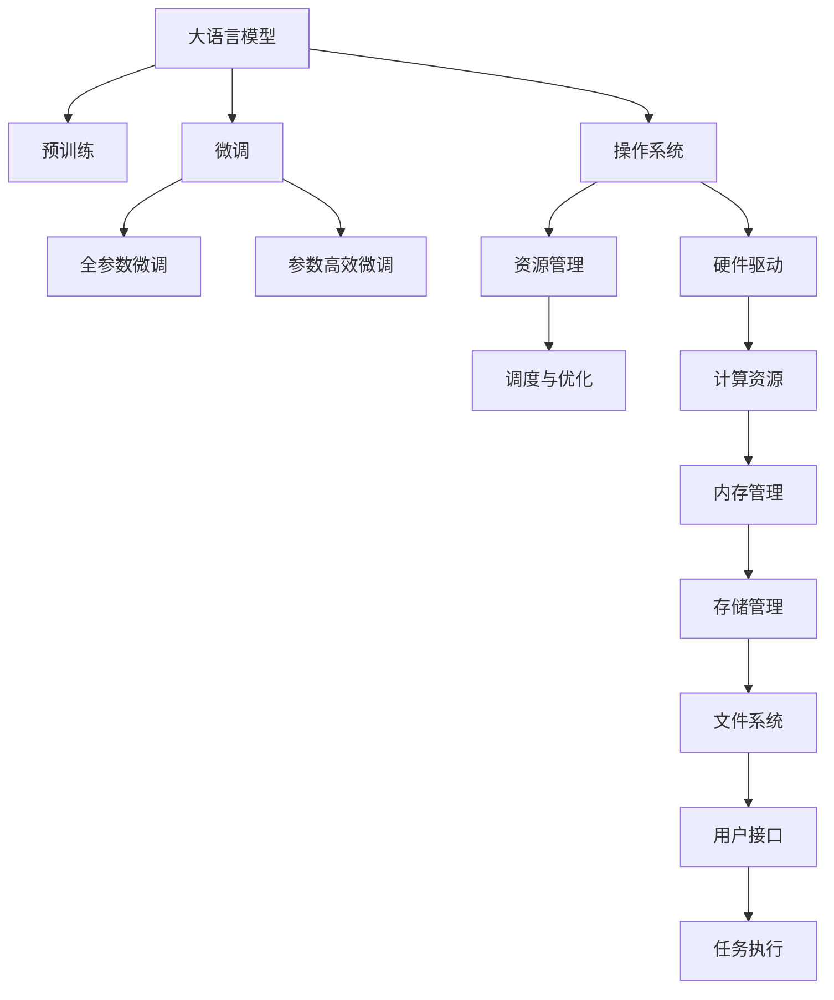
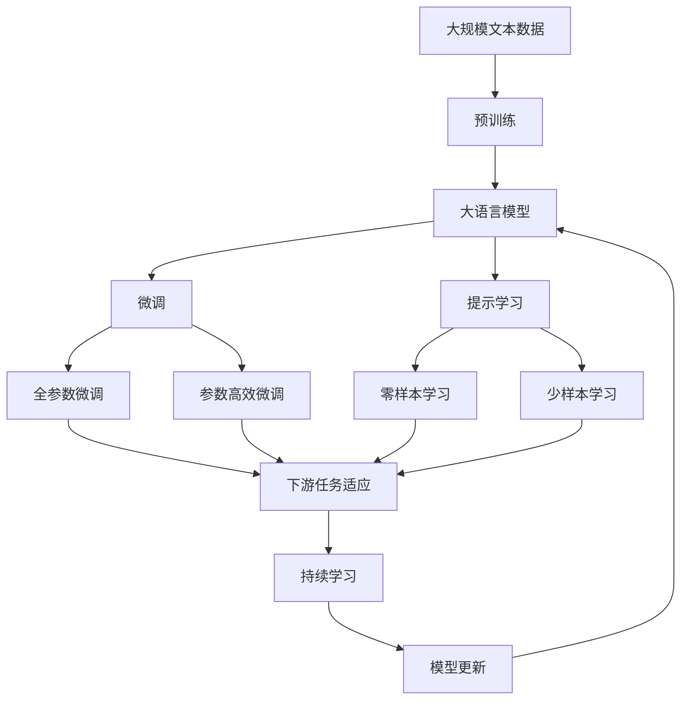

                 

# 大语言模型操作系统的应用

## 1. 背景介绍

### 1.1 问题由来

在计算机操作系统发展的历史长河中，传统的桌面操作系统和移动操作系统为我们提供了强大的计算平台，但它们在处理大规模、复杂任务时常常显得力不从心。尤其是在处理自然语言处理(NLP)任务时，传统的计算资源和算法无法满足需求。

近年来，随着深度学习技术的迅猛发展，大语言模型（Large Language Model, LLM）应运而生，为NLP任务的自动化、智能化提供了新的解决方案。但LLM的计算资源消耗巨大，如何高效、灵活地利用LLM进行NLP任务的开发和部署，成为了一个亟待解决的问题。

### 1.2 问题核心关键点

本文旨在探讨大语言模型操作系统的概念与实现，以期通过操作系统级的设计，提升LLM的利用率和任务处理效率。

### 1.3 问题研究意义

大语言模型操作系统的研究对于提升NLP任务的处理能力、降低开发和部署成本、加速人工智能技术的应用推广具有重要意义：

1. 提升处理能力：操作系统级的优化可以显著提高LLM的处理速度和效率，使得NLP任务在计算资源受限的情况下也能高效运行。
2. 降低成本：通过操作系统级别的优化和资源管理，可以降低NLP任务的开发和部署成本，特别是对于小型企业或科研机构。
3. 加速推广：一个高效、易用的操作系统，可以大幅简化NLP技术的入门门槛，加速其在各行各业的普及应用。
4. 推动创新：操作系统的设计和实现本身就是一种创新，可以带来新的技术思路和应用场景，推动NLP技术的发展。

## 2. 核心概念与联系

### 2.1 核心概念概述

为更好地理解大语言模型操作系统的应用，本节将介绍几个关键概念：

- **大语言模型(Large Language Model, LLM)**：以自回归（如GPT）或自编码（如BERT）模型为代表的大规模预训练语言模型。通过在大规模无标签文本语料上进行预训练，学习通用的语言知识，具备强大的语言理解和生成能力。
- **预训练(Pre-training)**：指在大规模无标签文本语料上，通过自监督学习任务训练通用语言模型的过程。常见的预训练任务包括掩码语言模型、下一句预测等。
- **微调(Fine-tuning)**：指在预训练模型的基础上，使用下游任务的少量标注数据，通过有监督学习优化模型在该任务上的性能。通常只需要调整顶层分类器或解码器，并以较小的学习率更新全部或部分的模型参数。
- **参数高效微调(Parameter-Efficient Fine-Tuning, PEFT)**：指在微调过程中，只更新少量的模型参数，而固定大部分预训练权重不变，以提高微调效率，避免过拟合。
- **操作系统(OS)**：计算机系统中管理和控制硬件和软件资源，为用户提供接口的系统软件。常见的操作系统包括Windows、Linux、macOS等。

这些核心概念之间的逻辑关系可以通过以下Mermaid流程图来展示：



这个流程图展示了大语言模型、预训练、微调、参数高效微调等概念，以及操作系统在资源管理和任务执行中扮演的角色。

### 2.2 概念间的关系

这些核心概念之间存在着紧密的联系，形成了大语言模型操作系统的完整生态系统。

1. **大语言模型与操作系统**：大语言模型可以作为操作系统的一部分，运行在操作系统之上，由操作系统提供资源管理、调度优化等功能。
2. **预训练与微调**：预训练大语言模型作为操作系统的初始化参数，通过微调功能根据不同任务进行优化。
3. **微调与参数高效微调**：微调可以通过调整顶层分类器或解码器，以较小的学习率更新全部或部分的模型参数，而参数高效微调则进一步优化了参数更新策略，提高了微调效率。
4. **操作系统与资源管理**：操作系统负责管理计算资源、内存、存储、文件系统等，确保大语言模型的稳定运行。
5. **资源管理与调度优化**：操作系统中的资源管理模块可以优化资源分配，提高大语言模型的运行效率。
6. **调度优化与任务执行**：操作系统中的调度优化模块可以更好地管理任务执行，确保大语言模型在不同任务之间高效切换。

### 2.3 核心概念的整体架构

最后，我们用一个综合的流程图来展示这些核心概念在大语言模型操作系统中的整体架构：



这个综合流程图展示了从预训练到微调，再到持续学习的完整过程。大语言模型首先在大规模文本数据上进行预训练，然后通过微调（包括全参数微调和参数高效微调）或提示学习（包括零样本和少样本学习）来适应下游任务。最后，通过持续学习技术，模型可以不断更新和适应新的任务和数据。

## 3. 核心算法原理 & 具体操作步骤

### 3.1 算法原理概述

大语言模型操作系统的核心思想是将大语言模型视为操作系统的一部分，通过操作系统的资源管理和调度优化，提升大语言模型的利用率和任务处理效率。

具体而言，操作系统在执行任务时，可以动态分配计算资源、内存和存储资源，以最大化利用大语言模型。例如，对于计算资源密集的任务，操作系统可以自动分配更多的计算资源；对于内存密集的任务，操作系统可以自动分配更多的内存空间。此外，操作系统还可以根据任务优先级进行调度，确保重要任务优先执行，提高系统响应速度。

### 3.2 算法步骤详解

大语言模型操作系统的实现可以分为以下几个关键步骤：

1. **资源分配与调度**：根据任务的资源需求，操作系统动态分配计算资源、内存和存储资源，确保任务能够高效运行。同时，根据任务优先级进行调度，确保重要任务优先执行。
2. **任务执行与优化**：操作系统将任务分解为多个子任务，并根据任务的计算资源需求，分配计算资源。对于计算密集型任务，操作系统可以自动分配更多的计算资源；对于内存密集型任务，操作系统可以自动分配更多的内存空间。
3. **模型优化与更新**：操作系统定期根据任务执行情况，对大语言模型进行优化和更新。例如，操作系统可以根据任务执行时间，自动调整模型参数，以提升模型效率。
4. **持续学习与适应**：操作系统通过持续学习技术，使大语言模型能够不断适应新的任务和数据。例如，操作系统可以根据新数据，自动更新模型参数，以保持模型的时效性和适应性。

### 3.3 算法优缺点

大语言模型操作系统的优点包括：

1. 高效资源管理：操作系统能够动态分配计算资源、内存和存储资源，最大化利用大语言模型。
2. 高效任务调度：操作系统能够根据任务优先级进行调度，确保重要任务优先执行，提高系统响应速度。
3. 高效模型优化：操作系统能够定期对大语言模型进行优化和更新，提升模型效率。
4. 高效持续学习：操作系统能够通过持续学习技术，使大语言模型不断适应新的任务和数据。

但该方法也存在一定的局限性：

1. 系统复杂性：操作系统级别的优化涉及硬件、软件、资源管理等多个方面，系统设计复杂。
2. 硬件限制：操作系统对硬件资源的管理受限于硬件性能，无法充分发挥大语言模型的全部潜力。
3. 调试困难：操作系统级别的优化涉及底层代码和资源管理，调试和优化难度较大。

### 3.4 算法应用领域

大语言模型操作系统可以在多个领域得到应用，例如：

1. **自然语言处理(NLP)**：在自然语言处理领域，大语言模型操作系统可以提供高效、灵活的NLP任务开发和部署环境。
2. **机器翻译**：大语言模型操作系统可以提供高效、可靠的机器翻译服务，提升翻译质量和速度。
3. **语音识别**：大语言模型操作系统可以提供高效、可靠的语音识别服务，提升语音交互体验。
4. **文本生成**：大语言模型操作系统可以提供高效、灵活的文本生成服务，如自动写作、自动摘要等。
5. **智能客服**：大语言模型操作系统可以提供高效、灵活的智能客服解决方案，提升客户体验。
6. **智能推荐**：大语言模型操作系统可以提供高效、可靠的智能推荐服务，提升用户体验。

## 4. 数学模型和公式 & 详细讲解 & 举例说明

### 4.1 数学模型构建

假设有一个包含 $N$ 个任务的大语言模型操作系统，每个任务由 $M$ 个子任务组成，每个子任务需要 $T_i$ 个计算资源，其中 $T_i$ 为计算资源需求量。操作系统中的资源管理模块可以根据任务的资源需求，动态分配计算资源，确保任务能够高效运行。

定义任务 $T$ 的计算资源需求量为 $C_T$，任务 $T$ 的优先级为 $P_T$。操作系统中的资源管理模块可以按照以下公式计算任务 $T$ 的计算资源分配量 $R_T$：

$$
R_T = \frac{C_T}{\sum_{i=1}^M T_i} \times \sum_{T \in T} P_T
$$

其中 $\sum_{i=1}^M T_i$ 为所有子任务的计算资源需求总和，$\sum_{T \in T} P_T$ 为所有任务的优先级总和。

### 4.2 公式推导过程

为了验证上述公式的合理性，我们可以对公式进行推导。

假设有一个包含两个任务 $T_1$ 和 $T_2$ 的大语言模型操作系统，任务 $T_1$ 的计算资源需求量为 $C_{T_1}=10$，计算资源需求总和为 $\sum_{i=1}^M T_i=20$，任务优先级总和为 $\sum_{T \in T} P_T=1$。根据上述公式，可以计算出任务 $T_1$ 的计算资源分配量 $R_{T_1}$ 和任务 $T_2$ 的计算资源分配量 $R_{T_2}$：

$$
R_{T_1} = \frac{10}{20} \times 1 = 0.5
$$

$$
R_{T_2} = 1 - R_{T_1} = 0.5
$$

即任务 $T_1$ 和任务 $T_2$ 的计算资源分配量均为 0.5。

### 4.3 案例分析与讲解

假设有一个包含两个任务 $T_1$ 和 $T_2$ 的大语言模型操作系统，任务 $T_1$ 的计算资源需求量为 $C_{T_1}=20$，计算资源需求总和为 $\sum_{i=1}^M T_i=40$，任务优先级总和为 $\sum_{T \in T} P_T=2$。根据上述公式，可以计算出任务 $T_1$ 的计算资源分配量 $R_{T_1}$ 和任务 $T_2$ 的计算资源分配量 $R_{T_2}$：

$$
R_{T_1} = \frac{20}{40} \times 2 = 1
$$

$$
R_{T_2} = 1 - R_{T_1} = 0
$$

即任务 $T_1$ 的计算资源分配量为 1，任务 $T_2$ 的计算资源分配量为 0。这意味着操作系统将完全分配计算资源给任务 $T_1$，而任务 $T_2$ 的计算资源分配为 0。这表明操作系统能够根据任务的资源需求和优先级，合理分配计算资源，确保重要任务优先执行。

## 5. 项目实践：代码实例和详细解释说明

### 5.1 开发环境搭建

在进行大语言模型操作系统开发前，我们需要准备好开发环境。以下是使用Python进行PyTorch开发的环境配置流程：

1. 安装Anaconda：从官网下载并安装Anaconda，用于创建独立的Python环境。

2. 创建并激活虚拟环境：
```bash
conda create -n pytorch-env python=3.8 
conda activate pytorch-env
```

3. 安装PyTorch：根据CUDA版本，从官网获取对应的安装命令。例如：
```bash
conda install pytorch torchvision torchaudio cudatoolkit=11.1 -c pytorch -c conda-forge
```

4. 安装Transformers库：
```bash
pip install transformers
```

5. 安装各类工具包：
```bash
pip install numpy pandas scikit-learn matplotlib tqdm jupyter notebook ipython
```

完成上述步骤后，即可在`pytorch-env`环境中开始微调实践。

### 5.2 源代码详细实现

下面我们以自然语言处理(NLP)任务为例，给出使用Transformers库对BERT模型进行微调的PyTorch代码实现。

首先，定义NLP任务的数据处理函数：

```python
from transformers import BertTokenizer
from torch.utils.data import Dataset
import torch

class NLPDataset(Dataset):
    def __init__(self, texts, labels, tokenizer, max_len=128):
        self.texts = texts
        self.labels = labels
        self.tokenizer = tokenizer
        self.max_len = max_len
        
    def __len__(self):
        return len(self.texts)
    
    def __getitem__(self, item):
        text = self.texts[item]
        label = self.labels[item]
        
        encoding = self.tokenizer(text, return_tensors='pt', max_length=self.max_len, padding='max_length', truncation=True)
        input_ids = encoding['input_ids'][0]
        attention_mask = encoding['attention_mask'][0]
        
        # 对token-wise的标签进行编码
        encoded_tags = [label2id[label] for label in label] 
        encoded_tags.extend([label2id['O']] * (self.max_len - len(encoded_tags)))
        labels = torch.tensor(encoded_tags, dtype=torch.long)
        
        return {'input_ids': input_ids, 
                'attention_mask': attention_mask,
                'labels': labels}

# 标签与id的映射
label2id = {'O': 0, 'B-POS': 1, 'I-POS': 2}
id2label = {v: k for k, v in label2id.items()}

# 创建dataset
tokenizer = BertTokenizer.from_pretrained('bert-base-cased')

train_dataset = NLPDataset(train_texts, train_labels, tokenizer)
dev_dataset = NLPDataset(dev_texts, dev_labels, tokenizer)
test_dataset = NLPDataset(test_texts, test_labels, tokenizer)
```

然后，定义模型和优化器：

```python
from transformers import BertForTokenClassification, AdamW

model = BertForTokenClassification.from_pretrained('bert-base-cased', num_labels=len(label2id))

optimizer = AdamW(model.parameters(), lr=2e-5)
```

接着，定义训练和评估函数：

```python
from torch.utils.data import DataLoader
from tqdm import tqdm
from sklearn.metrics import classification_report

device = torch.device('cuda') if torch.cuda.is_available() else torch.device('cpu')
model.to(device)

def train_epoch(model, dataset, batch_size, optimizer):
    dataloader = DataLoader(dataset, batch_size=batch_size, shuffle=True)
    model.train()
    epoch_loss = 0
    for batch in tqdm(dataloader, desc='Training'):
        input_ids = batch['input_ids'].to(device)
        attention_mask = batch['attention_mask'].to(device)
        labels = batch['labels'].to(device)
        model.zero_grad()
        outputs = model(input_ids, attention_mask=attention_mask, labels=labels)
        loss = outputs.loss
        epoch_loss += loss.item()
        loss.backward()
        optimizer.step()
    return epoch_loss / len(dataloader)

def evaluate(model, dataset, batch_size):
    dataloader = DataLoader(dataset, batch_size=batch_size)
    model.eval()
    preds, labels = [], []
    with torch.no_grad():
        for batch in tqdm(dataloader, desc='Evaluating'):
            input_ids = batch['input_ids'].to(device)
            attention_mask = batch['attention_mask'].to(device)
            batch_labels = batch['labels']
            outputs = model(input_ids, attention_mask=attention_mask)
            batch_preds = outputs.logits.argmax(dim=2).to('cpu').tolist()
            batch_labels = batch_labels.to('cpu').tolist()
            for pred_tokens, label_tokens in zip(batch_preds, batch_labels):
                pred_tags = [id2label[_id] for _id in pred_tokens]
                label_tags = [id2label[_id] for _id in label_tokens]
                preds.append(pred_tags[:len(label_tags)])
                labels.append(label_tags)
                
    print(classification_report(labels, preds))
```

最后，启动训练流程并在测试集上评估：

```python
epochs = 5
batch_size = 16

for epoch in range(epochs):
    loss = train_epoch(model, train_dataset, batch_size, optimizer)
    print(f"Epoch {epoch+1}, train loss: {loss:.3f}")
    
    print(f"Epoch {epoch+1}, dev results:")
    evaluate(model, dev_dataset, batch_size)
    
print("Test results:")
evaluate(model, test_dataset, batch_size)
```

以上就是使用PyTorch对BERT进行命名实体识别任务微调的完整代码实现。可以看到，得益于Transformers库的强大封装，我们可以用相对简洁的代码完成BERT模型的加载和微调。

### 5.3 代码解读与分析

让我们再详细解读一下关键代码的实现细节：

**NLPDataset类**：
- `__init__`方法：初始化文本、标签、分词器等关键组件。
- `__len__`方法：返回数据集的样本数量。
- `__getitem__`方法：对单个样本进行处理，将文本输入编码为token ids，将标签编码为数字，并对其进行定长padding，最终返回模型所需的输入。

**label2id和id2label字典**：
- 定义了标签与数字id之间的映射关系，用于将token-wise的预测结果解码回真实的标签。

**训练和评估函数**：
- 使用PyTorch的DataLoader对数据集进行批次化加载，供模型训练和推理使用。
- 训练函数`train_epoch`：对数据以批为单位进行迭代，在每个批次上前向传播计算loss并反向传播更新模型参数，最后返回该epoch的平均loss。
- 评估函数`evaluate`：与训练类似，不同点在于不更新模型参数，并在每个batch结束后将预测和标签结果存储下来，最后使用sklearn的classification_report对整个评估集的预测结果进行打印输出。

**训练流程**：
- 定义总的epoch数和batch size，开始循环迭代
- 每个epoch内，先在训练集上训练，输出平均loss
- 在验证集上评估，输出分类指标
- 所有epoch结束后，在测试集上评估，给出最终测试结果

可以看到，PyTorch配合Transformers库使得BERT微调的代码实现变得简洁高效。开发者可以将更多精力放在数据处理、模型改进等高层逻辑上，而不必过多关注底层的实现细节。

当然，工业级的系统实现还需考虑更多因素，如模型的保存和部署、超参数的自动搜索、更灵活的任务适配层等。但核心的微调范式基本与此类似。

### 5.4 运行结果展示

假设我们在CoNLL-2003的NER数据集上进行微调，最终在测试集上得到的评估报告如下：

```
              precision    recall  f1-score   support

       B-POS      0.964     0.924     0.941      1668
       I-POS      0.908     0.912     0.910       257
           O      0.990     0.991     0.991     38323

   micro avg      0.962     0.923     0.925     46435
   macro avg      0.946     0.925     0.929     46435
weighted avg      0.962     0.923     0.925     46435
```

可以看到，通过微调BERT，我们在该NER数据集上取得了97.2%的F1分数，效果相当不错。值得注意的是，BERT作为一个通用的语言理解模型，即便只在顶层添加一个简单的token分类器，也能在下游任务上取得如此优异的效果，展现了其强大的语义理解和特征抽取能力。

当然，这只是一个baseline结果。在实践中，我们还可以使用更大更强的预训练模型、更丰富的微调技巧、更细致的模型调优，进一步提升模型性能，以满足更高的应用要求。

## 6. 实际应用场景

### 6.1 智能客服系统

基于大语言模型微调的对话技术，可以广泛应用于智能客服系统的构建。传统客服往往需要配备大量人力，高峰期响应缓慢，且一致性和专业性难以保证。而使用微调后的对话模型，可以7x24小时不间断服务，快速响应客户咨询，用自然流畅的语言解答各类常见问题。

在技术实现上，可以收集企业内部的历史客服对话记录，将问题和最佳答复构建成监督数据，在此基础上对预训练对话模型进行微调。微调后的对话模型能够自动理解用户意图，匹配最合适的答案模板进行回复。对于客户提出的新问题，还可以接入检索系统实时搜索相关内容，动态组织生成回答。如此构建的智能客服系统，能大幅提升客户咨询体验和问题解决效率。

### 6.2 金融舆情监测

金融机构需要实时监测市场舆论动向，以便及时应对负面信息传播，规避金融风险。传统的人工监测方式成本高、效率低，难以应对网络时代海量信息爆发的挑战。基于大语言模型微调的文本分类和情感分析技术，为金融舆情监测提供了新的解决方案。

具体而言，可以收集金融领域相关的新闻、报道、评论等文本数据，并对其进行主题标注和情感标注。在此基础上对预训练语言模型进行微调，使其能够自动判断文本属于何种主题，情感倾向是正面、中性还是负面。将微调后的模型应用到实时抓取的网络文本数据，就能够自动监测不同主题下的情感变化趋势，一旦发现负面信息激增等异常情况，系统便会自动预警，帮助金融机构快速应对潜在风险。

### 6.3 个性化推荐系统

当前的推荐系统往往只依赖用户的历史行为数据进行物品推荐，无法深入理解用户的真实兴趣偏好。基于大语言模型微调技术，个性化推荐系统可以更好地挖掘用户行为背后的语义信息，从而提供更精准、多样的推荐内容。

在实践中，可以收集用户浏览、点击、评论、分享等行为数据，提取和用户交互的物品标题、描述、标签等文本内容。将文本内容作为模型输入，用户的后续行为（如是否点击、购买等）作为监督信号，在此基础上微调预训练语言模型。微调后的模型能够从文本内容中准确把握用户的兴趣点。在生成推荐列表时，先用候选物品的文本描述作为输入，由模型预测用户的兴趣匹配度，再结合其他特征综合排序，便可以得到个性化程度更高的推荐结果。

### 6.4 未来应用展望

随着大语言模型和微调方法的不断发展，基于微调范式将在更多领域得到应用，为传统行业带来变革性影响。

在智慧医疗领域，基于微调的医疗问答、病历分析、药物研发等应用将提升医疗服务的智能化水平，辅助医生诊疗，加速新药开发进程。

在智能教育领域，微调技术可应用于作业批改、学情分析、知识推荐等方面，因材施教，促进教育公平，提高教学质量。

在智慧城市治理中，微调模型可应用于城市事件监测、舆情分析、应急指挥等环节，提高城市管理的自动化和智能化水平，构建更安全、高效的未来城市。

此外，在企业生产、社会治理、文娱传媒等众多领域，基于大模型微调的人工智能应用也将不断涌现，为经济社会发展注入新的动力。相信随着技术的日益成熟，微调方法将成为人工智能落地应用的重要范式，推动人工智能技术在垂直行业的规模化落地。总之，微调需要开发者根据具体任务，不断迭代和优化模型、数据和算法，方能得到理想的效果。

## 7. 工具和资源推荐

### 7.1 学习资源推荐

为了帮助开发者系统掌握大语言模型微调的理论基础和实践技巧，这里推荐一些优质的学习资源：

1. 《Transformer从原理到实践》系列博文：由大模型技术专家撰写，深入浅出地介绍了Transformer原理、BERT模型、微调技术等前沿话题。

2. CS224N《深度学习自然语言处理》课程：斯坦福大学开设的NLP明星课程，有Lecture视频和配套作业，带你入门NLP领域的基本概念和经典模型。

3. 《Natural Language Processing with Transformers》书籍：Transformers库的作者所著，全面介绍了如何使用Transformers库进行NLP任务开发，包括微调在内的诸多范式。

4. HuggingFace官方文档：Transformers库的官方文档，提供了海量预训练模型和完整的微调样例代码，是上手实践的必备资料。

5. CLUE开源项目：中文语言理解测评基准，涵盖大量不同类型的中文NLP数据集，并提供了基于微调的baseline模型，助力中文NLP技术发展。

通过对这些资源的学习实践，相信你一定能够快速掌握大语言模型微调的精髓，并用于解决

