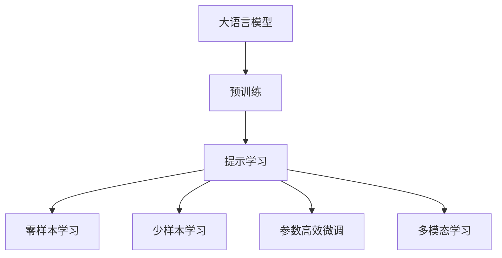
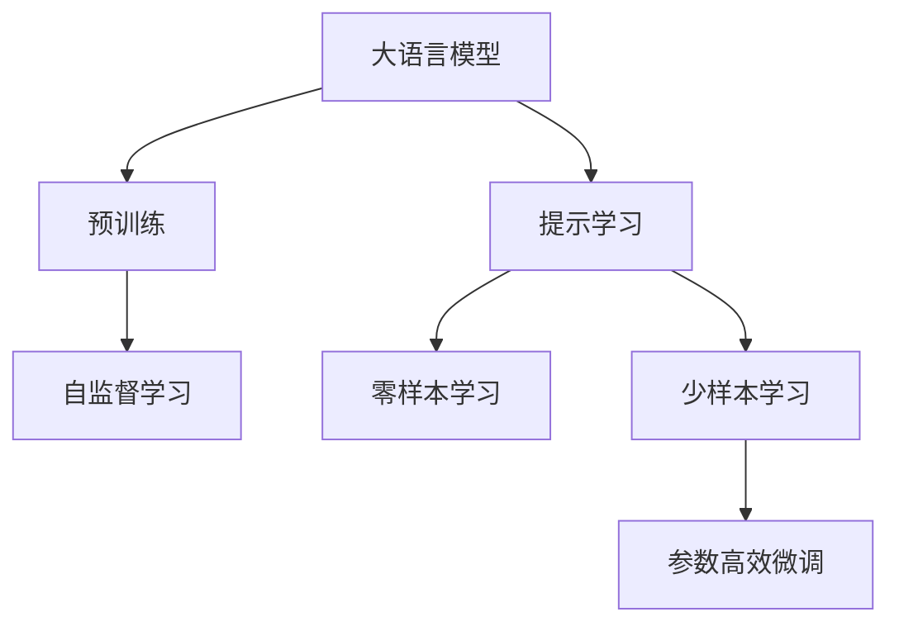
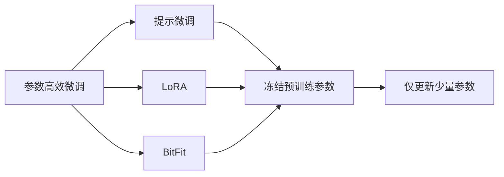
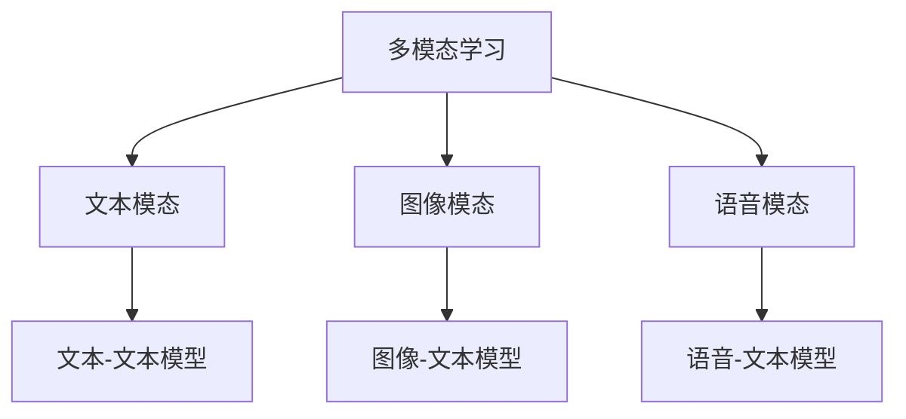
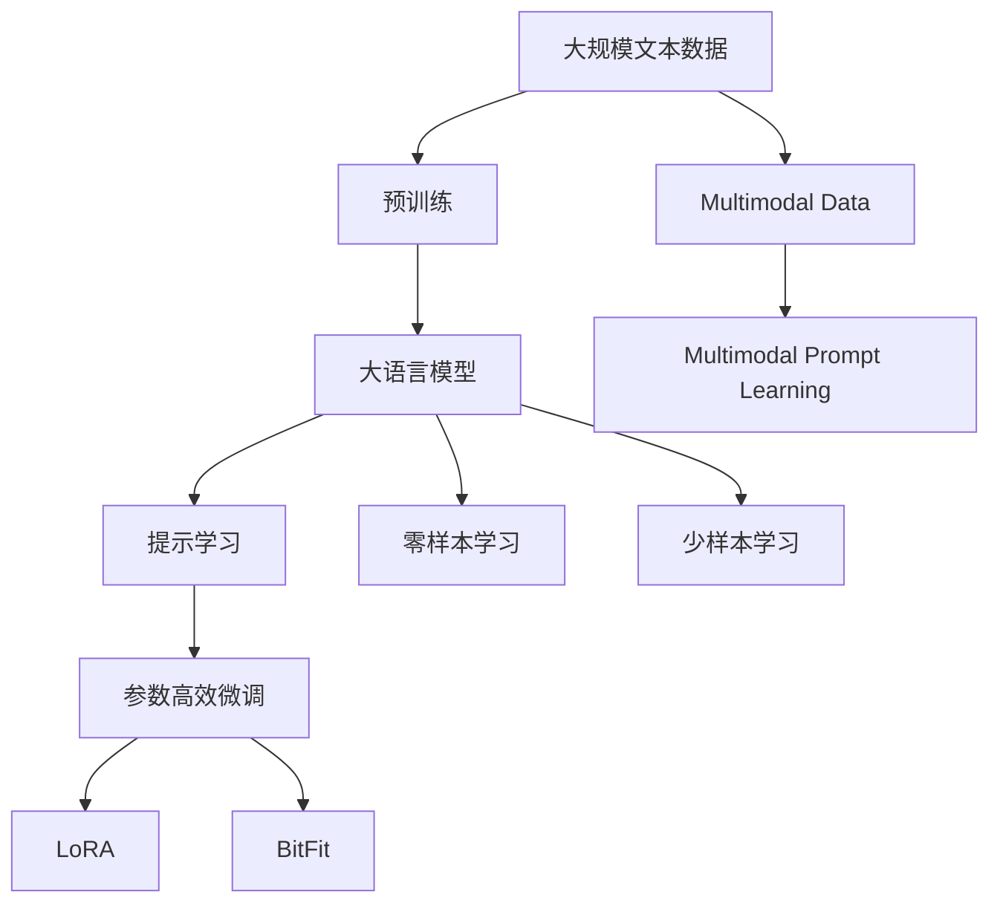

                 

# 大语言模型的prompt学习原理与代码实例讲解

> 关键词：大语言模型,Prompt Learning,提示模板,Prompt Template,参数高效微调,自然语言处理(NLP)

## 1. 背景介绍

### 1.1 问题由来
近年来，深度学习技术在自然语言处理（NLP）领域取得了显著进展，大语言模型（Large Language Model, LLMs）成为了研究的热点。大语言模型通过在大规模无标签文本数据上进行预训练，学习到了丰富的语言知识和常识，具备强大的语言理解和生成能力。然而，这些通用模型在特定领域的应用效果往往难以达到实际需求。因此，如何针对特定任务进行微调，提升模型性能，成为了一个重要课题。

提示学习（Prompt Learning）是一种有效的方法，通过精心设计输入文本的格式，引导模型按期望方式输出，从而减少微调参数。这种技术不仅可以降低微调的成本，还可以避免模型过拟合，提高模型在特定任务上的泛化能力。

### 1.2 问题核心关键点
提示学习的核心在于如何设计有效的提示模板（Prompt Template），使其能够充分引导模型理解任务，生成高质量的输出。提示模板一般由任务描述、输入数据和期望输出的文本组成，其设计需要考虑语言表达的合理性、任务描述的清晰性和生成文本的连贯性。

提示学习的关键步骤如下：
1. 确定任务和目标：明确需要进行的任务类型和期望的输出格式。
2. 设计提示模板：根据任务类型和目标，设计提示模板。
3. 微调模型：使用带有提示模板的数据进行微调，优化模型的生成能力。
4. 评估和优化：通过评估微调后的模型在特定任务上的性能，不断优化提示模板和微调参数。

提示学习已成为NLP领域的前沿技术，广泛应用于问答系统、对话系统、文本摘要、机器翻译等任务，显著提升了模型的效果和应用范围。

### 1.3 问题研究意义
提示学习技术对于拓展大语言模型的应用范围，提升下游任务的性能，加速NLP技术的产业化进程具有重要意义：

1. 降低应用开发成本：使用提示学习可以减少从头开发所需的数据、计算和人力等成本投入。
2. 提升模型效果：提示学习能够显著提升模型在特定任务上的表现。
3. 加速开发进度：standing on the shoulders of giants，提示学习使得开发者可以更快地完成任务适配，缩短开发周期。
4. 带来技术创新：提示学习促进了对预训练-提示的深入研究，催生了新的研究方向，如少样本学习、零样本学习等。
5. 赋能产业升级：提示学习使得NLP技术更容易被各行各业所采用，为传统行业数字化转型升级提供新的技术路径。

## 2. 核心概念与联系

### 2.1 核心概念概述

为更好地理解提示学习，本节将介绍几个密切相关的核心概念：

- 大语言模型（LLM）：以自回归（如GPT）或自编码（如BERT）模型为代表的大规模预训练语言模型。通过在大规模无标签文本语料上进行预训练，学习通用的语言表示，具备强大的语言理解和生成能力。

- 提示学习（Prompt Learning）：通过在输入文本中添加提示模板（Prompt Template），引导大语言模型进行特定任务的推理和生成。可以在不更新模型参数的情况下，实现零样本或少样本学习。

- 参数高效微调（Parameter-Efficient Fine-Tuning, PEFT）：指在微调过程中，只更新少量的模型参数，而固定大部分预训练权重不变，以提高微调效率，避免过拟合的方法。

- 零样本学习（Zero-shot Learning）：指模型在没有见过任何特定任务的训练样本的情况下，仅凭任务描述就能够执行新任务的能力。大语言模型通过预训练获得的广泛知识，使其能够理解任务指令并生成相应输出。

- 少样本学习（Few-shot Learning）：指在只有少量标注样本的情况下，模型能够快速适应新任务的学习方法。在大语言模型中，通常通过在输入中提供少量示例来实现，无需更新模型参数。

- 多模态学习（Multimodal Learning）：指模型能够同时处理多种模态（如文本、图像、语音）数据，并从中提取信息进行任务推理和生成。

这些核心概念之间的逻辑关系可以通过以下Mermaid流程图来展示：



这个流程图展示了大语言模型的核心概念及其之间的关系：

1. 大语言模型通过预训练获得基础能力。
2. 提示学习是一种不更新模型参数的方法，可以实现零样本和少样本学习。
3. 零样本和少样本学习依赖于提示模板的设计，与参数高效微调方法密切相关。
4. 多模态学习扩展了提示模板的设计范畴，可以实现更广泛的模态融合。

这些概念共同构成了大语言模型的学习和应用框架，使其能够在各种场景下发挥强大的语言理解和生成能力。通过理解这些核心概念，我们可以更好地把握大语言模型的工作原理和优化方向。

### 2.2 概念间的关系

这些核心概念之间存在着紧密的联系，形成了大语言模型的提示学习生态系统。下面我通过几个Mermaid流程图来展示这些概念之间的关系。

#### 2.2.1 大语言模型的学习范式



这个流程图展示了大语言模型的三种主要学习范式：预训练、提示学习和多模态学习。预训练主要采用自监督学习方法，而提示学习则通过在输入中添加提示模板，实现零样本和少样本学习。多模态学习进一步扩展了提示模板的设计，可以同时处理多种模态数据。

#### 2.2.2 参数高效微调与提示学习的关系



这个流程图展示了参数高效微调与提示学习的关系。参数高效微调方法通过冻结大部分预训练参数，只更新少量参数，从而提高微调效率。提示学习可以在不更新模型参数的情况下，通过精心设计的提示模板，实现零样本和少样本学习。

#### 2.2.3 多模态学习与提示学习的关系



这个流程图展示了多模态学习与提示学习的关系。多模态学习扩展了提示模板的设计范畴，可以实现更广泛的模态融合。在文本、图像、语音等多种模态的数据上，使用提示学习的方法，可以更全面地提取信息，提升模型的任务推理能力。

### 2.3 核心概念的整体架构

最后，我们用一个综合的流程图来展示这些核心概念在大语言模型提示学习过程中的整体架构：



这个综合流程图展示了从预训练到提示学习，再到多模态提示学习的完整过程。大语言模型首先在大规模文本数据上进行预训练，然后通过提示学习（包括零样本和少样本学习）来适应多模态任务，通过参数高效微调方法（如LoRA和BitFit）进一步提升性能。多模态数据通过多模态提示学习，可以更全面地提取信息，提升模型的任务推理能力。

## 3. 核心算法原理 & 具体操作步骤
### 3.1 算法原理概述

提示学习是一种基于自然语言处理（NLP）的微调方法，通过在输入文本中添加提示模板，引导大语言模型生成符合期望的输出。其核心思想是：将大语言模型看作一种"文本生成器"，通过精心设计的提示模板，使其在特定任务上生成高质量的输出。

形式化地，假设预训练语言模型为 $M_{\theta}$，其中 $\theta$ 为预训练得到的模型参数。给定提示模板 $P$ 和目标输出 $Y$，提示学习的优化目标是最小化目标函数：

$$
\min_{\theta} \mathcal{L}(P, Y)
$$

其中 $\mathcal{L}$ 为提示损失函数，用于衡量模型生成的文本与目标输出之间的差异。常见的提示损失函数包括BLEU分数、ROUGE分数、F1分数等。

通过梯度下降等优化算法，提示学习过程不断更新模型参数 $\theta$，最小化提示损失函数，使得模型生成的文本逼近目标输出。由于 $\theta$ 已经通过预训练获得了较好的初始化，因此即便在提示学习过程中，也能较快收敛到理想的模型参数。

### 3.2 算法步骤详解

提示学习的关键步骤如下：

**Step 1: 准备提示模板和数据集**
- 设计合理的提示模板 $P$，确保其描述任务清晰、语言表达合理。
- 准备下游任务的少量标注数据集 $D=\{(P_i, Y_i)\}_{i=1}^N$，其中 $P_i$ 为提示模板，$Y_i$ 为期望输出。

**Step 2: 设置提示学习超参数**
- 选择合适的优化算法及其参数，如AdamW、SGD等，设置学习率、批大小、迭代轮数等。
- 设置正则化技术及强度，包括权重衰减、Dropout、Early Stopping等。
- 确定冻结预训练参数的策略，如仅微调顶层，或全部参数都参与微调。

**Step 3: 执行提示训练**
- 将训练集数据分批次输入模型，前向传播计算提示损失。
- 反向传播计算参数梯度，根据设定的优化算法和学习率更新模型参数。
- 周期性在验证集上评估模型性能，根据性能指标决定是否触发 Early Stopping。
- 重复上述步骤直到满足预设的迭代轮数或 Early Stopping 条件。

**Step 4: 测试和部署**
- 在测试集上评估提示学习后模型 $M_{\hat{\theta}}$ 的性能，对比提示学习前后的精度提升。
- 使用提示学习后的模型对新样本进行推理预测，集成到实际的应用系统中。
- 持续收集新的数据，定期重新提示学习，以适应数据分布的变化。

以上是提示学习的一般流程。在实际应用中，还需要针对具体任务的特点，对提示学习过程的各个环节进行优化设计，如改进提示模板的设计，引入更多的正则化技术，搜索最优的超参数组合等，以进一步提升模型性能。

### 3.3 算法优缺点

提示学习技术具有以下优点：
1. 简单高效。只需准备少量标注数据，即可对预训练模型进行快速适配，获得较大的性能提升。
2. 通用适用。适用于各种NLP下游任务，包括分类、匹配、生成等，提示模板的设计灵活多样。
3. 参数高效。利用参数高效微调技术，在固定大部分预训练参数的情况下，仍可取得不错的提示学习效果。
4. 效果显著。在学术界和工业界的诸多任务上，提示学习方法已经刷新了最先进的性能指标。

同时，该方法也存在一定的局限性：
1. 依赖提示模板。提示模板的设计对提示学习效果影响较大，需要大量试错。
2. 生成文本多样性不足。提示学习生成的文本往往依赖于提示模板的质量，可能缺乏多样性和创造性。
3. 对数据质量要求高。提示学习的效果很大程度上取决于提示模板和标注数据的质量，数据噪声对模型输出有较大影响。
4. 可解释性不足。提示学习模型的决策过程通常缺乏可解释性，难以对其推理逻辑进行分析和调试。

尽管存在这些局限性，但就目前而言，提示学习仍是NLP任务微调的重要方法之一。未来相关研究的重点在于如何进一步优化提示模板的设计，提高模型的多样性和可解释性，以及如何降低对数据质量的依赖，提升模型的鲁棒性。

### 3.4 算法应用领域

提示学习技术在NLP领域已经得到了广泛的应用，覆盖了几乎所有常见任务，例如：

- 文本分类：如情感分析、主题分类、意图识别等。通过提示模板对模型进行引导，使其学习文本-标签映射。
- 命名实体识别：识别文本中的人名、地名、机构名等特定实体。通过提示模板对模型进行引导，使其学习实体边界和类型。
- 关系抽取：从文本中抽取实体之间的语义关系。通过提示模板对模型进行引导，使其学习实体-关系三元组。
- 问答系统：对自然语言问题给出答案。将问题-答案对作为提示模板，训练模型学习匹配答案。
- 机器翻译：将源语言文本翻译成目标语言。通过提示模板对模型进行引导，使其学习语言-语言映射。
- 文本摘要：将长文本压缩成简短摘要。通过提示模板对模型进行引导，使其学习抓取要点。
- 对话系统：使机器能够与人自然对话。通过提示模板对模型进行引导，使其按期望方式生成对话回复。

除了上述这些经典任务外，提示学习还被创新性地应用到更多场景中，如可控文本生成、常识推理、代码生成、数据增强等，为NLP技术带来了全新的突破。随着提示学习方法的不断进步，相信NLP技术将在更广阔的应用领域大放异彩。

## 4. 数学模型和公式 & 详细讲解 & 举例说明

### 4.1 数学模型构建

本节将使用数学语言对基于提示学习的微调过程进行更加严格的刻画。

记预训练语言模型为 $M_{\theta}$，其中 $\theta$ 为预训练得到的模型参数。假设提示学习的训练集为 $D=\{(P_i, Y_i)\}_{i=1}^N$，其中 $P_i$ 为提示模板，$Y_i$ 为期望输出。

定义提示损失函数 $\ell(P_i, Y_i)$，用于衡量模型生成的文本 $Y_i$ 与期望输出 $Y_i$ 之间的差异。常见的提示损失函数包括BLEU分数、ROUGE分数、F1分数等。

在提示学习过程中，目标是最小化提示损失函数，即：

$$
\min_{\theta} \sum_{i=1}^N \ell(P_i, Y_i)
$$

在实践中，我们通常使用基于梯度的优化算法（如AdamW、SGD等）来近似求解上述最优化问题。设 $\eta$ 为学习率，则参数的更新公式为：

$$
\theta \leftarrow \theta - \eta \nabla_{\theta}\sum_{i=1}^N \ell(P_i, Y_i)
$$

其中 $\nabla_{\theta}\sum_{i=1}^N \ell(P_i, Y_i)$ 为提示损失函数对参数 $\theta$ 的梯度，可通过反向传播算法高效计算。

### 4.2 公式推导过程

以下我们以BLEU分数为例，推导提示损失函数的计算公式。

BLEU分数是一种常用的文本生成评估指标，用于衡量模型生成的文本与参考文本之间的相似度。BLEU分数的定义如下：

$$
BLEU = \frac{1}{N} \sum_{i=1}^N \max(0, \sum_{j=1}^N \mathbb{I}(P_j = Y_j))
$$

其中 $N$ 为文本序列的长度，$\mathbb{I}(P_j = Y_j)$ 为指示函数，当 $P_j$ 和 $Y_j$ 相等时取1，否则取0。

BLEU分数的梯度公式为：

$$
\frac{\partial BLEU}{\partial \theta} = \frac{1}{N} \sum_{i=1}^N \sum_{j=1}^N \frac{\partial \mathbb{I}(P_j = Y_j)}{\partial \theta}
$$

利用链式法则，可以得到BLEU分数对模型参数 $\theta$ 的梯度：

$$
\frac{\partial \mathbb{I}(P_j = Y_j)}{\partial \theta} = \frac{\partial \log P(Y_j|P_j, \theta)}{\partial \theta} = \nabla_{\theta} P(Y_j|P_j, \theta)
$$

其中 $\nabla_{\theta} P(Y_j|P_j, \theta)$ 为模型在给定提示模板 $P_j$ 的情况下，生成输出 $Y_j$ 的似然对模型参数 $\theta$ 的梯度。

在实践中，BLEU分数的梯度可以通过蒙特卡罗方法或采样方法进行近似计算。常用的方法包括NCE（Noise Contrastive Estimation）和重要性采样（Importance Sampling）。

### 4.3 案例分析与讲解

假设我们构建一个基于提示学习的问答系统，其核心任务是给定问题 $P$，生成正确答案 $Y$。

**示例1: 情感分析任务**

对于情感分析任务，我们设计提示模板为："这篇评论的情感是？"，模型输出的情感标签为 "积极"、"中性"、"消极"。

提示学习流程如下：

1. 准备训练数据集，包含问题-情感标签对。
2. 设计提示模板，如"这篇评论的情感是？"
3. 使用提示学习算法（如BLEU分数）进行训练，优化模型生成文本的能力。
4. 在测试集上评估提示学习后的模型性能，如BLEU分数、ROUGE分数等。
5. 部署提示学习后的模型，对新问题进行推理预测。

**示例2: 文本分类任务**

对于文本分类任务，我们设计提示模板为："这篇文本属于哪个类别？"，模型输出的分类标签为 "体育"、"科技"、"娱乐"。

提示学习流程如下：

1. 准备训练数据集，包含文本-分类标签对。
2. 设计提示模板，如"这篇文本属于哪个类别？"
3. 使用提示学习算法（如F1分数）进行训练，优化模型生成文本的能力。
4. 在测试集上评估提示学习后的模型性能，如F1分数、准确率等。
5. 部署提示学习后的模型，对新文本进行分类预测。

在实际应用中，提示模板的设计需要考虑任务的复杂度、输入数据的结构、模型的生成能力等因素。例如，对于长文本分类任务，可能需要更复杂的提示模板，以便更好地引导模型理解输入内容。对于多模态任务，如同时处理文本和图像的分类任务，提示模板需要综合考虑文本和图像的特征，设计合理的输入格式。

## 5. 项目实践：代码实例和详细解释说明

### 5.1 开发环境搭建

在进行提示学习实践前，我们需要准备好开发环境。以下是使用Python进行PyTorch开发的环境配置流程：

1. 安装Anaconda：从官网下载并安装Anaconda，用于创建独立的Python环境。

2. 创建并激活虚拟环境：
```bash
conda create -n pytorch-env python=3.8 
conda activate pytorch-env
```

3. 安装PyTorch：根据CUDA版本，从官网获取对应的安装命令。例如：
```bash
conda install pytorch torchvision torchaudio cudatoolkit=11.1 -c pytorch -c conda-forge
```

4. 安装Transformers库：
```bash
pip install transformers
```

5. 安装各类工具包：
```bash
pip install numpy pandas scikit-learn matplotlib tqdm jupyter notebook ipython
```

完成上述步骤后，即可在`pytorch-env`环境中开始提示学习实践。

### 5.2 源代码详细实现

这里我们以提示学习进行情感分析任务为例，给出使用Transformers库对BERT模型进行提示学习的PyTorch代码实现。

首先，定义情感分析任务的数据处理函数：

```python
from transformers import BertTokenizer
from torch.utils.data import Dataset
import torch

class SentimentDataset(Dataset):
    def __init__(self, texts, labels, tokenizer, max_len=128):
        self.texts = texts
        self.labels = labels
        self.tokenizer = tokenizer
        self.max_len = max_len
        
    def __len__(self):
        return len(self.texts)
    
    def __getitem__(self, item):
        text = self.texts[item]
        label = self.labels[item]
        
        encoding = self.tokenizer(text, return_tensors='pt', max_length=self.max_len, padding='max_length', truncation=True)
        input_ids = encoding['input_ids'][0]
        attention_mask = encoding['attention_mask'][0]
        
        # 将标签编码为数字
        encoded_label = [label2id[label] for label in label]
        encoded_label.extend([label2id['O']] * (self.max_len - len(encoded_label)))
        labels = torch.tensor(encoded_label, dtype=torch.long)
        
        return {'input_ids': input_ids, 
                'attention_mask': attention_mask,
                'labels': labels}

# 标签与id的映射
label2id = {'O': 0, 'positive': 1, 'negative': 2, 'neutral': 3}
id2label = {v: k for k, v in label2id.items()}

# 创建dataset
tokenizer = BertTokenizer.from_pretrained('bert-base-cased')

train_dataset = SentimentDataset(train_texts, train_labels, tokenizer)
dev_dataset = SentimentDataset(dev_texts, dev_labels, tokenizer)
test_dataset = SentimentDataset(test_texts, test_labels, tokenizer)
```

然后，定义模型和优化器：

```python
from transformers import BertForTokenClassification, AdamW

model = BertForTokenClassification.from_pretrained('bert-base-cased', num_labels=len(label2id))

optimizer = AdamW(model.parameters(), lr=2e-5)
```

接着，定义训练和评估函数：

```python
from torch.utils.data import DataLoader
from tqdm import tqdm
from sklearn.metrics import classification_report

device = torch.device('cuda') if torch.cuda.is_available() else torch.device('cpu')
model.to(device)

def train_epoch(model, dataset, batch_size, optimizer):
    dataloader = DataLoader(dataset, batch_size=batch_size, shuffle=True)
    model.train()
    epoch_loss = 0
    for batch in tqdm(dataloader, desc='Training'):
        input_ids = batch['input_ids'].to(device)
        attention_mask = batch['attention_mask'].to(device)
        labels = batch['labels'].to(device)
        model.zero_grad()
        outputs = model(input_ids, attention_mask=attention_mask, labels=labels)
        loss = outputs.loss
        epoch_loss += loss.item()
        loss.backward()
        optimizer.step()
    return epoch_loss / len(dataloader)

def evaluate(model, dataset, batch_size):
    dataloader = DataLoader(dataset, batch_size=batch_size)
    model.eval()
    preds, labels = [], []
    with torch.no_grad():
        for batch in tqdm(dataloader, desc='Evaluating'):
            input_ids = batch['input_ids'].to(device)
            attention_mask = batch['attention_mask'].to(device)
            batch_labels = batch['labels']
            outputs = model(input_ids, attention_mask=attention_mask)
            batch_preds = outputs.logits.argmax(dim=2).to('cpu').tolist()
            batch_labels = batch_labels.to('cpu').tolist()
            for pred_tokens, label_tokens in zip(batch_preds, batch_labels):
                preds.append(pred_tokens[:len(label_tokens)])
                labels.append(label_tokens)
                
    print(classification_report(labels, preds))
```

最后，启动训练流程并在测试集上评估：

```python
epochs = 5
batch_size = 16

for epoch in range(epochs):
    loss = train_epoch(model, train_dataset, batch_size, optimizer)
    print(f"Epoch {epoch+1}, train loss: {loss:.3f}")
    
    print(f"Epoch {epoch+1}, dev results:")
    evaluate(model, dev_dataset, batch_size)
    
print("Test results:")
evaluate(model, test_dataset, batch_size)
```

以上就是使用PyTorch对BERT进行提示学习情感分析任务微调的完整代码实现。可以看到，得益于Transformers库的强大封装，我们可以用相对简洁的代码完成BERT模型的加载和提示学习。

### 5.3 代码解读与分析

让我们再详细解读一下关键代码的实现细节：

**SentimentDataset类**：
- `__init__`方法：初始化文本、标签、分词器等关键组件。
- `__len__`方法：返回数据集的样本数量。
- `__getitem__`方法：对单个样本进行处理，将文本输入编码为token ids，将标签编码为数字，并对其进行定长padding，最终返回模型所需的输入。

**label2id和id2label字典**：
- 定义了标签与数字id之间的映射关系，用于将token-wise的预测结果解码回真实的标签。

**训练和评估函数**：
- 使用PyTorch的DataLoader对数据集进行批次化加载，供模型训练和推理使用。
- 训练函数`train_epoch`：对数据以批为单位进行迭代，在每个批次上前向传播计算loss并反向传播更新模型参数

