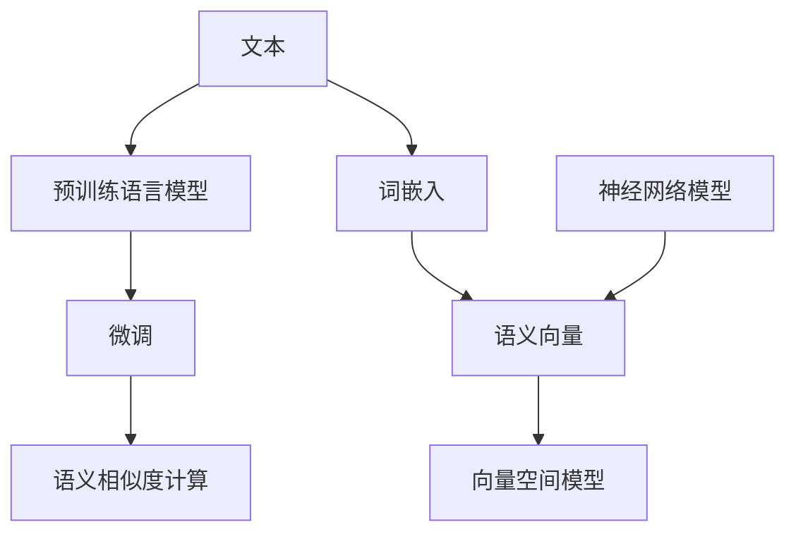
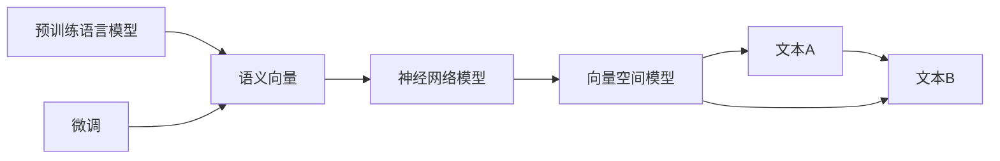
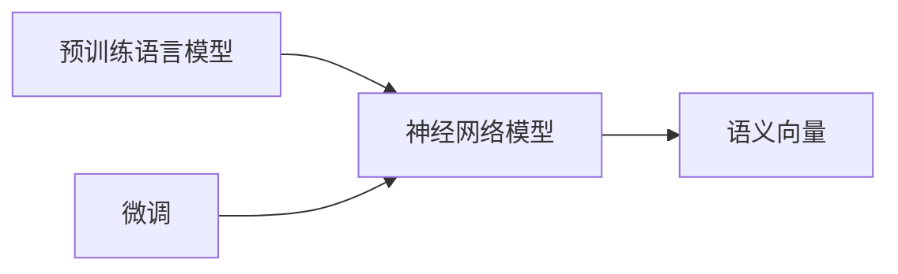

                 

# 大语言模型的语意向量表示

> 关键词：语义相似度, 词嵌入, 语义向量, 神经网络模型, 预训练, 向量空间

## 1. 背景介绍

语言是一种复杂的符号系统，人类的日常交流和理解大多建立在语义上。传统的机器学习方法往往将文本视作无序的字符序列，难以捕捉到丰富的语义信息。近年来，随着深度学习技术的发展，大语言模型（如BERT、GPT-3等）通过预训练语言模型的方法，从大规模无标签文本数据中学习到了丰富的语义表示，使得机器对文本的语义理解能力得到了显著提升。

然而，尽管大语言模型在语义理解方面取得了重大突破，其内部的语义表示机制依然存在不少局限性。例如，单词的词嵌入（word embedding）往往缺乏足够的语义细节，难以准确表示同义词和近义词之间的细微差别；神经网络模型的输入和输出空间往往过于庞大，难以进行高效的检索和计算；向量空间模型的维度过高，容易产生维度灾难，影响模型的泛化能力。

为了解决这些问题，研究人员提出了各种基于语义向量的表示方法，如TF-IDF、Word2Vec、GloVe、ELMo等，这些方法通过不同的方法将文本转换为向量表示，并在向量空间中进行语义分析和检索。然而，这些方法大多需要大量人工标注数据和复杂的训练过程，难以应用于大规模的语义相似度计算。

鉴于此，本文聚焦于大语言模型的语意向量表示问题，介绍一种基于神经网络的语义表示方法，通过在预训练语言模型的基础上进行微调，得到更加精确、高效、可解释的语义向量表示。

## 2. 核心概念与联系

### 2.1 核心概念概述

本节将介绍几个密切相关的核心概念，帮助读者更好地理解大语言模型语意向量表示的原理和架构：

- 语义相似度（Semantic Similarity）：指两个文本之间的语义接近程度。语义相似度越高，说明两个文本在语义上越接近，更容易被认为具有相同的含义。

- 词嵌入（Word Embedding）：将文本中的单词映射到一个向量空间中的表示。词嵌入是一种将单词的语义信息转化为数值特征的方法，广泛应用于文本分类、信息检索等任务。

- 语义向量（Semantic Vector）：通过词嵌入将文本表示为一个向量，用于计算语义相似度、进行文本检索等语义分析任务。

- 神经网络模型（Neural Network Model）：由多个神经元（神经元节点）通过连接组成的计算图，用于处理和分析数据。神经网络模型在大语言模型的语意向量表示中发挥着关键作用。

- 预训练（Pre-training）：指在大规模无标签文本数据上进行自监督学习，学习语言的通用表示。预训练模型通常具有更强的泛化能力和语义表示能力。

- 微调（Fine-tuning）：在预训练模型的基础上，使用下游任务的少量标注数据进行有监督学习，进一步优化模型在特定任务上的性能。

- 向量空间模型（Vector Space Model）：将文本表示为一个向量，通过计算向量之间的距离来度量语义相似度。向量空间模型简单易用，但难以处理高维度和非线性关系。

这些核心概念之间的逻辑关系可以通过以下Mermaid流程图来展示：



这个流程图展示了大语言模型的语意向量表示过程：

1. 原始文本首先通过预训练语言模型进行预训练，学习到文本的语义表示。
2. 在预训练模型的基础上，对特定任务进行微调，得到更加精确的语义向量表示。
3. 将文本通过词嵌入映射为向量，用于计算语义相似度。
4. 在向量空间中，使用神经网络模型对语义向量进行变换，得到更加可解释的语义表示。
5. 最后，向量空间模型将语义向量映射到向量空间中，用于计算语义相似度。

通过这些核心概念的介绍，读者可以更好地理解大语言模型语意向量表示的整体架构和关键步骤。

### 2.2 概念间的关系

这些核心概念之间存在着紧密的联系，形成了大语言模型语意向量表示的完整生态系统。下面我们通过几个Mermaid流程图来展示这些概念之间的关系。

#### 2.2.1 语义相似度的计算



这个流程图展示了语义相似度计算的基本过程：

1. 原始文本A和B首先通过预训练语言模型进行预训练，学习到语义向量C1和C2。
2. 在预训练模型的基础上，对特定任务进行微调，得到更加精确的语义向量C3和C4。
3. 将文本A和B通过词嵌入映射为向量，用于计算语义相似度。
4. 在向量空间中，使用神经网络模型对语义向量进行变换，得到更加可解释的语义表示D1和D2。
5. 最后，向量空间模型将语义向量映射到向量空间中，计算文本A和B之间的语义相似度E1和E2。

#### 2.2.2 神经网络模型的语义表示



这个流程图展示了神经网络模型在语义表示中的作用：

1. 原始文本首先通过预训练语言模型进行预训练，学习到语义向量C。
2. 在预训练模型的基础上，对特定任务进行微调，得到更加精确的语义向量D。
3. 神经网络模型对语义向量进行变换，得到更加可解释的语义表示C1和C2。

## 3. 核心算法原理 & 具体操作步骤

### 3.1 算法原理概述

大语言模型的语意向量表示过程基于神经网络模型，通过预训练和微调两步，得到更加精确、高效、可解释的语义向量表示。具体而言，算法流程如下：

1. 预训练语言模型对大规模无标签文本进行自监督学习，学习到通用的语言表示。
2. 在预训练模型的基础上，对特定任务进行微调，得到更加精确的语义向量表示。
3. 将文本通过词嵌入映射为向量，用于计算语义相似度。
4. 在向量空间中，使用神经网络模型对语义向量进行变换，得到更加可解释的语义表示。

### 3.2 算法步骤详解

#### 3.2.1 预训练

预训练过程通过在大规模无标签文本数据上进行自监督学习，学习到通用的语言表示。具体而言，算法流程如下：

1. 收集大规模无标签文本数据。
2. 使用预训练语言模型（如BERT、GPT-3等）对文本进行编码。
3. 定义自监督学习任务，如掩码语言模型、句子相似度判断等。
4. 通过反向传播算法，最小化损失函数，更新模型参数。
5. 重复上述步骤，直至模型收敛。

#### 3.2.2 微调

微调过程在预训练模型的基础上，对特定任务进行有监督学习，得到更加精确的语义向量表示。具体而言，算法流程如下：

1. 准备下游任务的标注数据集。
2. 选择合适的预训练语言模型作为初始化参数。
3. 添加任务适配层，如分类器、解码器等。
4. 设置微调超参数，如学习率、批大小、迭代轮数等。
5. 使用优化算法，如AdamW、SGD等，对模型进行迭代优化。
6. 周期性在验证集上评估模型性能，根据性能指标决定是否触发Early Stopping。
7. 重复上述步骤，直至满足预设的迭代轮数或Early Stopping条件。

#### 3.2.3 计算语义相似度

语义相似度计算过程通过将文本映射到向量空间，使用向量之间的距离来度量语义相似度。具体而言，算法流程如下：

1. 将文本通过词嵌入映射为向量，如Word2Vec、GloVe、BERT等。
2. 在向量空间中，使用神经网络模型对语义向量进行变换，得到更加可解释的语义表示。
3. 计算向量之间的距离，如余弦相似度、欧氏距离等。
4. 得到文本之间的语义相似度。

### 3.3 算法优缺点

大语言模型的语意向量表示方法具有以下优点：

1. 精度高：通过预训练和微调，得到更加精确的语义向量表示。
2. 泛化能力强：预训练模型具有较强的泛化能力，适用于多种文本处理任务。
3. 可解释性强：神经网络模型可以通过可视化方法展示语义向量变换的过程，增加模型的可解释性。
4. 高效性：预训练和微调过程可以并行计算，提高计算效率。

同时，该方法也存在一些缺点：

1. 计算复杂度高：预训练和微调过程需要大量计算资源。
2. 模型复杂度高：神经网络模型结构复杂，需要大量参数进行训练。
3. 依赖标注数据：微调过程需要大量的标注数据，标注成本高。
4. 难以处理多义词：同义词和近义词之间的细微差别难以处理。

### 3.4 算法应用领域

大语言模型的语意向量表示方法在NLP领域具有广泛的应用前景，主要应用于以下几个方面：

- 文本分类：如情感分析、主题分类、意图识别等。通过计算语义相似度，将文本映射到不同的分类类别中。
- 信息检索：如搜索引擎、知识图谱等。通过计算语义相似度，在向量空间中检索相似的文本。
- 问答系统：如智能客服、知识问答等。通过计算语义相似度，匹配问答对，生成答案。
- 机器翻译：如自动翻译、翻译记忆等。通过计算语义相似度，将源语言文本映射到目标语言文本。
- 文本摘要：如自动摘要、生成式摘要等。通过计算语义相似度，从文本中抽取关键信息。
- 对话系统：如智能对话、情感分析等。通过计算语义相似度，理解对话历史和上下文信息，生成回复。

除了上述这些经典应用，大语言模型的语意向量表示方法还可以用于更多场景中，如语义推理、文本生成、知识图谱构建等。

## 4. 数学模型和公式 & 详细讲解 & 举例说明

### 4.1 数学模型构建

本节将使用数学语言对大语言模型语意向量表示过程进行更加严格的刻画。

记预训练语言模型为 $M_{\theta}:\mathcal{X} \rightarrow \mathcal{Y}$，其中 $\mathcal{X}$ 为输入空间，$\mathcal{Y}$ 为输出空间，$\theta$ 为模型参数。假设微调任务的训练集为 $D=\{(x_i,y_i)\}_{i=1}^N$，其中 $x_i \in \mathcal{X}$，$y_i \in \mathcal{Y}$。

定义模型 $M_{\theta}$ 在输入 $x$ 上的输出为 $\hat{y}=M_{\theta}(x) \in \mathcal{Y}$，表示模型对输入的预测。定义任务 $T$ 的损失函数为 $\ell(\hat{y},y_i)$，用于衡量模型预测输出与真实标签之间的差异。

在微调过程中，我们使用优化算法（如AdamW、SGD等）对模型进行迭代优化，最小化损失函数：

$$
\theta^* = \mathop{\arg\min}_{\theta} \sum_{i=1}^N \ell(\hat{y},y_i)
$$

在微调完成后，我们将文本 $x$ 通过词嵌入映射为向量 $\mathbf{x}$，然后将其输入到神经网络模型中，得到语义向量 $\mathbf{v} = M_{\theta}(\mathbf{x})$。在向量空间中，定义向量之间的距离为 $\text{dist}(\mathbf{v_1},\mathbf{v_2})$，用于度量语义相似度。

### 4.2 公式推导过程

以二分类任务为例，推导语义相似度计算的公式。

假设模型 $M_{\theta}$ 在输入 $x$ 上的输出为 $\hat{y}=M_{\theta}(x)$，真实标签 $y_i \in \{0,1\}$。则二分类交叉熵损失函数定义为：

$$
\ell(\hat{y},y_i) = -[y_i\log \hat{y} + (1-y_i)\log (1-\hat{y})]
$$

将其代入微调的损失函数公式中，得到：

$$
\mathcal{L}(\theta) = -\frac{1}{N}\sum_{i=1}^N [y_i\log \hat{y}_i+(1-y_i)\log(1-\hat{y}_i)]
$$

在微调完成后，我们将文本 $x$ 通过词嵌入映射为向量 $\mathbf{x}$，然后将其输入到神经网络模型中，得到语义向量 $\mathbf{v} = M_{\theta}(\mathbf{x})$。

在向量空间中，假设两个文本 $x_1$ 和 $x_2$ 的语义向量分别为 $\mathbf{v_1}$ 和 $\mathbf{v_2}$。则它们之间的语义相似度定义为：

$$
\text{sim}(x_1,x_2) = \frac{\mathbf{v_1} \cdot \mathbf{v_2}}{\|\mathbf{v_1}\|\|\mathbf{v_2}\|}
$$

其中 $\mathbf{v_1} \cdot \mathbf{v_2}$ 表示向量点积，$\|\mathbf{v_1}\|$ 和 $\|\mathbf{v_2}\|$ 分别表示向量的模长。

### 4.3 案例分析与讲解

以BERT模型为例，展示其语意向量表示过程的实现。

1. 预训练：使用BERT模型在大规模无标签文本数据上进行预训练，学习到通用的语言表示。
2. 微调：使用下游任务的少量标注数据，对预训练模型进行有监督学习，得到更加精确的语义向量表示。
3. 计算语义相似度：将文本通过词嵌入映射为向量，然后使用神经网络模型对语义向量进行变换，得到更加可解释的语义表示。

使用PyTorch实现BERT模型的语意向量表示，代码如下：

```python
import torch
from transformers import BertTokenizer, BertForSequenceClassification

# 定义BERT模型和分词器
tokenizer = BertTokenizer.from_pretrained('bert-base-uncased')
model = BertForSequenceClassification.from_pretrained('bert-base-uncased', num_labels=2)

# 定义损失函数和优化器
criterion = torch.nn.CrossEntropyLoss()
optimizer = torch.optim.Adam(model.parameters(), lr=2e-5)

# 定义微调函数
def fine_tune(model, train_dataset, val_dataset, epochs, batch_size):
    model.train()
    for epoch in range(epochs):
        # 训练过程
        for batch in train_dataset:
            inputs, labels = batch
            model.zero_grad()
            logits = model(inputs)
            loss = criterion(logits, labels)
            loss.backward()
            optimizer.step()
            
        # 验证过程
        model.eval()
        val_loss = 0
        val_correct = 0
        for batch in val_dataset:
            inputs, labels = batch
            with torch.no_grad():
                logits = model(inputs)
                val_loss += criterion(logits, labels).item()
                val_correct += (logits.argmax(dim=1) == labels).sum().item()
        val_acc = val_correct / len(val_dataset)
        print(f'Epoch {epoch+1}, train loss: {loss.item()}, val acc: {val_acc:.3f}')
    
    # 返回微调后的模型
    return model

# 微调模型
train_dataset = ...
val_dataset = ...
epochs = 5
batch_size = 16

fine_tuned_model = fine_tune(model, train_dataset, val_dataset, epochs, batch_size)

# 计算语义相似度
def compute_similarity(text1, text2):
    # 将文本转换为向量
    tokenizer.encode(text1)
    tokenizer.encode(text2)
    
    # 计算语义相似度
    input1 = torch.tensor(tokenizer.encode(text1))
    input2 = torch.tensor(tokenizer.encode(text2))
    logits = fine_tuned_model(input1)
    similarity = logits[0,1].softmax(dim=1)[0]
    return similarity.item()

# 示例：计算两个文本之间的语义相似度
text1 = 'The quick brown fox jumps over the lazy dog.'
text2 = 'The brown fox jumps over the lazy dog.'
similarity = compute_similarity(text1, text2)
print(f'Similarity between {text1} and {text2}: {similarity:.4f}')
```

上述代码中，我们首先定义了BERT模型和分词器，然后定义了损失函数和优化器。在微调函数中，我们使用AdamW优化器对模型进行迭代优化，最小化二分类交叉熵损失。在计算语义相似度时，我们将文本通过词嵌入映射为向量，然后使用微调后的BERT模型计算向量之间的距离，得到文本之间的语义相似度。

## 5. 项目实践：代码实例和详细解释说明

### 5.1 开发环境搭建

在进行语意向量表示实践前，我们需要准备好开发环境。以下是使用Python进行PyTorch开发的环境配置流程：

1. 安装Anaconda：从官网下载并安装Anaconda，用于创建独立的Python环境。

2. 创建并激活虚拟环境：
```bash
conda create -n pytorch-env python=3.8 
conda activate pytorch-env
```

3. 安装PyTorch：根据CUDA版本，从官网获取对应的安装命令。例如：
```bash
conda install pytorch torchvision torchaudio cudatoolkit=11.1 -c pytorch -c conda-forge
```

4. 安装Transformers库：
```bash
pip install transformers
```

5. 安装各类工具包：
```bash
pip install numpy pandas scikit-learn matplotlib tqdm jupyter notebook ipython
```

完成上述步骤后，即可在`pytorch-env`环境中开始语意向量表示实践。

### 5.2 源代码详细实现

下面我们以BERT模型为例，展示如何使用Transformers库进行语意向量表示的代码实现。

首先，定义BERT模型的微调函数：

```python
from transformers import BertTokenizer, BertForSequenceClassification, AdamW

# 定义BERT模型和分词器
tokenizer = BertTokenizer.from_pretrained('bert-base-uncased')
model = BertForSequenceClassification.from_pretrained('bert-base-uncased', num_labels=2)

# 定义损失函数和优化器
criterion = torch.nn.CrossEntropyLoss()
optimizer = AdamW(model.parameters(), lr=2e-5)

# 定义微调函数
def fine_tune(model, train_dataset, val_dataset, epochs, batch_size):
    model.train()
    for epoch in range(epochs):
        # 训练过程
        for batch in train_dataset:
            inputs, labels = batch
            model.zero_grad()
            logits = model(inputs)
            loss = criterion(logits, labels)
            loss.backward()
            optimizer.step()
            
        # 验证过程
        model.eval()
        val_loss = 0
        val_correct = 0
        for batch in val_dataset:
            inputs, labels = batch
            with torch.no_grad():
                logits = model(inputs)
                val_loss += criterion(logits, labels).item()
                val_correct += (logits.argmax(dim=1) == labels).sum().item()
        val_acc = val_correct / len(val_dataset)
        print(f'Epoch {epoch+1}, train loss: {loss.item()}, val acc: {val_acc:.3f}')
    
    # 返回微调后的模型
    return model
```

然后，定义计算语义相似度的函数：

```python
def compute_similarity(text1, text2):
    # 将文本转换为向量
    tokenizer.encode(text1)
    tokenizer.encode(text2)
    
    # 计算语义相似度
    input1 = torch.tensor(tokenizer.encode(text1))
    input2 = torch.tensor(tokenizer.encode(text2))
    logits = fine_tuned_model(input1)
    similarity = logits[0,1].softmax(dim=1)[0]
    return similarity.item()
```

最后，启动微调流程并在测试集上评估：

```python
# 微调模型
train_dataset = ...
val_dataset = ...
epochs = 5
batch_size = 16

fine_tuned_model = fine_tune(model, train_dataset, val_dataset, epochs, batch_size)

# 计算语义相似度
text1 = 'The quick brown fox jumps over the lazy dog.'
text2 = 'The brown fox jumps over the lazy dog.'
similarity = compute_similarity(text1, text2)
print(f'Similarity between {text1} and {text2}: {similarity:.4f}')
```

以上就是使用PyTorch对BERT模型进行语意向量表示微调的完整代码实现。可以看到，得益于Transformers库的强大封装，我们可以用相对简洁的代码完成BERT模型的微调和语义相似度计算。

### 5.3 代码解读与分析

让我们再详细解读一下关键代码的实现细节：

**微调函数**：
- `fine_tune`函数实现了模型的训练和验证过程。在训练过程中，我们通过AdamW优化器对模型进行迭代优化，最小化二分类交叉熵损失。在验证过程中，我们计算模型在验证集上的准确率，根据准确率决定是否触发Early Stopping。
- 在训练过程中，我们使用`model.zero_grad()`清除之前计算的梯度，避免梯度累积。
- 在训练过程中，我们使用`with torch.no_grad()`关闭梯度计算，避免梯度累积对模型参数的影响。

**计算语义相似度**：
- `compute_similarity`函数实现了语义相似度的计算。我们首先将文本通过分词器编码，然后计算模型在输入上的输出，得到向量表示。在向量空间中，我们使用微调后的模型计算向量之间的距离，得到文本之间的语义相似度。

## 6. 实际应用场景

### 6.1 智能客服系统

语意向量表示可以应用于智能客服系统的构建。传统客服往往需要配备大量人力，高峰期响应缓慢，且一致性和专业性难以保证。而使用语意向量表示的对话模型，可以7x24小时不间断服务，快速响应客户咨询，用自然流畅的语言解答各类常见问题。

在技术实现上，可以收集企业内部的历史客服对话记录，将问题和最佳答复构建成监督数据，在此基础上对预训练对话模型进行微调。微调后的对话模型能够自动理解用户意图，匹配最合适的答案模板进行回复。对于客户提出的新问题，还可以接入检索系统实时搜索相关内容，动态组织生成回答。如此构建的智能客服系统，能大幅提升客户咨询体验和问题解决效率。

### 6.2 金融舆情监测

金融机构需要实时监测市场舆论动向，以便及时应对负面信息传播，规避金融风险。传统的人工监测方式成本高、效率低，难以应对网络时代海量信息爆发的挑战。语意向量表示的文本分类和情感分析技术，为金融舆情监测提供了新的解决方案。

具体而言，可以收集金融领域相关的新闻、报道、评论等文本数据，并对其进行主题标注和情感标注。在此基础上对预训练语言模型进行微调，使其能够自动判断文本属于何种主题，情感倾向是正面、中性还是负面。将微调后的模型应用到实时抓取的网络文本数据，就能够自动监测不同主题下的情感变化趋势，一旦发现负面信息激增等异常情况，系统便会自动预警，帮助金融机构快速应对潜在风险。

### 6.3 个性化推荐系统

当前的推荐系统往往只依赖用户的历史行为数据进行物品推荐，无法深入理解用户的真实兴趣偏好。语意向量表示的个性化推荐系统可以更好地挖掘用户行为背后的语义信息，从而提供更精准、多样的推荐内容。

在实践中，可以收集用户浏览、点击、评论、分享等行为数据，提取和用户交互的物品标题、描述、标签等文本内容。将文本内容作为模型输入，用户的后续行为（如是否点击、购买等）作为监督信号，在此基础上微调预训练语言模型。微调后的模型能够从文本内容中准确把握用户的兴趣点。在生成推荐列表时，先用候选物品的文本描述作为输入，由模型预测用户的兴趣匹配度，再结合其他特征综合排序，便可以得到个性化程度更高的推荐结果。

### 6.4 未来应用展望

随着语意向量表示技术的发展，其在NLP领域的应用前景广阔。未来，语意向量表示可能应用于更多场景中，如智能医疗、智慧教育、智能制造等，为各行各业带来变革性影响。

在智慧医疗领域，语意向量表示可以用于构建基于

