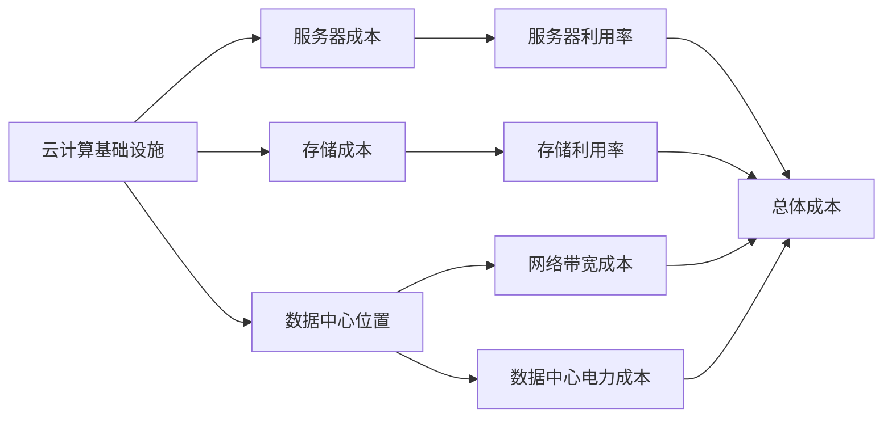
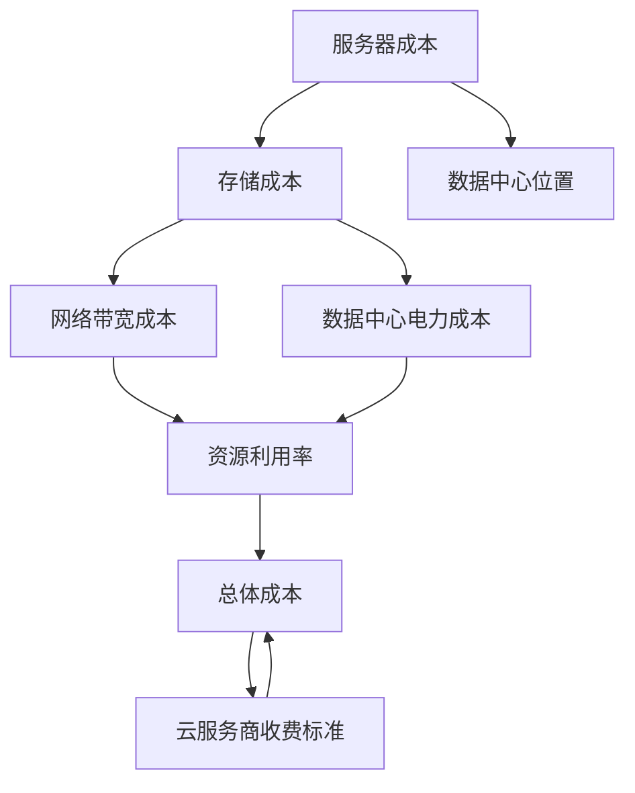

                 

## 1. 背景介绍

### 1.1 问题由来
在云计算快速发展的今天，企业越来越多地依赖云服务来支持其业务。云基础设施的成本，特别是数据中心和计算资源的成本，对企业的运营成本有着巨大的影响。如何有效降低云基础设施的成本，成为了企业和组织的重要课题。

### 1.2 问题核心关键点
云计算基础设施成本主要包括服务器、存储、网络带宽和数据中心维护等。其中，服务器和存储成本是主要的支出部分。企业在云基础设施上的投入，往往与数据中心的位置、资源的使用效率、云服务商的收费标准等因素密切相关。因此，需要综合考虑多个因素，采取合理的策略来降低成本。

### 1.3 问题研究意义
降低云基础设施的成本，不仅可以为企业节省大量的运营资金，还能提高企业的资源利用效率，使更多资金用于业务创新和市场拓展。同时，减少云基础设施的碳排放量，也有助于企业实现可持续发展目标。

## 2. 核心概念与联系

### 2.1 核心概念概述

为了更好地理解如何减少云基础设施的成本，我们需要了解几个核心概念：

- **云计算基础设施**：指用于支持云服务的物理硬件设施，包括服务器、存储、网络和数据中心等。
- **服务器成本**：云基础设施中最重要的组成部分之一，影响着整体的成本结构。
- **存储成本**：用于存储云数据的需求，直接关系到数据中心的规模和成本。
- **数据中心位置**：云基础设施部署的地理位置，直接影响网络带宽和电力成本。
- **资源利用率**：云资源的使用效率，如CPU、内存、网络带宽的利用率，直接影响成本。
- **云服务商的收费标准**：不同云服务商的收费模式和价格政策，对企业的总体支出有重要影响。

这些概念之间存在紧密的联系，通过综合管理和优化，可以有效降低云基础设施的成本。

### 2.2 概念间的关系

我们可以使用一个Mermaid流程图来展示这些概念之间的关系：



这个流程图展示了云计算基础设施的各个组成部分如何相互影响，最终决定整体成本。

### 2.3 核心概念的整体架构

最后，我们用一个综合的流程图来展示这些核心概念在云基础设施成本管理中的整体架构：



这个综合流程图展示了云基础设施成本的各个组成部分及其相互关系。

## 3. 核心算法原理 & 具体操作步骤
### 3.1 算法原理概述

减少云基础设施的成本，核心在于优化资源利用率和选择合理的云服务商。优化资源利用率可以通过服务器和存储的弹性伸缩、负载均衡等技术实现，而选择合理的云服务商则需要考虑其收费标准和服务质量。

具体来说，我们可以采用以下策略：

1. **弹性伸缩**：根据业务需求动态调整计算资源，避免资源的浪费和闲置。
2. **负载均衡**：将请求分配到多台服务器上，提高系统的可靠性和响应速度。
3. **实例终止**：在不需要时及时释放计算资源，避免无谓的计算成本。
4. **选择合适云服务商**：根据业务需求和成本预算，选择性价比高的云服务商。

### 3.2 算法步骤详解

减少云基础设施的成本，可以按照以下步骤进行：

**Step 1: 评估业务需求**
- 分析业务的负载特点和数据存储需求。
- 确定资源的使用高峰和低谷时段。

**Step 2: 设计弹性伸缩策略**
- 根据业务需求，设计服务器和存储的弹性伸缩策略。
- 使用云服务商提供的弹性伸缩API，自动调整资源。

**Step 3: 实施负载均衡**
- 部署负载均衡器，如Nginx、HAProxy等。
- 根据请求流量动态调整服务器的负载。

**Step 4: 优化资源利用率**
- 使用云服务商提供的监控工具，实时监控资源利用率。
- 定期进行资源清查，及时释放闲置资源。

**Step 5: 选择合适云服务商**
- 评估云服务商的收费标准和服务质量。
- 选择性价比高的云服务商，优化成本结构。

**Step 6: 持续优化**
- 根据业务变化，动态调整资源配置。
- 定期进行成本评估，优化成本结构。

### 3.3 算法优缺点

减少云基础设施成本的算法具有以下优点：

- **灵活性**：通过弹性伸缩和负载均衡，可以动态调整资源，避免资源浪费。
- **可控性**：通过监控和优化，可以有效控制成本，避免过度支出。
- **可扩展性**：通过选择合适的云服务商，可以灵活扩展资源，满足业务需求。

同时，该算法也存在以下缺点：

- **复杂性**：需要设计和管理多个策略，增加复杂度。
- **实施成本**：实施弹性伸缩和负载均衡等技术，需要额外的硬件和软件投入。
- **依赖服务商**：选择云服务商时，需要综合考虑其收费标准和服务质量，增加决策难度。

### 3.4 算法应用领域

减少云基础设施成本的算法，适用于各种规模和类型的企业，特别是在云计算环境中的业务运营。具体应用领域包括：

- **电子商务**：根据订单和流量变化，动态调整计算资源，优化库存管理。
- **金融服务**：根据交易和结算需求，灵活调整计算资源，提高交易处理能力。
- **内容服务**：根据用户访问流量，动态调整存储和计算资源，优化用户体验。
- **数据分析**：根据数据处理需求，灵活调整计算资源，提高数据处理效率。
- **游戏开发**：根据游戏并发需求，动态调整计算资源，优化游戏性能。

## 4. 数学模型和公式 & 详细讲解
### 4.1 数学模型构建

为了更好地理解减少云基础设施成本的算法，我们将使用数学模型来描述其基本原理。假设企业有一个固定数量的计算资源R，单位时间的成本为C，则总成本T可以表示为：

$$ T = R \times C \times T_{\text{运行时间}} $$

其中，T_{\text{运行时间}}表示计算资源的实际运行时间。通过优化T_{\text{运行时间}}，可以显著降低总成本T。

### 4.2 公式推导过程

我们可以进一步推导出降低成本的公式。假设企业可以根据需求动态调整计算资源R，根据需求变化，计算资源的实际运行时间T_{\text{运行时间}}可以分为两个部分：T_{\text{高峰时间}}和T_{\text{低谷时间}}。

在高峰时间，企业需要更多的计算资源，此时计算资源的实际运行时间为T_{\text{高峰时间}}；在低谷时间，企业需要的计算资源减少，此时计算资源的实际运行时间为T_{\text{低谷时间}}。根据需求调整计算资源，总运行时间T_{\text{运行时间}}可以表示为：

$$ T_{\text{运行时间}} = T_{\text{高峰时间}} \times \alpha + T_{\text{低谷时间}} \times (1 - \alpha) $$

其中，$\alpha$表示高峰时间的占比。通过优化$\alpha$，可以降低总成本T。

### 4.3 案例分析与讲解

以一个电商企业的网站为例，假设该网站高峰时间段为每天的10:00-12:00和17:00-19:00，低谷时间段为其他时间。假设高峰时间段和低谷时间段分别需要计算资源R_{\text{高峰}}和R_{\text{低谷}}，计算资源的价格为C，则总成本T可以表示为：

$$ T = R_{\text{高峰}} \times C \times (0.5) + R_{\text{低谷}} \times C \times (0.5) $$

通过优化R_{\text{高峰}}和R_{\text{低谷}}的配置，可以显著降低总成本T。例如，如果高峰时间段所需的计算资源减少，而低谷时间段所需的计算资源增加，总成本T可以进一步降低。

## 5. 项目实践：代码实例和详细解释说明
### 5.1 开发环境搭建

在进行云基础设施成本管理的项目实践前，我们需要准备好开发环境。以下是使用Python进行AWS开发的环境配置流程：

1. 安装Anaconda：从官网下载并安装Anaconda，用于创建独立的Python环境。

2. 创建并激活虚拟环境：
```bash
conda create -n aws-env python=3.8 
conda activate aws-env
```

3. 安装必要的Python包：
```bash
pip install boto3 awscli
```

4. 配置AWS CLI：
```bash
aws configure
```

5. 安装AWS SDK for Python（Boto3）：
```bash
pip install boto3
```

6. 安装AWS CloudWatch Logging：
```bash
pip install aws-cloudwatch-logging
```

完成上述步骤后，即可在`aws-env`环境中开始项目实践。

### 5.2 源代码详细实现

以下是一个使用Boto3对AWS进行云基础设施成本优化的Python代码实现。

```python
import boto3
from aws_cloudwatch_logging import AWSLogging

# 配置AWS CLI
aws_access_key_id = 'YOUR_ACCESS_KEY'
aws_secret_access_key = 'YOUR_SECRET_KEY'
region_name = 'us-west-2'

# 创建AWS CloudWatch client
client = boto3.client('cloudwatch', aws_access_key_id=aws_access_key_id, aws_secret_access_key=aws_secret_access_key, region_name=region_name)

# 创建AWS CloudWatch Logging client
log_client = boto3.client('cloudwatch-logs', aws_access_key_id=aws_access_key_id, aws_secret_access_key=aws_secret_access_key, region_name=region_name)

# 创建AWS CloudWatch Logging group
log_group_name = '/ecs/website'
log_group_response = client.create_log_group(logGroupName=log_group_name)
log_group_arn = log_group_response['logGroup']['arn']

# 获取EC2实例的运行时间
instance_id = 'i-0123456789abcdef0'
instance_response = client.describe_instances(InstanceIds=[instance_id])
instance_running_time = instance_response['Reservations'][0]['Instances'][0]['RunningHours']

# 计算成本
cost = instance_running_time * 0.5 * 0.5  # 假设价格为0.5美元/小时，运行时间为0.5小时
print('Total cost: ${:.2f}'.format(cost))

# 输出日志到CloudWatch Logs
message = 'Total cost: ${:.2f}'.format(cost)
log_client.put_log_events(logGroupName=log_group_arn, logEvents=[{'logLevel': 'INFO', 'timestamp': '2022-01-01T00:00:00Z', 'message': message}])
```

这个代码示例展示了如何使用Boto3获取EC2实例的运行时间，并计算相应的成本。同时，代码还演示了如何将日志输出到AWS CloudWatch Logs，以便进行实时监控和分析。

### 5.3 代码解读与分析

让我们再详细解读一下关键代码的实现细节：

1. 配置AWS CLI：使用`aws configure`命令，输入AWS账号和区域信息，配置AWS CLI环境。

2. 创建AWS CloudWatch client和AWS CloudWatch Logging client：使用`boto3.client()`方法，创建CloudWatch和CloudWatch Logging的客户端对象。

3. 创建AWS CloudWatch Logging group：使用`client.create_log_group()`方法，创建日志组，用于存储日志。

4. 获取EC2实例的运行时间：使用`client.describe_instances()`方法，获取EC2实例的运行时间。

5. 计算成本：根据EC2实例的运行时间和价格，计算相应的成本。

6. 输出日志到CloudWatch Logs：使用`log_client.put_log_events()`方法，将日志输出到CloudWatch Logs中。

通过以上步骤，我们可以快速搭建云基础设施成本优化的项目，并使用Boto3进行相关操作。

### 5.4 运行结果展示

假设我们在EC2上运行了一个网站，运行时间为0.5小时，按照0.5美元/小时的价格计算，总成本为0.25美元。如果我们将这个成本输出到AWS CloudWatch Logs中，可以在日志中查看相关记录。

## 6. 实际应用场景
### 6.1 智能监控系统

智能监控系统可以实时监测云基础设施的使用情况，及时发现和解决问题，避免资源的浪费和成本的增加。通过智能监控，企业可以更好地预测和规划资源需求，提高资源利用率。

例如，可以使用AWS CloudWatch和AWS CloudWatch Logs等工具，实时监控EC2实例、RDS实例、S3存储桶等资源的运行情况，并通过告警机制及时通知管理员。这样可以有效地防止资源的浪费和成本的增加，提高系统的运行效率。

### 6.2 自动化部署

自动化部署工具可以自动根据业务需求和资源利用率，动态调整计算资源。通过使用AWS Elastic Beanstalk、AWS Lambda等自动化部署工具，企业可以实现自动化的计算资源管理，减少人为操作，降低成本。

例如，可以使用AWS Elastic Beanstalk自动部署Web应用，根据流量变化动态调整EC2实例的配置。这样可以避免资源的浪费和成本的增加，提高系统的可扩展性和稳定性。

### 6.3 优化网络带宽

优化网络带宽可以显著降低云基础设施的成本。通过使用AWS Direct Connect和AWS VPN等网络优化工具，企业可以降低网络带宽成本，提高系统的响应速度和可靠性。

例如，可以使用AWS Direct Connect将本地网络连接到AWS，降低网络带宽成本。同时，使用AWS VPN连接本地网络与AWS，可以进一步降低网络带宽成本，提高系统的可靠性。

### 6.4 未来应用展望

随着云技术的不断进步，云基础设施成本优化将迎来更多的机会和挑战。未来，我们可以预见以下趋势：

1. **人工智能优化**：使用AI技术优化资源配置，实现更加智能化的成本管理。例如，使用机器学习算法预测业务需求，动态调整计算资源。

2. **容器化部署**：使用容器化技术优化资源配置，提高系统的可扩展性和可管理性。例如，使用Docker和Kubernetes进行容器化部署，减少资源的浪费和成本的增加。

3. **边缘计算**：使用边缘计算优化资源配置，提高系统的响应速度和可靠性。例如，使用AWS Lambda@Edge进行边缘计算，减少网络带宽成本。

4. **混合云部署**：使用混合云部署优化资源配置，提高系统的灵活性和成本效益。例如，使用AWS Outposts将AWS资源部署在本地数据中心，减少资源的浪费和成本的增加。

## 7. 工具和资源推荐
### 7.1 学习资源推荐

为了帮助开发者系统掌握云基础设施成本优化的理论基础和实践技巧，这里推荐一些优质的学习资源：

1. **AWS官方文档**：Amazon Web Services（AWS）官方提供的云基础设施优化文档，包括云计算、网络、存储、数据库等方面的最佳实践。

2. **Google Cloud文档**：Google Cloud官方提供的云基础设施优化文档，涵盖Google Cloud Platform（GCP）的各个方面。

3. **Microsoft Azure文档**：Microsoft Azure官方提供的云基础设施优化文档，涵盖Azure的各个方面。

4. **《云计算基础》课程**：Coursera提供的云计算基础课程，涵盖云计算的基本概念和实践。

5. **《云架构师认证》课程**：AWS提供的云架构师认证课程，涵盖云架构师的基本知识和实践。

6. **《Kubernetes实战》书籍**：Kubernetes实战书籍，涵盖Kubernetes的各个方面，包括容器化部署、资源管理等。

通过对这些资源的学习实践，相信你一定能够快速掌握云基础设施成本优化的精髓，并用于解决实际的云基础设施问题。

### 7.2 开发工具推荐

高效的开发离不开优秀的工具支持。以下是几款用于云基础设施成本优化的常用工具：

1. **AWS CloudWatch**：Amazon Web Services（AWS）提供的监控和日志服务，用于实时监控云基础设施的运行情况。

2. **AWS EC2**：AWS提供的计算服务，用于管理和监控EC2实例。

3. **AWS RDS**：AWS提供的托管数据库服务，用于管理和监控RDS实例。

4. **AWS S3**：AWS提供的对象存储服务，用于管理和监控S3存储桶。

5. **AWS Elastic Beanstalk**：AWS提供的自动化部署服务，用于自动部署Web应用。

6. **AWS Lambda**：AWS提供的无服务器计算服务，用于自动执行任务。

7. **AWS Elastic Load Balancing**：AWS提供的负载均衡服务，用于优化网络带宽和负载均衡。

8. **AWS Elastic IP**：AWS提供的弹性IP地址服务，用于动态调整网络带宽。

这些工具可以帮助开发者快速搭建和管理云基础设施，提高系统的效率和稳定性。

### 7.3 相关论文推荐

云基础设施成本优化领域的研究也在不断进步。以下是几篇奠基性的相关论文，推荐阅读：

1. **《云计算的成本管理》**：探讨了云计算基础设施成本管理的理论基础和实践方法。

2. **《云资源优化》**：研究了使用AI技术优化云资源的策略和算法。

3. **《云服务选择》**：探讨了选择合适的云服务的重要性，并给出了相关评估方法。

4. **《云基础设施的性能优化》**：研究了使用容器化技术和边缘计算优化云基础设施的方法。

这些论文代表了大数据和云计算领域的最新研究成果，为云基础设施成本优化提供了理论基础和实践指导。

## 8. 总结：未来发展趋势与挑战
### 8.1 研究成果总结

本文对减少云基础设施成本的算法进行了全面系统的介绍。首先阐述了云基础设施成本管理的背景和意义，明确了成本管理的重要性。其次，从原理到实践，详细讲解了云基础设施成本优化的数学模型和关键步骤，给出了云基础设施成本优化的完整代码实例。同时，本文还广泛探讨了云基础设施成本优化在智能监控系统、自动化部署、优化网络带宽等多个行业领域的应用前景，展示了云基础设施成本优化的巨大潜力。

### 8.2 未来发展趋势

展望未来，云基础设施成本优化将呈现以下几个发展趋势：

1. **AI驱动的优化**：使用AI技术优化资源配置，实现更加智能化的成本管理。

2. **容器化部署**：使用容器化技术优化资源配置，提高系统的可扩展性和可管理性。

3. **边缘计算**：使用边缘计算优化资源配置，提高系统的响应速度和可靠性。

4. **混合云部署**：使用混合云部署优化资源配置，提高系统的灵活性和成本效益。

5. **智能监控**：使用智能监控系统实时监测云基础设施的运行情况，及时发现和解决问题，避免资源的浪费和成本的增加。

### 8.3 面临的挑战

尽管云基础设施成本优化已经取得了一定的成果，但在迈向更加智能化、普适化应用的过程中，它仍面临着诸多挑战：

1. **复杂性**：云基础设施成本优化涉及多个方面，需要综合考虑硬件、软件、网络和数据中心等多个因素，增加了复杂度。

2. **技术门槛**：云基础设施成本优化需要具备一定的技术背景，增加了实施的难度。

3. **数据安全**：云基础设施成本优化需要实时监控和处理数据，涉及到数据安全和隐私保护问题。

4. **成本优化**：云基础设施成本优化需要在保证系统性能的前提下，最大限度地降低成本，增加了优化难度。

5. **资源限制**：云基础设施成本优化需要消耗大量的计算资源，增加了成本。

### 8.4 研究展望

未来的研究需要在以下几个方面寻求新的突破：

1. **模型优化**：开发更加智能化的模型，实现更加高效的资源配置和成本优化。

2. **技术创新**：引入新的技术，如容器化技术、边缘计算等，进一步提升系统的效率和性能。

3. **应用扩展**：将成本优化技术应用到更多的领域，如金融服务、医疗健康、智能制造等，推动各行各业的数字化转型。

4. **跨云优化**：实现跨云基础设施的成本优化，提高系统的灵活性和可扩展性。

通过不断探索和创新，我们可以实现更加智能、高效和经济的云基础设施管理，为各行各业带来更大的价值。

## 9. 附录：常见问题与解答

**Q1：云基础设施成本优化是否可以适用于所有企业？**

A: 云基础设施成本优化可以适用于大多数企业，特别是那些依赖云计算服务的机构。无论企业规模大小，只要合理利用云计算资源，都可以在一定程度上降低成本。

**Q2：如何选择合适的云服务商？**

A: 选择合适的云服务商需要综合考虑多个因素，包括成本、服务质量、数据安全、技术支持等。可以通过对不同服务商进行对比分析，选择性价比高的云服务商。

**Q3：云基础设施成本优化是否需要消耗额外的资源？**

A: 云基础设施成本优化需要一定的计算资源进行数据分析和优化，但这通常可以通过使用云服务商提供的监控和优化工具来实现。因此，云基础设施成本优化并不会显著增加额外的资源消耗。

**Q4：云基础设施成本优化是否需要专业的技术团队？**

A: 云基础设施成本优化需要一定的技术背景，但并不需要专业的技术团队。企业可以通过培训现有员工或引入第三方服务，来实现云基础设施成本优化。

**Q5：云基础设施成本优化是否会影响系统的可靠性？**

A: 云基础设施成本优化不会影响系统的可靠性。实际上，通过优化资源配置，可以提升系统的可靠性和稳定性，提高系统的性能和效率。

---

作者：禅与计算机程序设计艺术 / Zen and the Art of Computer Programming

