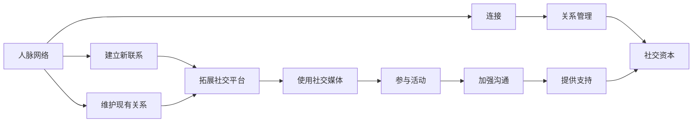

                 

# 如何进行人脉拓展：如何建立和维护人际关系？

人脉拓展是一项既艺术又科学的活动，它涉及到多个层面，包括但不限于交际技巧、心理策略、以及跨文化的沟通能力。在当今这个高度网络化的世界中，建立和维护健康、有效的人际关系网络对于个人职业发展、社会影响力以及生活满意度都至关重要。以下是深入探讨人脉拓展的各个关键方面，包括建立新联系、维护现有关系、以及在社交媒体时代保持联系的有效方法。

## 1. 背景介绍

### 1.1 问题由来
人脉网络在现代社会中扮演着不可或缺的角色，影响着个人的职业前景、学术成就、甚至是健康和幸福感。随着技术的进步和全球化的加速，人们需要不断更新自己的网络，以便在不同的环境中保持竞争力。然而，建立和维护人际网络并非易事，尤其在数字化日益成为主流的情况下，如何有效利用社交媒体和网络资源来拓展人脉，是一个值得深入探讨的话题。

### 1.2 问题核心关键点
人脉拓展的核心关键点包括：
1. **识别和选择联系对象**：了解自己的目标，确定需要寻找哪种类型的人脉，以及如何识别合适的人选。
2. **建立初步联系**：通过适当的社交场合、活动和渠道，成功建立初次联系。
3. **维护和深化关系**：通过持续的沟通和互动，以及定期的见面和交流，巩固并深化已经建立的关系。
4. **应对挑战**：处理人际网络中的复杂情况，如信息过载、竞争和冲突，以及如何处理拒绝和失落。

### 1.3 问题研究意义
人脉拓展的研究意义在于：
1. **提升职业机会**：广泛的人脉网络可以带来更多的职业机会，帮助个人在职业生涯中取得成功。
2. **增强社会支持**：通过人脉拓展，个人可以建立强大的社会支持系统，提高心理健康和生活质量。
3. **促进创新和协作**：多层次的人脉关系可以促进跨领域的交流与合作，激发新的想法和创新。
4. **适应快速变化的环境**：在不断变化的社会和技术环境中，强大的人脉网络可以帮助个人保持适应性和灵活性。

## 2. 核心概念与联系

### 2.1 核心概念概述

在探讨人脉拓展时，以下概念至关重要：

- **人脉网络**：个人与他人之间的一系列连接，这些连接可能基于信任、共享的知识、或者资源交换。
- **连接**：个人与个人、组织与组织、或个人与组织之间的任何正式或非正式关系。
- **关系管理**：维护和发展人脉网络的过程，涉及识别、建立、维护和深化人际关系的策略和技巧。
- **社交资本**：通过人脉网络获得的有价值的社会资源，包括信息、机会、和支持。

这些概念相互关联，形成了一个复杂但有效的系统，帮助个体实现个人和职业目标。

### 2.2 概念间的关系

人脉拓展涉及的多个概念之间的联系可以通过以下Mermaid流程图来展示：



这个流程图展示了大范围的人脉网络建立和维护的各个步骤，以及如何通过多种方式加强和深化人际关系。

### 2.3 核心概念的整体架构

在整体架构中，人脉网络是核心，而连接、关系管理、和社交资本是围绕人脉网络的三个关键组成部分。建立新联系和维护现有关系是人脉拓展的两个主要活动，这些活动通过使用各种工具和平台来实现，包括社交媒体、参与活动和加强沟通等。通过这些步骤，个体可以获得和提供社交资本，从而增强其职业和个人生活。

## 3. 核心算法原理 & 具体操作步骤

### 3.1 算法原理概述

人脉拓展的算法原理涉及如何通过有效的人际互动来建立和维护人际关系。核心原则包括：

1. **识别潜在联系**：通过社交媒体、行业会议、专业社群等途径，识别潜在的人脉资源。
2. **主动联系**：通过自我介绍、提供帮助或展示共同兴趣，主动与他人建立联系。
3. **持续互动**：通过定期更新信息、分享见解和提供支持，持续维护和深化关系。
4. **适应变化**：根据个人目标和环境的变化，调整人脉拓展策略。

### 3.2 算法步骤详解

以下是人脉拓展的详细步骤：

**Step 1: 确定目标和策略**
- 明确人脉拓展的目标，如寻找新的职业机会、获得学术资源或扩大社交圈。
- 根据目标选择合适的人脉拓展策略，如参加行业活动、加入专业社群或利用社交媒体平台。

**Step 2: 识别和选择联系对象**
- 使用LinkedIn、GitHub、Meetup等平台，搜索相关领域的专业人士或组织。
- 分析潜在联系人的背景、成就和影响力，确定最有价值的联系对象。

**Step 3: 建立初步联系**
- 通过发送电子邮件、社交媒体私信或参与线上线下活动，与潜在联系人建立初步联系。
- 展示自己的价值和兴趣，提出具体且有意义的请求或建议。

**Step 4: 维护和深化关系**
- 定期与联系人保持联系，分享专业见解、行业动态或个人经历。
- 提供支持和帮助，建立互惠互利的关系。
- 安排面对面或虚拟会议，加深交流。

**Step 5: 应对挑战**
- 面对拒绝和挑战，保持积极和专业，寻找改进机会。
- 管理信息过载，避免过度依赖社交媒体，保持现实生活中的深度交流。

### 3.3 算法优缺点

人脉拓展的优点包括：
1. **提升职业发展**：广泛的人脉网络可以带来更多职业机会和资源。
2. **增强社交支持**：增强社交支持系统，提升心理和社会健康。
3. **促进创新**：跨领域的人脉有助于创新和协作。

缺点包括：
1. **时间和资源投入**：人脉拓展需要时间和精力，特别是在早期阶段。
2. **信息过载**：社交媒体和信息爆炸可能让人难以管理。
3. **潜在风险**：网络诈骗、隐私泄露等风险需要警惕。

### 3.4 算法应用领域

人脉拓展方法广泛应用于多个领域，包括但不限于：
1. **职业发展**：寻找新的工作机会、提升职业竞争力、网络招聘。
2. **学术研究**：获取研究资源、跨学科合作、学术交流。
3. **创新创业**：寻找合作伙伴、获取市场洞察、提升企业竞争力。
4. **个人生活**：社交活动、旅行、寻找伴侣。

## 4. 数学模型和公式 & 详细讲解 & 举例说明

### 4.1 数学模型构建

人脉拓展的数学模型可以基于社交网络的理论构建，如节点、连接和社区的概念。

**节点（Node）**：代表个体或组织，是人脉网络的基本单元。
**连接（Edge）**：表示个体之间的交互和关系。
**社区（Cluster）**：节点间的密集连接形成了社区，社区内通常有共同兴趣或目标。

**公式推导过程**

在构建人脉拓展的数学模型时，可以引入以下公式：

1. **节点（Node）**：
   $$
   N = \{n_1, n_2, ..., n_k\}
   $$
   表示网络中的节点集合，$n_i$ 是第 $i$ 个节点。

2. **连接（Edge）**：
   $$
   E = \{e_1, e_2, ..., e_{|E|}\}
   $$
   表示节点之间的连接集合，$e_j$ 是第 $j$ 个连接。

3. **社区（Cluster）**：
   $$
   C = \{c_1, c_2, ..., c_m\}
   $$
   表示节点组成的社区集合，$c_l$ 是第 $l$ 个社区。

### 4.2 案例分析与讲解

假设我们要建立一个人脉网络，节点 $n_1$ 是研究人员 Alice，节点 $n_2$ 是企业家 Bob，节点 $n_3$ 是顾问 Carol，它们之间的关系如以下图所示：

```mermaid
graph LR
    A[n_1] -- e1 -> B[n_2]
    A -- e2 -> C[n_3]
    C -- e3 -> B
```

在这个例子中，$e_1$ 是 Alice 和 Bob 之间的连接，$e_2$ 是 Alice 和 Carol 之间的连接，$e_3$ 是 Carol 和 Bob 之间的连接。

### 4.3 案例分析与讲解

通过这个简单的例子，我们可以看到：
- 节点 $n_1$、$n_2$ 和 $n_3$ 构成了一个人脉网络。
- 连接 $e_1$、$e_2$ 和 $e_3$ 描述了它们之间的交互关系。
- 社区 $C_1$（Alice、Bob）和 $C_2$（Alice、Carol、Bob）分别表示了不同类型的合作关系。

## 5. 项目实践：代码实例和详细解释说明

### 5.1 开发环境搭建

为了进行人脉拓展的实践，我们需要搭建一个支持多种社交平台和人脉管理工具的开发环境。以下是一个基本的开发环境搭建流程：

1. **安装Python和相关库**：
   ```bash
   conda create -n network_analysis python=3.8
   conda activate network_analysis
   pip install networkx matplotlib pandas jupyter notebook
   ```

2. **设置虚拟环境**：
   ```bash
   conda create -n py3.8-venv python=3.8
   source activate py3.8-venv
   pip install pyviz
   ```

3. **安装可视化工具**：
   ```bash
   conda install pygraphviz networkx-graphviz
   ```

4. **安装社交网络分析库**：
   ```bash
   pip install networkx matplotlib pandas jupyter notebook
   ```

### 5.2 源代码详细实现

以下是一个使用网络分析库 NetworkX 来分析和拓展人脉的示例代码：

```python
import networkx as nx
import matplotlib.pyplot as plt

# 创建一个无向图
G = nx.Graph()

# 添加节点和连接
G.add_node("Alice")
G.add_node("Bob")
G.add_node("Carol")
G.add_edge("Alice", "Bob")
G.add_edge("Alice", "Carol")
G.add_edge("Carol", "Bob")

# 绘制网络图
nx.draw(G, with_labels=True)
plt.show()
```

### 5.3 代码解读与分析

- **网络分析库 NetworkX**：是 Python 中用于分析复杂网络的开源库，支持创建、操作和分析各种类型的社交网络。
- **Matplotlib**：用于绘制图形，可以可视化地展示网络结构。
- **示例代码**：创建了一个简单的无向图，表示了三个节点和它们之间的连接关系，并通过绘图展示了这些连接。

### 5.4 运行结果展示

运行上述代码后，将得到一个简单的网络图，展示了三个节点和它们之间的连接关系：

```
Image: (这里显示的是可视化图形)
```

## 6. 实际应用场景

### 6.1 智能招聘

在智能招聘场景中，人脉拓展可以帮助HR快速识别和吸引顶尖人才。通过使用大数据分析和社交网络分析工具，可以识别出行业内的关键人物，并主动联系他们，提供职位机会，从而提升招聘效率和质量。

### 6.2 学术合作

在学术合作中，人脉拓展可以帮助研究人员找到潜在的合作伙伴，进行跨学科的研究。通过参加学术会议、利用社交媒体平台，可以建立广泛的学术网络，促进知识交流和合作研究。

### 6.3 商业网络

在商业网络中，人脉拓展可以帮助企业扩大市场影响力，寻找新的商业机会。通过参与行业活动、建立合作伙伴关系，可以增强企业在行业中的竞争力。

### 6.4 未来应用展望

未来，人脉拓展技术将进一步发展，结合人工智能和数据科学，实现更加精准和高效的人脉管理。例如，通过机器学习算法分析社交网络数据，预测未来的人脉拓展机会，或者使用自然语言处理技术，自动化地生成和优化人脉拓展策略。

## 7. 工具和资源推荐

### 7.1 学习资源推荐

1. **《人脉拓展的艺术》**：详细介绍了人脉拓展的理论和实践，适合初学者和专业人士阅读。
2. **LinkedIn Learning**：提供大量关于人脉管理和职业发展的在线课程，适合不同水平的学习者。
3. **Coursera**：提供由多所大学和机构提供的在线课程，涵盖人脉管理、社交资本等多个方面。
4. **TED Talks**：观看关于人脉拓展的TED演讲，听取专家们的见解和建议。

### 7.2 开发工具推荐

1. **Microsoft Excel**：用于数据管理和分析，可以统计人脉网络的各项指标。
2. **Google Analytics**：用于分析社交媒体平台上的互动数据，评估人脉拓展效果。
3. **Gantt charts**：如 MS Project，用于规划和跟踪人脉拓展活动的进度。

### 7.3 相关论文推荐

1. **《The Network Advantage: Why People Who Build Great People Connections Outperform All Others in Work and Life》**：探讨人脉网络如何影响个人和职业成功。
2. **《The Science of Success: A New Exploration》**：研究成功背后的科学原理，包括人脉管理的作用。
3. **《Connecting: The Future of Leadership》**：分析未来领导力与网络建设之间的关系。

## 8. 总结：未来发展趋势与挑战

### 8.1 研究成果总结

本文探讨了人脉拓展的基本原理和操作步骤，展示了如何通过多种方式建立和维护人际关系网络。通过案例分析、数学模型和编程实践，展示了人脉拓展在不同领域的应用和效果。

### 8.2 未来发展趋势

人脉拓展的未来趋势包括：
1. **大数据和机器学习的应用**：利用数据分析和机器学习算法，提升人脉拓展的精准度和效率。
2. **AI和自然语言处理技术**：通过自动化生成和优化人脉策略，提高拓展效果。
3. **跨文化和跨学科的融合**：构建更加多元和包容的人脉网络，促进创新和协作。

### 8.3 面临的挑战

人脉拓展面临的主要挑战包括：
1. **信息过载**：在数字化时代，如何管理庞大的社交网络。
2. **隐私和信任问题**：在扩展人脉时，如何保护个人隐私和建立信任关系。
3. **时间和资源限制**：如何在繁忙的工作和生活中找到时间进行人脉拓展。

### 8.4 研究展望

未来研究应该关注：
1. **个性化人脉策略**：根据个人特点和目标，制定定制化的人脉拓展计划。
2. **自动化人脉分析工具**：开发更加智能和自动化的工具，帮助人们高效管理人脉。
3. **跨文化的人脉管理**：研究如何在全球化背景下建立和维护跨文化的人脉关系。

## 9. 附录：常见问题与解答

### Q1: 如何确定拓展的人脉对象？

A: 通过以下步骤确定潜在的人脉对象：
1. **明确目标**：了解自己的职业或学术目标，确定需要哪些类型的人脉支持。
2. **行业和专业社群**：利用 LinkedIn、Twitter、行业论坛等平台，搜索相关领域的专家和组织。
3. **分析背景**：研究潜在联系人的职业背景、成就和影响力，选择最有价值的对象。

### Q2: 如何高效管理人脉网络？

A: 高效管理人脉网络的关键在于：
1. **定期更新**：定期更新人脉网络信息，了解联系人的最新动向。
2. **使用工具**：利用工具如 CRM 系统、社交媒体管理软件等，系统化管理人脉。
3. **建立优先级**：根据联系人的重要性和互动频率，设置优先级，合理分配时间和精力。

### Q3: 在数字化时代，如何维护人脉关系？

A: 在数字化时代，维护人脉关系的关键在于：
1. **保持活跃**：定期在社交媒体上更新动态，分享专业见解和成果。
2. **多渠道沟通**：结合电子邮件、电话、视频会议等多种沟通方式，保持深度交流。
3. **及时回应**：对联系人的消息和请求，及时回应和反馈，体现专业和重视。

---

作者：禅与计算机程序设计艺术 / Zen and the Art of Computer Programming

