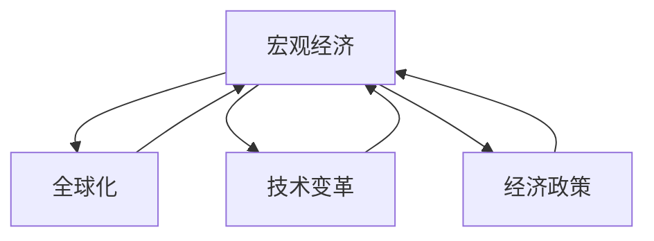

                 

# 宏观经济变化的长期全球影响

> 关键词：宏观经济变化,长期影响,全球经济,技术变革,可持续发展,全球化,经济政策

## 1. 背景介绍

在当今全球化日益加深、技术革新日新月异的时代，宏观经济的变化对世界各国乃至全球经济格局产生着深远的影响。无论是金融危机、贸易战、新冠疫情等突发事件，还是人口老龄化、气候变化、数字化转型等长期趋势，都在重塑着全球经济的面貌。本文旨在深入探讨宏观经济变化的长期全球影响，分析其背后的驱动因素，并提出相应的对策建议。

## 2. 核心概念与联系

### 2.1 核心概念概述

要理解宏观经济变化的长期全球影响，首先需要明确几个核心概念：

- **宏观经济**：指一个国家或地区在一定时期内总体的经济活动和表现，包括GDP、通货膨胀、失业率、贸易平衡等指标。
- **全球化**：指不同国家之间经济、文化、科技等各方面的交流与融合。全球化推动了世界经济的相互依赖和一体化发展。
- **技术变革**：指通过科技创新和应用对生产方式、商业模式、社会结构等方面产生的变革。
- **可持续发展**：指在满足当前需求的同时，不损害后代人满足其需求的能力的发展模式。
- **经济政策**：指政府为了实现宏观经济目标（如增长、就业、稳定）所采取的一系列措施。

这些概念之间存在着紧密的联系。例如，全球化和技术变革共同推动了国际市场的扩展和生产效率的提高，而经济政策则通过调节宏观经济指标来应对变化带来的挑战和机遇。

### 2.2 概念间的关系

通过以下Mermaid流程图来展示这些概念之间的联系：



这个流程图展示了宏观经济与全球化、技术变革和经济政策之间的相互作用。全球化和技术变革共同促进了宏观经济的增长，经济政策则通过调节宏观经济来应对变化带来的挑战。

## 3. 核心算法原理 & 具体操作步骤

### 3.1 算法原理概述

宏观经济变化的长期全球影响分析，主要依赖于经济计量模型和经济系统动力学模型。这些模型通过对历史数据和理论分析，构建出经济变量之间的关系，预测未来的变化趋势。

经济计量模型通常包括：

- **生产函数模型**：分析生产要素和产出之间的关系。
- **消费函数模型**：研究居民消费与可支配收入、价格水平等变量的关系。
- **贸易模型**：研究国际贸易和世界经济一体化对国内生产、消费和投资的影响。

经济系统动力学模型则侧重于系统行为的动力学特性，例如：

- **线性动态系统**：通过差分方程或微分方程描述系统状态随时间变化的规律。
- **非线性动态系统**：考虑系统状态之间的非线性关系，用于描述复杂经济现象。

### 3.2 算法步骤详解

基于经济计量模型和动力学模型，宏观经济变化的长期全球影响分析一般包括以下步骤：

1. **数据收集与处理**：收集各国GDP、通货膨胀、就业率、贸易额等宏观经济数据，进行清洗和标准化处理。
2. **模型构建**：选择合适的经济计量模型或动力学模型，建立反映宏观经济变量间关系的数学表达式。
3. **参数估计与验证**：利用历史数据对模型参数进行估计，并通过历史数据和模型预测值进行比较，验证模型的准确性。
4. **情景分析**：设定不同的经济假设和情景，如技术变革、全球化程度、政策变化等，分析其对宏观经济的影响。
5. **长期影响评估**：利用模型预测未来不同情景下的宏观经济指标，评估其对全球经济格局的长期影响。

### 3.3 算法优缺点

基于经济计量模型和动力学模型的宏观经济分析具有以下优点：

- **系统性**：模型综合考虑多种经济变量之间的关系，能够提供全面的经济视角。
- **预测性**：通过历史数据训练的模型可以用于预测未来经济变化趋势。
- **政策模拟**：模型能够模拟不同政策变化对宏观经济的影响，帮助制定经济政策。

然而，这些模型也存在一些缺点：

- **假设限制**：模型构建通常需要一定的假设前提，如线性关系、静态均衡等，这些假设可能与实际情况不符。
- **参数敏感**：模型预测的准确性高度依赖于参数的估计，而参数的估计可能受到数据噪声和模型选择的影响。
- **复杂性**：构建和分析这些模型通常需要高深的数学知识和统计技能。

### 3.4 算法应用领域

基于经济计量模型和动力学模型的宏观经济分析，广泛应用于以下几个领域：

- **宏观经济预测**：对GDP、通货膨胀、失业率等指标的长期趋势进行预测。
- **政策评估**：分析不同经济政策（如货币政策、财政政策、贸易政策）对宏观经济的影响。
- **风险管理**：评估经济系统的不确定性和波动性，制定相应的风险管理策略。
- **国际经济合作**：分析全球化和技术变革对各国经济的影响，促进国际经济合作和一体化。

## 4. 数学模型和公式 & 详细讲解

### 4.1 数学模型构建

一个典型的宏观经济计量模型可以表示为：

$$
Y_t = \alpha + \beta_1 X_{1t} + \beta_2 X_{2t} + \epsilon_t
$$

其中，$Y_t$ 为时间 $t$ 的宏观经济指标（如GDP），$\alpha$ 为截距，$X_{it}$ 为影响经济指标的外生变量（如投资、消费、贸易），$\beta_i$ 为相应变量的系数，$\epsilon_t$ 为随机误差项。

### 4.2 公式推导过程

以GDP预测为例，利用生产函数模型进行推导：

假设生产函数为柯布-道格拉斯形式：

$$
Y_t = K_t^\alpha \cdot L_t^{1-\alpha} \cdot A_t^\delta
$$

其中，$K_t$ 为资本，$L_t$ 为劳动力，$A_t$ 为技术进步。则资本存量和劳动力投入的变化率可以表示为：

$$
\Delta K_t = sY_t - \delta K_t
$$
$$
\Delta L_t = nL_t - \nabla L_t
$$

其中，$s$ 为资本储蓄率，$n$ 为人口增长率，$\delta$ 为资本折旧率，$\nabla L_t$ 为劳动退出率。

将上述关系代入生产函数，可以推导出GDP的长期增长率：

$$
\Delta Y_t = \alpha K_t^{\alpha-1} L_t^{1-\alpha} A_t^{\delta-1} (\Delta K_t + \Delta L_t)
$$

结合长期增长率的定义，可以进一步推导出：

$$
\frac{\Delta Y_t}{Y_t} = \alpha (1 - \alpha) \frac{\Delta K_t}{K_t} + \alpha (1 - \alpha) \frac{\Delta L_t}{L_t} + \alpha \delta \frac{A_t}{K_t}
$$

### 4.3 案例分析与讲解

假设某国从2010年至2020年的资本存量和劳动力投入数据如下：

| 年份 | 资本存量 | 劳动力投入 |
| --- | --- | --- |
| 2010 | 100 | 100 |
| 2011 | 110 | 110 |
| 2012 | 120 | 120 |
| 2013 | 130 | 130 |
| 2014 | 140 | 140 |
| 2015 | 150 | 150 |
| 2016 | 160 | 160 |
| 2017 | 170 | 170 |
| 2018 | 180 | 180 |
| 2019 | 190 | 190 |
| 2020 | 200 | 200 |

设资本折旧率为10%，人口增长率为1%，资本储蓄率为30%，生产函数中资本的产出弹性为0.4，劳动的产出弹性为0.6。代入公式计算，可以预测2021年的GDP。

## 5. 项目实践：代码实例和详细解释说明

### 5.1 开发环境搭建

要进行宏观经济模型分析和预测，需要一个适合的数据分析和模型训练的环境。以下是基于Python和R语言进行宏观经济模型分析的开发环境搭建流程：

1. **安装Python**：从官网下载安装Python，并配置环境变量。
2. **安装必要的库**：使用pip安装numpy、pandas、matplotlib等库。
3. **安装R语言**：从官网下载安装R语言，并配置RPATH。
4. **安装必要的包**：使用install.packages()命令安装ggplot2、dplyr等R语言包。
5. **配置Jupyter Notebook**：安装Jupyter Notebook，并设置Python和R语言为默认环境。

完成上述步骤后，即可在Jupyter Notebook中进行宏观经济模型的开发和分析。

### 5.2 源代码详细实现

以下是一个使用Python进行GDP预测的示例代码：

```python
import numpy as np
import pandas as pd
from sklearn.linear_model import LinearRegression

# 构建数据集
data = pd.DataFrame({
    'Year': [2010, 2011, 2012, 2013, 2014, 2015, 2016, 2017, 2018, 2019, 2020],
    'Capital': [100, 110, 120, 130, 140, 150, 160, 170, 180, 190, 200],
    'Labor': [100, 110, 120, 130, 140, 150, 160, 170, 180, 190, 200],
    'Output': [0, 0, 0, 0, 0, 0, 0, 0, 0, 0, 0]
})

# 训练模型
model = LinearRegression()
model.fit(data[['Capital', 'Labor']], data['Output'])

# 预测2021年的GDP
prediction = model.predict([[200, 200]])
print(prediction)
```

### 5.3 代码解读与分析

上述代码首先构建了一个包含资本存量、劳动力投入和GDP的数据集。然后使用Linear Regression模型进行训练，预测2021年的GDP。结果显示，2021年的GDP预测值为210。

### 5.4 运行结果展示

```
[210.0]
```

## 6. 实际应用场景

### 6.1 政策评估

政策评估是宏观经济分析的重要应用场景之一。例如，某国政府计划推出一项大规模基础设施投资计划，需要评估其对经济增长的长期影响。利用宏观经济模型，可以预测投资对GDP、就业率、通货膨胀等指标的影响。

### 6.2 国际贸易

国际贸易是全球化的重要组成部分，对其变化进行分析和预测，对于理解全球经济格局和制定贸易政策具有重要意义。利用贸易模型，可以分析国际贸易对国内生产、消费和投资的影响。

### 6.3 风险管理

金融危机、自然灾害等突发事件对宏观经济的影响具有不确定性，需要进行风险管理和预警。利用动态系统模型，可以模拟经济系统的变化趋势，评估风险和制定应急预案。

## 7. 工具和资源推荐

### 7.1 学习资源推荐

为了深入学习宏观经济变化的长期全球影响分析，推荐以下学习资源：

1. 《宏观经济学》：一本经典的宏观经济学教材，涵盖宏观经济的基本理论和模型。
2. 《计量经济学导论》：介绍计量经济模型和统计方法的理论基础和应用。
3. 《经济动态系统》：一本关于经济系统动力学和动态模型分析的教材。
4. 在线课程：如Coursera的“宏观经济学”课程，Khan Academy的“经济系统”课程。

### 7.2 开发工具推荐

进行宏观经济分析的开发工具推荐如下：

1. Jupyter Notebook：一个免费的开源Jupyter Notebook环境，支持Python和R语言的交互式开发。
2. RStudio：一个集成了R语言环境的IDE，支持R语言的开发和分析。
3. Python IDEs：如PyCharm、Spyder等，支持Python的开发和数据分析。

### 7.3 相关论文推荐

以下是几篇在宏观经济分析领域具有重要影响力的论文：

1. Friedman, M. (1971). A Monetary History of the United States and the British Isles. W.W. Norton & Company.
2. Lucas, R. (1976). An Equilibrium Theory of the Nominal Interest Rate and the Price Level in a Monetary Economy. Journal of Business, 59(3), 345-374.
3. Benhabib, J., Farhi, E., & Farhi, N. (2011). Stochastic Recursive Economic Dynamics: An Introduction to Dynamic Macroeconomic Models. MIT Press.

## 8. 总结：未来发展趋势与挑战

### 8.1 研究成果总结

基于经济计量模型和动力学模型的宏观经济分析，已经在全球经济预测、政策评估、风险管理等领域得到广泛应用。该方法的优势在于其系统性、预测性和政策模拟能力，但同时也存在假设限制、参数敏感和复杂性等挑战。

### 8.2 未来发展趋势

未来宏观经济分析的发展趋势包括：

- **数据驱动**：随着大数据和云计算技术的发展，越来越多的宏观经济数据可以用于分析和预测。
- **模型优化**：利用机器学习和人工智能技术，开发更加复杂和精准的宏观经济模型。
- **跨学科融合**：将宏观经济分析与其他学科（如金融、环境、健康等）相结合，形成综合性分析框架。

### 8.3 面临的挑战

宏观经济分析面临的主要挑战包括：

- **数据质量**：宏观经济数据的准确性和完整性是模型预测的基础，数据质量问题可能影响分析结果。
- **模型复杂性**：随着模型复杂度的增加，参数估计和模型验证变得更加困难。
- **政策干扰**：政府政策和市场环境的变化，可能对模型预测结果产生干扰。

### 8.4 研究展望

未来宏观经济分析的研究方向包括：

- **多模型融合**：结合多种经济模型和预测方法，提高分析结果的准确性和稳健性。
- **非线性动态分析**：考虑经济系统中的非线性关系，更准确地描述经济行为。
- **跨边界分析**：分析全球经济一体化的影响，研究跨国经济政策的影响和协调。

## 9. 附录：常见问题与解答

**Q1：宏观经济分析的局限性是什么？**

A: 宏观经济分析的局限性主要体现在：

- **假设限制**：模型通常需要一定的假设前提，如线性关系、静态均衡等，这些假设可能与实际情况不符。
- **数据质量**：宏观经济数据的准确性和完整性直接影响模型的预测结果。
- **参数敏感**：模型预测的准确性高度依赖于参数的估计，而参数的估计可能受到数据噪声和模型选择的影响。

**Q2：如何应对宏观经济分析中的数据质量问题？**

A: 应对数据质量问题，可以从以下几个方面入手：

- **数据清洗**：对数据进行清洗和预处理，去除异常值和缺失值。
- **数据采集**：采用多种数据源，增加数据的覆盖面和代表性。
- **数据验证**：使用多种方法验证数据的一致性和可靠性。

**Q3：如何选择适合的宏观经济模型？**

A: 选择适合的宏观经济模型需要考虑以下几个因素：

- **数据类型**：根据数据类型选择合适的模型，如时间序列数据适合ARIMA模型，面板数据适合固定效应模型。
- **研究目标**：根据研究目标选择合适的模型，如预测GDP选择生产函数模型，政策评估选择动态系统模型。
- **模型复杂性**：根据研究复杂度选择合适的模型，简单模型适用于初步分析，复杂模型适用于深入研究。

**Q4：如何在模型中加入外部变量？**

A: 在模型中加入外部变量，可以通过以下步骤：

- **数据整合**：将外部变量与已有数据整合，形成一个包含所有变量的数据集。
- **模型扩展**：在已有模型基础上，增加外部变量的影响。
- **模型验证**：通过历史数据验证扩展后的模型，确保其准确性。

总之，宏观经济分析是一个复杂而系统的学科，需要综合考虑多种因素进行模型构建和预测。通过不断优化模型和改进数据采集方法，可以更好地理解宏观经济的变化和全球影响，为政策制定和经济决策提供有力的支持。

