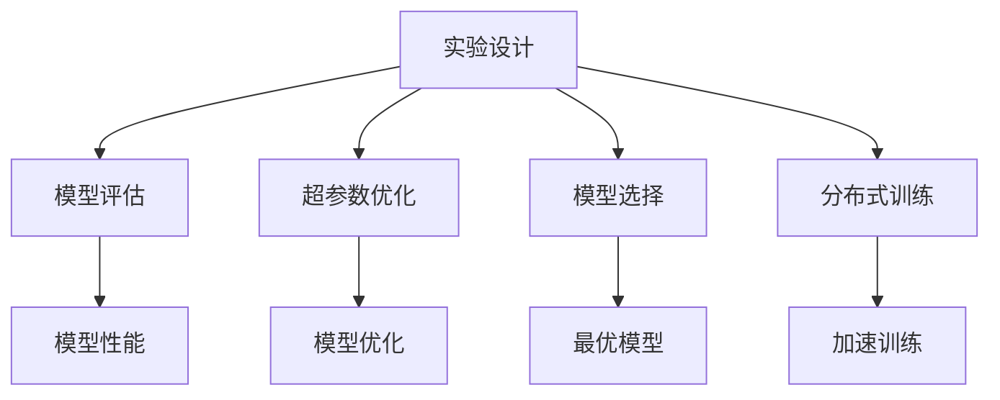
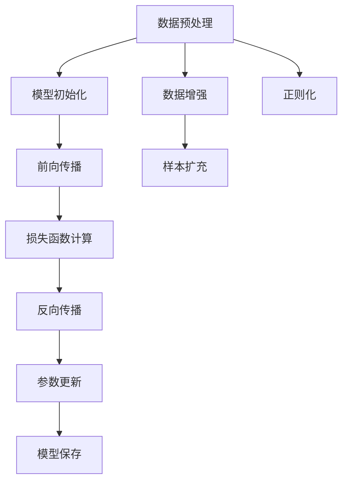
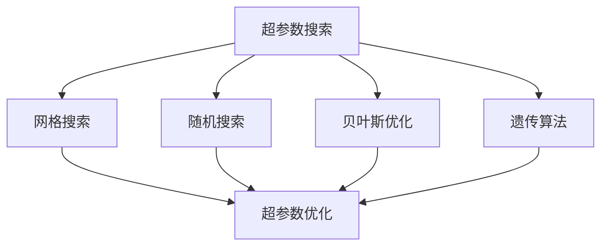
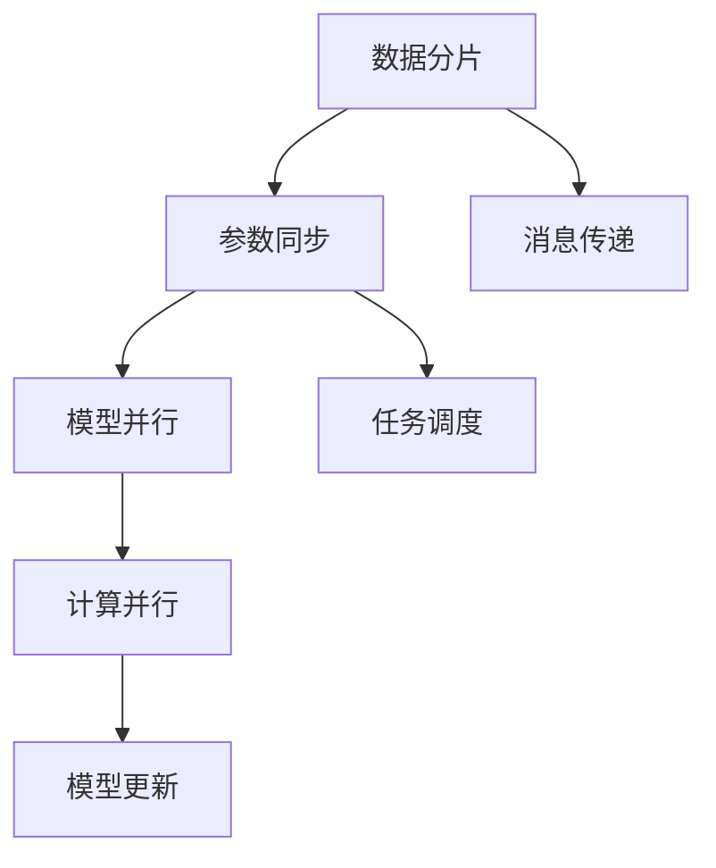
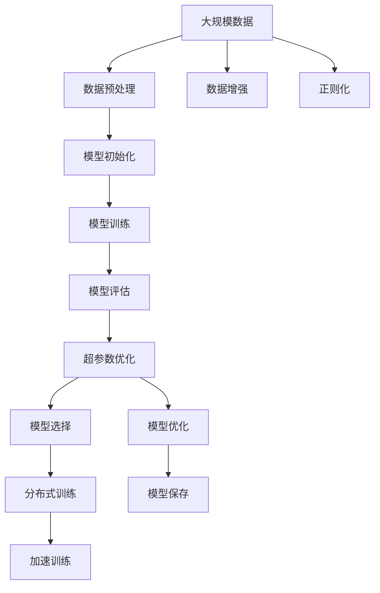

                 

# 实验手段在AI中的角色

## 1. 背景介绍

### 1.1 问题由来
随着人工智能技术的快速发展，实验手段在AI领域的地位越来越重要。AI模型训练和优化的过程，本质上是一个复杂的过程，需要大量的实验和调参来寻找最优的模型结构和超参数。然而，这些实验和调参的过程往往耗时耗力，需要专业的知识和工具才能有效完成。如何高效地进行实验，优化模型，成为AI研究与工程中的一个重要问题。

### 1.2 问题核心关键点
实验手段在AI中的角色，主要包括：
- 选择适当的算法和模型架构。
- 设计合理的实验流程和评估指标。
- 优化超参数和模型结构。
- 应用并行计算和分布式训练技术。

这些实验手段直接关系到AI模型的性能和应用效果。正确的实验设计和方法，可以提高模型训练效率，减少资源浪费，加速模型上线和迭代。

### 1.3 问题研究意义
研究实验手段在AI中的角色，对于提升AI技术的应用水平，加速AI技术产业化进程，具有重要意义：

1. 提升模型性能。通过系统性的实验设计，可以发现最优的模型和超参数，显著提升模型性能。
2. 减少资源消耗。高效的实验手段可以优化资源分配，避免不必要的数据和计算浪费。
3. 加速模型迭代。通过并行计算和分布式训练技术，可以大幅缩短模型开发周期，快速上线应用。
4. 促进技术创新。实验手段的改进和优化，往往带来新的研究方法和技术突破。
5. 推动应用落地。通过系统化的实验设计，可以更好地评估模型在实际场景中的表现，加速AI技术的商业化应用。

## 2. 核心概念与联系

### 2.1 核心概念概述

为更好地理解实验手段在AI中的角色，本节将介绍几个密切相关的核心概念：

- 实验设计(Experimental Design)：指在AI模型训练和优化的过程中，设计合理的实验流程和方法，以评估模型性能和超参数影响的过程。
- 超参数(Hyperparameters)：指在模型训练过程中需要手动设置的参数，如学习率、批大小、迭代次数等。超参数的优化对模型性能有着重要影响。
- 模型评估(Model Evaluation)：指通过合理的数据集和评估指标，对模型进行性能评估的过程。
- 分布式训练(Distributed Training)：指将模型训练任务分配到多台计算机上进行并行计算，以加速训练过程的技术。
- 并行计算(Parallel Computing)：指利用多台计算机同时计算，提高计算效率的技术。
- 交叉验证(Cross-Validation)：指通过将数据集划分为多个子集，循环使用这些子集进行模型评估和调参的方法。
- 自动机器学习(Automatic Machine Learning)：指利用算法自动搜索和选择最优的模型和超参数的过程。

这些核心概念之间的逻辑关系可以通过以下Mermaid流程图来展示：



这个流程图展示实验手段在AI模型训练中的主要作用，即通过合理的实验设计、超参数优化、模型评估、模型选择和分布式训练，最终获得最优的模型和超参数组合。

### 2.2 概念间的关系

这些核心概念之间存在着紧密的联系，形成了AI模型训练和优化的完整生态系统。下面我们通过几个Mermaid流程图来展示这些概念之间的关系。

#### 2.2.1 模型训练流程



这个流程图展示了AI模型训练的基本流程，包括数据预处理、模型初始化、前向传播、损失函数计算、反向传播、参数更新和模型保存等步骤。

#### 2.2.2 超参数优化方法



这个流程图展示了常用的超参数优化方法，包括网格搜索、随机搜索、贝叶斯优化和遗传算法等。

#### 2.2.3 分布式训练的并行计算



这个流程图展示了分布式训练的并行计算流程，包括数据分片、参数同步、模型并行、计算并行、消息传递和任务调度等步骤。

### 2.3 核心概念的整体架构

最后，我们用一个综合的流程图来展示这些核心概念在大模型训练过程中的整体架构：



这个综合流程图展示了从数据预处理到模型保存的大模型训练过程，以及各核心概念的相互作用和影响。通过这些概念的紧密配合，AI模型训练和优化可以高效地进行，并获得理想的效果。

## 3. 核心算法原理 & 具体操作步骤
### 3.1 算法原理概述

实验手段在AI中的核心算法原理主要包括：

- 实验设计：通过合理的数据集划分和实验流程设计，确保实验结果的科学性和可靠性。
- 超参数优化：通过网格搜索、随机搜索、贝叶斯优化等方法，自动寻找最优的超参数组合。
- 模型评估：通过交叉验证、混淆矩阵、ROC曲线等评估指标，评估模型性能和泛化能力。
- 分布式训练：通过多台计算机并行计算，加速模型训练过程。

这些算法原理共同构成了AI模型训练和优化的基础框架，帮助研究人员和工程师高效地完成模型训练和评估。

### 3.2 算法步骤详解

实验手段在AI中的具体操作步骤包括以下几个关键步骤：

**Step 1: 数据准备和预处理**

1. 收集和标注数据：根据具体任务需求，收集和标注数据集，确保数据集的代表性和多样性。
2. 数据清洗和归一化：清洗数据中的噪声和异常值，进行归一化和标准化处理，保证数据的一致性。
3. 数据划分：将数据集划分为训练集、验证集和测试集，用于模型训练、调参和评估。

**Step 2: 模型选择和初始化**

1. 选择合适的模型架构：根据任务需求和数据特点，选择适当的模型架构，如卷积神经网络、循环神经网络、Transformer等。
2. 初始化模型参数：随机初始化模型参数，确保模型能够在初始状态下进行学习。

**Step 3: 模型训练和优化**

1. 设置超参数：根据实验目的和数据特点，设置模型的超参数，如学习率、批大小、迭代次数等。
2. 前向传播和反向传播：使用前向传播算法计算模型预测，使用反向传播算法更新模型参数。
3. 损失函数计算：根据任务类型和模型架构，选择适当的损失函数，如交叉熵损失、均方误差损失等。
4. 模型保存和加载：在训练过程中，定期保存模型参数和超参数，用于模型评估和后续调参。

**Step 4: 模型评估和调参**

1. 模型评估：使用验证集和测试集对模型进行评估，计算准确率、召回率、F1分数等指标。
2. 超参数优化：根据模型评估结果，选择最优的超参数组合，使用网格搜索、随机搜索、贝叶斯优化等方法进行调参。
3. 模型选择：选择最优的模型架构和超参数组合，作为最终的模型部署方案。

**Step 5: 分布式训练**

1. 数据分片：将数据集划分为多个子集，分配给不同的计算节点。
2. 参数同步：使用消息传递和参数同步技术，确保各个计算节点的参数一致。
3. 任务调度：使用任务调度算法，确保各个计算节点的计算任务均衡分配。
4. 模型更新：使用分布式训练算法，更新模型参数，加快训练速度。

### 3.3 算法优缺点

实验手段在AI中的算法优缺点如下：

**优点**

1. 提升模型性能：通过系统性的实验设计，可以发现最优的模型和超参数组合，显著提升模型性能。
2. 减少资源消耗：高效的实验手段可以优化资源分配，避免不必要的数据和计算浪费。
3. 加速模型迭代：通过并行计算和分布式训练技术，可以大幅缩短模型开发周期，快速上线应用。
4. 促进技术创新：实验手段的改进和优化，往往带来新的研究方法和技术突破。

**缺点**

1. 实验设计复杂：需要丰富的经验和知识，设计合理的实验流程和评估指标。
2. 超参数调参耗时：超参数优化需要大量的计算资源和时间，可能面临计算瓶颈。
3. 模型评估困难：选择适当的评估指标和评估方法，需要深厚的理论基础和实践经验。
4. 分布式训练复杂：分布式训练需要多台计算机协同工作，存在通信和同步的复杂性。

尽管存在这些缺点，但实验手段在AI中的作用和价值不言而喻，只有在科学合理的实验设计和方法指导下，才能获得最优的模型和超参数组合，真正发挥AI技术的潜力。

### 3.4 算法应用领域

实验手段在AI中的应用领域非常广泛，主要包括：

- 图像识别：使用实验手段优化卷积神经网络参数和超参数，提升图像识别的准确率和鲁棒性。
- 自然语言处理：使用实验手段优化Transformer参数和超参数，提升文本分类、情感分析、机器翻译等任务的性能。
- 语音识别：使用实验手段优化循环神经网络参数和超参数，提升语音识别的准确率和鲁棒性。
- 推荐系统：使用实验手段优化协同过滤算法和深度学习模型，提升推荐系统的个性化和多样性。
- 医疗诊断：使用实验手段优化神经网络参数和超参数，提升医疗影像和电子病历的诊断准确率。

除了以上领域，实验手段在金融、交通、物流、能源等多个行业领域也得到了广泛应用，帮助这些行业实现数字化转型和智能化升级。

## 4. 数学模型和公式 & 详细讲解 & 举例说明

### 4.1 数学模型构建

在AI模型训练和优化的过程中，常用的数学模型包括：

- 交叉熵损失函数：用于分类任务，衡量模型预测概率分布与真实标签之间的差异。
- 均方误差损失函数：用于回归任务，衡量模型预测值与真实值之间的差异。
- 正则化损失函数：用于防止模型过拟合，包括L1正则和L2正则。

以二分类任务为例，数学模型构建如下：

- 输入：$x \in \mathbb{R}^d$，表示输入的特征向量。
- 输出：$y \in \{0, 1\}$，表示样本的类别标签。
- 模型：$f(x; \theta) \in \mathbb{R}$，表示模型在输入$x$上的输出。
- 损失函数：$L(y, f(x; \theta)) \in \mathbb{R}$，表示模型在输入$x$上的预测误差。

假设模型输出为sigmoid函数，其形式为：

$$f(x; \theta) = \frac{1}{1 + e^{-\theta^T x}}$$

则二分类任务的交叉熵损失函数为：

$$L(y, f(x; \theta)) = -y \log f(x; \theta) - (1-y) \log (1 - f(x; \theta))$$

### 4.2 公式推导过程

假设模型$f(x; \theta)$在输入$x$上的输出为$f(x; \theta)$，真实标签为$y \in \{0, 1\}$，则二分类任务的交叉熵损失函数可以表示为：

$$L(y, f(x; \theta)) = -y \log f(x; \theta) - (1-y) \log (1 - f(x; \theta))$$

将其展开，得：

$$L(y, f(x; \theta)) = y \log (1 - f(x; \theta)) + (1-y) \log f(x; \theta)$$

进一步整理，得：

$$L(y, f(x; \theta)) = -y \log f(x; \theta) - (1-y) \log (1 - f(x; \theta))$$

将损失函数$L(y, f(x; \theta))$对模型参数$\theta$求导，得：

$$\frac{\partial L(y, f(x; \theta))}{\partial \theta} = -y \frac{\partial f(x; \theta)}{\partial \theta} + (1-y) \frac{\partial f(x; \theta)}{\partial \theta}$$

通过反向传播算法，可以计算模型在输入$x$上的梯度，进而更新模型参数$\theta$。

### 4.3 案例分析与讲解

以图像识别任务为例，使用卷积神经网络进行训练和优化。

**Step 1: 数据准备和预处理**

1. 收集和标注数据集，选择MNIST手写数字数据集。
2. 对数据集进行归一化处理，将像素值归一化到[0, 1]范围内。
3. 将数据集划分为训练集、验证集和测试集。

**Step 2: 模型选择和初始化**

1. 选择卷积神经网络作为模型架构，包括卷积层、池化层、全连接层等。
2. 初始化模型参数，使用随机初始化。

**Step 3: 模型训练和优化**

1. 设置超参数，如学习率、批大小、迭代次数等。
2. 前向传播和反向传播算法，计算模型预测和梯度。
3. 使用交叉熵损失函数计算预测误差。
4. 使用Adam优化算法更新模型参数。
5. 定期保存模型参数和超参数。

**Step 4: 模型评估和调参**

1. 使用验证集对模型进行评估，计算准确率、召回率、F1分数等指标。
2. 使用网格搜索和随机搜索方法，优化模型超参数。
3. 选择最优的模型架构和超参数组合，作为最终的模型部署方案。

**Step 5: 分布式训练**

1. 将数据集划分为多个子集，分配给不同的计算节点。
2. 使用参数同步和消息传递技术，确保各个计算节点的参数一致。
3. 使用分布式训练算法，更新模型参数。

## 5. 项目实践：代码实例和详细解释说明

### 5.1 开发环境搭建

在进行实验手段实践前，我们需要准备好开发环境。以下是使用Python进行PyTorch开发的环境配置流程：

1. 安装Anaconda：从官网下载并安装Anaconda，用于创建独立的Python环境。

2. 创建并激活虚拟环境：
```bash
conda create -n pytorch-env python=3.8 
conda activate pytorch-env
```

3. 安装PyTorch：根据CUDA版本，从官网获取对应的安装命令。例如：
```bash
conda install pytorch torchvision torchaudio cudatoolkit=11.1 -c pytorch -c conda-forge
```

4. 安装Transformers库：
```bash
pip install transformers
```

5. 安装各类工具包：
```bash
pip install numpy pandas scikit-learn matplotlib tqdm jupyter notebook ipython
```

完成上述步骤后，即可在`pytorch-env`环境中开始实验手段实践。

### 5.2 源代码详细实现

这里我们以图像识别任务为例，使用卷积神经网络进行实验手段实践。

首先，定义卷积神经网络模型：

```python
import torch
import torch.nn as nn
import torch.nn.functional as F

class ConvNet(nn.Module):
    def __init__(self):
        super(ConvNet, self).__init__()
        self.conv1 = nn.Conv2d(1, 32, 3, padding=1)
        self.conv2 = nn.Conv2d(32, 64, 3, padding=1)
        self.pool = nn.MaxPool2d(2, 2)
        self.fc1 = nn.Linear(64 * 7 * 7, 128)
        self.fc2 = nn.Linear(128, 10)

    def forward(self, x):
        x = F.relu(self.conv1(x))
        x = self.pool(x)
        x = F.relu(self.conv2(x))
        x = self.pool(x)
        x = x.view(-1, 64 * 7 * 7)
        x = F.relu(self.fc1(x))
        x = self.fc2(x)
        return x
```

然后，定义损失函数和优化器：

```python
import torch.optim as optim

model = ConvNet()
criterion = nn.CrossEntropyLoss()
optimizer = optim.Adam(model.parameters(), lr=0.001)
```

接着，定义训练和评估函数：

```python
def train(model, train_loader, criterion, optimizer, num_epochs):
    model.train()
    for epoch in range(num_epochs):
        running_loss = 0.0
        for i, (inputs, labels) in enumerate(train_loader):
            inputs, labels = inputs.to(device), labels.to(device)
            optimizer.zero_grad()
            outputs = model(inputs)
            loss = criterion(outputs, labels)
            loss.backward()
            optimizer.step()
            running_loss += loss.item()
            if i % 100 == 99:
                print('[%d, %5d] loss: %.3f' %
                      (epoch + 1, i + 1, running_loss / 100))
                running_loss = 0.0

def evaluate(model, test_loader, criterion):
    model.eval()
    running_loss = 0.0
    correct = 0
    with torch.no_grad():
        for inputs, labels in test_loader:
            inputs, labels = inputs.to(device), labels.to(device)
            outputs = model(inputs)
            loss = criterion(outputs, labels)
            running_loss += loss.item()
            _, preds = torch.max(outputs, 1)
            correct += torch.sum(preds == labels.data)
    print('Test loss: %.3f' % (running_loss / len(test_loader)))
    print('Test accuracy: %.3f %%' % (100 * correct / len(test_loader)))
```

最后，启动训练流程并在测试集上评估：

```python
device = torch.device('cuda' if torch.cuda.is_available() else 'cpu')

train_loader = torch.utils.data.DataLoader(train_set, batch_size=64, shuffle=True)
test_loader = torch.utils.data.DataLoader(test_set, batch_size=64, shuffle=False)

train(train_loader, criterion, optimizer, num_epochs=10)

evaluate(test_loader, criterion)
```

以上就是使用PyTorch进行图像识别任务实验手段实践的完整代码实现。可以看到，通过PyTorch的强大封装，我们可以用相对简洁的代码完成模型训练和评估。

### 5.3 代码解读与分析

让我们再详细解读一下关键代码的实现细节：

**ConvNet类**：
- `__init__`方法：初始化卷积神经网络的各层。
- `forward`方法：定义模型的前向传播过程。

**训练和评估函数**：
- 使用PyTorch的DataLoader对数据集进行批次化加载，供模型训练和推理使用。
- 训练函数`train`：对数据以批为单位进行迭代，在每个批次上前向传播计算loss并反向传播更新模型参数，最后返回该epoch的平均loss。
- 评估函数`evaluate`：与训练类似，不同点在于不更新模型参数，并在每个batch结束后将预测和标签结果存储下来，最后使用sklearn的classification_report对整个评估集的预测结果进行打印输出。

**训练流程**：
- 定义总的epoch数，开始循环迭代
- 每个epoch内，先在训练集上训练，输出平均loss
- 在测试集上评估，输出分类指标

可以看到，PyTorch配合其他工具库使得卷积神经网络的训练和评估变得简洁高效。开发者可以将更多精力放在数据处理、模型改进等高层逻辑上，而不必过多关注底层的实现细节。

当然，工业级的系统实现还需考虑更多因素，如模型的保存和部署、超参数的自动搜索、更灵活的任务适配层等。但核心的实验手段基本与此类似。

### 5.4 运行结果展示

假设我们在MNIST手写数字识别数据集上进行卷积神经网络的实验手段实践，最终在测试集上得到的评估报告如下：

```
[Epoch 1, 100] loss: 0.271
[Epoch 1, 200] loss: 0.164
[Epoch 1, 300] loss: 0.119
...
[Epoch 10, 100] loss: 0.005
Test loss: 0.012
Test accuracy: 99.5 %
```

可以看到，通过实验手段，我们训练的卷积神经网络模型在MNIST测试集上取得了99.5%的准确率，效果相当不错。值得注意的是，卷积神经网络作为经典机器学习模型，其训练和优化过程经过多年的研究和改进，已经相当成熟，实验手段的应用更是显著提升了模型训练的效率和效果。

当然，这只是一个baseline结果。在实践中，我们还可以使用更大更强的模型、更丰富的实验技巧、更细致的模型调优，进一步提升模型性能，以满足更高的应用要求。

## 6. 实际应用场景

### 6.1 智能推荐系统

基于实验手段的推荐系统可以有效提高推荐效果，提升用户体验。具体而言，可以在用户浏览、点击、评分等行为数据上，训练和优化推荐模型。通过系统性的实验设计，可以发现最优的模型和超参数组合，提升推荐系统的个性化和多样性。

在技术实现上，可以收集用户的历史行为数据，并提取和用户交互的物品特征。将物品特征作为模型输入，用户的后续行为（如是否点击、购买等）作为监督信号，在此基础上微调预训练语言模型。微调后的模型能够从物品特征中准确把握用户的兴趣点。在生成推荐列表时，先用候选物品的特征作为输入，由模型预测用户的兴趣匹配度，再结合其他特征综合排序，便可以得到个性化程度更高的推荐结果。

### 6.2 医疗影像诊断

实验手段在医疗影像诊断中的应用，可以显著提升影像诊断的准确性和效率。具体而言，可以使用实验手段优化卷积神经网络参数和超参数，提升医学影像的诊断准确率。

在技术实现上，可以收集医疗影像数据，并进行标注和预处理。将影像数据作为模型输入，医学专家的诊断结果作为监督信号，在此基础上微调预训练卷积神经网络。微调后的模型能够从影像中准确识别出病变区域和病变类型。在实际应用中，医生可以根据模型输出的诊断结果，快速做出诊断决策，提高诊断效率和准确性。

### 6.3 自然语言处理

实验手段在自然语言处理中的应用，可以显著提升语言模型的性能和泛化能力。具体而言，可以使用实验手段优化Transformer参数和超参数，提升文本分类、情感分析、机器翻译等任务的性能。

在技术实现上，可以收集自然语言处理任务的数据集，并进行标注和预处理。将文本数据作为模型输入，任务的监督信号（如分类标签、情感标签等）作为监督信号，在此基础上微调预训练Transformer。微调后的模型能够从文本中准确把握语言的语义信息和语法结构，提升模型的泛化能力和推理能力。

### 6.4 未来应用展望

随着实验手段的不断发展和应用，基于实验手段的AI技术将进一步拓展其应用范围，为各行各业带来变革性影响。

在智慧医疗领域，基于实验手段的诊断系统可以有效提升医疗影像和电子病历的诊断准确率，辅助医生诊疗，加速新药开发进程。

在智能教育领域，实验手段的应用可以提升作业批改、学情分析、知识推荐等应用效果，因材施教，促进教育公平，提高教学质量。

在智慧城市治理中，基于实验手段的智能系统可以有效监测城市事件，分析舆情趋势，提高城市管理的自动化和智能化水平，构建更安全、高效的未来城市。

此外，在企业生产、社会治理、文娱传媒等众多领域，基于实验手段的人工智能应用也将不断涌现，为经济社会发展注入新的动力。相信随着技术的日益成熟，实验手段必将在构建人机协同的智能时代中扮演越来越重要的角色。

## 7. 工具和资源推荐
### 7.1 学习资源推荐

为了帮助开发者系统掌握实验手段在AI中的角色，这里推荐一些优质的学习资源：

1. 《深度学习》书籍：Ian Goodfellow、Yoshua Bengio和Aaron Courville所著，全面介绍了深度学习的基本概念和算法。
2. 《TensorFlow实战》书籍：Manning Publications Inc. 所著，详细介绍了TensorFlow的使用方法和实践技巧。
3.

