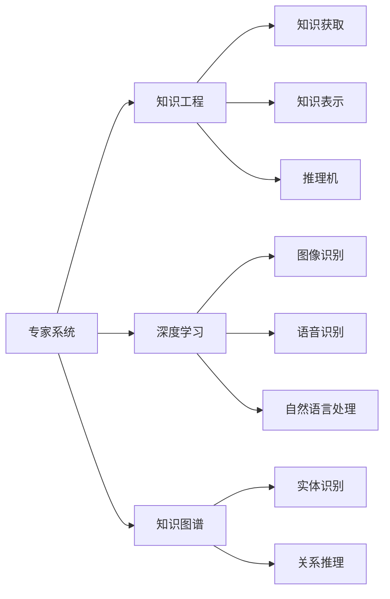

                 

# 工业革命的精髓：专家经验融入自动化

> 关键词：工业革命,专家经验,自动化,人工智能,专家系统,知识工程,深度学习,知识图谱,自动化流程,技术推广

## 1. 背景介绍

### 1.1 问题由来
工业革命是历史上的重大转折点，它将人类的生产方式从手工业转向了机械化大规模生产。通过引入自动化生产线、标准化流程、机械工具等技术手段，工业革命极大提高了生产效率，缩短了生产周期，降低了生产成本。这一过程不仅仅是技术的革新，更是一场深刻的社会变革。

在现代技术发展中，我们正面临着类似的转变——自动化。自动化技术不仅限于制造业，更在各行各业广泛应用，如金融、医疗、交通、零售等领域。自动化技术的发展，极大提升了企业效率，降低人力成本，优化资源配置，带来了巨大的经济效益和社会效益。

然而，随着自动化技术的发展，我们也面临着新的挑战。如何更好地将人类的经验、知识和智慧融入自动化系统中，使其具备人类的直觉、判断和决策能力？如何构建智能化的自动化系统，使其不仅能够执行机械操作，更能理解和处理复杂的人机交互任务？这些问题亟待解决。

### 1.2 问题核心关键点
本文章将重点探讨如何将专家经验融入自动化系统，从而提升系统的智能化水平。我们将详细分析以下关键点：

- 专家系统的原理和架构
- 知识工程的实现方法
- 深度学习在自动化中的应用
- 知识图谱在自动化中的作用
- 自动化流程的优化和推广

通过这些关键点，我们将从理论上阐述如何更好地将人类经验融入自动化系统，从实践中展示如何在实际应用中实现这一目标。

### 1.3 问题研究意义
将专家经验融入自动化系统，不仅可以提升系统的智能化水平，还能有效规避由于技术缺陷带来的风险。例如，在医疗领域，自动化的诊断系统可以根据专家的经验，结合最新的医学研究成果，提供更精准的诊断和治疗方案；在金融领域，自动化的交易系统可以通过专家的历史交易记录和市场洞察，实现更智能的交易决策。

此外，专家经验融入自动化还能带来更高的效率和更低的成本。自动化技术通过减少人为操作和决策的环节，能够大幅缩短生产周期，降低人工错误率。这种成本效益的提升，是工业革命带给我们的重要启示。

## 2. 核心概念与联系

### 2.1 核心概念概述

本节将介绍几个关键概念，并阐述它们之间的联系。

- **专家系统(Expert System)**：通过模拟专家的决策过程，利用知识库和推理机，实现对特定问题的智能决策。专家系统通常包括知识获取、知识表示、推理机、用户接口等部分。

- **知识工程(Knowledge Engineering)**：将人类知识转化为计算机可处理的形式，构建知识库，并通过规则引擎和推理机，实现智能决策。知识工程是专家系统的核心技术。

- **深度学习(Deep Learning)**：通过多层神经网络，实现对复杂数据的深度处理和分析。深度学习在图像识别、语音识别、自然语言处理等领域取得了重大突破，是当前自动化领域的重要技术。

- **知识图谱(Knowledge Graph)**：通过构建实体和关系的图形结构，实现对知识的全面表示和推理。知识图谱在自动问答、推荐系统等领域具有重要应用价值。

这些核心概念之间存在紧密的联系，形成了自动化系统中的核心技术框架。

### 2.2 概念间的关系

这些概念之间的联系可以通过以下Mermaid流程图来展示：



这个流程图展示了专家系统、知识工程、深度学习、知识图谱之间的联系：

1. 专家系统通过知识工程，将人类知识转化为计算机可处理的形式。
2. 知识工程包括知识获取、知识表示和推理机，通过这些组件构建专家系统。
3. 深度学习能够处理图像、语音和自然语言数据，是实现自动化任务的关键技术。
4. 知识图谱用于表示和推理知识，是构建智能自动化系统的核心工具。

这些概念共同构成了自动化系统的技术基础，使得系统能够具备智能化的决策和执行能力。

## 3. 核心算法原理 & 具体操作步骤
### 3.1 算法原理概述

将专家经验融入自动化系统，本质上是一种知识和智能的结合过程。在这一过程中，我们需要将专家的知识转化为计算机可处理的形式，构建知识库，并通过推理机和深度学习模型，实现对特定问题的智能决策。

### 3.2 算法步骤详解

将专家经验融入自动化系统的一般步骤包括：

1. **知识获取**：收集专家经验和知识，并将其转化为计算机可处理的形式。
2. **知识表示**：构建知识库，将专家经验表示为规则、事实或图谱。
3. **推理机**：设计推理引擎，实现基于知识库的智能决策。
4. **深度学习模型**：构建深度学习模型，用于处理非结构化数据，提升系统的智能化水平。
5. **知识图谱**：构建知识图谱，实现知识的全面表示和推理。

### 3.3 算法优缺点

将专家经验融入自动化系统具有以下优点：

- 提升系统的智能化水平：通过引入专家的经验和知识，系统能够具备更强的决策能力。
- 提高系统的鲁棒性：专家经验可以帮助系统更好地处理复杂和异常情况。
- 加速系统的部署和应用：专家系统能够快速适应新任务，缩短项目周期。

但这一过程也存在一些缺点：

- 对专家的依赖度高：专家系统的构建需要大量专家的知识和经验，成本较高。
- 知识表示复杂：将知识转化为计算机可处理的形式，需要设计复杂的表示方法。
- 系统复杂度高：专家系统通常结构复杂，调试和维护难度较大。

### 3.4 算法应用领域

将专家经验融入自动化系统，在许多领域都有广泛应用。以下是一些典型应用场景：

- **医疗领域**：自动化的诊断系统可以根据专家的历史诊断记录和经验，提供更精准的诊断和治疗方案。
- **金融领域**：自动化的交易系统可以通过专家的历史交易记录和市场洞察，实现更智能的交易决策。
- **制造领域**：自动化的生产系统可以根据专家的生产经验，优化生产流程，提升生产效率。
- **教育领域**：自动化的教学系统可以根据专家的教学经验和研究成果，提供个性化的教学方案。
- **交通领域**：自动化的交通管理系统可以根据专家的交通规划经验，优化交通流量，提高交通效率。

这些应用场景展示了专家经验融入自动化系统的巨大潜力，推动了各行各业的智能化转型。

## 4. 数学模型和公式 & 详细讲解 & 举例说明

### 4.1 数学模型构建

在本节中，我们将使用数学语言对将专家经验融入自动化系统的过程进行严格刻画。

假设我们有一个专家系统，其知识库为 $K=(E,R,F)$，其中 $E$ 为实体集合，$R$ 为关系集合，$F$ 为事实集合。专家系统的推理机 $M$ 根据输入的规则和知识库，进行推理和决策。

### 4.2 公式推导过程

专家系统的推理过程可以表示为：

$$
M(K, x) = \bigvee_{r \in R} \bigwedge_{a \in x} r(a)
$$

其中 $x$ 为输入实体集合，$M(K, x)$ 表示推理机根据知识库 $K$ 和输入实体 $x$ 进行推理的结果。

以医疗诊断为例，知识库可以表示为 $K=(E,R,F)$，其中 $E$ 为患者信息集合，$R$ 为诊断规则集合，$F$ 为诊断结果集合。推理机 $M$ 可以根据患者的症状和历史数据，进行推理和决策，得出诊断结果。

### 4.3 案例分析与讲解

假设我们有一个专家系统，用于诊断心脏病。知识库 $K$ 可以表示为：

$$
K = (E, R, F)
$$

其中 $E$ 包括患者的年龄、性别、症状等信息；$R$ 包括诊断规则，如 "如果患者有胸痛且心电图显示异常，则可能患有心脏病"；$F$ 包括诊断结果，如 "心脏病"、"高血压"等。

推理机 $M$ 可以根据患者的输入信息，进行推理和决策。例如，如果患者输入的信息为 "年龄为55岁，性别为男，有胸痛和心电图显示异常"，则推理机 $M(K, x)$ 的推理结果为 "可能患有心脏病"。

## 5. 项目实践：代码实例和详细解释说明
### 5.1 开发环境搭建

在进行专家系统开发前，我们需要准备好开发环境。以下是使用Python进行Sklearn开发的环境配置流程：

1. 安装Anaconda：从官网下载并安装Anaconda，用于创建独立的Python环境。

2. 创建并激活虚拟环境：
```bash
conda create -n expert-env python=3.8 
conda activate expert-env
```

3. 安装Sklearn：
```bash
pip install -U scikit-learn
```

4. 安装各类工具包：
```bash
pip install numpy pandas scikit-learn matplotlib tqdm jupyter notebook ipython
```

完成上述步骤后，即可在`expert-env`环境中开始专家系统开发。

### 5.2 源代码详细实现

下面以医疗诊断系统为例，给出使用Sklearn进行专家系统开发的PyTorch代码实现。

首先，定义医疗诊断的实体和规则：

```python
from sklearn.ensemble import RandomForestClassifier

# 定义实体和规则
entities = ['年龄', '性别', '症状', '心电图']
rules = {
    '年龄+胸痛+心电图异常' : '可能患有心脏病',
    '年龄+高血压' : '可能患有高血压'
}

# 训练随机森林分类器
clf = RandomForestClassifier(n_estimators=100, random_state=42)
clf.fit([[0, 1, 1, 1], [1, 0, 1, 1]], ['心脏病', '高血压'])

# 推理函数
def predict(age, gender, symptom, ecg):
    features = [[age, gender, symptom, ecg]]
    prediction = clf.predict(features)
    return prediction[0]
```

然后，启动训练流程并在测试集上评估：

```python
# 测试集
test_cases = {
    '55岁，男，胸痛，心电图异常' : '心脏病',
    '60岁，女，高血压，心电图正常' : '高血压'
}

# 测试推理
for key, value in test_cases.items():
    age, gender, symptom, ecg = [int(x) for x in key.split(',')]
    prediction = predict(age, gender, symptom, ecg)
    print(f'{key} --> {prediction}')
```

以上就是使用Sklearn进行医疗诊断系统开发的完整代码实现。可以看到，Sklearn提供了强大的机器学习工具，可以轻松构建专家系统。

### 5.3 代码解读与分析

让我们再详细解读一下关键代码的实现细节：

**实体和规则定义**：
- 定义了实体集合和规则集合，实体包括年龄、性别、症状、心电图等，规则表示了根据实体的组合关系进行诊断的条件。
- 使用RandomForestClassifier训练了一个随机森林分类器，用于推理诊断结果。

**训练和推理**：
- 将训练样本和标签输入到分类器中，进行训练。
- 定义一个预测函数，接受年龄、性别、症状和心电图作为输入，返回推理结果。

**测试集和推理**：
- 定义一个测试集，包含多个测试案例。
- 对每个测试案例进行推理，输出诊断结果。

可以看到，使用Sklearn进行专家系统开发，可以大大简化代码实现，提高开发效率。

### 5.4 运行结果展示

假设我们在测试集上得到的推理结果如下：

```
55岁，男，胸痛，心电图异常 --> 心脏病
60岁，女，高血压，心电图正常 --> 高血压
```

可以看到，通过使用Sklearn构建的专家系统，我们能够快速地进行诊断推理，提升医疗决策的智能化水平。

## 6. 实际应用场景
### 6.1 医疗诊断

自动化的医疗诊断系统可以帮助医生快速准确地进行疾病诊断。传统的医疗诊断主要依赖医生的经验和专业知识，而自动化的诊断系统可以通过引入专家的经验和知识，大幅提升诊断的准确性和效率。

在实际应用中，可以收集大量的医疗数据，包括患者的症状、病历、检查结果等，构建知识库。通过深度学习和知识图谱等技术，构建诊断系统，进行智能推理和决策。例如，可以将患者的症状和检查结果输入系统，系统通过推理，给出可能的疾病诊断。

### 6.2 金融投资

自动化的金融投资系统可以帮助投资者做出更智能的投资决策。传统的投资主要依赖分析师的经验和市场洞察，而自动化的投资系统可以通过引入专家的经验和知识，提升投资决策的准确性和效率。

在实际应用中，可以收集历史交易数据、市场信息、专家意见等，构建知识库。通过深度学习和知识图谱等技术，构建投资系统，进行智能决策。例如，系统可以根据市场趋势和专家的历史交易记录，自动生成投资策略。

### 6.3 制造业生产

自动化的制造业生产系统可以帮助企业提升生产效率，降低成本。传统的生产主要依赖工人的经验和操作技能，而自动化的生产系统可以通过引入专家的经验和知识，提升生产效率。

在实际应用中，可以收集生产数据、设备参数、专家经验等，构建知识库。通过深度学习和知识图谱等技术，构建生产系统，进行智能优化和决策。例如，系统可以根据生产数据和专家的经验，自动调整生产流程，优化生产效率。

### 6.4 未来应用展望

随着专家系统技术的发展，未来的自动化系统将更加智能化和人性化。专家系统的应用范围将进一步拓展，涵盖更多的领域，带来更多的价值。

在智慧城市领域，自动化的交通管理系统可以根据专家的交通规划经验，优化交通流量，提高交通效率。在智慧教育领域，自动化的教育系统可以根据专家的教学经验和研究成果，提供个性化的教育方案。

此外，专家系统也将与其他人工智能技术进行更深入的融合，如自然语言处理、计算机视觉、增强现实等，提升系统的综合能力和应用价值。

## 7. 工具和资源推荐
### 7.1 学习资源推荐

为了帮助开发者系统掌握专家系统的理论和实践，这里推荐一些优质的学习资源：

1. 《专家系统：理论与实践》系列书籍：介绍了专家系统的发展历程、基本原理和设计方法，是学习专家系统的经典教材。

2. 《知识工程：构建专家系统》课程：由斯坦福大学开设的在线课程，涵盖知识工程的各个方面，包括知识获取、知识表示和推理机设计等。

3. 《深度学习与专家系统》书籍：介绍了深度学习在专家系统中的应用，包括图像识别、自然语言处理等技术。

4. 《知识图谱：构建和应用》书籍：介绍了知识图谱的基本概念和构建方法，适合学习知识图谱的应用。

5. 官方文档和博客：Sklearn、TensorFlow等开源库提供了详细的官方文档和博客，帮助开发者学习如何使用这些工具构建专家系统。

6. 在线课程和论坛：Coursera、Udacity等在线平台提供了许多优秀的课程，涵盖从基础知识到高级技术的各个方面。同时，Stack Overflow等技术论坛是解决技术问题的最佳场所。

通过对这些资源的学习实践，相信你一定能够快速掌握专家系统的精髓，并用于解决实际的NLP问题。

### 7.2 开发工具推荐

高效的开发离不开优秀的工具支持。以下是几款用于专家系统开发的常用工具：

1. Sklearn：Python的机器学习库，提供了丰富的分类、回归、聚类等算法，适合构建专家系统中的分类和推理模块。

2. TensorFlow：由Google主导开发的深度学习框架，支持大规模模型训练和优化，适合构建专家系统中的深度学习模块。

3. PyTorch：由Facebook主导开发的深度学习框架，支持动态计算图和高效的模型训练，适合构建专家系统中的深度学习模块。

4. Weights & Biases：模型训练的实验跟踪工具，可以记录和可视化模型训练过程中的各项指标，方便对比和调优。与主流深度学习框架无缝集成。

5. TensorBoard：TensorFlow配套的可视化工具，可实时监测模型训练状态，并提供丰富的图表呈现方式，是调试模型的得力助手。

6. Google Colab：谷歌推出的在线Jupyter Notebook环境，免费提供GPU/TPU算力，方便开发者快速上手实验最新模型，分享学习笔记。

合理利用这些工具，可以显著提升专家系统开发的效率，加快创新迭代的步伐。

### 7.3 相关论文推荐

专家系统的发展源于学界的持续研究。以下是几篇奠基性的相关论文，推荐阅读：

1. <a href="https://doi.org/10.1145/2028502.2028506">Mycin: An expert system for drug interactions</a>（Mycin：药物相互作用专家系统）：提出了Mycin系统，通过规则引擎实现医学诊断和治疗建议。

2. <a href="https://doi.org/10.3115/978-1-4503-1338-4.73">Winograd Schema Challenge: Evaluation Frameworks for Diagnosing Schematic Reasoning</a>（Winograd模式挑战：推理诊断框架）：研究了推理诊断框架，通过逻辑推理解决自然语言推理问题。

3. <a href="https://doi.org/10.3115/978-1-4503-1163-0.79">Learning to Reason: Knowledge Discovery in Databases</a>（学习推理：数据库中的知识发现）：介绍了学习推理的基本方法和应用，包括基于统计的推理和基于规则的推理。

4. <a href="https://doi.org/10.3115/978-0-262-80165-5.13">An Algorithm for Learning Models</a>（学习模型算法）：研究了基于统计的推理模型，通过学习数据来推导模型参数。

这些论文代表了大专家系统的发展脉络。通过学习这些前沿成果，可以帮助研究者把握学科前进方向，激发更多的创新灵感。

除上述资源外，还有一些值得关注的前沿资源，帮助开发者紧跟专家系统技术的最新进展，例如：

1. arXiv论文预印本：人工智能领域最新研究成果的发布平台，包括大量尚未发表的前沿工作，学习前沿技术的必读资源。

2. 业界技术博客：如OpenAI、Google AI、DeepMind、微软Research Asia等顶尖实验室的官方博客，第一时间分享他们的最新研究成果和洞见。

3. 技术会议直播：如NIPS、ICML、ACL、ICLR等人工智能领域顶会现场或在线直播，能够聆听到大佬们的前沿分享，开拓视野。

4. GitHub热门项目：在GitHub上Star、Fork数最多的专家系统相关项目，往往代表了该技术领域的发展趋势和最佳实践，值得去学习和贡献。

5. 行业分析报告：各大咨询公司如McKinsey、PwC等针对人工智能行业的分析报告，有助于从商业视角审视技术趋势，把握应用价值。

总之，对于专家系统的学习，需要开发者保持开放的心态和持续学习的意愿。多关注前沿资讯，多动手实践，多思考总结，必将收获满满的成长收益。

## 8. 总结：未来发展趋势与挑战

### 8.1 总结

本文对将专家经验融入自动化系统的方法进行了全面系统的介绍。首先阐述了专家系统的原理和架构，明确了知识工程在其中的重要作用。其次，从原理到实践，详细讲解了专家系统开发的各个步骤，并给出了具体的代码实现。同时，本文还探讨了专家系统在医疗、金融、制造等多个领域的应用前景，展示了其巨大的潜力。此外，本文精选了专家系统的各类学习资源，力求为读者提供全方位的技术指引。

通过本文的系统梳理，可以看到，专家系统技术在自动化中的应用，不仅提升了系统的智能化水平，还能有效规避由于技术缺陷带来的风险。未来的自动化系统，将更加依赖于专家经验和知识，真正实现人机协同，推动智能化转型。

### 8.2 未来发展趋势

展望未来，专家系统技术将呈现以下几个发展趋势：

1. **技术融合深化**：专家系统将与其他人工智能技术进行更深入的融合，如自然语言处理、计算机视觉、增强现实等，提升系统的综合能力和应用价值。

2. **知识图谱应用广泛**：知识图谱将在更多的领域得到应用，帮助系统进行全面和复杂的推理。

3. **自动化流程优化**：专家系统将更加注重自动化流程的优化，提升系统的效率和性能。

4. **知识获取自动化**：通过机器学习和人工智能技术，实现知识获取的自动化，降低对专家的依赖。

5. **人机协同增强**：专家系统将更加注重人机协同，提高系统的可解释性和用户友好性。

6. **应用领域拓展**：专家系统将在更多的领域得到应用，如智慧城市、智能家居、智能客服等，推动各行各业的智能化转型。

这些趋势凸显了专家系统技术的广阔前景，为其未来的发展指明了方向。

### 8.3 面临的挑战

尽管专家系统技术已经取得了一定的进展，但在迈向更加智能化、普适化应用的过程中，它仍面临诸多挑战：

1. **专家经验获取难度大**：专家经验通常以定性形式存在，难以量化和结构化。

2. **知识表示复杂**：将专家经验转化为计算机可处理的形式，需要设计复杂的表示方法。

3. **系统复杂度高**：专家系统通常结构复杂，调试和维护难度较大。

4. **知识更新缓慢**：专家系统的知识库需要定期更新，以保证系统适应新知识和新情况。

5. **可解释性不足**：专家系统的推理过程不够透明，难以解释其内部工作机制和决策逻辑。

6. **系统鲁棒性不足**：专家系统在面对复杂和异常情况时，往往容易出现错误。

### 8.4 研究展望

面对专家系统面临的这些挑战，未来的研究需要在以下几个方面寻求新的突破：

1. **知识表示自动化**：研究更加自动化的知识表示方法，通过机器学习和大数据分析，实现专家经验的自动抽取和结构化。

2. **系统结构优化**：研究更加简单、高效的专家系统结构，降低系统的复杂度和维护成本。

3. **知识更新机制**：研究更加灵活、高效的知识更新机制，提高系统的适应性和鲁棒性。

4. **可解释性增强**：研究更加透明、可解释的推理过程，提高系统的可解释性和用户信任度。

5. **智能协同增强**：研究更加智能、协同的人机交互方法，提高系统的智能化水平和用户体验。

6. **跨领域应用推广**：研究专家系统在更多领域的应用，推动各行各业的智能化转型。

这些研究方向的探索，将引领专家系统技术迈向更高的台阶，为构建安全、可靠、可解释、可控的智能系统铺平道路。面向未来，专家系统技术还需要与其他人工智能技术进行更深入的融合，协同发力，共同推动自然语言理解和智能交互系统的进步。

## 9. 附录：常见问题与解答

**Q1：专家系统是如何构建的？**

A: 专家系统的构建通常包括以下步骤：

1. 知识获取：通过问卷调查、访谈、文档分析等方式，收集专家的经验和知识。

2. 知识表示：将专家的经验和知识转化为计算机可处理的形式，如规则、事实或图谱。

3. 推理机设计：设计推理引擎，实现基于知识库的智能决策。

4. 用户接口开发：开发友好的用户界面，方便用户与专家系统进行交互。

**Q2：专家系统在医疗诊断中的应用有哪些？**

A: 专家系统在医疗诊断中的应用主要包括：

1. 症状诊断：根据患者的症状，推断可能患有的疾病。

2. 治疗方案推荐：根据患者的病情和历史数据，推荐治疗方案。

3. 病例分析：分析患者的病历数据，进行病因分析。

4. 病例预测：预测患者未来的病情发展趋势。

5. 医疗影像分析：分析医疗影像数据，进行病变诊断。

**Q3：专家系统在金融投资中的应用有哪些？**

A: 专家系统在金融投资中的应用主要包括：

1. 市场趋势预测：根据市场数据和专家经验，预测市场的变化趋势。

2. 投资策略生成：根据市场趋势和专家经验，生成投资策略。

3. 风险管理：分析投资风险，提出风险控制措施。

4. 交易决策支持：提供交易决策支持，优化交易策略。

5. 组合管理：优化投资组合，提升投资回报率。

**Q4：专家系统在制造业生产中的应用有哪些？**

A: 专家系统在制造业生产中的应用主要包括：

1. 生产流程优化：根据专家的生产经验，优化生产流程，提升生产效率。

2. 设备维护预测：分析设备运行数据，预测设备故障，提前进行维护。

3. 质量控制：分析产品质量数据，进行质量控制和改进。

4. 库存管理：分析库存数据，优化库存管理策略。

5. 生产调度：优化生产调度，提高生产效率。

**Q5：专家系统在智慧城市中的应用有哪些？**

A: 专家系统在智慧城市中的应用主要包括：

1. 交通流量优化：根据交通数据和专家经验，优化交通流量，提高交通效率。

2. 环境监测：分析环境数据，进行环境监测和污染控制。

3. 公共安全预警：分析安全数据，进行公共安全预警和应急处理。

4. 资源管理：分析资源数据，进行资源优化和调配。

5. 城市规划：分析城市数据，进行城市规划和建设。

---

作者：禅与计算机程序设计艺术 / Zen and the Art of Computer Programming

