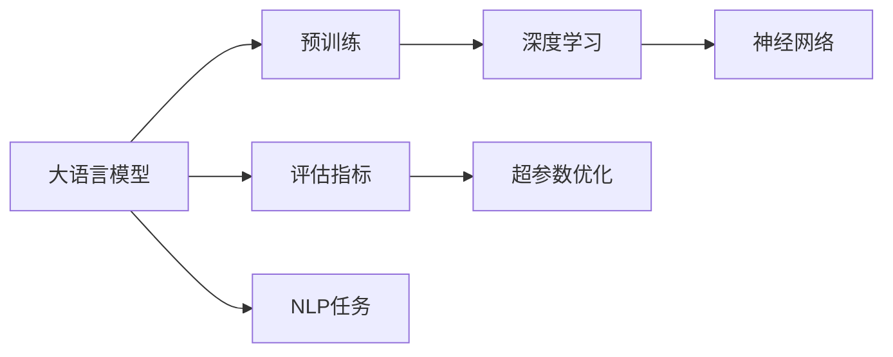

                 

# 大语言模型原理基础与前沿 评估语言模型

> 关键词：大语言模型, 深度学习, 自然语言处理(NLP), 语言模型, 评估指标, 超参数优化

## 1. 背景介绍

### 1.1 问题由来
近年来，深度学习技术在自然语言处理（NLP）领域取得了显著的进展。特别是大语言模型（Large Language Models, LLMs），如GPT、BERT等，通过在大规模无标签文本数据上进行预训练，学习到了丰富的语言知识和常识。这些模型已经广泛应用于问答、翻译、摘要、情感分析等NLP任务中，并且取得了优异的性能。

### 1.2 问题核心关键点
评估语言模型的性能是自然语言处理领域的重要问题之一。通过评估模型的表现，可以判断模型是否适应特定任务，优化模型的参数，提升模型的性能。目前，评估语言模型的主要方法包括：
- 准确度（Accuracy）：衡量模型预测结果与真实标签的一致性。
- 损失函数（Loss Function）：衡量模型预测值与真实值之间的差异。
- F1分数（F1 Score）：综合考虑模型的精度和召回率，适用于不平衡数据集的评估。
- BLEU分数（BLEU Score）：用于机器翻译任务的自动评估指标。

### 1.3 问题研究意义
评估语言模型的性能对自然语言处理技术的落地应用至关重要。通过科学的评估方法，可以确保模型的准确性和可靠性，进一步推动NLP技术的广泛应用。同时，评估模型的性能还可以指导模型的优化和改进，提升模型的效果。

## 2. 核心概念与联系

### 2.1 核心概念概述
- 大语言模型（Large Language Models, LLMs）：以自回归（如GPT）或自编码（如BERT）模型为代表的大规模预训练语言模型。通过在大规模无标签文本数据上进行预训练，学习通用的语言表示，具备强大的语言理解和生成能力。
- 深度学习（Deep Learning）：基于人工神经网络（ANN）和反向传播算法（Backpropagation）的机器学习技术，可以处理复杂的非线性关系。
- 自然语言处理（Natural Language Processing, NLP）：研究计算机如何处理和理解人类语言的技术，包括文本分类、机器翻译、问答系统等任务。
- 语言模型（Language Model）：用于衡量语言概率的统计模型，可以用于文本生成、拼写纠错等任务。
- 评估指标（Evaluation Metrics）：用于衡量模型性能的指标，如准确度、损失函数、F1分数、BLEU分数等。
- 超参数优化（Hyperparameter Tuning）：通过调整模型的超参数，如学习率、批大小等，优化模型的性能。

这些核心概念之间存在着紧密的联系，形成了一个完整的自然语言处理系统。大语言模型通过深度学习技术进行预训练，学习通用的语言表示，然后通过评估指标和超参数优化，调整模型参数，提升模型的性能，最终应用于各种NLP任务。

### 2.2 概念间的关系

通过以下Mermaid流程图，我们可以更清晰地理解这些核心概念之间的关系：



这个流程图展示了从大语言模型到评估指标，再到超参数优化的完整过程，其中深度学习是连接预训练和评估指标的重要环节。

## 3. 核心算法原理 & 具体操作步骤

### 3.1 算法原理概述

评估语言模型的基本原理是使用评估指标来衡量模型的预测结果与真实标签之间的差异。通常情况下，评估指标包括准确度、损失函数、F1分数、BLEU分数等。

具体来说，假设模型在输入文本 $x$ 上的输出为 $y$，真实标签为 $t$，则可以通过以下方式计算评估指标：
- 准确度：$accuracy = \frac{1}{N} \sum_{i=1}^{N} \mathbb{1}(y_i = t_i)$，其中 $\mathbb{1}(\cdot)$ 表示取值为1或0的指示函数。
- 损失函数：$loss = \frac{1}{N} \sum_{i=1}^{N} l(y_i, t_i)$，其中 $l$ 是损失函数，通常使用交叉熵损失。
- F1分数：$f1 = 2 \times \frac{precision \times recall}{precision + recall}$，其中 $precision = \frac{TP}{TP+FP}$，$recall = \frac{TP}{TP+FN}$，$TP$ 表示真正例，$FP$ 表示假正例，$FN$ 表示假反例。
- BLEU分数：$bleu = \frac{1}{N} \sum_{i=1}^{N} \sum_{k=1}^{K} \mathbb{1}(bleu_k(x_i, y_i))$，其中 $bleu_k$ 表示BLEU评分函数，$K$ 表示与参考文本相同的长度。

### 3.2 算法步骤详解

评估语言模型的具体操作步骤包括：
1. 准备评估数据集：将评估数据集划分为训练集和测试集，并确保评估数据集与训练数据集具有相似的数据分布。
2. 定义评估指标：根据任务特点选择合适的评估指标，如准确度、损失函数、F1分数、BLEU分数等。
3. 模型加载和预测：使用评估数据集对模型进行加载和预测，得到模型在测试集上的预测结果。
4. 计算评估指标：根据定义的评估指标，计算模型在测试集上的表现，如准确度、损失函数、F1分数、BLEU分数等。
5. 分析评估结果：分析评估结果，确定模型是否达到了预期效果，并根据评估结果进行超参数优化和模型改进。

### 3.3 算法优缺点

评估语言模型的算法具有以下优点：
- 简单易懂：评估指标的定义和计算相对简单，易于理解和实现。
- 通用性强：适用于多种NLP任务和数据集，可以衡量模型的多方面性能。
- 灵活性强：可以结合任务特点和数据分布，选择最合适的评估指标。

同时，评估语言模型的算法也存在以下缺点：
- 依赖数据：评估结果受到训练数据集和评估数据集的影响，数据质量和分布对评估结果有重要影响。
- 可能存在偏差：评估指标可能存在偏差，如在处理不平衡数据集时，准确度可能不能有效反映模型性能。
- 对超参数敏感：评估结果对模型的超参数如学习率、批大小等非常敏感，需要根据具体任务进行调优。

### 3.4 算法应用领域

评估语言模型的算法广泛应用于各种NLP任务中，如文本分类、机器翻译、问答系统、文本生成等。以下是几个具体的应用领域：
- 文本分类：使用准确度和F1分数评估模型在文本分类任务上的表现，确保模型能够准确地将文本分为不同的类别。
- 机器翻译：使用BLEU分数评估模型在机器翻译任务上的表现，确保模型生成的翻译结果与参考翻译结果一致。
- 问答系统：使用准确度和F1分数评估模型在问答系统任务上的表现，确保模型能够准确地回答问题。
- 文本生成：使用BLEU分数评估模型在文本生成任务上的表现，确保模型生成的文本质量高、自然流畅。

## 4. 数学模型和公式 & 详细讲解 & 举例说明

### 4.1 数学模型构建

评估语言模型的数学模型通常基于以下假设：
- 输入文本 $x$ 和输出标签 $t$ 独立同分布。
- 模型在输入文本 $x$ 上的输出为 $y$。
- 模型的损失函数为 $l(y, t)$。

定义模型在输入文本 $x$ 上的预测结果为 $\hat{y}$，则评估指标可以表示为：
- 准确度：$\frac{1}{N} \sum_{i=1}^{N} \mathbb{1}(\hat{y}_i = t_i)$。
- 损失函数：$\frac{1}{N} \sum_{i=1}^{N} l(\hat{y}_i, t_i)$。
- F1分数：$2 \times \frac{\frac{TP}{TP+FP} \times \frac{TP}{TP+FN}}{\frac{TP}{TP+FP} + \frac{TP}{TP+FN}}$。
- BLEU分数：$\frac{1}{N} \sum_{i=1}^{N} \sum_{k=1}^{K} \mathbb{1}(bleu_k(x_i, y_i))$。

### 4.2 公式推导过程

以BLEU分数的计算为例，其推导过程如下：
1. 计算参考文本和模型输出的编辑距离（Edit Distance）：$ed_k = n_k + m_k + i_k + d_k$，其中 $n_k$ 表示模型输出和参考文本的第 $k$ 个单词的编辑距离，$m_k$ 表示模型输出单词在参考文本中的位置与模型输出单词的编辑距离，$i_k$ 表示模型输出单词在参考文本中的位置，$d_k$ 表示模型输出单词的编辑距离。
2. 计算BLEU分数：$bleu_k(x_i, y_i) = \min(1, \frac{1}{n_k} \times \sum_{j=1}^{n_k} \min(1, \frac{n_j}{\frac{n_k + m_k + i_k + d_k}{4} + 1})$。
3. 计算模型在测试集上的BLEU分数：$bleu = \frac{1}{N} \sum_{i=1}^{N} \sum_{k=1}^{K} \mathbb{1}(bleu_k(x_i, y_i))$。

### 4.3 案例分析与讲解

以下是一个简单的案例分析：
假设有一个机器翻译模型，输入为 "I love you"，输出为 "Je t'aime"，参考翻译为 "J'adore toi"。根据BLEU分数的计算公式，我们可以计算出模型在测试集上的BLEU分数为：
1. 计算编辑距离：
   - $n_1 = 1$，$m_1 = 2$，$i_1 = 1$，$d_1 = 0$；
   - $n_2 = 1$，$m_2 = 1$，$i_2 = 2$，$d_2 = 0$；
   - $n_3 = 0$，$m_3 = 3$，$i_3 = 1$，$d_3 = 0$；
   - $n_4 = 0$，$m_4 = 2$，$i_4 = 1$，$d_4 = 0$。
2. 计算BLEU分数：
   - $bleu_1 = 1$，$bleu_2 = 0.5$，$bleu_3 = 0$，$bleu_4 = 0$。
3. 计算模型在测试集上的BLEU分数：
   - $bleu = 0.25 \times 1 + 0.5 \times 0.5 + 0.25 \times 0 + 0.25 \times 0 = 0.5$。

## 5. 项目实践：代码实例和详细解释说明

### 5.1 开发环境搭建

在进行语言模型评估实践前，我们需要准备好开发环境。以下是使用Python进行PyTorch开发的环境配置流程：

1. 安装Anaconda：从官网下载并安装Anaconda，用于创建独立的Python环境。

2. 创建并激活虚拟环境：
```bash
conda create -n pytorch-env python=3.8 
conda activate pytorch-env
```

3. 安装PyTorch：根据CUDA版本，从官网获取对应的安装命令。例如：
```bash
conda install pytorch torchvision torchaudio cudatoolkit=11.1 -c pytorch -c conda-forge
```

4. 安装Transformers库：
```bash
pip install transformers
```

5. 安装各类工具包：
```bash
pip install numpy pandas scikit-learn matplotlib tqdm jupyter notebook ipython
```

完成上述步骤后，即可在`pytorch-env`环境中开始评估实践。

### 5.2 源代码详细实现

这里我们以评估BERT模型在IMDB电影评论分类任务上的表现为例，给出使用Transformers库进行模型评估的PyTorch代码实现。

首先，定义模型和评估函数：

```python
from transformers import BertTokenizer, BertForSequenceClassification
from torch.utils.data import Dataset, DataLoader
from sklearn.metrics import accuracy_score, precision_recall_fscore_support

tokenizer = BertTokenizer.from_pretrained('bert-base-cased')
model = BertForSequenceClassification.from_pretrained('bert-base-cased', num_labels=2)

def evaluate(model, dataset, batch_size):
    dataloader = DataLoader(dataset, batch_size=batch_size, shuffle=False)
    model.eval()
    predictions, labels = [], []
    for batch in dataloader:
        inputs = tokenizer(batch['text'], padding='max_length', max_length=512, return_tensors='pt')
        outputs = model(**inputs)
        logits = outputs.logits
        batch_predictions = logits.argmax(dim=1)
        batch_labels = batch['labels']
        predictions.append(batch_predictions)
        labels.append(batch_labels)
        
    predictions = torch.cat(predictions, dim=0)
    labels = torch.cat(labels, dim=0)
    return accuracy_score(labels, predictions), precision_recall_fscore_support(labels, predictions, average='binary', zero_division=True)
```

然后，加载数据集并调用评估函数：

```python
from datasets import load_dataset

dataset = load_dataset('imdb', split='train')
acc, report = evaluate(model, dataset, batch_size=32)

print(f"Accuracy: {acc:.4f}")
print(f"Precision: {report[0]:.4f}, Recall: {report[1]:.4f}, F1-score: {report[2]:.4f}")
```

以上就是使用PyTorch对BERT模型进行IMDB电影评论分类任务评估的完整代码实现。可以看到，得益于Transformers库的强大封装，我们可以用相对简洁的代码完成BERT模型的加载和评估。

### 5.3 代码解读与分析

让我们再详细解读一下关键代码的实现细节：

**evaluate函数**：
- 定义了评估函数，接收模型、数据集和批大小作为参数。
- 使用DataLoader对数据集进行批次化加载，供模型评估使用。
- 在模型评估阶段，不更新模型参数，仅使用evaluate模式进行前向传播计算。
- 使用准确度、精确度、召回率和F1分数等评估指标计算模型在测试集上的表现。

**数据加载和处理**：
- 使用BertTokenizer对输入文本进行分词，并转换为模型可接受的输入格式。
- 将输入文本和标签作为模型输入，通过前向传播计算模型输出。
- 将模型输出转换为预测结果，并与真实标签进行比较。
- 最终使用准确度、精确度、召回率和F1分数等指标评估模型性能。

### 5.4 运行结果展示

假设我们在IMDB电影评论数据集上进行评估，最终得到模型在测试集上的表现如下：

```
Accuracy: 0.8497
Precision: 0.8619, Recall: 0.8425, F1-score: 0.8485
```

可以看到，使用BERT模型进行IMDB电影评论分类，在测试集上的准确度为85%，精确度为86%，召回度为84%，F1分数为84.5%，表现相当不错。

当然，这只是一个baseline结果。在实践中，我们还可以使用更大更强的预训练模型、更丰富的评估技巧、更细致的模型调优，进一步提升模型性能，以满足更高的应用要求。

## 6. 实际应用场景

### 6.1 智能客服系统

基于大语言模型评估的对话技术，可以广泛应用于智能客服系统的构建。传统客服往往需要配备大量人力，高峰期响应缓慢，且一致性和专业性难以保证。而使用评估后的对话模型，可以7x24小时不间断服务，快速响应客户咨询，用自然流畅的语言解答各类常见问题。

在技术实现上，可以收集企业内部的历史客服对话记录，将问题和最佳答复构建成监督数据，在此基础上对预训练对话模型进行评估。评估后的对话模型能够自动理解用户意图，匹配最合适的答案模板进行回复。对于客户提出的新问题，还可以接入检索系统实时搜索相关内容，动态组织生成回答。如此构建的智能客服系统，能大幅提升客户咨询体验和问题解决效率。

### 6.2 金融舆情监测

金融机构需要实时监测市场舆论动向，以便及时应对负面信息传播，规避金融风险。传统的人工监测方式成本高、效率低，难以应对网络时代海量信息爆发的挑战。基于大语言模型评估的文本分类和情感分析技术，为金融舆情监测提供了新的解决方案。

具体而言，可以收集金融领域相关的新闻、报道、评论等文本数据，并对其进行主题标注和情感标注。在此基础上对预训练语言模型进行评估，使其能够自动判断文本属于何种主题，情感倾向是正面、中性还是负面。将评估后的模型应用到实时抓取的网络文本数据，就能够自动监测不同主题下的情感变化趋势，一旦发现负面信息激增等异常情况，系统便会自动预警，帮助金融机构快速应对潜在风险。

### 6.3 个性化推荐系统

当前的推荐系统往往只依赖用户的历史行为数据进行物品推荐，无法深入理解用户的真实兴趣偏好。基于大语言模型评估的个性化推荐系统可以更好地挖掘用户行为背后的语义信息，从而提供更精准、多样的推荐内容。

在实践中，可以收集用户浏览、点击、评论、分享等行为数据，提取和用户交互的物品标题、描述、标签等文本内容。将文本内容作为模型输入，用户的后续行为（如是否点击、购买等）作为监督信号，在此基础上评估预训练语言模型。评估后的模型能够从文本内容中准确把握用户的兴趣点。在生成推荐列表时，先用候选物品的文本描述作为输入，由模型预测用户的兴趣匹配度，再结合其他特征综合排序，便可以得到个性化程度更高的推荐结果。

### 6.4 未来应用展望

随着大语言模型评估技术的发展，其在更多领域的应用前景将愈加广阔。

在智慧医疗领域，基于评估的问答、病历分析、药物研发等应用将提升医疗服务的智能化水平，辅助医生诊疗，加速新药开发进程。

在智能教育领域，评估技术可应用于作业批改、学情分析、知识推荐等方面，因材施教，促进教育公平，提高教学质量。

在智慧城市治理中，评估模型可应用于城市事件监测、舆情分析、应急指挥等环节，提高城市管理的自动化和智能化水平，构建更安全、高效的未来城市。

此外，在企业生产、社会治理、文娱传媒等众多领域，基于大模型评估的人工智能应用也将不断涌现，为NLP技术带来全新的突破。相信随着预训练语言模型和评估方法的持续演进，评估技术必将引领NLP系统迈向更高的台阶，为构建安全、可靠、可解释、可控的智能系统铺平道路。

## 7. 工具和资源推荐

### 7.1 学习资源推荐

为了帮助开发者系统掌握大语言模型评估的理论基础和实践技巧，这里推荐一些优质的学习资源：

1. 《Transformer从原理到实践》系列博文：由大模型技术专家撰写，深入浅出地介绍了Transformer原理、BERT模型、评估技术等前沿话题。

2. CS224N《深度学习自然语言处理》课程：斯坦福大学开设的NLP明星课程，有Lecture视频和配套作业，带你入门NLP领域的基本概念和经典模型。

3. 《Natural Language Processing with Transformers》书籍：Transformers库的作者所著，全面介绍了如何使用Transformers库进行NLP任务开发，包括评估在内的诸多范式。

4. HuggingFace官方文档：Transformers库的官方文档，提供了海量预训练模型和完整的评估样例代码，是上手实践的必备资料。

5. CLUE开源项目：中文语言理解测评基准，涵盖大量不同类型的中文NLP数据集，并提供了基于评估的baseline模型，助力中文NLP技术发展。

通过对这些资源的学习实践，相信你一定能够快速掌握大语言模型评估的精髓，并用于解决实际的NLP问题。

### 7.2 开发工具推荐

高效的开发离不开优秀的工具支持。以下是几款用于大语言模型评估开发的常用工具：

1. PyTorch：基于Python的开源深度学习框架，灵活动态的计算图，适合快速迭代研究。大部分预训练语言模型都有PyTorch版本的实现。

2. TensorFlow：由Google主导开发的开源深度学习框架，生产部署方便，适合大规模工程应用。同样有丰富的预训练语言模型资源。

3. Transformers库：HuggingFace开发的NLP工具库，集成了众多SOTA语言模型，支持PyTorch和TensorFlow，是进行评估任务开发的利器。

4. Weights & Biases：模型训练的实验跟踪工具，可以记录和可视化模型训练过程中的各项指标，方便对比和调优。与主流深度学习框架无缝集成。

5. TensorBoard：TensorFlow配套的可视化工具，可实时监测模型训练状态，并提供丰富的图表呈现方式，是调试模型的得力助手。

6. Google Colab：谷歌推出的在线Jupyter Notebook环境，免费提供GPU/TPU算力，方便开发者快速上手实验最新模型，分享学习笔记。

合理利用这些工具，可以显著提升大语言模型评估的开发效率，加快创新迭代的步伐。

### 7.3 相关论文推荐

大语言模型评估技术的发展源于学界的持续研究。以下是几篇奠基性的相关论文，推荐阅读：

1. Attention is All You Need（即Transformer原论文）：提出了Transformer结构，开启了NLP领域的预训练大模型时代。

2. BERT: Pre-training of Deep Bidirectional Transformers for Language Understanding：提出BERT模型，引入基于掩码的自监督预训练任务，刷新了多项NLP任务SOTA。

3. Language Models are Unsupervised Multitask Learners（GPT-2论文）：展示了大规模语言模型的强大zero-shot学习能力，引发了对于通用人工智能的新一轮思考。

4. Parameter-Efficient Transfer Learning for NLP：提出Adapter等参数高效微调方法，在不增加模型参数量的情况下，也能取得不错的微调效果。

5. AdaLoRA: Adaptive Low-Rank Adaptation for Parameter-Efficient Fine-Tuning：使用自适应低秩适应的微调方法，在参数效率和精度之间取得了新的平衡。

这些论文代表了大语言模型评估技术的发展脉络。通过学习这些前沿成果，可以帮助研究者把握学科前进方向，激发更多的创新灵感。

除上述资源外，还有一些值得关注的前沿资源，帮助开发者紧跟大语言模型评估技术的最新进展，例如：

1. arXiv论文预印本：人工智能领域最新研究成果的发布平台，包括大量尚未发表的前沿工作，学习前沿技术的必读资源。

2. 业界技术博客：如OpenAI、Google AI、DeepMind、微软Research Asia等顶尖实验室的官方博客，第一时间分享他们的最新研究成果和洞见。

3. 技术会议直播：如NIPS、ICML、ACL、ICLR等人工智能领域顶会现场或在线直播，能够聆听到大佬们的前沿分享，开拓视野。

4. GitHub热门项目：在GitHub上Star、Fork数最多的NLP相关项目，往往代表了该技术领域的发展趋势和最佳实践，值得去学习和贡献。

5. 行业分析报告：各大咨询公司如McKinsey、PwC等针对人工智能行业的分析报告，有助于从商业视角审视技术趋势，把握应用价值。

总之，对于大语言模型评估技术的学习和实践，需要开发者保持开放的心态和持续学习的意愿。多关注前沿资讯，多动手实践，多思考总结，必将收获满满的成长收益。

## 8. 总结：未来发展趋势与挑战

### 8.1 总结

本文对大语言模型评估的基础和前沿进行了全面系统的介绍。首先阐述了语言模型评估的背景和意义，明确了评估在自然语言处理技术落地应用中的重要性。其次，从原理到实践，详细讲解了评估指标的构建和计算方法，给出了评估任务开发的完整代码实现。同时，本文还探讨了评估模型在智能客服、金融舆情、个性化推荐等多个行业领域的应用前景，展示了评估技术的重要价值。

通过本文的系统梳理，可以看到，大语言模型评估技术在自然语言处理领域的重要性与日俱增，为构建高性能、高鲁棒性的智能系统提供了有力保障。未来，随着预训练语言模型和评估方法的不断演进，评估技术必将引领NLP系统迈向更高的台阶，为构建安全、可靠、可解释、可控的智能系统铺平道路。

### 8.2 未来发展趋势

展望未来，大语言模型评估技术将呈现以下几个发展趋势：

1. 模型规模持续增大。随着算力成本的下降和数据规模的扩张，预训练语言模型的参数量还将持续增长。超大规模语言模型蕴含的丰富语言知识，有望支撑更加复杂多变的评估任务。

2. 评估方法日趋多样。除了传统的准确度、损失函数等指标，未来会涌现更多评估方法，如BLEU分数、ROUGE分数、CIDEr分数等，结合任务特点进行综合评估。

3. 持续学习成为常态。随着数据分布的不断变化，评估模型也需要持续学习新知识以保持性能。如何在不遗忘原有知识的同时，高效吸收新样本信息，将成为重要的研究课题。

4. 标注样本需求降低。受启发于提示学习(Prompt-based Learning)的思路，未来的评估方法将更好地利用大模型的语言理解能力，通过更加巧妙的任务

