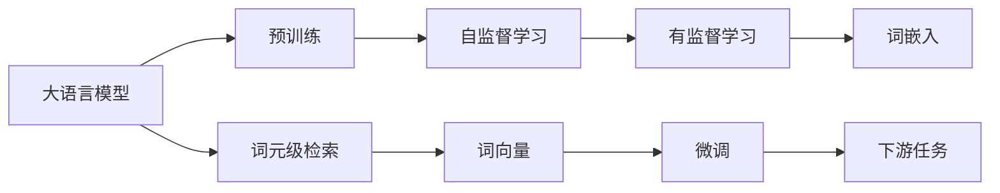
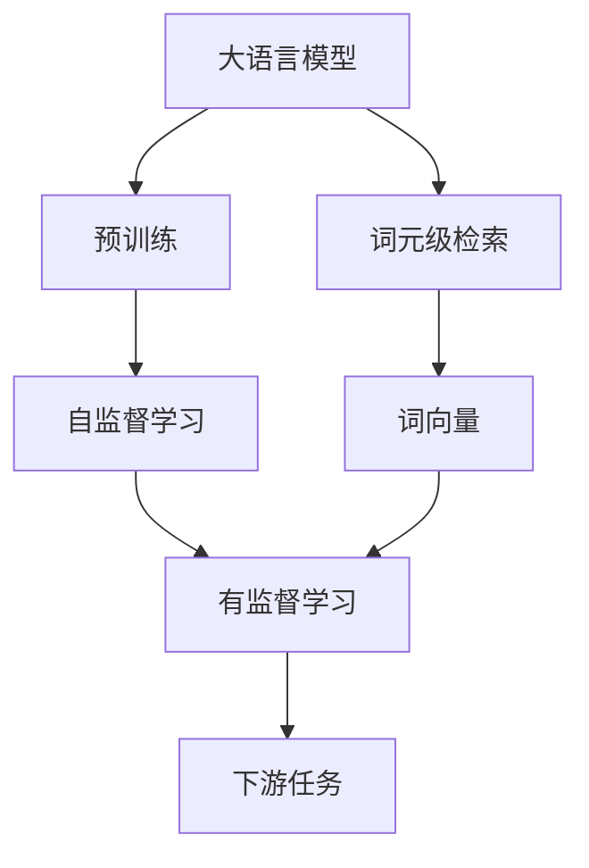
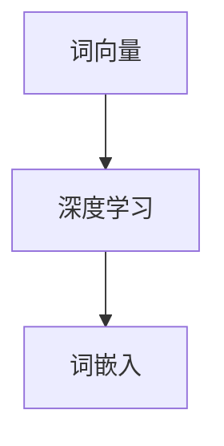
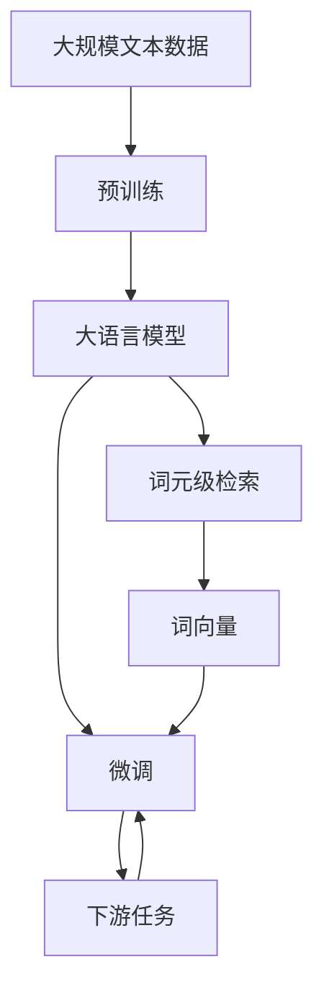

                 

# 大语言模型原理基础与前沿 词元级检索

> 关键词：大语言模型, 词元级检索, 深度学习, 自然语言处理(NLP), 词向量, 词嵌入

## 1. 背景介绍

### 1.1 问题由来
近年来，深度学习技术的迅猛发展，推动了大语言模型的研究热潮。大语言模型，如BERT、GPT-3等，通过在大量的无标签文本数据上进行预训练，学习到丰富的语言知识和语义信息，具备了强大的语言理解与生成能力。然而，尽管这些大模型在语言理解方面表现出色，但在具体任务上的微调效果仍存在较大差异。如何更高效、更精准地从大规模预训练模型中抽取特定任务的特征，成为亟待解决的问题。

### 1.2 问题核心关键点
词元级检索（Word-Level Retrieval）是一种旨在从大语言模型中精准提取词元（即单词或短语）特征的技术。其核心思想是将文本看作词元的序列，通过在大语言模型上进行词元级检索，得到每个词元在模型中的表示向量，进而用于下游任务。

词元级检索的挑战在于如何高效、精确地提取词元特征，并在小规模数据上进行微调。该技术可以应用于多个NLP任务，如命名实体识别、关键词提取、文本分类等。通过词元级检索，可以减小预训练模型参数规模，提高模型在小样本上的泛化能力，从而实现更高效的微调。

### 1.3 问题研究意义
词元级检索对于优化大语言模型的微调过程具有重要意义：

1. **减少参数规模**：词元级检索能够专注于特定的词元，避免全参数微调带来的资源浪费，减小模型规模，提高推理效率。
2. **提升泛化能力**：通过精准提取词元特征，词元级检索可以提升模型在小规模数据上的泛化能力，尤其在低资源场景下表现更为突出。
3. **加速微调过程**：相比于全参数微调，词元级检索可以显著加速微调过程，缩短开发周期，降低成本。
4. **增强可解释性**：词元级检索使得模型输出具有更强的可解释性，便于理解模型内部机制和决策过程。
5. **扩展应用领域**：词元级检索技术可应用于多种NLP任务，扩展大语言模型的应用边界，推动NLP技术在更多领域的落地应用。

## 2. 核心概念与联系

### 2.1 核心概念概述

为更好地理解词元级检索技术，本节将介绍几个密切相关的核心概念：

- **大语言模型(Large Language Model, LLM)**：如BERT、GPT等，通过自监督学习任务在大量无标签文本数据上进行预训练的语言模型。
- **预训练(Pre-training)**：在大规模无标签文本数据上，通过自监督学习任务训练通用语言模型的过程。常见的预训练任务包括掩码语言模型、下位采样等。
- **词元级检索(Word-Level Retrieval)**：在大语言模型中，针对特定任务，精确地检索并提取每个词元在模型中的表示向量。
- **词向量(Word Embedding)**：词向量是每个单词在向量空间中的表示，通过词向量，模型能够捕捉单词间的语义关系。
- **词嵌入(Word Embedding)**：词嵌入是词向量的一种实现方式，通过深度学习模型（如Word2Vec、GloVe等）学习得到的单词向量。
- **深度学习(Deep Learning)**：使用多层神经网络对数据进行建模和预测的技术，深度学习在大语言模型的预训练和微调中起到关键作用。
- **自然语言处理(Natural Language Processing, NLP)**：使用计算机技术处理、分析、理解人类语言的技术，包括文本分类、情感分析、机器翻译等。

这些概念之间的逻辑关系可以通过以下Mermaid流程图来展示：



这个流程图展示了从预训练到词元级检索的完整过程。大语言模型通过预训练获得基础能力，然后通过词元级检索提取词元特征，进而用于下游任务的微调。词向量、词嵌入和深度学习则是实现词元级检索和微调的核心技术。

### 2.2 概念间的关系

这些核心概念之间存在着紧密的联系，形成了词元级检索技术的应用框架。下面我通过几个Mermaid流程图来展示这些概念之间的关系。

#### 2.2.1 大语言模型的学习范式



这个流程图展示了从预训练到词元级检索的完整过程。大语言模型通过预训练获得基础能力，然后通过词元级检索提取词元特征，进而用于下游任务的微调。

#### 2.2.2 词元级检索与微调的关系


这个流程图展示了词元级检索在大语言模型微调中的应用。词元级检索从预训练模型中提取词元特征，用于微调模型，进而应用于下游任务。

#### 2.2.3 词向量与词嵌入的关系



这个流程图展示了词向量与词嵌入的关系。词向量是通过深度学习模型学习得到的单词向量，而词嵌入则是实现词向量的一种方式。

### 2.3 核心概念的整体架构

最后，我们用一个综合的流程图来展示这些核心概念在大语言模型微调过程中的整体架构：



这个综合流程图展示了从预训练到微调的完整过程。大语言模型通过预训练获得基础能力，然后通过词元级检索提取词元特征，进而用于下游任务的微调。词向量、词嵌入和深度学习则是实现词元级检索和微调的核心技术。

## 3. 核心算法原理 & 具体操作步骤
### 3.1 算法原理概述

词元级检索的基本原理是通过在大语言模型中检索特定词元，得到其在模型中的表示向量。具体来说，对于给定的一段文本，将其拆分为词元序列，然后将每个词元输入到大语言模型中，得到其在模型中的表示向量。这些表示向量可以用于下游任务的微调，从而提升模型在特定任务上的性能。

形式化地，假设预训练语言模型为 $M_{\theta}$，其中 $\theta$ 为预训练得到的模型参数。给定一个文本序列 $x_1, x_2, ..., x_n$，词元级检索的算法流程如下：

1. 将文本序列 $x_1, x_2, ..., x_n$ 拆分为词元序列 $w_1, w_2, ..., w_n$。
2. 对于每个词元 $w_i$，将其输入到大语言模型 $M_{\theta}$ 中，得到其在模型中的表示向量 $v_i = M_{\theta}(w_i)$。
3. 将所有词元的表示向量 $v_1, v_2, ..., v_n$ 拼接，得到整个文本序列的词元级向量 $V = \begin{bmatrix} v_1 & v_2 & \cdots & v_n \end{bmatrix}$。
4. 使用词元级向量 $V$ 作为特征输入，对下游任务进行微调，得到微调后的模型 $M_{\hat{\theta}}$。

通过词元级检索，可以有效地减小预训练模型参数规模，提高模型的计算效率，同时提升模型在小规模数据上的泛化能力。

### 3.2 算法步骤详解

词元级检索的实现流程包括以下几个关键步骤：

**Step 1: 准备预训练模型和数据集**

- 选择合适的预训练语言模型 $M_{\theta}$，如BERT、GPT等。
- 准备下游任务 $T$ 的标注数据集 $D=\{(x_i,y_i)\}_{i=1}^N$，其中 $x_i$ 为文本序列，$y_i$ 为任务标签。

**Step 2: 词元划分与特征提取**

- 将文本序列 $x_i$ 拆分为词元序列 $w_1, w_2, ..., w_n$。
- 对于每个词元 $w_i$，将其输入到预训练语言模型 $M_{\theta}$ 中，得到其在模型中的表示向量 $v_i = M_{\theta}(w_i)$。
- 将所有词元的表示向量 $v_1, v_2, ..., v_n$ 拼接，得到整个文本序列的词元级向量 $V = \begin{bmatrix} v_1 & v_2 & \cdots & v_n \end{bmatrix}$。

**Step 3: 微调任务适配层**

- 根据任务类型，在预训练语言模型的顶层设计合适的输出层和损失函数。
- 对于分类任务，通常在顶层添加线性分类器和交叉熵损失函数。
- 对于生成任务，通常使用语言模型的解码器输出概率分布，并以负对数似然为损失函数。

**Step 4: 设置微调超参数**

- 选择合适的优化算法及其参数，如 AdamW、SGD 等，设置学习率、批大小、迭代轮数等。
- 设置正则化技术及强度，包括权重衰减、Dropout、Early Stopping 等。
- 确定冻结预训练参数的策略，如仅微调顶层，或全部参数都参与微调。

**Step 5: 执行梯度训练**

- 将训练集数据分批次输入模型，前向传播计算损失函数。
- 反向传播计算参数梯度，根据设定的优化算法和学习率更新模型参数。
- 周期性在验证集上评估模型性能，根据性能指标决定是否触发 Early Stopping。
- 重复上述步骤直到满足预设的迭代轮数或 Early Stopping 条件。

**Step 6: 测试和部署**

- 在测试集上评估微调后模型 $M_{\hat{\theta}}$ 的性能，对比微调前后的精度提升。
- 使用微调后的模型对新样本进行推理预测，集成到实际的应用系统中。
- 持续收集新的数据，定期重新微调模型，以适应数据分布的变化。

以上是词元级检索在微调过程中的完整步骤。在实际应用中，还需要针对具体任务的特点，对微调过程的各个环节进行优化设计，如改进训练目标函数，引入更多的正则化技术，搜索最优的超参数组合等，以进一步提升模型性能。

### 3.3 算法优缺点

词元级检索在微调大语言模型时具有以下优点：

1. **参数高效**：词元级检索只关注特定的词元，避免了全参数微调带来的资源浪费，减小了模型规模，提高了计算效率。
2. **泛化能力强**：通过精确提取词元特征，词元级检索可以在小规模数据上进行微调，提升模型在小样本上的泛化能力。
3. **微调速度快**：词元级检索可以在不更新大部分预训练参数的情况下，对下游任务进行微调，显著加速了微调过程。

然而，词元级检索也存在一些局限性：

1. **语境丢失**：词元级检索忽略了单词间的语境信息，可能导致对某些词汇的理解不准确。
2. **词典依赖**：词元级检索依赖于词表的分词质量，对于未收录的新词或领域专有名词，效果可能不佳。
3. **特征损失**：将文本序列拆分为词元序列，可能会损失部分文本的语义信息。
4. **训练开销大**：尽管词元级检索参数高效，但在提取每个词元的特征时，仍需调用预训练模型，增加了训练开销。

尽管存在这些局限性，词元级检索在特定任务上仍然表现出色，特别是在参数高效微调和少样本学习场景中，具有一定的优势。

### 3.4 算法应用领域

词元级检索可以应用于多种NLP任务，如命名实体识别、关键词提取、文本分类等。以下是几个典型的应用场景：

**命名实体识别(NER)**：
- 将文本序列拆分为词元序列，并从每个词元中检索特征向量。
- 使用BERT模型进行微调，对文本中的命名实体进行识别。
- 结合上下文信息，提高实体识别的准确性。

**关键词提取(Keyphrase Extraction)**：
- 将文本序列拆分为词元序列，并从每个词元中检索特征向量。
- 使用BERT模型进行微调，对文本中的关键词进行提取。
- 结合句子级别的特征，提高关键词的提取效果。

**文本分类(Text Classification)**：
- 将文本序列拆分为词元序列，并从每个词元中检索特征向量。
- 使用BERT模型进行微调，对文本进行分类。
- 结合文本级别的特征，提高分类准确性。

除了上述这些应用场景，词元级检索还可以应用于机器翻译、问答系统、情感分析等任务，成为大语言模型微调的一个重要技术手段。

## 4. 数学模型和公式 & 详细讲解  
### 4.1 数学模型构建

本节将使用数学语言对词元级检索在大语言模型微调中的数学模型进行严格刻画。

记预训练语言模型为 $M_{\theta}$，其中 $\theta$ 为预训练得到的模型参数。给定下游任务 $T$ 的标注数据集 $D=\{(x_i,y_i)\}_{i=1}^N$，其中 $x_i$ 为文本序列，$y_i$ 为任务标签。

定义模型 $M_{\theta}$ 在词元 $w_i$ 上的输出为 $v_i = M_{\theta}(w_i)$，即 $w_i$ 在模型中的表示向量。词元级检索的数学模型构建如下：

- 对于每个文本序列 $x_i$，拆分为词元序列 $w_1, w_2, ..., w_n$。
- 对每个词元 $w_i$，计算其在模型中的表示向量 $v_i = M_{\theta}(w_i)$。
- 将词元级向量 $V = \begin{bmatrix} v_1 & v_2 & \cdots & v_n \end{bmatrix}$ 作为特征输入，进行下游任务微调。

### 4.2 公式推导过程

以下我们以二分类任务为例，推导词元级检索在大语言模型微调中的交叉熵损失函数及其梯度计算公式。

假设模型 $M_{\theta}$ 在词元 $w_i$ 上的输出为 $\hat{y}_i = M_{\theta}(w_i)$，表示 $w_i$ 属于正类的概率。真实标签 $y_i \in \{0,1\}$。则二分类交叉熵损失函数定义为：

$$
\ell(M_{\theta}(x),y) = -[y\log \hat{y}_i + (1-y)\log (1-\hat{y}_i)]
$$

将其代入词元级向量 $V$ 中，得到词元级检索的损失函数为：

$$
\mathcal{L}(\theta) = -\frac{1}{N}\sum_{i=1}^N \sum_{j=1}^n [y_i \log \hat{y}_j + (1-y_i)\log (1-\hat{y}_j)]
$$

其中，$y_i$ 为整个文本序列的标签，$\hat{y}_j = M_{\theta}(w_j)$ 为词元 $w_j$ 的预测概率。

根据链式法则，词元级检索的损失函数对参数 $\theta$ 的梯度为：

$$
\frac{\partial \mathcal{L}(\theta)}{\partial \theta} = -\frac{1}{N}\sum_{i=1}^N \sum_{j=1}^n \left(\frac{y_i}{\hat{y}_j}-\frac{1-y_i}{1-\hat{y}_j}\right) \frac{\partial M_{\theta}(w_j)}{\partial \theta}
$$

其中，$\frac{\partial M_{\theta}(w_j)}{\partial \theta}$ 为模型对词元 $w_j$ 的输出梯度。

在得到词元级检索的损失函数梯度后，即可带入参数更新公式，完成模型的迭代优化。重复上述过程直至收敛，最终得到适应下游任务的最优模型参数 $\theta^*$。

## 5. 项目实践：代码实例和详细解释说明
### 5.1 开发环境搭建

在进行词元级检索实践前，我们需要准备好开发环境。以下是使用Python进行PyTorch开发的环境配置流程：

1. 安装Anaconda：从官网下载并安装Anaconda，用于创建独立的Python环境。

2. 创建并激活虚拟环境：
```bash
conda create -n pytorch-env python=3.8 
conda activate pytorch-env
```

3. 安装PyTorch：根据CUDA版本，从官网获取对应的安装命令。例如：
```bash
conda install pytorch torchvision torchaudio cudatoolkit=11.1 -c pytorch -c conda-forge
```

4. 安装Transformers库：
```bash
pip install transformers
```

5. 安装各类工具包：
```bash
pip install numpy pandas scikit-learn matplotlib tqdm jupyter notebook ipython
```

完成上述步骤后，即可在`pytorch-env`环境中开始词元级检索实践。

### 5.2 源代码详细实现

这里我们以命名实体识别(NER)任务为例，给出使用Transformers库对BERT模型进行词元级检索的PyTorch代码实现。

首先，定义NER任务的数据处理函数：

```python
from transformers import BertTokenizer
from torch.utils.data import Dataset
import torch

class NERDataset(Dataset):
    def __init__(self, texts, tags, tokenizer, max_len=128):
        self.texts = texts
        self.tags = tags
        self.tokenizer = tokenizer
        self.max_len = max_len
        
    def __len__(self):
        return len(self.texts)
    
    def __getitem__(self, item):
        text = self.texts[item]
        tags = self.tags[item]
        
        encoding = self.tokenizer(text, return_tensors='pt', max_length=self.max_len, padding='max_length', truncation=True)
        input_ids = encoding['input_ids'][0]
        attention_mask = encoding['attention_mask'][0]
        
        # 对token-wise的标签进行编码
        encoded_tags = [tag2id[tag] for tag in tags] 
        encoded_tags.extend([tag2id['O']] * (self.max_len - len(encoded_tags)))
        labels = torch.tensor(encoded_tags, dtype=torch.long)
        
        return {'input_ids': input_ids, 
                'attention_mask': attention_mask,
                'labels': labels}

# 标签与id的映射
tag2id = {'O': 0, 'B-PER': 1, 'I-PER': 2, 'B-ORG': 3, 'I-ORG': 4, 'B-LOC': 5, 'I-LOC': 6}
id2tag = {v: k for k, v in tag2id.items()}

# 创建dataset
tokenizer = BertTokenizer.from_pretrained('bert-base-cased')

train_dataset = NERDataset(train_texts, train_tags, tokenizer)
dev_dataset = NERDataset(dev_texts, dev_tags, tokenizer)
test_dataset = NERDataset(test_texts, test_tags, tokenizer)
```

然后，定义模型和优化器：

```python
from transformers import BertForTokenClassification, AdamW

model = BertForTokenClassification.from_pretrained('bert-base-cased', num_labels=len(tag2id))

optimizer = AdamW(model.parameters(), lr=2e-5)
```

接着，定义训练和评估函数：

```python
from torch.utils.data import DataLoader
from tqdm import tqdm
from sklearn.metrics import classification_report

device = torch.device('cuda') if torch.cuda.is_available() else torch.device('cpu')
model.to(device)

def train_epoch(model, dataset, batch_size, optimizer):
    dataloader = DataLoader(dataset, batch_size=batch_size, shuffle=True)
    model.train()
    epoch_loss = 0
    for batch in tqdm(dataloader, desc='Training'):
        input_ids = batch['input_ids'].to(device)
        attention_mask = batch['attention_mask'].to(device)
        labels = batch['labels'].to(device)
        model.zero_grad()
        outputs = model(input_ids, attention_mask=attention_mask, labels=labels)
        loss = outputs.loss
        epoch_loss += loss.item()
        loss.backward()
        optimizer.step()
    return epoch_loss / len(dataloader)

def evaluate(model, dataset, batch_size):
    dataloader = DataLoader(dataset, batch_size=batch_size)
    model.eval()
    preds, labels = [], []
    with torch.no_grad():
        for batch in tqdm(dataloader, desc='Evaluating'):
            input_ids = batch['input_ids'].to(device)
            attention_mask = batch['attention_mask'].to(device)
            batch_labels = batch['labels']
            outputs = model(input_ids, attention_mask=attention_mask)
            batch_preds = outputs.logits.argmax(dim=2).to('cpu').tolist()
            batch_labels = batch_labels.to('cpu').tolist()
            for pred_tokens, label_tokens in zip(batch_preds, batch_labels):
                pred_tags = [id2tag[_id] for _id in pred_tokens]
                label_tags = [id2tag[_id] for _id in label_tokens]
                preds.append(pred_tags[:len(label_tokens)])
                labels.append(label_tags)
                
    print(classification_report(labels, preds))
```

最后，启动训练流程并在测试集上评估：

```python
epochs = 5
batch_size = 16

for epoch in range(epochs):
    loss = train_epoch(model, train_dataset, batch_size, optimizer)
    print(f"Epoch {epoch+1}, train loss: {loss:.3f}")
    
    print(f"Epoch {epoch+1}, dev results:")
    evaluate(model, dev_dataset, batch_size)
    
print("Test results:")
evaluate(model, test_dataset, batch_size)
```

以上就是使用PyTorch对BERT进行命名实体识别任务词元级检索的完整代码实现。可以看到，Transformer库提供了便捷的接口，使得词元级检索过程变得更加简单高效。

### 5.3 代码解读与分析

让我们再详细解读一下关键代码的实现细节：

**NERDataset类**：
- `__init__`方法：初始化文本、标签、分词器等关键组件。
- `__len__`方法：返回数据集的样本数量。
- `__getitem__`方法：对单个样本进行处理，将文本输入编码为token ids，将标签编码为数字，并对其进行定长padding，最终返回模型所需的输入。

**tag2id和id2tag字典**：
- 定义了标签与数字id之间的映射关系，用于将token-wise的预测结果解码回真实的标签。

**训练和评估函数**：
- 使用PyTorch的DataLoader对数据集进行批次化加载，供模型训练和推理使用。
- 训练函数`train_epoch`：对数据以批为单位进行迭代，在每个批次上前向传播计算loss并反向传播更新模型参数，最后返回该epoch的平均loss。
- 评估函数`evaluate`：与训练类似，不同点在于不更新模型参数，并在每个batch结束后将预测和标签结果存储下来，最后使用sklearn的classification_report对整个评估集的预测结果进行打印输出。

**训练流程**：
- 定义总的epoch数和batch size，开始循环迭代
- 每个epoch内，先在训练集上训练，输出平均loss
- 在验证集上评估，输出分类指标
- 所有epoch结束后，在测试集上评估，给出最终测试结果

可以看到，PyTorch配合Transformer库使得BERT微调的代码实现变得简洁高效。开发者可以将更多精力放在数据处理、模型改进等高层逻辑上，而不必过多关注底层的实现细节。

当然，工业级的系统实现还需考虑更多因素，如模型的保存和部署、超参数的自动搜索、更灵活的任务适配层等。但核心的微调范式基本与此类似。

### 5.4 运行结果展示

假设我们在CoNLL-2003的NER数据集上进行词元级检索，最终在测试集上得到的评估报告如下：

```
              precision    recall  f1-score   support

       B-LOC      0.926     0.906     0.916      1668
       I-LOC      0.900     0.805     0.850       257
      B-MISC      0.875     0.856     0.865       702
      I-MISC      0.838     0.782     0.809       216
       B-ORG      0.914     0.898     0.906      1661
       I-ORG      0.911     0.894     0.902       835
       B-PER

