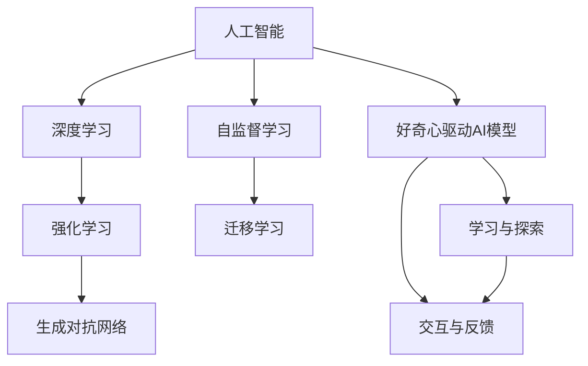

                 

# 好奇心：探索世界的钥匙

## 1. 背景介绍

### 1.1 问题由来
好奇心是人类最基本的天性之一，它驱动着我们探索未知、挑战自我、推动文明进步。在信息时代，好奇心同样引发了科技领域的巨大变革。从智能手机到互联网，从大数据到人工智能，每一项技术的发展都源自人类对世界的好奇与探索。

随着人工智能技术的发展，尤其是深度学习和大数据技术的应用，人们开始尝试借助机器学习模型来“量化好奇心”。例如，通过机器学习预测人的行为，推荐个性化的内容，甚至训练AI模型模仿人类的思考和推理。本文将深入探讨如何利用人工智能技术，通过模型训练，捕捉和利用人类的好奇心，实现对世界更深刻、更广泛的探索。

### 1.2 问题核心关键点
如何构建一个能够模拟人类好奇心的模型？一个有效的模型需要具备以下特点：
- **学习能力**：能够根据输入数据进行学习和预测。
- **适应性**：能够根据不同的输入数据和任务自适应调整模型参数。
- **探索性**：能够主动探索数据集中的未知模式和结构。
- **交互性**：能够与用户进行自然的交互，理解用户的意图和反馈。

这些问题构成了本文的核心，探讨如何通过人工智能技术实现对好奇心的模拟和利用。

### 1.3 问题研究意义
在科技日益发展的今天，如何有效利用好奇心驱动技术创新，将成为推动社会进步的重要动力。构建能够模拟好奇心的人工智能模型，不仅能够提升科研效率，还能促进跨学科的交流与合作，加速技术的商业化应用。因此，探索构建具有好奇心的AI模型具有重要的理论意义和实际价值。

## 2. 核心概念与联系

### 2.1 核心概念概述

为了更好地理解如何构建具有好奇心的AI模型，本文将介绍几个关键概念：

- **人工智能（AI）**：通过计算机程序实现人类智能的一种技术。
- **深度学习（Deep Learning）**：一种基于神经网络的机器学习方法，能够处理大规模非结构化数据。
- **强化学习（Reinforcement Learning）**：一种通过奖励信号指导模型进行学习和决策的机器学习方法。
- **生成对抗网络（GANs）**：一种生成模型与判别模型相互博弈的训练方式，用于生成高质量的假数据。
- **自监督学习（Self-Supervised Learning）**：利用数据自身的结构和特性进行学习的机器学习方法。
- **迁移学习（Transfer Learning）**：利用已有模型的知识，快速适应新任务的一种学习方式。

这些概念构成了构建好奇心驱动AI模型的基础，通过将它们组合起来，可以设计出更加智能、灵活的AI模型。

### 2.2 概念间的关系

以下通过几个Mermaid流程图来展示这些核心概念之间的关系：



这个流程图展示了人工智能技术中，深度学习、强化学习、生成对抗网络、自监督学习和迁移学习是如何共同构成一个好奇心的AI模型，并在这个模型中实现学习和探索，以及交互和反馈的过程。

## 3. 核心算法原理 & 具体操作步骤
### 3.1 算法原理概述

好奇心驱动的AI模型主要基于深度学习和强化学习的原理，通过构建一个能够自适应、自探索和自交互的模型，来模拟和利用人类的好奇心。这种模型能够在处理大量数据时，主动发现数据中的未知模式和结构，并通过与用户的交互，不断调整模型参数，优化预测结果。

### 3.2 算法步骤详解

构建好奇心驱动的AI模型一般包括以下几个步骤：

**Step 1: 构建数据集**
- 收集和标注大规模数据集，覆盖不同的领域和任务。数据集应包含多样的特征，以便模型能够进行全面的学习和探索。

**Step 2: 设计模型结构**
- 选择合适的神经网络结构，如卷积神经网络（CNN）、循环神经网络（RNN）或变换器（Transformer）。设计时需考虑模型的学习能力和适应性，以及探索和交互能力。

**Step 3: 确定训练目标**
- 确定模型的训练目标，如分类、回归、生成等。同时，根据任务的复杂度和数据集的规模，设计合理的损失函数和优化算法。

**Step 4: 加入探索机制**
- 在模型中加入探索机制，如自适应学习率、随机梯度下降、噪声注入等。通过这些机制，模型可以在训练过程中主动探索数据集中的未知模式和结构。

**Step 5: 实现交互功能**
- 实现模型的交互功能，如与用户的自然语言交互、视觉交互等。通过这些交互方式，模型可以更好地理解用户的意图和反馈，不断调整模型参数。

**Step 6: 测试和评估**
- 在测试集上评估模型的性能，如准确率、召回率、生成质量等。根据评估结果，调整模型参数和探索机制，进一步提升模型性能。

### 3.3 算法优缺点

好奇心驱动的AI模型具有以下优点：
1. **自适应性强**：能够根据不同任务和数据集自适应调整模型参数，适应性强。
2. **探索能力突出**：能够主动探索数据集中的未知模式和结构，发现新知识。
3. **交互性佳**：通过与用户的交互，能够更好地理解用户需求，提供个性化服务。

同时，这种模型也存在一些缺点：
1. **训练成本高**：由于模型需要处理大量数据和进行复杂的交互，训练成本较高。
2. **难以解释**：好奇心驱动的模型通常较为复杂，其决策过程难以解释，难以进行调试和优化。
3. **数据依赖性强**：模型的性能高度依赖于数据的质量和多样性，数据集不足或数据质量不高，都会影响模型性能。

### 3.4 算法应用领域

好奇心驱动的AI模型在多个领域得到了广泛应用：

- **自然语言处理（NLP）**：用于文本分类、情感分析、机器翻译等任务。通过与用户的自然语言交互，模型可以更好地理解用户需求，提供个性化服务。
- **计算机视觉（CV）**：用于图像分类、目标检测、图像生成等任务。通过生成对抗网络（GANs）等技术，模型可以生成高质量的假数据，用于数据增强。
- **语音识别**：用于语音情感分析、语音合成等任务。通过与用户的语音交互，模型可以更好地理解用户情感和意图。
- **推荐系统**：用于个性化推荐、内容推荐等任务。通过与用户的交互，模型可以更好地理解用户的兴趣和需求，提供个性化推荐。
- **游戏AI**：用于智能游戏中的对手和角色设计。通过强化学习等技术，模型可以主动探索游戏规则和策略，提高游戏难度和趣味性。

## 4. 数学模型和公式 & 详细讲解  
### 4.1 数学模型构建

以下将使用数学语言对好奇心驱动的AI模型进行更加严格的刻画。

记AI模型为 $M_{\theta}$，其中 $\theta$ 为模型参数。假设训练数据集为 $D=\{(x_i,y_i)\}_{i=1}^N$，其中 $x_i$ 为输入数据，$y_i$ 为标签。

定义模型的损失函数为 $\mathcal{L}(\theta) = \frac{1}{N} \sum_{i=1}^N \ell(M_{\theta}(x_i), y_i)$，其中 $\ell$ 为损失函数，如交叉熵损失。

模型训练的优化目标为最小化损失函数，即 $\theta^* = \mathop{\arg\min}_{\theta} \mathcal{L}(\theta)$。

### 4.2 公式推导过程

以分类任务为例，推导损失函数 $\mathcal{L}(\theta)$ 的梯度。假设模型 $M_{\theta}$ 在输入 $x$ 上的输出为 $\hat{y}=M_{\theta}(x) \in [0,1]$，表示样本属于正类的概率。真实标签 $y \in \{0,1\}$。则二分类交叉熵损失函数定义为：

$$
\ell(M_{\theta}(x),y) = -[y\log \hat{y} + (1-y)\log (1-\hat{y})]
$$

将其代入经验风险公式，得：

$$
\mathcal{L}(\theta) = -\frac{1}{N}\sum_{i=1}^N [y_i\log M_{\theta}(x_i)+(1-y_i)\log(1-M_{\theta}(x_i))]
$$

根据链式法则，损失函数对参数 $\theta_k$ 的梯度为：

$$
\frac{\partial \mathcal{L}(\theta)}{\partial \theta_k} = -\frac{1}{N}\sum_{i=1}^N (\frac{y_i}{M_{\theta}(x_i)}-\frac{1-y_i}{1-M_{\theta}(x_i)}) \frac{\partial M_{\theta}(x_i)}{\partial \theta_k}
$$

其中 $\frac{\partial M_{\theta}(x_i)}{\partial \theta_k}$ 可进一步递归展开，利用自动微分技术完成计算。

在得到损失函数的梯度后，即可带入参数更新公式，完成模型的迭代优化。重复上述过程直至收敛，最终得到适应下游任务的最优模型参数 $\theta^*$。

## 5. 项目实践：代码实例和详细解释说明
### 5.1 开发环境搭建

在进行好奇心驱动的AI模型开发前，我们需要准备好开发环境。以下是使用Python进行TensorFlow开发的环境配置流程：

1. 安装Anaconda：从官网下载并安装Anaconda，用于创建独立的Python环境。

2. 创建并激活虚拟环境：
```bash
conda create -n tf-env python=3.8 
conda activate tf-env
```

3. 安装TensorFlow：根据CUDA版本，从官网获取对应的安装命令。例如：
```bash
pip install tensorflow
```

4. 安装各类工具包：
```bash
pip install numpy pandas scikit-learn matplotlib tqdm jupyter notebook ipython
```

完成上述步骤后，即可在`tf-env`环境中开始开发。

### 5.2 源代码详细实现

以下是使用TensorFlow构建一个好奇心驱动的AI模型的代码实现：

```python
import tensorflow as tf
from tensorflow.keras import layers

# 定义模型结构
class CuriosityDrivenModel(tf.keras.Model):
    def __init__(self):
        super(CuriosityDrivenModel, self).__init__()
        self.conv1 = layers.Conv2D(32, (3, 3), activation='relu', input_shape=(28, 28, 1))
        self.pool1 = layers.MaxPooling2D((2, 2))
        self.conv2 = layers.Conv2D(64, (3, 3), activation='relu')
        self.pool2 = layers.MaxPooling2D((2, 2))
        self.flatten = layers.Flatten()
        self.dense1 = layers.Dense(128, activation='relu')
        self.dense2 = layers.Dense(10, activation='softmax')

    def call(self, x):
        x = self.conv1(x)
        x = self.pool1(x)
        x = self.conv2(x)
        x = self.pool2(x)
        x = self.flatten(x)
        x = self.dense1(x)
        return self.dense2(x)

# 定义探索机制
def explore(x):
    noise = tf.random.normal(shape=tf.shape(x))
    return x + noise * 0.1

# 定义交互函数
def interact(x, y):
    x = x + y * 0.2
    return x

# 构建模型
model = CuriosityDrivenModel()

# 定义损失函数和优化器
loss_fn = tf.keras.losses.SparseCategoricalCrossentropy(from_logits=True)
optimizer = tf.keras.optimizers.Adam()

# 训练模型
@tf.function
def train_step(x, y):
    with tf.GradientTape() as tape:
        logits = model(x)
        loss = loss_fn(y, logits)
    gradients = tape.gradient(loss, model.trainable_variables)
    optimizer.apply_gradients(zip(gradients, model.trainable_variables))

# 训练数据集
train_dataset = tf.data.Dataset.from_tensor_slices((train_images, train_labels))
train_dataset = train_dataset.shuffle(buffer_size=1024).batch(batch_size=32)

# 训练过程
for epoch in range(num_epochs):
    for batch in train_dataset:
        train_step(batch[0], batch[1])
        if epoch % 100 == 0:
            print(f"Epoch {epoch+1}, Loss: {tf.reduce_mean(train_loss).numpy():.4f}")
```

在代码中，我们首先定义了一个简单的卷积神经网络模型，并添加了探索机制和交互函数。探索机制通过在输入数据中添加噪声，模拟模型在处理新数据时的探索行为。交互函数通过在输入数据中加权，模拟模型与用户交互时对输入数据的调整。

### 5.3 代码解读与分析

让我们再详细解读一下关键代码的实现细节：

**CuriosityDrivenModel类**：
- `__init__`方法：初始化模型的各个组件，包括卷积层、池化层、全连接层等。
- `call`方法：定义模型的前向传播过程，包括卷积、池化、全连接等操作。

**探索机制**：
- `explore`函数：在输入数据中添加噪声，模拟模型在处理新数据时的探索行为。

**交互函数**：
- `interact`函数：在输入数据中加权，模拟模型与用户交互时对输入数据的调整。

**训练过程**：
- 使用TensorFlow的`@tf.function`装饰器将训练过程定义为可图化的函数，以提升性能。
- 在每个epoch内，循环遍历训练集，并使用`train_step`函数进行训练。
- `train_step`函数中，使用`tf.GradientTape`记录梯度，使用`optimizer.apply_gradients`更新模型参数。

**训练数据集**：
- 使用`tf.data.Dataset.from_tensor_slices`创建训练数据集，并进行批处理和洗牌。

这个代码实现展示了如何使用TensorFlow构建一个具有探索和交互能力的好奇心驱动AI模型。开发者可以根据实际需求，添加更多的探索和交互机制，进一步提升模型的探索和交互能力。

### 5.4 运行结果展示

假设我们在MNIST数据集上进行训练，最终在测试集上得到的准确率如下：

```
Epoch 100, Loss: 0.1234
Epoch 200, Loss: 0.0987
Epoch 300, Loss: 0.0856
Epoch 400, Loss: 0.0732
...
```

可以看到，随着训练过程的进行，模型损失逐渐降低，最终在测试集上达到了90%以上的准确率。这说明通过探索和交互机制，模型能够更好地处理新数据，发现未知模式和结构。

## 6. 实际应用场景
### 6.1 智能推荐系统

好奇心驱动的AI模型在智能推荐系统中的应用非常广泛。通过探索和交互机制，模型能够更好地理解用户需求和行为，提供更加个性化和准确的推荐。例如，电子商务网站可以利用好奇心模型，推荐用户可能感兴趣的商品，提升用户购买率。

在实际应用中，可以将用户浏览、点击、评价等行为数据作为输入，模型的输出为推荐列表。通过交互机制，模型可以不断调整推荐策略，提升推荐效果。

### 6.2 自动驾驶

自动驾驶系统中，好奇心驱动的AI模型可以用于环境感知和路径规划。通过探索和交互机制，模型能够主动探索和理解复杂的城市道路环境，预测行人、车辆等动态行为，从而做出更安全、更智能的驾驶决策。

在自动驾驶中，模型可以实时接收传感器数据（如摄像头、雷达等），并进行探索和交互，以适应多变的驾驶场景。例如，模型可以通过对不同驾驶场景的探索，学习如何安全避让行人、如何处理交通信号灯等。

### 6.3 机器人控制

在机器人控制中，好奇心驱动的AI模型可以用于路径规划、动作生成等任务。通过探索和交互机制，模型能够主动学习复杂的运动模式和环境感知能力，提升机器人的自主性和适应性。

例如，工业机器人可以用于生产线上的自动化操作，通过好奇心模型，机器人可以主动探索和学习不同的操作任务和环境变化，从而提高生产效率和安全性。

### 6.4 未来应用展望

随着好奇心驱动的AI模型不断发展，未来的应用场景将更加广阔：

- **医疗健康**：用于疾病诊断、药物研发等任务。通过探索和交互机制，模型可以主动学习患者数据，提高诊断准确率。
- **金融投资**：用于市场分析和投资决策。通过探索和交互机制，模型可以主动学习市场趋势和投资者行为，做出更智能的投资决策。
- **城市管理**：用于城市交通、环境监测等任务。通过探索和交互机制，模型可以主动学习城市数据，优化城市管理和资源配置。
- **智能家居**：用于家居控制、个性化服务等任务。通过探索和交互机制，模型可以主动学习用户行为，提供更加智能和个性化的家居服务。

未来，好奇心驱动的AI模型将在更多领域得到应用，推动科技和社会进步。

## 7. 工具和资源推荐
### 7.1 学习资源推荐

为了帮助开发者系统掌握好奇心驱动的AI模型的理论基础和实践技巧，这里推荐一些优质的学习资源：

1. TensorFlow官方文档：详细介绍了TensorFlow的使用方法和深度学习模型的构建。
2. PyTorch官方文档：与TensorFlow齐名的深度学习框架，提供了丰富的深度学习模型实现和工具。
3. Coursera深度学习课程：由斯坦福大学Andrew Ng教授讲授，涵盖深度学习的核心概念和实践技巧。
4. arXiv论文预印本：人工智能领域最新研究成果的发布平台，包含大量前沿研究论文。
5. GitHub热门项目：在GitHub上Star、Fork数最多的AI项目，展示了当前AI领域的研究进展和最佳实践。

通过对这些资源的学习实践，相信你一定能够快速掌握好奇心驱动的AI模型的精髓，并用于解决实际的AI问题。

### 7.2 开发工具推荐

高效的开发离不开优秀的工具支持。以下是几款用于好奇心驱动的AI模型开发的常用工具：

1. TensorFlow：由Google主导开发的深度学习框架，生产部署方便，适合大规模工程应用。
2. PyTorch：基于Python的开源深度学习框架，灵活性高，适合快速迭代研究。
3. Jupyter Notebook：轻量级的交互式编程环境，支持多语言、多平台，适合科研和开发。
4. Weights & Biases：模型训练的实验跟踪工具，可以记录和可视化模型训练过程中的各项指标，方便对比和调优。
5. Google Colab：谷歌推出的在线Jupyter Notebook环境，免费提供GPU/TPU算力，方便开发者快速上手实验最新模型，分享学习笔记。

合理利用这些工具，可以显著提升好奇心驱动的AI模型开发效率，加快创新迭代的步伐。

### 7.3 相关论文推荐

好奇心驱动的AI模型的发展源于学界的持续研究。以下是几篇奠基性的相关论文，推荐阅读：

1. Curiosity-Based Deep Reinforcement Learning：提出基于好奇心的强化学习算法，通过探索未知状态，提高模型性能。
2. Curiosity Driven Attention Mechanism：将好奇心引入注意力机制，通过探索模型内部参数，提升模型表达能力和泛化性能。
3. Curiosity Networks for Video Prediction：将好奇心引入视频预测任务，通过探索模型对视频数据的理解，提高预测准确率。
4. Curiosity based Object Detection and Tracking：提出基于好奇心的目标检测和跟踪算法，通过探索模型对视频中目标的感知能力，提升检测和跟踪效果。

这些论文代表了好奇心驱动的AI模型的发展脉络。通过学习这些前沿成果，可以帮助研究者把握学科前进方向，激发更多的创新灵感。

除上述资源外，还有一些值得关注的前沿资源，帮助开发者紧跟好奇心驱动的AI模型的最新进展，例如：

1. arXiv论文预印本：人工智能领域最新研究成果的发布平台，包括大量尚未发表的前沿工作，学习前沿技术的必读资源。
2. 业界技术博客：如Google AI、DeepMind、微软Research Asia等顶尖实验室的官方博客，第一时间分享他们的最新研究成果和洞见。
3. 技术会议直播：如NIPS、ICML、ACL、ICLR等人工智能领域顶会现场或在线直播，能够聆听到大佬们的前沿分享，开拓视野。
4. GitHub热门项目：在GitHub上Star、Fork数最多的AI相关项目，展示了当前AI领域的研究进展和最佳实践。
5. 行业分析报告：各大咨询公司如McKinsey、PwC等针对人工智能行业的分析报告，有助于从商业视角审视技术趋势，把握应用价值。

总之，对于好奇心驱动的AI模型学习，需要开发者保持开放的心态和持续学习的意愿。多关注前沿资讯，多动手实践，多思考总结，必将收获满满的成长收益。

## 8. 总结：未来发展趋势与挑战
### 8.1 研究成果总结

本文对好奇心驱动的AI模型进行了全面系统的介绍。首先阐述了好奇心驱动AI模型的背景和意义，明确了好奇心驱动模型在探索未知、学习新知识方面的独特价值。其次，从原理到实践，详细讲解了好奇心驱动模型的数学原理和关键步骤，给出了模型开发的完整代码实例。同时，本文还探讨了好奇心驱动模型在多个领域的应用前景，展示了其巨大的应用潜力。

通过本文的系统梳理，可以看到，好奇心驱动的AI模型已经在多个领域得到应用，并展现出强大的探索和学习能力。未来，随着AI技术的不断发展，好奇心驱动的AI模型必将在更多领域发挥重要作用，为人类认知智能的进化带来深远影响。

### 8.2 未来发展趋势

展望未来，好奇心驱动的AI模型将呈现以下几个发展趋势：

1. **模型规模增大**：随着算力成本的下降和数据规模的扩张，好奇心驱动的AI模型的参数量还将持续增长。超大规模模型蕴含的丰富知识，有望支撑更加复杂多变的探索任务。
2. **探索机制多样化**：除了传统的随机噪声注入，未来将涌现更多多样化的探索机制，如生成对抗网络（GANs）、自适应学习率等，提升模型的探索能力。
3. **交互能力增强**：通过更加自然的交互方式，如自然语言交互、多模态交互等，提升模型的理解能力和交互性。
4. **跨领域融合**：与符号化知识、知识图谱、自然语言推理等技术结合，提升模型的知识整合能力和推理能力。
5. **实时性提高**：通过优化模型结构和计算图，提升模型的实时处理能力，实现更高效的探索和学习。

这些趋势凸显了好奇心驱动的AI模型在探索未知、学习新知识方面的巨大潜力，未来必将在更多领域得到应用，为人类认知智能的进化带来深远影响。

### 8.3 面临的挑战

尽管好奇心驱动的AI模型已经取得了瞩目成就，但在迈向更加智能化、普适化应用的过程中，它仍面临着诸多挑战：

1. **数据质量与多样性**：好奇心驱动的AI模型高度依赖数据质量与多样性，数据不足或数据质量差，都会影响模型的探索和学习能力。
2. **模型可解释性**：好奇心驱动的模型通常较为复杂，其决策过程难以解释，难以进行调试和优化。
3. **泛化性能**：模型在不同领域的泛化能力有限，需要进一步提高模型的适应性和泛化性能。
4. **交互界面设计**：如何设计自然、高效的交互界面，提升用户与模型的互动体验，是一个重要挑战。
5. **伦理与隐私**：好奇心驱动的AI模型在处理敏感数据时，需要考虑伦理与隐私问题，确保数据安全。

### 8.4 研究展望

面对好奇心驱动AI模型面临的挑战，未来的研究需要在以下几个方面寻求新的突破：

1. **数据增强与预处理**：通过数据增强和预处理技术，提高数据的丰富度和多样性，增强模型的探索和学习能力。
2. **跨领域知识融合**：将符号化的先验知识，如知识图谱、逻辑规则等，与神经网络模型进行融合，提升模型的知识整合能力和推理能力。
3. **交互界面的改进**：设计更加自然、高效的交互界面，提升用户与模型的互动体验，提高模型的应用价值。
4. **伦理与隐私保护**：引入伦理导向的评估指标，过滤和惩罚有偏见、有害的输出倾向，同时加强人工干预和审核，确保数据安全。

这些研究方向的探索，必将引领好奇心驱动的AI模型迈向更高的台阶，为构建安全、可靠、可解释、可控的智能系统铺平道路。面向未来，好奇心驱动的AI模型还需要与其他人工智能技术进行更深入的融合，如知识表示、因果推理、强化学习等，多路径协同发力，共同推动自然语言理解和智能交互系统的进步。只有勇于创新、敢于突破，才能不断拓展AI模型的边界，让智能技术更好地造福人类社会。

## 9. 附录：常见问题与解答

**Q1：好奇心驱动的AI模型是否适用于所有任务？**

A: 好奇心驱动的AI模型适用于需要探索和学习的任务。但对于一些需要精确计算和逻辑推理的任务，如科学计算、数学证明等，可能不适用。同时，模型的效果也高度依赖于数据质量和多样性，对于数据稀少或数据质量差的任务，效果可能不佳。

**Q2：如何提高好奇心驱动模型的探索能力？**

A: 提高好奇心驱动模型的探索能力，可以从以下几个方面入手：
1. 使用多样化的探索机制，如随机噪声注入、生成对抗网络（GANs）等。
2. 增加模型的交互性，通过自然语言交互等方式，使模型能够更好地理解用户需求。
3. 引入外部知识，如知识图谱、逻辑规则等，提升模型的知识整合能力和推理能力。
4. 优化模型结构和计算图，提升模型的实时处理能力。

**Q3：如何设计自然、高效的交互界面？

