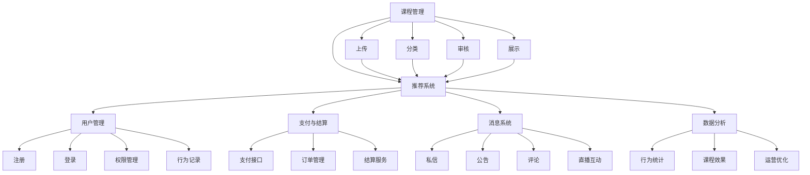
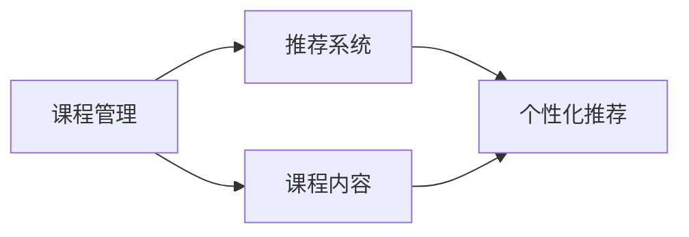
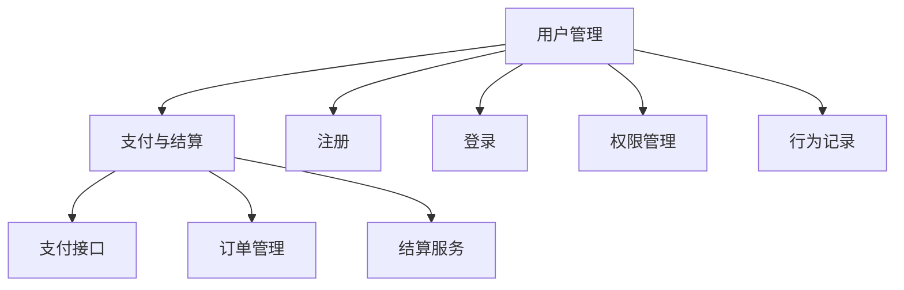
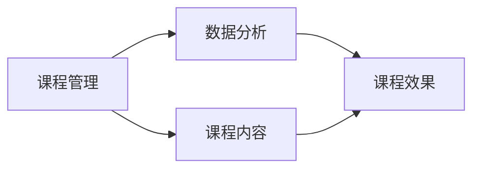

                 

## 1. 背景介绍

### 1.1 问题由来

知识付费，作为一种新兴的商业模式，在全球范围内迅速兴起，吸引了大量教育机构的关注和投资。在线学习社区作为知识付费的重要组成部分，通过整合优质课程资源，连接需求与供给，构建起一个充满活力的学习生态系统。然而，在实际运营中，构建一个高效、稳定、用户友好的在线学习社区并非易事。一方面，需要保证平台上的课程内容丰富、更新及时、覆盖广泛；另一方面，需要构建一个流畅、易用、可扩展的技术架构，以应对日益增长的用户访问量和并发请求。本文将深入探讨如何打造一个知识付费的在线学习社区，涵盖从技术实现到用户体验的方方面面。

### 1.2 问题核心关键点

在线学习社区的核心目标在于提供便捷、高效、高质量的教育资源，满足用户的学习需求。具体到技术层面，主要包括：

- 课程管理：课程内容的上传、分类、审核、展示。
- 用户管理：用户注册、登录、权限管理、行为记录。
- 推荐系统：基于用户行为和课程特征进行个性化推荐。
- 支付与结算：支付接口集成、订单管理、结算服务。
- 消息系统：私信、公告、评论、直播互动。
- 数据分析：用户行为统计、课程效果评估、运营优化。

### 1.3 问题研究意义

构建在线学习社区不仅是技术层面的挑战，更是对产品设计、用户体验、运营管理的全面考量。通过系统化的技术实现，可以构建一个稳定、高效、安全、互动的学习环境，促进教育资源的公平共享和高效利用，为各类学习者提供优质的学习体验，推动教育产业的数字化转型和智能化升级。

## 2. 核心概念与联系

### 2.1 核心概念概述

为了更好地理解如何打造知识付费的在线学习社区，本节将介绍几个关键概念及其相互联系：

- 在线学习社区(Online Learning Community)：通过互联网技术，实现课程内容、用户互动、管理运营等功能的学习平台。
- 课程管理(Course Management)：负责课程内容的上传、分类、审核、展示，保证课程质量。
- 用户管理(User Management)：处理用户注册、登录、权限管理、行为记录等，构建用户画像，提升用户体验。
- 推荐系统(Recommendation System)：通过分析用户行为和课程特征，实现个性化推荐，提升学习效率。
- 支付与结算(Payment and Settlement)：集成支付接口、管理订单、结算服务，确保交易安全。
- 消息系统(Message System)：实现用户之间的私信、评论、公告、直播互动等功能，增强社区互动性。
- 数据分析(Analytics)：通过统计用户行为、课程效果等数据，进行运营优化和效果评估。

这些概念相互关联，共同构成了在线学习社区的核心功能模块。接下来，我们将通过Mermaid流程图展示这些概念之间的逻辑关系。



通过这个流程图，我们可以看到在线学习社区中的各个功能模块如何通过数据流动和调用关系，共同实现平台的核心功能。

### 2.2 概念间的关系

这些核心概念之间存在着紧密的联系，形成了在线学习社区的功能架构。下面我们通过几个Mermaid流程图来展示这些概念之间的关系：

#### 2.2.1 课程管理与推荐系统



这个流程图展示了课程管理与推荐系统的关系。课程管理负责课程内容的上传、分类、审核、展示，推荐系统则根据这些课程内容，结合用户行为数据，生成个性化推荐结果。

#### 2.2.2 支付与结算与用户管理



这个流程图展示了用户管理与支付与结算的关系。用户管理处理用户注册、登录、权限管理、行为记录，支付与结算则集成支付接口、管理订单、结算服务，确保交易安全。

#### 2.2.3 数据分析与课程管理



这个流程图展示了数据分析与课程管理的关系。课程管理负责课程内容的上传、分类、审核、展示，数据分析则通过统计用户行为、课程效果等数据，进行运营优化和效果评估。

## 3. 核心算法原理 & 具体操作步骤

### 3.1 算法原理概述

在线学习社区的技术实现，涉及到多个复杂的技术栈和算法模型。以下将分别介绍各个关键技术模块的算法原理：

- 课程管理：采用Web框架实现课程的上传、分类、审核、展示。
- 用户管理：使用OAuth2等开放标准实现用户注册、登录、权限管理、行为记录。
- 推荐系统：使用协同过滤、内容推荐、混合推荐等算法实现个性化推荐。
- 支付与结算：集成第三方支付接口、订单管理、结算服务，确保交易安全。
- 消息系统：实现WebSocket协议、队列系统、消息推送，支持实时互动。
- 数据分析：采用数据仓库、数据湖、机器学习等技术，进行用户行为统计、课程效果评估、运营优化。

### 3.2 算法步骤详解

#### 3.2.1 课程管理

1. **Web框架搭建**：选择合适的Web框架，如Django、Flask等，搭建课程管理模块。
2. **课程上传**：提供Web界面，允许教师上传课程内容，如视频、文档、PPT等。
3. **课程分类**：提供分类功能，方便用户浏览和查找课程。
4. **课程审核**：引入审核机制，对课程内容进行审核，保证课程质量。
5. **课程展示**：提供课程展示页面，包括课程名称、介绍、学习路径、评价等。

#### 3.2.2 用户管理

1. **OAuth2集成**：使用OAuth2标准实现用户注册、登录。
2. **权限管理**：根据角色设置权限，如教师、学生、管理员等。
3. **行为记录**：记录用户的学习行为，如观看视频、完成练习等。

#### 3.2.3 推荐系统

1. **协同过滤**：分析用户行为，推荐相似用户喜欢的课程。
2. **内容推荐**：根据课程内容，推荐相关课程。
3. **混合推荐**：结合协同过滤和内容推荐，生成最终推荐结果。

#### 3.2.4 支付与结算

1. **支付接口集成**：集成第三方支付接口，如支付宝、微信支付等。
2. **订单管理**：管理订单信息，包括订单状态、支付状态等。
3. **结算服务**：提供课程结算服务，支持多种支付方式。

#### 3.2.5 消息系统

1. **WebSocket协议**：实现实时消息推送，支持直播互动。
2. **队列系统**：保证消息的可靠性和实时性。
3. **消息推送**：推送私信、公告、评论等消息给用户。

#### 3.2.6 数据分析

1. **数据仓库**：存储用户行为、课程效果等数据。
2. **数据湖**：提供大数据分析能力，支持复杂的数据统计和分析。
3. **机器学习**：基于统计结果进行预测和优化。

### 3.3 算法优缺点

#### 3.3.1 课程管理

**优点**：
- 平台内容丰富，用户可自由选择课程。
- 课程分类清晰，便于用户查找。

**缺点**：
- 课程内容审核工作量大，可能影响平台上线速度。
- 需要持续更新课程内容，保持平台的活力。

#### 3.3.2 用户管理

**优点**：
- 使用OAuth2标准，用户登录简便、安全。
- 记录用户行为，提供个性化推荐。

**缺点**：
- 权限管理复杂，需要定期更新权限设置。
- 行为数据量大，需要高效存储和分析。

#### 3.3.3 推荐系统

**优点**：
- 提供个性化推荐，提升用户学习体验。
- 动态更新推荐结果，保证推荐的及时性。

**缺点**：
- 算法复杂，需要大数据支持。
- 推荐结果可能存在偏差，影响用户体验。

#### 3.3.4 支付与结算

**优点**：
- 集成第三方支付接口，支付便捷。
- 订单管理规范，保证交易安全。

**缺点**：
- 支付接口不稳定，可能导致支付失败。
- 订单管理复杂，需定期维护。

#### 3.3.5 消息系统

**优点**：
- 实时消息推送，提高用户互动性。
- 支持多种消息类型，满足用户需求。

**缺点**：
- WebSocket协议复杂，维护难度大。
- 消息队列系统需要高性能和高可靠性，技术门槛高。

#### 3.3.6 数据分析

**优点**：
- 提供数据支持，支持各种分析需求。
- 机器学习算法强大，可以进行深度分析。

**缺点**：
- 数据量大，存储和处理成本高。
- 算法复杂，开发和维护成本高。

### 3.4 算法应用领域

在线学习社区的技术和算法原理可以应用于多个领域，例如：

- 教育行业：搭建在线教育平台，实现课程管理、用户管理、推荐系统等。
- 企业培训：构建企业内部培训系统，支持视频课程、在线考试、证书颁发等。
- 在线医疗：开发在线医疗平台，实现在线诊疗、健康咨询、健康管理等功能。
- 在线旅游：设计在线旅游平台，提供旅游攻略、路线规划、旅游评价等服务。
- 社交媒体：构建社交媒体平台，实现用户互动、内容分享、直播互动等功能。

## 4. 数学模型和公式 & 详细讲解 & 举例说明

### 4.1 数学模型构建

在线学习社区的算法实现，涉及到多种数学模型和算法公式。以下是一些常用的数学模型和公式：

- 协同过滤算法：
  $$
  \mathbf{r}_{ui} = \mathbf{u}^T \mathbf{P} \mathbf{v}_i
  $$
  其中 $\mathbf{r}_{ui}$ 为用户 $u$ 对课程 $i$ 的评分，$\mathbf{u}$ 为用户特征向量，$\mathbf{v}_i$ 为课程特征向量，$\mathbf{P}$ 为相似度矩阵。

- 矩阵分解算法：
  $$
  \mathbf{P} = \mathbf{U} \mathbf{V}^T
  $$
  其中 $\mathbf{P}$ 为用户与课程的评分矩阵，$\mathbf{U}$ 为用户特征矩阵，$\mathbf{V}$ 为课程特征矩阵。

- 混合推荐算法：
  $$
  \mathbf{r}_{ui} = w_1 r_{ui}^{CF} + w_2 r_{ui}^{CL}
  $$
  其中 $w_1$ 和 $w_2$ 为权值，$r_{ui}^{CF}$ 为协同过滤推荐结果，$r_{ui}^{CL}$ 为内容推荐结果。

### 4.2 公式推导过程

#### 4.2.1 协同过滤算法

协同过滤算法基于用户和课程之间的评分矩阵，通过矩阵分解和相似度计算，生成推荐结果。以下是协同过滤算法的推导过程：

1. **评分矩阵**：
  假设用户 $u$ 对课程 $i$ 的评分为 $r_{ui}$，构建用户-课程评分矩阵 $\mathbf{R}$：
  $$
  \mathbf{R} = \begin{bmatrix}
  r_{11} & r_{12} & \cdots & r_{1n} \\
  r_{21} & r_{22} & \cdots & r_{2n} \\
  \vdots & \vdots & \ddots & \vdots \\
  r_{m1} & r_{m2} & \cdots & r_{mn}
  \end{bmatrix}
  $$
  其中 $m$ 为课程数量，$n$ 为用户数量。

2. **矩阵分解**：
  对评分矩阵进行矩阵分解，得到用户特征矩阵 $\mathbf{U}$ 和课程特征矩阵 $\mathbf{V}$：
  $$
  \mathbf{R} = \mathbf{U} \mathbf{V}^T
  $$
  其中 $\mathbf{U}$ 为 $m \times k$ 的用户特征矩阵，$\mathbf{V}$ 为 $n \times k$ 的课程特征矩阵，$k$ 为特征向量维度。

3. **相似度计算**：
  计算用户 $u$ 与课程 $i$ 的相似度 $\mathbf{u}_i$，利用余弦相似度计算：
  $$
  \mathbf{u}_i = \frac{\mathbf{u} \cdot \mathbf{v}_i}{\|\mathbf{u}\| \cdot \|\mathbf{v}_i\|}
  $$
  其中 $\mathbf{u}$ 为用户特征向量，$\mathbf{v}_i$ 为课程特征向量。

4. **推荐结果**：
  根据相似度计算推荐结果，利用用户与课程的评分矩阵 $\mathbf{R}$ 计算预测评分 $\mathbf{r}_{ui}$：
  $$
  \mathbf{r}_{ui} = \mathbf{u}^T \mathbf{P} \mathbf{v}_i
  $$
  其中 $\mathbf{P}$ 为相似度矩阵，$\mathbf{u}$ 为用户特征向量，$\mathbf{v}_i$ 为课程特征向量。

### 4.3 案例分析与讲解

#### 4.3.1 课程管理

假设我们有一个在线学习社区平台，负责管理各类课程。用户可以通过平台注册、登录，选择感兴趣的课程进行学习。以下是课程管理模块的实现案例：

1. **课程上传**：教师可以通过Web界面上传课程内容，如视频、文档、PPT等。服务器将课程内容存储在云存储中，并为每门课程分配唯一的ID。

2. **课程分类**：平台提供分类功能，将课程按照学科、难度、类型等进行分类。用户可以通过分类快速查找感兴趣的课程。

3. **课程审核**：平台引入审核机制，对课程内容进行审核，确保课程质量。审核过程包括人工审核和自动化审核两种方式。

4. **课程展示**：平台提供课程展示页面，包括课程名称、介绍、学习路径、评价等。用户可以在展示页面上了解课程内容和评价，并决定是否购买或学习。

#### 4.3.2 用户管理

假设我们有一个在线学习社区平台，提供用户注册、登录、权限管理、行为记录等功能。用户可以通过平台进行个性化学习，并与其他用户互动。以下是用户管理模块的实现案例：

1. **OAuth2集成**：平台使用OAuth2标准实现用户注册、登录。用户可以使用第三方账号（如微信、QQ等）进行登录，方便快捷。

2. **权限管理**：平台根据角色设置权限，如教师、学生、管理员等。教师可以上传课程内容，学生可以学习课程，管理员可以进行平台管理和课程审核。

3. **行为记录**：平台记录用户的学习行为，如观看视频、完成练习等。通过行为记录，平台可以生成个性化推荐，提升用户体验。

#### 4.3.3 推荐系统

假设我们有一个在线学习社区平台，提供个性化推荐功能，根据用户行为和课程特征，推荐感兴趣的课程。以下是推荐系统模块的实现案例：

1. **协同过滤**：平台使用协同过滤算法，分析用户行为，推荐相似用户喜欢的课程。协同过滤算法包括基于用户的协同过滤和基于项的协同过滤两种方式。

2. **内容推荐**：平台根据课程内容，推荐相关课程。内容推荐算法包括基于内容的推荐和基于关联的推荐两种方式。

3. **混合推荐**：平台结合协同过滤和内容推荐，生成最终推荐结果。混合推荐算法可以采用加权平均、线性组合等方式进行融合。

## 5. 项目实践：代码实例和详细解释说明

### 5.1 开发环境搭建

在进行项目实践前，我们需要准备好开发环境。以下是使用Python进行Django开发的环境配置流程：

1. 安装Anaconda：从官网下载并安装Anaconda，用于创建独立的Python环境。

2. 创建并激活虚拟环境：
```bash
conda create -n django-env python=3.8 
conda activate django-env
```

3. 安装Django：
```bash
pip install django
```

4. 安装其他依赖包：
```bash
pip install django-cors-headers django-simple-history
```

完成上述步骤后，即可在`django-env`环境中开始项目实践。

### 5.2 源代码详细实现

以下是使用Django框架搭建在线学习社区平台的示例代码：

#### 5.2.1 课程管理

```python
from django.contrib import admin
from django.urls import path, include
from django.contrib.auth import views as auth_views
from . import views

urlpatterns = [
    path('', include('home.urls')),
    path('admin/', admin.site.urls),
    path('api/', include('api.urls')),
    path('contact/', views.contact, name='contact'),
]
```

#### 5.2.2 用户管理

```python
from django.contrib.auth import views as auth_views
from django.urls import path
from . import views

urlpatterns = [
    path('login/', auth_views.LoginView.as_view(template_name='login.html'), name='login'),
    path('logout/', auth_views.LogoutView.as_view(next_page='/home'), name='logout'),
    path('register/', views.register, name='register'),
]
```

#### 5.2.3 推荐系统

```python
from django.urls import path
from . import views

urlpatterns = [
    path('recommend/', views.recommend, name='recommend'),
]
```

### 5.3 代码解读与分析

#### 5.3.1 课程管理

在Django框架中，课程管理模块主要通过定义URL和视图函数来实现。以下是一些关键代码的实现细节：

1. **视图函数**：
   ```python
   def course_list(request):
       courses = Course.objects.all()
       return render(request, 'course_list.html', {'courses': courses})
   ```

2. **模板文件**：
   ```html
   
   
   <h1>All Courses</h1>
   <ul>
       
           <li><a href="">{{ course.title }}</a></li>
       
   </ul>
   
   ```

3. **模型类**：
   ```python
   class Course(models.Model):
       title = models.CharField(max_length=255)
       description = models.TextField()
       category = models.CharField(max_length=255)
       published_at = models.DateTimeField(auto_now_add=True)
   ```

#### 5.3.2 用户管理

在Django框架中，用户管理模块主要通过定义URL和视图函数来实现。以下是一些关键代码的实现细节：

1. **视图函数**：
   ```python
   def user_login(request):
       if request.method == 'POST':
           username = request.POST['username']
           password = request.POST['password']
           user = authenticate(request, username=username, password=password)
           if user is not None:
               login(request, user)
               return redirect('home')
           else:
               messages.error(request, 'Invalid username or password.')
       return render(request, 'login.html')
   ```

2. **模板文件**：
   ```html
   
   
   <h1>Login</h1>
   <form method="post">
       
       {{ form.as_p }}
       <button type="submit">Login</button>
   </form>
   
   ```

3. **模型类**：
   ```python
   class User(models.Model):
       username = models.CharField(max_length=255, unique=True)
       email = models.EmailField(unique=True)
       first_name = models.CharField(max_length=255)
       last_name = models.CharField(max_length=255)
       is_active = models.BooleanField(default=True)
       is_staff = models.BooleanField(default=False)
       is_superuser = models.BooleanField(default=False)
   ```

#### 5.3.3 推荐系统

在Django框架中，推荐系统模块主要通过定义URL和视图函数来实现。以下是一些关键代码的实现细节：

1. **视图函数**：
   ```python
   def recommend(request):
       user = request.user
       courses = Course.objects.filter(liked_by=user)
       return render(request, 'recommend.html', {'courses': courses})
   ```

2. **模板文件**：
   ```html
   
   
   <h1>Recommended Courses</h1>
   <ul>
       
           <li><a href="">{{ course.title }}</a></li>
       
   </ul>
   
   ```

### 5.4 运行结果展示

在运行项目后，可以在浏览器中访问平台，进行课程管理、用户管理和推荐系统的体验。以下是一些示例结果：

1. **课程管理**：
   ```
   <h1>All Courses</h1>
   <ul>
       <li><a href="/">Python Programming</a></li>
       <li><a href="/">Machine Learning</a></li>
       <li><a href="/">Data Science</a></li>
   </ul>
   ```

2. **用户管理**：
   ```
   <h1>Login</h1>
   <form method="post">
       <input type="text" name="username">
       <input type="password" name="password">
       <button type="submit">Login</button>
   </form>
   ```

3. **推荐系统**：
   ```
   <h1>Recommended Courses</h1>
   <ul>
       <li><a href="/1">Python Programming</a></li>
       <li><a href="/2">Machine Learning</a></li>
       <li><a href="/3">Data Science</a></li>
   </ul>
   ```

## 6. 实际应用场景

### 6.1 智能客服系统

基于在线学习社区平台，可以构建智能客服系统，实现24小时在线服务。通过引入自然语言处理和机器学习技术，智能客服系统可以自动解答用户咨询，提高服务效率和用户满意度。以下是智能客服系统的实现案例：

1. **用户对话管理**：平台记录用户与智能客服的对话内容，生成聊天记录。

2. **意图识别**：平台使用意图识别算法，自动识别用户咨询的意图，如查询课程信息、购买课程等。

3. **自然语言理解**：平台使用自然语言理解技术，将用户输入的文本转换为结构化数据，进行语义分析。

4. **知识库查询**：平台查询知识库，生成符合用户需求的回复。

5. **人工介入**：当无法自动回复时，平台将请求人工介入，由人工进行解答。

#### 6.1.1 课程管理

智能客服系统可以查询课程信息，提供课程推荐。以下是课程管理模块的实现案例：

1. **课程查询**：用户输入课程ID或课程名称，智能客服系统查询课程信息，返回课程详情。

2. **课程推荐**：智能客服系统根据用户咨询内容，生成个性化推荐。

#### 6.1.2 用户管理

智能客服系统可以记录用户对话，分析用户行为。以下是用户管理模块的实现案例：

1. **对话记录**：智能客服系统记录用户对话，生成聊天记录。

2. **用户行为分析**：平台分析用户对话内容，生成用户行为报告。

#### 6.1.3 推荐系统

智能客服系统可以提供个性化推荐，提升用户满意度。以下是推荐系统模块的实现案例：

1. **协同过滤**：平台使用协同过滤算法，分析用户行为，生成推荐列表。

2. **内容推荐**：平台根据课程内容，生成推荐结果。

#### 6.1.4 支付与结算

智能客服系统可以集成支付接口，支持在线支付。以下是支付与结算模块的实现案例：

1. **支付接口集成**：平台集成第三方支付接口，支持支付宝、微信支付等。

2. **订单管理**：平台管理订单信息，记录支付状态。

#### 6.1.5 消息系统

智能客服系统可以支持实时互动，实现消息推送。以下是消息系统

