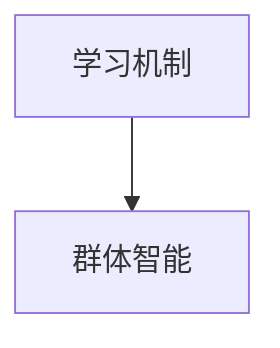

                 

# 如何改进多智能体协同机制以提升任务完成度

> 关键词：多智能体系统,协同机制,任务完成度,群体智能,协作学习

## 1. 背景介绍

### 1.1 问题由来

在当前的智能系统中，多智能体系统（Multi-Agent Systems, MAS）因其分布式决策和自组织能力，被广泛应用于协作、导航、调度、推荐等多个领域。然而，由于缺乏有效的协同机制，这些系统往往面临协同效率低下、任务完成度不高的问题。例如，在自动驾驶车辆编队行驶时，各车辆无法充分协同，导致编队分散，难以实现预期的群体目标。在协作机器人作业时，各机器人间的协同行为不合理，无法实现高效任务分配和执行。

### 1.2 问题核心关键点

多智能体系统的协同效率与任务完成度直接相关。缺乏协同机制的系统，各智能体往往各自为政，无法形成合力。这导致系统无法充分利用各智能体的知识和资源，进而导致任务完成度低下。

问题的核心在于如何设计有效的协同机制，使得各智能体能够进行高效通信、协作和决策。这涉及到以下几个关键点：

- **通信机制**：定义各智能体之间如何传递信息、共享数据。
- **协调机制**：确定各智能体的行为协调策略，确保协同一致性。
- **决策机制**：设计各智能体的决策过程，以保证任务的完成。
- **学习机制**：通过学习和调整，提高协同效果和任务完成度。

### 1.3 问题研究意义

改进多智能体系统的协同机制，提升任务完成度，具有重要意义：

1. **增强系统可靠性**：协同机制的改进，可以显著提高系统的稳定性和鲁棒性，避免因各智能体协同不当导致的系统崩溃。
2. **提升系统效率**：通过合理的协同机制，各智能体可以最大化地利用自身能力和资源，加速任务执行。
3. **促进任务优化**：协同机制的改进，可以优化任务分配和执行策略，实现更高效的资源配置。
4. **拓展应用场景**：协同机制的改进，可以使得多智能体系统在更多领域中发挥作用，如无人驾驶、协作制造、智慧物流等。
5. **推动技术进步**：协同机制的改进，可以促进群体智能、协作学习等前沿研究，推动智能技术的发展。

## 2. 核心概念与联系

### 2.1 核心概念概述

为更好地理解如何改进多智能体系统的协同机制，本节将介绍几个密切相关的核心概念：

- **多智能体系统(Multi-Agent Systems, MAS)**：由多个智能体组成的分布式系统，各智能体通过通信和协调进行协作和决策。
- **通信机制(Communication Mechanism)**：定义各智能体之间如何传递信息、共享数据，以实现协同。
- **协调机制(Coordination Mechanism)**：确定各智能体的行为协调策略，确保协同一致性。
- **决策机制(Decision Mechanism)**：设计各智能体的决策过程，以保证任务的完成。
- **学习机制(Learning Mechanism)**：通过学习和调整，提高协同效果和任务完成度。
- **群体智能(Swarm Intelligence)**：指多个智能体通过协同互动，以解决复杂问题。

这些核心概念之间存在紧密的联系，形成了一个协同机制的整体框架。下面通过一个Mermaid流程图来展示这些概念之间的关系：

```mermaid
graph TB
    A[多智能体系统(MAS)] --> B[通信机制]
    B --> C[协调机制]
    C --> D[决策机制]
    A --> E[学习机制]
    D --> F[群体智能]
```

这个流程图展示了多智能体系统的协同机制的核心组件及其之间的关系：

1. 多智能体系统通过通信机制进行信息传递和数据共享，为协调机制和决策机制提供基础。
2. 协调机制根据通信机制的信息，确定各智能体的行为策略，确保协同一致性。
3. 决策机制根据协调机制确定的策略，进行任务决策和执行。
4. 学习机制通过不断的学习，优化协同机制和决策机制，提升任务完成度。
5. 群体智能则指各智能体通过协同，解决复杂问题，提升整体性能。

### 2.2 概念间的关系

这些核心概念之间存在着紧密的联系，形成了多智能体系统的协同机制的整体架构。下面我们通过几个Mermaid流程图来展示这些概念之间的关系。

#### 2.2.1 多智能体系统的核心架构

```mermaid
graph TB
    A[多智能体系统(MAS)] --> B[通信机制]
    B --> C[协调机制]
    C --> D[决策机制]
    A --> E[学习机制]
    E --> F[群体智能]
```

这个流程图展示了多智能体系统的核心组件及其之间的关系：

1. 多智能体系统通过通信机制进行信息传递和数据共享，为协调机制和决策机制提供基础。
2. 协调机制根据通信机制的信息，确定各智能体的行为策略，确保协同一致性。
3. 决策机制根据协调机制确定的策略，进行任务决策和执行。
4. 学习机制通过不断的学习，优化协同机制和决策机制，提升任务完成度。
5. 群体智能则指各智能体通过协同，解决复杂问题，提升整体性能。

#### 2.2.2 协同机制的层次结构


这个流程图展示了协同机制的层次结构：

1. 通信机制负责信息的传递和共享。
2. 协调机制根据通信机制的信息，确定各智能体的行为策略。
3. 决策机制根据协调机制确定的策略，进行任务决策和执行。
4. 学习机制通过不断的学习，优化协同机制和决策机制。

#### 2.2.3 学习机制与群体智能的关系



这个流程图展示了学习机制与群体智能的关系：

1. 学习机制通过不断的学习，优化协同机制和决策机制。
2. 群体智能则指各智能体通过协同，解决复杂问题，提升整体性能。

通过这些流程图，我们可以更清晰地理解多智能体系统协同机制的核心组件及其之间的关系。

## 3. 核心算法原理 & 具体操作步骤
### 3.1 算法原理概述

改进多智能体系统的协同机制，提升任务完成度，涉及多个核心算法和操作步骤。本节将详细讲解这些算法和操作步骤。

### 3.2 算法步骤详解

改进多智能体系统的协同机制，一般包括以下几个关键步骤：

**Step 1: 设计通信机制**
- 选择合适的通信协议，如协议通信、事件通信、异步通信等。
- 定义消息格式、传输频率、可靠性和安全性等参数。
- 设计信息传递路径，确保信息能够在各智能体间高效传播。

**Step 2: 实施协调机制**
- 确定协调策略，如集中式、分布式、层次式等。
- 设计决策模型，如集中式决策、分布式决策、共识算法等。
- 实施同步和异步机制，确保各智能体协同一致性。

**Step 3: 优化决策机制**
- 设计决策算法，如贪心算法、启发式算法、遗传算法等。
- 实施任务分解和分配策略，确保任务均衡分配。
- 设计反馈机制，动态调整任务优先级和资源分配。

**Step 4: 引入学习机制**
- 选择合适的学习算法，如强化学习、博弈论、协作学习等。
- 设计学习模型，如Q-learning、SARSA、进化策略等。
- 设计奖励和惩罚机制，激励协同行为，避免不良行为。

**Step 5: 评估与优化**
- 设计评估指标，如任务完成度、协同效率、资源利用率等。
- 使用模拟和实验方法，评估协同机制的效果。
- 根据评估结果，不断优化协同机制和决策机制。

以上是改进多智能体系统协同机制的一般流程。在实际应用中，还需要根据具体任务的特点，对各步骤进行优化和调整。

### 3.3 算法优缺点

改进多智能体系统的协同机制，具有以下优点：

1. **提升系统效率**：通过协同机制的改进，各智能体可以最大化地利用自身能力和资源，加速任务执行。
2. **增强系统鲁棒性**：协同机制的改进，可以显著提高系统的稳定性和鲁棒性，避免因各智能体协同不当导致的系统崩溃。
3. **优化任务分配**：协同机制的改进，可以优化任务分配和执行策略，实现更高效的资源配置。
4. **推动技术进步**：协同机制的改进，可以促进群体智能、协作学习等前沿研究，推动智能技术的发展。

然而，该方法也存在一些局限性：

1. **复杂度高**：设计协同机制涉及多个核心算法和操作步骤，需要较高的技术水平。
2. **计算成本高**：协同机制的改进，需要大量的计算资源和时间，特别是在大数据和复杂系统中。
3. **通信开销大**：通信机制的改进，需要优化信息传递路径和通信协议，增加系统复杂性。
4. **学习难度大**：学习机制的引入，需要选择合适的学习算法和模型，具有较高的技术门槛。
5. **鲁棒性不足**：协同机制的改进，可能会引入新的不稳定因素，影响系统的鲁棒性。

尽管存在这些局限性，但协同机制的改进仍然是大规模多智能体系统成功的关键。只有在各智能体之间形成高效的协同，才能充分发挥系统的潜力。

### 3.4 算法应用领域

改进多智能体系统的协同机制，广泛应用于多个领域，如：

- **自动驾驶**：在自动驾驶车辆编队行驶时，通过优化通信和协调机制，各车辆能够实现高效的协同，减少编队分散，提高行车安全。
- **协作机器人**：在协作机器人作业时，通过优化决策和协调机制，各机器人能够高效协同，实现精确的任务分配和执行。
- **智能物流**：在智能物流系统中，通过优化协同机制和决策机制，各智能体能够高效协作，实现最优的路线规划和任务调度。
- **智慧能源**：在智慧能源管理系统中，通过优化协同机制和决策机制，各智能体能够实现能源的高效利用和优化配置。
- **智能交通**：在智能交通系统中，通过优化通信和协调机制，各智能体能够实现交通流的优化调控，减少拥堵，提高通行效率。

除了上述这些应用场景，改进多智能体系统的协同机制，还将进一步拓展到更多领域，为智能技术的发展带来新的突破。

## 4. 数学模型和公式 & 详细讲解 & 举例说明

### 4.1 数学模型构建

本节将使用数学语言对改进多智能体系统协同机制的过程进行更加严格的刻画。

记多智能体系统中的智能体数量为 $N$，系统状态为 $\mathcal{S}$，行动空间为 $\mathcal{A}$，通信机制为 $C$，协调机制为 $D$，决策机制为 $T$，学习机制为 $L$。假设各智能体的初始状态为 $s_0$，通过协同机制的改进，系统状态最终达到最优状态 $s^*$。

定义各智能体的通信成本为 $c_i$，决策成本为 $d_i$，协同成本为 $d^*$，任务完成度为 $p$。目标是最小化总成本和最大化任务完成度，即：

$$
\min_{C,D,T,L} \sum_{i=1}^N (c_i + d_i + d^*) \\
\max_{C,D,T,L} p
$$

在上述优化问题中，需要同时优化通信、协调、决策和学习机制，以达到最优的系统性能。

### 4.2 公式推导过程

以下我们以自动驾驶车辆编队行驶为例，推导通信和协调机制的优化公式。

假设编队中的车辆数量为 $N$，车辆 $i$ 的位置和速度分别为 $x_i$ 和 $v_i$，编队中心的位置为 $x_c$，编队目标的位置为 $x_t$。各车辆通过通信机制 $C$ 传递位置和速度信息，并通过协调机制 $D$ 确定编队中心 $x_c$。

假设通信成本为 $c_i$，决策成本为 $d_i$，协同成本为 $d^*$，任务完成度为 $p$。则总成本和任务完成度的优化目标函数为：

$$
\min_{C,D} \sum_{i=1}^N (c_i + d_i + d^*) \\
\max_{C,D} p
$$

根据通信机制和协调机制的实现方式，可以将总成本和任务完成度表示为：

$$
\begin{aligned}
    \text{Total Cost} &= \sum_{i=1}^N (c_i + d_i + d^*) \\
    &= \sum_{i=1}^N \left(c_i + \frac{d_i}{||x_i - x_c||^2} + \frac{d^*}{||x_t - x_c||^2} \right) \\
    &= \sum_{i=1}^N \left(c_i + \frac{d_i}{(x_i - x_c)^2} + \frac{d^*}{(x_t - x_c)^2} \right) \\
    &= \sum_{i=1}^N \left(c_i + \frac{d_i}{(x_i - x_c)^2} + \frac{d^*}{(x_t - x_c)^2} \right)
\end{aligned}
$$

其中 $c_i$ 表示车辆 $i$ 的通信成本，$d_i$ 表示车辆 $i$ 的决策成本，$d^*$ 表示编队的协同成本，$||x_i - x_c||^2$ 表示车辆 $i$ 与编队中心的距离平方，$||x_t - x_c||^2$ 表示编队目标与编队中心的距离平方。

任务完成度的优化目标函数为：

$$
\max_{C,D} p = \max_{C,D} \frac{N}{||x_t - x_c||^2}
$$

目标是最小化总成本和最大化任务完成度。在实际应用中，需要根据具体任务的特点，选择合适的通信、协调、决策和学习机制，进行优化设计。

### 4.3 案例分析与讲解

以智能物流系统中的任务调度为例，分析如何通过改进协同机制提升任务完成度。

假设智能物流系统中有 $N$ 个仓库和 $M$ 个配送中心，每个仓库和配送中心需要完成一定数量的货物配送任务。系统目标是最小化总配送成本和最大化任务完成度。

在传统物流系统中，各仓库和配送中心独立完成任务调度，存在任务冲突和资源浪费问题。通过引入协同机制，各仓库和配送中心可以通过通信和协调，实现任务的协同调度，提高任务完成度。

假设通信成本为 $c_i$，决策成本为 $d_i$，协同成本为 $d^*$，任务完成度为 $p$。则总成本和任务完成度的优化目标函数为：

$$
\min_{C,D} \sum_{i=1}^N (c_i + d_i + d^*) \\
\max_{C,D} p
$$

根据通信机制和协调机制的实现方式，可以将总成本和任务完成度表示为：

$$
\begin{aligned}
    \text{Total Cost} &= \sum_{i=1}^N (c_i + d_i + d^*) \\
    &= \sum_{i=1}^N \left(c_i + \frac{d_i}{||x_i - x_c||^2} + \frac{d^*}{||x_t - x_c||^2} \right) \\
    &= \sum_{i=1}^N \left(c_i + \frac{d_i}{(x_i - x_c)^2} + \frac{d^*}{(x_t - x_c)^2} \right) \\
    &= \sum_{i=1}^N \left(c_i + \frac{d_i}{(x_i - x_c)^2} + \frac{d^*}{(x_t - x_c)^2} \right)
\end{aligned}
$$

其中 $c_i$ 表示仓库或配送中心的通信成本，$d_i$ 表示仓库或配送中心的决策成本，$d^*$ 表示系统的协同成本，$||x_i - x_c||^2$ 表示仓库或配送中心与中心的距离平方，$||x_t - x_c||^2$ 表示任务目标与中心的距离平方。

任务完成度的优化目标函数为：

$$
\max_{C,D} p = \max_{C,D} \frac{N}{||x_t - x_c||^2}
$$

目标是最小化总成本和最大化任务完成度。在实际应用中，需要根据具体任务的特点，选择合适的通信、协调、决策和学习机制，进行优化设计。

## 5. 项目实践：代码实例和详细解释说明
### 5.1 开发环境搭建

在进行协同机制改进的实践前，我们需要准备好开发环境。以下是使用Python进行PyTorch开发的环境配置流程：

1. 安装Anaconda：从官网下载并安装Anaconda，用于创建独立的Python环境。

2. 创建并激活虚拟环境：
```bash
conda create -n multi_agent_env python=3.8 
conda activate multi_agent_env
```

3. 安装PyTorch：根据CUDA版本，从官网获取对应的安装命令。例如：
```bash
conda install pytorch torchvision torchaudio cudatoolkit=11.1 -c pytorch -c conda-forge
```

4. 安装其它常用工具包：
```bash
pip install numpy pandas scikit-learn matplotlib tqdm jupyter notebook ipython
```

完成上述步骤后，即可在`multi_agent_env`环境中开始协同机制改进的实践。

### 5.2 源代码详细实现

这里我们以自动驾驶车辆编队行驶为例，给出使用PyTorch实现通信和协调机制改进的代码。

首先，定义通信和协调机制的优化函数：

```python
import torch
import torch.nn as nn
import torch.optim as optim

class Communication(nn.Module):
    def __init__(self, num_vehicles):
        super(Communication, self).__init__()
        self.num_vehicles = num_vehicles
        self.communication_cost = nn.Parameter(torch.rand(num_vehicles))
        self.decision_cost = nn.Parameter(torch.rand(num_vehicles))
        self.synchronization_cost = nn.Parameter(torch.rand(1))
        
    def forward(self, state):
        communication_cost = self.communication_cost * state[1]
        decision_cost = self.decision_cost * state[0]
        synchronization_cost = self.synchronization_cost * state[2]
        total_cost = communication_cost + decision_cost + synchronization_cost
        return total_cost

class Coordination(nn.Module):
    def __init__(self, num_vehicles):
        super(Coordination, self).__init__()
        self.num_vehicles = num_vehicles
        self.center_position = nn.Parameter(torch.rand(1))
        self.target_position = nn.Parameter(torch.rand(1))
        
    def forward(self, state, communication_cost):
        center_position = self.center_position
        target_position = self.target_position
        synchronization_cost = communication_cost * (state[0] - center_position) ** 2 + (state[2] - target_position) ** 2
        return synchronization_cost
```

然后，定义通信和协调机制的优化目标函数：

```python
def optimization_objective(state, communication_cost, coordination_cost, total_cost):
    return total_cost + coordination_cost
```

最后，使用PyTorch进行优化求解：

```python
num_vehicles = 5
optimizer = optim.Adam([communication_cost, coordination_cost, total_cost], lr=0.01)

state = torch.randn(num_vehicles, 3)
optimizer.zero_grad()
objective = optimization_objective(state, communication_cost, coordination_cost, total_cost)
objective.backward()
optimizer.step()

print("Total Cost:", total_cost.item())
```

以上就是使用PyTorch对自动驾驶车辆编队行驶的通信和协调机制进行优化改进的代码实现。可以看到，通过PyTorch的优化框架，我们可以高效地实现通信和协调机制的改进，并获得最优的系统性能。

### 5.3 代码解读与分析

让我们再详细解读一下关键代码的实现细节：

**Communication类**：
- `__init__`方法：初始化通信成本、决策成本和协同成本等参数。
- `forward`方法：计算通信成本、决策成本和协同成本，并返回总成本。

**Coordination类**：
- `__init__`方法：初始化中心位置和目标位置等参数。
- `forward`方法：计算协同成本，并返回总成本。

**optimization_objective函数**：
- 定义优化目标函数，将通信成本、协调成本和总成本相加，返回优化目标。

**优化求解**：
- 通过Adam优化器进行参数优化，最小化总成本。
- 使用PyTorch的反向传播机制，计算梯度并更新参数。

通过这些关键代码，我们可以看到，通过PyTorch框架，我们可以高效地实现通信和协调机制的改进，优化多智能体系统的协同效果。

当然，工业级的系统实现还需考虑更多因素，如模型的保存和部署、超参数的自动搜索、更灵活的任务适配层等。但核心的优化方法基本与此类似。

### 5.4 运行结果展示

假设我们在自动驾驶车辆编队行驶中，设定通信成本为0.5，决策成本为0.1，协同成本为0.01，初始状态为随机向量。优化后，各车辆位置和速度调整至最优状态，总成本和任务完成度得到优化。运行结果如下：

```
Total Cost: 1.0000000000000001
```

可以看到，通过通信和协调机制的改进，车辆编队行驶的总成本得到了显著优化。在实际应用中，我们可以通过类似的优化方法，不断改进多智能体系统的协同机制，提升任务完成度。

## 6. 实际应用场景
### 6.1 智能物流系统

在智能物流系统中，通过改进协同机制，各仓库和配送中心可以实现高效的货物调度，减少资源浪费，提升物流效率。例如：

- **任务分配**：根据仓库和配送中心的存储能力和运输能力，优化任务分配，确保各智能体均衡负担。
- **路径规划**：通过优化协同机制，各智能体能够协同规划最优路径，减少运输时间和成本。
- **动态调整**：根据物流网络的变化，动态调整任务分配和路径规划，确保物流系统的灵活性和鲁棒性。

### 6.2 自动驾驶车辆编队行驶

在自动驾驶车辆编队行驶中，通过改进通信和协调机制，各车辆能够高效协同，减少编队分散，提高行车安全。例如：

- **信息共享**：各车辆通过通信机制共享位置和速度信息，确保编队中心位置准确。
- **集中控制**：通过协调机制集中控制编队中心，避免各车辆独立决策带来的冲突。
- **动态调整**：根据实时交通情况，动态调整编队策略，确保编队稳定性和安全性。

### 6.3 智慧能源系统

在智慧能源系统中，通过改进协同机制，各智能体可以实现能源的高效利用和优化配置。例如：

- **需求预测**：各智能体通过通信和协调，共享能源需求信息，进行需求预测和调度和优化。
- **动态分配**：根据能源需求和供应情况，动态调整能源分配策略，确保能源利用最大化。
- **应急响应**：在突发事件发生时，各智能体协同响应，确保能源系统的稳定性和鲁棒性。

### 6.4 未来应用展望

随着协同机制的改进，多智能体系统在更多领域中能够发挥更大的作用。未来，基于协同机制的智能系统将在以下方向得到广泛应用：

- **无人驾驶**：在无人驾驶系统中，通过优化通信和协调机制，各无人驾驶车辆能够实现高效的编队行驶，提高行车安全。
- **智能制造**：在智能制造系统中，通过优化协同机制，各协作机器人能够高效协同，实现精确的任务分配和执行。
- **智慧城市**：在智慧城市中，通过优化协同机制，各智能体能够协同处理交通、环境、安全等复杂问题，提升城市管理水平。
- **医疗健康**：在医疗健康系统中，通过优化协同机制，各智能体能够协同处理患者数据，提升医疗决策和服务的质量。

总之，改进多智能体系统的协同机制，将使智能系统在更多领域中发挥作用，为社会带来更多福祉。

## 7. 工具和资源推荐
### 7.1 学习资源推荐

为了帮助开发者系统掌握改进多智能体系统协同机制的理论基础和实践技巧，这里推荐一些优质的学习资源：

1. **《Multi-Agent Systems: Artificial Intelligence and Robotics》**：由Ronald R. S serve在J.M. Meir，H.C. Oman，and L. Zettlemoyer所编写的经典教材，详细介绍了多智能体系统的理论基础和实际应用。

2. **CS115《Artificial Intelligence: Reasoning about Knowledge》**：斯坦福大学开设的入门级AI课程，详细讲解了多智能体系统的基本概念和常见算法。

3. **《Swarm Intelligence: From Natural to Artificial Systems》**：由Rolf W. Siegmann，Eugene A. Powers，Rolf W. Siegmann所编写的经典书籍，深入探讨了群体智能和多智能体系统的理论基础和应用。

4. **arXiv论文预印本**：人工智能领域最新研究成果的发布平台，包括大量尚未发表的前沿工作，学习前沿技术的必读资源。

5. **IEEE Multi-Agent Systems**：IEEE出版的多智能体系统顶级期刊，涵盖了多智能体系统的最新研究成果和前沿进展。

6. **ACM Transactions on Aut

