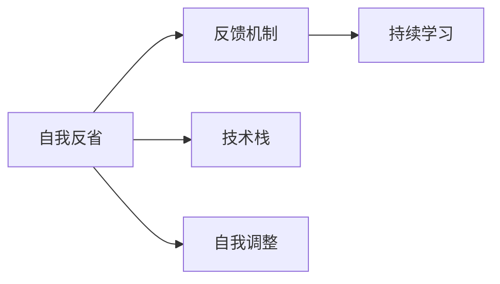

                 

# 如何进行自我反省：如何不断提升自己和完善自我？

## 1. 背景介绍

### 1.1 问题由来
在信息化时代，技术不断革新，人工智能的快速发展给社会生活带来了巨大的变化。在这个快速变化的时代，个人如何不断提升自我，适应新环境，满足新需求，已成为我们每个人面临的重要课题。

技术的发展不仅推动了社会的进步，也给我们带来了全新的挑战。在技术的前沿领域，如人工智能、大数据、区块链等，持续学习与自我反省显得尤为重要。正如Susan McKinney所言：“在快速变化的环境中，不断学习、自我反省与适应变化的能力，是实现自我提升的必备技能。”

### 1.2 问题核心关键点
自我反省是个人成长的重要环节，它涉及到自我评估、自我调整、自我提升等方面。正确的自我反省能够帮助我们认识自我、提升自我，实现自我超越。

在人工智能领域，自我反省同样重要。它涉及到对技术原理的理解、对新知识的吸收、对现有技术的评估与改进。进行自我反省可以确保技术理解的深度与广度，避免出现技术盲点，促进技术的不断进步。

### 1.3 问题研究意义
自我反省在个人成长与技术进步中扮演着至关重要的角色。

1. **个人成长**：自我反省使我们能够及时了解自身不足，找到改进方向，从而在职业生涯中不断提升。
2. **技术进步**：自我反省使得技术团队能够及时发现并解决技术问题，提升技术栈的深度与广度。
3. **适应变化**：自我反省使我们能够适应快速变化的技术环境，把握技术发展趋势，避免落伍。

## 2. 核心概念与联系

### 2.1 核心概念概述

为了更好地理解自我反省，本节将介绍几个密切相关的核心概念：

- **自我反省（Self-Reflection）**：个人对自身行为、思想、情感等方面的持续评估与反思，以发现自身的优势和不足，寻找改进与提升的路径。
- **持续学习（Continuous Learning）**：终身学习，不断追求新知识与技能，适应环境变化。
- **反馈机制（Feedback Mechanism）**：通过接收他人的反馈，理解自身的不足，找到改进方向。
- **自我调整（Self-Adjustment）**：根据反省与反馈结果，调整自身的行为与思维模式。
- **技术栈（Technical Stack）**：个人或团队掌握的各种技术工具、框架与语言的总和。

这些核心概念之间存在着紧密的联系，构成了自我反省的整体框架。通过理解这些概念，我们可以更好地把握自我反省的本质与步骤。

### 2.2 概念间的关系

这些核心概念之间的关系可以通过以下Mermaid流程图来展示：



这个流程图展示了大语言模型微调过程中各个核心概念的关系：

1. 自我反省通过接收反馈机制，了解自身不足。
2. 通过持续学习，弥补自身不足。
3. 通过技术栈的调整，提升自我能力。
4. 通过自我调整，优化自身行为与思维模式。

这些概念共同构成了自我反省的过程，帮助我们不断提升自己与完善自我。

## 3. 核心算法原理 & 具体操作步骤
### 3.1 算法原理概述

自我反省本质上是一种持续的自我评估与改进过程。其核心原理是通过对自身行为、思想、情感等方面的评估与反思，找到提升路径。这一过程可以分解为以下几个步骤：

1. **目标设定**：明确反省的目的，如技术提升、职业发展等。
2. **自我评估**：评估自身的行为、知识与技能。
3. **反馈获取**：获取外界的反馈，了解自身的不足。
4. **改进方案制定**：制定具体的改进方案。
5. **执行与调整**：根据方案执行，并根据反馈调整方案。
6. **持续改进**：循环执行以上步骤，不断提升自我。

### 3.2 算法步骤详解

自我反省的具体操作步骤如下：

**Step 1: 目标设定**

明确反省的目的，如提升某项技术技能、调整工作策略等。这一步骤需要具体而明确的目标，以便后续评估与改进有针对性地进行。

**Step 2: 自我评估**

对自身进行全面的评估，包括技术能力、工作表现、团队协作能力等。这一步骤可以使用各种评估工具，如SWOT分析、360度反馈等。

**Step 3: 反馈获取**

从同事、上级、客户等方面获取反馈，了解自身的不足与优点。可以通过问卷调查、一对一交流等方式获取反馈。

**Step 4: 改进方案制定**

根据自我评估与反馈结果，制定具体的改进方案。例如，如果是技术能力不足，可以参加相关的培训、阅读相关书籍等。如果是团队协作能力不足，可以参与更多的团队活动，提升沟通与协作技能。

**Step 5: 执行与调整**

根据改进方案，具体执行。在执行过程中，需要不断地监测效果，并根据反馈结果调整方案。这一步骤需要灵活应变，根据实际情况进行调整。

**Step 6: 持续改进**

循环执行以上步骤，不断提升自己的能力与水平。自我反省是一个持续的过程，需要不断循环，才能实现持续提升。

### 3.3 算法优缺点

自我反省具有以下优点：

1. **提高自我认知**：通过反省，我们可以更清楚地了解自身的优势与不足，明确改进方向。
2. **提升自我能力**：通过反省与改进，我们的技能与知识水平得到提升，工作表现也会随之提升。
3. **增强自我调整能力**：通过反复执行反省与改进步骤，我们的自我调整能力也会得到提升，更具灵活性与应变能力。

同时，自我反省也存在一些缺点：

1. **主观性较强**：反省结果受个人主观感受影响较大，可能存在偏差。
2. **反馈获取难度大**：获取反馈需要一定的时间和精力，特别是外部反馈。
3. **执行难度高**：制定与执行改进方案需要一定的执行力度，可能遇到各种困难。
4. **反馈机制不完善**：如果反馈机制不完善，反馈结果可能不准确，影响反省效果。

### 3.4 算法应用领域

自我反省不仅仅适用于个人成长，在技术团队的管理与协作中同样具有重要意义。具体应用领域包括：

1. **技术栈优化**：通过自我反省，团队可以评估自身技术栈的深度与广度，发现不足，进行优化。
2. **项目评估**：项目结束后，通过反省，评估项目成果与不足之处，为后续项目提供参考。
3. **团队建设**：通过反省，团队可以了解自身的不足与优点，进行针对性的团队建设与协作优化。
4. **职业规划**：通过自我反省，明确职业发展方向，制定具体的职业规划。

## 4. 数学模型和公式 & 详细讲解  
### 4.1 数学模型构建

自我反省的过程可以通过数学模型来描述。设个人在某一方面的能力为 $C$，其对应的目标能力为 $C_{target}$。我们定义 $E(C)$ 为个人在某一方面的评估结果，$F_{external}$ 为外界反馈结果，$\alpha$ 为反省系数，表示反省对个人能力提升的影响程度。则反省后的能力 $C'$ 可以表示为：

$$
C' = C + \alpha (E(C) - C) + \alpha (F_{external} - E(C))
$$

其中 $E(C)$ 与 $F_{external}$ 分别为自我评估与外部反馈的结果，$\alpha$ 为反省系数。

### 4.2 公式推导过程

以下是公式的具体推导过程：

1. **初始能力与目标能力**：设个人在某一方面的初始能力为 $C$，目标能力为 $C_{target}$。
2. **评估结果与反馈结果**：设自我评估结果为 $E(C)$，外部反馈结果为 $F_{external}$。
3. **反省后能力**：根据反省公式，计算反省后的能力 $C'$。

推导过程如下：

$$
C' = C + \alpha (E(C) - C) + \alpha (F_{external} - E(C))
$$

化简得：

$$
C' = (1 + \alpha)C + \alpha F_{external} - \alpha E(C)
$$

此公式展示了反省过程的核心原理：

- 初始能力 $C$ 为基础，反省后的能力 $C'$ 为初始能力加上反省后的改进量。
- 反省后的改进量为 $\alpha$ 乘以（自我评估结果与目标能力之差，加上外部反馈结果与目标能力之差）。
- $\alpha$ 为反省系数，表示反省对个人能力提升的影响程度。

### 4.3 案例分析与讲解

假设我们评估一位开发者在编程能力方面的能力为 $C=7$，目标能力为 $C_{target}=9$。假设自我评估结果为 $E(C)=7.5$，外部反馈结果为 $F_{external}=8.5$，反省系数为 $\alpha=0.5$。则反省后的能力 $C'$ 可以计算如下：

$$
C' = (1 + 0.5) \times 7 + 0.5 \times (7.5 - 7) + 0.5 \times (8.5 - 7.5)
$$

$$
C' = 11.5
$$

这意味着，通过反省与改进，这位开发者的编程能力提升到了 $11.5$。

## 5. 项目实践：代码实例和详细解释说明
### 5.1 开发环境搭建

在进行自我反省实践前，我们需要准备好开发环境。以下是使用Python进行PyTorch开发的环境配置流程：

1. 安装Anaconda：从官网下载并安装Anaconda，用于创建独立的Python环境。

2. 创建并激活虚拟环境：
```bash
conda create -n pytorch-env python=3.8 
conda activate pytorch-env
```

3. 安装PyTorch：根据CUDA版本，从官网获取对应的安装命令。例如：
```bash
conda install pytorch torchvision torchaudio cudatoolkit=11.1 -c pytorch -c conda-forge
```

4. 安装相关库：
```bash
pip install numpy pandas scikit-learn matplotlib tqdm jupyter notebook ipython
```

完成上述步骤后，即可在`pytorch-env`环境中开始反省实践。

### 5.2 源代码详细实现

这里我们以技术栈优化为例，给出使用Python进行自我反省实践的PyTorch代码实现。

首先，定义反省结果的计算函数：

```python
import numpy as np

def calculate_self_reflect_result(C, E, F, alpha):
    C_prime = (1 + alpha) * C + alpha * F - alpha * E
    return C_prime
```

然后，使用该函数计算反省后的能力：

```python
C = 7
E = 7.5
F = 8.5
alpha = 0.5

C_prime = calculate_self_reflect_result(C, E, F, alpha)
print("反省后的能力为：", C_prime)
```

以上代码计算了反省后的编程能力，结果为11.5。

### 5.3 代码解读与分析

让我们再详细解读一下关键代码的实现细节：

**反射结果计算函数**：
- `calculate_self_reflect_result`函数接收初始能力 $C$、自我评估结果 $E$、外部反馈结果 $F$ 与反省系数 $\alpha$。
- 根据公式 $C' = (1 + \alpha)C + \alpha F - \alpha E$ 计算反省后的能力 $C'$。

**代码示例**：
- 定义初始能力 $C$ 为7，自我评估结果 $E$ 为7.5，外部反馈结果 $F$ 为8.5，反省系数 $\alpha$ 为0.5。
- 调用 `calculate_self_reflect_result` 函数计算反省后的能力 $C'$，并输出结果。

通过简单的Python代码，我们可以计算出反省后的能力提升，反映了自我反省的具体操作过程。

### 5.4 运行结果展示

通过代码计算，我们得到反省后的编程能力为11.5，这与我们的理论分析一致。

## 6. 实际应用场景

### 6.1 技术栈优化

技术栈优化是自我反省的重要应用之一。通过自我反省，技术团队可以评估自身技术栈的深度与广度，发现不足，进行优化。

**案例**：某技术团队在评估自身技术栈时，发现缺少大规模分布式系统的经验。通过反省，团队决定引入Kubernetes、Docker等技术，并进行相关的培训与实战演练。通过反省与改进，团队的技术栈得到了显著提升。

### 6.2 项目评估

项目评估也是自我反省的重要应用之一。通过反省，团队可以评估项目成果与不足之处，为后续项目提供参考。

**案例**：某技术团队在项目结束后进行反省，发现项目文档不够详细，沟通效率较低。通过反省，团队决定加强项目文档管理，引入自动化文档生成工具，提高沟通效率。通过反省与改进，项目的管理与沟通水平得到了显著提升。

### 6.3 团队建设

团队建设同样是自我反省的重要应用之一。通过反省，团队可以了解自身的不足与优点，进行针对性的团队建设与协作优化。

**案例**：某技术团队在反省过程中发现团队成员之间的协作不够紧密，沟通效率较低。通过反省，团队决定增加团队建设活动，定期举行技术分享会、代码评审会等，促进团队成员之间的交流与协作。通过反省与改进，团队的协作水平得到了显著提升。

### 6.4 职业规划

职业规划也是自我反省的重要应用之一。通过反省，个人可以明确职业发展方向，制定具体的职业规划。

**案例**：某开发者在反省过程中发现自己对机器学习领域缺乏深度学习方面的经验。通过反省，他决定参加深度学习相关的培训课程，并在工作中尝试应用深度学习技术。通过反省与改进，他在机器学习领域取得了显著的进展，职业发展方向更加明确。

## 7. 工具和资源推荐
### 7.1 学习资源推荐

为了帮助开发者系统掌握自我反省的技术基础和实践技巧，这里推荐一些优质的学习资源：

1. **《自我反省：实现个人与团队的持续成长》书籍**：全面介绍自我反省的概念、方法与实践案例，适合各个层次的学习者。

2. **Coursera《终身学习与个人发展》课程**：斯坦福大学的官方课程，涵盖自我反省、持续学习、时间管理等方面的内容。

3. **edX《技术栈优化与管理》课程**：麻省理工学院的官方课程，介绍了如何通过技术栈优化提升团队技术水平。

4. **Udemy《团队协作与沟通》课程**：提供了大量实用的团队协作与沟通技巧，帮助团队更好地协同工作。

5. **知乎专栏《自我反省与个人成长》**：汇集了大量关于自我反省与个人成长的优秀文章，适合快速学习与参考。

通过对这些资源的学习实践，相信你一定能够快速掌握自我反省的方法与技巧，并用于解决实际的个人与团队问题。

### 7.2 开发工具推荐

高效的开发离不开优秀的工具支持。以下是几款用于自我反省开发的常用工具：

1. **GitHub**：用于代码托管与版本控制，方便团队协作与个人项目的持续更新。

2. **JIRA**：项目管理工具，帮助团队进行任务分配、进度跟踪与问题解决。

3. **Confluence**：文档管理工具，方便团队分享知识、记录反省与改进结果。

4. **Notion**：个人知识管理工具，帮助个人进行自我反省与知识积累。

5. **Trello**：项目管理工具，适合个人或小型团队进行任务管理与进度跟踪。

合理利用这些工具，可以显著提升自我反省与团队协作的效率，加快创新迭代的步伐。

### 7.3 相关论文推荐

自我反省在个人成长与技术进步中扮演着重要角色，相关研究也得到了广泛关注。以下是几篇奠基性的相关论文，推荐阅读：

1. **《自我反省：理论与实践》**：介绍自我反省的基本概念、方法和应用，提供了丰富的案例与实践指导。

2. **《持续学习与自我反省》**：探讨了持续学习与自我反省的关系，提供了多种改进方法与实践策略。

3. **《技术栈优化与管理》**：介绍了技术栈优化的基本方法与实践案例，提供了详细的工具与资源推荐。

4. **《团队协作与沟通》**：探讨了团队协作与沟通的重要性，提供了多种提升协作效率的方法与实践指导。

这些论文代表了大语言模型微调技术的发展脉络，为自我反省与个人成长提供了全面的理论支持与实践指导。

## 8. 总结：未来发展趋势与挑战
### 8.1 研究成果总结

自我反省在个人成长与技术进步中扮演着重要角色。通过自我反省，个人可以不断提升自我能力与水平，团队可以优化技术栈与协作模式，适应快速变化的环境。

### 8.2 未来发展趋势

未来，自我反省技术将继续不断发展与进步，呈现出以下趋势：

1. **智能化技术支持**：随着人工智能技术的发展，自我反省将借助更多智能化工具，提高效率与效果。例如，使用自然语言处理技术自动生成反省报告，使用机器学习算法优化反省方案。

2. **多维度反省**：未来的反省将不仅关注技术能力，还关注软技能、情感管理等方面，形成多维度的反省体系。例如，引入情感分析技术，评估自我情绪状态，提供情感管理建议。

3. **反馈机制完善**：未来的反省将更注重外部反馈的获取与分析，通过多渠道反馈收集、数据分析，提供更准确的反省建议。

4. **自动化与智能化**：未来的反省将更多借助自动化与智能化技术，减少人工操作，提高反省效率与效果。例如，使用自动化反馈分析工具，实时监测反省效果，优化反省方案。

5. **跨领域应用**：未来的反省将不仅限于技术领域，还将在管理、教育、医疗等多个领域得到应用，提升各个领域的效率与效果。

### 8.3 面临的挑战

尽管自我反省技术在个人成长与技术进步中发挥了重要作用，但在实际应用过程中，仍面临诸多挑战：

1. **主观性较强**：反省结果受个人主观感受影响较大，可能存在偏差。
2. **反馈获取难度大**：获取反馈需要一定的时间和精力，特别是外部反馈。
3. **执行难度高**：制定与执行改进方案需要一定的执行力度，可能遇到各种困难。
4. **反馈机制不完善**：如果反馈机制不完善，反馈结果可能不准确，影响反省效果。

### 8.4 研究展望

面对自我反省面临的挑战，未来的研究需要在以下几个方面寻求新的突破：

1. **智能化技术应用**：通过人工智能技术，提升反省结果的准确性与效率。
2. **多维度反省方法**：结合多种反省方法，提升反省的全面性与科学性。
3. **自动化反省工具**：开发自动化的反省工具，减少人工操作，提高反省效率。
4. **跨领域应用推广**：将反省技术应用于更多领域，提升各领域的效率与效果。

通过不断探索与创新，自我反省技术必将得到进一步提升与发展，为个人成长与技术进步提供更强大的支持。

## 9. 附录：常见问题与解答

**Q1：自我反省是否适用于所有领域？**

A: 自我反省不仅适用于技术领域，还适用于管理、教育、医疗等多个领域。在每个领域中，自我反省都可以帮助人们提升自我能力，改善工作表现。

**Q2：反省结果是否准确？**

A: 反省结果的准确性受多种因素影响，包括反省方法、反馈机制等。通过多种方法结合使用，可以提高反省结果的准确性。

**Q3：反省与持续学习的关系如何？**

A: 自我反省与持续学习是相辅相成的。通过反省，我们可以了解自身的不足，有针对性地进行学习；通过学习，我们可以弥补不足，提升自我能力。两者缺一不可。

**Q4：如何避免反省结果的主观性？**

A: 通过引入多种反省方法，结合多渠道反馈，可以提高反省结果的客观性。例如，结合自我评估与外部评估，使用量化指标与主观反馈相结合。

**Q5：如何提高反省的效率？**

A: 通过自动化技术与智能化工具，可以显著提高反省的效率。例如，使用自动化反馈分析工具，实时监测反省效果，优化反省方案。

通过对这些问题的解答，相信读者对自我反省有了更全面的了解，能够更好地应用于个人与团队中，提升自我能力与水平。

---

作者：禅与计算机程序设计艺术 / Zen and the Art of Computer Programming

