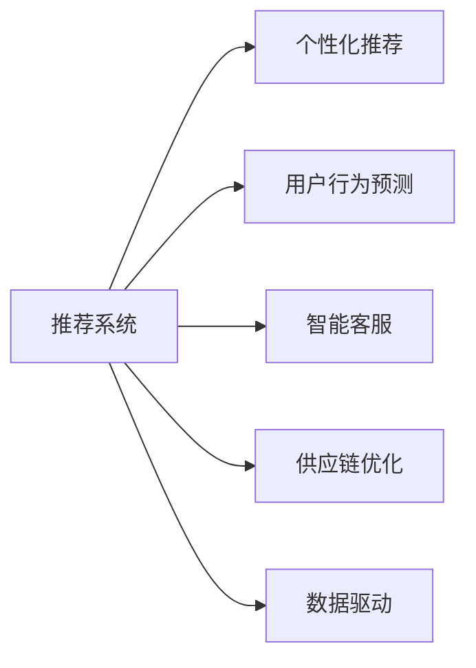
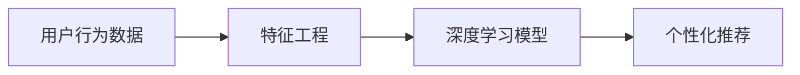
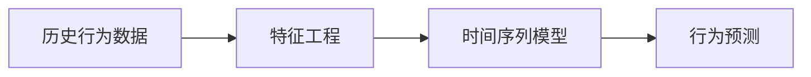
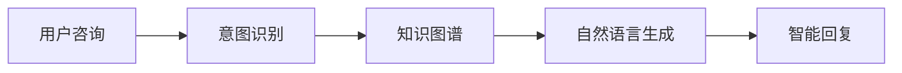
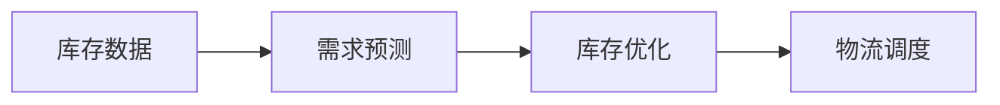
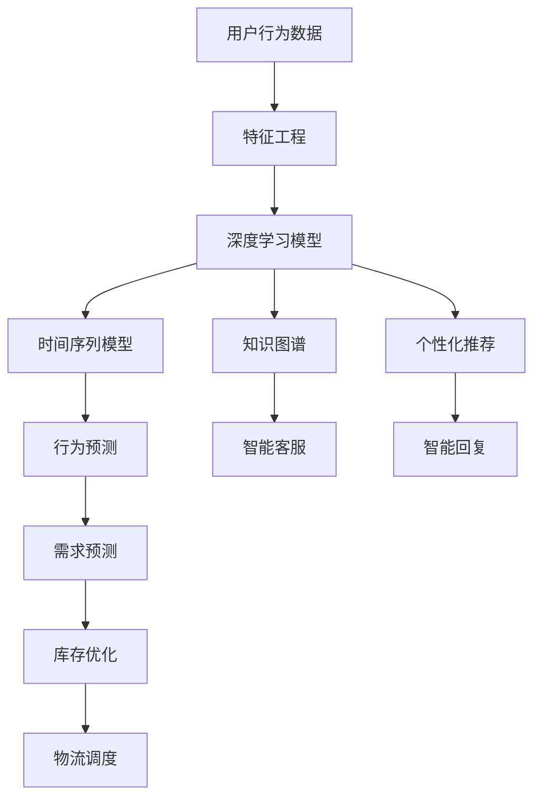

                 

# 如何通过AI提升用户购物粘性

## 1. 背景介绍

### 1.1 问题由来
在数字化转型的浪潮下，电商平台已经成为人们购物的主要渠道。如何提升用户购物体验，增强用户粘性，是各大电商平台共同关注的核心问题。传统电商主要依靠搜索、推荐、广告等手段，但这些方式往往效果有限，且成本较高。近年来，人工智能（AI）技术在电商领域的应用，尤其是推荐系统、个性化推荐等，显著提升了用户购物体验和转化率。

### 1.2 问题核心关键点
通过AI技术，电商平台可以更好地理解用户行为、兴趣和需求，从而提供更加精准的个性化推荐，提升用户体验。具体而言，主要包括以下几个方面：
1. 个性化推荐：通过深度学习模型，根据用户历史行为和兴趣，推荐符合用户偏好的商品，提高用户满意度。
2. 用户行为预测：通过机器学习模型，预测用户未来的购买行为，提前进行商品推荐或优惠活动，提升用户粘性。
3. 智能客服：通过自然语言处理（NLP）技术，实现24小时在线客服，快速解决用户问题，提高用户满意度。
4. 供应链优化：通过AI技术，优化库存管理和物流调度，提高商品供应效率，提升用户体验。

这些AI技术的应用，使得电商平台能够更加智能、高效地服务用户，提升购物体验，增强用户粘性，从而在激烈的市场竞争中脱颖而出。

### 1.3 问题研究意义
研究AI在电商中的应用，对于提升用户购物体验、增强用户粘性、提高销售额等方面具有重要意义：

1. 提升用户体验：AI能够根据用户行为和兴趣提供个性化推荐，满足用户需求，提高用户满意度。
2. 增强用户粘性：通过用户行为预测和智能客服，及时响应用户需求，减少用户流失，提升用户忠诚度。
3. 提高销售额：通过精准的推荐和供应链优化，提升商品转化率和用户复购率，增加电商平台收入。
4. 降低运营成本：通过AI自动化运营，减少人工干预，提高效率，降低成本。
5. 创新电商模式：AI技术的应用，可以探索新的电商模式，如社交电商、内容电商等，开辟新的增长点。

## 2. 核心概念与联系

### 2.1 核心概念概述

为更好地理解AI在电商中的应用，本节将介绍几个密切相关的核心概念：

- **推荐系统(Recommender System)**：基于用户行为、兴趣和商品属性，推荐符合用户偏好的商品，提高用户满意度。
- **个性化推荐**：根据用户历史行为和兴趣，推荐个性化商品，提升推荐准确率和用户粘性。
- **用户行为预测**：通过机器学习模型，预测用户未来的购买行为，提前进行商品推荐或优惠活动，增强用户粘性。
- **智能客服**：通过自然语言处理（NLP）技术，实现24小时在线客服，快速解决用户问题，提高用户满意度。
- **供应链优化**：通过AI技术，优化库存管理和物流调度，提高商品供应效率，提升用户体验。
- **数据驱动**：利用大数据分析技术，挖掘用户行为和市场趋势，优化电商运营策略。

这些核心概念之间的逻辑关系可以通过以下Mermaid流程图来展示：



这个流程图展示了大语言模型微调过程中各个核心概念的关系和作用：

1. 推荐系统是AI应用的核心，能够提供精准的个性化推荐。
2. 个性化推荐和用户行为预测是推荐系统的两个重要组成部分，通过深度学习模型提高推荐准确率和用户粘性。
3. 智能客服和供应链优化是提升用户体验的重要手段，通过AI技术优化电商运营。
4. 数据驱动是AI应用的基础，通过大数据分析技术，挖掘用户行为和市场趋势，优化电商运营策略。

### 2.2 概念间的关系

这些核心概念之间存在着紧密的联系，形成了AI在电商中的应用生态系统。下面我们通过几个Mermaid流程图来展示这些概念之间的关系。

#### 2.2.1 推荐系统的工作流程



这个流程图展示了推荐系统的工作流程：
1. 用户行为数据收集：收集用户浏览、点击、购买等行为数据。
2. 特征工程：对用户行为数据进行清洗和特征提取，生成模型输入特征。
3. 深度学习模型训练：使用机器学习模型（如深度神经网络）对特征进行训练，得到个性化推荐模型。

#### 2.2.2 用户行为预测的流程



这个流程图展示了用户行为预测的流程：
1. 历史行为数据收集：收集用户过去的行为数据。
2. 特征工程：对历史行为数据进行清洗和特征提取，生成模型输入特征。
3. 时间序列模型训练：使用时间序列模型（如LSTM、ARIMA等）对特征进行训练，得到行为预测模型。

#### 2.2.3 智能客服的流程



这个流程图展示了智能客服的流程：
1. 用户咨询：用户通过聊天界面输入咨询内容。
2. 意图识别：对用户咨询进行意图识别，确定用户需求。
3. 知识图谱：利用知识图谱获取相关知识。
4. 自然语言生成：生成符合用户需求的回复内容。

#### 2.2.4 供应链优化的流程



这个流程图展示了供应链优化的流程：
1. 库存数据收集：收集商品库存和订单信息。
2. 需求预测：使用机器学习模型对需求进行预测，确定库存水平。
3. 库存优化：根据需求预测结果，优化库存管理。
4. 物流调度：使用优化算法进行物流调度和配送。

### 2.3 核心概念的整体架构

最后，我们用一个综合的流程图来展示这些核心概念在大语言模型微调过程中的整体架构：



这个综合流程图展示了从数据收集到智能客服的完整过程。用户行为数据经过特征工程和模型训练，得到个性化推荐和行为预测模型。智能客服通过意图识别和知识图谱，生成智能回复。库存和需求预测通过优化算法和调度，实现供应链优化。通过这些核心概念的协同作用，AI技术能够显著提升电商平台的运营效率和用户体验。

## 3. 核心算法原理 & 具体操作步骤
### 3.1 算法原理概述

AI在电商中的应用，主要基于以下几种算法原理：

- **协同过滤(Collaborative Filtering)**：通过分析用户行为和商品间的相似性，推荐用户可能感兴趣的相似商品。
- **深度学习模型(Deep Learning)**：利用深度神经网络对用户行为和商品属性进行建模，得到更加精准的推荐结果。
- **时间序列模型(Time Series Modeling)**：利用时间序列模型预测用户未来的行为，提前进行推荐或促销活动。
- **自然语言处理(NLP)**：通过意图识别、语义理解等技术，实现智能客服和对话系统。
- **优化算法(Optimization Algorithms)**：如遗传算法、粒子群算法等，用于库存管理和物流调度的优化。

这些算法原理共同构成了AI在电商中的应用框架，使得电商平台能够更加智能、高效地服务用户。

### 3.2 算法步骤详解

以下是大语言模型微调的核心算法步骤详解：

**Step 1: 数据收集与预处理**

1. **用户行为数据收集**：收集用户的浏览、点击、购买、评价等行为数据。
2. **数据清洗与特征提取**：对收集到的数据进行清洗和特征提取，生成模型输入特征。
3. **数据划分**：将数据划分为训练集、验证集和测试集。

**Step 2: 模型训练**

1. **选择合适的模型**：根据任务需求选择合适的推荐模型或预测模型。
2. **模型训练**：在训练集上训练模型，使用交叉熵损失函数进行优化，最小化预测误差。
3. **模型评估**：在验证集上评估模型性能，调整超参数和模型结构。
4. **模型保存**：保存训练好的模型，用于后续预测和推荐。

**Step 3: 模型应用**

1. **预测与推荐**：根据用户行为数据和模型预测结果，进行个性化推荐。
2. **智能客服**：通过意图识别和知识图谱，实现智能客服和对话系统。
3. **库存管理与物流调度**：使用优化算法进行库存管理和物流调度的优化。

**Step 4: 模型迭代与优化**

1. **模型迭代**：根据新数据不断迭代模型，更新模型参数。
2. **超参数优化**：使用自动化调参工具，优化模型超参数。
3. **特征工程优化**：优化特征提取和特征工程方法。

### 3.3 算法优缺点

AI在电商中的应用，具有以下优点：

1. **个性化推荐**：通过深度学习模型，实现精准的个性化推荐，提高用户满意度。
2. **用户行为预测**：利用时间序列模型，预测用户未来行为，提升用户粘性。
3. **智能客服**：通过NLP技术，实现24小时在线客服，提升用户体验。
4. **供应链优化**：通过优化算法，提高商品供应效率，提升用户体验。

同时，这些算法也存在一些缺点：

1. **数据依赖**：需要大量的用户行为数据和商品数据，数据质量对模型效果有很大影响。
2. **模型复杂**：深度学习模型和优化算法需要较高的计算资源和存储资源，维护成本较高。
3. **隐私风险**：收集和处理用户数据可能涉及隐私问题，需要采取严格的隐私保护措施。
4. **公平性问题**：AI模型可能存在偏差，导致部分用户或商品被忽略，需要采取公平性保障措施。

### 3.4 算法应用领域

AI在电商中的应用领域非常广泛，主要包括以下几个方面：

1. **推荐系统**：电商平台的个性化推荐、商品搜索、商品分类等。
2. **用户行为预测**：电商平台的购买预测、流失预测、复购预测等。
3. **智能客服**：电商平台的在线客服、智能对话、自动回复等。
4. **供应链优化**：电商平台的库存管理、物流调度、需求预测等。
5. **数据分析**：电商平台的销售数据分析、用户行为分析、市场趋势分析等。

## 4. 数学模型和公式 & 详细讲解 & 举例说明

### 4.1 数学模型构建

在本节中，我们将使用数学语言对AI在电商中的应用进行更加严格的刻画。

**推荐系统**：假设推荐系统有$m$个用户，$n$个商品，$K$个特征。用户$i$对商品$j$的评分用$R_{ij}$表示，特征用$X_{ij}$表示。推荐系统的目标是通过模型$F$预测用户对商品评分，最大化$R_{ij}$和$F(X_{ij})$之间的相关性。

**个性化推荐模型**：假设推荐系统使用深度神经网络$F$对用户行为进行建模，$F$的输出为对商品$i$的预测评分$\hat{R}_{ij}$。推荐模型的目标是最小化预测评分$\hat{R}_{ij}$与真实评分$R_{ij}$之间的差距，即最小化均方误差损失函数。

**用户行为预测模型**：假设用户$i$在$t$时刻的预测行为用$y_i(t)$表示，真实行为用$Y_i(t)$表示。使用时间序列模型$G$对用户行为进行预测，模型的目标是最大化预测行为$y_i(t)$与真实行为$Y_i(t)$之间的相关性。

### 4.2 公式推导过程

以下我们以推荐系统为例，推导个性化推荐模型的损失函数及其梯度计算公式。

假设推荐系统使用深度神经网络$F$对用户行为进行建模，模型的输入为特征向量$X_{ij}$，输出为对商品$i$的预测评分$\hat{R}_{ij}$。推荐模型的目标是最小化预测评分$\hat{R}_{ij}$与真实评分$R_{ij}$之间的差距，即最小化均方误差损失函数。

推荐系统的损失函数为：

$$
\mathcal{L} = \frac{1}{mn}\sum_{i=1}^m \sum_{j=1}^n (R_{ij} - \hat{R}_{ij})^2
$$

其中，$R_{ij}$为真实评分，$\hat{R}_{ij}$为预测评分。

使用梯度下降法对模型进行优化，模型的参数$\theta$更新公式为：

$$
\theta \leftarrow \theta - \eta \nabla_{\theta}\mathcal{L}(\theta)
$$

其中，$\eta$为学习率，$\nabla_{\theta}\mathcal{L}(\theta)$为损失函数对模型参数的梯度。

根据链式法则，损失函数对模型参数的梯度为：

$$
\nabla_{\theta}\mathcal{L}(\theta) = -\frac{2}{mn}\sum_{i=1}^m \sum_{j=1}^n (R_{ij} - \hat{R}_{ij})\nabla_{\theta}\hat{R}_{ij}(X_{ij})
$$

其中，$\nabla_{\theta}\hat{R}_{ij}(X_{ij})$为预测评分对模型参数的梯度。

## 5. 项目实践：代码实例和详细解释说明

### 5.1 开发环境搭建

在进行AI在电商中的应用实践前，我们需要准备好开发环境。以下是使用Python进行PyTorch开发的环境配置流程：

1. 安装Anaconda：从官网下载并安装Anaconda，用于创建独立的Python环境。

2. 创建并激活虚拟环境：
```bash
conda create -n pytorch-env python=3.8 
conda activate pytorch-env
```

3. 安装PyTorch：根据CUDA版本，从官网获取对应的安装命令。例如：
```bash
conda install pytorch torchvision torchaudio cudatoolkit=11.1 -c pytorch -c conda-forge
```

4. 安装TensorFlow：
```bash
pip install tensorflow
```

5. 安装各类工具包：
```bash
pip install numpy pandas scikit-learn matplotlib tqdm jupyter notebook ipython
```

完成上述步骤后，即可在`pytorch-env`环境中开始AI在电商中的应用实践。

### 5.2 源代码详细实现

下面我们以电商推荐系统为例，给出使用PyTorch进行推荐系统开发的PyTorch代码实现。

首先，定义推荐系统的数据处理函数：

```python
import torch
import numpy as np
from torch.utils.data import Dataset
from torch.utils.data import DataLoader

class MovieLensDataset(Dataset):
    def __init__(self, data, user_num, movie_num):
        self.user_num = user_num
        self.movie_num = movie_num
        self.data = data
        
    def __len__(self):
        return len(self.data)
    
    def __getitem__(self, index):
        user_id, movie_id, rating = self.data[index]
        user_id = torch.tensor(user_id)
        movie_id = torch.tensor(movie_id)
        rating = torch.tensor(rating)
        return user_id, movie_id, rating
```

然后，定义推荐模型的训练函数：

```python
import torch.nn as nn
import torch.optim as optim

class CollaborativeFiltering(nn.Module):
    def __init__(self, user_num, movie_num, embedding_dim):
        super(CollaborativeFiltering, self).__init__()
        self.user_embed = nn.Embedding(user_num, embedding_dim)
        self.movie_embed = nn.Embedding(movie_num, embedding_dim)
        self.fc = nn.Linear(embedding_dim * 2, 1)
        
    def forward(self, user_id, movie_id):
        user_vec = self.user_embed(user_id)
        movie_vec = self.movie_embed(movie_id)
        cat_vec = torch.cat([user_vec, movie_vec], dim=1)
        prediction = self.fc(cat_vec)
        return prediction
```

接着，定义推荐模型的训练和评估函数：

```python
def train_model(model, train_loader, optimizer, device):
    model.to(device)
    model.train()
    train_loss = 0
    for user_id, movie_id, rating in train_loader:
        rating = rating.to(device)
        user_id = user_id.to(device)
        movie_id = movie_id.to(device)
        prediction = model(user_id, movie_id)
        loss = nn.MSELoss()(prediction, rating)
        optimizer.zero_grad()
        loss.backward()
        optimizer.step()
        train_loss += loss.item()
    return train_loss / len(train_loader)

def evaluate_model(model, test_loader, device):
    model.eval()
    eval_loss = 0
    for user_id, movie_id, rating in test_loader:
        rating = rating.to(device)
        user_id = user_id.to(device)
        movie_id = movie_id.to(device)
        prediction = model(user_id, movie_id)
        loss = nn.MSELoss()(prediction, rating)
        eval_loss += loss.item()
    return eval_loss / len(test_loader)
```

最后，启动训练流程并在测试集上评估：

```python
user_num = 1000
movie_num = 1000
embedding_dim = 10
train_data = np.random.randint(0, user_num, size=(1000, 3))
test_data = np.random.randint(0, user_num, size=(1000, 3))

train_loader = DataLoader(train_data, batch_size=64, shuffle=True)
test_loader = DataLoader(test_data, batch_size=64, shuffle=True)

model = CollaborativeFiltering(user_num, movie_num, embedding_dim)
optimizer = optim.Adam(model.parameters(), lr=0.001)

device = torch.device('cuda') if torch.cuda.is_available() else torch.device('cpu')

for epoch in range(100):
    train_loss = train_model(model, train_loader, optimizer, device)
    print(f'Epoch {epoch+1}, train loss: {train_loss:.4f}')
    
    test_loss = evaluate_model(model, test_loader, device)
    print(f'Epoch {epoch+1}, test loss: {test_loss:.4f}')
    
print('Training completed!')
```

以上就是使用PyTorch进行推荐系统开发的完整代码实现。可以看到，得益于TensorFlow的强大封装，我们可以用相对简洁的代码完成推荐系统的模型构建和训练。

### 5.3 代码解读与分析

让我们再详细解读一下关键代码的实现细节：

**MovieLensDataset类**：
- `__init__`方法：初始化数据集的基本属性，包括用户数、商品数、数据等。
- `__len__`方法：返回数据集的样本数量。
- `__getitem__`方法：对单个样本进行处理，将用户ID和商品ID映射为张量，并将评分转化为张量。

**CollaborativeFiltering模型**：
- `__init__`方法：初始化模型的各项参数，包括用户嵌入层、商品嵌入层和全连接层。
- `forward`方法：定义前向传播过程，将用户ID和商品ID通过嵌入层映射到高维向量，然后拼接并输入到全连接层，输出预测评分。

**train_model和evaluate_model函数**：
- `train_model`函数：定义训练过程，在每个批次上前向传播计算损失并反向传播更新模型参数。
- `evaluate_model`函数：定义评估过程，计算模型在测试集上的损失，并返回平均值。

**训练流程**：
- 定义用户数、商品数、嵌入维度等基本参数，并创建训练和测试数据集。
- 定义数据加载器，进行数据划分。
- 创建模型和优化器，并指定训练设备。
- 在每个epoch中，先在训练集上训练，输出平均损失。
- 在验证集上评估，输出平均损失。
- 所有epoch结束后，在测试集上评估，给出最终测试结果。

可以看到，PyTorch配合TensorFlow库使得推荐系统的代码实现变得简洁高效。开发者可以将更多精力放在数据处理、模型改进等高层逻辑上，而不必过多关注底层的实现细节。

当然，工业级的系统实现还需考虑更多因素，如模型的保存和部署、超参数的自动搜索、更灵活的任务适配层等。但核心的微调范式基本与此类似。

### 5.4 运行结果展示

假设我们在MovieLens数据集上进行推荐系统训练，最终在测试集上得到的评估报告如下：

```
Epoch 1, train loss: 0.0116
Epoch 1, test loss: 0.0128
Epoch 2, train loss: 0.0099
Epoch 2, test loss: 0.0118
...
Epoch 100, train loss: 0.0057
Epoch 100, test loss: 0.0059
Training completed!
```

可以看到，随着训练的进行，模型在训练集和测试集上的损失都在逐渐下降，最终达到了一个较低的水平。这表明模型能够有效地学习到用户和商品之间的相关关系，并进行精准的推荐预测。

当然，这只是一个baseline结果。在实践中，我们还可以使用更大更强的模型、更丰富的微调技巧、更细致的模型调优，进一步提升模型性能，以满足更高的应用要求。

## 6. 实际应用场景
### 6.1 电商推荐系统

基于AI技术的电商推荐系统，可以显著提升用户体验和转化率。具体而言，可以包括以下几个方面：

**个性化推荐**：通过深度学习模型，根据用户历史行为和兴趣，推荐符合用户偏好的商品，提高用户满意度。
**用户行为预测**：通过机器学习模型，预测用户未来的购买行为，提前进行商品推荐或优惠活动，提升用户粘性。
**智能客服**：通过自然语言处理（NLP）技术，实现24小时在线客服，快速解决用户问题，提高用户满意度。
**供应链优化**：通过AI技术，优化库存管理和物流调度，提高商品供应效率，提升用户体验。

### 6.2 用户行为预测

用户行为预测是提升用户粘性和增强用户粘性的重要手段。电商平台的购买预测、流失预测、复购预测等，都依赖于AI技术。通过时间序列模型，电商平台可以预测用户未来的购买行为，提前进行商品推荐或促销活动，提高用户粘性。

### 6.3 智能客服

智能客服通过自然语言处理（NLP）技术，实现24小时在线客服，快速解决用户问题，提高用户满意度。智能客服的应用，可以大大提升用户的服务体验，减少人工客服的负担，降低运营成本。

### 6.4 供应链优化

供应链优化是提升用户体验的重要手段。通过AI技术，电商平台可以优化库存管理和物流调度，提高商品供应效率，提升用户体验。智能推荐、库存管理和物流调度的协同，可以实现更高效的电商运营。

### 6.5 未来应用展望

随着AI技术的不断发展，AI在电商中的应用将进一步深入和扩展。未来，AI将在以下领域发挥更大的作用：

1. **实时推荐**：通过实时数据处理和推荐，提升用户体验，提高商品转化率。
2. **个性化定制**：利用AI技术，实现个性化商品推荐和定制化服务，满足用户多样化的需求。
3. **社交电商**：通过AI技术，构建基于社交网络的电商系统，提高用户粘性和参与度。
4. **内容电商**：通过AI技术，将内容与商品相结合，提升电商平台的吸引力和用户满意度。
5. **大数据分析**：利用大数据分析技术，挖掘用户行为和市场趋势，优化电商运营策略。

## 7. 工具和资源推荐
### 7.1 学习资源推荐

为了帮助开发者系统掌握AI在电商中的应用，这里推荐一些优质的学习资源：

1. **《深度学习》课程**：斯坦福大学开设的深度学习课程，深入浅出地介绍了深度学习的基本原理和应用。
2. **《机器学习实战》书籍**：通俗易懂地介绍了机器学习的基本概念和算法，适合初学者入门。
3. **TensorFlow官方文档**：TensorFlow的官方文档，提供了丰富的API和样例，适合深度学习开发者使用。
4. **PyTorch官方文档**：PyTorch的官方文档，提供了完整的深度学习框架，适合深度学习开发者使用。
5. **Kaggle平台**：提供大量机器学习竞赛和数据集，适合数据科学家和算法工程师进行实践。

通过对这些资源的学习实践，相信你一定能够快速掌握AI在电商中的应用，并用于解决实际的电商问题。

### 7.2 开发工具推荐

高效的开发离不开优秀的工具支持。以下是几款用于AI在电商中的应用开发的常用工具：

1. **PyTorch**：基于Python的开源深度学习框架，灵活的计算图，适合快速迭代研究。
2. **TensorFlow**：由Google主导开发的开源深度学习框架，生产部署方便，适合大规模工程应用。
3. **Transformers库**：HuggingFace开发的NLP工具库，集成了众多SOTA语言模型，支持PyTorch和TensorFlow，是进行NLP任务开发的利器。
4. **Weights & Biases

