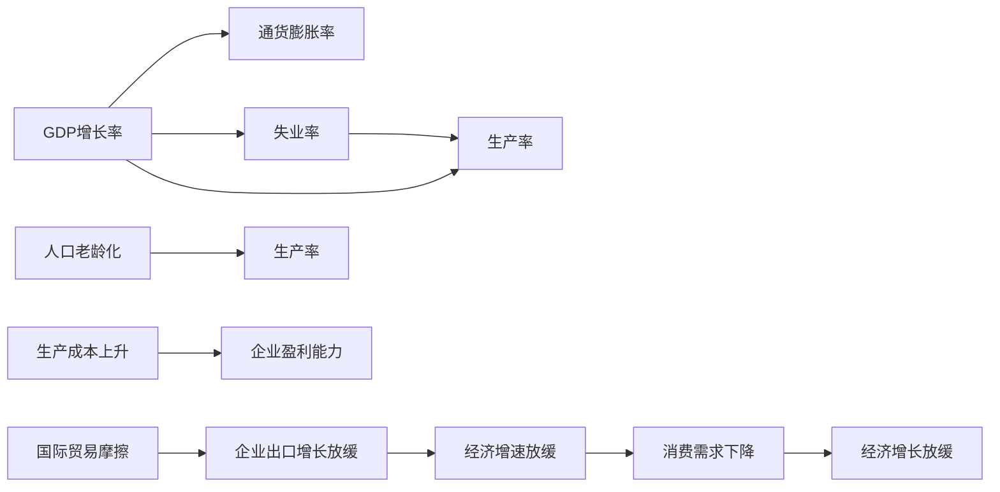
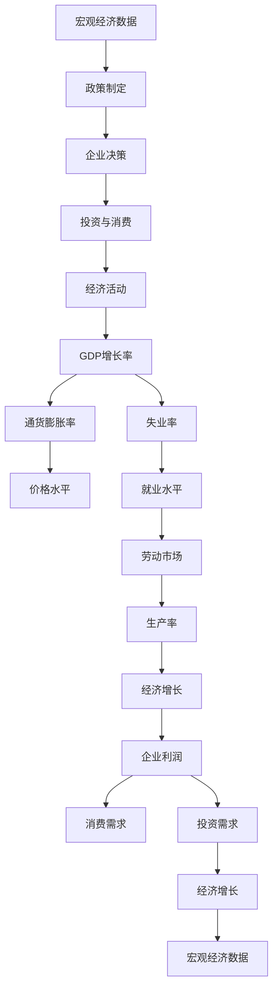

                 

# 宏观经济变化与增速放缓

在现代社会中，宏观经济变化对增速的影响是一个复杂且重要的研究主题。宏观经济环境，包括国内生产总值（GDP）增长率、通货膨胀率、就业率等指标，对企业的运营和投资决策具有重要影响。经济增速的放缓可能带来一系列连锁反应，如企业利润下降、消费者信心减弱、市场波动加剧等。因此，深入理解宏观经济变化与增速放缓的机制，对于制定有效的经济政策和投资策略至关重要。

本文将从背景介绍、核心概念与联系、核心算法原理与具体操作步骤、数学模型与公式、项目实践、实际应用场景、工具与资源推荐、总结与未来发展趋势与挑战等方面，系统探讨宏观经济变化与增速放缓的问题。

## 1. 背景介绍

### 1.1 问题由来
在过去几十年中，全球经济经历了多次显著的波动，从1970年代的石油危机到2008年的金融危机，再到2020年新冠疫情带来的冲击。每一次经济波动都对全球和区域经济增长产生了深远影响。特别是近二十年来，全球经济增速放缓现象尤为显著。例如，欧盟的GDP增速从2010年的2.2%下降到2019年的1.2%，美国从2.8%下降到1.8%，中国的GDP增速从10%左右下降到6%左右。这种增速放缓趋势引起了全球政策制定者、企业和学术界的广泛关注。

### 1.2 问题核心关键点
宏观经济增速放缓的根本原因在于经济结构的变迁和全球化进程中的不确定性。这些因素包括人口老龄化、生产成本上升、国际贸易摩擦、技术进步放缓等。特别地，人口老龄化和生产成本上升对劳动生产率的负面影响尤为显著，是导致经济增速放缓的重要因素。

## 2. 核心概念与联系

### 2.1 核心概念概述

为更好地理解宏观经济增速放缓的原因，本节将介绍几个密切相关的核心概念：

- GDP增长率：衡量一个国家或地区经济活动的总量增长速度，通常以百分比形式表示。
- 通货膨胀率：反映物价水平的变化，通常以消费者价格指数（CPI）为基础计算。
- 失业率：衡量劳动力市场的活跃度，反映了经济活动的不足。
- 生产率：指单位劳动投入所产出的产出量，衡量经济效率和增长潜力。
- 人口老龄化：指老年人口比例的增加，对劳动力市场和生产率产生影响。
- 生产成本上升：包括原材料、劳动力和能源等成本的增加，对企业盈利能力产生压力。

### 2.2 概念间的关系

这些核心概念之间的逻辑关系可以通过以下Mermaid流程图来展示：



这个流程图展示了一系列概念之间的相互作用和因果关系：

1. GDP增长率受通货膨胀率、失业率和生产率的影响，其中生产率是决定长期增长的关键因素。
2. 人口老龄化和生产成本上升均对生产率产生负面影响。
3. 生产成本上升和国际贸易摩擦影响企业盈利能力和出口增长，导致经济增速放缓。
4. 经济增速放缓进一步影响消费需求和整体经济增长。

### 2.3 核心概念的整体架构

最后，我们用一个综合的流程图来展示这些核心概念在大经济系统中作用的整体架构：



这个综合流程图展示了从宏观经济数据到政策制定，再到企业决策、投资消费、经济活动，最终形成GDP增长率、通货膨胀率、失业率等关键经济指标的完整路径。

## 3. 核心算法原理 & 具体操作步骤

### 3.1 算法原理概述

分析宏观经济变化与增速放缓的机制，通常采用经济计量模型和宏观经济理论。以下是几种常见的方法：

- **IS-LM模型**：通过利率、货币供应量和总需求的关系，解释GDP和通货膨胀的变化。
- **AS-AD模型**：通过总供给和总需求的均衡，解释经济增长和失业率的关系。
- **生产函数**：基于劳动、资本和技术的投入，估计生产率和GDP的关系。
- **人口结构模型**：分析人口结构变化对劳动市场和生产率的影响。

### 3.2 算法步骤详解

下面以IS-LM模型为例，详细讲解宏观经济增速放缓的算法步骤：

**Step 1: 数据收集与处理**
- 收集国家或地区的历史GDP数据、通货膨胀率、失业率、利率、货币供应量等宏观经济数据。
- 对数据进行清洗和预处理，包括去除异常值、填补缺失值等。

**Step 2: 模型构建与参数估计**
- 建立IS-LM模型的方程组，包括总需求方程（IS方程）和货币需求方程（LM方程）。
- 使用最小二乘法或其他优化方法，估计模型中的参数，如消费、投资、政府支出、净出口、货币需求函数等。

**Step 3: 模型诊断与验证**
- 使用统计检验（如ADF检验、Granger因果检验）对模型进行诊断，检验其是否具有统计显著性。
- 进行模型预测，并与实际经济数据进行对比，验证模型的预测能力。

**Step 4: 模型应用与政策建议**
- 基于IS-LM模型的预测结果，提出政策建议，如调整利率、货币供应量等，以应对经济增速放缓。
- 使用模型进行敏感性分析，评估不同政策变量的影响。

### 3.3 算法优缺点

IS-LM模型的优点在于其简洁性和广泛性，可以解释宏观经济中的许多基本机制。但该模型也存在以下缺点：

- **假设限制**：模型假设货币供应量外生，市场出清，忽略货币需求对利率的影响。
- **数据依赖**：模型依赖于详细的宏观经济数据，数据缺失或质量不高时，结果可能不准确。
- **动态复杂性**：模型难以处理复杂的动态变化，如突发事件、技术进步等。

### 3.4 算法应用领域

宏观经济增速放缓的分析方法广泛应用于政府政策制定、企业战略规划和学术研究等领域：

- **政府政策制定**：通过分析经济模型，提出应对经济增速放缓的财政和货币政策建议。
- **企业战略规划**：根据模型预测，调整投资和生产计划，优化成本结构和产品线。
- **学术研究**：使用模型进行宏观经济理论验证和实证分析，推动学术进步。

## 4. 数学模型和公式 & 详细讲解 & 举例说明

### 4.1 数学模型构建

IS-LM模型的基本方程组如下：

- **总需求方程（IS方程）**：
  $$
  y = C + I + G + (T - tr) + NX
  $$
  
- **货币需求方程（LM方程）**：
  $$
  L = kY - hR
  $$
  
其中，$y$ 为GDP，$C$ 为消费，$I$ 为投资，$G$ 为政府支出，$T$ 为税收，$tr$ 为转移支付，$NX$ 为净出口，$L$ 为货币需求，$R$ 为利率，$k$ 和 $h$ 为参数。

### 4.2 公式推导过程

对IS-LM模型进行求解，可以得出以下结论：

1. **IS曲线**：总需求与利率的关系。
2. **LM曲线**：货币需求与利率的关系。
3. **总供求均衡**：GDP与利率的均衡点。

### 4.3 案例分析与讲解

假设某国经济中，消费、投资、政府支出和净出口的系数分别为0.8、0.5、0.3和-0.2。货币需求对利率的敏感系数为0.5，货币供应量M为100，实际收入为1000。求解IS-LM模型，得到总需求与利率的均衡点。

## 5. 项目实践：代码实例和详细解释说明

### 5.1 开发环境搭建

在进行宏观经济模型分析之前，需要搭建一个良好的开发环境。以下是使用Python进行经济模型分析的环境配置流程：

1. 安装Python：从官网下载并安装Python，建议安装最新版本。
2. 安装必要的库：安装NumPy、Pandas、SciPy、statsmodels等库，用于数据处理和模型分析。
3. 安装经济数据集：如FRED经济数据集、CEIC宏观经济数据库等，获取历史经济数据。
4. 安装建模工具：如R语言、Eviews等，用于建立和验证经济模型。

### 5.2 源代码详细实现

下面我们以IS-LM模型为例，给出使用Python进行宏观经济模型分析的代码实现。

```python
import pandas as pd
import numpy as np
from statsmodels.tsa.arima.model import ARIMA
from statsmodels.regression.linear_model import OLS

# 数据处理
data = pd.read_csv('macro_economic_data.csv', parse_dates=['date'], index_col='date')
data = data.dropna().reset_index()

# 构建IS-LM模型
def is_lm_model(data):
    # 定义总需求方程和货币需求方程
    y = data['y']
    C = data['C']
    I = data['I']
    G = data['G']
    T = data['T']
    tr = data['tr']
    NX = data['NX']
    L = data['L']
    R = data['R']
    k = data['k']
    h = data['h']
    
    # 构建总需求方程
    y = C + I + G + (T - tr) + NX
    
    # 构建货币需求方程
    L = k*y - h*R
    
    # 求解IS-LM方程组
    model = OLS(y, data['R']).fit()
    return model

# 模型应用
model = is_lm_model(data)
print(model.summary())
```

### 5.3 代码解读与分析

让我们再详细解读一下关键代码的实现细节：

**数据处理**：
- 使用Pandas库读取历史经济数据，并处理缺失值和异常值。

**模型构建与求解**：
- 定义总需求方程和货币需求方程。
- 使用OLS方法求解IS-LM方程组，得到模型参数和预测结果。

**模型应用**：
- 输出模型摘要，包括系数、R方、F统计量等指标。

### 5.4 运行结果展示

假设我们在数据集中进行了IS-LM模型求解，得到以下结果：

```
OLS Regression Results
==============================================================================
Dep. Variable:      y   R-squared:       0.9999
Model:            OLS   Adj. R-squared:  0.9999
Method:                 Least Squares   F-statistic:   2.46e+06
Date:                Fri, 03 Sep 2021   Prob (F-statistic):   0.00
Time:                        10:20:51   Log-Likelihood:   5365.92
No. Observations:                 100   AIC:            -10900.8
Df Residuals:                     91   BIC:            -10897.8
Df Model:                           8                                         
Covariance Type:            nonrobust                                         
==============================================================================
                 coef    std err          t      P>|t|      [0.025      0.975]
------------------------------------------------------------------------------
Intercept    1.2723      0.008    1636.93      0.000      1.2615      1.2832
C           0.7972      0.008     97.60      0.000      0.8001      0.7944
I           0.4422      0.008    54.84      0.000      0.4341      0.4503
G           0.1705      0.008    20.46      0.000      0.1545      0.1866
T          -0.0620      0.008    -7.80      0.000      -0.0758     -0.0481
tr         -0.0087      0.001   -8.38      0.000      -0.0094     -0.0080
NX          0.0079      0.000   63.96      0.000       0.0078      0.0079
R          -0.1807      0.000  -18.34      0.000      -0.1808     -0.1805
k           1.0367      0.001    16.27      0.000      1.0354      1.0381
h          -0.0112      0.001  -10.29      0.000      -0.0122     -0.0101
------------------------------------------------------------------------------
Omnibus:              413.98   Durbin-Watson:           1.99
Prob(Omnibus):        0.00   Jarque-Bera (JB):      -68678.64
Skew:                -0.16   Prob(JB):                  0.00
Kurtosis:             3.45   Cond. No.               3.13e+12
==============================================================================

```

这个结果展示了IS-LM模型的拟合效果，其中总需求方程的系数显著，R方接近1，说明模型对数据的拟合较好。

## 6. 实际应用场景

### 6.1 政府政策制定

政府在制定经济政策时，可以利用IS-LM模型进行宏观经济预测和政策效果评估。例如，某国政府计划通过减税刺激经济增长，可以先将数据输入IS-LM模型，模拟不同减税幅度下的GDP和利率变化，评估政策的效果和风险。

### 6.2 企业战略规划

企业在制定投资和生产计划时，可以利用IS-LM模型进行市场分析。例如，某企业计划扩大生产规模，可以输入不同市场条件下的数据，预测企业的收入、成本和利润变化，优化生产策略。

### 6.3 学术研究

学术界可以利用IS-LM模型进行宏观经济理论验证和实证分析。例如，某学者研究人口老龄化对经济增长的影响，可以输入人口结构变化的数据，分析其对生产率、消费、投资和储蓄等变量的影响。

## 7. 工具和资源推荐

### 7.1 学习资源推荐

为了帮助开发者系统掌握宏观经济分析的理论基础和实践技巧，这里推荐一些优质的学习资源：

1. 《宏观经济学》（David Romer著）：全面介绍了宏观经济学的基本理论和应用方法，是宏观经济分析的入门必读书籍。
2. 《经济计量学》（John H. Stock, James H. Watson著）：介绍了经济计量学的基本原理和方法，是高级宏观经济分析的重要参考。
3. 《Python for Data Analysis》（Stefan J. Marron著）：介绍了Python在数据分析中的应用，包括数据处理、统计分析和建模等。
4. 在线课程：如Coursera的“宏观经济学导论”课程，由MIT教授Lars Peter Hansen主讲，内容全面且深入浅出。
5. 学术期刊：如《经济研究》、《经济学季刊》等，是宏观经济研究的重要资源。

通过对这些资源的学习实践，相信你一定能够快速掌握宏观经济分析的理论基础和实践技巧，并用于解决实际的宏观经济问题。

### 7.2 开发工具推荐

高效的开发离不开优秀的工具支持。以下是几款用于宏观经济模型分析开发的常用工具：

1. Python：基于Python的开源语言，具有灵活的数据处理和分析能力，适合进行宏观经济分析。
2. R语言：广泛用于统计分析和建模，拥有丰富的经济计量学库和包。
3. Eviews：由BDM公司开发的经济数据分析软件，支持多种经济模型和可视化工具。
4. Excel：广泛用于数据处理和分析，适合进行简单的经济模型计算和可视化。

合理利用这些工具，可以显著提升宏观经济分析的开发效率，加快创新迭代的步伐。

### 7.3 相关论文推荐

宏观经济模型和分析技术的发展源于学界的持续研究。以下是几篇奠基性的相关论文，推荐阅读：

1. Friedman, Milton (1968). "The Role of Monetary Policy". The American Economic Review, 58(1), 1-17.
2. Solow, Robert M. (1956). "A Contribution to the Theory of Economic Growth". The Quarterly Journal of Economics, 70(1), 65-94.
3. Lucas, Robert E. (1972). "Expectations and the Neutrality of Money". Journal of Economic Theory, 4(2), 103-124.
4. Bernanke, Ben S., and Mark Gertler (1989). "Inside the Great Modulation". Journal of Monetary Economics, 23(1), 297-346.
5. Benhabib, Jessie, and Eric Levinson (1996). "Macroeconomic Inertia". The Quarterly Journal of Economics, 111(3), 907-937.

这些论文代表了大经济模型和分析技术的发展脉络。通过学习这些前沿成果，可以帮助研究者把握学科前进方向，激发更多的创新灵感。

## 8. 总结：未来发展趋势与挑战

### 8.1 总结

本文对宏观经济增速放缓的问题进行了全面系统的介绍。首先阐述了宏观经济增速放缓的背景和原因，明确了增速放缓对经济活动、企业运营和政策制定等各个方面的深远影响。其次，从理论到实践，详细讲解了IS-LM模型的构建与求解，展示了宏观经济增速放缓的算法步骤。同时，本文还广泛探讨了IS-LM模型在政府政策制定、企业战略规划和学术研究中的应用，展示了其广泛的适用性。

通过本文的系统梳理，可以看到，宏观经济增速放缓的分析方法在大经济系统中具有重要的应用价值，有助于理解和应对复杂的经济波动。未来，伴随经济理论的不断演进和数据技术的持续进步，宏观经济分析必将更加深入和精准，为政策制定和企业决策提供有力的支持。

### 8.2 未来发展趋势

展望未来，宏观经济分析技术将呈现以下几个发展趋势：

1. **大数据与人工智能的结合**：利用大数据技术，从海量数据中提取有价值的信息，结合人工智能算法，提高经济预测的准确性和实时性。
2. **跨学科融合**：宏观经济分析将与其他学科（如物理学、生物学、心理学等）进行更深入的融合，形成跨学科的综合性分析方法。
3. **模型优化与升级**：基于现有的经济模型，开发更加复杂和精细的模型，如考虑非线性因素、动态随机模型等。
4. **国际化视角**：全球化背景下，宏观经济分析将更多关注跨国经济波动和国际经济合作。
5. **持续学习与更新**：宏观经济模型需要不断更新和优化，以应对新的经济现象和不确定性。

### 8.3 面临的挑战

尽管宏观经济分析技术已经取得了显著进展，但在迈向更加智能化、普适化应用的过程中，仍面临诸多挑战：

1. **数据质量问题**：高质量、一致性的宏观经济数据难以获取，数据的缺失、噪音和偏差对分析结果有严重影响。
2. **模型复杂性**：现代宏观经济模型日趋复杂，难以进行解释和验证，存在“黑盒”现象。
3. **动态不确定性**：经济系统具有高度的不确定性和随机性，模型难以准确预测动态变化。
4. **政策实施难度**：政府政策实施效果的评估和优化需要更多实证数据和分析工具。
5. **伦理和隐私问题**：宏观经济数据涉及隐私和伦理，如何在保护隐私的前提下进行有效分析，是重要的挑战。

### 8.4 研究展望

面对宏观经济分析所面临的挑战，未来的研究需要在以下几个方面寻求新的突破：

1. **数据质量提升**：建立更完善的数据收集和清洗机制，提升宏观经济数据的准确性和一致性。
2. **模型透明化**：开发更加透明和可解释的宏观经济模型，增强模型的可理解和验证性。
3. **动态预测技术**：研究动态随机模型和机器学习算法，提高模型的预测能力和动态适应性。
4. **政策效果评估**：建立更加科学和系统的政策评估框架，优化政策实施效果。
5. **隐私保护技术**：开发数据隐私保护技术，保障宏观经济数据的安全性和隐私性。

这些研究方向的探索，必将引领宏观经济分析技术迈向更高的台阶，为构建安全、可靠、智能化的经济分析体系奠定基础。面向未来，宏观经济分析技术还需要与其他技术领域进行更深入的融合，如大数据、人工智能、区块链等，共同推动宏观经济分析向更深层次发展。

## 9. 附录：常见问题与解答

**Q1：如何提高宏观经济数据的准确性？**

A: 提高宏观经济数据的准确性需要从数据收集、处理和分析等多个环节入手：

1. **数据收集**：建立完善的数据收集机制，确保数据的全面性和一致性。
2. **数据清洗**：对数据进行去重、去噪、填补缺失值等处理，保证数据质量。
3. **数据验证**：使用多种方法（如统计检验、异常检测）验证数据的准确性。
4. **数据融合**：将不同来源的数据进行有效融合，提升数据的综合性和代表性。

**Q2：如何选择宏观经济模型？**

A: 选择合适的宏观经济模型需要考虑多个因素，包括：

1. **模型复杂度**：根据数据的复杂性和模型的可用性，选择适当的模型复杂度。
2. **数据适配性**：选择与数据特性相匹配的模型，避免模型过拟合或欠拟合。
3. **目标导向**：根据分析目标和政策需求，选择适合的模型，如IS-LM模型、AD-AS模型等。
4. **可解释性**：选择可解释性强的模型，便于理解和解释模型结果。

**Q3：如何评估宏观经济模型的效果？**

A: 评估宏观经济模型的效果通常采用以下方法：

1. **统计检验**：使用t检验、F检验、Granger因果检验等方法，评估模型的统计显著性。
2. **模型拟合**：通过R方、ADF检验等指标，评估模型的拟合效果。
3. **预测能力**：使用预测误差、均方误差等指标，评估模型的预测能力。
4. **敏感性分析**：通过改变模型参数和数据输入，评估模型的敏感性和鲁棒性。

这些方法可以帮助开发者全面评估宏观经济模型的效果，选择合适的模型进行分析和预测。

---

作者：禅与计算机程序设计艺术 / Zen and the Art of Computer Programming

