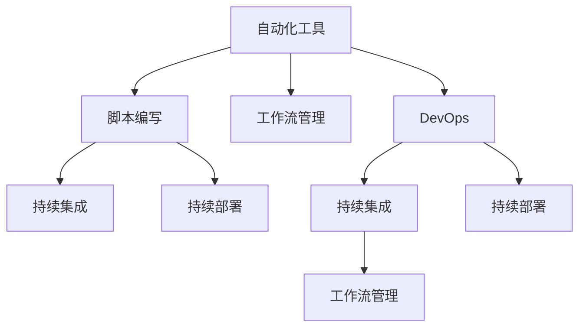
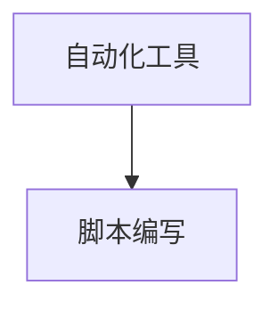
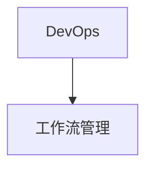
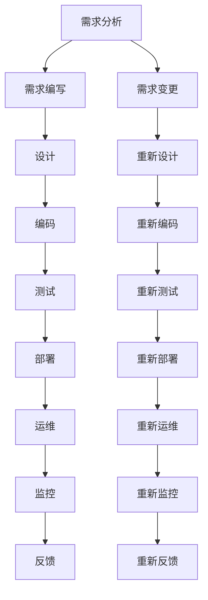

                 

# 工具使用在任务自动化中的应用

> 关键词：工具使用, 任务自动化, 脚本编写, 自动化测试, 持续集成, 持续部署, DevOps, 工作流管理

## 1. 背景介绍

### 1.1 问题由来

随着信息技术的发展，软件规模和复杂度日益增大，软件开发、测试、部署等各个环节的自动化需求变得日益迫切。传统的开发模式依赖于人工进行重复性的操作和检查，不仅效率低下，还容易引入人为错误，难以保证软件质量。工具使用在任务自动化中扮演了重要角色，能够大大提高工作效率，降低错误率，提升软件质量和交付速度。

### 1.2 问题核心关键点

工具使用在任务自动化中的核心关键点包括：

- **自动化工具的选择与应用**：选择合适的自动化工具，并合理应用于软件开发、测试、部署等各个环节。
- **脚本编写与执行**：编写高效、可复用的脚本，并通过工具进行自动化执行。
- **持续集成与部署**：实现自动化的构建、测试、部署流程，提升交付速度和质量。
- **工作流管理**：使用工作流管理工具，协调和管理自动化任务，实现流水线化作业。
- **DevOps实践**：通过工具使用，推动DevOps文化，实现持续集成、持续交付和持续改进。

### 1.3 问题研究意义

工具使用在任务自动化中的应用，对于提升软件开发效率、保证软件质量、加速软件开发周期、降低运维成本等方面具有重要意义：

1. **提高工作效率**：自动化工具能够快速、准确地完成各种重复性任务，解放开发人员和运维人员的时间。
2. **降低错误率**：自动化执行避免了人工操作带来的错误，提高了软件质量。
3. **加速交付速度**：自动化流水线大大缩短了软件从需求到交付的时间，提升了市场响应速度。
4. **降低运维成本**：自动化工具可以持续监控和维护系统，减少人力投入。
5. **推动DevOps文化**：工具使用促进了DevOps文化的落地，实现了持续集成、持续交付和持续改进。

## 2. 核心概念与联系

### 2.1 核心概念概述

为了更好地理解工具使用在任务自动化中的应用，本节将介绍几个密切相关的核心概念：

- **自动化工具**：用于自动执行各种任务的计算机程序或工具集，如自动化测试工具、持续集成工具、版本控制工具等。
- **脚本编写**：使用脚本语言（如Python、Bash、PowerShell等）编写程序，实现对各种任务的自动化执行。
- **持续集成**：通过自动化工具定期集成代码，自动构建、测试和部署软件，实现快速反馈和持续改进。
- **持续部署**：在代码发布后，自动化部署到生产环境，实现快速交付和回滚。
- **DevOps**：一种将开发、运维、测试等环节无缝集成的软件开发和运维模式，通过工具实现自动化，推动持续改进。
- **工作流管理**：使用工作流管理工具，协调和管理自动化任务，实现流水线化作业。

这些核心概念之间存在紧密的联系，形成了任务自动化的完整生态系统。下面通过Mermaid流程图来展示这些概念之间的关系：



这个流程图展示了自动化工具、脚本编写、持续集成、持续部署、DevOps、工作流管理等核心概念之间的关系：

1. 自动化工具提供脚本编写和执行的基础，实现了自动化任务。
2. 脚本编写是自动化工具的核心，提供详细的自动化指令。
3. 持续集成和持续部署是DevOps的重要组成部分，通过自动化工具和脚本实现快速反馈和交付。
4. DevOps通过工作流管理工具，协调和管理持续集成和持续部署等自动化任务，实现流水线化作业。

### 2.2 概念间的关系

这些核心概念之间存在着紧密的联系，形成了任务自动化的完整生态系统。以下通过Mermaid流程图来展示这些概念之间的关系。

#### 2.2.1 自动化工具与脚本编写



这个流程图展示了自动化工具与脚本编写之间的关系。自动化工具提供脚本编写和执行的基础，而脚本编写则是自动化工具的核心。

#### 2.2.2 持续集成与持续部署


这个流程图展示了持续集成与持续部署之间的关系。持续集成和持续部署是DevOps的重要组成部分，通过自动化工具和脚本实现快速反馈和交付。

#### 2.2.3 DevOps与工作流管理



这个流程图展示了DevOps与工作流管理之间的关系。DevOps通过工作流管理工具，协调和管理持续集成和持续部署等自动化任务，实现流水线化作业。

### 2.3 核心概念的整体架构

最后，我们用一个综合的流程图来展示这些核心概念在大规模自动化任务中的应用：



这个综合流程图展示了从需求分析到软件交付的完整自动化流程，其中自动化工具、脚本编写、持续集成、持续部署、DevOps、工作流管理等概念均在各个环节中发挥作用。通过这个流程图，我们可以更清晰地理解任务自动化的整个生态系统。

## 3. 核心算法原理 & 具体操作步骤
### 3.1 算法原理概述

工具使用在任务自动化中的应用，本质上是一种基于自动化工具和脚本编写的流程自动化技术。其核心思想是：通过设计合理的自动化流程，使用脚本语言编写详细的自动化指令，由自动化工具执行这些指令，实现对各种任务的无缝集成和自动化管理。

形式化地，假设任务 $T$ 需要自动化执行，可以定义任务执行的自动化流程 $P$，包括任务输入 $I$、任务执行步骤 $S$ 和任务输出 $O$：

$$
P: \begin{cases}
    T = f(I, S) \\
    O = g(S)
\end{cases}
$$

其中 $f$ 和 $g$ 分别表示任务执行和任务输出的映射函数。通过自动化工具和脚本编写的结合，我们可以将复杂的自动化流程转化为具体的执行步骤，从而实现对任务的无缝集成和自动化管理。

### 3.2 算法步骤详解

基于自动化工具和脚本编写的自动化流程，一般包括以下几个关键步骤：

**Step 1: 确定自动化流程**

- 分析任务需求，确定自动化流程的具体步骤。
- 设计任务执行的输入和输出，明确任务边界。

**Step 2: 选择合适的自动化工具**

- 根据任务需求，选择合适的自动化工具，如Jenkins、GitLab CI/CD、Travis CI等。
- 确保所选工具能够支持任务的所有环节，包括构建、测试、部署等。

**Step 3: 编写自动化脚本**

- 使用脚本语言（如Python、Bash、PowerShell等）编写详细的自动化指令。
- 确保脚本代码可读性强，符合标准命名规范。
- 编写详细的注释和文档，便于他人理解和维护。

**Step 4: 配置自动化环境**

- 在自动化工具上配置脚本执行环境，确保所有依赖包、环境变量等均已设置好。
- 使用版本控制系统（如Git）管理脚本代码，方便版本控制和协作开发。

**Step 5: 执行自动化流程**

- 在自动化工具上运行自动化脚本，执行任务自动化流程。
- 通过监控工具（如Jenkins Pipeline、Jenkinsfile）实时监控任务执行状态。
- 根据任务执行结果，进行必要的修正和优化。

**Step 6: 持续优化和改进**

- 根据任务执行结果，持续优化和改进自动化流程。
- 引入反馈机制，通过用户反馈和自动化工具的监控结果，不断迭代改进。

### 3.3 算法优缺点

工具使用在任务自动化中的应用，具有以下优点：

1. **提高效率**：自动化工具和脚本编写能够快速、准确地完成各种重复性任务，大大提高工作效率。
2. **降低错误率**：自动化执行避免了人工操作带来的错误，提高了软件质量。
3. **加速交付速度**：自动化流水线大大缩短了软件从需求到交付的时间，提升了市场响应速度。
4. **降低运维成本**：自动化工具可以持续监控和维护系统，减少人力投入。
5. **推动DevOps文化**：工具使用促进了DevOps文化的落地，实现了持续集成、持续交付和持续改进。

同时，该方法也存在一些局限性：

1. **依赖自动化工具**：自动化工具的选择和配置可能带来一定的学习成本和工作量。
2. **脚本编写难度**：脚本编写需要一定的编程能力和经验，初上手可能较为困难。
3. **依赖环境复杂**：自动化脚本依赖于特定的环境配置，环境差异可能带来执行问题。
4. **维护成本高**：自动化流程的持续优化和改进需要大量时间和资源投入。
5. **可扩展性差**：自动化流程的扩展性可能受到工具和脚本语言的限制。

尽管存在这些局限性，但就目前而言，基于自动化工具和脚本编写的任务自动化方法仍是最主流和有效的技术手段。未来相关研究的重点在于如何进一步降低工具和脚本的依赖性，提高任务的灵活性和可扩展性，同时兼顾效率和质量。

### 3.4 算法应用领域

基于自动化工具和脚本编写的任务自动化方法，已经在软件开发、测试、部署、运维等多个领域得到了广泛应用，具体包括：

- **软件开发**：自动化测试、代码审核、代码版本管理等。
- **测试**：自动化单元测试、集成测试、系统测试等。
- **部署**：自动化构建、部署、回滚等。
- **运维**：自动化监控、日志分析、性能优化等。
- **持续集成**：自动化集成代码、构建、测试等。
- **持续部署**：自动化部署代码到生产环境，实现快速交付。
- **DevOps**：持续集成、持续交付、持续改进等。

除了上述这些常见应用外，任务自动化还被创新性地应用到更多场景中，如数据处理、人工智能模型训练、机器学习模型评估等，为软件工程、数据科学、人工智能等领域带来了全新的突破。随着自动化工具和脚本编写的不断进步，相信任务自动化将在更多领域发挥重要作用。

## 4. 数学模型和公式 & 详细讲解 & 举例说明

### 4.1 数学模型构建

工具使用在任务自动化中的应用，涉及复杂的流程建模和自动化脚本编写。我们可以通过数学模型来进一步描述自动化流程的设计和执行过程。

假设任务 $T$ 需要自动化执行，可以定义任务执行的自动化流程 $P$，包括任务输入 $I$、任务执行步骤 $S$ 和任务输出 $O$。任务执行的自动化流程可以形式化为数学模型：

$$
P: \begin{cases}
    T = f(I, S) \\
    O = g(S)
\end{cases}
$$

其中 $f$ 和 $g$ 分别表示任务执行和任务输出的映射函数。通过自动化工具和脚本编写的结合，我们可以将复杂的自动化流程转化为具体的执行步骤，从而实现对任务的无缝集成和自动化管理。

### 4.2 公式推导过程

以下是任务执行自动化流程的数学模型推导过程：

1. **任务输入 $I$**：任务执行的前提条件，可以是代码库、配置文件、环境变量等。

2. **任务执行步骤 $S$**：自动化脚本编写的具体步骤，可以包括代码构建、测试、部署等。

3. **任务输出 $O$**：任务执行的结果，可以是构建成功的代码、测试通过的报告、部署到生产环境的应用等。

通过任务执行的自动化流程模型，我们可以将任务自动化分解为具体的步骤，并通过脚本语言编写自动化指令，由自动化工具执行这些指令，实现对任务的无缝集成和自动化管理。

### 4.3 案例分析与讲解

以持续集成和持续部署为例，分析任务执行的自动化流程：

**Step 1: 任务输入 $I$**

- 任务输入为代码库和配置文件，包括代码版本、构建脚本、部署脚本等。

**Step 2: 任务执行步骤 $S$**

- 自动化工具运行构建脚本，生成编译后的代码。
- 自动化工具运行测试脚本，执行代码测试，生成测试报告。
- 自动化工具运行部署脚本，将编译后的代码部署到生产环境。

**Step 3: 任务输出 $O$**

- 任务输出为构建成功的代码、测试通过的报告、部署到生产环境的应用等。

通过持续集成和持续部署的自动化流程，我们可以实现快速反馈和持续改进，大大提升软件交付的速度和质量。

## 5. 项目实践：代码实例和详细解释说明

### 5.1 开发环境搭建

在进行自动化任务开发前，我们需要准备好开发环境。以下是使用Python进行Jenkins开发的环境配置流程：

1. 安装Jenkins：从官网下载并安装Jenkins服务器，确保服务器上已安装Java Runtime Environment（JRE）。

2. 安装Jenkins插件：在Jenkins服务器上安装Python插件、Git插件、Maven插件等，确保自动化流程所需依赖。

3. 配置Jenkins环境：在Jenkins服务器上配置环境变量，如Python路径、Git仓库路径、Maven配置文件路径等。

4. 搭建Jenkins Pipeline：在Jenkins上创建Pipeline项目，配置Pipeline脚本，实现任务的自动化执行。

完成上述步骤后，即可在Jenkins上启动自动化流程。

### 5.2 源代码详细实现

以下是一个简单的Jenkins Pipeline脚本实现，用于自动化执行构建、测试、部署流程：

```groovy
pipeline {
    agent any
    
    stages {
        stage('构建') {
            steps {
                sh 'mvn clean install'
            }
        }
        
        stage('测试') {
            steps {
                sh 'mvn test'
            }
        }
        
        stage('部署') {
            steps {
                sh 'mvn install:install'
                sh 'mvn deploy:deploy'
            }
        }
    }
}
```

以上Jenkins Pipeline脚本，通过三个stage分别实现构建、测试、部署流程。其中，构建阶段执行Maven编译和安装命令，测试阶段执行Maven测试命令，部署阶段执行Maven安装和部署命令。

### 5.3 代码解读与分析

让我们再详细解读一下关键代码的实现细节：

**Jenkins Pipeline脚本**：
- `pipeline` 是Jenkins Pipeline的入口，定义整个自动化流程。
- `agent any` 表示使用任何可用的agent执行任务。
- `stage` 定义自动化流程的各个阶段，如构建、测试、部署等。
- `steps` 在每个阶段中定义具体的自动化指令，如执行Maven命令。
- `sh` 用于执行shell命令，实现自动化任务的执行。

**Jenkins Pipeline配置**：
- Jenkins Pipeline的配置需要明确定义各个阶段的输入和输出，以及自动化任务的执行逻辑。
- 可以通过配置`Pipeline`插件，创建并配置Pipeline项目，实现自动化任务的编排。
- Jenkins Pipeline支持多种脚本语言，包括Groovy、Python、Bash等，可以根据任务需求选择合适的脚本语言。

**Jenkins Pipeline执行**：
- 在Jenkins上启动Pipeline项目，Pipeline脚本会自动执行各个阶段的自动化任务。
- 通过Pipeline控制台，可以查看每个阶段的执行状态和结果，及时发现并解决问题。
- Jenkins Pipeline可以与Git仓库、Maven、Docker等工具无缝集成，实现完整的自动化流程。

通过Jenkins Pipeline，我们可以实现完整的软件开发、测试、部署流程，大大提高工作效率，降低错误率，提升软件交付的速度和质量。

### 5.4 运行结果展示

假设我们在GitHub上创建一个Python项目，并在Jenkins上配置Pipeline项目，最终在CI/CD流水线中的构建、测试和部署结果如下：

**构建结果**：
```
[Pipeline] {
    [Pipeline] sh {
        [Pipeline] sh:mvn clean install
        [Pipeline] sh:mvn compile
        [Pipeline] sh:mvn package
    }
}
```

**测试结果**：
```
[Pipeline] {
    [Pipeline] sh {
        [Pipeline] sh:mvn test
        [Pipeline] sh:mvn clean
    }
}
```

**部署结果**：
```
[Pipeline] {
    [Pipeline] sh {
        [Pipeline] sh:mvn install:install
        [Pipeline] sh:mvn deploy:deploy
    }
}
```

可以看到，通过Jenkins Pipeline，我们成功实现了代码的构建、测试、部署流程，自动化任务的执行结果清晰可控，大大提高了工作效率和软件质量。

## 6. 实际应用场景

### 6.1 软件开发

在软件开发过程中，自动化工具和脚本编写可以广泛应用于代码构建、测试、部署等多个环节。通过自动化流水线，可以实现快速反馈和持续改进，提升开发效率和软件质量。

**案例分析**：

- **代码构建**：通过自动化工具和脚本编写，实现代码构建自动化，快速生成编译后的代码。
- **测试**：使用自动化测试工具和脚本编写，实现代码测试自动化，快速发现和修复缺陷。
- **部署**：通过自动化部署工具和脚本编写，实现代码部署自动化，快速将代码发布到生产环境。

### 6.2 测试

在测试过程中，自动化工具和脚本编写可以广泛应用于单元测试、集成测试、系统测试等多个环节。通过自动化测试，可以快速发现和修复缺陷，提升软件质量。

**案例分析**：

- **单元测试**：使用自动化测试工具和脚本编写，实现单元测试自动化，快速验证代码的正确性。
- **集成测试**：使用自动化测试工具和脚本编写，实现集成测试自动化，验证模块之间的协同工作。
- **系统测试**：使用自动化测试工具和脚本编写，实现系统测试自动化，验证整体系统的稳定性和性能。

### 6.3 部署

在部署过程中，自动化工具和脚本编写可以广泛应用于代码构建、部署、回滚等多个环节。通过自动化部署，可以实现快速交付和回滚，提升交付速度和稳定性。

**案例分析**：

- **代码构建**：使用自动化构建工具和脚本编写，实现代码构建自动化，快速生成编译后的代码。
- **部署**：使用自动化部署工具和脚本编写，实现代码部署自动化，快速将代码发布到生产环境。
- **回滚**：使用自动化回滚工具和脚本编写，实现代码回滚自动化，快速恢复故障。

### 6.4 运维

在运维过程中，自动化工具和脚本编写可以广泛应用于监控、日志分析、性能优化等多个环节。通过自动化运维，可以实现快速反馈和持续改进，提升系统稳定性和可靠性。

**案例分析**：

- **监控**：使用自动化监控工具和脚本编写，实现系统监控自动化，实时发现和处理异常。
- **日志分析**：使用自动化日志分析工具和脚本编写，实现日志分析自动化，快速定位问题。
- **性能优化**：使用自动化性能优化工具和脚本编写，实现性能优化自动化，提升系统性能。

## 7. 工具和资源推荐
### 7.1 学习资源推荐

为了帮助开发者系统掌握工具使用在任务自动化中的应用，这里推荐一些优质的学习资源：

1. **《Jenkins官方文档》**：Jenkins官方提供的详细文档，涵盖Jenkins的所有功能和使用场景，是Jenkins学习的必备资料。

2. **《Jenkins Pipeline教程》**：一系列的Jenkins Pipeline教程，从基础到高级，帮助开发者逐步掌握Jenkins Pipeline的使用。

3. **《持续集成与持续部署》书籍**：深入介绍持续集成和持续部署的理念和技术，是持续集成和持续部署学习的权威指南。

4. **《DevOps实践指南》书籍**：全面介绍DevOps文化和实践，帮助开发者理解和应用DevOps理念，推动持续集成和持续部署的落地。

5. **《Groovy编程语言》书籍**：介绍Groovy编程语言的基础和高级特性，是Jenkins Pipeline脚本编写的必备资料。

通过学习这些资源，相信你一定能够快速掌握工具使用在任务自动化中的应用，并用于解决实际的开发和运维问题。

### 7.2 开发工具推荐

高效的开发离不开优秀的工具支持。以下是几款用于自动化任务开发的常用工具：

1. **Jenkins**：基于Web的持续集成和持续部署服务器，支持多种自动化任务，是DevOps文化的重要工具。

2. **GitLab CI/CD**：基于GitLab的持续集成和持续部署平台，支持Kubernetes、Docker等现代容器技术，是自动化任务开发的标准工具。

3. **Travis CI**：基于Cloud的持续集成和持续部署平台，支持多种编程语言和框架，是自动化任务开发的便捷工具。

4. **Jenkins Pipeline**：Jenkins的自动化流水线工具，支持Groovy、Python、Bash等多种脚本语言，是Jenkins自动化任务开发的推荐工具。

5. **Git**：分布式版本控制系统，支持多人协作开发，是自动化任务开发的基础工具。

6. **Docker**：容器化平台，支持应用打包、分发、运行，是自动化任务部署的标准工具。

7. **Maven**：构建和发布管理工具，支持多种编程语言和框架，是自动化任务构建的标准工具。

合理利用这些工具，可以显著提升自动化任务的开发效率，加快创新迭代的步伐。

### 7.3 相关论文推荐

工具使用在任务自动化中的应用，源于学界的持续研究。以下是几篇奠基性的相关论文，推荐阅读：

1. **《Continuous Integration: Systemizing the Continuous Delivery of Software》**：首次提出了持续集成（CI）的理念，并详细描述了CI的实现方法。

2. **《Deploying Software Using DevOps Practices: A Survey of Industry Application》**：综述了DevOps文化和实践的应用现状，介绍了DevOps的核心理念和最佳实践。

3. **《Pipeline: Continuous Integration Made Simple》**：介绍Jenkins Pipeline的基本概念和实现方法，是Jenkins Pipeline学习的必读资料。

4. **《AutoDevOps: Automatic End-to-End Simulation and Learning from Build-Failure Logs》**：提出AutoDevOps的概念，通过自动化流水线、自动异常处理和自动优化等技术，实现持续集成和持续部署的自动化。

5. **《Implementing CI/CD in a Production Environment》**：介绍了持续集成和持续部署在生产环境中的实现方法，帮助开发者在实际生产中应用CI/CD。

这些论文代表了大规模自动化任务的研究方向，帮助开发者理解和应用DevOps文化，推动持续集成和持续部署的落地。

除上述资源外，还有一些值得关注的前沿资源，帮助开发者紧跟自动化任务的最新进展，例如：

1. **Jenkins用户社区**：Jenkins的官方社区，汇聚了众多Jenkins专家和开发者，是学习和交流Jenkins的最佳平台。

2. **DevOps实践指南网站**：DevOps文化的权威资源网站，提供最新的DevOps实践和工具推荐，是DevOps学习的可靠资源。

3. **Groovy编程语言社区**：Groovy编程语言的官方社区，提供丰富的学习资源和开发工具，是Jenkins Pipeline脚本编写的推荐社区。

4. **GitLab社区**：GitLab的官方社区，提供丰富的GitLab CI/CD学习资源和开发工具，是自动化任务开发的标准社区。

5. **Travis CI博客**：Travis CI的官方博客，提供丰富的Travis CI学习资源和开发工具，是自动化任务开发的便捷社区。

总之，对于工具使用在任务自动化技术的学习和实践，需要开发者保持开放的心态和持续学习的意愿。多关注前沿资讯，多动手实践，多思考总结，必将收获满满的成长收益。

## 8. 总结：未来发展趋势与挑战

### 8.1 总结

本文对工具使用在任务自动化中的应用进行了全面系统的介绍。首先阐述了任务自动化的背景和意义，明确了工具使用在任务自动化中的重要价值。其次，从原理到实践，详细讲解了工具使用在任务自动化中的数学模型和具体步骤，给出了任务自动化任务的完整代码实例。同时，本文还广泛探讨了工具使用在任务自动化技术在软件开发、测试、部署、运维等多个领域的应用前景，展示了工具使用在任务自动化技术的巨大潜力。最后，本文精选了任务自动化的学习资源、开发工具和相关论文，力求为读者提供全方位的技术指引。

通过本文的系统梳理，可以看到，工具使用在任务自动化技术正在成为软件开发和运维的重要范式，极大地提升了工作效率、软件质量和交付速度。未来，伴随工具和脚本编写的不断进步，相信任务自动化技术将在更多领域得到应用，为软件开发和运维带来革命性的变革。

### 8.2 未来发展趋势

展望未来，工具使用在任务自动化技术将呈现以下几个发展趋势：

1. **自动化工具的智能化**：未来的自动化工具将具备更加智能的执行逻辑，能够自动发现和修复潜在问题，实现更高效的任务执行。

2. **脚本语言的高级特性**：未来的脚本语言将支持更多的高级特性，如函数、类、异步编程等，提高脚本编写的灵活性和可维护性。

3. **自动化任务的协同化**：未来的自动化任务将更加协同化，通过多任务协同、多环境协同等方式，提升整体自动化任务的执行效率。

4. **自动化任务的自适应**：未来的自动化任务将具备自适应能力，根据任务执行结果自动调整执行逻辑，实现更智能的任务执行。

5. **自动化任务的可视化**：未来的自动化任务将具备更丰富的可视化功能，提供更直观的任务执行状态和结果展示，便于用户理解和

