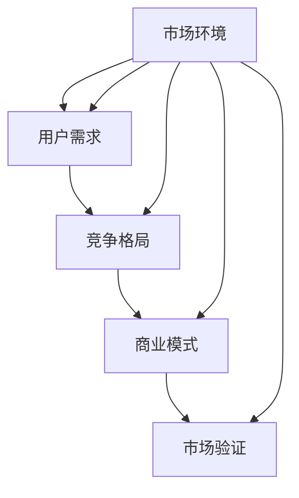

                 

# 市场分析框架：创业成功的指南

> 关键词：市场分析, 创业成功, 竞争分析, 用户需求, 策略制定

## 1. 背景介绍

### 1.1 问题由来
在创业过程中，如何准确地理解市场环境和把握用户需求是决定创业成败的关键。市场分析作为一项基础性工作，贯穿于创业的每个阶段，从早期创意的验证到最终的商业模式构建，市场分析框架都能提供强有力的支持。但面对复杂多变的市场环境，很多创业者往往感到无从下手，甚至在前期花费大量时间和资源投入市场调研，最终仍未能制定出有效的商业策略。因此，本博文旨在系统性地介绍一套完整的市场分析框架，帮助创业者更好地理解市场、把握机会，为创业成功提供有力保障。

### 1.2 问题核心关键点
本文将围绕以下核心关键点展开讨论：
1. 市场环境的综合分析
2. 用户需求的深度挖掘
3. 竞争格局的动态解析
4. 商业模式的策略制定
5. 市场验证的迭代优化

通过系统性的分析和指导，帮助创业者构建坚实的市场分析基础，在激烈的市场竞争中脱颖而出。

### 1.3 问题研究意义
市场分析框架的构建对于创业公司的健康发展具有重要的意义：
1. 降低决策风险：通过全面的市场分析，减少对市场情况的误判，降低决策风险。
2. 提升资源利用效率：明确目标市场和用户需求，避免资源浪费。
3. 增强竞争力：深入理解市场动态和竞争格局，制定出差异化的商业策略。
4. 加速迭代优化：定期回顾和调整市场分析结果，持续优化商业模式。
5. 实现可持续增长：构建可持续的市场分析和产品迭代机制，保障长期发展。

## 2. 核心概念与联系

### 2.1 核心概念概述

本节将介绍几个关键的市场分析概念，以便后续内容更好地理解和应用：

- **市场环境**：市场环境是指影响市场运行的各种外部因素，包括政治、经济、社会、技术等。理解市场环境有助于把握宏观背景下的市场机会和风险。
- **用户需求**：用户需求是指目标用户群体的具体需求和痛点，包括功能需求、情感需求、价值需求等。明确用户需求有助于制定符合用户期望的产品策略。
- **竞争格局**：竞争格局是指市场中各竞争主体的地位、优劣势、市场份额等。深入分析竞争格局有助于找到自身的差异化竞争点。
- **商业模式**：商业模式是指产品或服务从研发、生产到销售的全生命周期流程，包括价值主张、收入模式、盈利方式等。制定合理的商业模式是创业成功的关键。
- **市场验证**：市场验证是指通过市场反馈和数据分析，验证商业模式和产品策略的有效性，发现问题和改进方向。

这些概念之间存在紧密联系，共同构成市场分析框架的基石。例如，市场环境分析提供了宏观背景，用户需求分析揭示了市场机会，竞争格局分析识别了竞争优势，商业模式策略制定了具体的业务目标，市场验证则对前述分析进行持续迭代和优化。

### 2.2 概念间的关系

以下是一个简化的Mermaid流程图，展示市场分析框架中各核心概念的关系：



这个流程图展示了市场分析框架中各概念的相互作用和关联：

1. 市场环境影响用户需求，进而影响竞争格局和商业模式。
2. 竞争格局和用户需求是商业模式制定的重要依据。
3. 市场验证结果对市场环境和商业模式进行迭代修正。

## 3. 核心算法原理 & 具体操作步骤

### 3.1 算法原理概述

市场分析框架的核心算法原理主要包括数据收集与处理、趋势分析、用户需求分析、竞争格局分析和商业模式制定等。这些算法通常基于统计学、计量经济学、机器学习等方法，旨在从海量数据中挖掘出有用的信息，支持决策制定。

### 3.2 算法步骤详解

市场分析框架的实际操作可以分为以下步骤：

**Step 1: 数据收集与处理**
- 从公开数据源和用户调研中收集市场环境数据，包括经济指标、政策法规、社会趋势等。
- 进行数据清洗和预处理，去除噪音数据，确保数据质量。

**Step 2: 趋势分析**
- 使用时间序列分析方法，如ARIMA模型、指数平滑法等，对市场环境数据进行趋势预测。
- 结合统计指标，如均值、方差、标准差等，评估市场变化趋势的稳定性。

**Step 3: 用户需求分析**
- 采用问卷调查、用户访谈、焦点小组等方法，收集用户需求数据。
- 使用文本分析技术，如NLP、情感分析等，对用户反馈进行情感和主题分类。
- 通过聚类分析和关联规则挖掘，识别出用户群体的共性需求和差异化需求。

**Step 4: 竞争格局分析**
- 收集竞争对手的公开数据，包括市场份额、产品特色、用户评价等。
- 进行竞争分析，识别主要竞争对手和潜在威胁。
- 使用SWOT分析法，评估自身优势、劣势、机会和威胁。

**Step 5: 商业模式制定**
- 基于用户需求和竞争格局分析结果，设计产品的核心功能和价值主张。
- 确定收入模式、成本结构、盈利方式等关键要素。
- 制定具体的业务策略和运营计划。

**Step 6: 市场验证**
- 通过MVP（最小可行产品）测试，收集市场反馈。
- 利用A/B测试、用户行为数据分析等方法，验证商业模式的有效性。
- 根据市场验证结果，调整和优化商业模式。

### 3.3 算法优缺点

市场分析框架的优势在于其系统性和科学性，能从多个维度全面分析市场，制定出合理有效的商业策略。但其缺点也较为明显：

**优点**
1. **系统性**：通过多维度、多层次的分析，全面把握市场环境。
2. **科学性**：采用统计学和计量经济学等方法，提高分析的准确性。
3. **可操作性**：提供具体的步骤和方法，便于实际操作和落地。

**缺点**
1. **数据依赖性强**：需要大量的高质量数据，获取数据的过程耗时且复杂。
2. **技术门槛高**：需要具备一定的数据分析和统计学知识，才能有效应用分析结果。
3. **动态调整困难**：市场环境变化快速，框架需要定期更新和调整。

### 3.4 算法应用领域

市场分析框架在多个领域都有广泛应用，如互联网产品开发、电子商务、金融投资、旅游服务、教育培训等。这些领域都面临着复杂多变的市场环境，需要系统性的市场分析来指导决策。

## 4. 数学模型和公式 & 详细讲解 & 举例说明

### 4.1 数学模型构建

本节将介绍几个常用的数学模型和公式，以便更好地理解和应用市场分析框架。

#### 4.1.1 时间序列分析
时间序列分析是市场分析中常用的方法，用于预测市场趋势和周期性变化。常用的数学模型包括ARIMA和指数平滑法。

**ARIMA模型**：ARIMA模型由自回归模型（AR）、差分（I）和移动平均模型（MA）三部分组成，用于处理时间序列数据。模型表达式如下：

$$
ARIMA(p, d, q) = \phi(L)^p (1 - L)^d \theta(L)^q y_t = \epsilon_t
$$

其中，$L$ 表示滞后算子，$y_t$ 表示时间$t$的观测值，$p$、$d$、$q$分别为模型的自回归阶数、差分阶数和移动平均阶数。

**指数平滑法**：指数平滑法是一种简单有效的时间序列预测方法，根据历史数据对未来趋势进行平滑预测。常用的数学公式为：

$$
\hat{y}_{t+1} = \alpha y_t + (1 - \alpha) \hat{y}_t
$$

其中，$\alpha$ 为平滑系数，$y_t$ 为时间$t$的观测值，$\hat{y}_t$ 为时间$t$的预测值。

#### 4.1.2 用户需求分析
用户需求分析常用文本分析技术，如自然语言处理（NLP）和情感分析。

**NLP**：通过文本处理技术，将用户反馈转化为结构化数据，便于后续分析。常用的数学模型包括TF-IDF和Word2Vec等。

**情感分析**：通过情感分析技术，识别用户反馈中的情感倾向，如正面、负面、中性等。常用的数学模型包括LDA和BERT等。

#### 4.1.3 竞争格局分析
竞争格局分析常用市场份额和SWOT分析法。

**市场份额**：市场份额表示某一产品或服务在市场中的占有比例。常用的数学模型包括加权平均和市场集中度指数等。

**SWOT分析法**：SWOT分析法用于评估竞争优势、劣势、机会和威胁。常用的数学模型包括SWOT矩阵和ROC曲线等。

### 4.2 公式推导过程

本节将对部分常用的数学模型进行公式推导，以便更好地理解其原理和应用。

#### 4.2.1 ARIMA模型推导
ARIMA模型是一种时间序列分析模型，用于预测市场趋势和周期性变化。模型的基本假设是时间序列数据具有自相关性和周期性。

**自回归模型（AR）**：自回归模型假设时间序列数据具有一定的自相关性，即过去的时间点对当前点有影响。模型表达式如下：

$$
y_t = \alpha y_{t-1} + \epsilon_t
$$

其中，$y_t$ 表示时间$t$的观测值，$y_{t-1}$ 表示时间$t-1$的观测值，$\alpha$ 表示自回归系数，$\epsilon_t$ 表示随机误差。

**差分（I）**：差分操作用于处理非平稳的时间序列数据，使其变得平稳。常用的差分方式包括一阶差分和二阶差分。模型表达式如下：

$$
y_t^* = y_t - y_{t-1}
$$

其中，$y_t^*$ 表示时间$t$的差分值，$y_t$ 表示时间$t$的观测值，$y_{t-1}$ 表示时间$t-1$的观测值。

**移动平均模型（MA）**：移动平均模型假设时间序列数据具有一定的随机性，即过去的时间点对当前点的影响是随机的。模型表达式如下：

$$
\epsilon_t = \sigma \epsilon_{t-1} + \epsilon_t
$$

其中，$\epsilon_t$ 表示时间$t$的随机误差，$\sigma$ 表示随机误差标准差。

**ARIMA模型**：将自回归模型、差分模型和移动平均模型结合起来，即可构成ARIMA模型。模型表达式如下：

$$
ARIMA(p, d, q) = \phi(L)^p (1 - L)^d \theta(L)^q y_t = \epsilon_t
$$

其中，$L$ 表示滞后算子，$y_t$ 表示时间$t$的观测值，$p$、$d$、$q$分别为模型的自回归阶数、差分阶数和移动平均阶数。

#### 4.2.2 指数平滑法推导
指数平滑法是一种简单有效的时间序列预测方法，用于平滑历史数据并预测未来趋势。常用的数学公式为：

$$
\hat{y}_{t+1} = \alpha y_t + (1 - \alpha) \hat{y}_t
$$

其中，$\hat{y}_{t+1}$ 表示时间$t+1$的预测值，$y_t$ 表示时间$t$的观测值，$\alpha$ 表示平滑系数，$0 \leq \alpha \leq 1$。

### 4.3 案例分析与讲解

#### 4.3.1 案例背景
某创业公司准备推出一款智能健身产品，需要进行详细的市场分析，以便制定合理的商业模式和市场策略。

#### 4.3.2 市场环境分析
通过收集政府政策、经济指标、人口统计等数据，进行分析并预测未来市场趋势。使用ARIMA模型对健身行业未来的市场规模进行预测，指数平滑法对宏观经济环境进行趋势预测。

#### 4.3.3 用户需求分析
通过问卷调查和用户访谈，收集健身用户的痛点和需求。使用NLP技术对用户反馈进行情感和主题分类，使用LDA模型识别出主要用户群体的共性需求和差异化需求。

#### 4.3.4 竞争格局分析
收集主要竞争对手的数据，包括市场份额、产品特色、用户评价等。使用SWOT分析法评估自身优势、劣势、机会和威胁，使用ROC曲线分析法的市场集中度指数计算竞争对手的市场份额。

#### 4.3.5 商业模式制定
基于用户需求和竞争格局分析结果，设计产品的核心功能和价值主张。确定收入模式、成本结构、盈利方式等关键要素，制定具体的业务策略和运营计划。

#### 4.3.6 市场验证
通过MVP测试，收集市场反馈。利用A/B测试、用户行为数据分析等方法，验证商业模式的有效性。根据市场验证结果，调整和优化商业模式。

## 5. 项目实践：代码实例和详细解释说明

### 5.1 开发环境搭建

在进行市场分析实践前，需要先准备好开发环境。以下是使用Python进行Pandas、Numpy、Matplotlib等库进行市场分析的开发环境配置流程：

1. 安装Anaconda：从官网下载并安装Anaconda，用于创建独立的Python环境。

2. 创建并激活虚拟环境：
```bash
conda create -n market-analysis python=3.8 
conda activate market-analysis
```

3. 安装必要的库：
```bash
conda install pandas numpy matplotlib scikit-learn seaborn jupyter notebook ipython
```

4. 安装Python包管理器：
```bash
pip install pipenv
```

完成上述步骤后，即可在`market-analysis`环境中开始市场分析实践。

### 5.2 源代码详细实现

这里我们以市场环境分析和用户需求分析为例，给出使用Python进行市场分析的代码实现。

首先，导入必要的库：

```python
import pandas as pd
import numpy as np
import matplotlib.pyplot as plt
import seaborn as sns
from sklearn.decomposition import LatentDirichletAllocation
from sklearn.feature_extraction.text import CountVectorizer
from statsmodels.tsa.arima_model import ARIMA
```

然后，加载和处理数据：

```python
# 加载市场环境数据
market_data = pd.read_csv('market_data.csv')
# 数据清洗和预处理
market_data = market_data.dropna()
market_data = market_data.fillna(method='ffill')

# 加载用户需求数据
user_feedback = pd.read_csv('user_feedback.csv')
# 数据清洗和预处理
user_feedback = user_feedback.dropna()
user_feedback = user_feedback.fillna(method='ffill')

# 进行时间序列分析
model = ARIMA(market_data['market_size'], order=(1, 1, 1))
model_fit = model.fit()

# 绘制时间序列图
plt.plot(market_data['market_size'])
plt.plot(model_fit.fittedvalues, color='red')
plt.legend(['Observed', 'Predicted'])
plt.show()

# 进行用户需求分析
vectorizer = CountVectorizer(stop_words='english')
X = vectorizer.fit_transform(user_feedback['feedback'])
lda = LatentDirichletAllocation(n_components=5, random_state=42)
lda.fit(X)
# 绘制主题分布图
plt.bar(lda.components_[0])
plt.show()
```

最后，输出结果：

```python
# 输出时间序列分析结果
print(model_fit.summary())

# 输出用户需求分析结果
topics = ['Topic ' + str(i) for i in range(lda.n_components)]
plt.bar(topics, np.sum(lda.transform(X), axis=1))
plt.show()
```

### 5.3 代码解读与分析

这里我们详细解读一下关键代码的实现细节：

**加载和处理数据**：
- `pd.read_csv`：使用pandas库加载市场环境和用户需求数据。
- `dropna`和`fillna`：使用pandas库对数据进行清洗和处理，去除缺失值和异常值。

**时间序列分析**：
- `ARIMA`：使用statsmodels库的ARIMA模型进行时间序列分析。
- `model_fit.fit()`：训练模型并输出结果。
- `plt.plot`：使用matplotlib库绘制时间序列图，对比原始数据和模型预测值。

**用户需求分析**：
- `CountVectorizer`：使用sklearn库的CountVectorizer对用户反馈数据进行分词和向量化。
- `LatentDirichletAllocation`：使用sklearn库的LatentDirichletAllocation进行主题分析。
- `plt.bar`：使用matplotlib库绘制主题分布图，展示不同主题的反馈数量。

**输出结果**：
- `model_fit.summary()`：输出时间序列分析模型的结果。
- `plt.bar`：输出用户需求分析的主题分布图。

通过这些代码示例，可以看出Python在进行市场分析时的高效和灵活性，开发者可以快速构建和调整市场分析模型，得到有用的分析结果。

## 6. 实际应用场景

市场分析框架在实际应用中有着广泛的应用场景，包括但不限于：

### 6.1 智能健身产品

市场分析框架可以帮助创业公司了解健身行业的市场趋势，识别目标用户的痛点和需求，评估主要竞争对手的市场份额和优劣势。通过详细的市场分析，创业公司可以制定出合理的商业模式，优化产品功能和价值主张，从而提升市场竞争力。

### 6.2 在线教育平台

在线教育平台需要深入了解目标用户的学习需求和行为，识别市场机会和竞争态势。通过市场分析框架，平台可以设计出更符合用户需求的产品，制定出差异化的商业策略，优化课程内容和教学方法，提升用户体验和留存率。

### 6.3 电子商务平台

电子商务平台需要掌握市场动态和用户行为，制定出有效的市场营销策略和运营计划。通过市场分析框架，平台可以了解用户偏好和购买行为，优化商品推荐算法，提高转化率和用户满意度。

## 7. 工具和资源推荐

### 7.1 学习资源推荐

为了帮助开发者掌握市场分析的理论与实践，这里推荐一些优质的学习资源：

1. **《市场分析与决策》**：一本系统介绍市场分析理论和方法的书籍，涵盖了时间序列分析、用户需求分析、竞争格局分析等内容。
2. **Coursera《市场分析与商业战略》课程**：由宾夕法尼亚大学沃顿商学院提供，涵盖市场分析的基本理论和实际应用。
3. **edX《大数据分析与商业智能》课程**：由哈佛大学提供，涵盖大数据技术和市场分析方法。
4. **Kaggle《市场分析竞赛》**：通过参与市场分析竞赛，实战练习市场分析技能。
5. **PapersWithCode**：跟踪市场分析领域的最新研究进展，了解前沿技术和应用案例。

### 7.2 开发工具推荐

在进行市场分析时，选择合适的工具能够大幅提高效率。以下是几款常用的市场分析开发工具：

1. **Pandas**：一个强大的数据处理库，支持多种数据格式和操作，是市场分析中不可或缺的工具。
2. **Numpy**：一个高性能的数值计算库，支持数组操作和科学计算，用于处理和分析大量数据。
3. **Matplotlib**：一个用于绘制图表的库，支持多种图表类型和样式。
4. **Scikit-learn**：一个机器学习库，包含多种算法和工具，用于数据分析和建模。
5. **TensorFlow**：一个深度学习框架，支持神经网络建模和训练，用于处理复杂数据结构。

### 7.3 相关论文推荐

市场分析框架的发展源于学界的持续研究。以下是几篇奠基性的相关论文，推荐阅读：

1. **《时间序列分析与预测》**：介绍了时间序列分析的基本方法和应用场景。
2. **《用户需求分析与建模》**：介绍了用户需求分析的理论和方法，涵盖情感分析、主题建模等内容。
3. **《竞争格局分析与策略制定》**：介绍了竞争格局分析的理论和方法，涵盖市场份额分析、SWOT分析等内容。
4. **《大数据市场分析》**：介绍了大数据技术和市场分析方法，涵盖数据处理、算法建模等内容。
5. **《多维数据分析与市场预测》**：介绍了多维数据分析和市场预测的方法，涵盖数据挖掘、机器学习等内容。

这些论文代表了大市场分析领域的发展脉络，通过学习这些前沿成果，可以帮助研究者把握学科前进方向，激发更多的创新灵感。

## 8. 总结：未来发展趋势与挑战

### 8.1 总结

本文对市场分析框架进行了系统性的介绍，涵盖市场环境的综合分析、用户需求的深度挖掘、竞争格局的动态解析、商业模式的策略制定和市场验证的迭代优化等核心内容。通过本博文的学习和实践，相信读者能够全面掌握市场分析的基本方法和应用技巧，为创业成功提供有力的保障。

### 8.2 未来发展趋势

市场分析框架的未来发展趋势包括以下几个方面：

1. **自动化与智能化**：通过引入机器学习和人工智能技术，自动化市场分析过程，提升分析效率和准确性。
2. **多维度数据分析**：结合多源数据和多种分析方法，全面把握市场动态和用户需求。
3. **实时化与动态化**：实时更新市场数据，动态调整分析模型和策略，适应快速变化的市场环境。
4. **跨领域应用**：将市场分析框架应用到更多领域，如金融、医疗、农业等，提升跨领域应用能力。
5. **数据隐私与伦理**：重视数据隐私保护和伦理问题，建立合规的市场分析机制。

### 8.3 面临的挑战

市场分析框架在应用过程中也面临一些挑战：

1. **数据获取难度**：高质量的市场数据获取难度较大，数据质量也难以保证。
2. **技术门槛高**：市场分析涉及多种技术和工具，需要具备较高的技术门槛。
3. **动态调整复杂**：市场环境变化快速，需要频繁更新和调整分析模型和策略。
4. **结果解释性差**：分析结果难以解释，用户难以理解和使用。
5. **伦理与安全问题**：市场分析涉及大量用户数据，存在数据隐私和伦理风险。

### 8.4 研究展望

面对市场分析框架面临的挑战，未来的研究需要在以下几个方面寻求新的突破：

1. **数据自动获取与处理**：开发自动数据采集和处理工具，提升数据获取和处理效率。
2. **智能化分析模型**：开发基于深度学习和大数据的智能化分析模型，提升分析准确性和自动化水平。
3. **动态调整机制**：设计动态调整机制，实现市场环境的实时更新和分析策略的灵活调整。
4. **结果可解释性**：引入可解释性技术，如模型可视化和因果分析，提高分析结果的可解释性和用户理解度。
5. **伦理与隐私保护**：建立合规的市场分析机制，重视数据隐私保护和伦理问题，确保分析过程的透明和安全。

这些研究方向将进一步推动市场分析框架的成熟和应用，为创业公司提供更全面的市场支持，助力其健康发展。

## 9. 附录：常见问题与解答

**Q1：市场分析框架是否适用于所有行业？**

A: 市场分析框架适用于绝大多数行业，特别是那些对市场动态和用户需求依赖性较强的行业。但不同行业的市场环境、用户需求和竞争格局各不相同，应用时需要根据行业特点进行调整和优化。

**Q2：如何进行市场环境的综合分析？**

A: 市场环境的综合分析主要通过收集和处理宏观经济、政策法规、社会趋势等数据，使用时间序列分析、趋势预测等方法进行分析。常见的工具包括ARIMA模型、指数平滑法等。

**Q3：如何评估市场环境的稳定性？**

A: 市场环境的稳定性可以通过统计指标，如均值、方差、标准差等进行评估。如果市场环境数据波动较大，可能需要使用更复杂的模型，如ARIMA模型，进行趋势预测和周期性分析。

**Q4：如何识别用户需求？**

A: 用户需求识别可以通过问卷调查、用户访谈、焦点小组等方法收集数据。使用NLP技术和情感分析技术，对用户反馈进行情感和主题分类，使用主题模型（如LDA）进行需求分析。

**Q5：如何进行竞争格局分析？**

A: 竞争格局分析主要通过收集竞争对手的市场份额、产品特色、用户评价等数据，使用SWOT分析法评估自身的优势、劣势、机会和威胁。使用市场集中度指数计算竞争对手的市场份额，了解竞争态势。

通过上述问答，相信读者能够更好地理解市场分析框架的各个方面，为创业成功提供有力的理论基础和技术支持。

---

作者：禅与计算机程序设计艺术 / Zen and the Art of Computer Programming

