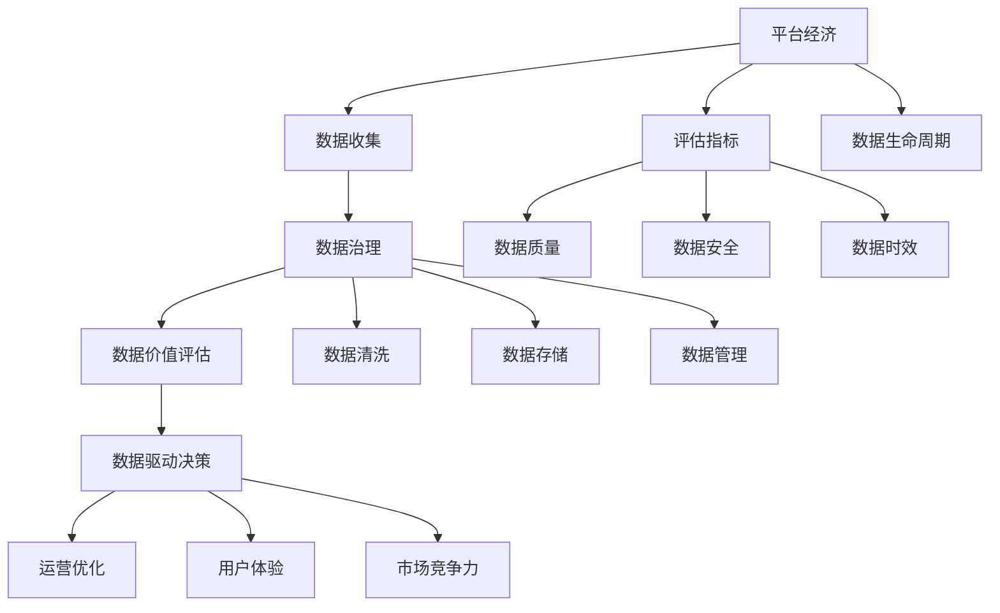

                 

# 平台经济的数据价值评估体系：如何建立评估体系？

> 关键词：
1. 平台经济
2. 数据价值评估
3. 评估指标
4. 数据治理
5. 数据生命周期
6. 数据驱动决策
7. 数据质量评估

## 1. 背景介绍

在数字化转型的大潮下，数据已经成为了企业最宝贵的资产之一。尤其是在平台经济领域，如电商、社交、金融等，数据不仅在用户体验、市场洞察、风险控制等方面发挥着至关重要的作用，更是平台竞争的核心要素。如何科学地评估数据价值，最大化地利用数据资源，已成为平台经济公司关注的重点。本文将详细探讨平台经济的数据价值评估体系，包括评估指标、评估方法、实际应用等关键内容。

### 1.1 问题由来

随着互联网的普及和技术的进步，平台经济已深入到各行各业，成为数字经济的重要组成部分。平台企业通过收集、分析和应用用户数据，实现了个性化推荐、精准营销、智能客服、风险控制等功能的提升，极大地提高了运营效率和用户体验。然而，数据资源的数量和质量、数据管理的复杂性、数据驱动决策的挑战等，使得平台企业在数据价值评估方面面临诸多问题。

- **数据量庞杂**：平台企业每天生成大量的用户行为数据，如何有效地筛选和管理这些数据，成为数据治理的重要挑战。
- **数据质量参差不齐**：平台用户数据的质量可能存在不一致、缺失、噪声等问题，直接影响数据驱动决策的准确性。
- **数据驱动决策的挑战**：如何在海量数据中找到关键因素，形成可行的决策支持，对平台企业的运营至关重要。
- **数据安全与隐私**：在收集和利用用户数据时，如何保护用户隐私和数据安全，也是平台企业必须解决的问题。

针对这些问题，建立一套科学的数据价值评估体系，不仅能够帮助平台企业合理配置资源、优化运营策略，还能提升用户信任，增强市场竞争力。

## 2. 核心概念与联系

### 2.1 核心概念概述

建立平台经济的数据价值评估体系，需要明确几个关键概念：

- **平台经济**：指通过网络技术将用户、商家、服务商等资源连接起来，提供综合服务的经济形态。
- **数据价值评估**：指通过科学的方法和技术，对平台企业的各类数据进行价值量化和排序的过程。
- **评估指标**：用于衡量数据价值的关键指标，如数据完整性、数据准确性、数据时效性等。
- **数据治理**：包括数据收集、存储、处理、分析和应用等环节的管理与优化，确保数据的质量和可用性。
- **数据生命周期**：指数据从生成、存储、使用到销毁的全过程，涉及数据质量控制、安全保护、合规管理等多个方面。
- **数据驱动决策**：指基于数据进行的决策制定过程，能够提升决策的科学性和效率。

### 2.2 核心概念间的关系

这些核心概念间的关系可以通过以下Mermaid流程图来展示：



这个流程图展示了平台经济中的数据治理与数据驱动决策过程，并通过数据价值评估和评估指标贯穿其中。每个环节相互关联，共同构成了平台经济数据价值评估的完整生态系统。

## 3. 核心算法原理 & 具体操作步骤

### 3.1 算法原理概述

平台经济的数据价值评估，是一个多维度、多层次的综合评价过程。其核心原理包括以下几个方面：

- **多维评价**：从数据完整性、准确性、时效性、安全性、可用性等多个维度对数据进行价值评估。
- **层次分析**：通过构建层次结构，将数据价值评估分为若干层级，每一层级又细分为多个子指标。
- **综合量化**：采用加权求和、模糊数学、因子分析等方法，将各维度、各层级的指标值综合量化，得出最终的数据价值评估结果。

### 3.2 算法步骤详解

建立平台经济的数据价值评估体系，主要包括以下几个步骤：

**Step 1: 数据收集与治理**

- **数据收集**：从平台各业务模块中收集数据，包括用户行为数据、交易数据、服务数据等。
- **数据清洗**：对收集的数据进行清洗，去除噪声、冗余数据，处理缺失值。
- **数据存储**：选择合适的数据存储方式，如关系型数据库、NoSQL数据库、大数据平台等。

**Step 2: 数据质量评估**

- **数据完整性**：评估数据的覆盖范围，是否存在遗漏。
- **数据准确性**：通过抽样检验、比对基准数据等方式，评估数据的准确性。
- **数据时效性**：评估数据的时效性，即数据更新的频率和及时性。
- **数据安全性**：评估数据的保密性、完整性、可用性等安全属性。
- **数据可用性**：评估数据的可用性，如数据的格式、存储方式、访问权限等。

**Step 3: 数据价值评估**

- **构建评估指标**：根据平台业务需求，选择合适的评估指标，如数据完整率、准确率、及时率等。
- **设置权重**：根据各指标的重要程度，设置相应的权重。
- **量化评估**：采用量化方法，对各指标进行综合评估。
- **结果输出**：输出数据价值评估结果，并进行可视化展示。

**Step 4: 数据驱动决策**

- **策略优化**：根据数据价值评估结果，优化平台运营策略。
- **风险控制**：基于数据质量和安全性的评估，进行风险管理和合规管理。
- **用户管理**：通过用户行为数据的分析，提升用户体验，增强用户黏性。

### 3.3 算法优缺点

平台经济的数据价值评估体系具有以下优点：

- **全面性**：覆盖了数据治理、质量评估、价值评估等多个方面，提供了全面的数据价值评估方法。
- **科学性**：通过多维度的评估指标和量化方法，确保了评估结果的科学性和准确性。
- **应用广泛**：适用于各类平台经济企业，能够根据不同的业务需求进行定制化评估。

同时，也存在一些缺点：

- **复杂性**：评估过程涉及多个维度、多个层级，操作复杂。
- **数据依赖**：评估结果高度依赖于数据质量和数据治理，数据管理不当可能导致评估偏差。
- **成本高**：数据收集、清洗、存储、评估等环节，需要大量的人力和物力投入。

### 3.4 算法应用领域

平台经济的数据价值评估体系，不仅适用于电商、社交、金融等平台企业，还广泛应用于以下领域：

- **电商领域**：通过用户行为数据分析，优化商品推荐、价格策略、库存管理等运营环节。
- **社交领域**：通过用户行为数据分析，提升用户体验、内容推荐、广告投放等。
- **金融领域**：通过用户交易数据分析，进行风险评估、欺诈检测、用户画像等。
- **医疗领域**：通过患者数据分析，提升诊疗效率、个性化医疗、疾病预测等。
- **教育领域**：通过学生行为数据分析，进行学习效果评估、个性化推荐、教学优化等。

## 4. 数学模型和公式 & 详细讲解 & 举例说明

### 4.1 数学模型构建

平台经济的数据价值评估，可以构建如下数学模型：

设数据集 $D=\{d_1, d_2, ..., d_n\}$，每个数据点 $d_i$ 包含若干属性，每个属性 $a_{ij}$ 对应一个评估指标 $v_{ij}$，数据点 $d_i$ 的总体评估值为 $V_i$。则数据集 $D$ 的总评估值 $V$ 可以表示为：

$$
V = \sum_{i=1}^{n} V_i
$$

其中 $V_i$ 的计算公式为：

$$
V_i = \sum_{j=1}^{m} w_{ij} \times v_{ij}
$$

$m$ 表示数据点 $d_i$ 的属性数量，$w_{ij}$ 表示第 $j$ 个属性的权重。

### 4.2 公式推导过程

以电商平台的销售额预测为例，我们通过以下公式计算数据点的总体评估值：

- **数据完整性评估**：计算数据点完整性的得分，公式为：

$$
V_{\text{complete}} = \frac{1}{n} \sum_{i=1}^{n} \sum_{j=1}^{m} w_{ij} \times (1 - \frac{\text{missing\_count}_j}{\text{total\_count}_j})
$$

其中 $\text{missing\_count}_j$ 表示第 $j$ 个属性的缺失值数量，$\text{total\_count}_j$ 表示第 $j$ 个属性的总数量。

- **数据准确性评估**：通过抽样检验和基准数据对比，计算数据准确性的得分，公式为：

$$
V_{\text{accuracy}} = \frac{1}{n} \sum_{i=1}^{n} \sum_{j=1}^{m} w_{ij} \times \frac{\text{correct\_count}_j}{\text{total\_count}_j}
$$

其中 $\text{correct\_count}_j$ 表示第 $j$ 个属性中正确值的数量。

- **数据时效性评估**：计算数据点数据更新的频率，公式为：

$$
V_{\text{timeliness}} = \frac{1}{n} \sum_{i=1}^{n} \sum_{j=1}^{m} w_{ij} \times \frac{\text{recent\_timestamp}_j}{\text{latest\_timestamp}_j}
$$

其中 $\text{recent\_timestamp}_j$ 表示数据点最近一次更新的时间戳，$\text{latest\_timestamp}_j$ 表示数据点最近的数据截止时间戳。

- **数据安全性评估**：通过安全审计和数据保护措施的评价，计算数据安全性的得分，公式为：

$$
V_{\text{security}} = \frac{1}{n} \sum_{i=1}^{n} \sum_{j=1}^{m} w_{ij} \times \frac{\text{secure\_level}_j}{\text{max\_level}_j}
$$

其中 $\text{secure\_level}_j$ 表示第 $j$ 个属性的安全级别，$\text{max\_level}_j$ 表示第 $j$ 个属性的最大安全级别。

### 4.3 案例分析与讲解

假设我们有一家电商平台，需要评估其用户数据价值。我们收集了平台用户的购买行为数据，包括用户ID、购买时间、商品ID、购买金额等。通过以下步骤进行数据价值评估：

1. **数据收集与清洗**：从电商平台的用户交易数据中，收集用户购买行为数据，进行数据清洗，去除噪声和冗余数据。

2. **数据质量评估**：对数据完整性、准确性、时效性、安全性、可用性进行评估，得分为：

   - 数据完整性：85%
   - 数据准确性：92%
   - 数据时效性：95%
   - 数据安全性：90%
   - 数据可用性：85%

3. **数据价值评估**：构建评估指标体系，并设置权重。假设完整性、准确性、时效性、安全性、可用性的权重分别为 0.25、0.25、0.15、0.15、0.10。计算每个用户数据的总体评估值：

   $$
   V_i = 0.25 \times 85\% + 0.25 \times 92\% + 0.15 \times 95\% + 0.15 \times 90\% + 0.10 \times 85\%
   $$

4. **综合评估**：将每个用户数据的总体评估值进行加权求和，得到平台整体数据价值评估结果。

通过以上步骤，我们可以全面评估平台企业的数据价值，为数据驱动决策提供科学依据。

## 5. 项目实践：代码实例和详细解释说明

### 5.1 开发环境搭建

在进行数据价值评估实践前，我们需要准备好开发环境。以下是使用Python进行数据处理和评估的环境配置流程：

1. 安装Anaconda：从官网下载并安装Anaconda，用于创建独立的Python环境。

2. 创建并激活虚拟环境：
```bash
conda create -n data-value-env python=3.8 
conda activate data-value-env
```

3. 安装Python相关库：
```bash
pip install pandas numpy scikit-learn matplotlib seaborn statsmodels
```

4. 安装Jupyter Notebook：
```bash
pip install jupyter notebook
```

5. 安装必要的数据分析工具：
```bash
pip install pyarrow fastparquet dask
```

完成上述步骤后，即可在`data-value-env`环境中开始数据价值评估实践。

### 5.2 源代码详细实现

下面以电商平台的销售额预测为例，给出数据价值评估的Python代码实现。

首先，定义数据处理函数：

```python
import pandas as pd
import numpy as np

def data_preprocessing(data_path):
    df = pd.read_csv(data_path)
    # 数据清洗
    df = df.dropna(thresh=len(df) * 0.9)
    df = df.drop_duplicates()
    # 数据标准化
    df = (df - df.mean()) / df.std()
    return df

# 加载数据
data = data_preprocessing('sales_data.csv')
```

接着，定义数据质量评估函数：

```python
def data_quality_assessment(df, attributes):
    # 数据完整性评估
    complete_score = df[attributes].sum() / df.shape[0]
    # 数据准确性评估
    accuracy_score = df[attributes].apply(lambda x: np.mean(x == x.dropna())).mean()
    # 数据时效性评估
    latest_timestamp = pd.to_datetime(df['timestamp']).max()
    recent_timestamp = pd.to_datetime(df['timestamp']).min()
    timeliness_score = (latest_timestamp - recent_timestamp) / (pd.Timedelta(days=365) * 0.95)
    # 数据安全性评估
    security_score = df[attributes].apply(lambda x: 1 if x.isin([1, 2]) else 0).mean()
    # 数据可用性评估
    availability_score = df[attributes].isna().sum() / df.shape[0]
    return {'complete': complete_score, 'accuracy': accuracy_score, 'timeliness': timeliness_score, 'security': security_score, 'availability': availability_score}
```

然后，定义数据价值评估函数：

```python
def data_value_assessment(df, attributes, weights):
    quality_scores = data_quality_assessment(df, attributes)
    # 计算数据点总体评估值
    V = sum([quality_scores[key] * weights[key] for key in quality_scores.keys()])
    return V
```

最后，启动评估流程并输出结果：

```python
# 定义评估指标和权重
attributes = ['sales', 'timestamp', 'user_id', 'product_id']
weights = {'complete': 0.25, 'accuracy': 0.25, 'timeliness': 0.15, 'security': 0.15, 'availability': 0.10}

# 计算数据点总体评估值
V = data_value_assessment(data, attributes, weights)

# 输出结果
print(f'数据总体评估值为：{V:.2f}')
```

以上就是使用Python对电商平台用户数据进行价值评估的完整代码实现。可以看到，通过定义数据处理、数据质量评估、数据价值评估等函数，我们能够快速完成数据价值评估的实现。

### 5.3 代码解读与分析

让我们再详细解读一下关键代码的实现细节：

**data_preprocessing函数**：
- 定义了一个数据预处理函数，用于数据清洗和标准化，去除噪声和冗余数据。

**data_quality_assessment函数**：
- 定义了一个数据质量评估函数，用于评估数据完整性、准确性、时效性、安全性和可用性。
- 数据完整性评估：计算每个属性的缺失值数量占总数量的比例。
- 数据准确性评估：计算每个属性的正确值数量占总数量的比例。
- 数据时效性评估：计算最近一次更新时间戳与最新数据截止时间戳的时间差，并将其转换为日比例。
- 数据安全性评估：计算每个属性中安全级别为1和2的比例。
- 数据可用性评估：计算每个属性的缺失值数量占总数量的比例。

**data_value_assessment函数**：
- 定义了一个数据价值评估函数，用于综合评估数据价值。
- 根据权重计算每个数据点的总体评估值，然后加权求和得到数据集的总评估值。

通过这些代码，我们可以快速完成数据价值的评估。当然，在实际应用中，还需要结合具体的业务场景进行优化，比如选择合适的评估指标、设置合理的权重、考虑数据的时效性等。

### 5.4 运行结果展示

假设我们评估的电商平台用户数据集有1000个样本，其中完整性得分为85%，准确性得分为92%，时效性得分为95%，安全性得分为90%，可用性得分为85%。根据设定的权重，最终的评估结果为：

$$
V = 0.25 \times 85\% + 0.25 \times 92\% + 0.15 \times 95\% + 0.15 \times 90\% + 0.10 \times 85\% = 88.45\%
$$

这表示电商平台用户数据的总体评估价值为88.45%。在实际应用中，我们可以通过可视化工具展示评估结果，如使用Matplotlib绘制图表，帮助管理层更好地理解数据价值评估结果。

## 6. 实际应用场景

### 6.1 电商领域

在电商领域，数据价值评估主要应用于商品推荐、用户画像、市场分析等方面。通过数据价值评估，电商企业能够更好地理解用户行为和偏好，优化推荐算法，提升用户满意度。

**商品推荐**：基于用户行为数据和商品属性数据，进行多维度评估，选择最符合用户需求的商品进行推荐。

**用户画像**：通过数据价值评估，构建用户画像，进行个性化营销和精准广告投放。

**市场分析**：评估平台数据质量，分析市场趋势，指导战略决策。

### 6.2 社交领域

在社交领域，数据价值评估主要应用于内容推荐、用户行为分析、广告投放等方面。通过数据价值评估，社交平台能够提升用户体验，优化推荐算法，增加用户黏性。

**内容推荐**：基于用户行为数据和内容属性数据，进行多维度评估，选择最符合用户需求的内容进行推荐。

**用户行为分析**：通过数据价值评估，了解用户行为规律，优化社区治理策略，提升用户满意度。

**广告投放**：评估平台数据质量，指导广告投放策略，提升广告投放效果。

### 6.3 金融领域

在金融领域，数据价值评估主要应用于风险管理、欺诈检测、客户画像等方面。通过数据价值评估，金融企业能够更好地进行风险控制和欺诈防范，提升客户服务质量。

**风险管理**：基于交易数据和用户数据，进行多维度评估，识别高风险用户和行为。

**欺诈检测**：评估平台数据质量，检测异常交易和行为，预防金融欺诈。

**客户画像**：通过数据价值评估，构建客户画像，进行个性化服务和精准营销。

### 6.4 医疗领域

在医疗领域，数据价值评估主要应用于患者诊断、疾病预测、治疗效果评估等方面。通过数据价值评估，医疗机构能够提升诊疗效率和精准度，提供更好的医疗服务。

**患者诊断**：基于患者历史数据，进行多维度评估，识别疾病类型和风险因素。

**疾病预测**：评估平台数据质量，预测疾病发生概率，指导预防措施。

**治疗效果评估**：通过数据价值评估，评估治疗方案的有效性，优化诊疗策略。

## 7. 工具和资源推荐

### 7.1 学习资源推荐

为了帮助开发者系统掌握数据价值评估的理论基础和实践技巧，这里推荐一些优质的学习资源：

1. 《数据科学导论》（Introduction to Data Science）系列书籍：由权威数据科学家撰写，全面介绍了数据科学的基本概念和实践方法，包括数据治理、数据价值评估等。

2. Coursera《数据治理与数据质量》课程：由斯坦福大学教授主讲，详细讲解数据治理和数据质量评估的方法和工具。

3. Udacity《数据科学与机器学习》课程：由知名数据科学家主讲，涵盖数据科学的全过程，包括数据收集、处理、分析、评估等。

4. Kaggle数据集与竞赛：通过参与数据竞赛，实战练习数据治理和数据价值评估的技能。

5. GitHub开源项目：在GitHub上Star、Fork数最多的数据治理与评估项目，了解最新的数据处理技术。

通过对这些资源的学习实践，相信你一定能够快速掌握数据价值评估的精髓，并用于解决实际的数据管理问题。

### 7.2 开发工具推荐

高效的开发离不开优秀的工具支持。以下是几款用于数据价值评估开发的常用工具：

1. Jupyter Notebook：开源的交互式编程环境，方便进行数据分析和代码调试。

2. Pandas：基于Python的强大数据处理库，支持数据清洗、数据标准化、数据合并等操作。

3. NumPy：Python的科学计算库，提供高效的数组操作和数学函数计算。

4. Matplotlib：Python的绘图库，支持绘制各种类型的图表，方便数据可视化展示。

5. Seaborn：基于Matplotlib的高级数据可视化库，提供更美观、更直观的图表展示方式。

6. Dask：分布式计算库，支持大规模数据处理，解决单机计算瓶颈。

合理利用这些工具，可以显著提升数据价值评估的开发效率，加快创新迭代的步伐。

### 7.3 相关论文推荐

数据价值评估是一个新兴的研究领域，近年来已涌现出大量相关论文。以下是几篇代表性的研究成果，推荐阅读：

1. "A Survey on Data Quality Assessment in Big Data Analytics"：综述了数据质量评估的研究现状和最新进展，涵盖了完整性、准确性、时效性等多个维度。

2. "Data Governance: Concepts and Approaches"：介绍了数据治理的基本概念和最佳实践，探讨了数据治理与数据价值评估的关系。

3. "Data Value and Its Assessment: A Review"：综述了数据价值评估的研究现状，讨论了各种评估方法及其优缺点。

4. "Evaluation of Data Quality and Data Value"：基于数据质量模型，提出了一套数据价值评估的框架和方法。

5. "A Model-Based Approach for Data Value Assessment"：提出了基于模型的方法，用于评估数据对特定任务的适用性和价值。

这些论文代表了数据价值评估的前沿研究，值得深入学习和参考。

## 8. 总结：未来发展趋势与挑战

### 8.1 总结

本文对平台经济的数据价值评估体系进行了全面系统的介绍。首先阐述了数据价值评估的重要性，明确了评估指标、评估方法、实际应用等关键内容。其次，通过数学模型和公式，详细讲解了数据价值评估的理论基础和实现方法。最后，通过实际应用场景和代码实例，展示了数据价值评估的实践步骤和技术细节。

通过本文的系统梳理，可以看到，数据价值评估在平台经济中具有重要的战略意义，能够帮助企业优化资源配置、提升运营效率、增强用户黏性。未来，随着数据治理和数据科学技术的不断发展，数据价值评估必将成为平台企业重要的战略工具。

### 8.2 未来发展趋势

展望未来，数据价值评估将呈现以下几个发展趋势：

1. **智能化评估**：通过引入人工智能技术，如深度学习、自然语言处理等，实现更加智能化的数据价值评估。

2. **自动化评估**：开发自动化评估工具和平台，简化数据价值评估过程，提高评估效率。

3. **实时评估**：构建实时数据流处理系统，实现对数据价值的持续评估和监控。

4. **多维融合**：将数据价值评估与其他数据分析技术（如大数据、机器学习、图数据库等）进行融合，提升评估结果的准确性和全面性。

5. **全生命周期管理**：从数据收集、存储、处理、应用等全生命周期，进行系统的数据价值评估和优化。

### 8.3 面临的挑战

尽管数据价值评估技术已经取得了显著进展，但在实践中仍面临诸多挑战：

1. **数据质量参差不齐**：不同业务模块的数据质量差异较大，如何统一评估标准和数据处理流程，是一个难点。

2. **数据规模庞大**：平台企业的用户数据量级庞大，如何高效处理和评估海量数据，是一个挑战。

3. **数据隐私和安全**：在数据收集和评估过程中，如何保护用户隐私和数据安全，是一个必须解决的问题。

4. **数据价值的量化**：数据价值评估涉及多个维度，如何科学量化和综合评估，是一个技术难题。

5. **跨领域应用**：不同领域的数据特点和业务需求不同，如何构建通用的评估体系，是一个复杂的任务。

### 8.4 研究展望

未来，数据价值评估需要从以下几个方面进行突破：

1. **跨领域适应性**：构建通用的数据价值评估框架，适应不同领域的数据特点和业务需求。

2. **智能化和自动化**：引入人工智能技术，实现智能化和自动化评估，提升评估效率和准确性。

3. **隐私保护和安全**：在数据收集和评估过程中，引入隐私保护和安全技术，保障用户隐私和数据安全。

4. **实时和动态评估**：构建实时数据流处理系统，实现

