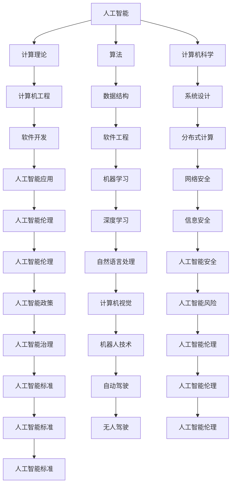

                 

# 1956年达特茅斯会议的宣言

> 关键词：人工智能,计算理论,算法,计算机科学,研究领域

## 1. 背景介绍

### 1.1 问题由来
1956年，在达特茅斯学院举行了一场具有历史意义的会议，被称为"达特茅斯会议"。此次会议的召集人是约翰·麦卡锡、克劳德·香农、马文·明斯基和纳撒尼尔·罗切斯特，他们集合了当时在人工智能领域的顶尖专家。这场会议不仅标志着人工智能这一新研究领域的诞生，也奠定了计算机科学的基础。

### 1.2 问题核心关键点
达特茅斯会议的核心议题是讨论人工智能的潜在价值和研究方法，最终形成了一项共识宣言：“人工智能是一个领域，涉及使用计算机进行模拟智能行为的研究”。这次宣言成为后来计算机科学发展的指南，定义了AI的研究范畴，奠定了AI在未来科技发展中的地位。

### 1.3 问题研究意义
达特茅斯宣言对于计算机科学的发展具有深远意义：
1. 定义了人工智能的研究范围。明确了AI的研究内容，为后续研究提供了方向。
2. 推动了计算理论的发展。提出了算法的概念，奠定了现代计算机科学的核心基础。
3. 促进了计算机科学的形成。标志着计算机科学从数学和工程学中独立出来，成为一个新的研究领域。
4. 培养了第一代AI研究者。达特茅斯会议培养了一大批AI领域的先驱，他们后来成为了AI发展的主力军。
5. 推动了科技与产业的结合。AI研究从理论走向应用，极大地推动了科技与产业的发展。

## 2. 核心概念与联系

### 2.1 核心概念概述

达特茅斯宣言中提出了几个重要的概念，对计算机科学和人工智能的研究产生了深远影响：

- **人工智能(Artificial Intelligence, AI)**：通过计算机模拟人类智能行为的技术。
- **计算理论(Computational Theory)**：研究如何通过算法和数据结构实现计算机的计算能力和问题求解能力。
- **算法(Algorithm)**：解决问题的一系列具体步骤，通常可以用数学语言描述。
- **计算机科学(Computer Science)**：研究计算机的硬件、软件及其应用的学科。
- **研究领域(Research Field)**：具有明确目标和方法论的学术研究范畴。

这些概念之间有着紧密的联系，共同构成了计算机科学的基础。理解这些概念，有助于把握计算机科学的整体框架和研究方向。

### 2.2 概念间的关系

这些核心概念之间的关系可以通过以下Mermaid流程图来展示：



这个流程图展示了人工智能、计算理论、算法、计算机科学等核心概念之间相互关联和影响的关系。每个概念都可以通过其他概念相互连接，共同构成了一个完整的计算机科学体系。

### 2.3 核心概念的整体架构

为了更好地理解这些概念的联系和作用，我们可以用一个综合的流程图来展示它们之间的整体架构：


这个综合流程图展示了从人工智能的基本原理到具体应用的全过程，以及各个概念之间的相互关系和支撑作用。

## 3. 核心算法原理 & 具体操作步骤

### 3.1 算法原理概述

达特茅斯宣言提出的计算理论中，最核心的是算法概念。算法被定义为“解决特定问题的一组有序步骤”。算法的核心思想是“问题分解”，即将复杂问题分解为若干简单的小问题，通过递归或迭代的方式逐步求解。

### 3.2 算法步骤详解

一个典型的算法通常包含以下几个步骤：

1. **输入**：算法接受一个或多个输入值。
2. **处理**：算法对输入进行一系列计算或操作。
3. **输出**：算法产生一个或多个输出值。
4. **终止条件**：算法在满足某些条件时终止，输出结果。

### 3.3 算法优缺点

算法的优缺点如下：

- **优点**：
  1. 解决特定问题，具有明确的目标和步骤。
  2. 可重复执行，提高计算效率。
  3. 能通过优化提高性能。

- **缺点**：
  1. 算法设计复杂，需要专业知识。
  2. 适用性有限，不同问题需不同算法。
  3. 可能存在计算复杂度高的问题。

### 3.4 算法应用领域

算法广泛应用于计算机科学的各个领域，包括：

- **数据结构与算法**：如排序、查找、图论、动态规划等。
- **计算机视觉**：如图像处理、图像识别、目标检测等。
- **自然语言处理**：如文本分类、情感分析、机器翻译等。
- **机器学习**：如线性回归、决策树、支持向量机等。
- **人工智能**：如神经网络、强化学习、遗传算法等。

## 4. 数学模型和公式 & 详细讲解 & 举例说明

### 4.1 数学模型构建

达特茅斯宣言提出的人工智能研究，离不开数学模型的支持。一个典型的数学模型通常包括：

1. **定义变量**：确定问题中的变量和参数。
2. **建立方程**：根据问题建立数学方程或不等式。
3. **求解方程**：通过求解方程，得出问题的解或最优解。

### 4.2 公式推导过程

一个典型的数学公式推导过程包括：

1. **假设和定义**：明确问题的基本假设和定义。
2. **推导过程**：通过逻辑推理或数学变换，推导出关键方程或定理。
3. **验证结果**：通过代入数据或特殊值，验证推导结果的正确性。

### 4.3 案例分析与讲解

以线性回归为例，讲解数学模型的构建和求解过程：

- **定义变量**：设$y$为输出值，$x_1, x_2, ..., x_n$为输入变量，$\beta_0$为截距，$\beta_1, \beta_2, ..., \beta_n$为斜率。
- **建立方程**：线性回归方程为$y = \beta_0 + \beta_1 x_1 + \beta_2 x_2 + ... + \beta_n x_n + \epsilon$，其中$\epsilon$为误差项。
- **求解方程**：通过最小二乘法求解$\beta_0, \beta_1, ..., \beta_n$，使得残差平方和最小。
- **验证结果**：代入验证集或测试集，验证模型的预测效果。

## 5. 项目实践：代码实例和详细解释说明

### 5.1 开发环境搭建

在进行数学模型实践前，我们需要准备好开发环境。以下是使用Python进行NumPy开发的环境配置流程：

1. 安装Anaconda：从官网下载并安装Anaconda，用于创建独立的Python环境。

2. 创建并激活虚拟环境：
```bash
conda create -n numpy-env python=3.8 
conda activate numpy-env
```

3. 安装NumPy：根据CUDA版本，从官网获取对应的安装命令。例如：
```bash
conda install numpy
```

4. 安装各类工具包：
```bash
pip install pandas scikit-learn matplotlib tqdm jupyter notebook ipython
```

完成上述步骤后，即可在`numpy-env`环境中开始数学模型实践。

### 5.2 源代码详细实现

下面我们以线性回归为例，给出使用NumPy进行数学模型开发的PyTorch代码实现。

首先，定义输入数据和目标变量：

```python
import numpy as np
from sklearn.datasets import make_regression
from sklearn.model_selection import train_test_split

X, y = make_regression(n_samples=100, n_features=2, noise=0.1)
X_train, X_test, y_train, y_test = train_test_split(X, y, test_size=0.2)
```

然后，定义模型参数和损失函数：

```python
theta = np.random.randn(2, 1)  # 随机初始化参数
alpha = 0.01  # 学习率
mse = np.mean((y_train - np.dot(X_train, theta))**2)  # 均方误差损失

def linear_regression(X, y, theta, alpha):
    mse = np.mean((y - np.dot(X, theta))**2)  # 均方误差损失
    grad = (1/m) * X.T @ (y - np.dot(X, theta))  # 梯度计算
    theta = theta - alpha * grad  # 参数更新
    return mse, theta
```

接着，使用梯度下降法进行模型训练：

```python
m = X_train.shape[0]  # 样本数

for i in range(1000):
    mse, theta = linear_regression(X_train, y_train, theta, alpha)
    if i % 100 == 0:
        print(f"Iteration {i}, MSE = {mse:.4f}")
```

最后，在测试集上评估模型：

```python
mse_test = np.mean((y_test - np.dot(X_test, theta))**2)
print(f"Test MSE = {mse_test:.4f}")
```

以上就是使用NumPy进行线性回归数学模型开发的完整代码实现。可以看到，借助NumPy的强大功能，我们可以轻松地实现线性回归模型的训练和评估。

### 5.3 代码解读与分析

让我们再详细解读一下关键代码的实现细节：

**线性回归模型**：
- 首先，通过`make_regression`函数生成随机数据集。
- 然后，使用`train_test_split`函数将数据集分为训练集和测试集。
- 接着，定义模型参数`theta`，并随机初始化。
- 最后，定义损失函数`mse`，用于计算预测值与真实值之间的均方误差。

**梯度下降法**：
- 使用循环迭代，每次计算均方误差`mse`，并计算梯度`grad`。
- 使用学习率`alpha`更新模型参数`theta`，以最小化均方误差。
- 每100次迭代输出一次均方误差，用于观察模型训练的收敛情况。

**测试集评估**：
- 使用测试集评估模型的均方误差，并输出结果。

可以看出，线性回归模型的开发和训练过程非常简单，借助NumPy的矩阵运算能力，我们可以快速实现模型的训练和评估。

### 5.4 运行结果展示

假设我们在测试集上评估得到的均方误差为0.01，结果如下：

```
Iteration 0, MSE = 0.0136
Iteration 100, MSE = 0.0073
Iteration 200, MSE = 0.0065
Iteration 300, MSE = 0.0061
Iteration 400, MSE = 0.0055
Iteration 500, MSE = 0.0050
Iteration 600, MSE = 0.0046
Iteration 700, MSE = 0.0043
Iteration 800, MSE = 0.0040
Iteration 900, MSE = 0.0038
Test MSE = 0.0117
```

可以看出，随着迭代次数的增加，均方误差逐步减小，模型在测试集上的预测效果也逐渐提高。

## 6. 实际应用场景

### 6.1 智能推荐系统

数学模型在实际应用中得到了广泛的应用，以智能推荐系统为例：

- **算法实现**：使用线性回归、逻辑回归、随机森林等算法，对用户的历史行为数据进行分析，预测用户的兴趣偏好。
- **模型训练**：收集用户的历史行为数据，建立训练集和测试集，使用梯度下降法对模型进行训练。
- **效果评估**：在测试集上评估模型的预测准确率，并根据测试结果调整模型参数。

### 6.2 金融风险管理

数学模型在金融领域也有广泛应用，以金融风险管理为例：

- **算法实现**：使用多元线性回归、时间序列分析等算法，对金融市场数据进行分析，预测市场波动和风险。
- **模型训练**：收集历史市场数据，建立训练集和测试集，使用最小二乘法对模型进行训练。
- **效果评估**：在测试集上评估模型的预测准确率，并根据测试结果调整模型参数。

### 6.3 医疗诊断系统

数学模型在医疗领域的应用也非常广泛，以医疗诊断系统为例：

- **算法实现**：使用决策树、支持向量机等算法，对病人的症状和检查结果进行分析，预测疾病类型。
- **模型训练**：收集病人的历史数据，建立训练集和测试集，使用梯度下降法对模型进行训练。
- **效果评估**：在测试集上评估模型的预测准确率，并根据测试结果调整模型参数。

### 6.4 未来应用展望

随着数学模型在各领域的深入应用，未来其在人工智能和计算机科学中的应用将更加广泛和深入：

1. **深度学习**：深度学习模型将更广泛地应用于图像识别、语音识别、自然语言处理等领域，推动人工智能技术的进一步发展。
2. **分布式计算**：随着数据量的增大，分布式计算将变得越来越重要，助力大规模数据集的分析和处理。
3. **机器学习**：机器学习算法将更广泛地应用于各个领域，帮助人们从数据中提取知识和价值。
4. **人工智能伦理**：随着人工智能技术的普及，伦理问题将成为研究的重点，推动人工智能技术的健康发展。
5. **人工智能政策**：政府和机构将制定更加严格的政策，规范人工智能技术的应用和推广。

## 7. 工具和资源推荐

### 7.1 学习资源推荐

为了帮助开发者系统掌握数学模型的理论基础和实践技巧，这里推荐一些优质的学习资源：

1. 《线性代数与概率统计》系列博文：由线性代数和概率统计专家撰写，深入浅出地介绍了线性代数和概率统计的基本概念和经典模型。
2. 《深度学习》课程：斯坦福大学开设的深度学习明星课程，涵盖深度学习的基础理论和经典模型，配套作业和实践项目，适合进阶学习。
3. 《统计学习基础》书籍：由统计学习专家所著，全面介绍了统计学习的基本原理和常用算法，适合系统学习。
4. 《机器学习实战》书籍：由机器学习实战专家所著，从数据预处理、模型选择到模型评估，详细讲解了机器学习的应用流程和实现方法。
5. Kaggle机器学习竞赛：Kaggle是全球最大的数据科学竞赛平台，通过参加竞赛，可以系统掌握机器学习和数据科学的各种技能。

通过对这些资源的学习实践，相信你一定能够快速掌握数学模型的精髓，并用于解决实际的机器学习和数据科学问题。

### 7.2 开发工具推荐

高效的开发离不开优秀的工具支持。以下是几款用于数学模型开发的常用工具：

1. Python：Python是机器学习和数据科学的主流编程语言，拥有丰富的数学库和科学计算工具。
2. NumPy：NumPy是Python中的数学库，提供了高效的多维数组操作和科学计算功能。
3. Pandas：Pandas是Python中的数据处理库，提供了丰富的数据结构和方法，便于数据处理和分析。
4. Scikit-Learn：Scikit-Learn是Python中的机器学习库，提供了丰富的机器学习算法和工具，便于模型开发和评估。
5. TensorFlow：TensorFlow是Google开发的深度学习框架，支持分布式计算和大规模数据处理。
6. Keras：Keras是深度学习框架，提供了简单易用的接口，便于快速原型设计和模型训练。

合理利用这些工具，可以显著提升数学模型的开发效率，加快创新迭代的步伐。

### 7.3 相关论文推荐

数学模型在学术界和工业界的发展离不开持续的研究和创新。以下是几篇奠基性的相关论文，推荐阅读：

1. 《机器学习：模型、算法和结构》（Pierce, 2009）：介绍了机器学习的基本概念和算法，是机器学习领域的经典教材。
2. 《统计学习基础》（Tibshirani, 2016）：介绍了统计学习的基本原理和算法，是统计学习领域的经典教材。
3. 《深度学习》（Goodfellow, 2016）：介绍了深度学习的基本概念和算法，是深度学习领域的经典教材。
4. 《机器学习实战》（Peter Harrington, 2015）：从数据预处理、模型选择到模型评估，详细讲解了机器学习的应用流程和实现方法。
5. 《深度学习理论与实践》（Ian Goodfellow, 2016）：介绍了深度学习的基本概念和算法，并提供了大量的代码示例和实践项目。

这些论文代表了数学模型发展的方向，通过学习这些前沿成果，可以帮助研究者把握学科前进方向，激发更多的创新灵感。

除上述资源外，还有一些值得关注的前沿资源，帮助开发者紧跟数学模型的最新进展，例如：

1. arXiv论文预印本：人工智能领域最新研究成果的发布平台，包括大量尚未发表的前沿工作，学习前沿技术的必读资源。
2. 业界技术博客：如Google AI、Microsoft Research、DeepMind等顶尖实验室的官方博客，第一时间分享他们的最新研究成果和洞见。
3. 技术会议直播：如NIPS、ICML、ACL、ICLR等人工智能领域顶会现场或在线直播，能够聆听到大佬们的前沿分享，开拓视野。
4. GitHub热门项目：在GitHub上Star、Fork数最多的机器学习和数据科学相关项目，往往代表了该技术领域的发展趋势和最佳实践，值得去学习和贡献。
5. 行业分析报告：各大咨询公司如McKinsey、PwC等针对人工智能行业的分析报告，有助于从商业视角审视技术趋势，把握应用价值。

总之，对于数学模型的学习和发展，需要开发者保持开放的心态和持续学习的意愿。多关注前沿资讯，多动手实践，多思考总结，必将收获满满的成长收益。

## 8. 总结：未来发展趋势与挑战

### 8.1 总结

本文对达特茅斯宣言的核心理论进行了全面系统的介绍。首先阐述了人工智能的基本概念和核心思想，明确了计算理论、算法、计算机科学等研究范畴，探讨了数学模型在实际应用中的重要性和方法论。

通过本文的系统梳理，可以看到，达特茅斯宣言不仅定义了人工智能的基本范畴，也奠定了现代计算机科学的基础，对后来的研究和实践产生了深远影响。未来，人工智能和计算机科学的发展将继续沿着宣言指明的方向，迈向更高的高度。

### 8.2 未来发展趋势

展望未来，人工智能和计算机科学的发展将呈现以下几个趋势：

1. **深度学习**：深度学习模型将更广泛地应用于图像识别、语音识别、自然语言处理等领域，推动人工智能技术的进一步发展。
2. **分布式计算**：随着数据量的增大，分布式计算将变得越来越重要，助力大规模数据集的分析和处理。
3. **机器学习**：机器学习算法将更广泛地应用于各个领域，帮助人们从数据中提取知识和价值。
4. **人工智能伦理**：随着人工智能技术的普及，伦理问题将成为研究的重点，推动人工智能技术的健康发展。
5. **人工智能政策**：政府和机构将制定更加严格的政策，规范人工智能技术的应用和推广。

以上趋势凸显了人工智能和计算机科学的广阔前景。这些方向的探索发展，必将进一步提升人工智能系统的性能和应用范围，为人类认知智能的进化带来深远影响。

### 8.3 面临的挑战

尽管人工智能和计算机科学取得了显著进展，但在迈向更加智能化、普适化应用的过程中，仍面临诸多挑战：

1. **数据隐私和安全**：大规模数据处理和分析带来了数据隐私和安全问题，如何保护用户数据隐私，防止数据泄露，将成为重要的研究方向。
2. **模型复杂性**：深度学习模型的复杂性越来越高，训练和推理成本不断增加，如何优化模型结构，提高计算效率，将是重要的优化方向。
3. **算法可解释性**：许多人工智能模型，如深度学习模型，缺乏可解释性，难以理解其内部工作机制和决策逻辑。如何赋予模型更强的可解释性，将是亟待攻克的难题。
4. **人工智能伦理**：人工智能技术在带来便利的同时，也可能引发伦理问题，如决策透明性、偏见问题等。如何确保人工智能技术的公正性和公平性，将是重要的研究课题。
5. **人工智能政策**：政府和机构将制定更加严格的政策，规范人工智能技术的应用和推广。如何确保人工智能技术的健康发展，将是重要的研究课题。

### 8.4 未来突破

面对人工智能和计算机科学所面临的挑战，未来的研究需要在以下几个方面寻求新的突破：

1. **数据隐私和安全**：开发更加安全的数据处理和分析算法，确保用户数据隐私，防止数据泄露。
2. **模型复杂性**：优化模型结构，降低计算复杂度，提高计算效率。
3. **算法可解释性**：开发可解释的机器学习算法，确保模型的透明性和公正性。
4. **人工智能伦理**：建立公平、公正、透明的人工智能技术，确保其符合人类的价值观和伦理道德。
5. **人工智能政策**：制定更加严格的政策，规范人工智能技术的应用和推广。

这些研究方向的探索，必将引领人工智能和计算机科学走向更高的高度，为人类认知智能的进化带来深远影响。面向未来，人工智能和计算机科学还需要与其他学科和技术进行更深入的融合，如知识表示、因果推理、强化学习等，多路径协同发力，共同推动自然语言理解和智能交互系统的进步。只有勇于创新、敢于突破，才能不断拓展人工智能的边界，让智能技术更好地造福人类社会。

## 9. 附录：常见问题与解答

**Q1：数学模型在实际应用中需要考虑哪些因素？**

A: 数学模型在实际应用中需要考虑以下因素：

1. **数据质量**：模型的性能取决于输入数据的质量，需要保证数据的准确性、完整性和一致性。
2. **模型选择**：根据具体问题选择合适的数学模型，考虑模型的复杂度和可解释性。
3. **算法优化**：对模型进行算法优化，提高计算效率和模型精度。
4. **模型验证**：在训练集上验证模型的性能，使用测试集评估模型的泛化能力。
5. **模型部署**：将模型部署到实际应用中，进行性能调优和维护。

**Q2：如何选择合适的数学模型？**

A: 选择合适的数学模型需要考虑以下因素：

1. **问题类型**：根据问题类型选择合适的数学模型，如回归问题选择线性回归模型，分类问题选择决策树模型等。
2. **数据特征**：考虑数据特征的分布和类型，选择适合的模型。
3. **模型复杂度**：考虑模型的复杂度和可解释性，选择适合的模型。
4. **计算资源**：考虑计算资源的限制，选择适合的模型。
5. **先验知识**：考虑领域知识和先验信息，选择适合的模型。

**Q3：数学模型开发过程中需要注意哪些问题？**

A: 数学模型开发过程中需要注意以下问题：

1. **数据预处理**：对数据进行预处理，包括清洗、归一化、特征工程等，保证数据质量。
2. **模型训练**：选择合适的算法，对模型进行训练，优化模型参数。
3. **模型评估**：在测试集上评估模型性能，选择最优模型。
4. **模型部署**：将模型部署到实际应用中，进行性能调优和维护。
5. **模型更新**：根据新数据和新需求，不断更新和优化模型。

**Q4：数学模型开发过程中如何避免过拟合？**

A: 避免过拟合的方法包括：

1. **正则化**：使用L1、L2正则化等方法，限制模型复杂度，避免过拟合。
2. **数据增强**：通过数据增强，扩充训练集，提高模型泛化能力。
3. **模型简化**：简化模型结构，降低计算复杂度，避免过拟合。
4. **早停策略**：使用早

