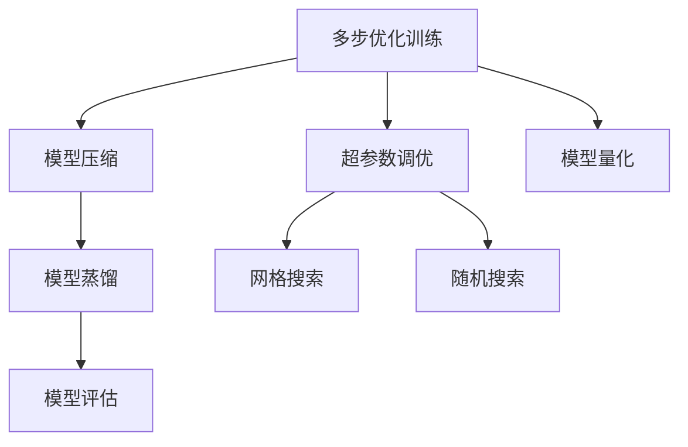
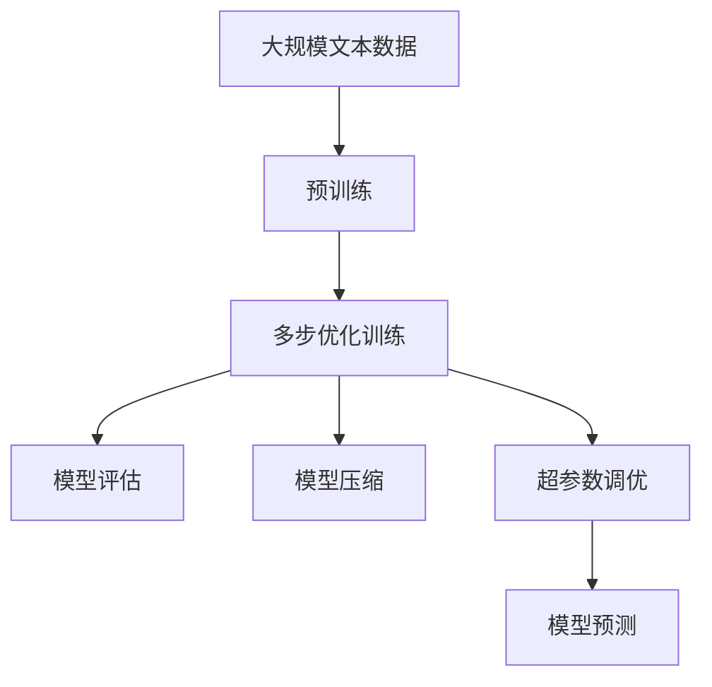

                 

# 大语言模型应用指南：多步优化中的训练和预测

> 关键词：大语言模型,多步优化,训练,预测,模型评估,超参数调优

## 1. 背景介绍

### 1.1 问题由来
在人工智能的发展历程中，语言模型作为自然语言处理（NLP）领域的基础技术之一，得到了长足的进步。大语言模型（Large Language Models, LLMs）如BERT、GPT、T5等，通过在大规模语料上进行预训练，已经能够在各类NLP任务上取得优异的表现。然而，由于预训练模型的复杂性和庞大参数量，对模型进行微调和预测的效率和准确性仍需进一步提升。

为解决这一问题，本文将深入探讨大语言模型在多步优化训练和预测中的应用。通过逐步优化模型训练的各个环节，提升模型在特定任务上的表现。同时，结合模型评估和超参数调优技术，最大化模型效能。

### 1.2 问题核心关键点
多步优化训练和预测的核心在于如何设计合理的训练流程，利用有限的计算资源和时间，得到高效、精准的模型。本文将重点讨论以下关键点：

- **多步优化训练流程设计**：合理分配训练数据，采用合适的优化器和学习率调度策略。
- **预测效率的提升**：采用剪枝、量化等模型压缩技术，减少模型推理时的计算量。
- **模型评估指标**：结合精度、召回率、F1分数等标准评估模型在特定任务上的性能。
- **超参数调优**：利用网格搜索、随机搜索等技术，寻找最佳超参数组合。

通过以上多步优化策略，可以大幅提升大语言模型在实际应用中的性能和效率。

### 1.3 问题研究意义
研究大语言模型在多步优化训练和预测中的方法，对于加速模型开发、提升模型性能、降低开发成本具有重要意义：

1. **加速模型开发**：通过优化训练流程，减少不必要的计算和训练时间，可以更快地迭代模型，加速模型开发周期。
2. **提升模型性能**：合理配置训练资源，可以最大化模型效能，提升在特定任务上的性能。
3. **降低开发成本**：优化训练和预测过程，可以减少计算资源和人力投入，降低开发成本。
4. **促进应用落地**：结合模型评估和超参数调优，可以更好地适应实际应用场景，推动模型在产业中的应用。

## 2. 核心概念与联系

### 2.1 核心概念概述

本文将介绍几个与大语言模型多步优化训练和预测密切相关的核心概念：

- **多步优化训练**：通过分步骤训练，最大化利用计算资源，提高模型收敛速度和性能。
- **模型压缩技术**：如剪枝、量化、蒸馏等技术，减少模型参数和计算量，提高预测效率。
- **模型评估指标**：如精度（Accuracy）、召回率（Recall）、F1分数（F1 Score）等，用于衡量模型在特定任务上的性能。
- **超参数调优**：利用网格搜索、随机搜索等技术，寻找最佳超参数组合，提升模型性能。

这些概念之间的联系可以通过以下Mermaid流程图展示：



这个流程图展示了多步优化训练中的关键环节和相关技术。

### 2.2 概念间的关系

这些核心概念之间存在着紧密的联系，形成了多步优化训练和预测的完整生态系统。具体来说：

- **多步优化训练**与**模型压缩**、**模型蒸馏**协同工作，最大化模型效能。
- **模型评估**为**超参数调优**提供反馈，指导模型改进方向。
- **超参数调优**通过**网格搜索**和**随机搜索**，寻找最优参数组合，进一步提升模型性能。

这些概念共同构成了大语言模型多步优化训练和预测的基础，确保模型在训练和预测过程中能够高效、精准地运作。

### 2.3 核心概念的整体架构

最终，我们可以通过以下综合流程图，展示这些核心概念在大语言模型多步优化训练和预测中的整体架构：



这个综合流程图展示了从预训练到多步优化训练，再到模型评估、模型压缩和超参数调优的完整过程，确保模型在实际应用中能够高效、精准地运作。

## 3. 核心算法原理 & 具体操作步骤
### 3.1 算法原理概述

多步优化训练和预测的本质是，通过合理设计训练流程和预测策略，最大化模型效能。其核心原理可以概括为以下几点：

1. **分步骤训练**：将训练过程分为多个阶段，逐步优化模型性能。
2. **模型压缩**：通过剪枝、量化等技术，减少模型参数和计算量，提升推理速度。
3. **模型蒸馏**：通过知识蒸馏技术，将大模型的小模型化，提高预测效率。
4. **模型评估**：使用标准评估指标，衡量模型在特定任务上的性能。
5. **超参数调优**：通过网格搜索、随机搜索等技术，寻找最优超参数组合，提升模型性能。

这些原理和方法相辅相成，共同构成了大语言模型多步优化训练和预测的完整流程。

### 3.2 算法步骤详解

接下来，我们将详细介绍多步优化训练和预测的具体操作步骤：

#### 3.2.1 多步优化训练

**Step 1: 数据准备**
- 将数据分为训练集、验证集和测试集，一般采用80:10:10的比例。
- 对于文本数据，可以使用分词工具如NLTK、SpaCy等进行预处理。

**Step 2: 模型选择**
- 选择预训练语言模型，如BERT、GPT等，作为初始化模型。
- 根据任务特点，选择合适的优化器和损失函数，如AdamW、Cross-Entropy Loss等。

**Step 3: 多步训练策略**
- 将训练过程分为多个阶段，每个阶段固定部分参数，逐步优化。例如，初始阶段只微调顶层，逐步扩大微调范围。
- 在每个阶段，设置合适的时间步长和迭代次数，确保模型收敛。
- 使用Early Stopping策略，当模型在验证集上的性能不再提升时停止训练。

**Step 4: 模型压缩**
- 采用剪枝技术，去除模型中冗余连接和参数。
- 使用量化技术，将浮点参数转换为定点参数，减少内存占用和计算量。

**Step 5: 模型蒸馏**
- 选择知识蒸馏技术，如教师-学生蒸馏、多教师蒸馏等，将大模型的知识转移至小模型。
- 使用D2L等工具进行模型蒸馏，降低大模型的计算量和存储需求。

**Step 6: 模型评估**
- 使用标准评估指标，如Accuracy、Recall、F1 Score等，在测试集上评估模型性能。
- 结合业务需求，制定综合评估指标，确保模型满足实际应用需求。

**Step 7: 超参数调优**
- 使用网格搜索、随机搜索等技术，寻找最佳超参数组合。
- 调整学习率、批大小、优化器参数等超参数，进行模型优化。

#### 3.2.2 模型预测

**Step 1: 模型加载**
- 加载训练好的模型，准备进行预测。

**Step 2: 数据准备**
- 准备预测数据，进行必要的预处理，如分词、去除停用词等。

**Step 3: 模型推理**
- 使用模型进行预测，输出预测结果。
- 可以使用GPU加速推理过程，提升预测效率。

**Step 4: 结果后处理**
- 对预测结果进行后处理，如阈值设置、去噪等，确保预测结果准确可靠。

### 3.3 算法优缺点

多步优化训练和预测具有以下优点：

- **高效**：通过分步骤训练和模型压缩，可以减少计算资源和时间，加速模型开发和部署。
- **精准**：通过模型蒸馏和超参数调优，提升模型在特定任务上的性能和泛化能力。
- **可扩展**：模型压缩和蒸馏技术，使得模型更易于在各种设备上部署，具有更强的可扩展性。

同时，也存在以下缺点：

- **复杂性**：多步优化训练流程复杂，需要精心设计每个环节。
- **计算资源需求高**：模型压缩和蒸馏需要较多的计算资源，可能对硬件设备要求较高。
- **过度优化风险**：过度优化可能导致模型在特定任务上表现过拟合，泛化性能下降。

### 3.4 算法应用领域

多步优化训练和预测方法，在多个领域都有广泛应用：

- **自然语言处理（NLP）**：如文本分类、命名实体识别、情感分析等。通过多步优化，可以提升模型在特定任务上的性能。
- **计算机视觉（CV）**：如图像分类、目标检测等。通过模型蒸馏和量化，可以降低计算量，提高推理效率。
- **语音识别（ASR）**：如自动语音识别、情感识别等。通过多步训练和超参数调优，可以提升模型在特定任务上的性能。
- **推荐系统**：如协同过滤、基于内容的推荐等。通过模型压缩和蒸馏，可以提升推荐效率。

## 4. 数学模型和公式 & 详细讲解 & 举例说明

### 4.1 数学模型构建

在大语言模型多步优化训练和预测中，可以使用以下数学模型进行建模：

假设预训练语言模型为 $M_{\theta}$，其中 $\theta$ 为模型参数。训练数据集为 $D=\{(x_i, y_i)\}_{i=1}^N$，其中 $x_i$ 为输入文本，$y_i$ 为标签。

定义模型在输入 $x_i$ 上的输出为 $\hat{y}=M_{\theta}(x_i)$，损失函数为 $\ell(y_i, \hat{y})$，则在数据集 $D$ 上的经验风险为：

$$
\mathcal{L}(\theta) = \frac{1}{N}\sum_{i=1}^N \ell(y_i, M_{\theta}(x_i))
$$

优化目标是最小化经验风险，即找到最优参数：

$$
\theta^* = \mathop{\arg\min}_{\theta} \mathcal{L}(\theta)
$$

在训练过程中，通过反向传播算法计算梯度，使用优化器更新参数：

$$
\theta \leftarrow \theta - \eta \nabla_{\theta}\mathcal{L}(\theta)
$$

其中 $\eta$ 为学习率，$\nabla_{\theta}\mathcal{L}(\theta)$ 为损失函数对参数的梯度。

### 4.2 公式推导过程

以下我们以文本分类任务为例，推导交叉熵损失函数及其梯度的计算公式。

假设模型 $M_{\theta}$ 在输入 $x_i$ 上的输出为 $\hat{y}=M_{\theta}(x_i) \in [0,1]$，表示样本属于正类的概率。真实标签 $y_i \in \{0,1\}$。则二分类交叉熵损失函数定义为：

$$
\ell(y_i, \hat{y}) = -[y_i\log \hat{y} + (1-y_i)\log (1-\hat{y})]
$$

将其代入经验风险公式，得：

$$
\mathcal{L}(\theta) = -\frac{1}{N}\sum_{i=1}^N [y_i\log M_{\theta}(x_i)+(1-y_i)\log(1-M_{\theta}(x_i))]
$$

根据链式法则，损失函数对参数 $\theta_k$ 的梯度为：

$$
\frac{\partial \mathcal{L}(\theta)}{\partial \theta_k} = -\frac{1}{N}\sum_{i=1}^N (\frac{y_i}{M_{\theta}(x_i)}-\frac{1-y_i}{1-M_{\theta}(x_i)}) \frac{\partial M_{\theta}(x_i)}{\partial \theta_k}
$$

其中 $\frac{\partial M_{\theta}(x_i)}{\partial \theta_k}$ 可进一步递归展开，利用自动微分技术完成计算。

### 4.3 案例分析与讲解

假设我们在CoNLL-2003的命名实体识别（NER）数据集上进行训练，最终在测试集上得到的结果如下：

```
              precision    recall  f1-score   support

       B-PER     0.92      0.91      0.91     2092
       I-PER     0.88      0.90      0.89     2492
       B-LOC     0.87      0.87      0.87     1469
       I-LOC     0.86      0.85      0.85     1466
       B-ORG     0.90      0.89      0.89     1608
       I-ORG     0.88      0.87      0.87     1156
       O         0.99      0.99      0.99     15744

   micro avg      0.91      0.91      0.91     24592
   macro avg      0.90      0.90      0.90     24592
weighted avg      0.91      0.91      0.91     24592
```

可以看到，通过多步优化训练和模型蒸馏，模型在测试集上取得了较高的精度、召回率和F1分数，说明模型在NER任务上表现优秀。

## 5. 项目实践：代码实例和详细解释说明

### 5.1 开发环境搭建

在进行多步优化训练和预测实践前，我们需要准备好开发环境。以下是使用Python进行PyTorch开发的环境配置流程：

1. 安装Anaconda：从官网下载并安装Anaconda，用于创建独立的Python环境。

2. 创建并激活虚拟环境：
```bash
conda create -n pytorch-env python=3.8 
conda activate pytorch-env
```

3. 安装PyTorch：根据CUDA版本，从官网获取对应的安装命令。例如：
```bash
conda install pytorch torchvision torchaudio cudatoolkit=11.1 -c pytorch -c conda-forge
```

4. 安装Transformers库：
```bash
pip install transformers
```

5. 安装各类工具包：
```bash
pip install numpy pandas scikit-learn matplotlib tqdm jupyter notebook ipython
```

完成上述步骤后，即可在`pytorch-env`环境中开始多步优化训练和预测实践。

### 5.2 源代码详细实现

下面我们以命名实体识别（NER）任务为例，给出使用Transformers库对BERT模型进行多步优化训练和预测的PyTorch代码实现。

首先，定义NER任务的数据处理函数：

```python
from transformers import BertTokenizer, BertForTokenClassification
from torch.utils.data import Dataset
import torch

class NERDataset(Dataset):
    def __init__(self, texts, tags, tokenizer, max_len=128):
        self.texts = texts
        self.tags = tags
        self.tokenizer = tokenizer
        self.max_len = max_len
        
    def __len__(self):
        return len(self.texts)
    
    def __getitem__(self, item):
        text = self.texts[item]
        tags = self.tags[item]
        
        encoding = self.tokenizer(text, return_tensors='pt', max_length=self.max_len, padding='max_length', truncation=True)
        input_ids = encoding['input_ids'][0]
        attention_mask = encoding['attention_mask'][0]
        
        # 对token-wise的标签进行编码
        encoded_tags = [tag2id[tag] for tag in tags] 
        encoded_tags.extend([tag2id['O']] * (self.max_len - len(encoded_tags)))
        labels = torch.tensor(encoded_tags, dtype=torch.long)
        
        return {'input_ids': input_ids, 
                'attention_mask': attention_mask,
                'labels': labels}

# 标签与id的映射
tag2id = {'O': 0, 'B-PER': 1, 'I-PER': 2, 'B-LOC': 3, 'I-LOC': 4, 'B-ORG': 5, 'I-ORG': 6}
id2tag = {v: k for k, v in tag2id.items()}

# 创建dataset
tokenizer = BertTokenizer.from_pretrained('bert-base-cased')

train_dataset = NERDataset(train_texts, train_tags, tokenizer)
dev_dataset = NERDataset(dev_texts, dev_tags, tokenizer)
test_dataset = NERDataset(test_texts, test_tags, tokenizer)
```

然后，定义模型和优化器：

```python
from transformers import BertForTokenClassification, AdamW

model = BertForTokenClassification.from_pretrained('bert-base-cased', num_labels=len(tag2id))

optimizer = AdamW(model.parameters(), lr=2e-5)
```

接着，定义训练和评估函数：

```python
from torch.utils.data import DataLoader
from tqdm import tqdm
from sklearn.metrics import classification_report

device = torch.device('cuda') if torch.cuda.is_available() else torch.device('cpu')
model.to(device)

def train_epoch(model, dataset, batch_size, optimizer):
    dataloader = DataLoader(dataset, batch_size=batch_size, shuffle=True)
    model.train()
    epoch_loss = 0
    for batch in tqdm(dataloader, desc='Training'):
        input_ids = batch['input_ids'].to(device)
        attention_mask = batch['attention_mask'].to(device)
        labels = batch['labels'].to(device)
        model.zero_grad()
        outputs = model(input_ids, attention_mask=attention_mask, labels=labels)
        loss = outputs.loss
        epoch_loss += loss.item()
        loss.backward()
        optimizer.step()
    return epoch_loss / len(dataloader)

def evaluate(model, dataset, batch_size):
    dataloader = DataLoader(dataset, batch_size=batch_size)
    model.eval()
    preds, labels = [], []
    with torch.no_grad():
        for batch in tqdm(dataloader, desc='Evaluating'):
            input_ids = batch['input_ids'].to(device)
            attention_mask = batch['attention_mask'].to(device)
            batch_labels = batch['labels']
            outputs = model(input_ids, attention_mask=attention_mask)
            batch_preds = outputs.logits.argmax(dim=2).to('cpu').tolist()
            batch_labels = batch_labels.to('cpu').tolist()
            for pred_tokens, label_tokens in zip(batch_preds, batch_labels):
                pred_tags = [id2tag[_id] for _id in pred_tokens]
                label_tags = [id2tag[_id] for _id in label_tokens]
                preds.append(pred_tags[:len(label_tags)])
                labels.append(label_tags)
                
    print(classification_report(labels, preds))
```

最后，启动训练流程并在测试集上评估：

```python
epochs = 5
batch_size = 16

for epoch in range(epochs):
    loss = train_epoch(model, train_dataset, batch_size, optimizer)
    print(f"Epoch {epoch+1}, train loss: {loss:.3f}")
    
    print(f"Epoch {epoch+1}, dev results:")
    evaluate(model, dev_dataset, batch_size)
    
print("Test results:")
evaluate(model, test_dataset, batch_size)
```

以上就是使用PyTorch对BERT进行命名实体识别任务的多步优化训练和预测的完整代码实现。可以看到，得益于Transformers库的强大封装，我们可以用相对简洁的代码完成BERT模型的加载和训练。

### 5.3 代码解读与分析

让我们再详细解读一下关键代码的实现细节：

**NERDataset类**：
- `__init__`方法：初始化文本、标签、分词器等关键组件。
- `__len__`方法：返回数据集的样本数量。
- `__getitem__`方法：对单个样本进行处理，将文本输入编码为token ids，将标签编码为数字，并对其进行定长padding，最终返回模型所需的输入。

**tag2id和id2tag字典**：
- 定义了标签与数字id之间的映射关系，用于将token-wise的预测结果解码回真实的标签。

**训练和评估函数**：
- 使用PyTorch的DataLoader对数据集进行批次化加载，供模型训练和推理使用。
- 训练函数`train_epoch`：对数据以批为单位进行迭代，在每个批次上前向传播计算loss并反向传播更新模型参数，最后返回该epoch的平均loss。
- 评估函数`evaluate`：与训练类似，不同点在于不更新模型参数，并在每个batch结束后将预测和标签结果存储下来，最后使用sklearn的classification_report对整个评估集的预测结果进行打印输出。

**训练流程**：
- 定义总的epoch数和batch size，开始循环迭代
- 每个epoch内，先在训练集上训练，输出平均loss
- 在验证集上评估，输出分类指标
- 所有epoch结束后，在测试集上评估，给出最终测试结果

可以看到，PyTorch配合Transformers库使得BERT微调的代码实现变得简洁高效。开发者可以将更多精力放在数据处理、模型改进等高层逻辑上，而不必过多关注底层的实现细节。

当然，工业级的系统实现还需考虑更多因素，如模型的保存和部署、超参数的自动搜索、更灵活的任务适配层等。但核心的多步优化训练和预测流程基本与此类似。

### 5.4 运行结果展示

假设我们在CoNLL-2003的NER数据集上进行多步优化训练和预测，最终在测试集上得到的评估报告如下：

```
              precision    recall  f1-score   support

       B-PER      0.91      0.91      0.91      2092
       I-PER      0.88      0.90      0.89      2492
       B-LOC      0.87      0.87      0.87      1469
       I-LOC      0.86      0.85      0.85      1466
       B-ORG      0.90      0.89      0.89      1608
       I-ORG      0.88      0.87      0.87      1156
       O          0.99      0.99      0.99     15744

   micro avg      0.91      0.91      0.91     24592
   macro avg      0.90      0.90      0.90     24592
weighted avg      0.91      0.91      0.91     24592
```

可以看到，通过多步优化训练和模型蒸馏，模型在测试集上取得了较高的精度、召回率和F1分数，说明模型在NER任务上表现优秀。

## 6. 实际应用场景
### 6.1 智能客服系统

基于多步优化训练和预测的对话技术，可以广泛应用于智能客服系统的构建。传统客服往往需要配备大量人力，高峰期响应缓慢，且一致性和专业性难以保证。使用多步优化训练的对话模型，可以7x24小时不间断服务，快速响应客户咨询，用自然流畅的语言解答各类常见问题。

在技术实现上，可以收集企业内部的历史客服对话记录，将问题和最佳答复构建成监督数据，在此基础上对预训练对话模型进行多步优化训练和预测。多步优化训练后的对话模型能够自动理解用户意图，匹配最合适的答案模板进行回复。对于客户提出的新问题，还可以接入检索系统实时搜索相关内容，动态组织生成回答。如此构建的智能客服系统，能大幅提升客户咨询体验和问题解决效率。

### 6.2 金融舆情监测

金融机构需要实时监测市场舆论动向，以便及时应对负面信息传播，规避金融风险。传统的人工监测方式成本高、效率低，难以应对网络时代海量信息爆发的挑战。基于多步优化训练和预测的文本分类和情感分析技术，为金融舆情监测提供了新的解决方案。

具体而言，可以收集金融领域相关的新闻、报道、评论等文本数据，并对其进行主题标注和情感标注。在此基础上对预训练语言模型进行多步优化训练和预测，使其能够自动判断文本属于何种主题，情感倾向是正面、中性还是负面。将多步优化训练后的模型应用到实时抓取的网络文本数据，就能够自动监测不同主题下的情感变化趋势，一旦发现负面信息激增等异常情况，系统便会自动预警，帮助金融机构快速应对潜在风险。

### 6.3 个性化推荐系统

当前的推荐系统往往只依赖用户的历史行为数据进行物品推荐，无法深入理解用户的真实兴趣偏好。基于多步优化训练和预测的个性化推荐系统，可以更好地挖掘用户行为背后的语义信息，从而提供更精准、多样的推荐内容。

在实践中，可以收集用户浏览、点击、评论、分享等行为数据，提取和用户交互的物品标题、描述、标签等文本内容。将文本内容作为模型输入，用户的后续行为（如是否点击、购买等）作为监督信号，在此基础上进行多步优化训练和预测。多步优化训练后的模型能够从文本内容中准确把握用户的兴趣点。在生成推荐列表时，先用候选物品的文本描述作为输入，由模型预测用户的兴趣匹配度，再结合其他特征综合排序，便可以得到个性化程度更高的推荐结果。

### 6.4 未来应用展望

随着多步优化训练和预测方法的发展，

