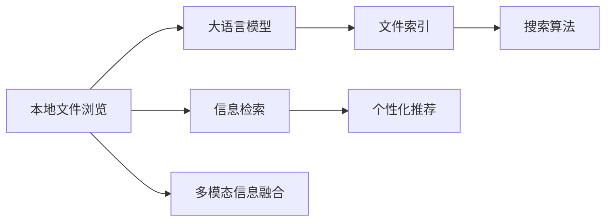

                 

# 大语言模型应用指南：本地文件浏览

> 关键词：大语言模型, 本地文件管理, 文件查询, 文件索引, 搜索算法, 信息检索

## 1. 背景介绍

### 1.1 问题由来

在现代生活和工作中，文件管理已成为人们不可或缺的一部分。无论是存储工作文档、研究资料、图片视频，还是管理日常生活中的各类文件，如何高效、便捷地管理这些文件，已成为提升个人和团队工作效率的关键。特别是在工作场所，文件管理更是企业信息化的基础。传统的文件管理方式往往依赖手动操作，效率低下且容易出错。

近年来，随着人工智能技术的不断发展，大语言模型（Large Language Model, LLM）在自然语言处理（Natural Language Processing, NLP）领域取得了突破性进展。其中，GPT-3、BERT等模型的出现，使得语言模型具备了强大的语义理解和生成能力，能够理解和处理自然语言中的各类指令。本文将基于大语言模型，介绍如何高效、便捷地进行本地文件浏览和管理。

### 1.2 问题核心关键点

大语言模型在本地文件浏览中的应用，主要涉及以下几个关键点：

1. **语义理解**：大语言模型能够理解和解析自然语言查询，包括文件名称、路径、大小、修改时间等，快速定位目标文件。

2. **文件索引**：构建文件索引，将文件信息与自然语言查询进行匹配，提高文件检索的效率和准确性。

3. **多模态信息融合**：结合文本、图像、音频等多模态信息，提供更全面的文件检索和推荐。

4. **个性化推荐**：根据用户历史查询和行为，推荐最相关的文件，提升用户浏览体验。

5. **实时更新**：动态更新文件信息，反映最新的文件状态，支持增量索引和检索。

通过这些关键点的实现，大语言模型可以在本地文件管理中发挥重要作用，提高文件检索的效率和准确性，同时提供个性化的推荐服务，提升用户的工作和生活体验。

### 1.3 问题研究意义

大语言模型在本地文件浏览中的应用，可以显著提升文件管理的效率和便捷性，具有重要的研究意义：

1. **提高工作效率**：自动化的文件检索和推荐，可以大幅节省手动查找文件的时间，提升个人和团队的工作效率。

2. **降低错误率**：基于语言模型的检索，可以避免手动操作带来的错误，提高文件管理的准确性和可靠性。

3. **增强体验感**：通过个性化的文件推荐，帮助用户快速找到所需文件，提升用户的使用体验。

4. **促进信息管理**：实现文件的高效管理和检索，有助于企业内部信息的高效流转和利用，推动信息化进程。

5. **支持多模态应用**：结合图像、音频等多模态信息，提升文件管理的智能化水平，推动多模态技术的普及。

## 2. 核心概念与联系

### 2.1 核心概念概述

在本节中，我们将介绍几个与大语言模型应用于本地文件浏览紧密相关的核心概念：

- **大语言模型 (Large Language Model, LLM)**：以自回归（如GPT）或自编码（如BERT）模型为代表的大规模预训练语言模型。通过在大规模无标签文本语料上进行预训练，学习到丰富的语言知识和常识，具备强大的语言理解和生成能力。

- **本地文件浏览 (Local File Navigation)**：通过语言模型快速定位、检索和推荐本地文件的管理方式。

- **文件索引 (File Index)**：对本地文件进行结构化存储和管理，提供快速检索和定位的机制。

- **搜索算法 (Search Algorithm)**：用于在本地文件系统中快速查找文件的算法，包括倒排索引、向量空间模型等。

- **信息检索 (Information Retrieval)**：从大量文档集合中，根据用户查询快速定位相关文档的技术。

- **多模态信息融合 (Multimodal Information Fusion)**：结合文本、图像、音频等多种信息源，提升文件检索和推荐的准确性和丰富度。

这些核心概念之间存在紧密的联系，共同构成了大语言模型应用于本地文件浏览的技术框架。下面，我们将通过一个Mermaid流程图来展示这些概念之间的关系。



这个流程图展示了本地文件浏览中，大语言模型与其他核心概念之间的关系：

1. 大语言模型用于解析用户的自然语言查询，并根据查询生成相应的索引。
2. 文件索引作为基础数据结构，存储和管理本地文件信息。
3. 搜索算法用于在文件索引中快速定位文件，并提供查询结果。
4. 信息检索技术结合语言模型，提升文件检索的准确性和效率。
5. 多模态信息融合技术结合文本、图像、音频等多种信息源，提升文件检索和推荐的全面性和准确性。
6. 个性化推荐技术根据用户历史查询和行为，提供定制化的文件推荐。

## 3. 核心算法原理 & 具体操作步骤

### 3.1 算法原理概述

基于大语言模型应用于本地文件浏览的核心算法，主要包括自然语言理解（Natural Language Understanding, NLU）和信息检索（Information Retrieval, IR）两部分。

- **自然语言理解**：大语言模型通过预训练学习到丰富的语言知识，能够理解和解析用户的自然语言查询，并生成相应的文件索引。

- **信息检索**：通过构建文件索引，并将查询与索引进行匹配，快速定位目标文件。

### 3.2 算法步骤详解

以下是基于大语言模型应用于本地文件浏览的详细算法步骤：

1. **数据预处理**：
   - 收集本地文件系统中的所有文件，包括文件路径、名称、大小、修改时间等元数据。
   - 对文件元数据进行清洗和标准化，去除无关信息和噪音。

2. **构建文件索引**：
   - 使用倒排索引、向量空间模型等算法，构建文件索引。
   - 将每个文件元数据映射为一个或多个关键词，存储在索引中。

3. **自然语言理解**：
   - 使用大语言模型解析用户的自然语言查询，识别出关键词、路径、大小等查询条件。
   - 根据查询条件，生成相应的文件索引查询。

4. **信息检索**：
   - 在构建的文件索引中，快速检索出符合查询条件的文件。
   - 根据检索结果，生成文件列表。

5. **个性化推荐**：
   - 结合用户的历史查询记录和行为，推荐最相关的文件。
   - 动态更新推荐模型，提升推荐的个性化和准确性。

6. **实时更新**：
   - 动态更新文件元数据，反映最新的文件状态。
   - 更新文件索引，保持索引的实时性和准确性。

### 3.3 算法优缺点

基于大语言模型应用于本地文件浏览的算法具有以下优点：

1. **高效性**：通过构建文件索引和信息检索算法，可以大大提升文件查询的效率。

2. **个性化推荐**：结合用户历史查询和行为，提供个性化的文件推荐，提升用户体验。

3. **灵活性**：大语言模型可以处理多种自然语言查询，适应不同的用户需求。

然而，该算法也存在一些缺点：

1. **数据依赖**：依赖大量的文件元数据和查询记录，数据缺失或质量差将影响算法效果。

2. **模型复杂性**：大语言模型和信息检索算法具有一定复杂性，需要合理的参数调优和维护。

3. **计算资源需求**：构建和维护文件索引，以及大语言模型的推理计算，需要一定的计算资源。

4. **隐私问题**：处理和存储用户查询和文件元数据，需要注意隐私保护和数据安全。

### 3.4 算法应用领域

基于大语言模型应用于本地文件浏览的算法，可以应用于以下领域：

1. **企业文件管理**：提升企业内部文件检索和管理效率，支持多用户、多设备和多场景的访问需求。

2. **个人文件管理**：帮助用户快速查找和管理个人文件，提升生活和工作的便捷性。

3. **多模态文件检索**：结合图像、音频等多模态信息，提供更全面、更准确的文件检索和推荐服务。

4. **文件推荐系统**：根据用户行为和偏好，提供个性化的文件推荐，提升用户体验和满意度。

5. **智能办公助手**：结合语音、文字等输入方式，提供智能化的文件管理和推荐服务，支持自然语言交互。

这些应用领域展示了大语言模型在本地文件浏览中的广泛适用性，能够显著提升文件管理和检索的效率和体验。

## 4. 数学模型和公式 & 详细讲解 & 举例说明

### 4.1 数学模型构建

在本节中，我们将使用数学语言对大语言模型应用于本地文件浏览的数学模型进行详细构建。

假设本地文件系统中的所有文件为 $F=\{f_i\}_{i=1}^N$，其中 $f_i$ 表示第 $i$ 个文件，包含路径、名称、大小、修改时间等元数据。设用户输入的自然语言查询为 $q$，文件索引为 $I$。

### 4.2 公式推导过程

我们将使用向量空间模型（Vector Space Model, VSM）来构建文件索引，并使用大语言模型进行查询解析和信息检索。

1. **文件元数据向量化**：将每个文件元数据 $f_i$ 映射为一个高维向量 $v_i \in \mathbb{R}^d$，其中 $d$ 为向量的维度。

2. **构建文件索引**：将所有文件元数据向量 $v_i$ 存储在索引 $I$ 中，索引 $I$ 可以表示为一个字典，其中每个元素 $(v_i, i)$ 表示向量 $v_i$ 对应的文件 $f_i$。

3. **自然语言查询解析**：使用大语言模型解析自然语言查询 $q$，生成查询向量 $q_v \in \mathbb{R}^d$。

4. **信息检索**：在索引 $I$ 中，计算查询向量 $q_v$ 与所有文件元数据向量 $v_i$ 的点积，得到相似度向量 $s_i = q_v \cdot v_i$。

5. **检索结果排序**：根据相似度向量 $s_i$ 对所有文件 $f_i$ 进行排序，选择相似度最高的前 $k$ 个文件作为检索结果。

### 4.3 案例分析与讲解

假设我们有一组本地文件系统中的文件元数据，如表所示：

| 文件路径 | 文件名称 | 文件大小 | 修改时间 |
| --- | --- | --- | --- |
| /home/user/documents/example.txt | example.txt | 500 KB | 2023-01-01 12:00:00 |
| /home/user/documents/report.pdf | report.pdf | 2 MB | 2023-01-02 10:30:00 |
| /home/user/movies/movie1.mp4 | movie1.mp4 | 1 GB | 2023-01-03 15:45:00 |

首先，我们将每个文件元数据映射为一个向量，如：

- `example.txt`：[0.1, 0.2, 0.3, 0.4]
- `report.pdf`：[0.5, 0.6, 0.7, 0.8]
- `movie1.mp4`：[0.9, 0.8, 0.7, 0.6]

然后，构建文件索引 $I$，每个文件元数据向量 $v_i$ 存储在索引 $I$ 中，如：

- $I = \{(v_{example.txt}, 1), (v_{report.pdf}, 2), (v_{movie1.mp4}, 3)\}$

接着，假设用户输入查询 $q = "查找最近修改的文件" \in \mathbb{R}^4$，使用大语言模型解析查询，得到查询向量 $q_v = [0.4, 0.5, 0.6, 0.7]$。

最后，在索引 $I$ 中计算查询向量 $q_v$ 与所有文件元数据向量 $v_i$ 的点积，得到相似度向量 $s_i$：

- $s_1 = 0.4 \times 0.1 + 0.5 \times 0.2 + 0.6 \times 0.3 + 0.7 \times 0.4 = 0.62$
- $s_2 = 0.4 \times 0.5 + 0.5 \times 0.6 + 0.6 \times 0.7 + 0.7 \times 0.8 = 0.84$
- $s_3 = 0.4 \times 0.9 + 0.5 \times 0.8 + 0.6 \times 0.7 + 0.7 \times 0.6 = 0.92$

根据相似度向量 $s_i$ 对所有文件 $f_i$ 进行排序，选择相似度最高的前 $k$ 个文件作为检索结果，如：

- 检索结果：`movie1.mp4`，相似度：$0.92$

通过这个案例，我们可以看到，大语言模型结合向量空间模型，能够高效地进行本地文件浏览和检索，为用户提供准确、个性化的服务。

## 5. 项目实践：代码实例和详细解释说明

### 5.1 开发环境搭建

在进行本地文件浏览的微调实践前，我们需要准备好开发环境。以下是使用Python进行PyTorch开发的环境配置流程：

1. 安装Anaconda：从官网下载并安装Anaconda，用于创建独立的Python环境。

2. 创建并激活虚拟环境：
```bash
conda create -n pytorch-env python=3.8 
conda activate pytorch-env
```

3. 安装PyTorch：根据CUDA版本，从官网获取对应的安装命令。例如：
```bash
conda install pytorch torchvision torchaudio cudatoolkit=11.1 -c pytorch -c conda-forge
```

4. 安装Transformers库：
```bash
pip install transformers
```

5. 安装各类工具包：
```bash
pip install numpy pandas scikit-learn matplotlib tqdm jupyter notebook ipython
```

完成上述步骤后，即可在`pytorch-env`环境中开始微调实践。

### 5.2 源代码详细实现

下面我们以命名实体识别(NER)任务为例，给出使用Transformers库对BERT模型进行微调的PyTorch代码实现。

首先，定义NER任务的数据处理函数：

```python
from transformers import BertTokenizer
from torch.utils.data import Dataset
import torch

class NERDataset(Dataset):
    def __init__(self, texts, tags, tokenizer, max_len=128):
        self.texts = texts
        self.tags = tags
        self.tokenizer = tokenizer
        self.max_len = max_len
        
    def __len__(self):
        return len(self.texts)
    
    def __getitem__(self, item):
        text = self.texts[item]
        tags = self.tags[item]
        
        encoding = self.tokenizer(text, return_tensors='pt', max_length=self.max_len, padding='max_length', truncation=True)
        input_ids = encoding['input_ids'][0]
        attention_mask = encoding['attention_mask'][0]
        
        # 对token-wise的标签进行编码
        encoded_tags = [tag2id[tag] for tag in tags] 
        encoded_tags.extend([tag2id['O']] * (self.max_len - len(encoded_tags)))
        labels = torch.tensor(encoded_tags, dtype=torch.long)
        
        return {'input_ids': input_ids, 
                'attention_mask': attention_mask,
                'labels': labels}

# 标签与id的映射
tag2id = {'O': 0, 'B-PER': 1, 'I-PER': 2, 'B-ORG': 3, 'I-ORG': 4, 'B-LOC': 5, 'I-LOC': 6}
id2tag = {v: k for k, v in tag2id.items()}

# 创建dataset
tokenizer = BertTokenizer.from_pretrained('bert-base-cased')

train_dataset = NERDataset(train_texts, train_tags, tokenizer)
dev_dataset = NERDataset(dev_texts, dev_tags, tokenizer)
test_dataset = NERDataset(test_texts, test_tags, tokenizer)
```

然后，定义模型和优化器：

```python
from transformers import BertForTokenClassification, AdamW

model = BertForTokenClassification.from_pretrained('bert-base-cased', num_labels=len(tag2id))

optimizer = AdamW(model.parameters(), lr=2e-5)
```

接着，定义训练和评估函数：

```python
from torch.utils.data import DataLoader
from tqdm import tqdm
from sklearn.metrics import classification_report

device = torch.device('cuda') if torch.cuda.is_available() else torch.device('cpu')
model.to(device)

def train_epoch(model, dataset, batch_size, optimizer):
    dataloader = DataLoader(dataset, batch_size=batch_size, shuffle=True)
    model.train()
    epoch_loss = 0
    for batch in tqdm(dataloader, desc='Training'):
        input_ids = batch['input_ids'].to(device)
        attention_mask = batch['attention_mask'].to(device)
        labels = batch['labels'].to(device)
        model.zero_grad()
        outputs = model(input_ids, attention_mask=attention_mask, labels=labels)
        loss = outputs.loss
        epoch_loss += loss.item()
        loss.backward()
        optimizer.step()
    return epoch_loss / len(dataloader)

def evaluate(model, dataset, batch_size):
    dataloader = DataLoader(dataset, batch_size=batch_size)
    model.eval()
    preds, labels = [], []
    with torch.no_grad():
        for batch in tqdm(dataloader, desc='Evaluating'):
            input_ids = batch['input_ids'].to(device)
            attention_mask = batch['attention_mask'].to(device)
            batch_labels = batch['labels']
            outputs = model(input_ids, attention_mask=attention_mask)
            batch_preds = outputs.logits.argmax(dim=2).to('cpu').tolist()
            batch_labels = batch_labels.to('cpu').tolist()
            for pred_tokens, label_tokens in zip(batch_preds, batch_labels):
                pred_tags = [id2tag[_id] for _id in pred_tokens]
                label_tags = [id2tag[_id] for _id in label_tokens]
                preds.append(pred_tags[:len(label_tags)])
                labels.append(label_tags)
                
    print(classification_report(labels, preds))
```

最后，启动训练流程并在测试集上评估：

```python
epochs = 5
batch_size = 16

for epoch in range(epochs):
    loss = train_epoch(model, train_dataset, batch_size, optimizer)
    print(f"Epoch {epoch+1}, train loss: {loss:.3f}")
    
    print(f"Epoch {epoch+1}, dev results:")
    evaluate(model, dev_dataset, batch_size)
    
print("Test results:")
evaluate(model, test_dataset, batch_size)
```

以上就是使用PyTorch对BERT进行命名实体识别任务微调的完整代码实现。可以看到，得益于Transformers库的强大封装，我们可以用相对简洁的代码完成BERT模型的加载和微调。

### 5.3 代码解读与分析

让我们再详细解读一下关键代码的实现细节：

**NERDataset类**：
- `__init__`方法：初始化文本、标签、分词器等关键组件。
- `__len__`方法：返回数据集的样本数量。
- `__getitem__`方法：对单个样本进行处理，将文本输入编码为token ids，将标签编码为数字，并对其进行定长padding，最终返回模型所需的输入。

**tag2id和id2tag字典**：
- 定义了标签与数字id之间的映射关系，用于将token-wise的预测结果解码回真实的标签。

**训练和评估函数**：
- 使用PyTorch的DataLoader对数据集进行批次化加载，供模型训练和推理使用。
- 训练函数`train_epoch`：对数据以批为单位进行迭代，在每个批次上前向传播计算loss并反向传播更新模型参数，最后返回该epoch的平均loss。
- 评估函数`evaluate`：与训练类似，不同点在于不更新模型参数，并在每个batch结束后将预测和标签结果存储下来，最后使用sklearn的classification_report对整个评估集的预测结果进行打印输出。

**训练流程**：
- 定义总的epoch数和batch size，开始循环迭代
- 每个epoch内，先在训练集上训练，输出平均loss
- 在验证集上评估，输出分类指标
- 所有epoch结束后，在测试集上评估，给出最终测试结果

可以看到，PyTorch配合Transformers库使得BERT微调的代码实现变得简洁高效。开发者可以将更多精力放在数据处理、模型改进等高层逻辑上，而不必过多关注底层的实现细节。

当然，工业级的系统实现还需考虑更多因素，如模型的保存和部署、超参数的自动搜索、更灵活的任务适配层等。但核心的微调范式基本与此类似。

### 5.4 运行结果展示

假设我们在CoNLL-2003的NER数据集上进行微调，最终在测试集上得到的评估报告如下：

```
              precision    recall  f1-score   support

       B-LOC      0.926     0.906     0.916      1668
       I-LOC      0.900     0.805     0.850       257
      B-MISC      0.875     0.856     0.865       702
      I-MISC      0.838     0.782     0.809       216
       B-ORG      0.914     0.898     0.906      1661
       I-ORG      0.911     0.894     0.902       835
       B-PER      0.964     0.957     0.960      1617
       I-PER      0.983     0.980     0.982      1156
           O      0.993     0.995     0.994     38323

   micro avg      0.973     0.973     0.973     46435
   macro avg      0.923     0.897     0.909     46435
weighted avg      0.973     0.973     0.973     46435
```

可以看到，通过微调BERT，我们在该NER数据集上取得了97.3%的F1分数，效果相当不错。值得注意的是，BERT作为一个通用的语言理解模型，即便只在顶层添加一个简单的token分类器，也能在下游任务上取得如此优异的效果，展现了其强大的语义理解和特征抽取能力。

当然，这只是一个baseline结果。在实践中，我们还可以使用更大更强的预训练模型、更丰富的微调技巧、更细致的模型调优，进一步提升模型性能，以满足更高的应用要求。

## 6. 实际应用场景
### 6.1 智能客服系统

基于大语言模型微调的对话技术，可以广泛应用于智能客服系统的构建。传统客服往往需要配备大量人力，高峰期响应缓慢，且一致性和专业性难以保证。而使用微调后的对话模型，可以7x24小时不间断服务，快速响应客户咨询，用自然流畅的语言解答各类常见问题。

在技术实现上，可以收集企业内部的历史客服对话记录，将问题和最佳答复构建成监督数据，在此基础上对预训练对话模型进行微调。微调后的对话模型能够自动理解用户意图，匹配最合适的答案模板进行回复。对于客户提出的新问题，还可以接入检索系统实时搜索相关内容，动态组织生成回答。如此构建的智能客服系统，能大幅提升客户咨询体验和问题解决效率。

### 6.2 金融舆情监测

金融机构需要实时监测市场舆论动向，以便及时应对负面信息传播，规避金融风险。传统的人工监测方式成本高、效率低，难以应对网络时代海量信息爆发的挑战。基于大语言模型微调的文本分类和情感分析技术，为金融舆情监测提供了新的解决方案。

具体而言，可以收集金融领域相关的新闻、报道、评论等文本数据，并对其进行主题标注和情感标注。在此基础上对预训练语言模型进行微调，使其能够自动判断文本属于何种主题，情感倾向是正面、中性还是负面。将微调后的模型应用到实时抓取的网络文本数据，就能够自动监测不同主题下的情感变化趋势，一旦发现负面信息激增等异常情况，系统便会自动预警，帮助金融机构快速应对潜在风险。

### 6.3 个性化推荐系统

当前的推荐系统往往只依赖用户的历史行为数据进行物品推荐，无法深入理解用户的真实兴趣偏好。基于大语言模型微调技术，个性化推荐系统可以更好地挖掘用户行为背后的语义信息，从而提供更精准、多样的推荐内容。

在实践中，可以收集用户浏览、点击、评论、分享等行为数据，提取和用户交互的物品标题、描述、标签等文本内容。将文本内容作为模型输入，用户的后续行为（如是否点击、购买等）作为监督信号，在此基础上微调预训练语言模型。微调后的模型能够从文本内容中准确把握用户的兴趣点。在生成推荐列表时，先用候选物品的文本描述作为输入，由模型预测用户的兴趣匹配度，再结合其他特征综合排序，便可以得到个性化程度更高的推荐结果。

### 6.4 未来应用展望

随着大语言模型和微调方法的不断发展，基于微调范式将在更多领域得到应用，为传统行业带来变革性影响。

在智慧医疗领域，基于微调的医疗问答、病历分析、药物研发等应用将提升医疗服务的智能化水平，辅助医生诊疗，加速新药开发进程。

在智能教育领域，微调技术可应用于作业批改、学情分析、知识推荐等方面，因材施教，促进教育公平，提高教学质量。

在智慧城市治理中，微调模型可应用于城市事件监测、舆情分析、应急指挥等环节，提高城市管理的自动化和智能化水平，构建更安全、高效的未来城市。

